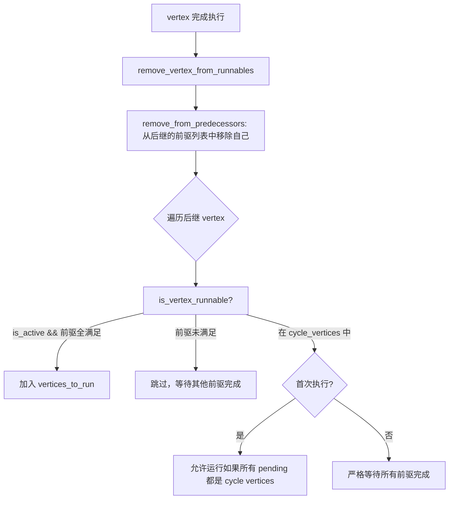
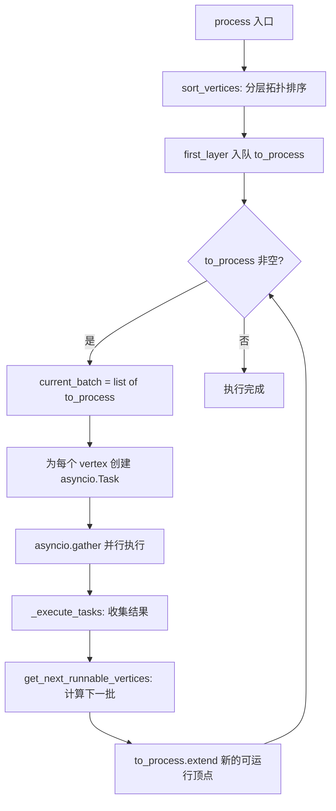

# PD-02.29 Langflow — Graph 引擎 DAG 可视化工作流编排

> 文档编号：PD-02.29
> 来源：Langflow `src/lfx/src/lfx/graph/graph/base.py`
> GitHub：https://github.com/langflow-ai/langflow.git
> 问题域：PD-02 多 Agent 编排 Multi-Agent Orchestration
> 状态：可复用方案

---

## 第 1 章 问题与动机

### 1.1 核心问题

可视化 AI 工作流编排面临三大挑战：

1. **DAG 拓扑排序与并行调度** — 用户在画布上拖拽连线构建的工作流本质是一个有向图，需要自动推导执行顺序并最大化并行度
2. **循环边支持** — 传统 DAG 不支持循环，但 Agent 场景中循环（如 Loop 组件、条件重试）是刚需，需要在保持拓扑排序的同时支持受控循环
3. **条件路由与分支排除** — ConditionalRouter 等组件需要在运行时动态决定哪些分支执行、哪些跳过，且排除状态需要在循环迭代间正确重置

### 1.2 Langflow 的解法概述

Langflow 构建了一个完整的 Graph 引擎，核心设计：

1. **Vertex + CycleEdge 图模型** — 每个组件是一个 Vertex，边统一用 CycleEdge（Edge 的子类）表示，天然支持循环标记（`base.py:110-111`）
2. **RunnableVerticesManager 调度器** — 独立的调度状态管理器，维护 predecessor map、vertices_to_run、vertices_being_run 三个集合，实现前驱依赖追踪（`runnable_vertices_manager.py:4-11`）
3. **分层拓扑排序** — `layered_topological_sort` 将顶点分层，同层顶点可并行执行，通过 `asyncio.gather` 实现真正的并行（`utils.py:463-604`）
4. **条件排除双系统** — ACTIVE/INACTIVE 状态用于循环管理（每轮重置），`conditionally_excluded_vertices` 用于条件路由（持久化直到同源重新评估）（`base.py:107-109`）
5. **StateModel 动态状态** — 通过 `create_state_model_from_graph` 为整个图动态生成 Pydantic 状态模型，实现类型安全的跨顶点状态共享（`state_model.py:11-66`）

### 1.3 设计思想

| 设计原则 | 具体实现 | 理由 | 替代方案 |
|----------|----------|------|----------|
| 图即数据结构 | Graph 类持有 vertex_map、predecessor_map、successor_map、in_degree_map | 所有调度决策基于图论算法，不依赖硬编码流程 | 状态机（不适合动态拓扑） |
| 边统一为 CycleEdge | 所有边都是 CycleEdge，通过 is_cycle 标记区分 | 简化边处理逻辑，循环边只是普通边的特殊状态 | 双类型边系统（增加复杂度） |
| 调度器与图分离 | RunnableVerticesManager 独立管理运行状态 | 图结构不可变，运行状态可序列化/恢复 | 状态内嵌到 Vertex（耦合过重） |
| 分层并行 | 拓扑排序产出 layers，同层 asyncio.gather | 最大化并行度，同时保证依赖顺序 | 全串行（浪费资源） |
| 双系统条件排除 | ACTIVE/INACTIVE + conditionally_excluded_vertices | 循环需要每轮重置状态，条件路由需要持久排除 | 单一状态系统（循环与条件冲突） |

---

## 第 2 章 源码实现分析

### 2.1 架构概览

Langflow 的编排核心是一个自研 Graph 引擎，不依赖 LangGraph 等外部框架：

```
┌─────────────────────────────────────────────────────────┐
│                      Graph Engine                        │
│                                                          │
│  ┌──────────┐    ┌───────────────────┐    ┌──────────┐  │
│  │  Vertex   │───→│   CycleEdge       │───→│  Vertex  │  │
│  │ (组件实例) │    │ (数据+循环标记)    │    │ (组件实例)│  │
│  └──────────┘    └───────────────────┘    └──────────┘  │
│       │                                        │         │
│       ▼                                        ▼         │
│  ┌──────────────────────────────────────────────────┐   │
│  │         RunnableVerticesManager                   │   │
│  │  ┌─────────────┐ ┌──────────────┐ ┌───────────┐  │   │
│  │  │ run_map     │ │vertices_to_  │ │vertices_  │  │   │
│  │  │ (后继映射)   │ │run (待运行)  │ │being_run  │  │   │
│  │  └─────────────┘ └──────────────┘ └───────────┘  │   │
│  └──────────────────────────────────────────────────┘   │
│       │                                                  │
│       ▼                                                  │
│  ┌──────────────────────────────────────────────────┐   │
│  │         Execution Loop (process/astep)            │   │
│  │  sort_vertices → build_vertex → get_next_runnable │   │
│  │  → asyncio.gather(parallel tasks) → next layer    │   │
│  └──────────────────────────────────────────────────┘   │
└─────────────────────────────────────────────────────────┘
```

### 2.2 核心实现

#### 2.2.1 RunnableVerticesManager — 前驱依赖调度器



对应源码 `runnable_vertices_manager.py:56-100`：

```python
def is_vertex_runnable(self, vertex_id: str, *, is_active: bool, is_loop: bool = False) -> bool:
    """Determines if a vertex is runnable based on its active state and predecessor fulfillment."""
    if not is_active:
        return False
    if vertex_id in self.vertices_being_run:
        return False
    if vertex_id not in self.vertices_to_run:
        return False
    return self.are_all_predecessors_fulfilled(vertex_id, is_loop=is_loop)

def are_all_predecessors_fulfilled(self, vertex_id: str, *, is_loop: bool) -> bool:
    pending = self.run_predecessors.get(vertex_id, [])
    if not pending:
        return True
    # 循环顶点的特殊处理：首次允许启动，后续严格等待
    if vertex_id in self.cycle_vertices:
        pending_set = set(pending)
        running_predecessors = pending_set & self.vertices_being_run
        if vertex_id in self.ran_at_least_once:
            return not (pending_set or running_predecessors)
        return is_loop and pending_set <= self.cycle_vertices
    return False
```

关键设计：循环顶点首次执行时放宽前驱约束（只要所有 pending 都是 cycle vertices 就允许启动），后续迭代则严格等待所有前驱完成，防止数据竞争。

#### 2.2.2 Graph.process — 分层并行执行引擎



对应源码 `base.py:1651-1715`：

```python
async def process(self, *, fallback_to_env_vars: bool,
                  start_component_id: str | None = None,
                  event_manager: EventManager | None = None) -> Graph:
    """Processes the graph with vertices in each layer run in parallel."""
    first_layer = self.sort_vertices(start_component_id=start_component_id)
    vertex_task_run_count: dict[str, int] = {}
    to_process = deque(first_layer)
    lock = asyncio.Lock()
    while to_process:
        current_batch = list(to_process)
        to_process.clear()
        tasks = []
        for vertex_id in current_batch:
            vertex = self.get_vertex(vertex_id)
            task = asyncio.create_task(
                self.build_vertex(vertex_id=vertex_id, user_id=self.user_id,
                                  inputs_dict={}, fallback_to_env_vars=fallback_to_env_vars,
                                  get_cache=get_cache_func, set_cache=set_cache_func,
                                  event_manager=event_manager),
                name=f"{vertex.id} Run {vertex_task_run_count.get(vertex_id, 0)}",
            )
            tasks.append(task)
        next_runnable_vertices = await self._execute_tasks(
            tasks, lock=lock, has_webhook_component=has_webhook_component)
        if not next_runnable_vertices:
            break
        to_process.extend(next_runnable_vertices)
```

核心模式：**波前推进（wavefront propagation）**。每一轮取出所有可运行顶点，用 `asyncio.gather` 并行执行，完成后计算下一波可运行顶点，直到队列为空。

### 2.3 实现细节

#### 条件路由双系统

Langflow 在 `base.py:107-109` 维护两套独立的排除机制：

```python
# 循环管理：每轮迭代后通过 reset_inactivated_vertices 重置
self.inactivated_vertices: set = set()
# 条件路由：持久化直到同源 vertex 重新评估
self.conditionally_excluded_vertices: set = set()
self.conditional_exclusion_sources: dict[str, set[str]] = {}
```

`exclude_branch_conditionally`（`base.py:994-1045`）在排除新分支前，先清除同一源顶点之前的排除记录，确保循环中条件变化时能正确切换分支。

#### 循环检测与 NetworkX 集成

`find_cycle_vertices`（`utils.py:449-460`）使用 NetworkX 的强连通分量算法检测循环：

```python
def find_cycle_vertices(edges):
    graph = nx.DiGraph(edges)
    cycle_vertices = set()
    for component in nx.strongly_connected_components(graph):
        if len(component) > 1 or graph.has_edge(tuple(component)[0], tuple(component)[0]):
            cycle_vertices.update(component)
    return sorted(cycle_vertices)
```

#### Vertex 三态模型

`VertexStates`（`vertex/base.py:40-45`）定义三种状态：
- `ACTIVE` — 可参与调度
- `INACTIVE` — 被循环管理暂时停用（每轮重置）
- `ERROR` — 构建失败

状态切换时自动更新图的 `inactivated_vertices` 集合（`vertex/base.py:146-153`），与 `in_degree_map` 联动判断是否为合并点。

#### 快照与回放

Graph 在每次 `astep` 后调用 `_record_snapshot`（`base.py:1489-1492`），保存 run_manager 状态、run_queue、vertices_layers 的深拷贝，支持执行过程的回溯调试。

---

## 第 3 章 迁移指南

### 3.1 迁移清单

**阶段 1：图数据结构（1-2 天）**
- [ ] 定义 Vertex 基类（id、state、built、params、edges）
- [ ] 定义 Edge 类（source_id、target_id、is_cycle、matched_type）
- [ ] 实现 Graph 类的 predecessor_map、successor_map、in_degree_map 构建

**阶段 2：拓扑排序与调度（2-3 天）**
- [ ] 实现 `layered_topological_sort`，支持循环顶点的 MAX_CYCLE_APPEARANCES 限制
- [ ] 实现 RunnableVerticesManager 的前驱追踪和可运行性判断
- [ ] 实现 `process` 方法的波前推进循环

**阶段 3：条件路由（1 天）**
- [ ] 实现 `exclude_branch_conditionally` 的双系统排除
- [ ] 实现 `conditional_exclusion_sources` 的同源清除逻辑

**阶段 4：状态与缓存（1 天）**
- [ ] 实现 Vertex 的 frozen/cache 机制
- [ ] 实现 Graph 的 snapshot/restore 能力

### 3.2 适配代码模板

以下是一个精简版的 Graph 调度引擎，可直接复用：

```python
import asyncio
from collections import defaultdict, deque
from dataclasses import dataclass, field
from enum import Enum
from typing import Any, Callable


class VertexState(Enum):
    ACTIVE = "ACTIVE"
    INACTIVE = "INACTIVE"
    ERROR = "ERROR"


@dataclass
class Vertex:
    id: str
    state: VertexState = VertexState.ACTIVE
    built: bool = False
    result: Any = None
    build_fn: Callable | None = None

    async def build(self) -> Any:
        if self.build_fn:
            self.result = await self.build_fn()
            self.built = True
        return self.result


class RunnableVerticesManager:
    """精简版调度管理器，核心逻辑与 Langflow 一致。"""

    def __init__(self):
        self.run_predecessors: dict[str, list[str]] = defaultdict(list)
        self.vertices_to_run: set[str] = set()
        self.vertices_being_run: set[str] = set()
        self.cycle_vertices: set[str] = set()
        self.ran_at_least_once: set[str] = set()

    def is_vertex_runnable(self, vertex_id: str, is_active: bool) -> bool:
        if not is_active or vertex_id in self.vertices_being_run:
            return False
        if vertex_id not in self.vertices_to_run:
            return False
        pending = self.run_predecessors.get(vertex_id, [])
        return len(pending) == 0

    def remove_vertex_from_runnables(self, vertex_id: str):
        self.vertices_being_run.discard(vertex_id)
        # 从所有后继的前驱列表中移除
        for preds in self.run_predecessors.values():
            if vertex_id in preds:
                preds.remove(vertex_id)
        self.ran_at_least_once.add(vertex_id)


class SimpleGraph:
    """精简版 Graph 引擎，演示波前推进调度。"""

    def __init__(self):
        self.vertices: dict[str, Vertex] = {}
        self.edges: list[tuple[str, str]] = []
        self.successor_map: dict[str, list[str]] = defaultdict(list)
        self.predecessor_map: dict[str, list[str]] = defaultdict(list)
        self.in_degree_map: dict[str, int] = defaultdict(int)
        self.manager = RunnableVerticesManager()

    def add_vertex(self, vertex: Vertex):
        self.vertices[vertex.id] = vertex

    def add_edge(self, source_id: str, target_id: str):
        self.edges.append((source_id, target_id))
        self.successor_map[source_id].append(target_id)
        self.predecessor_map[target_id].append(source_id)
        self.in_degree_map[target_id] += 1

    def _get_first_layer(self) -> list[str]:
        return [v_id for v_id in self.vertices if self.in_degree_map[v_id] == 0]

    async def process(self):
        """波前推进执行：同层并行，逐层推进。"""
        first_layer = self._get_first_layer()
        self.manager.vertices_to_run = set(self.vertices.keys())
        self.manager.run_predecessors = {
            k: list(v) for k, v in self.predecessor_map.items()
        }
        to_process = deque(first_layer)

        while to_process:
            batch = list(to_process)
            to_process.clear()
            # 并行执行当前批次
            tasks = [self._build_vertex(v_id) for v_id in batch]
            await asyncio.gather(*tasks)
            # 计算下一批可运行顶点
            for v_id in batch:
                self.manager.remove_vertex_from_runnables(v_id)
                for succ_id in self.successor_map[v_id]:
                    if self.manager.is_vertex_runnable(
                        succ_id, self.vertices[succ_id].state == VertexState.ACTIVE
                    ):
                        to_process.append(succ_id)
                        self.manager.vertices_being_run.add(succ_id)

    async def _build_vertex(self, vertex_id: str):
        vertex = self.vertices[vertex_id]
        self.manager.vertices_being_run.add(vertex_id)
        await vertex.build()
```

### 3.3 适用场景

| 场景 | 适用度 | 说明 |
|------|--------|------|
| 可视化工作流编排 | ⭐⭐⭐ | Langflow 的核心场景，Graph 引擎为此设计 |
| 多组件 DAG 管道 | ⭐⭐⭐ | 分层拓扑排序 + 并行执行天然适合 |
| 需要循环的 Agent 流程 | ⭐⭐⭐ | CycleEdge + MAX_CYCLE_APPEARANCES 提供受控循环 |
| 条件分支路由 | ⭐⭐⭐ | 双系统排除机制成熟可靠 |
| 纯 LLM 对话链 | ⭐ | 过于重量级，简单链式调用不需要图引擎 |
| 实时流式处理 | ⭐⭐ | 支持但有限制：同一连接路径上不能有两个 streaming 组件 |

---

## 第 4 章 测试用例

```python
import asyncio
import pytest
from collections import defaultdict


class TestRunnableVerticesManager:
    """测试调度管理器的核心逻辑。"""

    def setup_method(self):
        self.manager = RunnableVerticesManager()

    def test_vertex_runnable_no_predecessors(self):
        """无前驱的顶点应该可运行。"""
        self.manager.vertices_to_run = {"A"}
        self.manager.run_predecessors = {"A": []}
        assert self.manager.is_vertex_runnable("A", is_active=True) is True

    def test_vertex_not_runnable_with_pending_predecessors(self):
        """有未完成前驱的顶点不可运行。"""
        self.manager.vertices_to_run = {"B"}
        self.manager.run_predecessors = {"B": ["A"]}
        assert self.manager.is_vertex_runnable("B", is_active=True) is False

    def test_vertex_not_runnable_when_inactive(self):
        """非活跃顶点不可运行。"""
        self.manager.vertices_to_run = {"A"}
        self.manager.run_predecessors = {"A": []}
        assert self.manager.is_vertex_runnable("A", is_active=False) is False

    def test_vertex_not_runnable_when_already_running(self):
        """已在运行的顶点不可再次运行。"""
        self.manager.vertices_to_run = {"A"}
        self.manager.run_predecessors = {"A": []}
        self.manager.vertices_being_run = {"A"}
        assert self.manager.is_vertex_runnable("A", is_active=True) is False

    def test_remove_from_predecessors(self):
        """移除顶点后，后继的前驱列表应更新。"""
        self.manager.run_predecessors = {"B": ["A"], "C": ["A", "D"]}
        self.manager.remove_vertex_from_runnables("A")
        assert "A" not in self.manager.run_predecessors["B"]
        assert "A" not in self.manager.run_predecessors["C"]
        assert "D" in self.manager.run_predecessors["C"]


class TestSimpleGraph:
    """测试图引擎的波前推进执行。"""

    @pytest.mark.asyncio
    async def test_linear_execution(self):
        """线性 DAG：A → B → C 应按顺序执行。"""
        execution_order = []
        graph = SimpleGraph()
        for name in ["A", "B", "C"]:
            async def build_fn(n=name):
                execution_order.append(n)
                return n
            graph.add_vertex(Vertex(id=name, build_fn=build_fn))
        graph.add_edge("A", "B")
        graph.add_edge("B", "C")
        await graph.process()
        assert execution_order == ["A", "B", "C"]

    @pytest.mark.asyncio
    async def test_parallel_execution(self):
        """并行 DAG：A → (B, C) → D，B 和 C 应并行。"""
        execution_order = []
        graph = SimpleGraph()
        for name in ["A", "B", "C", "D"]:
            async def build_fn(n=name):
                execution_order.append(n)
                return n
            graph.add_vertex(Vertex(id=name, build_fn=build_fn))
        graph.add_edge("A", "B")
        graph.add_edge("A", "C")
        graph.add_edge("B", "D")
        graph.add_edge("C", "D")
        await graph.process()
        assert execution_order[0] == "A"
        assert set(execution_order[1:3]) == {"B", "C"}
        assert execution_order[3] == "D"

    @pytest.mark.asyncio
    async def test_diamond_dag(self):
        """菱形 DAG：A → (B, C) → D，D 等待 B 和 C 都完成。"""
        graph = SimpleGraph()
        results = {}
        for name in ["A", "B", "C", "D"]:
            async def build_fn(n=name):
                results[n] = True
                return n
            graph.add_vertex(Vertex(id=name, build_fn=build_fn))
        graph.add_edge("A", "B")
        graph.add_edge("A", "C")
        graph.add_edge("B", "D")
        graph.add_edge("C", "D")
        await graph.process()
        assert all(results.get(n) for n in ["A", "B", "C", "D"])
```

---

## 第 5 章 跨域关联

| 关联域 | 关系类型 | 说明 |
|--------|----------|------|
| PD-01 上下文管理 | 协同 | Vertex 的 params 和 built_result 在边传递时构成上下文流，CycleEdge.honor() 负责将源顶点结果注入目标顶点参数 |
| PD-03 容错与重试 | 依赖 | build_vertex 中的异常处理（`base.py:1605-1608`）捕获 ComponentBuildError 后取消剩余任务，但不自动重试 |
| PD-04 工具系统 | 协同 | 每个 Vertex 封装一个 Component 实例（`vertex/base.py:76`），Component 是 Langflow 的工具抽象 |
| PD-06 记忆持久化 | 协同 | Graph 通过 chat_service.set_cache 缓存整个图状态（`base.py:1472-1473`），支持 frozen vertex 跳过重建 |
| PD-10 中间件管道 | 互补 | Langflow 没有显式中间件管道，但 EventManager 的 on_build_start/on_end_vertex 事件提供了类似的钩子点 |
| PD-11 可观测性 | 依赖 | Graph 集成 TracingService（`base.py:210-219`），懒初始化，支持 run_id + session_id 的分布式追踪 |

---

## 第 6 章 来源文件索引

| 文件 | 行范围 | 关键实现 |
|------|--------|----------|
| `src/lfx/src/lfx/graph/graph/base.py` | L59-147 | Graph 类定义、核心数据结构初始化 |
| `src/lfx/src/lfx/graph/graph/base.py` | L355-399 | async_start 生成器驱动执行循环 |
| `src/lfx/src/lfx/graph/graph/base.py` | L426-507 | start 同步包装器（线程+队列桥接） |
| `src/lfx/src/lfx/graph/graph/base.py` | L994-1045 | exclude_branch_conditionally 条件路由排除 |
| `src/lfx/src/lfx/graph/graph/base.py` | L1417-1475 | astep 单步执行核心 |
| `src/lfx/src/lfx/graph/graph/base.py` | L1651-1715 | process 分层并行执行引擎 |
| `src/lfx/src/lfx/graph/graph/base.py` | L1732-1763 | get_next_runnable_vertices 下一批计算 |
| `src/lfx/src/lfx/graph/graph/base.py` | L1806-1888 | _execute_tasks 并行任务执行与结果收集 |
| `src/lfx/src/lfx/graph/graph/base.py` | L2120-2143 | prepare 图准备与首层计算 |
| `src/lfx/src/lfx/graph/graph/base.py` | L2204-2233 | sort_vertices 分层拓扑排序入口 |
| `src/lfx/src/lfx/graph/graph/runnable_vertices_manager.py` | L1-134 | RunnableVerticesManager 完整实现 |
| `src/lfx/src/lfx/graph/graph/utils.py` | L406-460 | find_all_cycle_edges + find_cycle_vertices |
| `src/lfx/src/lfx/graph/graph/utils.py` | L463-604 | layered_topological_sort 分层排序算法 |
| `src/lfx/src/lfx/graph/graph/state_model.py` | L11-66 | create_state_model_from_graph 动态状态模型 |
| `src/lfx/src/lfx/graph/vertex/base.py` | L40-45 | VertexStates 三态枚举 |
| `src/lfx/src/lfx/graph/vertex/base.py` | L48-114 | Vertex 类定义与初始化 |
| `src/lfx/src/lfx/graph/edge/base.py` | L13-72 | Edge 基类与句柄验证 |
| `src/lfx/src/lfx/graph/edge/base.py` | L249-300 | CycleEdge 循环边与 honor 契约履行 |

---

## 第 7 章 横向对比维度

```json comparison_data
{
  "project": "Langflow",
  "dimensions": {
    "编排模式": "自研 Graph 引擎 + 分层拓扑排序波前推进",
    "并行能力": "同层 asyncio.gather 真并行，跨层串行",
    "状态管理": "Vertex 三态 + 动态 Pydantic StateModel",
    "并发限制": "asyncio.Lock 保护调度状态，无显式并发上限",
    "结构验证": "NetworkX 强连通分量检测循环，DFS 检测环边",
    "迭代收敛": "MAX_CYCLE_APPEARANCES=2 硬限制 + should_continue 计数",
    "递归防护": "cycle_vertices 集合 + ran_at_least_once 严格模式",
    "条件路由": "双系统排除：ACTIVE/INACTIVE 循环管理 + conditionally_excluded 持久排除",
    "懒初始化": "asyncio.Lock 和 TracingService 均懒初始化",
    "原子性保障": "async with lock 保护 get_next_runnable_vertices 的状态更新",
    "反应式自愈": "_execute_tasks 中异常取消剩余任务，不自动重试",
    "可视化驱动": "图结构直接映射画布拖拽连线，前端 JSON 双向序列化"
  }
}
```

### 域元数据补充

```json domain_metadata
{
  "solution_summary": "Langflow 用自研 Graph 引擎 + RunnableVerticesManager 实现分层拓扑排序波前推进调度，CycleEdge 支持受控循环，双系统条件排除实现运行时分支路由",
  "description": "可视化画布驱动的 DAG 编排如何将图论算法与 UI 交互统一",
  "sub_problems": [
    "可视化画布到 DAG 的双向序列化：前端 JSON 与后端 Graph 对象的实时同步",
    "循环边首次启动放宽：cycle vertex 首次执行时如何安全跳过未完成的循环前驱",
    "条件排除与循环重置冲突：同一顶点同时参与条件路由和循环时的状态隔离",
    "同层并行异常传播：asyncio.gather 中一个任务失败时如何取消同批次其他任务",
    "frozen vertex 缓存跳过：如何让已缓存的顶点跳过重建但仍参与依赖传递"
  ],
  "best_practices": [
    "调度状态与图结构分离：RunnableVerticesManager 独立管理运行时状态，图结构保持不可变",
    "循环顶点区分首次与后续执行：首次放宽前驱约束允许启动，后续严格等待防止数据竞争",
    "条件排除需要同源清除：同一路由器重新评估时先清除之前的排除记录再设置新的"
  ]
}
```
