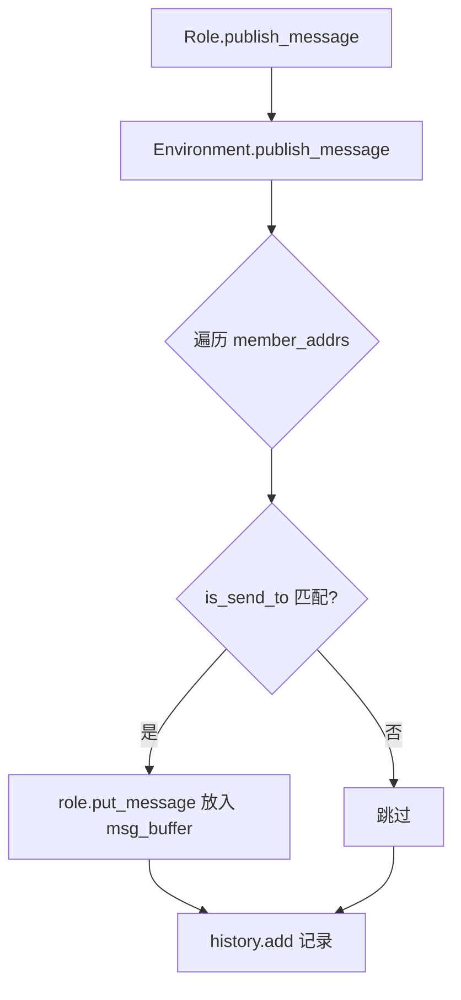
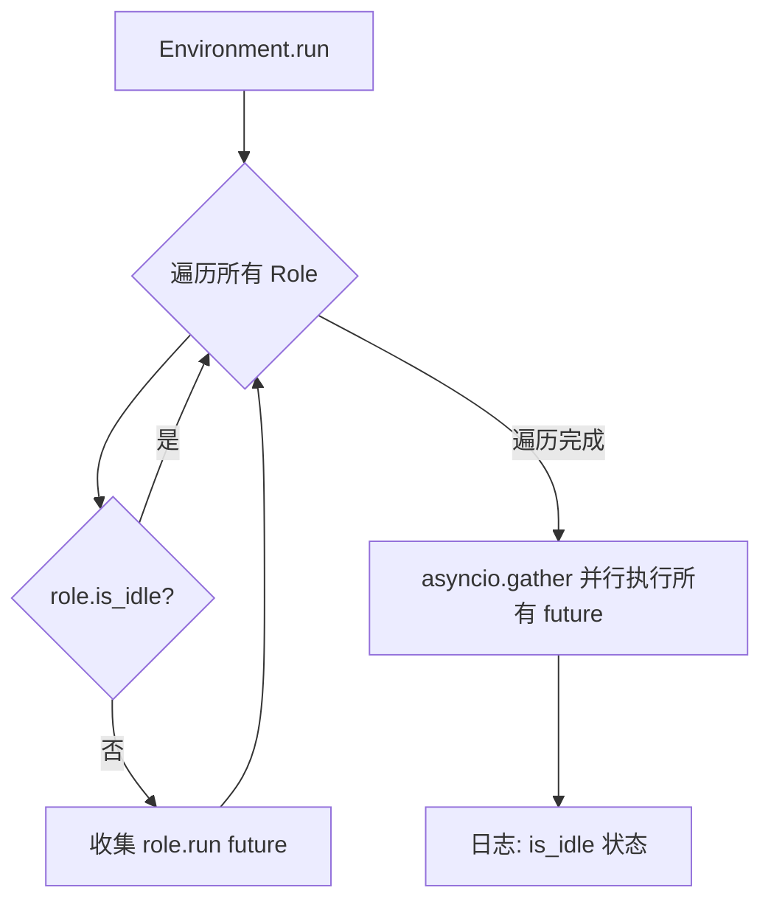
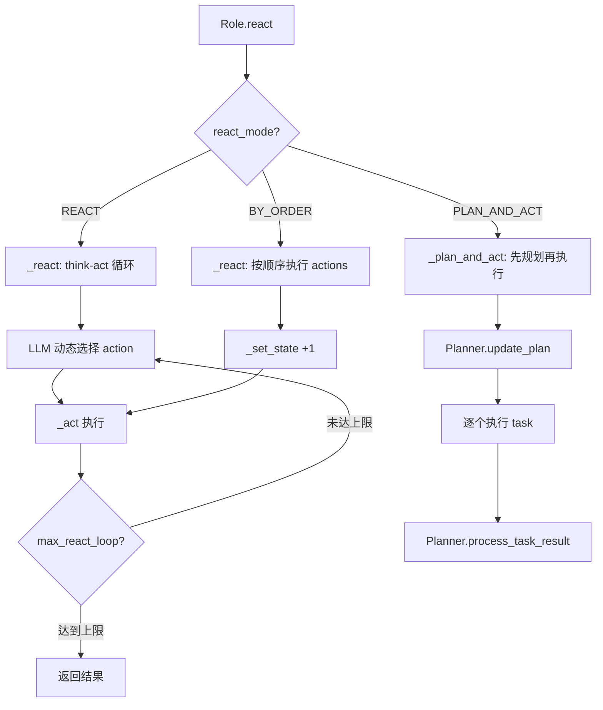
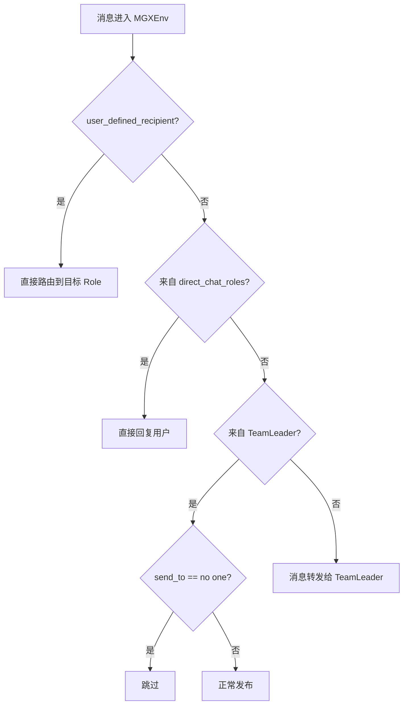

# PD-02.06 MetaGPT — SOP 驱动的多角色协作编排

> 文档编号：PD-02.06
> 来源：MetaGPT `metagpt/team.py`, `metagpt/environment/base_env.py`, `metagpt/roles/di/team_leader.py`
> GitHub：https://github.com/FoundationAgents/MetaGPT.git
> 问题域：PD-02 多 Agent 编排 Multi-Agent Orchestration
> 状态：可复用方案

---

## 第 1 章 问题与动机

### 1.1 核心问题

多 Agent 系统的核心挑战在于：如何让多个具有不同专业能力的 Agent 高效协作，完成复杂的软件工程任务？

传统的多 Agent 编排方案面临三个关键问题：
1. **角色职责模糊**：Agent 之间职责重叠，导致重复工作或遗漏
2. **消息路由混乱**：缺乏统一的消息分发机制，Agent 间通信无序
3. **执行顺序不确定**：并行执行时缺乏依赖管理，导致上下游数据不一致

MetaGPT 的核心洞察是：**人类团队之所以高效，是因为有标准操作流程（SOP）**。将 SOP 编码为 Agent 间的消息订阅关系，就能实现隐式的 DAG 编排——无需显式定义执行图，通过 `_watch` 机制让每个 Role 只关注自己上游的输出，自然形成流水线。

### 1.2 MetaGPT 的解法概述

1. **Environment 作为消息总线**：所有 Role 共享一个 Environment，通过 `publish_message` / `put_message` 实现消息路由（`metagpt/environment/base_env.py:175-195`）
2. **SOP 隐式编排**：每个 Role 通过 `_watch` 订阅特定 Action 类型的消息，形成隐式 DAG（`metagpt/roles/role.py:284-288`）
3. **asyncio.gather 并行执行**：Environment.run 在每轮中用 `asyncio.gather` 并行执行所有非 idle 的 Role（`metagpt/environment/base_env.py:197-211`）
4. **TeamLeader 动态路由**：MGXEnv 模式下，TeamLeader 作为消息中枢，动态分配任务给团队成员（`metagpt/roles/di/team_leader.py:75-86`）
5. **ActionGraph DAG 拓扑排序**：ActionNode 支持 prev/next 依赖关系，ActionGraph 提供拓扑排序（`metagpt/actions/action_graph.py:33-49`）

### 1.3 设计思想

| 设计原则 | 具体实现 | 理由 | 替代方案 |
|----------|----------|------|----------|
| SOP 即编排 | Role._watch 订阅上游 Action 类型 | 人类团队靠 SOP 协作，Agent 也应如此 | 显式 DAG 定义（LangGraph） |
| 环境即总线 | Environment.publish_message 广播 | 解耦 Role 间直接依赖 | 点对点消息队列 |
| 并行优先 | asyncio.gather 并行执行非 idle Role | 最大化吞吐量 | 串行轮询 |
| 双模式编排 | 经典 SOP + MGX TeamLeader 动态路由 | 简单任务用 SOP，复杂任务用动态路由 | 单一编排模式 |
| 三种反应模式 | react / by_order / plan_and_act | 不同任务复杂度需要不同策略 | 固定 ReAct 循环 |

---

## 第 2 章 源码实现分析

### 2.1 架构概览

MetaGPT 的编排架构分为两层：经典 SOP 模式和 MGX 动态路由模式。

```
┌─────────────────────────────────────────────────────────┐
│                      Team                                │
│  ┌───────────────────────────────────────────────────┐  │
│  │              Environment / MGXEnv                  │  │
│  │                                                    │  │
│  │  ┌──────────┐  publish_message  ┌──────────────┐  │  │
│  │  │  Role A  │ ───────────────→  │ member_addrs │  │  │
│  │  │ (_watch) │ ←─── put_message  │  路由表       │  │  │
│  │  └──────────┘                   └──────┬───────┘  │  │
│  │  ┌──────────┐                          │          │  │
│  │  │  Role B  │ ←── is_send_to 匹配 ────┘          │  │
│  │  │ (_watch) │                                     │  │
│  │  └──────────┘                                     │  │
│  │  ┌──────────┐                                     │  │
│  │  │  Role C  │    asyncio.gather 并行执行           │  │
│  │  │ (_watch) │                                     │  │
│  │  └──────────┘                                     │  │
│  └───────────────────────────────────────────────────┘  │
│  Team.run: while n_round > 0 and not env.is_idle        │
└─────────────────────────────────────────────────────────┘
```

经典 SOP 流水线（`use_fixed_sop=True`）：
```
User Requirement
    → ProductManager (_watch: UserRequirement)
        → Architect (_watch: WritePRD)
            → ProjectManager (_watch: WriteDesign)
                → Engineer (_watch: WriteTasks)
```

MGX 动态路由模式（`use_mgx=True`）：
```
User Requirement
    → MGXEnv.publish_message → TeamLeader (Mike)
        → TeamLeader._think → publish_team_message(send_to=具体角色)
            → 目标 Role 执行 → 结果回传 TeamLeader
                → TeamLeader 分配下一个任务
```

### 2.2 核心实现

#### 2.2.1 Environment 消息路由



对应源码 `metagpt/environment/base_env.py:175-195`：
```python
def publish_message(self, message: Message, peekable: bool = True) -> bool:
    """
    Distribute the message to the recipients.
    In accordance with the Message routing structure design in Chapter 2.2.1 of RFC 116
    """
    logger.debug(f"publish_message: {message.dump()}")
    found = False
    # According to the routing feature plan in Chapter 2.2.3.2 of RFC 113
    for role, addrs in self.member_addrs.items():
        if is_send_to(message, addrs):
            role.put_message(message)
            found = True
    if not found:
        logger.warning(f"Message no recipients: {message.dump()}")
    self.history.add(message)  # For debug
    return True
```

#### 2.2.2 asyncio.gather 并行执行



对应源码 `metagpt/environment/base_env.py:197-211`：
```python
async def run(self, k=1):
    """Process all Role runs at once"""
    for _ in range(k):
        futures = []
        for role in self.roles.values():
            if role.is_idle:
                continue
            future = role.run()
            futures.append(future)
        if futures:
            await asyncio.gather(*futures)
        logger.debug(f"is idle: {self.is_idle}")
```

#### 2.2.3 Role 的三种反应模式



对应源码 `metagpt/roles/role.py:512-523`：
```python
async def react(self) -> Message:
    """Entry to one of three strategies by which Role reacts to the observed Message"""
    if self.rc.react_mode == RoleReactMode.REACT or self.rc.react_mode == RoleReactMode.BY_ORDER:
        rsp = await self._react()
    elif self.rc.react_mode == RoleReactMode.PLAN_AND_ACT:
        rsp = await self._plan_and_act()
    else:
        raise ValueError(f"Unsupported react mode: {self.rc.react_mode}")
    self._set_state(state=-1)  # current reaction is complete, reset state to -1
    return rsp
```

#### 2.2.4 MGXEnv TeamLeader 动态路由



对应源码 `metagpt/environment/mgx/mgx_env.py:24-62`：
```python
def publish_message(self, message: Message, user_defined_recipient: str = "", publicer: str = "") -> bool:
    """let the team leader take over message publishing"""
    message = self.attach_images(message)
    tl = self.get_role(TEAMLEADER_NAME)  # TeamLeader's name is Mike

    if user_defined_recipient:
        self._publish_message(message)
    elif message.sent_from in self.direct_chat_roles:
        self.direct_chat_roles.remove(message.sent_from)
        if self.is_public_chat:
            self._publish_message(message)
    elif publicer == tl.profile:
        if message.send_to == {"no one"}:
            return True
        self._publish_message(message)
    else:
        # every regular message goes through team leader
        message.send_to.add(tl.name)
        self._publish_message(message)
    self.history.add(message)
    return True
```

#### 2.2.5 TeamLeader 任务分配

对应源码 `metagpt/roles/di/team_leader.py:75-86`：
```python
def publish_team_message(self, content: str, send_to: str):
    """Publish a message to a team member, use member name to fill send_to args."""
    self._set_state(-1)  # each time publishing a message, pause to wait for the response
    if send_to == self.name:
        return  # Avoid sending message to self
    self.publish_message(
        UserMessage(content=content, sent_from=self.name, send_to=send_to, cause_by=RunCommand),
        send_to=send_to
    )
```

### 2.3 实现细节

**消息订阅机制（_watch）**：Role 通过 `_watch` 注册关注的 Action 类型，`_observe` 时从 `msg_buffer` 中过滤出匹配的消息（`metagpt/roles/role.py:284-288, 399-427`）。这是 SOP 编排的核心——ProductManager watch UserRequirement，Architect watch WritePRD，形成隐式流水线。

**idle 检测与轮次控制**：`Team.run` 通过 `env.is_idle` 判断所有 Role 是否完成（`metagpt/team.py:128-136`）。每个 Role 的 `is_idle` 检查三个条件：无新消息、无待办 action、消息缓冲区为空（`metagpt/roles/role.py:557-559`）。

**预算熔断**：`Team._check_balance` 在每轮执行前检查成本是否超出预算，超出则抛出 `NoMoneyException`（`metagpt/team.py:98-100`）。

**ActionGraph 拓扑排序**：ActionNode 支持 `prevs`/`nexts` 依赖链，ActionGraph 通过 DFS 实现拓扑排序，确定 ActionNode 的执行顺序（`metagpt/actions/action_graph.py:33-49`）。

**序列化与恢复**：Team 支持 `serialize`/`deserialize`，可将整个团队状态持久化到 JSON 文件，支持断点恢复（`metagpt/team.py:59-81`）。


---

## 第 3 章 迁移指南

### 3.1 迁移清单

**阶段一：基础消息总线（1-2 天）**
- [ ] 实现 Environment 类：roles 字典 + member_addrs 路由表
- [ ] 实现 Message 类：content + cause_by + send_to + sent_from
- [ ] 实现 publish_message：遍历 member_addrs，匹配 send_to
- [ ] 实现 put_message：将消息放入 Role 的 msg_buffer

**阶段二：Role 执行框架（2-3 天）**
- [ ] 实现 Role 基类：_observe → _think → _act 循环
- [ ] 实现 _watch 订阅机制：注册关注的 Action 类型
- [ ] 实现三种 react_mode：react / by_order / plan_and_act
- [ ] 实现 is_idle 检测：msg_buffer 为空 + 无 todo + 无 news

**阶段三：Team 编排层（1 天）**
- [ ] 实现 Team 类：hire roles → run_project → while loop
- [ ] 实现 asyncio.gather 并行执行
- [ ] 实现 is_idle 全局检测 + n_round 轮次限制
- [ ] 实现预算熔断机制

**阶段四：高级特性（可选）**
- [ ] TeamLeader 动态路由（MGXEnv 模式）
- [ ] ActionGraph DAG 拓扑排序
- [ ] 序列化/反序列化断点恢复
- [ ] 长期记忆（RoleZeroLongTermMemory）

### 3.2 适配代码模板

以下是一个最小可运行的 MetaGPT 风格多 Agent 编排框架：

```python
import asyncio
from dataclasses import dataclass, field
from typing import Any, Callable, Optional

# === 消息系统 ===
@dataclass
class Message:
    content: str
    cause_by: str = ""          # 产生该消息的 Action 类名
    sent_from: str = ""         # 发送者名称
    send_to: set[str] = field(default_factory=lambda: {"<all>"})

# === Action 基类 ===
class Action:
    name: str = ""
    async def run(self, context: list[Message]) -> str:
        raise NotImplementedError

# === Role 基类 ===
class Role:
    def __init__(self, name: str, profile: str, watch: list[type[Action]] = None):
        self.name = name
        self.profile = profile
        self._watch_set: set[str] = {a.__name__ for a in (watch or [])}
        self.msg_buffer: list[Message] = []
        self.memory: list[Message] = []
        self.actions: list[Action] = []
        self.env: Optional["Environment"] = None

    @property
    def is_idle(self) -> bool:
        return len(self.msg_buffer) == 0

    def put_message(self, msg: Message):
        self.msg_buffer.append(msg)

    def set_actions(self, actions: list[Action]):
        self.actions = actions

    async def run(self) -> Optional[Message]:
        # _observe: 过滤关注的消息
        news = [m for m in self.msg_buffer
                if m.cause_by in self._watch_set or self.name in m.send_to]
        self.msg_buffer.clear()
        if not news:
            return None
        self.memory.extend(news)

        # _act: 执行第一个 action
        if self.actions:
            result = await self.actions[0].run(self.memory)
            msg = Message(
                content=result,
                cause_by=type(self.actions[0]).__name__,
                sent_from=self.name,
            )
            self.memory.append(msg)
            if self.env:
                self.env.publish_message(msg)
            return msg
        return None

# === Environment 消息总线 ===
class Environment:
    def __init__(self):
        self.roles: dict[str, Role] = {}
        self.member_addrs: dict[str, set[str]] = {}  # role_name -> addresses

    def add_role(self, role: Role):
        self.roles[role.name] = role
        self.member_addrs[role.name] = {role.name, role.profile}
        role.env = self

    def publish_message(self, message: Message):
        for role_name, addrs in self.member_addrs.items():
            if "<all>" in message.send_to or message.send_to & addrs:
                self.roles[role_name].put_message(message)

    @property
    def is_idle(self) -> bool:
        return all(r.is_idle for r in self.roles.values())

    async def run(self):
        futures = [r.run() for r in self.roles.values() if not r.is_idle]
        if futures:
            await asyncio.gather(*futures)

# === Team 编排器 ===
class Team:
    def __init__(self):
        self.env = Environment()

    def hire(self, roles: list[Role]):
        for role in roles:
            self.env.add_role(role)

    async def run(self, idea: str, n_round: int = 5):
        # 发布初始需求
        self.env.publish_message(Message(content=idea, cause_by="UserRequirement"))
        while n_round > 0 and not self.env.is_idle:
            n_round -= 1
            await self.env.run()
```

### 3.3 适用场景

| 场景 | 适用度 | 说明 |
|------|--------|------|
| 软件开发流水线（PRD→设计→编码→测试） | ⭐⭐⭐ | MetaGPT 的核心场景，SOP 模式完美匹配 |
| 研究型多 Agent（搜索→分析→报告） | ⭐⭐⭐ | TeamLeader 动态路由适合灵活任务分配 |
| 实时对话多 Agent | ⭐⭐ | MGXEnv 支持但 asyncio.gather 轮次模型有延迟 |
| 大规模并行（>10 Agent） | ⭐⭐ | asyncio.gather 无并发限制，需自行添加信号量 |
| 流式处理管道 | ⭐ | 轮次模型不适合持续流式处理 |

---

## 第 4 章 测试用例

```python
import asyncio
import pytest
from unittest.mock import AsyncMock, MagicMock

# 假设使用上述迁移模板中的类

class MockWritePRD(Action):
    name = "WritePRD"
    async def run(self, context):
        return "PRD document content"

class MockWriteDesign(Action):
    name = "WriteDesign"
    async def run(self, context):
        return "System design content"


class TestEnvironmentMessageRouting:
    """测试 Environment 消息路由"""

    def test_publish_message_routes_to_matching_role(self):
        env = Environment()
        role_a = Role("Alice", "PM", watch=[])
        role_b = Role("Bob", "Engineer", watch=[])
        env.add_role(role_a)
        env.add_role(role_b)

        msg = Message(content="test", send_to={"Alice"})
        env.publish_message(msg)

        assert len(role_a.msg_buffer) == 1
        assert len(role_b.msg_buffer) == 0

    def test_broadcast_message_reaches_all_roles(self):
        env = Environment()
        role_a = Role("Alice", "PM")
        role_b = Role("Bob", "Engineer")
        env.add_role(role_a)
        env.add_role(role_b)

        msg = Message(content="broadcast", send_to={"<all>"})
        env.publish_message(msg)

        assert len(role_a.msg_buffer) == 1
        assert len(role_b.msg_buffer) == 1

    def test_is_idle_when_all_buffers_empty(self):
        env = Environment()
        env.add_role(Role("Alice", "PM"))
        env.add_role(Role("Bob", "Engineer"))
        assert env.is_idle is True


class TestRoleReactModes:
    """测试 Role 的三种反应模式"""

    @pytest.mark.asyncio
    async def test_role_filters_messages_by_watch(self):
        role = Role("Alice", "PM", watch=[MockWritePRD])
        role.put_message(Message(content="relevant", cause_by="MockWritePRD"))
        role.put_message(Message(content="irrelevant", cause_by="SomeOtherAction"))

        result = await role.run()
        # 只有 cause_by 匹配 _watch_set 的消息被处理
        assert len(role.memory) >= 1

    @pytest.mark.asyncio
    async def test_role_idle_after_processing(self):
        role = Role("Alice", "PM", watch=[MockWritePRD])
        role.set_actions([MockWritePRD()])
        role.put_message(Message(content="task", cause_by="MockWritePRD"))

        await role.run()
        assert role.is_idle is True


class TestTeamOrchestration:
    """测试 Team 编排"""

    @pytest.mark.asyncio
    async def test_team_runs_until_idle(self):
        team = Team()
        pm = Role("Alice", "PM", watch=[])
        pm._watch_set = {"UserRequirement"}
        pm.set_actions([MockWritePRD()])
        team.hire([pm])

        await team.run("Build a calculator", n_round=3)
        assert team.env.is_idle is True

    @pytest.mark.asyncio
    async def test_team_respects_round_limit(self):
        team = Team()
        # Role that never becomes idle (always has messages)
        role = Role("Alice", "PM")
        role._watch_set = {"UserRequirement"}
        team.hire([role])

        # Should not run forever
        await team.run("infinite task", n_round=1)
        # Completed without hanging


class TestActionGraphTopologicalSort:
    """测试 ActionGraph DAG 拓扑排序"""

    def test_topological_sort_linear(self):
        """线性依赖: A → B → C"""
        from collections import defaultdict

        class SimpleNode:
            def __init__(self, key):
                self.key = key
                self.prevs = []
                self.nexts = []
            def add_next(self, n): self.nexts.append(n)
            def add_prev(self, n): self.prevs.append(n)

        class SimpleGraph:
            def __init__(self):
                self.nodes = {}
                self.edges = defaultdict(list)
                self.execution_order = []
            def add_node(self, n): self.nodes[n.key] = n
            def add_edge(self, f, t):
                self.edges[f.key].append(t.key)
                f.add_next(t); t.add_prev(f)
            def topological_sort(self):
                visited = set(); stack = []
                def visit(k):
                    if k not in visited:
                        visited.add(k)
                        for nk in self.edges[k]: visit(nk)
                        stack.insert(0, k)
                for k in self.nodes: visit(k)
                self.execution_order = stack

        a, b, c = SimpleNode("A"), SimpleNode("B"), SimpleNode("C")
        g = SimpleGraph()
        g.add_node(a); g.add_node(b); g.add_node(c)
        g.add_edge(a, b); g.add_edge(b, c)
        g.topological_sort()
        assert g.execution_order == ["A", "B", "C"]
```


---

## 第 5 章 跨域关联

| 关联域 | 关系类型 | 说明 |
|--------|----------|------|
| PD-01 上下文管理 | 依赖 | Role 的 memory 和 msg_buffer 是上下文窗口的核心消费者；RoleZero 的 `memory_k=200` 限制历史消息数量 |
| PD-03 容错与重试 | 协同 | Team._check_balance 提供预算熔断；Role.run 被 `role_raise_decorator` 包装，支持异常捕获 |
| PD-04 工具系统 | 依赖 | RoleZero 通过 `tool_execution_map` 注册工具，TeamLeader 通过 `@register_tool` 暴露 publish_team_message |
| PD-06 记忆持久化 | 协同 | Team.serialize/deserialize 支持断点恢复；RoleZeroLongTermMemory 提供跨会话记忆 |
| PD-09 Human-in-the-Loop | 协同 | MGXEnv.ask_human 支持人类介入；TeamLeader 的 `RoleZero.ask_human` 工具支持向用户提问 |
| PD-10 中间件管道 | 互补 | MetaGPT 不使用显式中间件管道，而是通过 _watch 订阅实现隐式管道 |
| PD-11 可观测性 | 依赖 | CostManager 追踪 token 消耗；Environment.history 记录所有消息用于调试 |

---

## 第 6 章 来源文件索引

| 文件 | 行范围 | 关键实现 |
|------|--------|----------|
| `metagpt/team.py` | L32-L138 | Team 类：hire/run/serialize/deserialize，轮次循环与预算熔断 |
| `metagpt/environment/base_env.py` | L124-L248 | Environment 类：publish_message 消息路由，asyncio.gather 并行执行 |
| `metagpt/environment/mgx/mgx_env.py` | L11-L99 | MGXEnv：TeamLeader 动态路由，direct_chat 支持 |
| `metagpt/roles/role.py` | L125-L559 | Role 基类：_observe/_think/_act 循环，三种 react_mode |
| `metagpt/roles/di/role_zero.py` | L55-L219 | RoleZero：动态工具执行，Planner 集成，长期记忆 |
| `metagpt/roles/di/team_leader.py` | L23-L91 | TeamLeader：publish_team_message 任务分配，团队信息感知 |
| `metagpt/actions/action_graph.py` | L13-L49 | ActionGraph：DAG 拓扑排序 |
| `metagpt/actions/action_node.py` | L135-L180 | ActionNode：prevs/nexts 依赖链，树形子节点结构 |
| `metagpt/schema.py` | L232-L283 | Message：cause_by/send_to/sent_from 路由字段 |
| `metagpt/prompts/di/team_leader.py` | L3-L40 | TL_INSTRUCTION：TeamLeader 任务分配策略 prompt |

---

## 第 7 章 横向对比维度

```json comparison_data
{
  "project": "MetaGPT",
  "dimensions": {
    "编排模式": "双模式：SOP 隐式 DAG（_watch 订阅）+ MGX TeamLeader 动态路由",
    "并行能力": "asyncio.gather 并行执行所有非 idle Role，无并发上限",
    "状态管理": "RoleContext 封装 memory/msg_buffer/state/todo，Pydantic 序列化",
    "并发限制": "无内置信号量，依赖 n_round 轮次限制和 NoMoneyException 预算熔断",
    "工具隔离": "每个 Role 独立 tool_execution_map，TeamLeader 通过 @register_tool 暴露",
    "模块自治": "Role 自主 observe→think→act，Environment 仅做消息路由不干预决策",
    "懒初始化": "model_validator(mode='after') 延迟初始化 actions/tools/memory",
    "结果回传": "Role.publish_message → Environment → TeamLeader 感知完成状态",
    "双流水线": "经典 SOP（use_fixed_sop）和 MGX 动态路由（use_mgx）共存于同一 Team",
    "记忆压缩": "RoleZeroLongTermMemory 支持向量检索，memory_k 限制短期记忆条数"
  }
}
```

### 域元数据补充

```json domain_metadata
{
  "solution_summary": "MetaGPT 用 SOP 隐式 DAG（_watch 订阅）+ MGXEnv TeamLeader 动态路由双模式编排多角色，asyncio.gather 并行执行",
  "description": "SOP 编码为消息订阅关系，实现无需显式 DAG 定义的隐式编排",
  "sub_problems": [
    "SOP 编码：如何将人类团队的标准操作流程编码为 Agent 间的消息订阅关系",
    "消息总线路由：Environment 如何根据 send_to/cause_by 精确路由消息到目标 Role",
    "双模式切换：同一 Team 如何在 SOP 固定流水线和 TeamLeader 动态路由间切换",
    "预算熔断：如何在多 Agent 并行执行中实施全局成本控制"
  ],
  "best_practices": [
    "消息路由解耦：Role 不直接调用 Role，通过 Environment 消息总线解耦",
    "idle 三条件检测：msg_buffer 为空 + 无 todo + 无 news 才判定为 idle",
    "TeamLeader 暂停等待：分配任务后 _set_state(-1) 暂停自身，等待成员反馈再继续"
  ]
}
```

