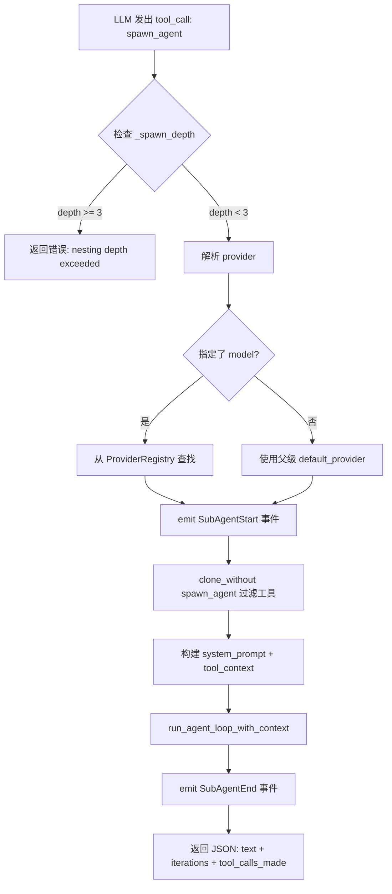
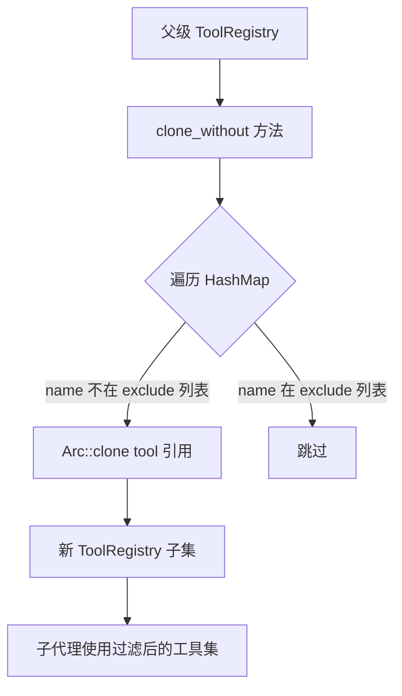

# PD-02.XX Moltis — spawn_agent 子代理委托与深度限制编排

> 文档编号：PD-02.XX
> 来源：Moltis `crates/tools/src/spawn_agent.rs`, `crates/agents/src/runner.rs`
> GitHub：https://github.com/moltis-org/moltis.git
> 问题域：PD-02 多 Agent 编排 Multi-Agent Orchestration
> 状态：可复用方案

---

## 第 1 章 问题与动机

### 1.1 核心问题

当一个 LLM Agent 面对复杂的多步骤任务时，单一 agent loop 的局限性逐渐显现：
- **上下文污染**：多个子任务的中间结果混杂在同一对话历史中，干扰后续推理
- **工具权限膨胀**：所有工具对所有任务可见，LLM 可能误用不相关的工具
- **递归失控**：如果 Agent 可以无限 spawn 子 Agent，会导致资源耗尽和无限循环
- **可观测性缺失**：子任务的执行过程对父级和 UI 不可见

Moltis 的核心洞察是：**子代理委托应该是一个普通的工具调用**，而不是一个独立的编排框架。这使得 LLM 自身成为编排者——它决定何时、为何、以什么参数 spawn 子代理。

### 1.2 Moltis 的解法概述

1. **spawn_agent 作为工具**：子代理委托被实现为一个标准的 `AgentTool`，LLM 通过 tool_call 触发（`spawn_agent.rs:66-69`）
2. **深度限制递归防护**：`MAX_SPAWN_DEPTH=3` 硬编码常量，通过 `tool_context` 中的 `_spawn_depth` 计数器逐层递增（`spawn_agent.rs:17,107-113`）
3. **工具注册表过滤**：子代理获得父级工具的 `clone_without(&["spawn_agent"])` 副本，从根本上阻止递归 spawn（`spawn_agent.rs:141`）
4. **独立 agent loop**：子代理运行完整的 `run_agent_loop_with_context`，拥有独立的消息历史、系统提示和迭代计数（`spawn_agent.rs:168-178`）
5. **事件回传**：通过 `OnSpawnEvent` 回调将 `SubAgentStart/SubAgentEnd` 事件冒泡到父级 UI（`spawn_agent.rs:29,134-138,185-191`）

### 1.3 设计思想

| 设计原则 | 具体实现 | 理由 | 替代方案 |
|----------|----------|------|----------|
| LLM 即编排者 | spawn_agent 是普通工具，LLM 自主决定何时委托 | 避免预定义 DAG 的僵化，让 LLM 根据任务动态决策 | 预定义 DAG（LangGraph）、SOP 消息路由（MetaGPT） |
| 双重递归防护 | 深度计数器 + 工具过滤双保险 | 单一机制可能被绕过（如 LLM 幻觉出工具名） | 仅靠深度计数、仅靠工具过滤 |
| 上下文隔离 | 子代理无历史（`history: None`）、无 hooks | 防止父级对话污染子任务推理 | 共享历史、部分历史传递 |
| 同步阻塞执行 | spawn_agent 的 execute 是 async 但对父级表现为同步等待 | 简化结果回传，父级直接获得子代理文本输出 | 异步 fire-and-forget、消息队列 |
| 模型可选降级 | 子代理可指定不同 model（如更便宜的模型） | 子任务通常更简单，可用低成本模型 | 固定使用父级模型 |

---

## 第 2 章 源码实现分析

### 2.1 架构概览

Moltis 的多 Agent 编排采用"工具即编排"模式，核心组件关系如下：

```
┌─────────────────────────────────────────────────────────┐
│                   LiveChatService                        │
│  (crates/chat/src/lib.rs:2185)                          │
│  ┌─────────────────┐  ┌──────────────────────────────┐  │
│  │ ProviderRegistry │  │ ToolRegistry (Arc<RwLock>)   │  │
│  │  (多 LLM 供应商) │  │  ├─ exec                    │  │
│  │  ├─ Anthropic    │  │  ├─ web_fetch               │  │
│  │  ├─ OpenAI       │  │  ├─ spawn_agent ◄── 关键!   │  │
│  │  └─ Google       │  │  ├─ memory_search           │  │
│  └─────────────────┘  │  └─ mcp__* (动态)            │  │
│                        └──────────────────────────────┘  │
│           │                        │                     │
│           ▼                        ▼                     │
│  ┌─────────────────────────────────────────────┐        │
│  │         run_agent_loop_with_context          │        │
│  │  (crates/agents/src/runner.rs:762)           │        │
│  │  ┌─────────┐  ┌──────────┐  ┌───────────┐  │        │
│  │  │ Messages │  │ Tool Exec│  │ Hook Reg  │  │        │
│  │  │ (对话历史)│  │ (并发执行)│  │ (生命周期) │  │        │
│  │  └─────────┘  └──────────┘  └───────────┘  │        │
│  └─────────────────────────────────────────────┘        │
│           │ tool_call: spawn_agent                       │
│           ▼                                              │
│  ┌─────────────────────────────────────────────┐        │
│  │         SpawnAgentTool.execute()             │        │
│  │  (crates/tools/src/spawn_agent.rs:99)        │        │
│  │  1. 检查 _spawn_depth < MAX_SPAWN_DEPTH(3)  │        │
│  │  2. 解析 provider（可选降级模型）             │        │
│  │  3. clone_without(&["spawn_agent"]) 过滤工具  │        │
│  │  4. 构建聚焦 system_prompt                   │        │
│  │  5. run_agent_loop_with_context (子循环)      │        │
│  │  6. 返回 {text, iterations, tool_calls_made} │        │
│  └─────────────────────────────────────────────┘        │
└─────────────────────────────────────────────────────────┘
```

### 2.2 核心实现

#### 2.2.1 SpawnAgentTool — 子代理委托的入口



对应源码 `crates/tools/src/spawn_agent.rs:99-209`：

```rust
#[async_trait]
impl AgentTool for SpawnAgentTool {
    async fn execute(&self, params: serde_json::Value) -> Result<serde_json::Value> {
        let task = params["task"].as_str()
            .ok_or_else(|| anyhow::anyhow!("missing required parameter: task"))?;
        let context = params["context"].as_str().unwrap_or("");
        let model_id = params["model"].as_str();

        // 深度检查：从 tool_context 注入的 _spawn_depth 读取当前层级
        let depth = params.get(SPAWN_DEPTH_KEY)
            .and_then(|v| v.as_u64()).unwrap_or(0);
        if depth >= MAX_SPAWN_DEPTH {
            anyhow::bail!("maximum sub-agent nesting depth ({MAX_SPAWN_DEPTH}) exceeded");
        }

        // 解析 provider：支持子代理使用不同（更便宜的）模型
        let provider = if let Some(id) = model_id {
            let reg = self.provider_registry.read().await;
            reg.get(id).ok_or_else(|| anyhow::anyhow!("unknown model: {id}"))?
        } else {
            Arc::clone(&self.default_provider)
        };

        // 关键：过滤掉 spawn_agent 自身，防止子代理递归 spawn
        let sub_tools = self.tool_registry.clone_without(&["spawn_agent"]);

        // 深度递增，传递给子代理的 tool_context
        let mut tool_context = serde_json::json!({ SPAWN_DEPTH_KEY: depth + 1 });
        if let Some(session_key) = params.get("_session_key") {
            tool_context["_session_key"] = session_key.clone();
        }

        // 子代理运行独立的 agent loop：无历史、无 hooks
        let result = run_agent_loop_with_context(
            provider, &sub_tools, &system_prompt, &user_content,
            None, None, Some(tool_context), None,
        ).await?;

        Ok(serde_json::json!({
            "text": result.text,
            "iterations": result.iterations,
            "tool_calls_made": result.tool_calls_made,
            "model": model_id,
        }))
    }
}
```

#### 2.2.2 ToolRegistry — 工具过滤与 Arc 共享



对应源码 `crates/agents/src/tool_registry.rs:152-165`：

```rust
/// Clone the registry, excluding tools whose names are in `exclude`.
pub fn clone_without(&self, exclude: &[&str]) -> ToolRegistry {
    let tools = self.tools.iter()
        .filter(|(name, _)| !exclude.contains(&name.as_str()))
        .map(|(name, entry)| {
            (name.clone(), ToolEntry {
                tool: Arc::clone(&entry.tool),  // 零拷贝：只克隆 Arc 指针
                source: entry.source.clone(),
            })
        })
        .collect();
    ToolRegistry { tools }
}
```

关键设计：工具存储为 `Arc<dyn AgentTool>`，`clone_without` 只克隆 Arc 指针而非工具实例本身，使得工具过滤几乎零成本。

### 2.3 实现细节

#### agent loop 的并发工具执行

`run_agent_loop_with_context` 中，同一轮迭代的多个 tool_call 是并发执行的（`runner.rs:1071-1074`）：

```rust
// Build futures for all tool calls (executed concurrently).
let tool_futures: Vec<_> = response.tool_calls.iter()
    .map(|tc| {
        let tool = tools.get(&tc.name);
        let mut args = tc.arguments.clone();
        // 注入 tool_context（含 _spawn_depth、_session_key）
        if let Some(ref ctx) = tool_context {
            if let (Some(args_obj), Some(ctx_obj)) = (args.as_object_mut(), ctx.as_object()) {
                for (k, v) in ctx_obj {
                    args_obj.insert(k.clone(), v.clone());
                }
            }
        }
        async move { /* execute tool */ }
    })
    .collect();
```

这意味着如果 LLM 在同一轮返回多个 spawn_agent 调用，它们会并发执行——但由于子代理的工具集中不包含 spawn_agent，不会产生递归。

#### 事件系统与 UI 可见性

子代理的生命周期通过 `RunnerEvent::SubAgentStart/End` 事件冒泡到 `LiveChatService`，最终通过 SSE 广播到前端（`chat/src/lib.rs:5827-5852`）：

```rust
RunnerEvent::SubAgentStart { task, model, depth } => serde_json::json!({
    "runId": run_id, "sessionKey": sk,
    "state": "sub_agent_start",
    "task": task, "model": model, "depth": depth,
}),
RunnerEvent::SubAgentEnd { task, model, depth, iterations, tool_calls_made } => serde_json::json!({
    "runId": run_id, "sessionKey": sk,
    "state": "sub_agent_end",
    "task": task, "model": model, "depth": depth,
    "iterations": iterations, "toolCallsMade": tool_calls_made,
}),
```

#### 迭代上限保护

每个 agent loop（包括子代理）都有独立的迭代上限 `DEFAULT_AGENT_MAX_ITERATIONS = 25`（`runner.rs:23`），防止单个子代理无限循环。

---

## 第 3 章 迁移指南

### 3.1 迁移清单

**阶段 1：基础设施（必须）**

- [ ] 定义 `AgentTool` trait（name/description/parameters_schema/execute）
- [ ] 实现 `ToolRegistry`，支持 `register`、`get`、`list_schemas`、`clone_without`
- [ ] 工具存储使用 `Arc<dyn AgentTool>` 实现零拷贝过滤

**阶段 2：Agent Loop（必须）**

- [ ] 实现 `run_agent_loop`：消息构建 → LLM 调用 → tool_call 解析 → 工具执行 → 结果回注 → 循环
- [ ] 支持 `tool_context` 注入（用于传递 `_spawn_depth` 等元数据）
- [ ] 添加迭代上限保护（建议 25 轮）

**阶段 3：SpawnAgentTool（核心）**

- [ ] 实现 `SpawnAgentTool`，接收 `ProviderRegistry`、`default_provider`、`ToolRegistry`
- [ ] 深度检查：从 `tool_context._spawn_depth` 读取，超限返回错误
- [ ] 工具过滤：`clone_without(&["spawn_agent"])` 排除自身
- [ ] 子代理运行独立 agent loop，无历史、无 hooks
- [ ] 结果回传：返回 `{text, iterations, tool_calls_made, model}` JSON

**阶段 4：可观测性（推荐）**

- [ ] 定义 `SubAgentStart/SubAgentEnd` 事件
- [ ] 通过回调函数冒泡事件到父级
- [ ] SSE 广播到前端 UI

### 3.2 适配代码模板

以下是 Rust 实现的最小可运行模板：

```rust
use std::sync::Arc;
use async_trait::async_trait;
use anyhow::Result;

// ── Step 1: 工具 trait ──
#[async_trait]
pub trait AgentTool: Send + Sync {
    fn name(&self) -> &str;
    fn description(&self) -> &str;
    fn parameters_schema(&self) -> serde_json::Value;
    async fn execute(&self, params: serde_json::Value) -> Result<serde_json::Value>;
}

// ── Step 2: 工具注册表（支持过滤） ──
pub struct ToolRegistry {
    tools: std::collections::HashMap<String, Arc<dyn AgentTool>>,
}

impl ToolRegistry {
    pub fn new() -> Self { Self { tools: std::collections::HashMap::new() } }

    pub fn register(&mut self, tool: Box<dyn AgentTool>) {
        let name = tool.name().to_string();
        self.tools.insert(name, Arc::from(tool));
    }

    pub fn clone_without(&self, exclude: &[&str]) -> Self {
        let tools = self.tools.iter()
            .filter(|(name, _)| !exclude.contains(&name.as_str()))
            .map(|(name, tool)| (name.clone(), Arc::clone(tool)))
            .collect();
        Self { tools }
    }

    pub fn get(&self, name: &str) -> Option<Arc<dyn AgentTool>> {
        self.tools.get(name).cloned()
    }
}

// ── Step 3: SpawnAgentTool ──
const MAX_SPAWN_DEPTH: u64 = 3;
const SPAWN_DEPTH_KEY: &str = "_spawn_depth";

pub struct SpawnAgentTool {
    tool_registry: Arc<ToolRegistry>,
    // ... provider fields
}

#[async_trait]
impl AgentTool for SpawnAgentTool {
    fn name(&self) -> &str { "spawn_agent" }
    fn description(&self) -> &str {
        "Spawn a sub-agent to handle a complex task autonomously."
    }
    fn parameters_schema(&self) -> serde_json::Value {
        serde_json::json!({
            "type": "object",
            "properties": {
                "task": { "type": "string", "description": "Task to delegate" },
                "context": { "type": "string", "description": "Optional context" },
                "model": { "type": "string", "description": "Optional model override" }
            },
            "required": ["task"]
        })
    }

    async fn execute(&self, params: serde_json::Value) -> Result<serde_json::Value> {
        let depth = params.get(SPAWN_DEPTH_KEY)
            .and_then(|v| v.as_u64()).unwrap_or(0);
        if depth >= MAX_SPAWN_DEPTH {
            anyhow::bail!("max nesting depth ({MAX_SPAWN_DEPTH}) exceeded");
        }

        let sub_tools = self.tool_registry.clone_without(&["spawn_agent"]);
        let tool_context = serde_json::json!({ SPAWN_DEPTH_KEY: depth + 1 });

        // 调用你的 agent loop 实现
        // let result = run_agent_loop(..., Some(tool_context), ...).await?;
        // Ok(serde_json::json!({ "text": result.text, ... }))
        todo!("接入你的 agent loop 实现")
    }
}
```

### 3.3 适用场景

| 场景 | 适用度 | 说明 |
|------|--------|------|
| 单用户交互式 Agent | ⭐⭐⭐ | 最佳场景：用户对话中 LLM 自主决定何时委托子任务 |
| 代码分析/重构 | ⭐⭐⭐ | 主 Agent 分析架构，spawn 子 Agent 处理各文件 |
| 研究型 Agent | ⭐⭐ | 可用但不如 DAG 编排灵活，因为子代理间无法直接通信 |
| 批量并行处理 | ⭐ | 不适合：同步阻塞模式不适合大规模并行 |
| 多轮辩论/对抗 | ⭐ | 不适合：子代理间无消息传递机制 |

---

## 第 4 章 测试用例

基于 Moltis 源码中的真实测试（`spawn_agent.rs:214-420`），以下是关键测试场景：

```rust
#[cfg(test)]
mod tests {
    use super::*;

    // Mock LLM Provider 返回固定响应
    struct MockProvider { response: String, model_id: String }

    #[async_trait]
    impl LlmProvider for MockProvider {
        fn name(&self) -> &str { "mock" }
        fn id(&self) -> &str { &self.model_id }
        async fn complete(&self, _: &[ChatMessage], _: &[serde_json::Value])
            -> Result<CompletionResponse> {
            Ok(CompletionResponse {
                text: Some(self.response.clone()),
                tool_calls: vec![],
                usage: Usage { input_tokens: 10, output_tokens: 5, ..Default::default() },
            })
        }
    }

    /// 正常路径：子代理执行并返回结果
    #[tokio::test]
    async fn test_sub_agent_returns_result() {
        let provider = Arc::new(MockProvider {
            response: "Sub-agent result".into(), model_id: "mock".into(),
        });
        let spawn_tool = SpawnAgentTool::new(
            make_provider_registry(), Arc::clone(&provider) as _, Arc::new(ToolRegistry::new()),
        );
        let result = spawn_tool.execute(serde_json::json!({"task": "do something"})).await.unwrap();
        assert_eq!(result["text"], "Sub-agent result");
        assert_eq!(result["iterations"], 1);
    }

    /// 边界：深度达到 MAX_SPAWN_DEPTH 时拒绝
    #[tokio::test]
    async fn test_depth_limit_rejects() {
        let spawn_tool = make_spawn_tool();
        let result = spawn_tool.execute(serde_json::json!({
            "task": "do something", "_spawn_depth": 3,
        })).await;
        assert!(result.is_err());
        assert!(result.unwrap_err().to_string().contains("nesting depth"));
    }

    /// 工具隔离：子代理的工具集不包含 spawn_agent
    #[tokio::test]
    async fn test_spawn_agent_excluded_from_sub_registry() {
        let mut registry = ToolRegistry::new();
        registry.register(Box::new(DummyTool("spawn_agent")));
        registry.register(Box::new(DummyTool("echo")));

        let filtered = registry.clone_without(&["spawn_agent"]);
        assert!(filtered.get("spawn_agent").is_none());
        assert!(filtered.get("echo").is_some());
    }

    /// 降级：缺少 task 参数时返回明确错误
    #[tokio::test]
    async fn test_missing_task_parameter() {
        let spawn_tool = make_spawn_tool();
        let result = spawn_tool.execute(serde_json::json!({})).await;
        assert!(result.is_err());
        assert!(result.unwrap_err().to_string().contains("task"));
    }
}
```

---

## 第 5 章 跨域关联

| 关联域 | 关系类型 | 说明 |
|--------|----------|------|
| PD-01 上下文管理 | 协同 | 子代理运行独立 agent loop（`history: None`），天然实现上下文隔离；父级 runner 有 `is_context_window_error` 检测（`runner.rs:50-53`），但子代理不继承此保护 |
| PD-03 容错与重试 | 依赖 | runner 内置 `is_retryable_server_error` 和 `is_rate_limit_error` 重试逻辑（`runner.rs:56-90`），子代理继承此能力；但 spawn_agent 本身的 execute 失败不会自动重试 |
| PD-04 工具系统 | 强依赖 | spawn_agent 本身就是 AgentTool 的实现；ToolRegistry 的 `clone_without`/`clone_without_prefix`/`clone_allowed_by` 系列方法是工具隔离的基础（`tool_registry.rs:120-184`） |
| PD-10 中间件管道 | 协同 | runner 支持 `HookRegistry` 的 `BeforeToolCall/AfterToolCall` 钩子（`runner.rs:1079-1118`），但子代理显式传入 `hooks: None`，不继承父级钩子 |
| PD-11 可观测性 | 协同 | `SubAgentStart/SubAgentEnd` 事件通过 SSE 广播到前端（`chat/src/lib.rs:5827-5852`），包含 task/model/depth/iterations/tool_calls_made 完整指标 |

---

## 第 6 章 来源文件索引

| 文件 | 行范围 | 关键实现 |
|------|--------|----------|
| `crates/tools/src/spawn_agent.rs` | L1-L420 | SpawnAgentTool 完整实现 + 5 个单元测试 |
| `crates/tools/src/spawn_agent.rs` | L17 | `MAX_SPAWN_DEPTH = 3` 常量定义 |
| `crates/tools/src/spawn_agent.rs` | L31-L63 | SpawnAgentTool 结构体 + OnSpawnEvent 回调类型 |
| `crates/tools/src/spawn_agent.rs` | L99-L209 | execute 方法：深度检查→provider 解析→工具过滤→子 loop→结果回传 |
| `crates/tools/src/spawn_agent.rs` | L141 | `clone_without(&["spawn_agent"])` 工具过滤关键行 |
| `crates/agents/src/runner.rs` | L23 | `DEFAULT_AGENT_MAX_ITERATIONS = 25` |
| `crates/agents/src/runner.rs` | L232-L241 | AgentRunResult 结构体定义 |
| `crates/agents/src/runner.rs` | L261-L298 | RunnerEvent 枚举（含 SubAgentStart/End） |
| `crates/agents/src/runner.rs` | L762-L858 | `run_agent_loop_with_context` 函数签名与初始化 |
| `crates/agents/src/runner.rs` | L1071-L1091 | 并发工具执行 + tool_context 注入 |
| `crates/agents/src/tool_registry.rs` | L9-L14 | AgentTool trait 定义 |
| `crates/agents/src/tool_registry.rs` | L35-L37 | ToolRegistry 结构体（HashMap<String, ToolEntry>） |
| `crates/agents/src/tool_registry.rs` | L152-L165 | `clone_without` 方法实现 |
| `crates/chat/src/lib.rs` | L2185-L2209 | LiveChatService 结构体（session 级并发控制） |
| `crates/chat/src/lib.rs` | L5827-L5852 | SubAgent 事件 SSE 广播序列化 |
| `crates/common/src/hooks.rs` | L100-L154 | HookPayload 枚举（BeforeToolCall/AfterToolCall 等） |

---

## 第 7 章 横向对比维度

```json comparison_data
{
  "project": "Moltis",
  "dimensions": {
    "编排模式": "LLM 自主委托：spawn_agent 作为普通工具，LLM 决定何时 spawn",
    "并行能力": "同轮多 tool_call 并发执行，但子代理间无通信",
    "状态管理": "子代理完全无状态：无历史、无 hooks、独立消息链",
    "并发限制": "session 级 Semaphore 单并发 + 子代理迭代上限 25",
    "工具隔离": "clone_without 排除 spawn_agent，Arc 零拷贝过滤",
    "递归防护": "双重保险：_spawn_depth 计数器(MAX=3) + 工具过滤移除 spawn_agent",
    "结果回传": "同步阻塞返回 JSON {text, iterations, tool_calls_made, model}",
    "双层LLM策略": "子代理可指定不同 model 参数使用更便宜的模型",
    "模块自治": "子代理运行完整独立 agent loop，拥有独立迭代计数和消息历史"
  }
}
```

### 域元数据补充

```json domain_metadata
{
  "solution_summary": "Moltis 将子代理委托实现为普通 AgentTool（spawn_agent），通过 _spawn_depth 计数器 + clone_without 工具过滤双重递归防护，子代理运行独立 agent loop 并同步返回结果",
  "description": "工具即编排：让 LLM 通过标准 tool_call 自主决定子代理委托时机",
  "sub_problems": [
    "工具注册表零拷贝过滤：如何用 Arc 共享实现高效的工具子集创建",
    "子代理 Hook 继承策略：子代理是否应继承父级的生命周期钩子",
    "子代理模型降级：如何让子代理使用更便宜的模型以控制成本"
  ],
  "best_practices": [
    "双重递归防护：深度计数器和工具过滤同时使用，单一机制可能被绕过",
    "子代理上下文隔离：不传递历史和 hooks，防止父级对话污染子任务推理",
    "事件冒泡可观测：SubAgentStart/End 事件包含 depth/iterations/model 完整指标"
  ]
}
```
