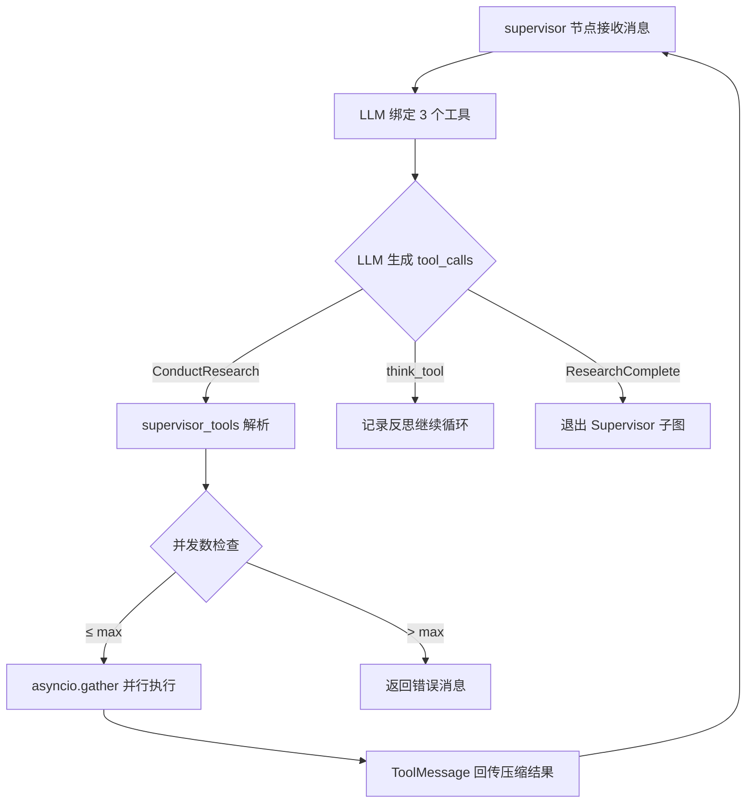
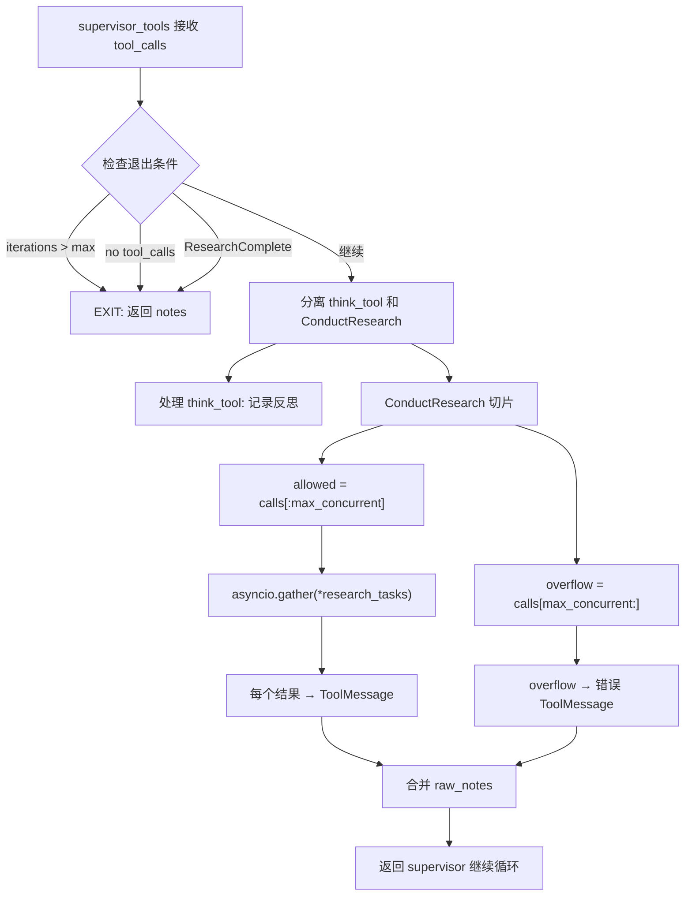

# PD-02.07 Open Deep Research — LangGraph 三层子图 Supervisor 编排

> 文档编号：PD-02.07
> 来源：Open Deep Research `src/open_deep_research/deep_researcher.py`
> GitHub：https://github.com/langchain-ai/open_deep_research.git
> 问题域：PD-02 多 Agent 编排 Multi-Agent Orchestration
> 状态：可复用方案

---

## 第 1 章 问题与动机

### 1.1 核心问题

深度研究任务天然具有"分而治之"的结构：一个复杂研究课题可以拆分为多个独立子课题，每个子课题由独立的 Researcher Agent 并行执行搜索和信息压缩，最终由 Supervisor 汇聚结果生成报告。核心挑战在于：

1. **任务分解的粒度控制** — Supervisor 需要判断何时拆分、拆多少个子任务，避免过度并行浪费资源或过少并行导致研究不充分
2. **并发上限管理** — 多个 Researcher 并行执行时，需要控制并发数量防止 API 限流和资源耗尽
3. **子 Agent 结果压缩** — 每个 Researcher 产出的原始搜索结果可能很长，需要压缩后才能回传给 Supervisor 而不超出上下文窗口
4. **迭代收敛判断** — Supervisor 需要决定何时停止派发新的研究任务，避免无限循环
5. **双版本架构演进** — 项目同时维护 legacy（Send API 扇出）和新版（ConductResearch 工具调用）两套编排方案，体现了从"静态 DAG"到"动态工具调用"的架构演进

### 1.2 Open Deep Research 的解法概述

Open Deep Research 采用 LangGraph 三层子图嵌套架构，核心设计要点：

1. **三层子图嵌套** — 主图（clarify→brief→supervisor→report）嵌套 supervisor 子图（supervisor↔supervisor_tools 循环），supervisor 子图内部通过 `asyncio.gather` 并行调用 researcher 子图（researcher↔researcher_tools→compress）(`deep_researcher.py:700-719`)
2. **ConductResearch 工具调用派发** — Supervisor 不直接操作子图，而是通过 LLM 的 tool_calls 机制调用 `ConductResearch` 工具，由 `supervisor_tools` 节点解析并派发给 researcher 子图 (`deep_researcher.py:282-305`)
3. **并发上限切片** — `max_concurrent_research_units` 配置项控制单轮最大并行数，超出部分返回错误消息要求 Supervisor 重新规划 (`deep_researcher.py:291-321`)
4. **压缩即出口** — 每个 Researcher 完成搜索后必须经过 `compress_research` 节点压缩结果，压缩后的摘要作为 ToolMessage 回传给 Supervisor (`deep_researcher.py:511-585`)
5. **三重退出条件** — 迭代次数超限、无 tool_calls、ResearchComplete 工具调用，任一满足即终止 Supervisor 循环 (`deep_researcher.py:247-255`)

### 1.3 设计思想

| 设计原则 | 具体实现 | 理由 | 替代方案 |
|----------|----------|------|----------|
| 工具调用即编排 | Supervisor 通过 `ConductResearch` tool_call 派发子任务 | LLM 自主决定何时拆分、拆几个，比硬编码 DAG 更灵活 | 静态 DAG + Send API（legacy 版本） |
| 子图隔离 | researcher_subgraph 独立编译，有自己的 State 和 OutputState | 子 Agent 状态不污染 Supervisor 状态 | 共享全局 State |
| 压缩即出口 | compress_research 是 researcher 子图的必经出口节点 | 防止原始搜索结果回传导致 Supervisor 上下文爆炸 | 直接回传原始结果 |
| 并发切片 | 超出 max_concurrent_research_units 的调用返回错误 | 防止 API 限流，同时让 LLM 学会控制并发 | 静默丢弃或排队 |
| override_reducer | supervisor_messages 支持 `{"type": "override"}` 覆盖 | 允许 write_research_brief 重置 Supervisor 上下文 | 只追加不覆盖 |

---

## 第 2 章 源码实现分析

### 2.1 架构概览

Open Deep Research 的编排架构是三层嵌套子图，每层有独立的 StateGraph 和状态定义：

```
┌─────────────────────────── Main Graph (AgentState) ───────────────────────────┐
│                                                                                │
│  START → clarify_with_user → write_research_brief                             │
│                                        │                                       │
│                    ┌───────────────────▼────────────────────┐                  │
│                    │  Supervisor Subgraph (SupervisorState)  │                  │
│                    │                                         │                  │
│                    │  supervisor ←──→ supervisor_tools        │                  │
│                    │       │              │                   │                  │
│                    │       │    ┌─────────▼──────────┐       │                  │
│                    │       │    │ asyncio.gather(     │       │                  │
│                    │       │    │   researcher_sub×N  │       │                  │
│                    │       │    │ )                   │       │                  │
│                    │       │    └─────────────────────┘       │                  │
│                    │       │                                  │                  │
│                    │  EXIT: iterations > max                  │                  │
│                    │     OR no tool_calls                     │                  │
│                    │     OR ResearchComplete                  │                  │
│                    └─────────────────────────────────────────┘                  │
│                                        │                                       │
│                                        ▼                                       │
│                              final_report_generation → END                     │
│                                                                                │
└────────────────────────────────────────────────────────────────────────────────┘

┌─────────────────── Researcher Subgraph (ResearcherState) ─────────────────────┐
│                                                                                │
│  START → researcher ←──→ researcher_tools                                     │
│                               │                                                │
│                    EXIT: iterations >= max_react_tool_calls                    │
│                       OR no tool_calls                                          │
│                               │                                                │
│                               ▼                                                │
│                        compress_research → END                                 │
│                                                                                │
└────────────────────────────────────────────────────────────────────────────────┘
```

### 2.2 核心实现

#### 2.2.1 Supervisor 工具调用派发

Supervisor 通过 LLM 的 tool_calls 机制决定研究策略。LLM 绑定三个工具：`ConductResearch`（派发子任务）、`ResearchComplete`（结束研究）、`think_tool`（策略反思）。



对应源码 `deep_researcher.py:178-223`：
```python
async def supervisor(state: SupervisorState, config: RunnableConfig) -> Command[Literal["supervisor_tools"]]:
    configurable = Configuration.from_runnable_config(config)
    research_model_config = {
        "model": configurable.research_model,
        "max_tokens": configurable.research_model_max_tokens,
        "api_key": get_api_key_for_model(configurable.research_model, config),
        "tags": ["langsmith:nostream"]
    }
    # 三个工具：研究派发、完成信号、策略反思
    lead_researcher_tools = [ConductResearch, ResearchComplete, think_tool]
    research_model = (
        configurable_model
        .bind_tools(lead_researcher_tools)
        .with_retry(stop_after_attempt=configurable.max_structured_output_retries)
        .with_config(research_model_config)
    )
    supervisor_messages = state.get("supervisor_messages", [])
    response = await research_model.ainvoke(supervisor_messages)
    return Command(
        goto="supervisor_tools",
        update={
            "supervisor_messages": [response],
            "research_iterations": state.get("research_iterations", 0) + 1
        }
    )
```

#### 2.2.2 并发切片与 asyncio.gather 并行执行

`supervisor_tools` 节点是编排的核心枢纽：解析 tool_calls、切片并发、并行派发、汇聚结果。



对应源码 `deep_researcher.py:225-349`：
```python
async def supervisor_tools(state: SupervisorState, config: RunnableConfig) -> Command[Literal["supervisor", "__end__"]]:
    configurable = Configuration.from_runnable_config(config)
    supervisor_messages = state.get("supervisor_messages", [])
    research_iterations = state.get("research_iterations", 0)
    most_recent_message = supervisor_messages[-1]

    # 三重退出条件
    exceeded_allowed_iterations = research_iterations > configurable.max_researcher_iterations
    no_tool_calls = not most_recent_message.tool_calls
    research_complete_tool_call = any(
        tool_call["name"] == "ResearchComplete"
        for tool_call in most_recent_message.tool_calls
    )
    if exceeded_allowed_iterations or no_tool_calls or research_complete_tool_call:
        return Command(goto=END, update={
            "notes": get_notes_from_tool_calls(supervisor_messages),
            "research_brief": state.get("research_brief", "")
        })

    # 并发切片：超出上限的调用返回错误
    conduct_research_calls = [
        tc for tc in most_recent_message.tool_calls if tc["name"] == "ConductResearch"
    ]
    allowed = conduct_research_calls[:configurable.max_concurrent_research_units]
    overflow = conduct_research_calls[configurable.max_concurrent_research_units:]

    # asyncio.gather 并行执行所有允许的研究任务
    research_tasks = [
        researcher_subgraph.ainvoke({
            "researcher_messages": [HumanMessage(content=tc["args"]["research_topic"])],
            "research_topic": tc["args"]["research_topic"]
        }, config)
        for tc in allowed
    ]
    tool_results = await asyncio.gather(*research_tasks)
```

### 2.3 实现细节

#### 状态隔离与 override_reducer

三层子图各自维护独立状态，通过 `override_reducer` 实现状态覆盖而非追加（`state.py:55-60`）：

```python
def override_reducer(current_value, new_value):
    if isinstance(new_value, dict) and new_value.get("type") == "override":
        return new_value.get("value", new_value)
    else:
        return operator.add(current_value, new_value)
```

这使得 `write_research_brief` 可以用 `{"type": "override", "value": [...]}` 完全重置 `supervisor_messages`，而非追加到已有消息列表。

#### Researcher 子图的压缩出口

每个 Researcher 完成搜索后必须经过 `compress_research` 节点（`deep_researcher.py:511-585`），该节点：
- 使用独立的 `compression_model`（默认 gpt-4.1）压缩研究结果
- 支持 3 次重试，每次重试时通过 `remove_up_to_last_ai_message` 裁剪消息
- 输出 `compressed_research`（压缩摘要）和 `raw_notes`（原始笔记）
- 通过 `ResearcherOutputState` 只暴露这两个字段给外部

#### Legacy 版本的 Send API 扇出

legacy 版本（`multi_agent.py:304-306`）使用 LangGraph 的 `Send` API 实现静态扇出：

```python
# Supervisor 一次性派发所有 section 到 research_team
return Command(
    goto=[Send("research_team", {"section": s}) for s in sections_list],
    update={"messages": result}
)
```

与新版的关键差异：
- legacy 用 `Send` 一次性扇出所有 section，无并发限制
- 新版用 `ConductResearch` tool_call + `asyncio.gather` + 并发切片
- legacy 的 Supervisor 是固定流程（Sections→研究→Introduction→Conclusion→FinishReport）
- 新版的 Supervisor 由 LLM 自主决定研究策略和迭代次数

#### 数据流：从用户输入到最终报告

```
用户消息 → clarify_with_user（可选澄清）
         → write_research_brief（生成 ResearchQuestion）
         → supervisor（LLM 规划研究策略）
         → supervisor_tools（解析 ConductResearch tool_calls）
             → researcher×N（并行搜索）
                 → researcher_tools（执行搜索工具）
                 → compress_research（压缩结果）
             ← ToolMessage（压缩摘要回传）
         → supervisor（评估是否需要更多研究）
         → ... 循环直到退出条件 ...
         → final_report_generation（汇聚所有 notes 生成报告）
         → END
```


---

## 第 3 章 迁移指南

### 3.1 迁移清单

**阶段 1：基础子图框架**
- [ ] 定义三层 State（MainState、SupervisorState、ResearcherState）
- [ ] 实现 `override_reducer` 支持状态覆盖
- [ ] 创建 Researcher 子图（researcher→tools→compress 三节点）
- [ ] 创建 Supervisor 子图（supervisor↔tools 循环）
- [ ] 主图嵌套 Supervisor 子图

**阶段 2：工具调用派发**
- [ ] 定义 `ConductResearch` Pydantic 模型作为工具 schema
- [ ] 定义 `ResearchComplete` 信号工具
- [ ] 在 `supervisor_tools` 中实现 tool_call 解析和 `asyncio.gather` 并行派发
- [ ] 实现并发切片逻辑（`max_concurrent_research_units`）

**阶段 3：压缩与收敛**
- [ ] 实现 `compress_research` 节点（独立压缩模型）
- [ ] 实现三重退出条件（迭代超限、无 tool_calls、ResearchComplete）
- [ ] 实现 token 超限检测和渐进式截断重试

### 3.2 适配代码模板

以下模板可直接复用，实现"Supervisor 通过工具调用派发并行子 Agent"的核心模式：

```python
"""三层子图 Supervisor 编排模板 — 基于 Open Deep Research"""
import asyncio
from typing import Annotated, Literal, Optional
from pydantic import BaseModel, Field
from langchain_core.messages import HumanMessage, SystemMessage, ToolMessage
from langchain_core.runnables import RunnableConfig
from langgraph.graph import END, START, StateGraph
from langgraph.types import Command
from typing_extensions import TypedDict
import operator


# ── 1. 工具 Schema 定义 ──
class DelegateTask(BaseModel):
    """派发子任务给 Worker Agent"""
    task_description: str = Field(description="子任务的详细描述")

class TasksComplete(BaseModel):
    """标记所有子任务已完成"""


# ── 2. 状态定义 ──
def override_reducer(current, new):
    if isinstance(new, dict) and new.get("type") == "override":
        return new.get("value", new)
    return operator.add(current, new)

class WorkerState(TypedDict):
    worker_messages: Annotated[list, operator.add]
    task_description: str
    result: str

class SupervisorState(TypedDict):
    supervisor_messages: Annotated[list, override_reducer]
    results: Annotated[list[str], operator.add]
    iterations: int

MAX_CONCURRENT = 5
MAX_ITERATIONS = 6


# ── 3. Worker 子图 ──
async def worker_execute(state: WorkerState, config: RunnableConfig):
    # 执行具体任务（搜索、分析等）
    task = state["task_description"]
    # ... 调用 LLM + 工具 ...
    return {"result": f"Completed: {task}"}

worker_builder = StateGraph(WorkerState)
worker_builder.add_node("execute", worker_execute)
worker_builder.add_edge(START, "execute")
worker_builder.add_edge("execute", END)
worker_subgraph = worker_builder.compile()


# ── 4. Supervisor 子图 ──
async def supervisor_node(state: SupervisorState, config: RunnableConfig):
    tools = [DelegateTask, TasksComplete]
    # LLM 绑定工具，自主决定派发策略
    # response = await model.bind_tools(tools).ainvoke(state["supervisor_messages"])
    return Command(
        goto="supervisor_tools",
        update={
            "supervisor_messages": [response],
            "iterations": state.get("iterations", 0) + 1
        }
    )

async def supervisor_tools_node(state: SupervisorState, config: RunnableConfig):
    messages = state["supervisor_messages"]
    last_msg = messages[-1]
    iterations = state.get("iterations", 0)

    # 三重退出条件
    if (iterations > MAX_ITERATIONS
        or not last_msg.tool_calls
        or any(tc["name"] == "TasksComplete" for tc in last_msg.tool_calls)):
        return Command(goto=END, update={"results": state.get("results", [])})

    # 并发切片
    delegate_calls = [tc for tc in last_msg.tool_calls if tc["name"] == "DelegateTask"]
    allowed = delegate_calls[:MAX_CONCURRENT]
    overflow = delegate_calls[MAX_CONCURRENT:]

    # asyncio.gather 并行执行
    tasks = [
        worker_subgraph.ainvoke({
            "worker_messages": [HumanMessage(content=tc["args"]["task_description"])],
            "task_description": tc["args"]["task_description"]
        }, config)
        for tc in allowed
    ]
    results = await asyncio.gather(*tasks)

    # 构建 ToolMessage 回传
    tool_msgs = []
    for result, tc in zip(results, allowed):
        tool_msgs.append(ToolMessage(
            content=result.get("result", ""),
            name=tc["name"],
            tool_call_id=tc["id"]
        ))
    for tc in overflow:
        tool_msgs.append(ToolMessage(
            content=f"Error: exceeded max concurrent ({MAX_CONCURRENT})",
            name=tc["name"],
            tool_call_id=tc["id"]
        ))

    return Command(goto="supervisor_node", update={"supervisor_messages": tool_msgs})

sup_builder = StateGraph(SupervisorState)
sup_builder.add_node("supervisor_node", supervisor_node)
sup_builder.add_node("supervisor_tools", supervisor_tools_node)
sup_builder.add_edge(START, "supervisor_node")
supervisor_subgraph = sup_builder.compile()
```

### 3.3 适用场景

| 场景 | 适用度 | 说明 |
|------|--------|------|
| 深度研究/调研类任务 | ⭐⭐⭐ | 天然适合拆分子课题并行搜索 |
| 多源数据采集与汇聚 | ⭐⭐⭐ | 每个 Worker 采集不同数据源，Supervisor 汇聚 |
| 报告/文档生成 | ⭐⭐⭐ | 按章节并行撰写，最终合并 |
| 简单问答 | ⭐ | 过度设计，单 Agent + 工具即可 |
| 实时对话 | ⭐ | 子图嵌套增加延迟，不适合低延迟场景 |
| 需要严格执行顺序的流水线 | ⭐⭐ | 可用但不如线性 DAG 直观 |

---

## 第 4 章 测试用例

```python
"""基于 Open Deep Research 真实函数签名的测试用例"""
import asyncio
import pytest
from unittest.mock import AsyncMock, MagicMock, patch
from langchain_core.messages import AIMessage, HumanMessage, ToolMessage


class TestOverrideReducer:
    """测试 override_reducer 状态覆盖机制"""

    def test_normal_append(self):
        """普通追加模式"""
        from open_deep_research.state import override_reducer
        result = override_reducer([1, 2], [3, 4])
        assert result == [1, 2, 3, 4]

    def test_override_mode(self):
        """覆盖模式：type=override 时完全替换"""
        from open_deep_research.state import override_reducer
        result = override_reducer(
            [1, 2, 3],
            {"type": "override", "value": [99]}
        )
        assert result == [99]

    def test_override_empty(self):
        """覆盖为空列表"""
        from open_deep_research.state import override_reducer
        result = override_reducer(
            [1, 2, 3],
            {"type": "override", "value": []}
        )
        assert result == []


class TestSupervisorExitConditions:
    """测试 Supervisor 三重退出条件"""

    def test_exit_on_max_iterations(self):
        """迭代次数超限时退出"""
        state = {
            "supervisor_messages": [AIMessage(content="", tool_calls=[
                {"name": "ConductResearch", "id": "1", "args": {"research_topic": "test"}}
            ])],
            "research_iterations": 10,  # 超过默认 max=6
            "research_brief": "test brief"
        }
        # supervisor_tools 应返回 goto=END
        # 验证 exceeded_allowed_iterations = True

    def test_exit_on_no_tool_calls(self):
        """无 tool_calls 时退出"""
        state = {
            "supervisor_messages": [AIMessage(content="Done researching")],
            "research_iterations": 1,
            "research_brief": "test brief"
        }
        # most_recent_message.tool_calls 为空 → 退出

    def test_exit_on_research_complete(self):
        """ResearchComplete 工具调用时退出"""
        state = {
            "supervisor_messages": [AIMessage(content="", tool_calls=[
                {"name": "ResearchComplete", "id": "1", "args": {}}
            ])],
            "research_iterations": 1,
            "research_brief": "test brief"
        }
        # research_complete_tool_call = True → 退出


class TestConcurrencySlicing:
    """测试并发切片逻辑"""

    def test_within_limit(self):
        """并发数在限制内：全部执行"""
        calls = [
            {"name": "ConductResearch", "id": str(i), "args": {"research_topic": f"topic_{i}"}}
            for i in range(3)
        ]
        max_concurrent = 5
        allowed = calls[:max_concurrent]
        overflow = calls[max_concurrent:]
        assert len(allowed) == 3
        assert len(overflow) == 0

    def test_exceeds_limit(self):
        """并发数超限：切片 + overflow 返回错误"""
        calls = [
            {"name": "ConductResearch", "id": str(i), "args": {"research_topic": f"topic_{i}"}}
            for i in range(8)
        ]
        max_concurrent = 5
        allowed = calls[:max_concurrent]
        overflow = calls[max_concurrent:]
        assert len(allowed) == 5
        assert len(overflow) == 3


class TestCompressResearch:
    """测试研究结果压缩"""

    @pytest.mark.asyncio
    async def test_compression_retry_on_token_limit(self):
        """token 超限时裁剪消息并重试"""
        # compress_research 在 token 超限时调用 remove_up_to_last_ai_message
        # 最多重试 3 次
        pass

    @pytest.mark.asyncio
    async def test_compression_returns_error_after_max_retries(self):
        """超过最大重试次数返回错误"""
        # 返回 "Error synthesizing research report: Maximum retries exceeded"
        pass
```


---

## 第 5 章 跨域关联

| 关联域 | 关系类型 | 说明 |
|--------|----------|------|
| PD-01 上下文管理 | 强依赖 | `compress_research` 节点是上下文压缩的核心实现，`override_reducer` 支持状态重置防止消息累积；`final_report_generation` 中的渐进式截断（每次 ×0.9）也是上下文管理策略 |
| PD-04 工具系统 | 协同 | Supervisor 通过 `bind_tools([ConductResearch, ResearchComplete, think_tool])` 实现工具驱动编排；Researcher 通过 `get_all_tools(config)` 动态加载搜索工具和 MCP 工具 |
| PD-08 搜索与检索 | 协同 | Researcher 子图的核心能力是搜索（Tavily/OpenAI/Anthropic web search），搜索结果经压缩后回传 Supervisor |
| PD-09 Human-in-the-Loop | 协同 | `clarify_with_user` 节点实现研究前的用户澄清，通过 `ClarifyWithUser` 结构化输出判断是否需要追问 |
| PD-11 可观测性 | 协同 | 所有 LLM 调用配置 `tags: ["langsmith:nostream"]` 支持 LangSmith 追踪；`raw_notes` 在各层间传递保留完整审计链 |
| PD-03 容错与重试 | 协同 | `with_retry(stop_after_attempt=max_structured_output_retries)` 用于结构化输出重试；`compress_research` 有独立的 3 次重试逻辑；`final_report_generation` 有渐进式截断重试 |

---

## 第 6 章 来源文件索引

| 文件 | 行范围 | 关键实现 |
|------|--------|----------|
| `src/open_deep_research/deep_researcher.py` | L1-L54 | 导入和全局 configurable_model 初始化 |
| `src/open_deep_research/deep_researcher.py` | L60-L115 | clarify_with_user 节点：用户澄清逻辑 |
| `src/open_deep_research/deep_researcher.py` | L118-L175 | write_research_brief 节点：研究简报生成 |
| `src/open_deep_research/deep_researcher.py` | L178-L223 | supervisor 节点：LLM 绑定工具生成策略 |
| `src/open_deep_research/deep_researcher.py` | L225-L349 | supervisor_tools 节点：并发切片 + asyncio.gather 派发 |
| `src/open_deep_research/deep_researcher.py` | L351-L363 | Supervisor 子图构建和编译 |
| `src/open_deep_research/deep_researcher.py` | L365-L424 | researcher 节点：单个研究员执行逻辑 |
| `src/open_deep_research/deep_researcher.py` | L435-L509 | researcher_tools 节点：工具执行和迭代控制 |
| `src/open_deep_research/deep_researcher.py` | L511-L585 | compress_research 节点：压缩研究结果 |
| `src/open_deep_research/deep_researcher.py` | L587-L605 | Researcher 子图构建和编译 |
| `src/open_deep_research/deep_researcher.py` | L607-L697 | final_report_generation：渐进式截断重试 |
| `src/open_deep_research/deep_researcher.py` | L699-L719 | 主图构建：三层嵌套组装 |
| `src/open_deep_research/state.py` | L15-L21 | ConductResearch / ResearchComplete 工具 Schema |
| `src/open_deep_research/state.py` | L55-L60 | override_reducer 状态覆盖函数 |
| `src/open_deep_research/state.py` | L65-L72 | AgentState 主状态定义 |
| `src/open_deep_research/state.py` | L74-L81 | SupervisorState 定义 |
| `src/open_deep_research/state.py` | L83-L91 | ResearcherState 定义 |
| `src/open_deep_research/configuration.py` | L64-L76 | max_concurrent_research_units 配置（默认 5） |
| `src/open_deep_research/configuration.py` | L94-L119 | max_researcher_iterations / max_react_tool_calls 配置 |
| `src/legacy/multi_agent.py` | L240-L338 | Legacy supervisor_tools：Send API 扇出实现 |
| `src/legacy/multi_agent.py` | L304-L306 | Send API 并行派发 sections |
| `src/legacy/multi_agent.py` | L459-L488 | Legacy 主图构建：supervisor→research_team 循环 |

---

## 第 7 章 横向对比维度

> **重要：** 本章用于自动填充 Butcher Wiki 的横向对比表。

```json comparison_data
{
  "project": "OpenDeepResearch",
  "dimensions": {
    "编排模式": "三层子图嵌套：主图→Supervisor子图→Researcher子图，LLM tool_call 驱动派发",
    "并行能力": "asyncio.gather 并行执行 Researcher 子图，切片控制并发上限",
    "状态管理": "三层独立 State + override_reducer 支持状态覆盖/追加双模式",
    "并发限制": "max_concurrent_research_units 切片，超出部分返回错误消息",
    "工具隔离": "Supervisor 绑定 3 工具，Researcher 绑定搜索+MCP 工具，互不交叉",
    "迭代收敛": "三重退出：迭代超限 OR 无 tool_calls OR ResearchComplete 信号",
    "结果回传": "Researcher 压缩后以 ToolMessage 回传 Supervisor",
    "记忆压缩": "compress_research 独立压缩模型，3 次重试 + 消息裁剪",
    "条件路由": "clarify_with_user 条件分支：需澄清→END / 不需要→write_research_brief",
    "双流水线": "同时维护 legacy(Send API 扇出) 和新版(ConductResearch tool_call) 两套编排",
    "子代理模型降级": "compression_model 可配置为更便宜的模型（默认 gpt-4.1 vs 研究用同款）",
    "双层LLM策略": "research_model 用于 Supervisor+Researcher，compression_model 用于压缩，final_report_model 用于报告",
    "递归防护": "Researcher 子图无法再派发子 Agent，天然防止递归",
    "模块自治": "Researcher 子图独立编译，有自己的 State/OutputState/退出条件"
  }
}
```

### 域元数据补充

```json domain_metadata
{
  "solution_summary": "Open Deep Research 用 LangGraph 三层子图嵌套 + ConductResearch tool_call 派发 + asyncio.gather 并行执行 + compress_research 压缩出口实现 Supervisor 编排",
  "description": "工具调用驱动的动态编排：Supervisor 通过 LLM tool_calls 自主决定子任务拆分和并行策略",
  "sub_problems": [
    "并发切片溢出处理：超出并发上限的 tool_calls 如何返回错误引导 LLM 重新规划",
    "压缩模型独立配置：子 Agent 结果压缩使用独立模型避免主模型上下文污染",
    "渐进式截断重试：token 超限时按 0.9 倍递减截断 findings 直到成功",
    "双版本编排共存：同一项目同时维护 Send API 静态扇出和 tool_call 动态派发两套方案"
  ],
  "best_practices": [
    "工具调用即编排：让 LLM 通过 tool_calls 自主决定子任务拆分，比硬编码 DAG 更灵活",
    "压缩即出口：子 Agent 必须经过压缩节点才能回传结果，防止上下文爆炸",
    "并发切片而非静默丢弃：超限调用返回明确错误消息，让 LLM 学会控制并发数",
    "override_reducer 双模式：同一 reducer 支持追加和覆盖，简化状态重置逻辑"
  ]
}
```

