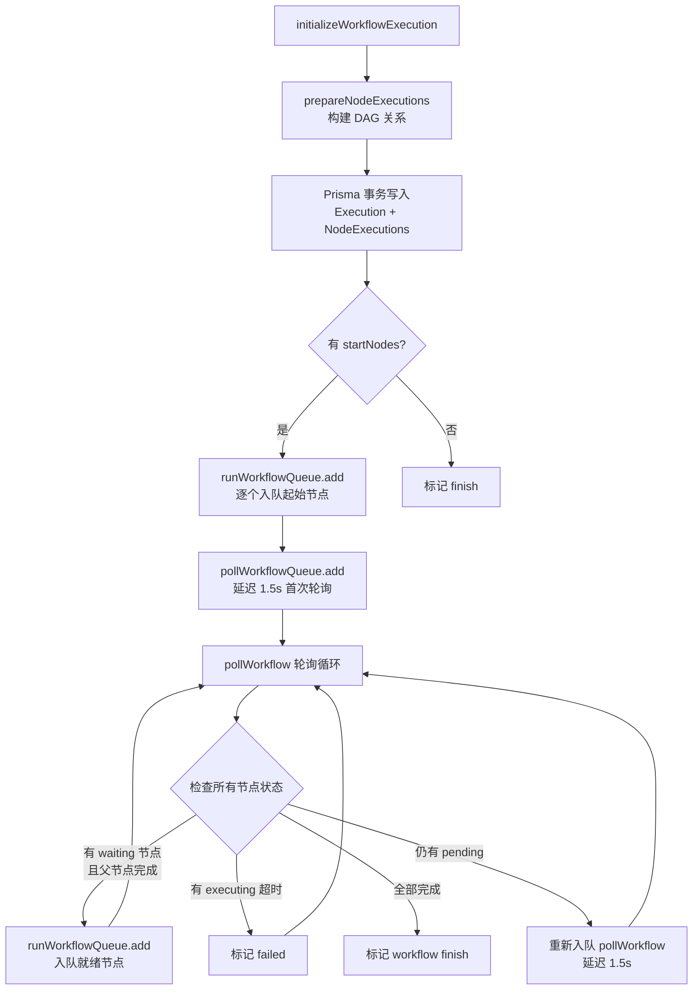
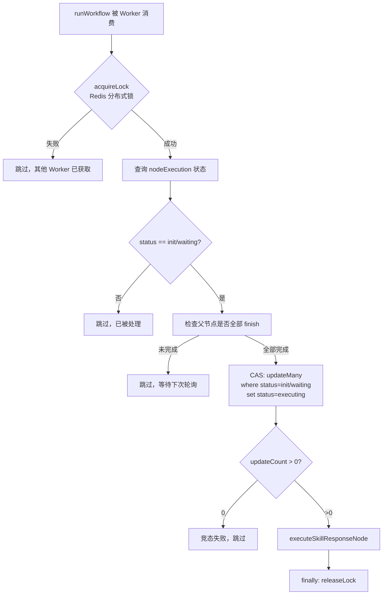
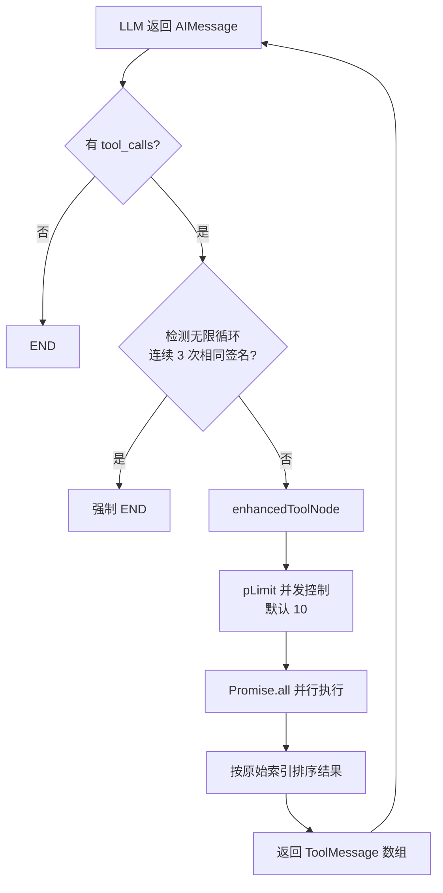

# PD-02.15 Refly — BullMQ 双队列轮询编排与 LangGraph 并行工具调用

> 文档编号：PD-02.15
> 来源：Refly `apps/api/src/modules/workflow/workflow.service.ts` `packages/skill-template/src/skills/agent.ts`
> GitHub：https://github.com/refly-ai/refly.git
> 问题域：PD-02 多 Agent 编排 Multi-Agent Orchestration
> 状态：可复用方案

---

## 第 1 章 问题与动机

### 1.1 核心问题

在 Canvas 式可视化 AI 工作流产品中，用户在画布上连接多个 Skill 节点（每个节点本质上是一个 LLM Agent），形成 DAG 拓扑。系统需要：

1. **节点级编排**：按 DAG 依赖顺序执行节点，父节点完成后自动触发子节点
2. **分布式安全**：多 Pod 部署下同一节点不能被重复执行
3. **超时与熔断**：单节点和整体工作流都需要超时保护
4. **工具并行**：单个 Agent 节点内部的多个工具调用需要并行执行以提升效率
5. **递归防护**：Agent 循环调用工具时需要检测无限循环并强制终止
6. **上下文压缩**：长 Agent 循环中消息不断累积，需要在保留必要上下文的同时防止 token 爆炸

### 1.2 Refly 的解法概述

Refly 采用**双层编排架构**：外层用 BullMQ 队列实现节点级 DAG 编排，内层用 LangGraph StateGraph 实现单节点内的 Agent 工具循环。

1. **BullMQ 双队列**：`runWorkflow` 队列负责执行单个节点，`pollWorkflow` 队列负责轮询整体进度并触发就绪节点（`workflow.service.ts:66-68`）
2. **Redis 分布式锁**：每个节点执行前获取 Redis 锁，防止多 Worker 重复执行（`workflow.service.ts:565-566`）
3. **拓扑排序 + 父节点检查**：通过 `prepareNodeExecutions` 构建 DAG 关系，轮询时检查父节点是否全部完成（`workflow.ts:135-306`）
4. **pLimit 并发控制**：Agent 内部工具调用通过 `p-limit` 库控制并发数，默认 10，可通过环境变量配置（`agent.ts:43,326`）
5. **三重递归防护**：LangGraph `recursionLimit`（51 步）+ 连续相同工具调用检测（3 次）+ 工具迭代上限（25 次）（`agent.ts:37-41`）
6. **Agent 循环消息压缩**：通过 `compressAgentLoopMessages` 在每次 LLM 调用前评估 token 预算，将早期消息归档为文件引用（`context-manager.ts:947`）

### 1.3 设计思想

| 设计原则 | 具体实现 | 理由 | 替代方案 |
|----------|----------|------|----------|
| 队列解耦执行与调度 | BullMQ 双队列分离节点执行和进度轮询 | 执行和调度关注点分离，轮询不阻塞执行 | 单队列 + 优先级（调度延迟高） |
| 乐观并发控制 | Redis 分布式锁 + CAS 状态转换 | 多 Pod 部署下防止重复执行，无需全局协调器 | 数据库行锁（性能差）/ Leader 选举（复杂） |
| 轮询驱动而非事件驱动 | pollWorkflow 定时检查就绪节点 | 实现简单，天然幂等，适合 DAG 依赖检查 | 事件驱动（需处理事件丢失和乱序） |
| 环境变量可配置并发 | `WORKFLOW_TOOL_PARALLEL_CONCURRENCY` 控制工具并发数 | 不同部署环境资源不同，需要灵活调整 | 硬编码（不灵活）/ 配置文件（重启生效） |
| 多层递归防护 | recursionLimit + 签名去重 + 迭代上限 | 单一防护不够，LLM 可能以不同方式陷入循环 | 仅 recursionLimit（无法检测语义循环） |

---

## 第 2 章 源码实现分析

### 2.1 架构概览

Refly 的编排分为两层：**Workflow 层**（节点间 DAG 编排）和 **Agent 层**（节点内工具循环）。

```
┌─────────────────────────────────────────────────────────────┐
│                    Workflow Service                          │
│  ┌──────────────┐    ┌───────────────┐    ┌──────────────┐  │
│  │ initializeWF │───→│ runWorkflow Q │───→│ pollWorkflow │  │
│  │  (入口)       │    │  (BullMQ)     │    │  Q (BullMQ)  │  │
│  └──────────────┘    └───────┬───────┘    └──────┬───────┘  │
│                              │                    │          │
│                    ┌─────────▼─────────┐  ┌──────▼───────┐  │
│                    │  Redis 分布式锁    │  │ 父节点完成检查 │  │
│                    │  + CAS 状态转换    │  │ + 超时检测    │  │
│                    └─────────┬─────────┘  └──────┬───────┘  │
│                              │                    │          │
│                    ┌─────────▼────────────────────▼───────┐  │
│                    │        Prisma (PostgreSQL)           │  │
│                    │  WorkflowExecution + NodeExecution   │  │
│                    └─────────────────────────────────────┘  │
└─────────────────────────────────────────────────────────────┘
                              │
                    ┌─────────▼─────────┐
                    │   Agent (单节点)   │
                    │  LangGraph StateGraph                │
                    │  ┌─────┐  ┌───────┐                  │
                    │  │ LLM │←→│ Tools │  (pLimit 并发)   │
                    │  └─────┘  └───────┘                  │
                    │  递归防护 + 消息压缩                   │
                    └──────────────────────────────────────┘
```

### 2.2 核心实现

#### 2.2.1 BullMQ 双队列编排



对应源码 `apps/api/src/modules/workflow/workflow.service.ts:150-350`：

```typescript
// 初始化工作流执行 — 入口方法
async initializeWorkflowExecution(
  user: User,
  canvasId: string,
  variables?: WorkflowVariable[],
  options?: { startNodes?: string[]; nodeBehavior?: 'create' | 'update'; ... },
): Promise<string> {
  // 互斥检查：同一 canvas 只允许一个活跃执行
  if (!options?.skipActiveCheck) {
    const activeExecution = await this.prisma.workflowExecution.findFirst({
      where: { canvasId, uid: user.uid, status: { in: ['init', 'executing'] } },
    });
    if (activeExecution) {
      throw new Error(`Workflow already has an active execution (${activeExecution.executionId}).`);
    }
  }

  // 构建 DAG 关系
  const { nodeExecutions, startNodes } = prepareNodeExecutions({
    executionId, canvasData, variables: finalVariables,
    startNodes: options?.startNodes ?? [], nodeBehavior,
  });

  // 原子事务写入
  await this.prisma.$transaction([
    this.prisma.workflowExecution.create({ data: { executionId, status: 'executing', ... } }),
    this.prisma.workflowNodeExecution.createMany({ data: nodeExecutions.map(...) }),
  ]);

  // 起始节点入队
  for (const startNodeId of sortedStartNodes) {
    await this.runWorkflowQueue.add('runWorkflow', {
      user: { uid: user.uid }, executionId, nodeId: startNodeId, nodeBehavior,
    });
  }

  // 启动轮询
  await this.pollWorkflowQueue.add('pollWorkflow',
    { user, executionId, nodeBehavior },
    { delay: this.pollIntervalMs, removeOnComplete: true },
  );
  return executionId;
}
```

#### 2.2.2 分布式锁 + CAS 状态转换



对应源码 `apps/api/src/modules/workflow/workflow.service.ts:560-682`：

```typescript
async runWorkflow(data: RunWorkflowJobData): Promise<void> {
  const { user, executionId, nodeId } = data;

  // Redis 分布式锁
  const lockKey = `workflow:node:${executionId}:${nodeId}`;
  const releaseLock = await this.redis.acquireLock(lockKey);
  if (!releaseLock) {
    this.logger.warn(`[runWorkflow] lock not acquired for ${lockKey}, skip`);
    return;
  }

  try {
    // 检查父节点完成状态
    const parentNodeIds = safeParseJSON(nodeExecution.parentNodeIds) ?? [];
    const allParentsFinishedCount = await this.prisma.workflowNodeExecution.count({
      where: { executionId, nodeId: { in: parentNodeIds }, status: 'finish' },
    });
    const allParentsFinished = allParentsFinishedCount === parentNodeIds.length;
    if (!allParentsFinished) return;

    // CAS 原子状态转换：仅当状态仍为 init/waiting 时才更新
    const updateRes = await this.prisma.workflowNodeExecution.updateMany({
      where: { nodeExecutionId: nodeExecution.nodeExecutionId, status: { in: ['init', 'waiting'] } },
      data: { status: 'executing', startTime: new Date(), progress: 0 },
    });
    if ((updateRes?.count ?? 0) === 0) return; // 竞态失败

    await this.executeSkillResponseNode(user, nodeExecution);
  } catch (error) {
    // 标记节点失败
    await this.prisma.workflowNodeExecution.update({
      where: { nodeExecutionId }, data: { status: 'failed', errorMessage: error.message },
    });
  } finally {
    await releaseLock?.();
  }
}
```

#### 2.2.3 LangGraph Agent 内部并行工具调用



对应源码 `packages/skill-template/src/skills/agent.ts:310-451`：

```typescript
// 增强工具节点：并行执行 + 并发控制
const enhancedToolNode = async (toolState: typeof MessagesAnnotation.State) => {
  const lastMessage = priorMessages[priorMessages.length - 1] as AIMessage;
  const toolCalls = lastMessage?.tool_calls ?? [];

  this.engine.logger.info(
    `Executing ${toolCalls.length} tool calls with concurrency limit ${concurrencyLimit}`
  );

  // pLimit 并发限制器
  const limit = pLimit(concurrencyLimit);

  // 并行执行所有工具调用
  const toolPromises = toolCalls.map((call, index) =>
    limit(async () => {
      const matchedTool = availableToolsForNode.find((t) => t?.name === toolName);
      if (!matchedTool) {
        return { index, message: new ToolMessage({ content: `Error: Tool '${toolName}' not available`, ... }) };
      }
      try {
        const rawResult = await matchedTool.invoke(toolArgs);
        return { index, message: new ToolMessage({ content: stringified, ... }) };
      } catch (toolError) {
        return { index, message: new ToolMessage({ content: `Error executing tool: ${errMsg}`, ... }) };
      }
    }),
  );

  const results = await Promise.all(toolPromises);
  // 按原始索引排序，保持 LLM 上下文顺序
  const toolResultMessages = results.sort((a, b) => a.index - b.index).map((r) => r.message);
  return { messages: [...priorMessages, ...toolResultMessages] };
};
```

#### 2.2.4 三重递归防护

对应源码 `packages/skill-template/src/skills/agent.ts:37-41,458-502`：

```typescript
// 常量定义
const MAX_TOOL_ITERATIONS = 25;
const DEFAULT_RECURSION_LIMIT = 2 * MAX_TOOL_ITERATIONS + 1; // = 51
const MAX_IDENTICAL_TOOL_CALLS = 3;

// 条件边：检测无限循环
workflow.addConditionalEdges('llm', (graphState) => {
  const lastMessage = graphState.messages[graphState.messages.length - 1] as AIMessage;
  if (lastMessage?.tool_calls?.length > 0) {
    // 生成工具调用签名
    const currentToolSignature = lastMessage.tool_calls
      .map((tc) => `${tc?.name}:${JSON.stringify(tc?.args)}`)
      .sort().join('|');

    toolCallHistory.push(currentToolSignature);
    const recentCalls = toolCallHistory.slice(-MAX_IDENTICAL_TOOL_CALLS);
    const allIdentical = recentCalls.length === MAX_IDENTICAL_TOOL_CALLS
      && recentCalls.every((call) => call === currentToolSignature);

    if (allIdentical) {
      // 检测到连续 3 次相同调用，强制终止
      toolCallHistory = [];
      return END;
    }
    return 'tools';
  }
  return END;
});
```

### 2.3 实现细节

**DAG 关系构建**（`packages/canvas-common/src/workflow.ts:97-128`）：从 Canvas 的 nodes + edges 构建 parentMap 和 childMap，通过 BFS 找到起始节点的子树。

**拓扑排序**（`packages/canvas-common/src/workflow.ts:314-361`）：DFS 遍历，先访问父节点再访问当前节点，保证执行顺序正确。标记 visited 在递归前（而非后），防止 DAG 中有环时无限递归。

**轮询超时检测**（`workflow.service.ts:729-775`）：每次轮询检查整体执行时间是否超过 30 分钟，以及单个节点是否卡在 executing 状态超过 30 分钟。超时节点被标记为 failed，触发 `WorkflowFailedEvent`。

**BullMQ Processor 模式**（`workflow.processor.ts:1-43`）：`RunWorkflowProcessor` 和 `PollWorkflowProcessor` 继承 `WorkerHost`，NestJS 自动注册为 BullMQ Worker，实现消费者与业务逻辑分离。

**Gemini 兼容处理**（`agent.ts:200-209`）：检测到 Gemini 模型时，通过 `simplifyToolForGemini` 简化工具 schema，避免 Gemini 不支持复杂 JSON Schema 的问题。

---

## 第 3 章 迁移指南

### 3.1 迁移清单

**阶段 1：基础设施**
- [ ] 安装 BullMQ + Redis（`@nestjs/bullmq`, `bullmq`, `ioredis`）
- [ ] 配置两个队列：`runWorkflow` 和 `pollWorkflow`
- [ ] 实现 Redis 分布式锁（`acquireLock` / `releaseLock`）

**阶段 2：数据模型**
- [ ] 创建 `WorkflowExecution` 表（executionId, status, totalNodes, executedNodes, failedNodes）
- [ ] 创建 `WorkflowNodeExecution` 表（nodeExecutionId, executionId, nodeId, status, parentNodeIds, childNodeIds）
- [ ] 实现 `prepareNodeExecutions`：从 DAG 定义构建节点执行记录

**阶段 3：编排逻辑**
- [ ] 实现 `initializeWorkflowExecution`：互斥检查 → 构建 DAG → 事务写入 → 入队起始节点 → 启动轮询
- [ ] 实现 `runWorkflow`：获取锁 → 检查父节点 → CAS 状态转换 → 执行节点
- [ ] 实现 `pollWorkflow`：检查超时 → 入队就绪节点 → 更新统计 → 决定是否继续轮询

**阶段 4：Agent 层**
- [ ] 安装 `@langchain/langgraph`, `p-limit`
- [ ] 实现 `enhancedToolNode`：pLimit 并发控制 + 错误包装
- [ ] 实现递归防护：recursionLimit + 签名去重

### 3.2 适配代码模板

**最小化轮询编排器（可直接运行）：**

```typescript
import { Queue, Worker } from 'bullmq';
import Redis from 'ioredis';

const redis = new Redis();
const runQueue = new Queue('runWorkflow', { connection: redis });
const pollQueue = new Queue('pollWorkflow', { connection: redis });

interface NodeExecution {
  nodeId: string;
  status: 'init' | 'executing' | 'finish' | 'failed';
  parentNodeIds: string[];
}

// 轮询 Worker
new Worker('pollWorkflow', async (job) => {
  const { executionId } = job.data;
  const nodes: NodeExecution[] = await getNodeExecutions(executionId);

  const statusMap = new Map(nodes.map(n => [n.nodeId, n.status]));

  for (const node of nodes) {
    if (node.status !== 'init') continue;
    const allParentsDone = node.parentNodeIds.every(p => statusMap.get(p) === 'finish');
    if (allParentsDone) {
      await runQueue.add('run', { executionId, nodeId: node.nodeId });
    }
  }

  const hasPending = nodes.some(n => n.status === 'init' || n.status === 'executing');
  if (hasPending) {
    await pollQueue.add('poll', { executionId }, { delay: 1500 });
  }
}, { connection: redis });

// 执行 Worker
new Worker('runWorkflow', async (job) => {
  const { executionId, nodeId } = job.data;
  const lockKey = `lock:${executionId}:${nodeId}`;
  const locked = await redis.set(lockKey, '1', 'NX', 'PX', 5000);
  if (!locked) return;

  try {
    await updateNodeStatus(executionId, nodeId, 'executing');
    await executeNode(nodeId);
    await updateNodeStatus(executionId, nodeId, 'finish');
  } catch (e) {
    await updateNodeStatus(executionId, nodeId, 'failed');
  } finally {
    await redis.del(lockKey);
  }
}, { connection: redis });
```

### 3.3 适用场景

| 场景 | 适用度 | 说明 |
|------|--------|------|
| Canvas/可视化工作流产品 | ⭐⭐⭐ | 完美匹配，节点即 Agent |
| 多步骤 AI Pipeline | ⭐⭐⭐ | DAG 编排 + 工具并行 |
| 分布式任务调度 | ⭐⭐ | 轮询模式适合中等规模，大规模需考虑轮询开销 |
| 实时对话 Agent | ⭐ | 轮询延迟（1.5s）不适合实时场景 |
| 单 Agent + 多工具 | ⭐⭐⭐ | pLimit 并行工具调用直接可用 |

---

## 第 4 章 测试用例

```typescript
import { describe, it, expect, vi } from 'vitest';

// 测试 DAG 关系构建和拓扑排序
describe('prepareNodeExecutions', () => {
  it('should identify start nodes (no parents)', () => {
    const canvasData = {
      nodes: [
        { id: 'A', type: 'skillResponse', data: { title: 'A', entityId: 'eA', metadata: {} }, position: { x: 0, y: 0 } },
        { id: 'B', type: 'skillResponse', data: { title: 'B', entityId: 'eB', metadata: {} }, position: { x: 0, y: 0 } },
      ],
      edges: [{ id: 'e1', source: 'A', target: 'B' }],
    };
    const result = prepareNodeExecutions({ executionId: 'exec1', canvasData, variables: [] });
    expect(result.startNodes).toEqual(['A']);
    expect(result.nodeExecutions.find(n => n.nodeId === 'A')?.parentNodeIds).toEqual([]);
    expect(result.nodeExecutions.find(n => n.nodeId === 'B')?.parentNodeIds).toEqual(['A']);
  });

  it('should handle diamond DAG correctly', () => {
    const canvasData = {
      nodes: ['A', 'B', 'C', 'D'].map(id => ({
        id, type: 'skillResponse' as const,
        data: { title: id, entityId: `e${id}`, metadata: {} },
        position: { x: 0, y: 0 },
      })),
      edges: [
        { id: 'e1', source: 'A', target: 'B' },
        { id: 'e2', source: 'A', target: 'C' },
        { id: 'e3', source: 'B', target: 'D' },
        { id: 'e4', source: 'C', target: 'D' },
      ],
    };
    const result = prepareNodeExecutions({ executionId: 'exec1', canvasData, variables: [] });
    expect(result.startNodes).toEqual(['A']);
    expect(result.nodeExecutions.find(n => n.nodeId === 'D')?.parentNodeIds).toContain('B');
    expect(result.nodeExecutions.find(n => n.nodeId === 'D')?.parentNodeIds).toContain('C');
  });
});

// 测试递归防护
describe('Agent recursion guard', () => {
  it('should detect identical tool call loops', () => {
    const history: string[] = [];
    const MAX = 3;
    const signature = 'search:{"query":"test"}';

    for (let i = 0; i < MAX; i++) history.push(signature);
    const recent = history.slice(-MAX);
    const allIdentical = recent.length === MAX && recent.every(c => c === signature);
    expect(allIdentical).toBe(true);
  });

  it('should not trigger on varied tool calls', () => {
    const history = ['search:{"q":"a"}', 'search:{"q":"b"}', 'search:{"q":"a"}'];
    const recent = history.slice(-3);
    const allIdentical = recent.every(c => c === recent[0]);
    expect(allIdentical).toBe(false);
  });
});

// 测试并发控制
describe('Tool parallel concurrency', () => {
  it('should respect concurrency limit', async () => {
    const pLimit = (await import('p-limit')).default;
    const limit = pLimit(2);
    let concurrent = 0;
    let maxConcurrent = 0;

    const tasks = Array.from({ length: 5 }, (_, i) =>
      limit(async () => {
        concurrent++;
        maxConcurrent = Math.max(maxConcurrent, concurrent);
        await new Promise(r => setTimeout(r, 50));
        concurrent--;
        return i;
      })
    );

    await Promise.all(tasks);
    expect(maxConcurrent).toBeLessThanOrEqual(2);
  });
});
```

---

## 第 5 章 跨域关联

| 关联域 | 关系类型 | 说明 |
|--------|----------|------|
| PD-01 上下文管理 | 依赖 | Agent 循环中的 `compressAgentLoopMessages` 在 token 预算紧张时归档早期消息，直接影响编排中每个节点的执行质量 |
| PD-03 容错与重试 | 协同 | 节点级超时检测（30min）和整体工作流超时由 pollWorkflow 驱动，失败节点触发 WorkflowFailedEvent 事件 |
| PD-04 工具系统 | 依赖 | Agent 内部的 ToolNode 依赖工具注册表（`selectedTools`），Gemini 模型需要 schema 简化适配 |
| PD-06 记忆持久化 | 协同 | 消息压缩时将早期对话归档为 DriveFile，通过 `ArchivedRef` 引用注入后续上下文 |
| PD-11 可观测性 | 协同 | Agent 执行元数据（toolDefinitions, recursionLimit, ptcEnabled）注入 Langfuse tracing metadata |

---

## 第 6 章 来源文件索引

| 文件 | 行范围 | 关键实现 |
|------|--------|----------|
| `apps/api/src/modules/workflow/workflow.service.ts` | L50-L1300 | WorkflowService 完整实现：初始化、执行、轮询、中止 |
| `apps/api/src/modules/workflow/workflow.service.ts` | L150-L350 | `initializeWorkflowExecution`：入口方法，DAG 构建 + 事务写入 + 队列入队 |
| `apps/api/src/modules/workflow/workflow.service.ts` | L560-L682 | `runWorkflow`：分布式锁 + CAS 状态转换 + 节点执行 |
| `apps/api/src/modules/workflow/workflow.service.ts` | L687-L1076 | `pollWorkflow`：超时检测 + 就绪节点入队 + 统计更新 |
| `apps/api/src/modules/workflow/workflow.processor.ts` | L1-L43 | BullMQ Processor：RunWorkflowProcessor + PollWorkflowProcessor |
| `apps/api/src/modules/workflow/workflow.constants.ts` | L1-L23 | 超时常量：POLL_INTERVAL_MS=1500, EXECUTION_TIMEOUT_MS=30min |
| `apps/api/src/modules/workflow/workflow.events.ts` | L1-L23 | WorkflowCompletedEvent + WorkflowFailedEvent 事件定义 |
| `packages/canvas-common/src/workflow.ts` | L80-L95 | `findSubtreeNodes`：BFS 子树发现 |
| `packages/canvas-common/src/workflow.ts` | L97-L128 | `buildNodeRelationships`：从 edges 构建 parentMap/childMap |
| `packages/canvas-common/src/workflow.ts` | L135-L306 | `prepareNodeExecutions`：DAG 关系构建 + 节点执行记录生成 |
| `packages/canvas-common/src/workflow.ts` | L314-L361 | `sortNodeExecutionsByExecutionOrder`：DFS 拓扑排序 |
| `packages/skill-template/src/skills/agent.ts` | L37-L43 | 递归防护常量：MAX_TOOL_ITERATIONS=25, DEFAULT_RECURSION_LIMIT=51 |
| `packages/skill-template/src/skills/agent.ts` | L52-L62 | `getToolParallelConcurrency`：环境变量可配置并发数 |
| `packages/skill-template/src/skills/agent.ts` | L154-L521 | `initializeAgentComponents`：LangGraph StateGraph 构建 + 工具绑定 + 并行执行 |
| `packages/skill-template/src/skills/agent.ts` | L310-L451 | `enhancedToolNode`：pLimit 并行工具调用 + Gemini 签名修复 |
| `packages/skill-template/src/skills/agent.ts` | L458-L502 | 条件边：工具调用签名去重 + 无限循环检测 |
| `packages/skill-template/src/utils/context-manager.ts` | L1-L100 | 消息压缩常量和类型定义 |
| `packages/skill-template/src/scheduler/types/index.ts` | L1-L18 | GraphState 接口定义 |
| `packages/canvas-common/src/tools.test.ts` | L1-L621 | 工具集提取、敏感数据清洗、变更检测测试 |

---

## 第 7 章 横向对比维度

> **重要：** 本章用于自动填充 Butcher Wiki 的横向对比表。

```json comparison_data
{
  "project": "Refly",
  "dimensions": {
    "编排模式": "BullMQ 双队列轮询：runWorkflow 执行 + pollWorkflow 调度，1.5s 间隔",
    "并行能力": "节点间 DAG 并行 + 节点内 pLimit 工具并行（默认 10 并发）",
    "状态管理": "Prisma/PostgreSQL 持久化 + Redis 分布式锁 + CAS 乐观并发",
    "并发限制": "环境变量 WORKFLOW_TOOL_PARALLEL_CONCURRENCY 可配置，默认 10",
    "工具隔离": "每个 Agent 节点独立 StateGraph，工具集按节点 metadata 配置",
    "递归防护": "三重：recursionLimit=51 + 连续相同签名检测(3次) + 迭代上限(25次)",
    "结果回传": "ToolMessage 按原始索引排序回传，保持 LLM 上下文顺序一致性",
    "结构验证": "prepareNodeExecutions 构建 DAG 时验证 startNodes 存在性",
    "异步解耦": "BullMQ 队列解耦执行与调度，Worker 独立消费",
    "生产者消费者解耦": "NestJS @Processor 装饰器自动注册 BullMQ Worker",
    "定时任务支持": "pollWorkflow 延迟入队实现定时轮询，scheduleId 支持定时触发",
    "记忆压缩": "compressAgentLoopMessages 按 token 预算归档早期消息为 DriveFile"
  }
}
```

### 域元数据补充

```json domain_metadata
{
  "solution_summary": "Refly 用 BullMQ 双队列（run+poll）实现节点级 DAG 轮询编排，Redis 分布式锁保证多 Pod 幂等，LangGraph StateGraph + pLimit 实现节点内并行工具调用",
  "description": "Canvas 可视化工作流中节点即 Agent 的编排模式，轮询驱动 vs 事件驱动的权衡",
  "sub_problems": [
    "Canvas 互斥执行：同一画布同时只允许一个工作流执行的并发控制",
    "轮询间隔调优：轮询频率与系统负载的平衡（Refly 默认 1.5s）",
    "非 Skill 节点透传：DAG 中非执行节点（document/image）如何自动标记完成",
    "Gemini 工具签名修复：Vertex AI 返回的 signatures 数组与 tool_calls 数量不匹配时的修复策略"
  ],
  "best_practices": [
    "CAS 乐观并发：用 updateMany + where status 条件替代悲观锁，天然幂等",
    "轮询自终止：每次轮询检查是否还有 pending 节点，无则停止重新入队",
    "工具调用签名去重：将 tool_calls 序列化为排序后的签名字符串检测循环"
  ]
}
```
