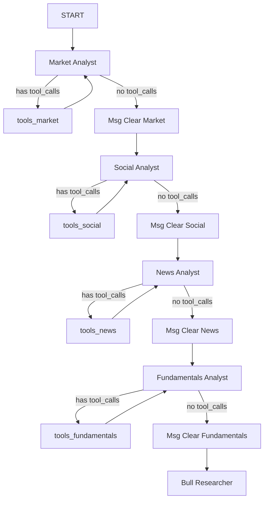
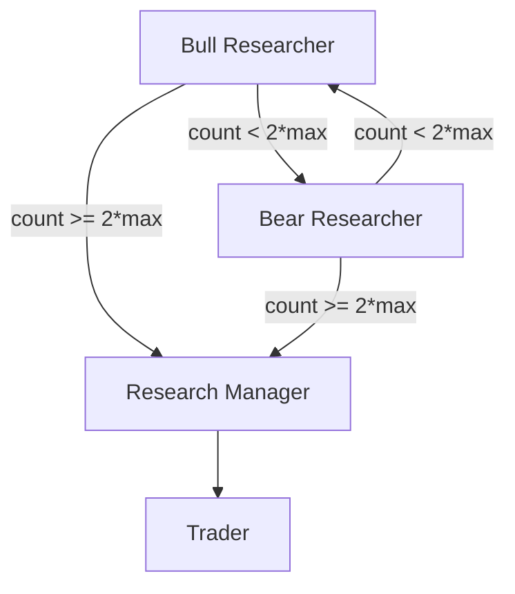
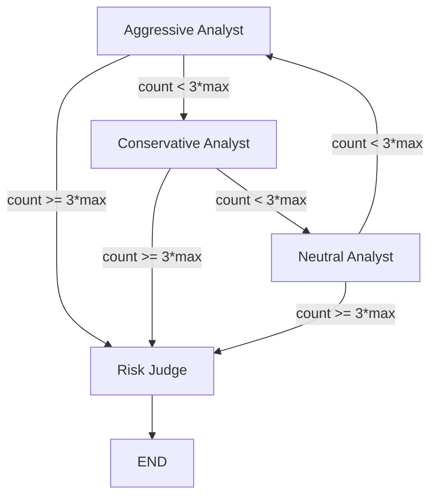

# PD-02.08 TradingAgents — 辩论式多阶段 Agent 编排

> 文档编号：PD-02.08
> 来源：TradingAgents `tradingagents/graph/setup.py`, `tradingagents/graph/trading_graph.py`
> GitHub：https://github.com/TauricResearch/TradingAgents.git
> 问题域：PD-02 多 Agent 编排 Multi-Agent Orchestration
> 状态：可复用方案

---

## 第 1 章 问题与动机

### 1.1 核心问题

金融交易决策需要综合多维度信息（技术面、基本面、新闻、社交媒体情绪），且不同分析视角之间存在天然矛盾——看多与看空、激进与保守。传统单 Agent 系统难以同时扮演对立角色进行深度博弈，容易产生单一视角偏见。

核心挑战：
1. **多维度信息融合**：4 类数据源（市场、社交、新闻、基本面）需要专业化分析，不能用一个通用 Agent 处理
2. **对抗性推理**：投资决策需要 Bull/Bear 双方辩论来暴露盲点，而非简单汇总
3. **风险多方博弈**：风险评估需要激进/保守/中立三方视角交叉验证
4. **经验积累**：Agent 需要从历史决策中学习，避免重复犯错

### 1.2 TradingAgents 的解法概述

TradingAgents 构建了一个 **5 阶段顺序流水线 + 2 个辩论环**的 LangGraph StateGraph 编排：

1. **4 类分析师顺序执行**（`setup.py:130-153`）：Market → Social → News → Fundamentals，每个分析师有独立工具集和 tool-calling 循环
2. **Bull/Bear 投资辩论**（`setup.py:156-171`）：双方交替发言，由 ConditionalLogic 控制轮次上限（`conditional_logic.py:46-55`）
3. **Research Manager 裁决**（`setup.py:172`）：deep_thinking_llm 综合辩论历史做出投资计划
4. **Trader 决策**（`setup.py:173`）：基于投资计划和历史记忆生成交易提案
5. **3 方风险辩论 + Risk Judge 最终裁决**（`setup.py:174-199`）：Aggressive/Conservative/Neutral 三方轮流辩论，Risk Judge 做最终 BUY/SELL/HOLD 决策

### 1.3 设计思想

| 设计原则 | 具体实现 | 理由 | 替代方案 |
|----------|----------|------|----------|
| 对抗性推理 | Bull/Bear 双方辩论 + 3 方风险辩论 | 通过对立观点碰撞暴露分析盲点 | 单 Agent 多角度分析（缺乏真正对抗） |
| 专业化分工 | 4 类分析师各有独立 ToolNode | 每类数据源需要不同工具和分析策略 | 单 Agent 绑定所有工具（工具过多降低选择质量） |
| 双层 LLM 策略 | quick_think 用于分析/辩论，deep_think 用于裁决 | 裁决需要更强推理能力，分析可用轻量模型 | 统一模型（成本高或质量低） |
| 经验记忆 | BM25 检索历史相似情境的反思 | 避免重复犯错，实现跨交易日学习 | 无记忆（每次从零开始） |
| 可配置分析师 | `selected_analysts` 参数控制启用哪些分析师 | 不同场景可裁剪流水线 | 硬编码全部分析师（不灵活） |

---

## 第 2 章 源码实现分析

### 2.1 架构概览

TradingAgents 的编排核心是一个 LangGraph StateGraph，定义在 `tradingagents/graph/setup.py:40-202`：

```
┌─────────────────────────────────────────────────────────────────────┐
│                        StateGraph(AgentState)                       │
├─────────────────────────────────────────────────────────────────────┤
│                                                                     │
│  ┌──────────┐   ┌──────────┐   ┌──────────┐   ┌──────────────┐    │
│  │ Market   │──→│ Social   │──→│ News     │──→│ Fundamentals │    │
│  │ Analyst  │   │ Analyst  │   │ Analyst  │   │ Analyst      │    │
│  └────┬─────┘   └────┬─────┘   └────┬─────┘   └──────┬───────┘    │
│       ↕              ↕              ↕                 │            │
│  [tools_market] [tools_social] [tools_news]  [tools_fundamentals] │
│                                                       │            │
│  ┌────────────────────────────────────────────────────▼──────┐     │
│  │              Bull/Bear 投资辩论环                          │     │
│  │  Bull Researcher ←──→ Bear Researcher (N 轮)             │     │
│  │         ↓ count >= 2*max_rounds                           │     │
│  │  Research Manager (deep_think_llm 裁决)                   │     │
│  └──────────────────────────┬────────────────────────────────┘     │
│                             ↓                                      │
│  ┌──────────────────────────▼────────────────────────────────┐     │
│  │              Trader 决策                                   │     │
│  └──────────────────────────┬────────────────────────────────┘     │
│                             ↓                                      │
│  ┌──────────────────────────▼────────────────────────────────┐     │
│  │              3 方风险辩论环                                │     │
│  │  Aggressive ──→ Conservative ──→ Neutral (循环 N 轮)      │     │
│  │         ↓ count >= 3*max_rounds                           │     │
│  │  Risk Judge (deep_think_llm 最终裁决)                     │     │
│  └──────────────────────────┬────────────────────────────────┘     │
│                             ↓                                      │
│                            END                                     │
└─────────────────────────────────────────────────────────────────────┘
```

关键组件关系：
- `TradingAgentsGraph`（`trading_graph.py:43`）是顶层编排器，持有所有组件引用
- `GraphSetup`（`setup.py:14`）负责构建 StateGraph 拓扑
- `ConditionalLogic`（`conditional_logic.py:6`）控制辩论轮次和分支路由
- `Propagator`（`propagation.py:11`）初始化状态并配置递归限制
- `Reflector`（`reflection.py:7`）执行交易后反思并更新记忆

### 2.2 核心实现

#### 2.2.1 分析师顺序链 + Tool-Calling 循环



对应源码 `tradingagents/graph/setup.py:129-153`：

```python
# Connect analysts in sequence
for i, analyst_type in enumerate(selected_analysts):
    current_analyst = f"{analyst_type.capitalize()} Analyst"
    current_tools = f"tools_{analyst_type}"
    current_clear = f"Msg Clear {analyst_type.capitalize()}"

    # Add conditional edges for current analyst
    workflow.add_conditional_edges(
        current_analyst,
        getattr(self.conditional_logic, f"should_continue_{analyst_type}"),
        [current_tools, current_clear],
    )
    workflow.add_edge(current_tools, current_analyst)

    # Connect to next analyst or to Bull Researcher
    if i < len(selected_analysts) - 1:
        next_analyst = f"{selected_analysts[i+1].capitalize()} Analyst"
        workflow.add_edge(current_clear, next_analyst)
    else:
        workflow.add_edge(current_clear, "Bull Researcher")
```

每个分析师的条件路由逻辑（`conditional_logic.py:14-44`）检查最后一条消息是否包含 `tool_calls`，有则路由到对应 ToolNode 继续执行，无则清空消息进入下一阶段。

#### 2.2.2 Bull/Bear 投资辩论环



对应源码 `tradingagents/graph/conditional_logic.py:46-55`：

```python
def should_continue_debate(self, state: AgentState) -> str:
    """Determine if debate should continue."""
    if (
        state["investment_debate_state"]["count"] >= 2 * self.max_debate_rounds
    ):  # N rounds of back-and-forth between 2 agents
        return "Research Manager"
    if state["investment_debate_state"]["current_response"].startswith("Bull"):
        return "Bear Researcher"
    return "Bull Researcher"
```

辩论状态通过 `InvestDebateState`（`agent_states.py:11-21`）TypedDict 管理，包含 `bull_history`、`bear_history`、`history`（完整辩论记录）、`current_response`（最新发言方标识）和 `count`（发言计数器）。

Bull Researcher（`bull_researcher.py:7-59`）每次发言时：
1. 从 `FinancialSituationMemory` 检索历史相似情境的反思
2. 将 4 份分析报告 + 辩论历史 + 对方最新论点 + 历史教训注入 prompt
3. 发言后更新 `investment_debate_state`，`count + 1`

#### 2.2.3 3 方风险辩论环



对应源码 `tradingagents/graph/conditional_logic.py:57-67`：

```python
def should_continue_risk_analysis(self, state: AgentState) -> str:
    """Determine if risk analysis should continue."""
    if (
        state["risk_debate_state"]["count"] >= 3 * self.max_risk_discuss_rounds
    ):  # N rounds of back-and-forth between 3 agents
        return "Risk Judge"
    if state["risk_debate_state"]["latest_speaker"].startswith("Aggressive"):
        return "Conservative Analyst"
    if state["risk_debate_state"]["latest_speaker"].startswith("Conservative"):
        return "Neutral Analyst"
    return "Aggressive Analyst"
```

3 方辩论使用 `RiskDebateState`（`agent_states.py:25-47`）管理，通过 `latest_speaker` 字段实现 Aggressive → Conservative → Neutral 的固定轮转顺序。

### 2.3 实现细节

**统一状态模型 AgentState**（`agent_states.py:50-76`）：

AgentState 继承自 LangGraph 的 `MessagesState`，扩展了 12 个 Annotated 字段，覆盖整个流水线的数据流：
- 输入层：`company_of_interest`、`trade_date`
- 分析层：`market_report`、`sentiment_report`、`news_report`、`fundamentals_report`
- 辩论层：`investment_debate_state`（嵌套 InvestDebateState）、`risk_debate_state`（嵌套 RiskDebateState）
- 决策层：`investment_plan`、`trader_investment_plan`、`final_trade_decision`

**双层 LLM 策略**（`trading_graph.py:81-95`）：

```python
deep_client = create_llm_client(
    provider=self.config["llm_provider"],
    model=self.config["deep_think_llm"],  # gpt-5.2
    ...
)
quick_client = create_llm_client(
    provider=self.config["llm_provider"],
    model=self.config["quick_think_llm"],  # gpt-5-mini
    ...
)
```

- `quick_thinking_llm`：用于 4 类分析师、Bull/Bear 辩论者、3 方风险辩论者、Reflector、SignalProcessor
- `deep_thinking_llm`：仅用于 Research Manager 和 Risk Judge 两个裁决节点

**BM25 经验记忆**（`memory.py:12-98`）：

每个关键角色（Bull、Bear、Trader、InvestJudge、RiskManager）持有独立的 `FinancialSituationMemory` 实例。记忆系统使用 BM25 词法匹配（非向量检索），无需 API 调用，离线可用。交易后通过 `Reflector`（`reflection.py:58-71`）生成反思并写入记忆。

**信号提取**（`signal_processing.py:13-31`）：

最终的 `final_trade_decision` 是 Risk Judge 的完整分析文本，`SignalProcessor` 用 LLM 从中提取 BUY/SELL/HOLD 三值信号。


---

## 第 3 章 迁移指南

### 3.1 迁移清单

**阶段 1：基础编排框架**
- [ ] 安装依赖：`langgraph`、`langchain-openai`、`rank-bm25`
- [ ] 定义 AgentState TypedDict，包含所有阶段的数据字段
- [ ] 定义辩论状态子结构（DebateState）
- [ ] 实现 ConditionalLogic 类，控制辩论轮次

**阶段 2：分析师节点**
- [ ] 为每个数据维度创建分析师工厂函数（`create_xxx_analyst`）
- [ ] 为每个分析师配置独立的 ToolNode
- [ ] 实现 tool-calling 循环的条件路由（检查 `tool_calls`）
- [ ] 实现 `create_msg_delete` 清空消息节点

**阶段 3：辩论机制**
- [ ] 实现正方/反方辩论者工厂函数
- [ ] 实现裁决者节点（使用 deep_think_llm）
- [ ] 配置辩论轮次上限和轮转逻辑

**阶段 4：记忆与反思**
- [ ] 实现 BM25 记忆系统
- [ ] 实现 Reflector 反思机制
- [ ] 为每个关键角色分配独立记忆实例

### 3.2 适配代码模板

以下模板将 TradingAgents 的辩论编排模式抽象为通用框架，可用于任何需要对抗性推理的场景：

```python
"""通用辩论式多阶段 Agent 编排模板"""
from typing import Annotated, Dict, Any, List
from typing_extensions import TypedDict
from langgraph.graph import END, StateGraph, START, MessagesState
from langgraph.prebuilt import ToolNode
from rank_bm25 import BM25Okapi
import re


# --- 1. 状态定义 ---

class DebateState(TypedDict):
    """辩论状态，支持 2 方或 N 方辩论"""
    history: Annotated[str, "完整辩论记录"]
    participant_histories: Annotated[Dict[str, str], "各方独立历史"]
    latest_speaker: Annotated[str, "最新发言方"]
    count: Annotated[int, "发言计数"]
    judge_decision: Annotated[str, "裁决结果"]


class PipelineState(MessagesState):
    """流水线状态，按需扩展字段"""
    task_input: Annotated[str, "任务输入"]
    analysis_reports: Annotated[Dict[str, str], "各分析师报告"]
    debate_state: Annotated[DebateState, "辩论状态"]
    final_decision: Annotated[str, "最终决策"]


# --- 2. 辩论轮次控制 ---

class DebateRouter:
    """控制 N 方辩论的轮转和终止"""

    def __init__(self, participants: List[str], max_rounds: int = 1):
        self.participants = participants
        self.max_rounds = max_rounds
        self.n = len(participants)

    def should_continue(self, state: PipelineState) -> str:
        debate = state["debate_state"]
        if debate["count"] >= self.n * self.max_rounds:
            return "Judge"
        current = debate["latest_speaker"]
        try:
            idx = self.participants.index(current)
            return self.participants[(idx + 1) % self.n]
        except ValueError:
            return self.participants[0]


# --- 3. 辩论者工厂 ---

def create_debater(llm, role_name: str, system_prompt: str, memory=None):
    """通用辩论者工厂函数"""
    def debater_node(state: PipelineState) -> dict:
        debate = state["debate_state"]
        history = debate.get("history", "")
        reports = state.get("analysis_reports", {})

        context = "\n\n".join(f"{k}: {v}" for k, v in reports.items())
        past_lessons = ""
        if memory:
            matches = memory.get_memories(context, n_matches=2)
            past_lessons = "\n".join(m["recommendation"] for m in matches)

        prompt = f"{system_prompt}\n\nContext:\n{context}\n\nDebate history:\n{history}\n\nPast lessons:\n{past_lessons}"
        response = llm.invoke(prompt)
        argument = f"{role_name}: {response.content}"

        participant_histories = debate.get("participant_histories", {})
        participant_histories[role_name] = participant_histories.get(role_name, "") + "\n" + argument

        return {
            "debate_state": {
                "history": history + "\n" + argument,
                "participant_histories": participant_histories,
                "latest_speaker": role_name,
                "count": debate["count"] + 1,
                "judge_decision": debate.get("judge_decision", ""),
            }
        }
    return debater_node


# --- 4. 图构建 ---

def build_debate_graph(
    analysts: Dict[str, Any],       # {"name": (node_fn, tool_node)}
    debaters: Dict[str, Any],       # {"name": node_fn}
    judge_node,
    debate_router: DebateRouter,
) -> StateGraph:
    workflow = StateGraph(PipelineState)

    # 添加分析师顺序链
    analyst_names = list(analysts.keys())
    for name, (node_fn, tool_node) in analysts.items():
        workflow.add_node(name, node_fn)
        workflow.add_node(f"tools_{name}", tool_node)

    # 添加辩论者和裁决者
    for name, node_fn in debaters.items():
        workflow.add_node(name, node_fn)
    workflow.add_node("Judge", judge_node)

    # 连接分析师链
    workflow.add_edge(START, analyst_names[0])
    for i in range(len(analyst_names) - 1):
        workflow.add_edge(analyst_names[i], analyst_names[i + 1])
    workflow.add_edge(analyst_names[-1], debate_router.participants[0])

    # 连接辩论环
    route_map = {p: p for p in debate_router.participants}
    route_map["Judge"] = "Judge"
    for participant in debate_router.participants:
        workflow.add_conditional_edges(
            participant, debate_router.should_continue, route_map
        )

    workflow.add_edge("Judge", END)
    return workflow.compile()
```

### 3.3 适用场景

| 场景 | 适用度 | 说明 |
|------|--------|------|
| 金融交易决策 | ⭐⭐⭐ | 原生场景，Bull/Bear + 风险三方辩论完美匹配 |
| 法律论证分析 | ⭐⭐⭐ | 原告/被告对抗 + 法官裁决，天然适配辩论模式 |
| 产品需求评审 | ⭐⭐ | PM/工程/设计多方辩论可行性，但辩论轮次需调大 |
| 代码审查 | ⭐⭐ | 安全/性能/可维护性多视角审查，但工具集需大幅调整 |
| 简单问答 | ⭐ | 过度设计，单 Agent 即可 |

---

## 第 4 章 测试用例

```python
"""基于 TradingAgents 真实函数签名的测试用例"""
import pytest
from typing import Dict, Any
from unittest.mock import MagicMock, patch


# --- 测试 ConditionalLogic ---

class TestConditionalLogic:
    """测试辩论轮次控制逻辑"""

    def setup_method(self):
        from tradingagents.graph.conditional_logic import ConditionalLogic
        self.logic = ConditionalLogic(max_debate_rounds=2, max_risk_discuss_rounds=2)

    def test_debate_continues_when_under_limit(self):
        """Bull 发言后应路由到 Bear"""
        state = {
            "investment_debate_state": {
                "count": 1,
                "current_response": "Bull Analyst: ...",
            }
        }
        assert self.logic.should_continue_debate(state) == "Bear Researcher"

    def test_debate_ends_at_limit(self):
        """达到 2*max_rounds 时应路由到 Research Manager"""
        state = {
            "investment_debate_state": {
                "count": 4,  # 2 * max_debate_rounds(2)
                "current_response": "Bull Analyst: ...",
            }
        }
        assert self.logic.should_continue_debate(state) == "Research Manager"

    def test_risk_debate_rotation_order(self):
        """风险辩论应按 Aggressive → Conservative → Neutral 轮转"""
        state_agg = {"risk_debate_state": {"count": 1, "latest_speaker": "Aggressive Analyst: ..."}}
        state_con = {"risk_debate_state": {"count": 2, "latest_speaker": "Conservative Analyst: ..."}}
        state_neu = {"risk_debate_state": {"count": 3, "latest_speaker": "Neutral Analyst: ..."}}

        assert self.logic.should_continue_risk_analysis(state_agg) == "Conservative Analyst"
        assert self.logic.should_continue_risk_analysis(state_con) == "Neutral Analyst"
        assert self.logic.should_continue_risk_analysis(state_neu) == "Aggressive Analyst"

    def test_risk_debate_ends_at_limit(self):
        """达到 3*max_rounds 时应路由到 Risk Judge"""
        state = {"risk_debate_state": {"count": 6, "latest_speaker": "Aggressive"}}
        assert self.logic.should_continue_risk_analysis(state) == "Risk Judge"

    def test_analyst_tool_call_routing(self):
        """分析师有 tool_calls 时应路由到工具节点"""
        mock_msg = MagicMock()
        mock_msg.tool_calls = [{"name": "get_stock_data"}]
        state = {"messages": [mock_msg]}
        assert self.logic.should_continue_market(state) == "tools_market"

    def test_analyst_no_tool_call_routing(self):
        """分析师无 tool_calls 时应路由到消息清空"""
        mock_msg = MagicMock()
        mock_msg.tool_calls = []
        state = {"messages": [mock_msg]}
        assert self.logic.should_continue_market(state) == "Msg Clear Market"


# --- 测试 FinancialSituationMemory ---

class TestFinancialSituationMemory:
    """测试 BM25 记忆系统"""

    def setup_method(self):
        from tradingagents.agents.utils.memory import FinancialSituationMemory
        self.memory = FinancialSituationMemory("test")

    def test_empty_memory_returns_empty(self):
        """空记忆应返回空列表"""
        assert self.memory.get_memories("any query") == []

    def test_add_and_retrieve(self):
        """添加记忆后应能检索到"""
        self.memory.add_situations([
            ("tech stocks volatile", "reduce exposure"),
            ("inflation rising", "buy commodities"),
        ])
        results = self.memory.get_memories("tech sector volatility", n_matches=1)
        assert len(results) == 1
        assert "reduce exposure" in results[0]["recommendation"]

    def test_clear_memory(self):
        """清空后应返回空"""
        self.memory.add_situations([("test", "advice")])
        self.memory.clear()
        assert self.memory.get_memories("test") == []


# --- 测试 Propagator ---

class TestPropagator:
    """测试状态初始化"""

    def test_initial_state_structure(self):
        from tradingagents.graph.propagation import Propagator
        prop = Propagator()
        state = prop.create_initial_state("AAPL", "2025-01-15")

        assert state["company_of_interest"] == "AAPL"
        assert state["trade_date"] == "2025-01-15"
        assert state["investment_debate_state"]["count"] == 0
        assert state["risk_debate_state"]["count"] == 0
        assert state["market_report"] == ""

    def test_graph_args_recursion_limit(self):
        from tradingagents.graph.propagation import Propagator
        prop = Propagator(max_recur_limit=50)
        args = prop.get_graph_args()
        assert args["config"]["recursion_limit"] == 50
```


---

## 第 5 章 跨域关联

| 关联域 | 关系类型 | 说明 |
|--------|----------|------|
| PD-01 上下文管理 | 依赖 | 每个分析师的 tool-calling 循环会累积消息，`create_msg_delete` 在阶段间清空消息防止上下文爆炸 |
| PD-03 容错与重试 | 协同 | `Propagator` 设置 `recursion_limit=100` 防止无限循环，但缺乏单节点超时和重试机制 |
| PD-04 工具系统 | 依赖 | 4 类分析师各绑定独立 `ToolNode`，工具按数据源分组（market/social/news/fundamentals） |
| PD-06 记忆持久化 | 协同 | `FinancialSituationMemory` 用 BM25 存储历史反思，`Reflector` 在交易后写入记忆 |
| PD-07 质量检查 | 协同 | Research Manager 和 Risk Judge 充当质量门控角色，辩论机制本身就是一种质量保障 |
| PD-11 可观测性 | 协同 | `_log_state` 将完整状态序列化为 JSON，`debug` 模式下 `stream` 输出每步 trace |
| PD-12 推理增强 | 依赖 | 双层 LLM 策略（quick/deep）+ 辩论对抗本身就是推理增强手段 |

---

## 第 6 章 来源文件索引

| 文件 | 行范围 | 关键实现 |
|------|--------|----------|
| `tradingagents/graph/setup.py` | L14-L202 | GraphSetup 类：StateGraph 拓扑构建、节点注册、边连接 |
| `tradingagents/graph/trading_graph.py` | L43-L284 | TradingAgentsGraph 顶层编排器：LLM 初始化、组件组装、propagate 执行 |
| `tradingagents/graph/conditional_logic.py` | L6-L67 | ConditionalLogic：分析师 tool-call 路由、辩论轮次控制、风险辩论轮转 |
| `tradingagents/graph/propagation.py` | L11-L57 | Propagator：初始状态构建、递归限制配置 |
| `tradingagents/graph/reflection.py` | L7-L121 | Reflector：5 角色反思生成、记忆写入 |
| `tradingagents/graph/signal_processing.py` | L6-L31 | SignalProcessor：从完整分析文本提取 BUY/SELL/HOLD 信号 |
| `tradingagents/agents/utils/agent_states.py` | L10-L76 | AgentState/InvestDebateState/RiskDebateState 状态定义 |
| `tradingagents/agents/utils/memory.py` | L12-L98 | FinancialSituationMemory：BM25 词法检索记忆系统 |
| `tradingagents/agents/researchers/bull_researcher.py` | L6-L59 | Bull Researcher：看多辩论者，含记忆检索和辩论历史注入 |
| `tradingagents/agents/managers/research_manager.py` | L5-L55 | Research Manager：投资辩论裁决者（deep_think_llm） |
| `tradingagents/agents/managers/risk_manager.py` | L5-L66 | Risk Judge：风险辩论最终裁决者（deep_think_llm） |
| `tradingagents/agents/trader/trader.py` | L6-L46 | Trader：基于投资计划和记忆生成交易提案 |
| `tradingagents/agents/risk_mgmt/aggressive_debator.py` | L5-L55 | Aggressive Analyst：激进风险辩论者 |
| `tradingagents/agents/analysts/market_analyst.py` | L8-L85 | Market Analyst：技术面分析师，含 tool-calling 循环 |
| `tradingagents/default_config.py` | L1-L34 | 默认配置：LLM 模型、辩论轮次、数据供应商 |

---

## 第 7 章 横向对比维度

```json comparison_data
{
  "project": "TradingAgents",
  "dimensions": {
    "编排模式": "LangGraph StateGraph 5阶段顺序流水线 + 2个辩论环（2方+3方）",
    "并行能力": "无并行，4类分析师严格顺序执行",
    "状态管理": "MessagesState 扩展 TypedDict，嵌套 InvestDebateState/RiskDebateState 子结构",
    "并发限制": "recursion_limit=100 防止无限循环，无并发控制",
    "工具隔离": "4类分析师各绑定独立 ToolNode，工具按数据源分组",
    "迭代收敛": "count 计数器 + max_rounds 硬上限，无置信度动态终止",
    "结果回传": "Risk Judge 输出 final_trade_decision，SignalProcessor 提取 BUY/SELL/HOLD",
    "记忆压缩": "create_msg_delete 在分析师阶段间清空消息，辩论历史用字符串拼接",
    "对抗性推理": "Bull/Bear 2方投资辩论 + Aggressive/Conservative/Neutral 3方风险辩论",
    "双层LLM策略": "quick_think 用于分析/辩论，deep_think 仅用于 Manager/Judge 裁决",
    "经验记忆": "BM25 词法检索历史相似情境反思，5个角色各持独立记忆实例"
  }
}
```

### 域元数据补充

```json domain_metadata
{
  "solution_summary": "TradingAgents 用 LangGraph StateGraph 构建 5 阶段顺序流水线 + Bull/Bear 双方辩论 + 3 方风险辩论环，通过 count 计数器控制辩论轮次，双层 LLM（quick/deep）分离分析与裁决",
  "description": "对抗性辩论作为编排模式：通过多方角色对抗暴露分析盲点",
  "sub_problems": [
    "对抗性辩论编排：如何在 Agent 间构建结构化的正反方辩论并控制收敛",
    "多方轮转调度：3方以上辩论如何设计固定轮转顺序和终止条件",
    "辩论裁决机制：如何设计裁决者综合多方论点做出最终决策",
    "角色记忆隔离：同一编排中不同角色如何维护独立的经验记忆",
    "阶段间消息清洗：顺序流水线中如何在阶段切换时清空累积消息防止上下文污染"
  ],
  "best_practices": [
    "辩论用轻量模型、裁决用强模型：双层 LLM 策略平衡成本与决策质量",
    "辩论轮次硬上限：用 count 计数器而非语义判断控制辩论终止，确保可预测的执行时间",
    "角色独立记忆：每个辩论角色持有独立的 BM25 记忆实例，避免跨角色经验污染",
    "阶段间消息清空：分析师完成后清空 messages，防止后续节点被无关 tool-call 消息干扰"
  ]
}
```

