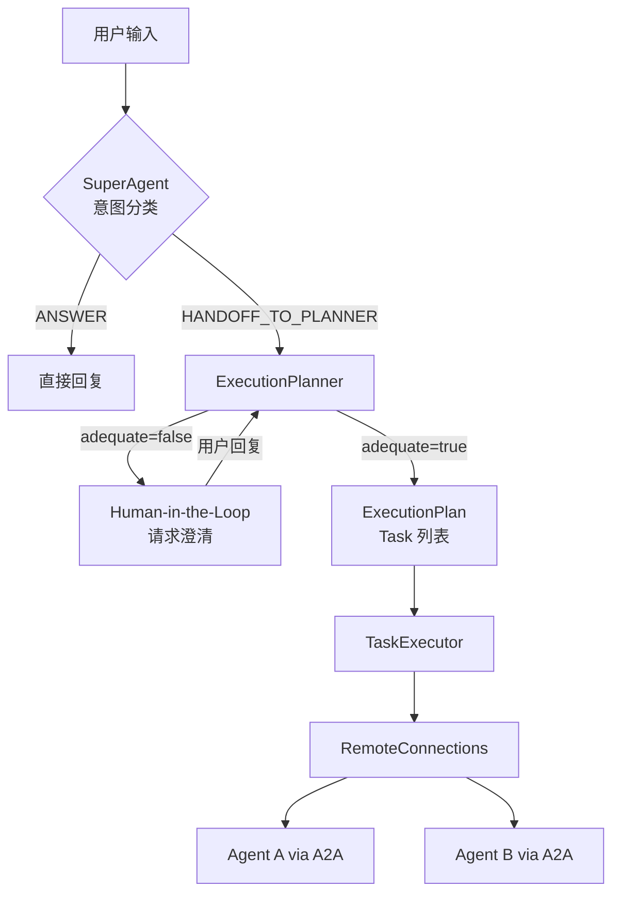
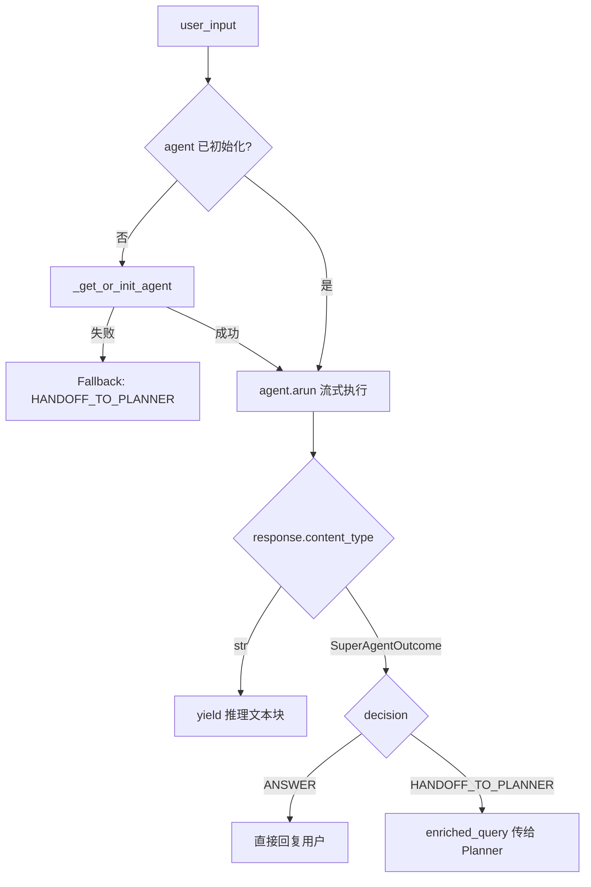
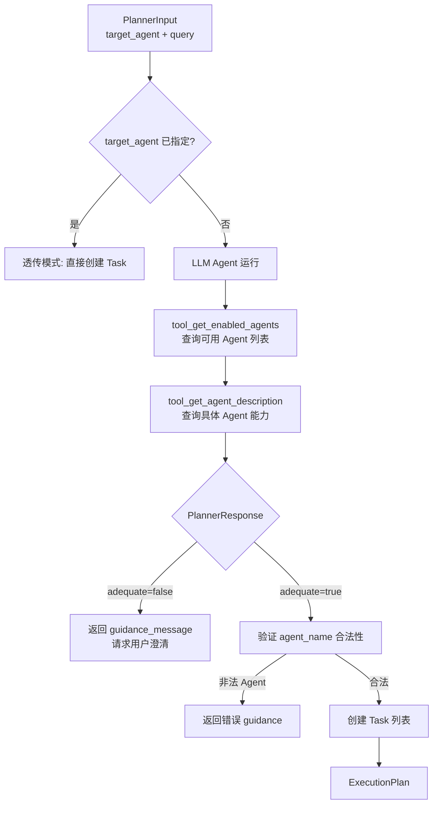
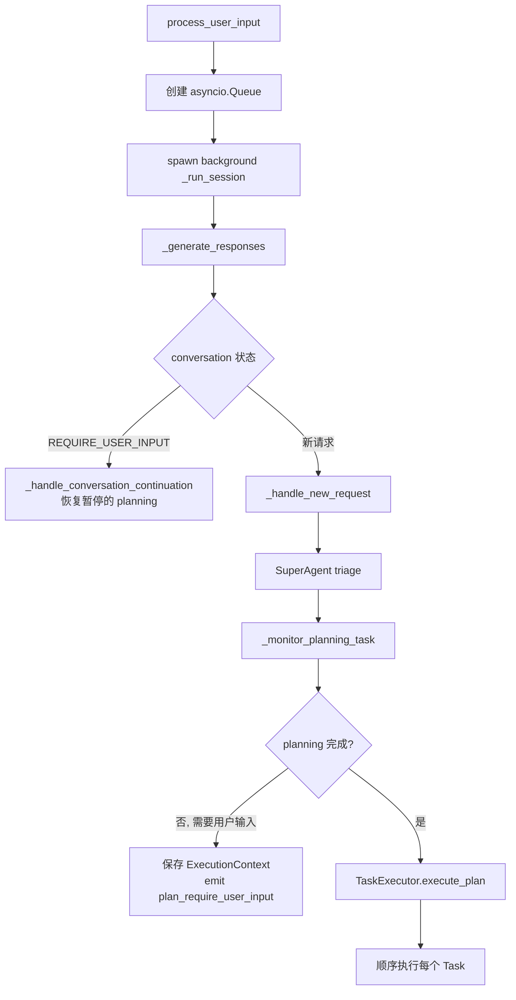

# PD-02.NN ValueCell — SuperAgent→Planner→Orchestrator 三层多 Agent 编排

> 文档编号：PD-02.NN
> 来源：ValueCell `python/valuecell/core/coordinate/orchestrator.py`, `python/valuecell/core/plan/planner.py`, `python/valuecell/core/super_agent/core.py`
> GitHub：https://github.com/ValueCell-ai/valuecell.git
> 问题域：PD-02 多 Agent 编排 Multi-Agent Orchestration
> 状态：可复用方案

---

## 第 1 章 问题与动机

### 1.1 核心问题

多 Agent 系统面临一个根本矛盾：用户的自然语言请求是模糊的，但 Agent 的执行需要精确的任务定义。如何在"理解意图"和"精确执行"之间架设桥梁？

传统做法是单层 Orchestrator 直接解析用户输入并分发任务，但这导致 Orchestrator 承担过多职责——既要做意图分类（简单问答 vs 复杂任务），又要做任务规划（选择哪个 Agent、如何分解），还要做执行协调（SSE 推送、状态管理、错误处理）。

ValueCell 的核心洞察是：**将编排拆分为三个独立的决策层**，每层只做一件事，通过 Pydantic schema 严格约束层间通信。

### 1.2 ValueCell 的解法概述

1. **SuperAgent 意图分类层**：轻量级 LLM 分流器，二元决策——直接回答（ANSWER）或交给 Planner（HANDOFF_TO_PLANNER），支持流式推理输出 (`python/valuecell/core/super_agent/core.py:132-184`)
2. **ExecutionPlanner 任务规划层**：基于 AgentCard 能力声明的 LLM 规划器，输出结构化 ExecutionPlan，支持 Human-in-the-Loop 暂停/恢复 (`python/valuecell/core/plan/planner.py:132-174`)
3. **AgentOrchestrator 执行协调层**：无 LLM 的纯逻辑协调器，管理 SSE 流、ExecutionContext 暂停恢复、TaskExecutor 顺序执行 (`python/valuecell/core/coordinate/orchestrator.py:68-644`)
4. **A2A 协议跨进程通信**：通过 `a2a.types.AgentCard` 标准化 Agent 能力声明，RemoteConnections 管理本地/远程 Agent 的懒加载与连接池 (`python/valuecell/core/agent/connect.py:203-684`)
5. **背景任务解耦**：`process_user_input` 将生产者（pipeline）和消费者（SSE 连接）解耦，消费者断开不影响任务执行 (`python/valuecell/core/coordinate/orchestrator.py:98-145`)

### 1.3 设计思想

| 设计原则 | 具体实现 | 理由 | 替代方案 |
|----------|----------|------|----------|
| 关注点分离 | 三层架构：SuperAgent / Planner / Orchestrator | 每层只做一个决策，降低单层复杂度 | 单层 Orchestrator 全包（MetaGPT 风格） |
| Schema 驱动通信 | Pydantic BaseModel 约束层间数据（SuperAgentOutcome / PlannerResponse / ExecutionPlan） | 编译时类型安全 + 运行时校验 | 自由格式 dict 传递 |
| 懒初始化 | SuperAgent 和 Planner 的 LLM Agent 在首次调用时才创建 | 避免启动时 API key 缺失导致全局失败 | 启动时强制初始化 |
| 生产者-消费者解耦 | asyncio.Queue + background task | SSE 断开不中断任务执行 | 同步 yield（断开即终止） |
| 能力声明式路由 | AgentCard JSON 描述 Agent 技能，Planner 通过工具调用查询 | Agent 增减无需改 Planner 代码 | 硬编码 Agent 列表 |

---

## 第 2 章 源码实现分析

### 2.1 架构概览

```
┌─────────────────────────────────────────────────────────────────┐
│                      AgentOrchestrator                          │
│  ┌──────────┐    ┌──────────────┐    ┌──────────────────────┐   │
│  │SuperAgent│───→│ExecutionPlan-│───→│   TaskExecutor        │   │
│  │ (意图分类) │    │ner (任务规划) │    │  (顺序执行 + A2A)    │   │
│  └──────────┘    └──────────────┘    └──────────────────────┘   │
│       │                │                       │                │
│       │ ANSWER         │ HITL                  │ A2A            │
│       ↓                ↓                       ↓                │
│  直接回复用户    暂停等待用户输入      RemoteConnections        │
│                                      ┌────┬────┬────┐          │
│                                      │AgA │AgB │AgC │          │
│                                      └────┴────┴────┘          │
└─────────────────────────────────────────────────────────────────┘
         ↕ SSE (asyncio.Queue 解耦)
      前端消费者
```

三层决策流：



### 2.2 核心实现

#### 2.2.1 SuperAgent 意图分类

SuperAgent 是一个轻量级 LLM 分流器，核心逻辑是二元决策。它使用 Agno Agent 框架，输出 schema 固定为 `SuperAgentOutcome`。



对应源码 `python/valuecell/core/super_agent/core.py:132-184`：

```python
async def run(
    self, user_input: UserInput
) -> AsyncIterator[str | SuperAgentOutcome]:
    """Run super agent triage."""
    await asyncio.sleep(0)
    agent = self._get_or_init_agent()
    if agent is None:
        yield SuperAgentOutcome(
            decision=SuperAgentDecision.HANDOFF_TO_PLANNER,
            enriched_query=user_input.query,
            reason="SuperAgent unavailable: missing model/provider configuration",
        )

    try:
        async for response in agent.arun(
            user_input.query,
            session_id=user_input.meta.conversation_id,
            user_id=user_input.meta.user_id,
            add_history_to_context=True,
            stream=True,
        ):
            if response.content_type == "str":
                yield response.content
                continue
            final_outcome = response.content
            if not isinstance(final_outcome, SuperAgentOutcome):
                final_outcome = SuperAgentOutcome(
                    decision=SuperAgentDecision.ANSWER,
                    answer_content=f"SuperAgent produced a malformed response: `{final_outcome}`.",
                )
            yield final_outcome
    except Exception as e:
        yield SuperAgentOutcome(
            decision=SuperAgentDecision.ANSWER,
            reason=f"SuperAgent encountered an error: {e}.",
        )
```

关键设计点：
- **懒初始化 + 模型一致性检测**：`_get_or_init_agent()` 在首次调用时创建 Agent，后续调用检测环境配置的模型是否变化，变化则自动重建 (`core.py:49-130`)
- **流式推理**：`stream=True` 使 SuperAgent 的推理过程实时推送到前端，用户可以看到"思考过程"
- **优雅降级**：Agent 初始化失败不抛异常，而是 fallback 到 HANDOFF_TO_PLANNER

#### 2.2.2 ExecutionPlanner 任务规划

Planner 是整个编排的核心决策点。它通过两个工具函数（`tool_get_enabled_agents` 和 `tool_get_agent_description`）让 LLM 自主查询可用 Agent 的能力，然后输出结构化的 `PlannerResponse`。



对应源码 `python/valuecell/core/plan/planner.py:176-311`：

```python
async def _analyze_input_and_create_tasks(
    self, user_input, conversation_id, user_input_callback, thread_id,
) -> tuple[List[Task], Optional[str]]:
    agent = self._get_or_init_agent()
    if agent is None:
        return [], "Planner is unavailable: failed to initialize model/provider."

    try:
        run_response = agent.run(
            PlannerInput(
                target_agent_name=user_input.target_agent_name,
                query=user_input.query,
            ),
            session_id=conversation_id,
            user_id=user_input.meta.user_id,
        )
    except Exception as exc:
        return [], f"Planner encountered an error: {exc}."

    # Human-in-the-Loop: 处理 Planner 暂停请求用户输入
    while run_response.is_paused:
        for tool in run_response.tools_requiring_user_input:
            for field in tool.user_input_schema:
                request = UserInputRequest(field.description)
                await user_input_callback(request)
                user_value = await request.wait_for_response()
                field.value = user_value
        run_response = agent.continue_run(
            run_response=run_response,
            updated_tools=run_response.tools,
        )

    # 验证 Agent 名称合法性
    planable_cards = self.agent_connections.get_planable_agent_cards()
    invalid_agents = {t.agent_name for t in plan_raw.tasks if t.agent_name not in planable_cards}
    if invalid_agents:
        return [], f"Planner selected unsupported agent(s): {invalid_agents}."

    # 创建 Task 对象
    tasks = [self._create_task(t, user_input.meta.user_id, ...) for t in plan_raw.tasks]
    return tasks, guidance_message
```

关键设计点：
- **Agent 名称校验**：Planner 输出的 agent_name 必须在 `get_planable_agent_cards()` 返回的合法列表中，防止 LLM 幻觉 (`planner.py:272-296`)
- **Human-in-the-Loop**：通过 `UserInputRequest` + `asyncio.Event` 实现非阻塞等待，Planner 可以多次暂停请求澄清 (`planner.py:231-251`)
- **Subagent Handoff**：当从 SuperAgent 转交时，创建新的 conversation_id 但保留父 thread_id，实现跨层关联 (`planner.py:340-354`)

#### 2.2.3 AgentOrchestrator 执行协调

Orchestrator 是无 LLM 的纯逻辑层，负责将 SuperAgent → Planner → TaskExecutor 串联起来，管理 SSE 流和 ExecutionContext。



对应源码 `python/valuecell/core/coordinate/orchestrator.py:98-145`：

```python
async def process_user_input(
    self, user_input: UserInput
) -> AsyncGenerator[BaseResponse, None]:
    queue: asyncio.Queue[Optional[BaseResponse]] = asyncio.Queue()
    active = {"value": True}

    async def emit(item: Optional[BaseResponse]):
        if not active["value"]:
            return
        try:
            await queue.put(item)
        except Exception:
            pass

    asyncio.create_task(self._run_session(user_input, emit))

    try:
        while True:
            item = await queue.get()
            if item is None:
                break
            yield item
    except asyncio.CancelledError:
        active["value"] = False
        raise
    finally:
        active["value"] = False
```

关键设计点：
- **生产者-消费者解耦**：`_run_session` 作为 background task 独立运行，通过 Queue 向消费者推送。消费者（SSE 连接）断开时设置 `active=False`，生产者继续执行但不再入队 (`orchestrator.py:98-145`)
- **ExecutionContext TTL**：暂停的 planning 上下文有 1 小时过期时间，过期后自动清理 (`orchestrator.py:31-66`)
- **用户身份校验**：恢复暂停的 execution 时验证 user_id 一致性，防止跨用户劫持 (`orchestrator.py:512-529`)

### 2.3 实现细节

#### AgentServiceBundle 依赖注入

`AgentServiceBundle` 是一个 frozen dataclass，通过 `compose()` 工厂方法构建所有服务依赖，保证 conversation-oriented 对象共享同一个 `ConversationManager` 实例：

```python
# python/valuecell/core/coordinate/services.py:24-90
@dataclass(frozen=True)
class AgentServiceBundle:
    agent_connections: RemoteConnections
    conversation_service: ConversationService
    event_service: EventResponseService
    task_service: TaskService
    plan_service: PlanService
    super_agent_service: SuperAgentService
    task_executor: TaskExecutor

    @classmethod
    def compose(cls, *, conversation_service=None, event_service=None, ...):
        connections = RemoteConnections()
        # 保证 ConversationManager 单例共享
        if conversation_service is not None:
            conv_service = conversation_service
        elif event_service is not None:
            conv_service = event_service.conversation_service
        else:
            base_manager = ConversationManager(
                conversation_store=SQLiteConversationStore(resolve_db_path()),
                item_store=SQLiteItemStore(resolve_db_path()),
            )
            conv_service = ConversationService(manager=base_manager)
        ...
```

#### RemoteConnections 懒加载与连接池

RemoteConnections 从 JSON 配置文件加载 AgentCard，支持本地进程内 Agent 和远程 HTTP Agent 的统一管理：

- **Per-agent Lock**：防止并发 `start_agent` 导致重复初始化 (`connect.py:220-224`)
- **ThreadPoolExecutor 异步导入**：本地 Agent 的 Python 模块导入在线程池中执行，避免阻塞事件循环 (`connect.py:72-145`)
- **Client 初始化重试**：本地 Agent 有 3 次重试（等待启动），远程 Agent 只重试 1 次 (`connect.py:482-507`)

#### TaskExecutor 顺序执行与 Subagent Handoff

TaskExecutor 按 plan 中的 Task 列表顺序执行，每个 Task 通过 A2A 协议发送到远程 Agent：

```python
# python/valuecell/core/task/executor.py:112-202
async def execute_plan(self, plan, thread_id, metadata=None):
    if plan.guidance_message:
        yield await self._event_service.emit(...)  # 发送引导消息

    for task in plan.tasks:
        if task.handoff_from_super_agent:
            # 创建子 Agent 会话 + 发送 SUBAGENT_CONVERSATION START 组件
            await self._conversation_service.ensure_conversation(...)
            yield await self._emit_subagent_conversation_component(..., START)
            yield await self._event_service.emit(thread_started)

        async for response in self.execute_task(task, thread_id, metadata):
            yield response

        if task.handoff_from_super_agent:
            yield await emit_subagent_end_once()  # SUBAGENT_CONVERSATION END
```

#### 数据流全景

```
UserInput
  ↓
SuperAgentOutcome { decision, enriched_query }
  ↓
PlannerInput { target_agent_name, query }
  ↓
PlannerResponse { tasks: [_TaskBrief], adequate, guidance_message }
  ↓
ExecutionPlan { plan_id, tasks: [Task], guidance_message }
  ↓
Task { task_id, agent_name, query, status, pattern, schedule_config }
  ↓
A2A client.send_message(query) → remote Agent streaming response
  ↓
BaseResponse (SSE events) → asyncio.Queue → 前端
```

---

## 第 3 章 迁移指南

### 3.1 迁移清单

**阶段 1：数据模型层（无 LLM 依赖）**
- [ ] 定义 `SuperAgentOutcome` Pydantic 模型（decision enum + enriched_query）
- [ ] 定义 `PlannerResponse` / `_TaskBrief` / `ExecutionPlan` Pydantic 模型
- [ ] 定义 `Task` 模型（含 6 态状态机：PENDING → RUNNING → COMPLETED/FAILED/CANCELLED）
- [ ] 实现 `UserInputRequest`（asyncio.Event 驱动的 HITL 请求）

**阶段 2：三层编排核心**
- [ ] 实现 SuperAgent 意图分类器（可用简单规则替代 LLM）
- [ ] 实现 ExecutionPlanner（核心：AgentCard 查询工具 + 结构化输出）
- [ ] 实现 AgentOrchestrator（asyncio.Queue 生产者-消费者 + ExecutionContext）
- [ ] 实现 TaskExecutor（顺序执行 + A2A client.send_message）

**阶段 3：Agent 连接管理**
- [ ] 实现 RemoteConnections（JSON 配置加载 + 懒初始化 + per-agent lock）
- [ ] 实现 AgentClient（A2A 协议 HTTP 客户端）
- [ ] 实现 AgentServiceBundle（依赖注入容器）

**阶段 4：可选增强**
- [ ] 添加 ScheduledTaskResultAccumulator（定时任务结果收集）
- [ ] 添加 ExecutionContext TTL 过期清理
- [ ] 添加 Subagent Handoff 组件（START/END 生命周期事件）

### 3.2 适配代码模板

#### 最小可运行的三层编排骨架

```python
import asyncio
from enum import Enum
from typing import AsyncGenerator, List, Optional
from pydantic import BaseModel, Field


# === Layer 1: SuperAgent 意图分类 ===

class Decision(str, Enum):
    ANSWER = "answer"
    HANDOFF = "handoff_to_planner"

class TriageResult(BaseModel):
    decision: Decision
    enriched_query: Optional[str] = None
    answer: Optional[str] = None

async def triage(query: str) -> TriageResult:
    """轻量级意图分类。可替换为 LLM 调用。"""
    simple_keywords = ["你好", "hello", "hi", "什么是", "what is"]
    if any(kw in query.lower() for kw in simple_keywords):
        return TriageResult(decision=Decision.ANSWER, answer=f"这是一个简单问题的回答: {query}")
    return TriageResult(decision=Decision.HANDOFF, enriched_query=query)


# === Layer 2: Planner 任务规划 ===

class TaskBrief(BaseModel):
    agent_name: str
    query: str
    title: str = ""

class PlanResult(BaseModel):
    tasks: List[TaskBrief] = []
    adequate: bool = True
    guidance: Optional[str] = None

# Agent 能力注册表（对应 ValueCell 的 AgentCard JSON）
AGENT_REGISTRY = {
    "researcher": {"description": "搜索和研究", "skills": ["web_search", "summarize"]},
    "coder": {"description": "代码生成和调试", "skills": ["code_gen", "debug"]},
}

async def plan(query: str, target_agent: str = "") -> PlanResult:
    """任务规划。生产环境应替换为 LLM + tool_get_enabled_agents。"""
    if target_agent and target_agent in AGENT_REGISTRY:
        return PlanResult(tasks=[TaskBrief(agent_name=target_agent, query=query, title=query[:20])])
    # 简单关键词路由（生产环境用 LLM）
    if any(kw in query for kw in ["搜索", "查找", "research"]):
        return PlanResult(tasks=[TaskBrief(agent_name="researcher", query=query, title="Research")])
    if any(kw in query for kw in ["代码", "code", "实现", "implement"]):
        return PlanResult(tasks=[TaskBrief(agent_name="coder", query=query, title="Code")])
    return PlanResult(adequate=False, guidance="请明确您需要搜索还是编码帮助。")


# === Layer 3: Orchestrator 执行协调 ===

async def execute_task(task: TaskBrief) -> str:
    """模拟 A2A 远程 Agent 调用。"""
    await asyncio.sleep(0.1)  # 模拟网络延迟
    return f"[{task.agent_name}] 完成: {task.query}"

async def orchestrate(query: str) -> AsyncGenerator[str, None]:
    """三层编排主流程，对应 ValueCell 的 AgentOrchestrator.process_user_input。"""
    # Layer 1: SuperAgent triage
    result = await triage(query)
    if result.decision == Decision.ANSWER:
        yield result.answer
        return

    # Layer 2: Planner
    plan_result = await plan(result.enriched_query)
    if not plan_result.adequate:
        yield f"[需要澄清] {plan_result.guidance}"
        return

    # Layer 3: TaskExecutor
    for task in plan_result.tasks:
        response = await execute_task(task)
        yield response


# 使用示例
async def main():
    async for msg in orchestrate("帮我搜索 Python asyncio 最佳实践"):
        print(msg)

if __name__ == "__main__":
    asyncio.run(main())
```

### 3.3 适用场景

| 场景 | 适用度 | 说明 |
|------|--------|------|
| 多 Agent 协作平台（如 AI 助手） | ⭐⭐⭐ | 三层分离天然适合意图多样、Agent 多样的场景 |
| 需要 Human-in-the-Loop 的工作流 | ⭐⭐⭐ | ExecutionContext + asyncio.Event 提供完整的暂停/恢复机制 |
| 定时/周期性 Agent 任务 | ⭐⭐⭐ | ScheduleConfig + TaskPattern.RECURRING 原生支持 |
| 简单的单 Agent 调用 | ⭐ | 三层架构过重，直接调用即可 |
| 需要 DAG 并行编排 | ⭐⭐ | 当前 TaskExecutor 是顺序执行，需扩展为并行 |
| 实时流式交互（ChatBot） | ⭐⭐⭐ | SSE + asyncio.Queue 解耦天然支持流式推送 |

---

## 第 4 章 测试用例

```python
import asyncio
import pytest
from unittest.mock import AsyncMock, MagicMock, patch
from enum import Enum
from typing import Optional
from pydantic import BaseModel, Field


# === 测试 SuperAgent 意图分类 ===

class SuperAgentDecision(str, Enum):
    ANSWER = "answer"
    HANDOFF_TO_PLANNER = "handoff_to_planner"

class SuperAgentOutcome(BaseModel):
    decision: SuperAgentDecision
    answer_content: Optional[str] = None
    enriched_query: Optional[str] = None
    reason: Optional[str] = None


class TestSuperAgentTriage:
    """测试 SuperAgent 的二元决策逻辑。"""

    def test_answer_decision_has_content(self):
        outcome = SuperAgentOutcome(
            decision=SuperAgentDecision.ANSWER,
            answer_content="Python 是一种编程语言。",
        )
        assert outcome.decision == SuperAgentDecision.ANSWER
        assert outcome.answer_content is not None

    def test_handoff_decision_has_enriched_query(self):
        outcome = SuperAgentOutcome(
            decision=SuperAgentDecision.HANDOFF_TO_PLANNER,
            enriched_query="请帮我搜索 Python asyncio 的最佳实践并生成总结报告",
        )
        assert outcome.decision == SuperAgentDecision.HANDOFF_TO_PLANNER
        assert "asyncio" in outcome.enriched_query

    def test_fallback_on_unavailable_model(self):
        """SuperAgent 模型不可用时应 fallback 到 HANDOFF。"""
        outcome = SuperAgentOutcome(
            decision=SuperAgentDecision.HANDOFF_TO_PLANNER,
            enriched_query="original query",
            reason="SuperAgent unavailable",
        )
        assert outcome.decision == SuperAgentDecision.HANDOFF_TO_PLANNER


# === 测试 Planner Agent 名称校验 ===

class TestPlannerValidation:
    """测试 Planner 的 Agent 名称合法性校验。"""

    def test_valid_agent_name_passes(self):
        planable_agents = {"researcher", "coder"}
        proposed = "researcher"
        assert proposed in planable_agents

    def test_invalid_agent_name_rejected(self):
        planable_agents = {"researcher", "coder"}
        proposed = "hallucinated_agent"
        assert proposed not in planable_agents

    def test_empty_plan_with_guidance(self):
        """adequate=false 时应返回 guidance_message。"""
        from pydantic import BaseModel
        class PlannerResponse(BaseModel):
            adequate: bool
            guidance_message: Optional[str] = None
        resp = PlannerResponse(adequate=False, guidance_message="请提供更多细节")
        assert not resp.adequate
        assert resp.guidance_message is not None


# === 测试 ExecutionContext TTL ===

class TestExecutionContext:
    """测试 ExecutionContext 的过期和用户校验。"""

    def test_context_not_expired_within_ttl(self):
        """1 小时内的 context 不应过期。"""
        # 模拟：created_at = current_time，max_age = 3600
        created_at = 1000.0
        current_time = 1000.0 + 3599
        assert (current_time - created_at) <= 3600

    def test_context_expired_after_ttl(self):
        created_at = 1000.0
        current_time = 1000.0 + 3601
        assert (current_time - created_at) > 3600

    def test_user_validation_matches(self):
        user_id = "user_123"
        context_user_id = "user_123"
        assert user_id == context_user_id

    def test_user_validation_rejects_mismatch(self):
        user_id = "user_456"
        context_user_id = "user_123"
        assert user_id != context_user_id


# === 测试 UserInputRequest HITL 机制 ===

class UserInputRequest:
    def __init__(self, prompt: str):
        self.prompt = prompt
        self.response: Optional[str] = None
        self.event = asyncio.Event()

    async def wait_for_response(self) -> str:
        await self.event.wait()
        return self.response

    def provide_response(self, response: str):
        self.response = response
        self.event.set()


class TestUserInputRequest:
    @pytest.mark.asyncio
    async def test_provide_response_unblocks_waiter(self):
        request = UserInputRequest("请输入您的偏好")
        async def provider():
            await asyncio.sleep(0.05)
            request.provide_response("我偏好 Python")
        asyncio.create_task(provider())
        result = await request.wait_for_response()
        assert result == "我偏好 Python"

    @pytest.mark.asyncio
    async def test_multiple_requests_independent(self):
        req1 = UserInputRequest("问题1")
        req2 = UserInputRequest("问题2")
        req1.provide_response("答案1")
        req2.provide_response("答案2")
        assert await req1.wait_for_response() == "答案1"
        assert await req2.wait_for_response() == "答案2"
```

---

## 第 5 章 跨域关联

| 关联域 | 关系类型 | 说明 |
|--------|----------|------|
| PD-01 上下文管理 | 协同 | SuperAgent 和 Planner 都使用 Agno 的 `num_history_runs=5` + `enable_session_summaries` 管理对话上下文，ExecutionPlanner 的 `InMemoryDb` 存储会话历史 |
| PD-03 容错与重试 | 协同 | SuperAgent 和 Planner 的懒初始化失败时优雅降级（不抛异常），RemoteConnections 的 client 初始化有指数退避重试（3 次 / 0.2s→0.4s→0.8s） |
| PD-04 工具系统 | 依赖 | Planner 通过 `tool_get_enabled_agents` 和 `tool_get_agent_description` 两个工具函数查询 Agent 能力，这是 Agno Agent 的 tools 机制 |
| PD-06 记忆持久化 | 协同 | ConversationManager 使用 SQLite 持久化会话和消息项，AgentServiceBundle 保证所有服务共享同一个 ConversationManager 实例 |
| PD-09 Human-in-the-Loop | 依赖 | Planner 的 `UserInputRequest` + `asyncio.Event` 是 HITL 的核心实现，Orchestrator 的 `ExecutionContext` 管理暂停/恢复状态 |
| PD-11 可观测性 | 协同 | EventResponseService 是所有响应的中央枢纽，每个事件（reasoning、tool_call、message、task_status）都通过 emit 持久化并推送 |

---

## 第 6 章 来源文件索引

| 文件 | 行范围 | 关键实现 |
|------|--------|----------|
| `python/valuecell/core/super_agent/core.py` | L18-33 | SuperAgentDecision 枚举 + SuperAgentOutcome 模型定义 |
| `python/valuecell/core/super_agent/core.py` | L35-131 | SuperAgent 类：懒初始化 + 模型一致性检测 |
| `python/valuecell/core/super_agent/core.py` | L132-184 | SuperAgent.run()：流式推理 + 二元决策 |
| `python/valuecell/core/plan/planner.py` | L37-73 | UserInputRequest：asyncio.Event 驱动的 HITL |
| `python/valuecell/core/plan/planner.py` | L75-131 | ExecutionPlanner.__init__ + _get_or_init_agent：懒初始化 |
| `python/valuecell/core/plan/planner.py` | L132-174 | create_plan()：规划入口 |
| `python/valuecell/core/plan/planner.py` | L176-311 | _analyze_input_and_create_tasks()：LLM 规划 + Agent 校验 |
| `python/valuecell/core/plan/planner.py` | L357-387 | tool_get_agent_description / tool_get_enabled_agents |
| `python/valuecell/core/plan/models.py` | L8-87 | ExecutionPlan / _TaskBrief / PlannerInput / PlannerResponse 模型 |
| `python/valuecell/core/coordinate/orchestrator.py` | L31-66 | ExecutionContext：暂停状态 + TTL 过期 |
| `python/valuecell/core/coordinate/orchestrator.py` | L68-94 | AgentOrchestrator.__init__：服务注入 |
| `python/valuecell/core/coordinate/orchestrator.py` | L98-145 | process_user_input()：Queue 解耦生产者-消费者 |
| `python/valuecell/core/coordinate/orchestrator.py` | L292-403 | _handle_new_request()：SuperAgent → Planner → Executor 主流程 |
| `python/valuecell/core/coordinate/orchestrator.py` | L419-510 | _monitor_planning_task()：轮询 planning 完成 + HITL 中断 |
| `python/valuecell/core/coordinate/services.py` | L24-90 | AgentServiceBundle：frozen dataclass 依赖注入 |
| `python/valuecell/core/task/executor.py` | L95-111 | TaskExecutor.__init__：依赖注入 |
| `python/valuecell/core/task/executor.py` | L112-202 | execute_plan()：顺序执行 + Subagent Handoff |
| `python/valuecell/core/task/executor.py` | L323-443 | _execute_single_task_run()：A2A client.send_message + 流式响应 |
| `python/valuecell/core/task/models.py` | L10-19 | TaskStatus 6 态枚举 |
| `python/valuecell/core/task/models.py` | L45-148 | Task 模型：状态机方法 + is_scheduled() |
| `python/valuecell/core/agent/connect.py` | L203-284 | RemoteConnections：JSON 配置加载 + 懒初始化 |
| `python/valuecell/core/agent/connect.py` | L348-388 | start_agent()：per-agent lock + 连接管理 |
| `python/valuecell/core/agent/connect.py` | L600-606 | get_client()：自动 start_agent 的懒获取 |
| `python/valuecell/core/agent/connect.py` | L660-674 | get_planable_agent_cards()：过滤 passthrough 和 hidden |

---

## 第 7 章 横向对比维度

```json comparison_data
{
  "project": "ValueCell",
  "dimensions": {
    "编排模式": "三层顺序流水线：SuperAgent→Planner→Orchestrator→TaskExecutor",
    "并行能力": "Task 列表顺序执行，无 DAG 并行",
    "状态管理": "ExecutionContext 内存字典 + TTL 过期 + 用户身份校验",
    "并发限制": "per-agent asyncio.Lock 防止并发 start_agent",
    "工具隔离": "Planner 仅暴露 get_enabled_agents/get_agent_description 两个工具",
    "反应式自愈": "SuperAgent/Planner 懒初始化失败优雅降级，不抛异常",
    "递归防护": "三层架构天然隔离，SuperAgent 不能调用自身",
    "结果回传": "A2A TaskStatusUpdateEvent 流式回传 + EventResponseService 统一 emit",
    "结构验证": "Planner 输出的 agent_name 校验合法性，防止 LLM 幻觉",
    "模块自治": "AgentCard JSON 声明能力，Agent 增删无需改 Planner 代码",
    "懒初始化": "SuperAgent/Planner/RemoteConnections 均首次调用时初始化",
    "A2A协议集成": "基于 a2a.types.AgentCard 标准化能力声明与跨进程通信",
    "生产者消费者解耦": "asyncio.Queue 解耦 SSE 消费者与 pipeline 生产者",
    "定时任务支持": "TaskPattern.RECURRING + ScheduleConfig 原生周期执行"
  }
}
```

### 域元数据补充

```json domain_metadata
{
  "solution_summary": "ValueCell 通过 SuperAgent→Planner→Orchestrator 三层架构实现编排：SuperAgent 做 LLM 意图分类（ANSWER/HANDOFF），Planner 基于 AgentCard 能力声明生成 ExecutionPlan，Orchestrator 用 asyncio.Queue 解耦 SSE 推送与 A2A 协议执行",
  "description": "三层决策分离（意图分类/任务规划/执行协调）降低单层编排复杂度",
  "sub_problems": [
    "意图分类前置：如何用轻量级 LLM 在编排前过滤简单问答避免不必要的规划开销",
    "Agent 能力声明式发现：Planner 如何通过工具调用动态查询可用 Agent 而非硬编码",
    "规划结果幻觉防护：如何校验 LLM Planner 输出的 agent_name 在合法注册表中",
    "SSE 连接与任务执行解耦：消费者断开后如何保证后台任务（尤其定时任务）继续执行",
    "跨层线程关联：SuperAgent handoff 到 Subagent 时如何保留 parent thread_id 实现全链路追踪"
  ],
  "best_practices": [
    "三层分离：意图分类、任务规划、执行协调各自独立，避免单层 Orchestrator 过载",
    "Schema 驱动层间通信：用 Pydantic 模型约束每层的输入输出，编译时类型安全 + 运行时校验",
    "懒初始化 LLM Agent：避免启动时 API key 缺失导致全局失败，首次调用时才创建",
    "Agent 名称校验：Planner 输出的 agent_name 必须在合法注册表中，防止 LLM 幻觉路由到不存在的 Agent"
  ]
}
```
