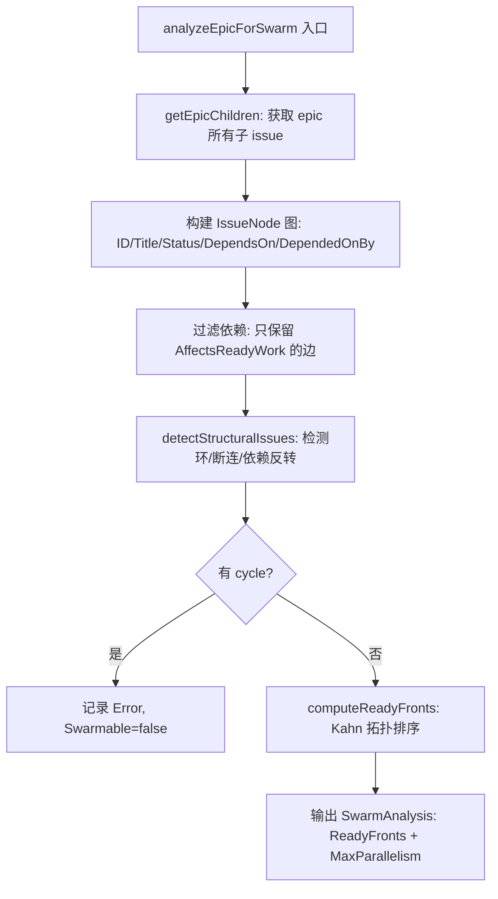
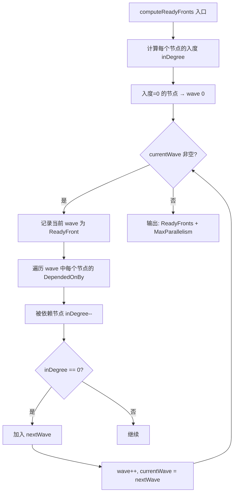

# PD-02.07 beads — Swarm DAG Ready-Front 波次编排

> 文档编号：PD-02.07
> 来源：beads `cmd/bd/swarm.go`, `cmd/bd/agent.go`, `internal/types/types.go`
> GitHub：https://github.com/steveyegge/beads.git
> 问题域：PD-02 多 Agent 编排 Multi-Agent Orchestration
> 状态：可复用方案

---

## 第 1 章 问题与动机（≥ 30 行）

### 1.1 核心问题

多 Agent 系统中，如何将一个大型 epic（史诗级任务）拆分为可并行执行的子任务波次，并在运行时动态计算哪些任务已就绪、哪些被阻塞？

传统做法是手动排列任务顺序或使用固定的流水线阶段。但当任务间存在复杂依赖关系时，固定排列会导致：
- 不必要的串行等待（本可并行的任务被迫排队）
- 依赖变更时需要手动重排
- 无法动态感知已完成任务释放的新并行机会

beads 的核心洞察是：**任务依赖本质上是一个 DAG（有向无环图），并行机会可以通过拓扑排序自动发现**。

### 1.2 beads 的解法概述

1. **Epic → DAG 自动构建**：从 epic 的 parent-child 依赖关系中提取子任务，构建依赖图（`cmd/bd/swarm.go:214-307`）
2. **Ready Front 波次计算**：使用 Kahn 拓扑排序算法，将 DAG 分层为可并行执行的"波次"（wave），每个波次内的任务互不依赖（`cmd/bd/swarm.go:443-509`）
3. **Swarm Molecule 协调实体**：创建专门的 swarm molecule 作为编排控制面，关联 epic 并指定 coordinator（`cmd/bd/swarm.go:877-1058`）
4. **Agent 状态机**：8 态状态机（idle/spawning/running/working/stuck/done/stopped/dead）+ heartbeat 心跳机制，支持 Witness 监控系统检测死亡 Agent（`cmd/bd/agent.go:17-26`）
5. **实时状态计算**：swarm status 不存储状态，而是从 beads 实时计算（completed/active/ready/blocked），确保状态始终一致（`cmd/bd/swarm.go:682-792`）

### 1.3 设计思想

| 设计原则 | 具体实现 | 理由 | 替代方案 |
|----------|----------|------|----------|
| 数据即真相 | swarm status 从 beads 实时计算，不存储冗余状态 | 避免状态不一致，单一数据源 | 维护独立的 swarm 状态表 |
| DAG 驱动调度 | Kahn 拓扑排序自动发现并行波次 | 最大化并行度，无需手动排列 | 固定流水线阶段 |
| 结构验证前置 | swarm validate 在创建前检测环、断连、依赖反转 | 防止运行时死锁 | 运行时检测 + 超时 |
| Agent 即 Bead | Agent 用 gt:agent 标签标记的 bead 表示，复用 issue 基础设施 | 统一数据模型，无需额外表 | 独立的 agent 注册表 |
| 松耦合协调 | pin/hook 机制分配工作，comment/label 通信 | Agent 间无直接调用，通过数据协调 | RPC/消息队列 |

---

## 第 2 章 源码实现分析（≥ 60 行，核心章节）

### 2.1 架构概览

beads 的 swarm 编排架构分为三层：数据层（types + storage）、分析层（swarm validate/status）、协调层（swarm create + agent）。

```
┌─────────────────────────────────────────────────────────┐
│                    Coordinator Agent                     │
│  (bd swarm create → bd swarm status → bd pin → monitor) │
└──────────┬──────────────────────────────────┬───────────┘
           │                                  │
    ┌──────▼──────┐                   ┌───────▼───────┐
    │ Swarm       │  relates-to       │ Epic          │
    │ Molecule    │──────────────────→│ (parent)      │
    │ mol_type=   │                   │               │
    │ "swarm"     │                   └───────┬───────┘
    └─────────────┘                     parent-child │
                                    ┌────────┼────────┐
                              ┌─────▼──┐ ┌───▼────┐ ┌─▼──────┐
                              │Issue A │ │Issue B │ │Issue C │
                              │wave=0  │ │wave=0  │ │wave=1  │
                              │(ready) │ │(ready) │ │(blocked│
                              └────────┘ └────────┘ │by A,B) │
                                                    └────────┘
```

依赖类型体系（`internal/types/types.go:670-733`）：

```
DependencyType
├── Workflow types (AffectsReadyWork = true)
│   ├── blocks           — A blocks B
│   ├── parent-child     — Epic → child
│   ├── conditional-blocks — B runs only if A fails
│   └── waits-for        — Fanout gate: wait for dynamic children
├── Association types (AffectsReadyWork = false)
│   ├── related / discovered-from
│   └── relates-to       — Swarm ↔ Epic 关联
└── Graph link types
    ├── replies-to / duplicates / supersedes
    └── authored-by / assigned-to / approved-by
```

### 2.2 核心实现

#### 2.2.1 Epic DAG 构建与结构分析



对应源码 `cmd/bd/swarm.go:214-307`：

```go
func analyzeEpicForSwarm(ctx context.Context, s SwarmStorage, epic *types.Issue) (*SwarmAnalysis, error) {
    analysis := &SwarmAnalysis{
        EpicID:    epic.ID,
        EpicTitle: epic.Title,
        Swarmable: true,
        Issues:    make(map[string]*IssueNode),
    }
    // 获取 epic 所有子 issue（通过 parent-child 依赖过滤）
    childIssues, err := getEpicChildren(ctx, s, epic.ID)
    if err != nil {
        return nil, err
    }
    analysis.TotalIssues = len(childIssues)
    // 构建依赖图：只保留 epic 内部的 blocking 依赖
    childIDSet := make(map[string]bool)
    for _, issue := range childIssues {
        childIDSet[issue.ID] = true
    }
    for _, issue := range childIssues {
        deps, _ := s.GetDependencyRecords(ctx, issue.ID)
        node := analysis.Issues[issue.ID]
        for _, dep := range deps {
            if dep.DependsOnID == epic.ID && dep.Type == types.DepParentChild {
                continue // 跳过到 epic 自身的 parent 关系
            }
            if !dep.Type.AffectsReadyWork() {
                continue // 只追踪 blocking 依赖
            }
            if childIDSet[dep.DependsOnID] {
                node.DependsOn = append(node.DependsOn, dep.DependsOnID)
            }
        }
    }
    detectStructuralIssues(analysis, childIssues)
    computeReadyFronts(analysis)
    analysis.Swarmable = len(analysis.Errors) == 0
    return analysis, nil
}
```

#### 2.2.2 Ready Front 波次计算（Kahn 拓扑排序）



对应源码 `cmd/bd/swarm.go:443-509`：

```go
func computeReadyFronts(analysis *SwarmAnalysis) {
    if len(analysis.Errors) > 0 {
        return // 有环则无法计算
    }
    // Kahn's algorithm: 拓扑排序 + 层级追踪
    inDegree := make(map[string]int)
    for id, node := range analysis.Issues {
        inDegree[id] = len(node.DependsOn)
    }
    // Wave 0: 所有无依赖的节点
    var currentWave []string
    for id, degree := range inDegree {
        if degree == 0 {
            currentWave = append(currentWave, id)
            analysis.Issues[id].Wave = 0
        }
    }
    wave := 0
    for len(currentWave) > 0 {
        sort.Strings(currentWave) // 确定性输出
        front := ReadyFront{Wave: wave, Issues: currentWave}
        analysis.ReadyFronts = append(analysis.ReadyFronts, front)
        if len(currentWave) > analysis.MaxParallelism {
            analysis.MaxParallelism = len(currentWave)
        }
        // 释放下一波
        var nextWave []string
        for _, id := range currentWave {
            for _, depID := range analysis.Issues[id].DependedOnBy {
                inDegree[depID]--
                if inDegree[depID] == 0 {
                    nextWave = append(nextWave, depID)
                    analysis.Issues[depID].Wave = wave + 1
                }
            }
        }
        currentWave = nextWave
        wave++
    }
    analysis.EstimatedSessions = analysis.TotalIssues
}
```

### 2.3 实现细节

#### Agent 状态机与心跳

Agent 在 beads 中不是独立实体，而是带 `gt:agent` 标签的 bead（issue）。8 个状态覆盖完整生命周期：

| 状态 | 含义 | 转换触发 |
|------|------|----------|
| idle | 等待工作 | Agent 启动后 / 完成任务后 |
| spawning | 正在启动 | 创建 Agent 时 |
| running | 执行中（通用） | 开始执行 |
| working | 主动工作中 | 正在处理具体任务 |
| stuck | 阻塞需要帮助 | Agent 自报告 |
| done | 当前工作完成 | 任务完成 |
| stopped | 干净关闭 | 正常退出 |
| dead | 非正常死亡 | Witness 超时检测 |

心跳机制（`cmd/bd/agent.go:264-340`）：Agent 定期调用 `bd agent heartbeat <id>` 更新 `last_activity` 时间戳。Witness 监控系统通过检查 `last_activity` 超时来判断 Agent 是否死亡。

#### 实时状态计算

`getSwarmStatus`（`cmd/bd/swarm.go:682-792`）不维护独立状态表，而是每次调用时从 beads 实时计算：

1. 获取 epic 所有子 issue
2. 构建内部依赖图
3. 按 issue 状态分类：closed → Completed, in_progress → Active
4. 对 open 状态的 issue，检查其所有 blocking 依赖是否已 closed：
   - 全部 closed → Ready（可以开始工作）
   - 有未 closed 的 → Blocked（列出 blockers）

这种"计算而非存储"的设计确保状态永远与底层数据一致。

#### 结构验证（5 项检查）

`detectStructuralIssues`（`cmd/bd/swarm.go:309-440`）在 swarm 创建前执行：

1. **根节点检测**：找到无依赖的起始节点（正常情况）
2. **叶节点检测**：找到无被依赖的终端节点
3. **依赖反转启发式**：名称含 "foundation/setup/base/core" 的 issue 应有 dependents；名称含 "integration/final/test" 的应有 dependencies
4. **断连子图检测**：DFS 从根节点遍历，检查是否所有节点可达
5. **环检测**：DFS 着色法检测依赖环，有环则 Swarmable=false


---

## 第 3 章 迁移指南（≥ 40 行）

### 3.1 迁移清单

**阶段 1：数据模型**
- [ ] 定义 Issue/Task 结构体，包含 ID、Status、DependsOn、DependedOnBy 字段
- [ ] 实现 DependencyType 枚举，区分 blocking（blocks/parent-child）和 non-blocking（relates-to）
- [ ] 实现 `AffectsReadyWork()` 方法，只有 blocking 类型参与调度计算

**阶段 2：DAG 分析引擎**
- [ ] 实现 `buildDependencyGraph(epicID)` 从存储层构建内存 DAG
- [ ] 实现 Kahn 拓扑排序计算 ready fronts
- [ ] 实现结构验证：环检测、断连检测、依赖反转启发式

**阶段 3：Agent 状态管理**
- [ ] 定义 Agent 状态枚举（至少 idle/running/stuck/done/dead）
- [ ] 实现 heartbeat 机制（定期更新 last_activity）
- [ ] 实现 Witness 超时检测（last_activity 超过阈值 → dead）

**阶段 4：协调层**
- [ ] 实现 swarm create（创建编排实体，关联 epic）
- [ ] 实现 swarm status（实时计算 completed/active/ready/blocked）
- [ ] 实现 pin/hook 工作分配机制

### 3.2 适配代码模板

以下是 Python 版本的 Ready Front 计算器，可直接复用：

```python
from dataclasses import dataclass, field
from collections import defaultdict
from typing import Optional

@dataclass
class TaskNode:
    id: str
    title: str
    status: str = "open"  # open | in_progress | closed
    depends_on: list[str] = field(default_factory=list)
    depended_on_by: list[str] = field(default_factory=list)
    wave: int = -1

@dataclass
class ReadyFront:
    wave: int
    task_ids: list[str]

@dataclass
class SwarmAnalysis:
    epic_id: str
    total_tasks: int = 0
    ready_fronts: list[ReadyFront] = field(default_factory=list)
    max_parallelism: int = 0
    swarmable: bool = True
    errors: list[str] = field(default_factory=list)

def compute_ready_fronts(nodes: dict[str, TaskNode]) -> SwarmAnalysis:
    """Kahn's algorithm: 拓扑排序 + 层级追踪，计算可并行波次。"""
    analysis = SwarmAnalysis(epic_id="", total_tasks=len(nodes))

    # 检测环
    if has_cycle(nodes):
        analysis.errors.append("Dependency cycle detected")
        analysis.swarmable = False
        return analysis

    # 计算入度
    in_degree = {nid: len(n.depends_on) for nid, n in nodes.items()}

    # Wave 0: 无依赖节点
    current_wave = sorted([nid for nid, deg in in_degree.items() if deg == 0])
    wave = 0

    while current_wave:
        for nid in current_wave:
            nodes[nid].wave = wave
        analysis.ready_fronts.append(ReadyFront(wave=wave, task_ids=list(current_wave)))
        analysis.max_parallelism = max(analysis.max_parallelism, len(current_wave))

        next_wave = []
        for nid in current_wave:
            for dep_id in nodes[nid].depended_on_by:
                in_degree[dep_id] -= 1
                if in_degree[dep_id] == 0:
                    next_wave.append(dep_id)
        current_wave = sorted(next_wave)
        wave += 1

    return analysis

def has_cycle(nodes: dict[str, TaskNode]) -> bool:
    """DFS 着色法检测环。"""
    WHITE, GRAY, BLACK = 0, 1, 2
    color = {nid: WHITE for nid in nodes}

    def dfs(nid: str) -> bool:
        color[nid] = GRAY
        for dep in nodes[nid].depends_on:
            if dep not in color:
                continue
            if color[dep] == GRAY:
                return True
            if color[dep] == WHITE and dfs(dep):
                return True
        color[nid] = BLACK
        return False

    return any(color[nid] == WHITE and dfs(nid) for nid in nodes)

def get_swarm_status(nodes: dict[str, TaskNode]) -> dict:
    """实时计算 swarm 状态（不存储，每次从数据计算）。"""
    completed, active, ready, blocked = [], [], [], []
    closed_ids = {nid for nid, n in nodes.items() if n.status == "closed"}

    for nid, node in nodes.items():
        if node.status == "closed":
            completed.append(nid)
        elif node.status == "in_progress":
            active.append(nid)
        else:
            blockers = [d for d in node.depends_on if d not in closed_ids]
            if blockers:
                blocked.append((nid, blockers))
            else:
                ready.append(nid)

    return {
        "completed": completed,
        "active": active,
        "ready": ready,
        "blocked": blocked,
        "progress": len(completed) / len(nodes) * 100 if nodes else 0,
    }
```

### 3.3 适用场景

| 场景 | 适用度 | 说明 |
|------|--------|------|
| AI Agent 并行编码 | ⭐⭐⭐ | 核心场景：epic 拆分为多个 coding task，DAG 自动调度 |
| CI/CD 流水线编排 | ⭐⭐⭐ | 构建/测试/部署任务的依赖管理和并行优化 |
| 研究任务分解 | ⭐⭐ | 研究子课题间有依赖时适用，但研究任务依赖通常较松散 |
| 单 Agent 顺序执行 | ⭐ | 过度设计，单 Agent 不需要 DAG 调度 |
| 实时流式处理 | ⭐ | 不适用，beads 模型面向离散任务而非流式数据 |

---

## 第 4 章 测试用例（≥ 20 行）

```python
import pytest
from swarm_scheduler import TaskNode, compute_ready_fronts, get_swarm_status, has_cycle

class TestReadyFrontComputation:
    def test_linear_chain(self):
        """线性依赖：A → B → C，每波一个任务。"""
        nodes = {
            "A": TaskNode(id="A", title="Task A", depends_on=[], depended_on_by=["B"]),
            "B": TaskNode(id="B", title="Task B", depends_on=["A"], depended_on_by=["C"]),
            "C": TaskNode(id="C", title="Task C", depends_on=["B"], depended_on_by=[]),
        }
        analysis = compute_ready_fronts(nodes)
        assert len(analysis.ready_fronts) == 3
        assert analysis.max_parallelism == 1
        assert analysis.ready_fronts[0].task_ids == ["A"]

    def test_diamond_dependency(self):
        """菱形依赖：A → B,C → D，B 和 C 可并行。"""
        nodes = {
            "A": TaskNode(id="A", title="Setup", depends_on=[], depended_on_by=["B", "C"]),
            "B": TaskNode(id="B", title="API", depends_on=["A"], depended_on_by=["D"]),
            "C": TaskNode(id="C", title="UI", depends_on=["A"], depended_on_by=["D"]),
            "D": TaskNode(id="D", title="Integration", depends_on=["B", "C"], depended_on_by=[]),
        }
        analysis = compute_ready_fronts(nodes)
        assert len(analysis.ready_fronts) == 3  # wave 0: A, wave 1: B+C, wave 2: D
        assert analysis.max_parallelism == 2
        assert sorted(analysis.ready_fronts[1].task_ids) == ["B", "C"]

    def test_cycle_detection(self):
        """环依赖应被检测，swarmable=False。"""
        nodes = {
            "A": TaskNode(id="A", title="A", depends_on=["B"], depended_on_by=["B"]),
            "B": TaskNode(id="B", title="B", depends_on=["A"], depended_on_by=["A"]),
        }
        analysis = compute_ready_fronts(nodes)
        assert not analysis.swarmable
        assert len(analysis.errors) > 0

    def test_fully_parallel(self):
        """无依赖：所有任务在 wave 0 并行。"""
        nodes = {
            f"T{i}": TaskNode(id=f"T{i}", title=f"Task {i}", depends_on=[], depended_on_by=[])
            for i in range(5)
        }
        analysis = compute_ready_fronts(nodes)
        assert len(analysis.ready_fronts) == 1
        assert analysis.max_parallelism == 5

    def test_swarm_status_realtime(self):
        """状态实时计算：closed 释放 blocked → ready。"""
        nodes = {
            "A": TaskNode(id="A", title="A", status="closed", depends_on=[], depended_on_by=["B"]),
            "B": TaskNode(id="B", title="B", status="open", depends_on=["A"], depended_on_by=[]),
            "C": TaskNode(id="C", title="C", status="in_progress", depends_on=[], depended_on_by=[]),
        }
        status = get_swarm_status(nodes)
        assert "A" in status["completed"]
        assert "B" in status["ready"]  # A closed → B unblocked
        assert "C" in status["active"]

    def test_empty_epic(self):
        """空 epic 应返回空分析，不报错。"""
        analysis = compute_ready_fronts({})
        assert analysis.total_tasks == 0
        assert analysis.swarmable is True
```


---

## 第 5 章 跨域关联

| 关联域 | 关系类型 | 说明 |
|--------|----------|------|
| PD-01 上下文管理 | 协同 | Agent 执行任务时需要上下文窗口管理；beads 的 compaction 机制（CompactionLevel/CompactedAt 字段）可压缩历史 |
| PD-03 容错与重试 | 依赖 | Agent 死亡检测（heartbeat 超时 → dead 状态）是容错的基础；conditional-blocks 依赖类型支持"A 失败才执行 B"的降级路径 |
| PD-04 工具系统 | 协同 | Agent 通过 pin/hook 机制获取工作，通过 bd CLI 工具交互；工具系统决定 Agent 的能力边界 |
| PD-06 记忆持久化 | 协同 | beads 本身就是持久化存储（Dolt 数据库 + git sync），Agent 状态、任务进度天然持久化 |
| PD-09 Human-in-the-Loop | 协同 | swarm validate 的 warnings 需要人工审查；coordinator 可以是人类或 Agent |
| PD-11 可观测性 | 依赖 | Witness 监控系统依赖 agent heartbeat 和 swarm status 实现可观测性 |

---

## 第 6 章 来源文件索引

| 文件 | 行范围 | 关键实现 |
|------|--------|----------|
| `cmd/bd/swarm.go` | L19-27 | swarmCmd 定义：Swarm management for structured epics |
| `cmd/bd/swarm.go` | L30-61 | SwarmAnalysis / ReadyFront / IssueNode 数据结构 |
| `cmd/bd/swarm.go` | L109-133 | getEpicChildren：通过 parent-child 依赖获取子 issue |
| `cmd/bd/swarm.go` | L214-307 | analyzeEpicForSwarm：DAG 构建 + 依赖过滤 + 结构验证 |
| `cmd/bd/swarm.go` | L309-440 | detectStructuralIssues：5 项结构检查（根/叶/反转/断连/环） |
| `cmd/bd/swarm.go` | L443-509 | computeReadyFronts：Kahn 拓扑排序计算并行波次 |
| `cmd/bd/swarm.go` | L568-590 | SwarmStatus / StatusIssue 数据结构 |
| `cmd/bd/swarm.go` | L682-792 | getSwarmStatus：实时计算 completed/active/ready/blocked |
| `cmd/bd/swarm.go` | L877-1058 | swarmCreateCmd：创建 swarm molecule + 单 issue 自动包装 |
| `cmd/bd/agent.go` | L17-26 | validAgentStates：8 态状态机定义 |
| `cmd/bd/agent.go` | L131-262 | runAgentState：状态更新 + Agent 自动创建 |
| `cmd/bd/agent.go` | L264-340 | runAgentHeartbeat：心跳更新 last_activity |
| `cmd/bd/agent.go` | L618-678 | parseAgentIDFields：从 Agent ID 解析 role_type 和 rig |
| `internal/types/types.go` | L108-127 | Agent Identity Fields + MolType + WorkType 字段定义 |
| `internal/types/types.go` | L532-573 | AgentState 枚举 + MolType 枚举（swarm/patrol/work） |
| `internal/types/types.go` | L670-733 | DependencyType 枚举 + AffectsReadyWork() 方法 |
| `internal/types/types.go` | L735-768 | WaitsForMeta：fanout gate 元数据（all-children/any-children） |
| `website/docs/multi-agent/coordination.md` | L1-158 | Agent 协调模式文档：pin/hook/handoff/fan-out/fan-in |

---

## 第 7 章 横向对比维度

```json comparison_data
{
  "project": "beads",
  "dimensions": {
    "编排模式": "DAG 拓扑排序 + Ready Front 波次调度，无固定流水线",
    "并行能力": "Kahn 算法自动发现最大并行度，按波次释放",
    "状态管理": "无冗余状态表，每次从 beads 实时计算 swarm status",
    "并发限制": "MaxParallelism 由 DAG 结构决定，无硬编码上限",
    "工具隔离": "Agent 通过 pin/hook 机制独占 issue，label 标记 gt:agent",
    "模块自治": "Agent 即 Bead，复用 issue 基础设施，8 态状态机自报告",
    "结果回传": "Agent 通过 bd close --reason 回传结果，comment 补充上下文",
    "反应式自愈": "Witness 通过 heartbeat 超时检测 dead Agent，可触发重新分配",
    "原子性保障": "Dolt 数据库事务 + git sync 保证数据一致性",
    "递归防护": "swarm validate 前置检测环依赖，有环则 Swarmable=false 拒绝创建",
    "结构验证": "5 项前置检查：环/断连/依赖反转/根节点/叶节点"
  }
}
```

### 域元数据补充

```json domain_metadata
{
  "solution_summary": "beads 用 Kahn 拓扑排序将 Epic DAG 分层为 Ready Front 波次，Agent 即 Bead 复用 issue 基础设施，swarm status 实时计算而非存储",
  "description": "DAG 驱动的波次调度：自动发现并行机会，结构验证前置防止运行时死锁",
  "sub_problems": [
    "结构验证前置：如何在编排启动前检测 DAG 中的环、断连、依赖反转等结构缺陷",
    "Agent 身份统一：如何将 Agent 建模为与任务同构的数据实体而非独立注册表",
    "单 issue 自动包装：如何将非 epic 的单个 issue 自动包装为可 swarm 的 epic 结构"
  ],
  "best_practices": [
    "计算而非存储：编排状态应从底层数据实时计算，避免冗余状态表导致不一致",
    "结构验证前置：在创建 swarm 前执行 DAG 结构检查，比运行时检测 + 超时更可靠",
    "依赖类型分级：区分 blocking 和 non-blocking 依赖，只有 blocking 类型参与调度计算"
  ]
}
```

