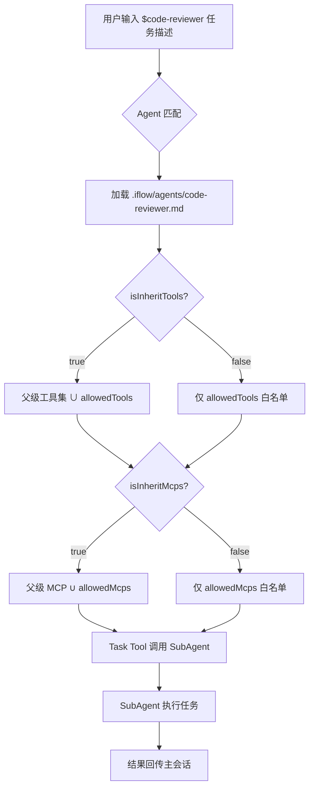
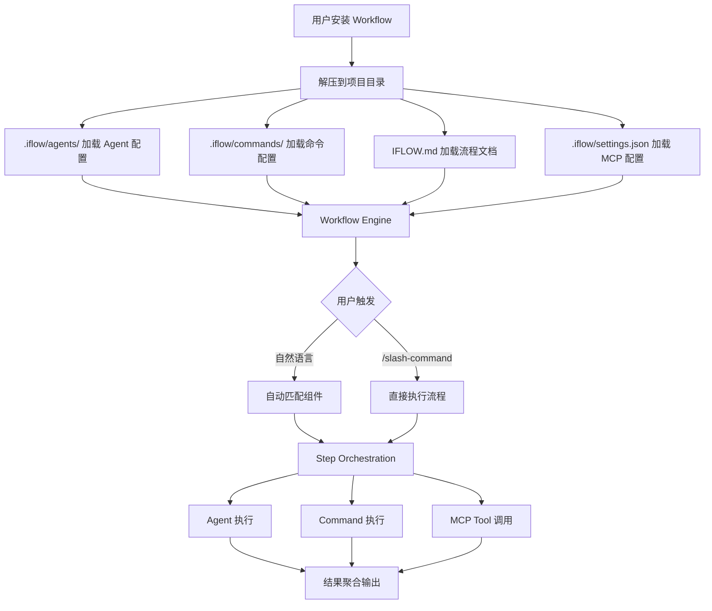
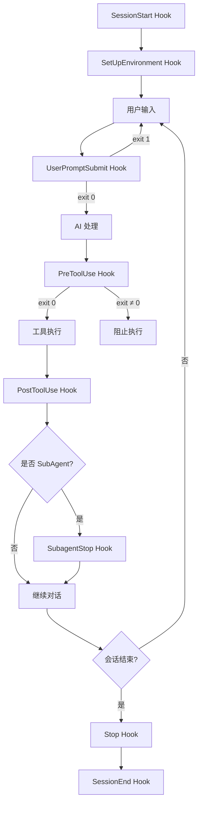

# PD-02.18 iflow-cli — SubAgent 智能任务分发与 Workflow 流水线编排

> 文档编号：PD-02.18
> 来源：iflow-cli `docs_en/examples/subagent.md` `docs_en/examples/workflow.md` `docs_en/examples/hooks.md`
> GitHub：https://github.com/iflow-ai/iflow-cli.git
> 问题域：PD-02 多 Agent 编排 Multi-Agent Orchestration
> 状态：可复用方案

---

## 第 1 章 问题与动机（≥ 30 行）

### 1.1 核心问题

在 CLI 形态的 AI 编码助手中，单一通用 Agent 面临三个核心瓶颈：

1. **专业度不足**：一个 Agent 无法同时精通前端开发、安全审计、数据分析等多个领域，prompt 越长越容易产生角色混淆
2. **工具权限过宽**：通用 Agent 拥有所有工具权限，安全审计场景不应允许写文件，前端开发不需要数据库工具
3. **流程不可编排**：复杂任务（如"分析代码 → 生成测试 → 部署"）需要多步骤串联，单 Agent 难以保证步骤间的上下文隔离和结果传递

iFlow CLI 通过 SubAgent 智能任务分发 + Workflow 流水线引擎两层架构解决这些问题。

### 1.2 iflow-cli 的解法概述

1. **SubAgent 类型分类系统**：将 Agent 按领域分为开发/分析/创意/运维四大类，每类有独立的 systemPrompt 和工具集（`docs_en/examples/subagent.md:39-44`）
2. **`$agent-type` 快速调用语法**：用户通过 `$code-reviewer` 等语法直接调用专业 Agent，系统自动匹配最佳 Agent（`docs_en/examples/subagent.md:186-196`）
3. **权限继承机制 isInheritTools/isInheritMcps**：子 Agent 可选择继承或隔离父 Agent 的工具和 MCP 权限，实现精确的能力边界控制（`docs_en/examples/subagent.md:340-366`）
4. **Workflow 引擎**：将 Agent + Command + MCP 工具组合为完整自动化流水线，通过 `.iflow/` 目录结构管理（`docs_en/examples/workflow.md:12-53`）
5. **9 类 Hook 生命周期**：PreToolUse/PostToolUse/SubagentStop 等 9 种 Hook 实现编排过程中的拦截、增强和清理（`docs_en/examples/hooks.md:22-273`）

### 1.3 设计思想

| 设计原则 | 具体实现 | 理由 | 替代方案 |
|----------|----------|------|----------|
| 声明式 Agent 配置 | Markdown frontmatter 定义 agentType/systemPrompt/allowedTools | 非开发者也能创建 Agent，降低门槛 | JSON Schema 配置（更严格但不直观） |
| 权限继承而非复制 | isInheritTools=true 时继承父级全部工具 + 自身额外工具 | 避免重复配置，保持 DRY | 每个 Agent 独立声明全部权限（冗余） |
| 工具集裁剪隔离 | isInheritTools=false 时仅使用 allowedTools 白名单 | 安全审计等场景需要最小权限 | 黑名单排除（容易遗漏） |
| Workflow 目录约定 | `.iflow/agents/` + `.iflow/commands/` + `IFLOW.md` 三件套 | 一个 zip 包即可分发完整 Workflow | 单文件配置（无法包含多 Agent） |
| Hook 事件驱动 | 9 种生命周期 Hook 通过 settings.json 配置 | 不修改 Agent 代码即可注入逻辑 | 中间件链（需要代码级集成） |

---

## 第 2 章 源码实现分析（≥ 60 行，核心章节）

### 2.1 架构概览

iFlow CLI 的多 Agent 编排采用三层架构：

```
┌─────────────────────────────────────────────────────────┐
│                    用户交互层                              │
│  自然语言 / $agent-type / /slash-command / Workflow       │
└──────────────┬──────────────────────────────┬────────────┘
               │                              │
┌──────────────▼──────────────┐  ┌────────────▼────────────┐
│     SubAgent 分发层          │  │    Workflow 引擎层        │
│  ┌─────────┐ ┌─────────┐   │  │  Step Orchestration      │
│  │开发Agent│ │分析Agent│   │  │  Agent+Cmd+MCP 组合      │
│  └────┬────┘ └────┬────┘   │  │  结果聚合                 │
│       │           │         │  └────────────┬─────────────┘
│  ┌────▼────┐ ┌────▼────┐   │               │
│  │创意Agent│ │运维Agent│   │               │
│  └─────────┘ └─────────┘   │               │
└──────────────┬──────────────┘               │
               │                              │
┌──────────────▼──────────────────────────────▼────────────┐
│                    工具与权限层                             │
│  allowedTools[] + allowedMcps[] + isInherit* 继承控制      │
│  ┌──────────┐ ┌──────────┐ ┌──────────┐ ┌──────────┐    │
│  │Read/Write│ │Bash/Grep │ │MCP Server│ │Hook Chain│    │
│  └──────────┘ └──────────┘ └──────────┘ └──────────┘    │
└──────────────────────────────────────────────────────────┘
```

### 2.2 核心实现

#### 2.2.1 SubAgent 配置与权限继承



对应源码 `docs_en/examples/subagent.md:296-367`，Agent 配置文件采用 Markdown frontmatter 格式：

```markdown
---
agentType: "security-auditor"
systemPrompt: "You are a security audit expert..."
whenToUse: "Use when performing security audits and vulnerability checks"
allowedTools: ["Read", "Grep", "Bash"]
allowedMcps: ["security-scanner", "vulnerability-db"]
isInheritTools: false
isInheritMcps: false
---

# Security Auditor Agent

This agent specializes in code security review...
```

关键设计点（`docs_en/examples/subagent.md:340-366`）：

- `isInheritTools: true`（默认）= 继承父级全部工具 + allowedTools 额外工具
- `isInheritTools: false` = 仅使用 allowedTools 白名单，完全隔离
- `isInheritMcps` 同理，控制 MCP 服务器访问权限
- 空 allowedMcps 数组 = 不限制（继承父级权限）

#### 2.2.2 Workflow 引擎与目录结构



对应源码 `docs_en/examples/workflow.md:19-43`，Workflow 目录结构：

```
Project Root Directory/
├── .iflow/                   # iFlow CLI 配置和资源目录
│   ├── agents/               # Agent 配置文件夹
│   │   ├── agent1.md         # 专业 Agent 配置
│   │   └── agent2.md         # 更多 Agent 配置
│   ├── commands/             # 自定义命令文件夹
│   │   ├── command1.md       # 命令实现（Markdown 或 TOML）
│   │   └── command2.md       # 更多命令
│   ├── IFLOW.md              # 详细 Workflow 文档和配置
│   └── settings.json         # MCP 相关配置
├── [Project Folder]/         # 项目文件和代码
└── IFLOW.md                  # Workflow 配置和描述文件
```

Workflow 的核心设计是**目录即配置**：一个 zip 包包含完整的 Agent + Command + MCP + 文档，通过 `iflow workflow add` 一键安装。

#### 2.2.3 Hook 生命周期系统



对应源码 `docs_en/examples/hooks.md:22-273`，iFlow CLI 支持 9 种 Hook 类型：

```json
{
  "hooks": {
    "PreToolUse": [{
      "matcher": "Edit|MultiEdit|Write",
      "hooks": [{
        "type": "command",
        "command": "python3 file_protection.py",
        "timeout": 10
      }]
    }],
    "SubagentStop": [{
      "hooks": [{
        "type": "command",
        "command": "echo 'Subagent task completed'"
      }]
    }],
    "SessionStart": [{
      "matcher": "startup",
      "hooks": [{
        "type": "command",
        "command": "python3 git_status.py",
        "timeout": 10
      }]
    }]
  }
}
```

Hook 环境变量（`docs_en/examples/hooks.md:770-790`）：
- `IFLOW_SESSION_ID` — 当前会话 ID
- `IFLOW_TOOL_NAME` — 当前工具名（PreToolUse/PostToolUse）
- `IFLOW_TOOL_ARGS` — 工具参数 JSON（PreToolUse/PostToolUse）
- `IFLOW_HOOK_EVENT_NAME` — 触发的 Hook 事件名

### 2.3 实现细节

**SubAgent 调用机制**：iFlow CLI 使用内置的 Task Tool 调用 SubAgent（`docs_en/examples/subagent.md:177`），这意味着 SubAgent 是作为一个独立的 LLM 会话运行的，拥有自己的上下文窗口和工具集。主 Agent 通过 Task Tool 的返回值获取 SubAgent 的执行结果。

**模型验证与降级**（`docs_en/examples/subagent.md:272-291`）：
- 执行前自动检测模型兼容性
- 不兼容时推荐替代模型
- 支持"一次性"和"永久记住"两种模型选择模式
- YOLO 模式下自动使用推荐替代模型

**Workflow 分发机制**（`docs_en/examples/workflow.md:56-60`）：
- 通过 XinLiu Open Market 浏览和安装
- `iflow workflow add "workflow-id"` 一键安装到项目
- Workflow 默认安装在项目级别，不跨目录共享
- 打包为 zip 上传到平台分发


---

## 第 3 章 迁移指南（≥ 40 行）

### 3.1 迁移清单

**阶段一：SubAgent 基础能力（1-2 天）**

- [ ] 定义 Agent 配置格式（推荐 Markdown frontmatter）
- [ ] 实现 Agent 注册表：扫描 `.iflow/agents/` 目录加载配置
- [ ] 实现 `$agent-type` 快速调用语法解析
- [ ] 实现 Task Tool 封装：将 SubAgent 作为独立 LLM 会话运行
- [ ] 实现权限继承逻辑：isInheritTools / isInheritMcps 布尔开关

**阶段二：Workflow 引擎（2-3 天）**

- [ ] 定义 Workflow 目录结构约定（agents/ + commands/ + settings.json）
- [ ] 实现 Workflow 安装/卸载命令
- [ ] 实现 Step Orchestration：Agent + Command + MCP 组合执行
- [ ] 实现 Slash Command 注册：从 TOML/Markdown 文件加载自定义命令

**阶段三：Hook 生命周期（1 天）**

- [ ] 实现 Hook 配置解析（settings.json 中的 hooks 字段）
- [ ] 实现 matcher 正则匹配逻辑
- [ ] 实现 PreToolUse/PostToolUse 拦截链
- [ ] 实现 SubagentStop Hook 用于子任务清理
- [ ] 实现环境变量注入（IFLOW_TOOL_NAME 等）

### 3.2 适配代码模板

**Agent 配置加载器（TypeScript）**：

```typescript
import * as fs from 'fs';
import * as path from 'path';
import * as yaml from 'yaml';

interface AgentConfig {
  agentType: string;
  systemPrompt: string;
  whenToUse: string;
  model?: string;
  allowedTools: string[];
  allowedMcps: string[];
  isInheritTools: boolean;
  isInheritMcps: boolean;
  proactive: boolean;
}

function parseAgentMarkdown(content: string): AgentConfig {
  const frontmatterMatch = content.match(/^---\n([\s\S]*?)\n---/);
  if (!frontmatterMatch) throw new Error('No frontmatter found');
  
  const meta = yaml.parse(frontmatterMatch[1]);
  return {
    agentType: meta.agentType,
    systemPrompt: meta.systemPrompt,
    whenToUse: meta.whenToUse,
    model: meta.model,
    allowedTools: meta.allowedTools ?? [],
    allowedMcps: meta.allowedMcps ?? [],
    isInheritTools: meta.isInheritTools ?? true,
    isInheritMcps: meta.isInheritMcps ?? true,
    proactive: meta.proactive ?? false,
  };
}

function resolveTools(
  agent: AgentConfig,
  parentTools: string[]
): string[] {
  if (agent.isInheritTools) {
    return [...new Set([...parentTools, ...agent.allowedTools])];
  }
  return agent.allowedTools;
}

function resolveMcps(
  agent: AgentConfig,
  parentMcps: string[]
): string[] {
  if (agent.isInheritMcps) {
    return [...new Set([...parentMcps, ...agent.allowedMcps])];
  }
  return agent.allowedMcps;
}

function loadAgentsFromDir(dir: string): Map<string, AgentConfig> {
  const agents = new Map<string, AgentConfig>();
  if (!fs.existsSync(dir)) return agents;
  
  for (const file of fs.readdirSync(dir)) {
    if (file.endsWith('.md')) {
      const content = fs.readFileSync(path.join(dir, file), 'utf-8');
      const config = parseAgentMarkdown(content);
      agents.set(config.agentType, config);
    }
  }
  return agents;
}
```

**Hook 执行器（TypeScript）**：

```typescript
import { execSync } from 'child_process';

interface HookConfig {
  matcher?: string;
  hooks: Array<{
    type: 'command';
    command: string;
    timeout?: number;
  }>;
}

function executeHooks(
  hookConfigs: HookConfig[],
  matchTarget: string,
  env: Record<string, string>
): { blocked: boolean; outputs: string[] } {
  const outputs: string[] = [];
  
  for (const config of hookConfigs) {
    if (config.matcher && !matchesPattern(config.matcher, matchTarget)) {
      continue;
    }
    
    for (const hook of config.hooks) {
      try {
        const result = execSync(hook.command, {
          timeout: (hook.timeout ?? 30) * 1000,
          env: { ...process.env, ...env },
          encoding: 'utf-8',
        });
        outputs.push(result);
      } catch (err: any) {
        if (err.status !== 0) {
          return { blocked: true, outputs: [err.stderr] };
        }
      }
    }
  }
  return { blocked: false, outputs };
}

function matchesPattern(pattern: string, target: string): boolean {
  if (pattern === '*' || pattern === '') return true;
  const hasRegexChars = /[|\\^$.*+?()[\]{}]/.test(pattern);
  if (hasRegexChars) {
    try { return new RegExp(pattern).test(target); }
    catch { return pattern === target; }
  }
  return pattern === target;
}
```

### 3.3 适用场景

| 场景 | 适用度 | 说明 |
|------|--------|------|
| CLI 形态 AI 编码助手 | ⭐⭐⭐ | 完美匹配，iFlow CLI 的原生场景 |
| IDE 插件中的多 Agent | ⭐⭐⭐ | Agent 配置格式和权限继承可直接复用 |
| 自动化 CI/CD 流水线 | ⭐⭐ | Workflow 引擎适合，但需要适配非交互模式 |
| 多 Agent 对话系统 | ⭐⭐ | SubAgent 模型适合，但缺少 Agent 间直接通信 |
| 实时协作编辑 | ⭐ | 设计为单用户 CLI，不适合多用户并发 |

---

## 第 4 章 测试用例（≥ 20 行）

```python
import pytest
from dataclasses import dataclass, field
from typing import Optional


@dataclass
class AgentConfig:
    agent_type: str
    system_prompt: str
    when_to_use: str
    model: Optional[str] = None
    allowed_tools: list = field(default_factory=list)
    allowed_mcps: list = field(default_factory=list)
    is_inherit_tools: bool = True
    is_inherit_mcps: bool = True


def resolve_tools(agent: AgentConfig, parent_tools: list) -> list:
    if agent.is_inherit_tools:
        return list(set(parent_tools + agent.allowed_tools))
    return agent.allowed_tools


def resolve_mcps(agent: AgentConfig, parent_mcps: list) -> list:
    if agent.is_inherit_mcps:
        return list(set(parent_mcps + agent.allowed_mcps))
    return agent.allowed_mcps


class TestSubAgentPermissionInheritance:
    """测试 SubAgent 权限继承机制"""

    def test_inherit_tools_true_merges_parent_and_own(self):
        parent_tools = ["Read", "Write", "Bash"]
        agent = AgentConfig(
            agent_type="code-reviewer",
            system_prompt="Review code",
            when_to_use="Code review",
            allowed_tools=["Grep"],
            is_inherit_tools=True,
        )
        result = resolve_tools(agent, parent_tools)
        assert set(result) == {"Read", "Write", "Bash", "Grep"}

    def test_inherit_tools_false_only_own(self):
        parent_tools = ["Read", "Write", "Bash", "Grep"]
        agent = AgentConfig(
            agent_type="security-auditor",
            system_prompt="Audit security",
            when_to_use="Security audit",
            allowed_tools=["Read", "Grep"],
            is_inherit_tools=False,
        )
        result = resolve_tools(agent, parent_tools)
        assert set(result) == {"Read", "Grep"}
        assert "Write" not in result
        assert "Bash" not in result

    def test_inherit_mcps_false_isolates_servers(self):
        parent_mcps = ["filesystem", "git", "playwright"]
        agent = AgentConfig(
            agent_type="security-auditor",
            system_prompt="Audit",
            when_to_use="Audit",
            allowed_mcps=["security-scanner"],
            is_inherit_mcps=False,
        )
        result = resolve_mcps(agent, parent_mcps)
        assert result == ["security-scanner"]

    def test_empty_allowed_tools_with_inherit_gets_parent(self):
        parent_tools = ["Read", "Write"]
        agent = AgentConfig(
            agent_type="general",
            system_prompt="General",
            when_to_use="General",
            allowed_tools=[],
            is_inherit_tools=True,
        )
        result = resolve_tools(agent, parent_tools)
        assert set(result) == {"Read", "Write"}

    def test_empty_allowed_tools_without_inherit_gets_nothing(self):
        parent_tools = ["Read", "Write"]
        agent = AgentConfig(
            agent_type="restricted",
            system_prompt="Restricted",
            when_to_use="Restricted",
            allowed_tools=[],
            is_inherit_tools=False,
        )
        result = resolve_tools(agent, parent_tools)
        assert result == []


class TestHookMatcher:
    """测试 Hook matcher 匹配逻辑"""

    def _matches(self, pattern: str, target: str) -> bool:
        import re
        if pattern in ('*', ''):
            return True
        has_regex = bool(re.search(r'[|\\^$.*+?()[\]{}]', pattern))
        if has_regex:
            try:
                return bool(re.search(pattern, target))
            except re.error:
                return pattern == target
        return pattern == target

    def test_wildcard_matches_all(self):
        assert self._matches("*", "Edit")
        assert self._matches("*", "Bash")
        assert self._matches("", "Read")

    def test_exact_match(self):
        assert self._matches("Edit", "Edit")
        assert not self._matches("Edit", "Write")

    def test_regex_pipe_matches_multiple(self):
        assert self._matches("Edit|MultiEdit|Write", "Edit")
        assert self._matches("Edit|MultiEdit|Write", "Write")
        assert not self._matches("Edit|MultiEdit|Write", "Bash")

    def test_mcp_tool_pattern(self):
        assert self._matches("mcp__.*", "mcp__github__create_issue")
        assert not self._matches("mcp__.*", "Edit")
```


---

## 第 5 章 跨域关联

| 关联域 | 关系类型 | 说明 |
|--------|----------|------|
| PD-01 上下文管理 | 依赖 | SubAgent 作为独立 LLM 会话运行，每个 SubAgent 有自己的上下文窗口；IFLOW.md 分层加载（全局→项目→子目录）提供上下文 |
| PD-04 工具系统 | 协同 | isInheritTools/allowedTools 机制直接控制 SubAgent 可用的工具集；MCP 服务器通过 allowedMcps 精确授权 |
| PD-06 记忆持久化 | 协同 | IFLOW.md 作为持久化记忆文件，支持 `/memory add` 动态写入；Workflow 的 IFLOW.md 包含流程文档作为 Agent 记忆 |
| PD-09 Human-in-the-Loop | 协同 | PreToolUse Hook 可阻止工具执行（exit code ≠ 0）；UserPromptSubmit Hook 可拦截用户输入；模型不兼容时弹出选择对话框 |
| PD-10 中间件管道 | 依赖 | 9 种 Hook 类型构成完整的中间件管道；PreToolUse → 工具执行 → PostToolUse 形成拦截链；SubagentStop Hook 实现子任务清理 |
| PD-03 容错与重试 | 协同 | 模型验证与自动降级机制；Hook timeout 防止阻塞；YOLO 模式自动选择替代模型 |

---

## 第 6 章 来源文件索引

| 文件 | 行范围 | 关键实现 |
|------|--------|----------|
| `docs_en/examples/subagent.md` | L1-L416 | SubAgent 完整文档：类型分类、快速调用、权限继承、配置属性 |
| `docs_en/examples/subagent.md` | L39-L44 | Agent 类型分类：开发/分析/创意/运维四大类 |
| `docs_en/examples/subagent.md` | L186-L196 | `$agent-type` 快速调用语法 |
| `docs_en/examples/subagent.md` | L296-L367 | Agent 配置文件格式与权限继承机制 |
| `docs_en/examples/subagent.md` | L340-L366 | isInheritTools/isInheritMcps 权限继承详解 |
| `docs_en/examples/subagent.md` | L272-L291 | 模型验证与自动降级 |
| `docs_en/examples/workflow.md` | L1-L156 | Workflow 引擎完整文档：架构、目录结构、安装使用 |
| `docs_en/examples/workflow.md` | L19-L43 | Workflow 目录结构约定 |
| `docs_en/examples/workflow.md` | L46-L53 | Workflow 架构图：Input → Engine → Orchestration → Output |
| `docs_en/examples/hooks.md` | L1-L1015 | Hook 系统完整文档：9 种 Hook 类型、配置格式、执行机制 |
| `docs_en/examples/hooks.md` | L22-L273 | 9 种 Hook 类型定义与配置示例 |
| `docs_en/examples/hooks.md` | L770-L790 | Hook 环境变量：IFLOW_SESSION_ID/TOOL_NAME/TOOL_ARGS |
| `docs_en/examples/hooks.md` | L756-L813 | Hook 执行机制：并行执行、返回值处理、超时处理 |
| `docs_en/configuration/settings.md` | L280-L301 | allowMCPServers/excludeMCPServers 配置 |
| `docs_en/configuration/settings.md` | L323-L360 | mcpServers 配置：includeTools/excludeTools 白黑名单 |
| `docs_en/examples/subcommand.md` | L1-L645 | SubCommand 系统：TOML/Markdown 命令配置、处理器链 |
| `docs_en/examples/mcp.md` | L1-L284 | MCP 集成：安装、配置、管理 |

---

## 第 7 章 横向对比维度

```json comparison_data
{
  "project": "iflow-cli",
  "dimensions": {
    "编排模式": "SubAgent 类型分发 + Workflow 目录约定流水线",
    "并行能力": "SubAgent 独立会话串行执行，无内置并行",
    "状态管理": "IFLOW.md 分层记忆 + Hook 环境变量传递",
    "工具隔离": "isInheritTools/isInheritMcps 布尔开关继承或白名单隔离",
    "结果回传": "Task Tool 返回值回传主会话",
    "递归防护": "SubAgent 通过 Task Tool 调用，无显式递归深度限制",
    "多模型兼容": "执行前自动验证模型兼容性，不兼容时推荐替代模型",
    "条件路由": "自然语言意图识别自动匹配 Agent 类型",
    "模块自治": "每个 Agent 独立 Markdown 配置文件，独立 systemPrompt",
    "经验记忆": "IFLOW.md 持久化 + /memory add 动态写入",
    "生命周期钩子": "9 种 Hook 类型覆盖完整 Agent 生命周期",
    "市场化分发": "XinLiu Open Market 一键安装 Agent/Command/Workflow"
  }
}
```

### 域元数据补充

```json domain_metadata
{
  "solution_summary": "iflow-cli 用 SubAgent 类型分发（$agent-type 快速调用）+ isInheritTools 权限继承开关 + Workflow 目录约定流水线 + 9 种 Hook 生命周期实现声明式多 Agent 编排",
  "description": "声明式 Agent 配置与市场化分发是编排系统降低门槛的关键路径",
  "sub_problems": [
    "Agent 市场化分发：如何将 Agent+Command+MCP 打包为可安装的 Workflow 单元",
    "权限继承开关：子 Agent 如何通过布尔开关选择继承或隔离父级工具权限",
    "Agent 模型验证：执行前如何自动检测模型兼容性并推荐替代模型",
    "Hook 生命周期覆盖：如何用 9 种事件类型覆盖 Agent 从启动到停止的完整生命周期"
  ],
  "best_practices": [
    "权限默认继承、按需隔离：isInheritTools 默认 true 减少配置，安全场景显式设为 false",
    "目录即配置：用约定的目录结构（agents/ + commands/ + settings.json）替代复杂的编排 DSL",
    "Hook 不阻塞主流程：Hook 超时和错误不应中断 Agent 执行，仅记录警告"
  ]
}
```

