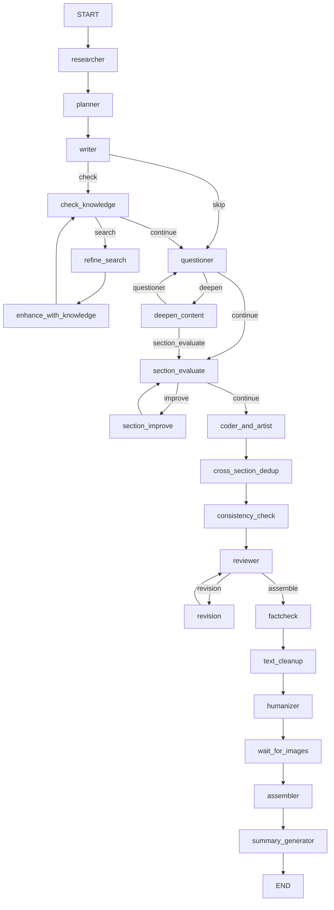
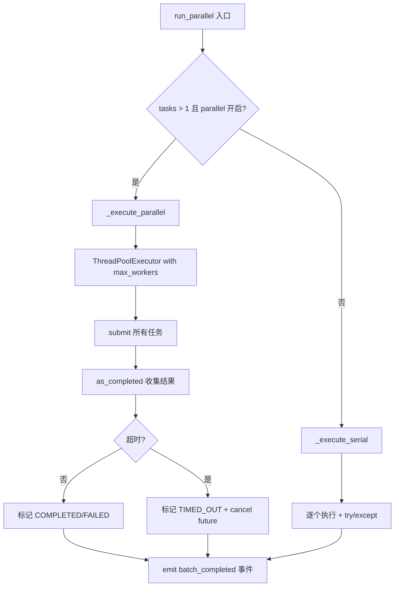
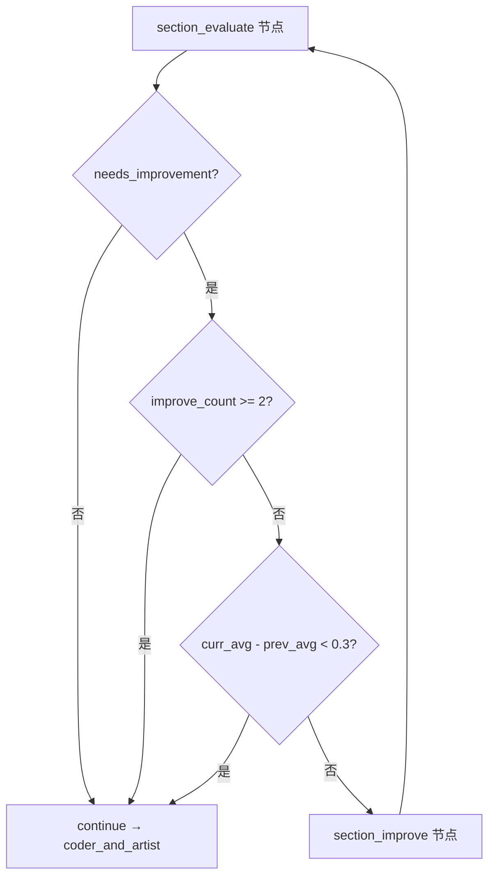

# PD-02.10 vibe-blog — LangGraph StateGraph 10+ Agent 协作 DAG 工作流

> 文档编号：PD-02.10
> 来源：vibe-blog `backend/services/blog_generator/generator.py`
> GitHub：https://github.com/datawhalechina/vibe-blog.git
> 问题域：PD-02 多 Agent 编排 Multi-Agent Orchestration
> 状态：可复用方案

---

## 第 1 章 问题与动机（≥ 30 行）

### 1.1 核心问题

长文博客生成是一个典型的多阶段、多角色协作任务：素材收集 → 大纲规划 → 内容撰写 → 追问深化 → 段落评估 → 代码/配图生成 → 一致性检查 → 质量审核 → 修订 → 事实核查 → 去 AI 味 → 文档组装。每个阶段需要不同的 LLM 能力（推理 vs 生成 vs 评估），且存在多处循环（追问-深化、评估-改进、审核-修订）和并行机会（章节级并行深化、代码+配图并行、叙事+语气一致性并行检查）。

核心挑战：
1. **DAG 拓扑复杂**：20+ 节点、6 条条件边、3 个循环回路，需要防止无限递归
2. **并行与串行混合**：部分节点可并行（章节深化），部分必须串行（大纲→写作）
3. **状态爆炸**：SharedState 包含 50+ 字段，多 Agent 并发写入同一字段需要 Reducer 合并
4. **异步解耦**：配图生成耗时 ~400s，不能阻塞后续文本处理节点
5. **多轮迭代收敛**：追问、评估、审核三个循环都需要收敛判断机制

### 1.2 vibe-blog 的解法概述

vibe-blog 基于 LangGraph StateGraph 构建了一个 10+ Agent 协作 DAG 工作流：

1. **单 StateGraph 统一编排**：所有 Agent 注册为 StateGraph 节点，通过 `add_edge` / `add_conditional_edges` 定义 DAG 拓扑（`generator.py:211-326`）
2. **ParallelTaskExecutor 统一并行引擎**：替代散落的 ad-hoc ThreadPoolExecutor，提供统一的超时保护、状态追踪、串行/并行自动切换（`parallel/executor.py:48-237`）
3. **StyleProfile 预设套餐控制迭代参数**：通过 mini/short/medium/long 预设，统一控制追问轮数、修订轮数、功能开关等 20+ 参数（`style_profile.py:13-192`）
4. **MiddlewarePipeline 节点级中间件**：before_node/after_node/on_error 三阶段钩子，透明包装所有节点（`middleware.py:74-174`）
5. **三级 LLM 模型策略**：fast/smart/strategic 三级模型按 Agent 角色分配，环境变量可覆盖（`llm_tier_config.py:11-42`）

### 1.3 设计思想

| 设计原则 | 具体实现 | 理由 | 替代方案 |
|----------|----------|------|----------|
| 声明式 DAG | LangGraph StateGraph + conditional_edges | 拓扑可视化、可序列化、支持 checkpoint | 手写 if/else 调度循环 |
| 统一并行引擎 | ParallelTaskExecutor 封装 ThreadPoolExecutor | 消除 5 处 ad-hoc 并行代码，统一超时/状态/事件 | 每处自行 ThreadPoolExecutor |
| 配置驱动迭代 | StyleProfile.from_target_length() 预设 | 44 处 if target_length 收拢为 1 处查表 | 散落的条件判断 |
| 中间件管道 | MiddlewarePipeline.wrap_node() 透明包装 | 追踪/错误/预算/降级逻辑与业务解耦 | 每个节点内部 try/except |
| 异步解耦 | 配图 Future 存实例字典，state 只存 ID | 避免 LangGraph msgpack 序列化失败 | 同步等待配图完成 |
| 收敛检测 | 分数增益 < 0.3 则停止改进循环 | 防止无效迭代浪费 token | 固定轮数硬截断 |

---

## 第 2 章 源码实现分析（≥ 60 行，核心章节）

### 2.1 架构概览

vibe-blog 的编排核心是一个 LangGraph StateGraph，定义在 `generator.py:211-326`。整体架构如下：

```
┌─────────┐    ┌─────────┐    ┌────────┐    ┌───────────────┐
│Researcher│───→│ Planner │───→│ Writer │───→│check_knowledge│
│ (素材)   │    │ (大纲)  │    │ (撰写) │    │  (知识空白)   │
└─────────┘    └─────────┘    └────────┘    └───────┬───────┘
                                                     │
                                    ┌────────────────┤
                                    ↓                ↓
                             ┌─────────────┐  ┌───────────┐
                             │refine_search│  │ Questioner │←─────────┐
                             │  (细化搜索)  │  │  (追问)    │          │
                             └──────┬──────┘  └─────┬─────┘          │
                                    ↓               │                │
                             ┌─────────────┐        ↓                │
                             │enhance_with │  ┌───────────┐          │
                             │ _knowledge  │  │  deepen   │──────────┘
                             └─────────────┘  │ _content  │
                                              └─────┬─────┘
                                                    ↓
┌──────────┐    ┌──────────┐    ┌──────────┐  ┌───────────┐
│ Reviewer │←───│consistency│←───│cross_sect│←─│coder_and  │←─section_evaluate
│ (审核)   │    │ _check   │    │ _dedup   │  │ _artist   │  ↕ section_improve
└────┬─────┘    └──────────┘    └──────────┘  └───────────┘
     │
     ├──→ revision ──→ reviewer (循环)
     │
     ↓
┌──────────┐  ┌──────────┐  ┌──────────┐  ┌──────────┐  ┌──────────┐  ┌─────┐
│ factcheck│→ │text_clean│→ │humanizer │→ │wait_for  │→ │assembler │→ │summary│→ END
│ (核查)   │  │ (清理)   │  │(去AI味)  │  │ _images  │  │ (组装)   │  │_gen  │
└──────────┘  └──────────┘  └──────────┘  └──────────┘  └──────────┘  └─────┘
```

关键特征：
- **3 个循环回路**：questioner↔deepen_content、section_evaluate↔section_improve、reviewer↔revision
- **6 条条件边**：writer→check_knowledge/questioner、check_knowledge→search/continue、questioner→deepen/continue、deepen→questioner/evaluate、section_evaluate→improve/continue、reviewer→revision/assemble
- **1 个异步分叉**：coder_and_artist 内部同步代码+异步配图，wait_for_images 汇合

### 2.2 核心实现

#### 2.2.1 StateGraph DAG 构建



对应源码 `generator.py:211-326`：
```python
def _build_workflow(self) -> StateGraph:
    workflow = StateGraph(SharedState)
    
    # 添加节点（102.10 迁移：通过中间件管道包装）
    workflow.add_node("researcher", self.pipeline.wrap_node("researcher", self._researcher_node))
    workflow.add_node("planner", self.pipeline.wrap_node("planner", self._planner_node))
    workflow.add_node("writer", self.pipeline.wrap_node("writer", self._writer_node))
    workflow.add_node("questioner", self.pipeline.wrap_node("questioner", self._questioner_node))
    workflow.add_node("deepen_content", self.pipeline.wrap_node("deepen_content", self._deepen_content_node))
    workflow.add_node("section_evaluate", self.pipeline.wrap_node("section_evaluate", self._section_evaluate_node))
    workflow.add_node("section_improve", self.pipeline.wrap_node("section_improve", self._section_improve_node))
    workflow.add_node("coder_and_artist", self.pipeline.wrap_node("coder_and_artist", self._coder_and_artist_node))
    workflow.add_node("reviewer", self.pipeline.wrap_node("reviewer", self._reviewer_node))
    workflow.add_node("revision", self.pipeline.wrap_node("revision", self._revision_node))
    # ... 更多节点
    
    # 定义边
    workflow.add_edge(START, "researcher")
    workflow.add_edge("researcher", "planner")
    workflow.add_edge("planner", "writer")
    
    # 条件边：追问后决定是深化还是继续
    workflow.add_conditional_edges(
        "questioner",
        self._should_deepen,
        {"deepen": "deepen_content", "continue": "section_evaluate"}
    )
    
    # 条件边：审核后决定是修订还是进入后处理
    workflow.add_conditional_edges(
        "reviewer",
        self._should_revise,
        {"revision": "revision", "assemble": "factcheck"}
    )
    workflow.add_edge("revision", "reviewer")  # 修订后重新审核
    
    return workflow
```

#### 2.2.2 ParallelTaskExecutor 统一并行引擎



对应源码 `parallel/executor.py:48-182`：
```python
class ParallelTaskExecutor:
    def __init__(
        self,
        max_workers: int = None,
        default_timeout: int = 300,
        on_task_event: Callable[[dict], None] = None,
        enable_parallel: bool = True,
    ):
        self.max_workers = max_workers or int(
            os.environ.get("BLOG_GENERATOR_MAX_WORKERS", "3")
        )
        self.default_timeout = default_timeout
        self._use_parallel = enable_parallel

    def run_parallel(self, tasks: List[Dict[str, Any]], config: TaskConfig = None) -> List[TaskResult]:
        if self._use_parallel and len(tasks) > 1:
            self._execute_parallel(tasks, results, timeout)
        else:
            self._execute_serial(tasks, results, timeout)
        return results

    def _execute_parallel(self, tasks, results, timeout):
        workers = min(self.max_workers, len(tasks))
        with ThreadPoolExecutor(max_workers=workers) as executor:
            future_to_idx = {}
            for idx, task in enumerate(tasks):
                future = executor.submit(task["fn"], *task.get("args", ()), **task.get("kwargs", {}))
                future_to_idx[future] = idx
            try:
                for future in as_completed(future_to_idx, timeout=timeout):
                    idx = future_to_idx[future]
                    try:
                        results[idx].result = future.result(timeout=0)
                        results[idx].status = TaskStatus.COMPLETED
                    except TimeoutError:
                        results[idx].status = TaskStatus.TIMED_OUT
                    except Exception as e:
                        results[idx].status = TaskStatus.FAILED
                        results[idx].error = str(e)
            except TimeoutError:
                for future, idx in future_to_idx.items():
                    if results[idx].status == TaskStatus.RUNNING:
                        results[idx].status = TaskStatus.TIMED_OUT
                        future.cancel()
```

#### 2.2.3 Generator-Critic Loop 收敛检测



对应源码 `generator.py:653-674`：
```python
def _should_improve_sections(self, state: SharedState) -> str:
    if not state.get("needs_section_improvement", False):
        return "continue"
    improve_count = state.get("section_improve_count", 0)
    if improve_count >= 2:
        return "continue"
    # 收敛检测：改进幅度 < 0.3 则停止
    evaluations = state.get("section_evaluations", [])
    curr_avg = sum(e["overall_quality"] for e in evaluations) / max(len(evaluations), 1)
    prev_avg = state.get("prev_section_avg_score", 0)
    if prev_avg > 0 and (curr_avg - prev_avg) < 0.3:
        return "continue"
    state["prev_section_avg_score"] = curr_avg
    return "improve"
```

### 2.3 实现细节

**递归防护**：`_build_config()` 动态计算 `recursion_limit`，基于实际节点数 + 最大循环次数 + 安全余量（`generator.py:990-1004`）：
```python
def _build_config(self, state: dict) -> dict:
    style = self._get_style(state)
    base_nodes = 20
    max_loops = (
        style.max_questioning_rounds * 2
        + style.max_revision_rounds * 2
        + 2  # section_evaluate <-> improve
    )
    recursion_limit = base_nodes + max_loops + 5
    return {"configurable": {"thread_id": f"blog_{state.get('topic', 'default')}"}, "recursion_limit": recursion_limit}
```

**异步配图解耦**：`_coder_and_artist_node` 将配图 Future 存入实例字典而非 state，避免 LangGraph msgpack 序列化失败（`generator.py:713-741`）。`_wait_for_images_node` 在 assembler 前汇合结果（`generator.py:743-780`）。

**Human-in-the-Loop**：Planner 节点使用 LangGraph 原生 `interrupt()` 暂停图执行，等待用户确认或编辑大纲（`generator.py:354-376`）。mini 模式自动确认跳过。

**三级 LLM 策略**：每个 Agent 通过 `TieredLLMProxy` 路由到 fast/smart/strategic 模型，planner 和 search_coordinator 用 strategic，writer/reviewer/questioner 用 smart，researcher/artist 用 fast（`llm_tier_config.py:11-30`）。

---

## 第 3 章 迁移指南（≥ 40 行）

### 3.1 迁移清单

**阶段 1：基础 DAG 骨架**
- [ ] 安装 `langgraph>=0.2` 和 `pydantic>=2.0`
- [ ] 定义 SharedState（TypedDict），包含所有 Agent 的输入/输出字段
- [ ] 创建 StateGraph(SharedState)，注册核心节点（至少 3 个 Agent）
- [ ] 用 `add_edge` 定义线性流程，用 `add_conditional_edges` 定义分支
- [ ] 实现 `compile(checkpointer=MemorySaver())` 支持断点恢复

**阶段 2：并行引擎**
- [ ] 迁移 ParallelTaskExecutor（约 200 行），替代散落的 ThreadPoolExecutor
- [ ] 定义 TaskConfig（超时、重试、降级策略）
- [ ] 在需要并行的节点中调用 `executor.run_parallel(tasks)`

**阶段 3：迭代循环**
- [ ] 实现条件边路由函数（`_should_deepen`、`_should_revise` 等）
- [ ] 在 SharedState 中添加计数器字段（`questioning_count`、`revision_count`）
- [ ] 实现收敛检测：分数增益阈值 + 最大轮数双重保护
- [ ] 动态计算 `recursion_limit` 防止 LangGraph 递归超限

**阶段 4：中间件管道**
- [ ] 迁移 MiddlewarePipeline + NodeMiddleware 协议（约 180 行）
- [ ] 实现 TracingMiddleware（分布式追踪）
- [ ] 实现 ErrorTrackingMiddleware（错误收集）
- [ ] 实现 TokenBudgetMiddleware（Token 预算管理）
- [ ] 用 `pipeline.wrap_node()` 包装所有节点

### 3.2 适配代码模板

最小可运行的 LangGraph 多 Agent 编排模板：

```python
from langgraph.graph import StateGraph, START, END
from langgraph.checkpoint.memory import MemorySaver
from typing import TypedDict, List, Literal

class WorkflowState(TypedDict):
    topic: str
    research: str
    outline: dict
    sections: List[dict]
    review_score: int
    revision_count: int

class MultiAgentOrchestrator:
    def __init__(self, llm):
        self.llm = llm
        self.max_revisions = 3
        self.workflow = self._build()

    def _build(self) -> StateGraph:
        g = StateGraph(WorkflowState)
        g.add_node("research", self._research)
        g.add_node("plan", self._plan)
        g.add_node("write", self._write)
        g.add_node("review", self._review)
        g.add_node("revise", self._revise)

        g.add_edge(START, "research")
        g.add_edge("research", "plan")
        g.add_edge("plan", "write")
        g.add_edge("write", "review")
        g.add_conditional_edges("review", self._should_revise, {
            "revise": "revise", "done": END
        })
        g.add_edge("revise", "review")
        return g

    def _should_revise(self, state) -> Literal["revise", "done"]:
        if state["revision_count"] >= self.max_revisions:
            return "done"
        if state["review_score"] < 7:
            return "revise"
        return "done"

    def run(self, topic: str):
        app = self.workflow.compile(checkpointer=MemorySaver())
        config = {"configurable": {"thread_id": topic}, "recursion_limit": 30}
        return app.invoke({"topic": topic, "revision_count": 0}, config)
```

### 3.3 适用场景

| 场景 | 适用度 | 说明 |
|------|--------|------|
| 长文/报告生成 | ⭐⭐⭐ | 天然匹配：多阶段、多角色、需要迭代改进 |
| 代码生成+审核 | ⭐⭐⭐ | Generator-Critic Loop 可直接复用 |
| 研究报告 | ⭐⭐⭐ | 搜索→分析→写作→审核流程完全匹配 |
| 简单问答 | ⭐ | 过度设计，单 Agent + 工具更合适 |
| 实时对话 | ⭐ | DAG 编排有延迟，不适合实时交互 |
| 数据分析流水线 | ⭐⭐ | 可复用并行引擎和中间件，但 DAG 拓扑需重新设计 |

---

## 第 4 章 测试用例（≥ 20 行）

```python
import pytest
from unittest.mock import MagicMock, patch
from concurrent.futures import TimeoutError

# 测试 ParallelTaskExecutor
class TestParallelTaskExecutor:
    def test_parallel_execution_basic(self):
        """正常并行执行多个任务"""
        from backend.services.blog_generator.parallel.executor import (
            ParallelTaskExecutor, TaskConfig, TaskStatus
        )
        executor = ParallelTaskExecutor(max_workers=3, enable_parallel=True)
        tasks = [
            {"name": f"task_{i}", "fn": lambda x=i: x * 2, "args": (i,)}
            for i in range(5)
        ]
        results = executor.run_parallel(tasks, TaskConfig(name="test"))
        assert len(results) == 5
        assert all(r.status == TaskStatus.COMPLETED for r in results)
        assert [r.result for r in results] == [0, 2, 4, 6, 8]

    def test_serial_fallback_when_single_task(self):
        """单任务自动降级为串行"""
        from backend.services.blog_generator.parallel.executor import (
            ParallelTaskExecutor, TaskConfig, TaskStatus
        )
        executor = ParallelTaskExecutor(enable_parallel=True)
        tasks = [{"name": "solo", "fn": lambda: 42}]
        results = executor.run_parallel(tasks, TaskConfig(name="test"))
        assert len(results) == 1
        assert results[0].status == TaskStatus.COMPLETED
        assert results[0].result == 42

    def test_timeout_handling(self):
        """超时任务标记为 TIMED_OUT"""
        import time
        from backend.services.blog_generator.parallel.executor import (
            ParallelTaskExecutor, TaskConfig, TaskStatus
        )
        executor = ParallelTaskExecutor(max_workers=2, enable_parallel=True)
        tasks = [
            {"name": "slow", "fn": lambda: time.sleep(10)},
            {"name": "fast", "fn": lambda: "done"},
        ]
        results = executor.run_parallel(tasks, TaskConfig(name="test", timeout_seconds=1))
        assert results[0].status == TaskStatus.TIMED_OUT
        assert results[1].status == TaskStatus.COMPLETED

    def test_error_isolation(self):
        """单个任务失败不影响其他任务"""
        from backend.services.blog_generator.parallel.executor import (
            ParallelTaskExecutor, TaskConfig, TaskStatus
        )
        executor = ParallelTaskExecutor(max_workers=3, enable_parallel=True)
        def fail(): raise ValueError("boom")
        tasks = [
            {"name": "ok1", "fn": lambda: "a"},
            {"name": "fail", "fn": fail},
            {"name": "ok2", "fn": lambda: "b"},
        ]
        results = executor.run_parallel(tasks, TaskConfig(name="test"))
        assert results[0].status == TaskStatus.COMPLETED
        assert results[1].status == TaskStatus.FAILED
        assert results[2].status == TaskStatus.COMPLETED

# 测试收敛检测
class TestConvergenceDetection:
    def test_should_improve_when_score_low(self):
        """低分时触发改进"""
        state = {
            "needs_section_improvement": True,
            "section_improve_count": 0,
            "section_evaluations": [{"overall_quality": 5.0}],
            "prev_section_avg_score": 0,
        }
        # 模拟 _should_improve_sections 逻辑
        assert state["needs_section_improvement"] is True
        assert state["section_improve_count"] < 2

    def test_convergence_stops_iteration(self):
        """分数增益 < 0.3 时停止迭代"""
        prev_avg = 7.5
        curr_avg = 7.7  # 增益 0.2 < 0.3
        assert (curr_avg - prev_avg) < 0.3

    def test_max_rounds_hard_stop(self):
        """达到最大轮数强制停止"""
        state = {"section_improve_count": 2}
        assert state["section_improve_count"] >= 2  # 最大 2 轮

# 测试 StyleProfile 预设
class TestStyleProfile:
    def test_mini_preset(self):
        """mini 预设参数正确"""
        from backend.services.blog_generator.style_profile import StyleProfile
        style = StyleProfile.mini()
        assert style.max_revision_rounds == 1
        assert style.max_questioning_rounds == 1
        assert style.revision_strategy == "correct_only"
        assert style.enable_knowledge_refinement is False

    def test_long_preset(self):
        """long 预设参数正确"""
        from backend.services.blog_generator.style_profile import StyleProfile
        style = StyleProfile.long()
        assert style.max_revision_rounds == 5
        assert style.max_questioning_rounds == 3
        assert style.enable_fact_check is True
```

---

## 第 5 章 跨域关联

| 关联域 | 关系类型 | 说明 |
|--------|----------|------|
| PD-01 上下文管理 | 依赖 | TokenBudgetMiddleware 在节点级分配 Token 预算，ContextManagementMiddleware 管理上下文窗口 |
| PD-03 容错与重试 | 协同 | ParallelTaskExecutor 提供超时保护和错误隔离，GracefulDegradationMiddleware 实现可降级节点白名单 |
| PD-04 工具系统 | 协同 | BlogToolManager 注册搜索等工具，Agent 通过 TieredLLMProxy 路由到不同级别模型 |
| PD-06 记忆持久化 | 依赖 | MemorySaver 作为 LangGraph checkpoint，MemoryStorage 注入用户记忆到 background_knowledge |
| PD-07 质量检查 | 协同 | Reviewer + Generator-Critic Loop 构成双层质量保障，收敛检测控制迭代终止 |
| PD-09 Human-in-the-Loop | 协同 | Planner 节点使用 LangGraph interrupt() 暂停等待用户确认大纲 |
| PD-10 中间件管道 | 依赖 | MiddlewarePipeline 是编排的基础设施，所有节点通过 wrap_node() 注入中间件 |
| PD-11 可观测性 | 协同 | TracingMiddleware + TaskLogMiddleware + SessionTracker 提供全链路追踪 |
| PD-12 推理增强 | 协同 | 三级 LLM 策略（fast/smart/strategic）按 Agent 角色分配模型能力 |

---

## 第 6 章 来源文件索引

| 文件 | 行范围 | 关键实现 |
|------|--------|----------|
| `backend/services/blog_generator/generator.py` | L68-198 | BlogGenerator 初始化：13 个 Agent 实例化 + 中间件管道 + 并行引擎 |
| `backend/services/blog_generator/generator.py` | L211-326 | `_build_workflow()`：StateGraph DAG 构建，20+ 节点 + 6 条件边 |
| `backend/services/blog_generator/generator.py` | L531-596 | `_deepen_content_node()`：并行内容深化 + ParallelTaskExecutor |
| `backend/services/blog_generator/generator.py` | L598-711 | Generator-Critic Loop：section_evaluate + section_improve + 收敛检测 |
| `backend/services/blog_generator/generator.py` | L713-780 | 异步配图解耦：Future 存实例字典 + wait_for_images 汇合 |
| `backend/services/blog_generator/generator.py` | L990-1004 | `_build_config()`：动态 recursion_limit 计算 |
| `backend/services/blog_generator/generator.py` | L1081-1162 | 条件边路由函数：_should_deepen / _should_revise / _should_refine_search |
| `backend/services/blog_generator/parallel/executor.py` | L48-237 | ParallelTaskExecutor：统一并行引擎 + 超时保护 + SSE 事件 |
| `backend/services/blog_generator/parallel/config.py` | L7-13 | TaskConfig：超时/重试/降级配置 |
| `backend/services/blog_generator/schemas/state.py` | L155-275 | SharedState：50+ 字段的 TypedDict 定义 |
| `backend/services/blog_generator/middleware.py` | L74-174 | MiddlewarePipeline：before/after/on_error 三阶段中间件管道 |
| `backend/services/blog_generator/middleware.py` | L229-278 | TokenBudgetMiddleware：节点级 Token 预算分配 |
| `backend/services/blog_generator/middleware.py` | L391-457 | FeatureToggleMiddleware + GracefulDegradationMiddleware |
| `backend/services/blog_generator/style_profile.py` | L13-192 | StyleProfile：mini/short/medium/long 预设套餐 |
| `backend/services/blog_generator/llm_tier_config.py` | L11-42 | 三级 LLM 策略：Agent → fast/smart/strategic 映射 |
| `backend/services/blog_generator/agents/questioner.py` | L44-350 | QuestionerAgent：追问检查 + 段落评估（Critic 角色） |

---

## 第 7 章 横向对比维度

```json comparison_data
{
  "project": "vibe-blog",
  "dimensions": {
    "编排模式": "LangGraph StateGraph 声明式 DAG，20+ 节点 + 6 条件边 + 3 循环回路",
    "并行能力": "ParallelTaskExecutor 统一引擎，ThreadPool + 串行/并行自动切换",
    "状态管理": "TypedDict SharedState 50+ 字段，ReducerMiddleware 合并并发写入",
    "并发限制": "环境变量 BLOG_GENERATOR_MAX_WORKERS 默认 3，TaskConfig 单任务超时 300s",
    "工具隔离": "TieredLLMProxy 按 Agent 角色路由 fast/smart/strategic 三级模型",
    "反应式自愈": "GracefulDegradationMiddleware 可降级节点白名单 + on_error 钩子",
    "递归防护": "动态 recursion_limit = base_nodes + max_loops + 5，基于 StyleProfile 计算",
    "结果回传": "ParallelTaskExecutor 返回 TaskResult 列表，按 _section_id 回写到 state",
    "结构验证": "LayerValidator 层间数据契约校验（可选），仅日志警告不阻断",
    "迭代收敛": "三重保护：最大轮数 + 分数增益阈值 0.3 + StyleProfile 预设",
    "双流水线": "mini/short 精简流水线（跳过知识增强/事实核查）vs medium/long 完整流水线",
    "双层LLM策略": "13 个 Agent 分配到 fast/smart/strategic 三级，环境变量可逐 Agent 覆盖",
    "异步解耦": "配图 Future 存实例字典避免序列化，wait_for_images 节点汇合",
    "Generator-Critic Loop": "section_evaluate(Critic) ↔ section_improve(Generator) 循环，4 维度评分"
  }
}
```

### 域元数据补充

```json domain_metadata
{
  "solution_summary": "vibe-blog 用 LangGraph StateGraph 构建 20+ 节点 DAG 工作流，ParallelTaskExecutor 统一并行引擎 + StyleProfile 预设套餐控制 3 个循环回路的迭代参数",
  "description": "声明式 DAG 编排中如何通过配置预设统一控制多个循环回路的迭代参数和功能开关",
  "sub_problems": [
    "配图异步解耦：耗时子任务如何不阻塞主流水线且避免序列化问题",
    "Generator-Critic Loop：段落级评估-改进循环的多维度评分与收敛检测",
    "配置预设套餐：如何将散落的 44 处条件判断收拢为 StyleProfile 查表",
    "中间件透明包装：如何在不修改节点代码的情况下注入追踪/预算/降级逻辑"
  ],
  "best_practices": [
    "动态计算 recursion_limit：基于实际节点数和最大循环次数，避免硬编码",
    "收敛检测用分数增益阈值而非固定轮数：防止无效迭代浪费 token",
    "Future 对象不放入 DAG state：避免序列化框架（msgpack/pickle）失败",
    "环境变量 AND StyleProfile 双开关：全局禁用和运行时禁用互不干扰"
  ]
}
```
