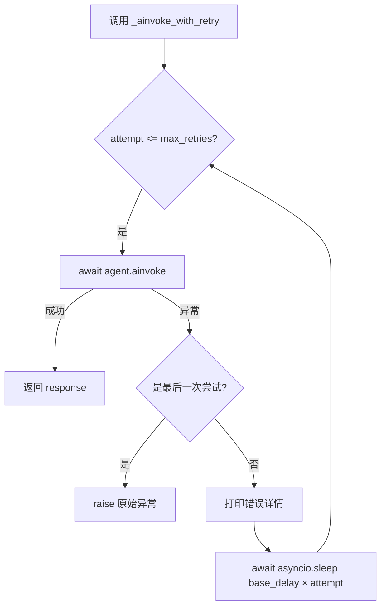
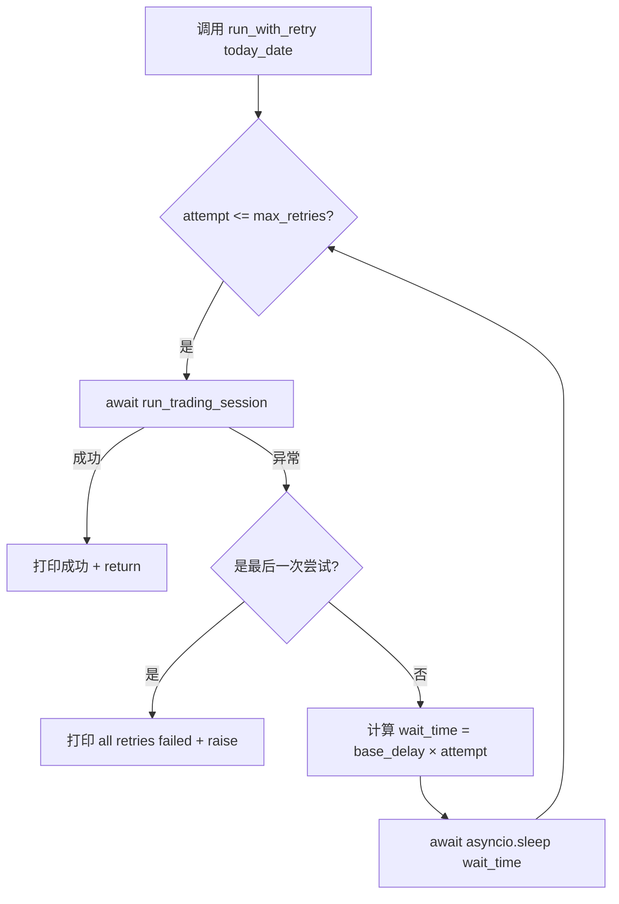
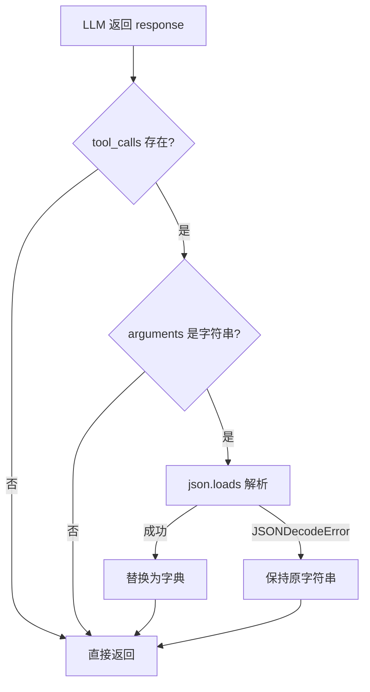
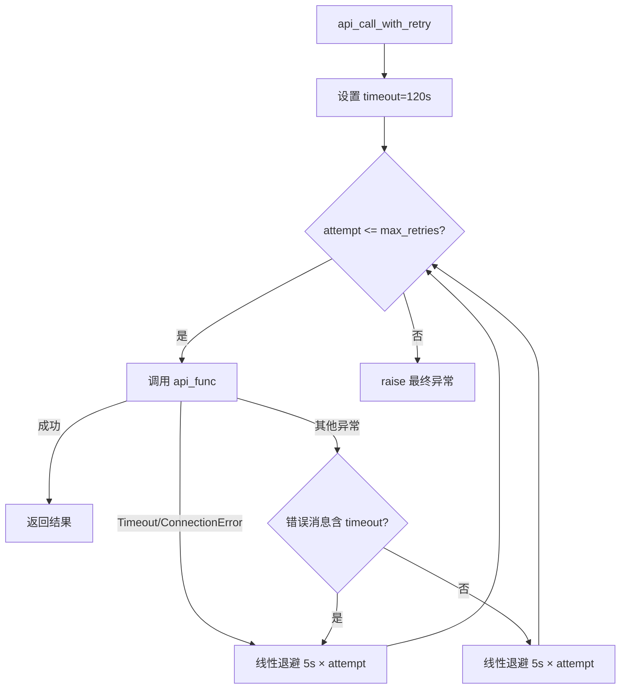

# PD-03.AI-Trader AI-Trader — 双层线性退避重试与 DeepSeek 适配器防御

> 文档编号：PD-03.AI-Trader
> 来源：AI-Trader `agent/base_agent/base_agent.py`, `agent/base_agent_crypto/base_agent_crypto.py`
> GitHub：https://github.com/HKUDS/AI-Trader.git
> 问题域：PD-03 容错与重试 Fault Tolerance & Retry
> 状态：可复用方案

---

## 第 1 章 问题与动机

### 1.1 核心问题

AI-Trader 是一个 LLM 驱动的自动交易系统，每天对 NASDAQ 100 / A 股 SSE 50 / 加密货币 Bitwise 10 执行多步推理交易。系统面临三层容错挑战：

1. **LLM API 调用不稳定**：Agent 每个交易日需要多轮 LLM 推理（最多 30 步），任何一次 API 调用失败都会中断整个交易日会话。网络超时、速率限制、服务不可用是常态。
2. **交易日会话级失败**：即使单次 API 调用成功，整个交易日会话可能因为工具调用异常、MCP 服务断连、数据缺失等原因失败，需要整体重试。
3. **多 Provider API 格式不兼容**：DeepSeek 等非 OpenAI 原生 Provider 返回的 `tool_calls.arguments` 是 JSON 字符串而非字典，直接导致 LangChain 框架解析失败。这不是偶发错误，而是系统性的格式不兼容。

此外，外部数据 API（如 Tushare A 股数据）有独立的超时和速率限制问题，需要专门的重试策略。

### 1.2 AI-Trader 的解法概述

AI-Trader 采用**双层重试 + 适配器防御**的三件套方案：

1. **内层重试 `_ainvoke_with_retry`**（`base_agent.py:423-435`）：对单次 LLM API 调用做线性退避重试，`delay = base_delay × attempt`
2. **外层重试 `run_with_retry`**（`base_agent.py:615-631`）：对整个交易日会话做重试，同样使用线性退避
3. **DeepSeekChatOpenAI 适配器**（`base_agent.py:39-94`）：继承 `ChatOpenAI`，在请求和响应两端修复 `tool_calls.arguments` 的 JSON 字符串/字典格式不兼容问题
4. **外部 API 重试 `api_call_with_retry`**（`get_daily_price_tushare.py:45-106`）：对 Tushare 数据 API 做分类错误检测 + 线性退避重试，含 CSV 降级兜底
5. **文件锁并发保护**（`tool_trade.py:23-52`）：`fcntl.flock` 排他锁保护仓位文件的原子读写

### 1.3 设计思想

| 设计原则 | 具体实现 | 理由 | 替代方案 |
|----------|----------|------|----------|
| 分层重试 | 内层重试 API 调用，外层重试整个会话 | 不同粒度的失败需要不同粒度的恢复 | 单层重试（无法区分瞬时错误和会话级错误） |
| 线性退避 | `delay = base_delay × attempt` | 简单可预测，适合交易场景的时间敏感性 | 指数退避（延迟增长过快，可能错过交易窗口） |
| 适配器模式 | 继承 ChatOpenAI 覆写 3 个方法 | 在框架层面透明修复，业务代码无感知 | 在每次调用后手动修复（侵入性强，容易遗漏） |
| 配置驱动 | `max_retries`/`base_delay` 从 JSON 配置注入 | 不同市场（US/CN/Crypto）可用不同重试参数 | 硬编码（无法按场景调整） |
| 文件锁保护 | `fcntl.flock(LOCK_EX)` 排他锁 | 多 Agent 并发交易时防止仓位文件竞态 | 数据库事务（过重）或无锁（数据损坏） |

---

## 第 2 章 源码实现分析

### 2.1 架构概览

AI-Trader 的容错体系分为四层，从外到内依次是：配置注入层 → 会话重试层 → API 重试层 → 适配器防御层。

```
┌─────────────────────────────────────────────────────────┐
│  main.py — 配置注入层                                     │
│  从 JSON 读取 max_retries=3, base_delay=1.0              │
│  注入到 BaseAgent 构造函数                                 │
├─────────────────────────────────────────────────────────┤
│  run_with_retry() — 会话重试层（外层）                      │
│  重试整个 run_trading_session()                           │
│  线性退避: base_delay × attempt                           │
├─────────────────────────────────────────────────────────┤
│  _ainvoke_with_retry() — API 重试层（内层）                 │
│  重试单次 agent.ainvoke() 调用                             │
│  线性退避: base_delay × attempt                           │
├─────────────────────────────────────────────────────────┤
│  DeepSeekChatOpenAI — 适配器防御层                         │
│  修复 tool_calls.arguments 格式                           │
│  覆写: _create_message_dicts / _generate / _agenerate    │
├─────────────────────────────────────────────────────────┤
│  api_call_with_retry() — 外部数据 API 重试                 │
│  Tushare API 超时/连接错误分类重试                          │
│  CSV 文件降级兜底                                         │
├─────────────────────────────────────────────────────────┤
│  _position_lock() — 并发保护层                             │
│  fcntl.flock 排他锁保护仓位文件                             │
└─────────────────────────────────────────────────────────┘
```

### 2.2 核心实现

#### 2.2.1 内层重试：`_ainvoke_with_retry`



对应源码 `agent/base_agent/base_agent.py:423-435`：

```python
async def _ainvoke_with_retry(self, message: List[Dict[str, str]]) -> Any:
    """Agent invocation with retry"""
    for attempt in range(1, self.max_retries + 1):
        try:
            if self.verbose:
                print(f"🤖 Calling LLM API ({self.basemodel})...")
            return await self.agent.ainvoke({"messages": message}, {"recursion_limit": 100})
        except Exception as e:
            if attempt == self.max_retries:
                raise e
            print(f"⚠️ Attempt {attempt} failed, retrying after {self.base_delay * attempt} seconds...")
            print(f"Error details: {e}")
            await asyncio.sleep(self.base_delay * attempt)
```

关键细节：
- `recursion_limit: 100` 限制 LangChain Agent 的工具调用递归深度，防止无限循环
- 线性退避公式 `base_delay × attempt`：attempt=1 → 1s, attempt=2 → 2s, attempt=3 → 3s
- 捕获所有 `Exception`，不区分错误类型——简单但有效

#### 2.2.2 外层重试：`run_with_retry`



对应源码 `agent/base_agent/base_agent.py:615-631`：

```python
async def run_with_retry(self, today_date: str) -> None:
    """Run method with retry"""
    for attempt in range(1, self.max_retries + 1):
        try:
            print(f"🔄 Attempting to run {self.signature} - {today_date} (Attempt {attempt})")
            await self.run_trading_session(today_date)
            print(f"✅ {self.signature} - {today_date} run successful")
            return
        except Exception as e:
            print(f"❌ Attempt {attempt} failed: {str(e)}")
            if attempt == self.max_retries:
                print(f"💥 {self.signature} - {today_date} all retries failed")
                raise
            else:
                wait_time = self.base_delay * attempt
                print(f"⏳ Waiting {wait_time} seconds before retry...")
                await asyncio.sleep(wait_time)
```

注意双层嵌套的最大重试次数：外层 3 × 内层 3 = 最坏情况下单个交易日最多 9 次 LLM 调用尝试。但由于内层重试耗尽后会向外层抛出异常，外层重试会重建整个会话（包括重新创建 Agent 和 system_prompt），所以这不是简单的乘法关系。

#### 2.2.3 DeepSeek 适配器防御



对应源码 `agent/base_agent_crypto/base_agent_crypto.py:26-95`：

```python
class DeepSeekChatOpenAI(ChatOpenAI):
    """
    Custom ChatOpenAI wrapper for DeepSeek API compatibility.
    Handles the case where DeepSeek returns tool_calls.args as JSON strings instead of dicts.
    """

    def _create_message_dicts(self, messages: list, stop: Optional[list] = None) -> list:
        """Override to handle request parsing - convert JSON string arguments to dicts"""
        message_dicts = super()._create_message_dicts(messages, stop)
        # Fix tool_calls format in the message dicts for requests
        for message_dict in message_dicts:
            if "tool_calls" in message_dict:
                for tool_call in message_dict["tool_calls"]:
                    if "function" in tool_call and "arguments" in tool_call["function"]:
                        args = tool_call["function"]["arguments"]
                        if isinstance(args, str):
                            try:
                                tool_call["function"]["arguments"] = json.loads(args)
                            except json.JSONDecodeError:
                                pass  # Keep as string if parsing fails
        return message_dicts

    async def _agenerate(self, messages: list, stop: Optional[list] = None, **kwargs):
        """Override async generation to fix tool_calls format in responses"""
        result = await super()._agenerate(messages, stop, **kwargs)
        for generation in result.generations:
            for gen in generation:
                if hasattr(gen, "message") and hasattr(gen.message, "additional_kwargs"):
                    tool_calls = gen.message.additional_kwargs.get("tool_calls")
                    if tool_calls:
                        for tool_call in tool_calls:
                            if "function" in tool_call and "arguments" in tool_call["function"]:
                                args = tool_call["function"]["arguments"]
                                if isinstance(args, str):
                                    try:
                                        tool_call["function"]["arguments"] = json.loads(args)
                                    except json.JSONDecodeError:
                                        pass
        return result
```

该适配器覆写了三个方法：
- `_create_message_dicts`：修复**请求**方向的 tool_calls 格式（Crypto 版本独有）
- `_generate`：修复**同步响应**的 tool_calls 格式
- `_agenerate`：修复**异步响应**的 tool_calls 格式

条件激活逻辑在 `base_agent.py:380-397`：

```python
if "deepseek" in self.basemodel.lower():
    self.model = DeepSeekChatOpenAI(
        model=self.basemodel, base_url=self.openai_base_url,
        api_key=self.openai_api_key, max_retries=3, timeout=30,
    )
else:
    self.model = ChatOpenAI(
        model=self.basemodel, base_url=self.openai_base_url,
        api_key=self.openai_api_key, max_retries=3, timeout=30,
    )
```

### 2.3 实现细节

#### 外部数据 API 重试与 CSV 降级

`data/A_stock/get_daily_price_tushare.py:45-106` 实现了独立于 Agent 层的数据 API 重试：



该函数的错误分类策略值得注意：它不仅捕获 `requests.exceptions.Timeout` 等类型化异常，还通过字符串匹配 `'timeout' in error_str` 检测非标准超时错误——这是因为 Tushare SDK 内部可能包装了原始异常。

CSV 降级兜底在 `get_daily_price_tushare.py:155-162`：当 API 返回空数据时，回退到本地 CSV 文件读取指数成分股数据。

#### 文件锁并发保护

`agent_tools/tool_trade.py:23-52` 使用 `fcntl.flock(LOCK_EX)` 实现排他锁：

```python
def _position_lock(signature: str):
    class _Lock:
        def __init__(self, name: str):
            log_path = get_config_value("LOG_PATH", "./data/agent_data")
            base_dir = Path(log_path) / name
            base_dir.mkdir(parents=True, exist_ok=True)
            self.lock_path = base_dir / ".position.lock"
            self._fh = open(self.lock_path, "a+")
        def __enter__(self):
            fcntl.flock(self._fh.fileno(), fcntl.LOCK_EX)
            return self
        def __exit__(self, exc_type, exc, tb):
            try:
                fcntl.flock(self._fh.fileno(), fcntl.LOCK_UN)
            finally:
                self._fh.close()
    return _Lock(signature)
```

每个 Agent（按 signature 区分）有独立的锁文件 `.position.lock`，确保 buy/sell 操作的原子性。

#### MCP 服务进程管理

`agent_tools/start_mcp_services.py:251-264` 实现了优雅停机：先 `terminate()`（SIGTERM），等待 5 秒超时后 `kill()`（SIGKILL）。`keep_alive()` 方法每 5 秒轮询检测子进程存活状态，只有全部服务停止才退出。

#### LangChain 版本兼容导入

`agent/base_agent/base_agent.py:24-33` 展示了三层 try-except 导入链：

```python
try:  # langchain <=0.1 style
    from langchain.callbacks.stdout import StdOutCallbackHandler as _ConsoleHandler
except Exception:
    try:  # langchain 0.2+/core split variants
        from langchain.callbacks import StdOutCallbackHandler as _ConsoleHandler
    except Exception:
        try:
            from langchain_core.callbacks.stdout import StdOutCallbackHandler as _ConsoleHandler
        except Exception:
            _ConsoleHandler = None  # Fallback if handler not available
```

这是一种防御性导入模式，确保在 LangChain 0.1/0.2/core 三个版本分支下都能正常工作。

---

## 第 3 章 迁移指南

### 3.1 迁移清单

**阶段 1：基础重试（1 天）**
- [ ] 实现 `_ainvoke_with_retry` 内层重试，包装所有 LLM API 调用
- [ ] 实现 `run_with_retry` 外层重试，包装业务会话
- [ ] 从配置文件注入 `max_retries` 和 `base_delay`

**阶段 2：适配器防御（0.5 天）**
- [ ] 如果使用 DeepSeek 或其他非 OpenAI 原生 Provider，实现 `DeepSeekChatOpenAI` 适配器
- [ ] 在 Agent 初始化时根据 model name 条件选择适配器

**阶段 3：外部 API 重试（0.5 天）**
- [ ] 为外部数据 API 实现独立的 `api_call_with_retry`
- [ ] 实现 CSV/本地文件降级兜底
- [ ] 添加批次间延迟防止速率限制

**阶段 4：并发保护（0.5 天）**
- [ ] 如果有多 Agent 并发写同一文件，实现文件锁保护
- [ ] 确保锁的粒度按 Agent 隔离

### 3.2 适配代码模板

#### 通用双层重试模板

```python
import asyncio
from typing import Any, Callable, List, Dict

class RetryMixin:
    """可复用的双层重试 Mixin，适用于任何 LLM Agent 系统"""
    
    def __init__(self, max_retries: int = 3, base_delay: float = 1.0):
        self.max_retries = max_retries
        self.base_delay = base_delay
    
    async def invoke_with_retry(self, invoke_fn: Callable, *args, **kwargs) -> Any:
        """内层重试：包装单次 LLM 调用"""
        for attempt in range(1, self.max_retries + 1):
            try:
                return await invoke_fn(*args, **kwargs)
            except Exception as e:
                if attempt == self.max_retries:
                    raise
                wait = self.base_delay * attempt
                print(f"Attempt {attempt} failed: {e}, retrying in {wait}s...")
                await asyncio.sleep(wait)
    
    async def session_with_retry(self, session_fn: Callable, session_id: str, *args, **kwargs) -> Any:
        """外层重试：包装整个业务会话"""
        for attempt in range(1, self.max_retries + 1):
            try:
                return await session_fn(*args, **kwargs)
            except Exception as e:
                if attempt == self.max_retries:
                    print(f"Session {session_id} all {self.max_retries} retries failed")
                    raise
                wait = self.base_delay * attempt
                print(f"Session {session_id} attempt {attempt} failed, retrying in {wait}s...")
                await asyncio.sleep(wait)
```

#### DeepSeek 适配器模板

```python
import json
from typing import Optional
from langchain_openai import ChatOpenAI

class ProviderCompatChatOpenAI(ChatOpenAI):
    """通用 Provider 兼容适配器，修复 tool_calls.arguments 格式"""
    
    @staticmethod
    def _fix_tool_calls_args(tool_calls):
        """将 JSON 字符串格式的 arguments 转为字典"""
        if not tool_calls:
            return
        for tc in tool_calls:
            fn = tc.get("function", {})
            args = fn.get("arguments")
            if isinstance(args, str):
                try:
                    fn["arguments"] = json.loads(args)
                except json.JSONDecodeError:
                    pass  # 保持原始字符串
    
    async def _agenerate(self, messages, stop=None, **kwargs):
        result = await super()._agenerate(messages, stop, **kwargs)
        for gen_list in result.generations:
            for gen in gen_list:
                if hasattr(gen, "message"):
                    tcs = gen.message.additional_kwargs.get("tool_calls")
                    self._fix_tool_calls_args(tcs)
        return result

def create_model(model_name: str, **kwargs) -> ChatOpenAI:
    """工厂函数：根据模型名自动选择适配器"""
    incompatible_providers = ["deepseek", "qwen", "glm"]
    if any(p in model_name.lower() for p in incompatible_providers):
        return ProviderCompatChatOpenAI(model=model_name, **kwargs)
    return ChatOpenAI(model=model_name, **kwargs)
```

#### 外部 API 重试 + 降级模板

```python
import time
import requests
from pathlib import Path
from typing import Callable, Any, Optional

def api_call_with_retry(
    api_fn: Callable, 
    max_retries: int = 3, 
    retry_delay: int = 5,
    timeout: int = 120,
    fallback_path: Optional[Path] = None,
    **kwargs
) -> Any:
    """外部 API 调用重试 + 本地文件降级"""
    for attempt in range(1, max_retries + 1):
        try:
            return api_fn(timeout=timeout, **kwargs)
        except (requests.exceptions.Timeout, requests.exceptions.ConnectionError) as e:
            if attempt == max_retries:
                if fallback_path and fallback_path.exists():
                    print(f"All retries failed, using fallback: {fallback_path}")
                    return load_fallback(fallback_path)
                raise
            wait = retry_delay * attempt
            print(f"API timeout (attempt {attempt}/{max_retries}), retrying in {wait}s...")
            time.sleep(wait)
        except Exception as e:
            if 'timeout' in str(e).lower():
                if attempt < max_retries:
                    time.sleep(retry_delay * attempt)
                    continue
            raise
```

### 3.3 适用场景

| 场景 | 适用度 | 说明 |
|------|--------|------|
| LLM 驱动的多步推理 Agent | ⭐⭐⭐ | 核心场景，双层重试直接适用 |
| 多 Provider 切换的 Agent 系统 | ⭐⭐⭐ | DeepSeek 适配器模式可扩展到其他 Provider |
| 依赖外部数据 API 的系统 | ⭐⭐⭐ | api_call_with_retry + CSV 降级直接复用 |
| 高并发多 Agent 写同一资源 | ⭐⭐ | 文件锁方案适合单机，分布式需要升级 |
| 实时交易系统 | ⭐⭐ | 线性退避适合时间敏感场景，但缺少抖动 |
| 长时间运行的批处理 | ⭐ | 线性退避延迟增长慢，可能不够 |

---

## 第 4 章 测试用例

```python
import asyncio
import pytest
from unittest.mock import AsyncMock, MagicMock, patch
import json


class TestAinvokeWithRetry:
    """测试内层重试 _ainvoke_with_retry"""
    
    @pytest.fixture
    def agent(self):
        """创建测试用 Agent 实例"""
        agent = MagicMock()
        agent.max_retries = 3
        agent.base_delay = 0.1  # 测试用短延迟
        agent.verbose = False
        agent.agent = AsyncMock()
        return agent
    
    @pytest.mark.asyncio
    async def test_success_first_attempt(self, agent):
        """首次调用成功，不触发重试"""
        agent.agent.ainvoke.return_value = {"messages": [{"role": "assistant", "content": "ok"}]}
        # 直接调用重试逻辑
        from agent.base_agent.base_agent import BaseAgent
        result = await BaseAgent._ainvoke_with_retry(agent, [{"role": "user", "content": "test"}])
        assert result is not None
        assert agent.agent.ainvoke.call_count == 1
    
    @pytest.mark.asyncio
    async def test_retry_then_success(self, agent):
        """前两次失败，第三次成功"""
        agent.agent.ainvoke.side_effect = [
            Exception("API timeout"),
            Exception("Rate limited"),
            {"messages": [{"role": "assistant", "content": "ok"}]}
        ]
        from agent.base_agent.base_agent import BaseAgent
        result = await BaseAgent._ainvoke_with_retry(agent, [{"role": "user", "content": "test"}])
        assert result is not None
        assert agent.agent.ainvoke.call_count == 3
    
    @pytest.mark.asyncio
    async def test_all_retries_exhausted(self, agent):
        """所有重试耗尽，抛出最后一个异常"""
        agent.agent.ainvoke.side_effect = Exception("Persistent failure")
        from agent.base_agent.base_agent import BaseAgent
        with pytest.raises(Exception, match="Persistent failure"):
            await BaseAgent._ainvoke_with_retry(agent, [{"role": "user", "content": "test"}])
        assert agent.agent.ainvoke.call_count == 3
    
    @pytest.mark.asyncio
    async def test_linear_backoff_timing(self, agent):
        """验证线性退避延迟"""
        agent.agent.ainvoke.side_effect = [Exception("fail"), Exception("fail"), {"result": "ok"}]
        import time
        start = time.monotonic()
        from agent.base_agent.base_agent import BaseAgent
        await BaseAgent._ainvoke_with_retry(agent, [{"role": "user", "content": "test"}])
        elapsed = time.monotonic() - start
        # base_delay=0.1, 应等待 0.1 + 0.2 = 0.3s（±容差）
        assert elapsed >= 0.25


class TestDeepSeekAdapter:
    """测试 DeepSeek 适配器的 tool_calls 修复"""
    
    def test_fix_string_arguments(self):
        """JSON 字符串 arguments 应被解析为字典"""
        tool_calls = [
            {"function": {"name": "buy", "arguments": '{"symbol": "AAPL", "amount": 10}'}}
        ]
        # 模拟修复逻辑
        for tc in tool_calls:
            args = tc["function"]["arguments"]
            if isinstance(args, str):
                tc["function"]["arguments"] = json.loads(args)
        assert tool_calls[0]["function"]["arguments"] == {"symbol": "AAPL", "amount": 10}
    
    def test_dict_arguments_unchanged(self):
        """字典格式的 arguments 不应被修改"""
        original = {"symbol": "AAPL", "amount": 10}
        tool_calls = [{"function": {"name": "buy", "arguments": original}}]
        for tc in tool_calls:
            args = tc["function"]["arguments"]
            if isinstance(args, str):
                tc["function"]["arguments"] = json.loads(args)
        assert tool_calls[0]["function"]["arguments"] is original
    
    def test_invalid_json_kept_as_string(self):
        """无效 JSON 字符串应保持原样"""
        tool_calls = [{"function": {"name": "buy", "arguments": "not valid json"}}]
        for tc in tool_calls:
            args = tc["function"]["arguments"]
            if isinstance(args, str):
                try:
                    tc["function"]["arguments"] = json.loads(args)
                except json.JSONDecodeError:
                    pass
        assert tool_calls[0]["function"]["arguments"] == "not valid json"


class TestRunWithRetry:
    """测试外层会话重试"""
    
    @pytest.mark.asyncio
    async def test_session_retry_rebuilds_agent(self):
        """外层重试应重建整个会话（包括 Agent 和 system_prompt）"""
        call_count = 0
        async def mock_session(date):
            nonlocal call_count
            call_count += 1
            if call_count < 3:
                raise Exception(f"Session failed attempt {call_count}")
        
        agent = MagicMock()
        agent.max_retries = 3
        agent.base_delay = 0.01
        agent.signature = "test-agent"
        agent.run_trading_session = mock_session
        
        from agent.base_agent.base_agent import BaseAgent
        await BaseAgent.run_with_retry(agent, "2025-01-01")
        assert call_count == 3
```

---

## 第 5 章 跨域关联

| 关联域 | 关系类型 | 说明 |
|--------|----------|------|
| PD-01 上下文管理 | 协同 | 外层重试 `run_with_retry` 重建整个会话时会重新构建 system_prompt，包含当日价格信息。重试不会累积上下文，而是从零开始 |
| PD-02 多 Agent 编排 | 协同 | `main.py` 串行处理多个 enabled model，每个 model 独立重试。文件锁 `_position_lock` 保护多 Agent 并发写仓位 |
| PD-04 工具系统 | 依赖 | 重试机制依赖 MCP 工具系统的稳定性。`initialize()` 中 MCP 客户端初始化失败直接 raise RuntimeError，不做重试 |
| PD-06 记忆持久化 | 协同 | 仓位数据通过 JSONL 追加写入持久化，文件锁确保并发安全。交易日志 `log.jsonl` 记录每次重试的完整对话 |
| PD-11 可观测性 | 协同 | 每次重试都有 print 日志输出（attempt 编号、错误详情、等待时间），但缺少结构化指标采集 |

---

## 第 6 章 来源文件索引

| 文件 | 行范围 | 关键实现 |
|------|--------|----------|
| `agent/base_agent/base_agent.py` | L24-33 | LangChain 三层版本兼容导入 |
| `agent/base_agent/base_agent.py` | L39-94 | DeepSeekChatOpenAI 适配器（US 股票版） |
| `agent/base_agent/base_agent.py` | L223-238 | 构造函数：max_retries/base_delay 参数 |
| `agent/base_agent/base_agent.py` | L380-397 | 条件选择 DeepSeek 适配器 vs 标准 ChatOpenAI |
| `agent/base_agent/base_agent.py` | L423-435 | `_ainvoke_with_retry` 内层重试 |
| `agent/base_agent/base_agent.py` | L615-631 | `run_with_retry` 外层重试 |
| `agent/base_agent_crypto/base_agent_crypto.py` | L26-95 | DeepSeekChatOpenAI 适配器（Crypto 版，含请求方向修复） |
| `agent/base_agent_crypto/base_agent_crypto.py` | L311-321 | `_ainvoke_with_retry` Crypto 版 |
| `agent/base_agent_crypto/base_agent_crypto.py` | L488-504 | `run_with_retry` Crypto 版 |
| `data/A_stock/get_daily_price_tushare.py` | L45-106 | `api_call_with_retry` 外部数据 API 重试 |
| `data/A_stock/get_daily_price_tushare.py` | L155-162 | CSV 降级兜底 |
| `agent_tools/tool_trade.py` | L23-52 | `_position_lock` 文件锁并发保护 |
| `agent_tools/tool_trade.py` | L134-175 | buy 操作多层错误处理 |
| `agent_tools/start_mcp_services.py` | L251-264 | MCP 服务优雅停机（terminate → kill） |
| `configs/default_config.json` | L42-48 | 重试参数配置：max_retries=3, base_delay=1.0 |
| `main.py` | L173-189 | 配置注入：从 JSON 读取重试参数传入 Agent |

---

## 第 7 章 横向对比维度

> **重要：** 本章用于自动填充 Butcher Wiki 的横向对比表。

```json comparison_data
{
  "project": "AI-Trader",
  "dimensions": {
    "重试策略": "双层线性退避：内层 API 调用 + 外层交易日会话，delay = base_delay × attempt",
    "降级方案": "Tushare API 失败时降级到本地 CSV 文件读取指数成分股数据",
    "错误分类": "不区分错误类型，统一 catch Exception；外部 API 层按 Timeout/Connection 分类",
    "截断/错误检测": "DeepSeek 适配器检测 tool_calls.arguments 类型（str vs dict）自动修复",
    "超时保护": "LLM 调用 30s 超时 + Tushare API 120s 超时 + MCP 服务 5s 停机超时",
    "重试/恢复策略": "外层重试重建完整会话（含 Agent 和 system_prompt），不累积失败状态",
    "优雅降级": "MCP 工具加载失败仅警告不阻断；CSV 兜底；LangChain 版本三层降级导入",
    "并发容错": "fcntl.flock 排他锁保护仓位文件原子读写，按 Agent signature 隔离",
    "配置预验证": "JSON 配置驱动重试参数，启动时校验 API key 和 MCP 端口可用性",
    "监控告警": "print 日志记录每次重试的 attempt 编号和错误详情，无结构化指标"
  }
}
```

### 域元数据补充

```json domain_metadata
{
  "solution_summary": "AI-Trader 用双层线性退避（API 调用层 + 交易日会话层）+ DeepSeekChatOpenAI 适配器修复 tool_calls 格式不兼容 + Tushare CSV 降级兜底实现容错",
  "description": "交易系统中时间敏感的线性退避策略与多 Provider API 格式兼容性防御",
  "sub_problems": [
    "多 Provider tool_calls.arguments 返回 JSON 字符串而非字典导致框架解析失败",
    "双层重试嵌套的最大重试次数需要预算意识（外层×内层可能指数膨胀）",
    "交易日会话重试时需要重建 system_prompt（含当日价格），不能复用失败会话的上下文",
    "外部金融数据 API 的批量请求需要批次间延迟防止速率限制"
  ],
  "best_practices": [
    "线性退避适合时间敏感场景（如交易窗口），避免指数退避的过长等待",
    "适配器模式在框架层透明修复 Provider 不兼容，业务代码无感知",
    "外层重试应重建完整会话状态，不要在失败状态上继续累积"
  ]
}
```
