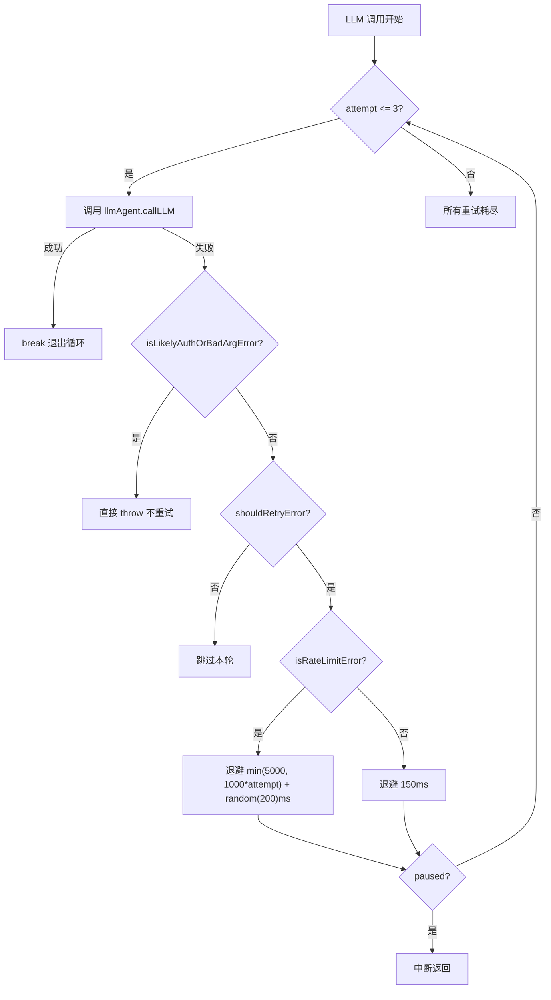
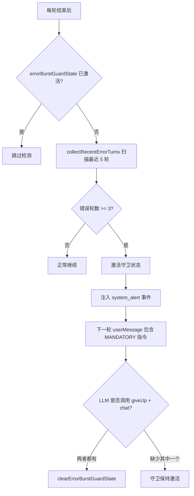

# PD-03.10 AIRI — 三层容错与错误爆发守卫

> 文档编号：PD-03.10
> 来源：AIRI `services/minecraft/src/cognitive/conscious/brain.ts`, `llmlogic.ts`
> GitHub：https://github.com/moeru-ai/airi.git
> 问题域：PD-03 容错与重试 Fault Tolerance & Retry
> 状态：可复用方案

---

## 第 1 章 问题与动机

### 1.1 核心问题

AIRI 是一个 Minecraft 自主 Agent，其"大脑"（Brain）通过 LLM 驱动认知循环：感知事件 → LLM 推理 → JavaScript REPL 执行动作。这个循环面临三类容错挑战：

1. **LLM 调用不可靠**：网络超时、速率限制（429）、服务端 5xx 错误随时可能发生，单次失败不应终止整个认知循环
2. **错误级联爆发**：LLM 连续生成错误代码（如引用不存在的工具、参数类型错误），导致 Agent 陷入"错误→重试→再错误"的死循环，浪费 token 且无进展
3. **无动作死循环**：LLM 反复返回"观察"而不执行任何动作，Agent 看似在思考实则停滞，消耗预算无产出

这三个问题在实时游戏环境中尤为严重——玩家在等待 Agent 响应，每一轮无效循环都是可感知的延迟。

### 1.2 AIRI 的解法概述

AIRI 实现了三层递进式容错架构：

1. **LLM 重试层**（`brain.ts:1838-2012`）：最多 3 次重试，区分可恢复错误（网络/速率限制）和不可恢复错误（认证/参数错误），速率限制使用指数退避 + 随机抖动
2. **错误爆发守卫**（`brain.ts:1029-1137`）：滑动窗口检测（5 轮内 3 次错误触发），强制 Agent 调用 `giveUp()` + `chat()` 向玩家解释，防止无限错误循环
3. **无动作预算系统**（`brain.ts:1556-1657`）：默认 3 次无动作跟进预算，停滞检测（相同签名重复 2 次即判定停滞），预算耗尽后强制 Agent 采取行动或放弃

此外，**取消令牌**（`task-state.ts:21-37`）提供了跨层中断能力，允许在任何层级取消正在执行的长时间动作。

### 1.3 设计思想

| 设计原则 | 具体实现 | 理由 | 替代方案 |
|----------|----------|------|----------|
| 错误分类优先 | `isLikelyAuthOrBadArgError` / `isRateLimitError` / `isLikelyRecoverableError` 三级分类 | 认证错误重试无意义，速率限制需要退避，网络错误可快速重试 | 统一重试所有错误（浪费时间和 token） |
| 滑动窗口而非计数器 | 错误爆发守卫检查最近 5 轮而非累计计数 | 避免历史偶发错误影响当前判断，只关注近期趋势 | 全局错误计数器（无法区分偶发和爆发） |
| 预算制而非硬限制 | 无动作跟进有可调预算（默认 3，最大 8） | LLM 有时需要多轮观察才能决策，硬限制会打断合理推理 | 固定次数限制（不够灵活） |
| 签名停滞检测 | 比较返回值 + 日志的签名，重复 2 次即判定停滞 | 即使预算未耗尽，重复相同输出说明 LLM 陷入循环 | 仅依赖预算（无法检测循环） |
| 协作式降级 | 错误爆发时要求 LLM 自己调用 `giveUp` + `chat` | 让 LLM 生成人类可读的错误解释，比硬编码消息更有用 | 系统直接终止（玩家不知道发生了什么） |

---

## 第 2 章 源码实现分析

### 2.1 架构概览

AIRI 的容错架构分布在认知循环的不同阶段，形成三道防线：

```
┌─────────────────────────────────────────────────────────┐
│                    Brain.processEvent()                  │
│                                                          │
│  ┌──────────────┐   ┌──────────────┐   ┌──────────────┐ │
│  │  第 1 层      │   │  第 2 层      │   │  第 3 层      │ │
│  │  LLM 重试    │──→│  错误爆发守卫 │──→│  无动作预算   │ │
│  │  3 次 + 退避  │   │  5轮/3错触发  │   │  3 次默认预算 │ │
│  └──────────────┘   └──────────────┘   └──────────────┘ │
│         │                   │                   │        │
│         ▼                   ▼                   ▼        │
│  ┌──────────────────────────────────────────────────┐    │
│  │           CancellationToken（跨层中断）            │    │
│  └──────────────────────────────────────────────────┘    │
└─────────────────────────────────────────────────────────┘
```

### 2.2 核心实现

#### 2.2.1 第 1 层：LLM 调用重试与错误分类



对应源码 `services/minecraft/src/cognitive/conscious/brain.ts:1838-2012`：

```typescript
// 3. Call LLM with retry logic
const maxAttempts = 3
let result: string | null = null
let capturedReasoning: string | undefined
let lastError: unknown

for (let attempt = 1; attempt <= maxAttempts; attempt++) {
  if (this.paused) {
    // ... 暂停中断日志
    return
  }
  try {
    // ... 构建消息、调用 LLM
    const llmResult = await this.deps.llmAgent.callLLM({ messages })
    const content = llmResult.text
    if (!content) throw new Error('No content from LLM')
    result = content
    break // Success, exit retry loop
  }
  catch (err) {
    lastError = err
    const remaining = maxAttempts - attempt
    const isRateLimit = isRateLimitError(err)
    const isAuthOrBadArg = isLikelyAuthOrBadArgError(err)
    const { shouldRetry } = shouldRetryError(err, remaining)

    if (!shouldRetry) {
      if (isAuthOrBadArg) throw err  // 不可恢复，直接抛出
      break  // 重试耗尽，跳过本轮
    }

    const backoffMs = isRateLimit
      ? Math.min(5000, 1000 * attempt) + Math.floor(Math.random() * 200)
      : 150
    await sleep(backoffMs)
  }
}
```

错误分类逻辑在 `services/minecraft/src/cognitive/conscious/llmlogic.ts:67-148`：

```typescript
export function isLikelyAuthOrBadArgError(err: unknown): boolean {
  const msg = toErrorMessage(err).toLowerCase()
  const status = getErrorStatus(err)
  if (status === 401 || status === 403) return true
  return (
    msg.includes('unauthorized') || msg.includes('invalid api key')
    || msg.includes('authentication') || msg.includes('forbidden')
    || msg.includes('invalid_request_error')
  )
}

export function isRateLimitError(err: unknown): boolean {
  const status = getErrorStatus(err)
  if (status === 429) return true
  const code = getErrorCode(err)
  if (code === 'token_quota_exceeded') return true
  const msg = toErrorMessage(err).toLowerCase()
  return (
    msg.includes('rate limit') || msg.includes('too many requests')
    || msg.includes('token quota') || msg.includes('tokens per minute')
  )
}

export function isLikelyRecoverableError(err: unknown): boolean {
  if (err instanceof SyntaxError) return true
  const status = getErrorStatus(err)
  if (status === 429) return true
  if (typeof status === 'number' && status >= 500) return true
  const code = getErrorCode(err)
  if (code && ['ETIMEDOUT','ECONNRESET','ENOTFOUND','EAI_AGAIN','ECONNREFUSED'].includes(code))
    return true
  const msg = toErrorMessage(err).toLowerCase()
  return (
    msg.includes('timeout') || msg.includes('overloaded')
    || msg.includes('temporarily') || msg.includes('try again')
  )
}
```

#### 2.2.2 第 2 层：错误爆发守卫（Error Burst Guard）



对应源码 `services/minecraft/src/cognitive/conscious/brain.ts:1029-1107`：

```typescript
private maybeActivateErrorBurstGuard(
  bot: MineflayerWithAgents, event: BotEvent, turnId: number,
): void {
  if (this.errorBurstGuardState) return  // 已激活则跳过
  if (turnId <= this.errorBurstGuardSuppressUntilTurnId) return  // 冷却期

  const { recentTurnIds, errorTurnIds, summaries }
    = this.collectRecentErrorTurns(ERROR_BURST_WINDOW_TURNS)  // 窗口=5
  if (errorTurnIds.length < ERROR_BURST_THRESHOLD) return  // 阈值=3

  this.errorBurstGuardState = {
    threshold: ERROR_BURST_THRESHOLD,
    windowTurns: ERROR_BURST_WINDOW_TURNS,
    errorTurnCount: errorTurnIds.length,
    recentTurnIds,
    recentErrorSummary: summaries.slice(0, ERROR_BURST_WINDOW_TURNS),
    triggeredAtTurnId: turnId,
  }
  // 注入 system_alert 事件，指导 LLM 调用 giveUp
  void this.enqueueEvent(bot, {
    type: 'system_alert',
    payload: {
      reason: 'error_burst_guard',
      guidance: 'Too many recent errors. Call giveUp(...) and send one chat explanation.',
    },
    source: { type: 'system', id: ERROR_BURST_GUARD_SOURCE_ID },
    timestamp: Date.now(),
  })
}
```

守卫解除条件（`brain.ts:1109-1137`）：LLM 必须在同一轮内同时调用 `giveUp` 和 `chat`，缺一不可。解除后设置冷却期 `errorBurstGuardSuppressUntilTurnId = turnId + 5`，防止立即重新触发。

### 2.3 实现细节

#### 无动作预算系统

无动作预算系统（`brain.ts:1556-1657`）是第三道防线，防止 LLM 陷入"只观察不行动"的循环：

- **默认预算**：3 次（`NO_ACTION_FOLLOWUP_BUDGET_DEFAULT`）
- **最大预算**：8 次（`NO_ACTION_FOLLOWUP_BUDGET_MAX`），LLM 可通过 `setNoActionBudget(n)` 调整
- **停滞检测**：通过 `buildNoActionSignature` 构建返回值 + 日志的签名，连续 2 次相同签名即判定停滞
- **预算重置**：玩家聊天消息自动重置预算（`resetNoActionFollowupBudget('player_chat')`）

```
预算流程：
  LLM 返回无动作 → 检查签名是否重复
    → 重复 >= 2 次 → 停滞，发送 budget_alert
    → 预算 <= 0 → 耗尽，发送 budget_alert
    → 否则 → 预算 -1，调度 no_action_followup 事件
```

#### 取消令牌（CancellationToken）

`task-state.ts:21-37` 实现了一个轻量级取消令牌，支持跨层中断：

```typescript
export function createCancellationToken(): CancellationToken {
  let isCancelled = false
  const callbacks: Array<() => void> = []
  return {
    get isCancelled() { return isCancelled },
    cancel() {
      isCancelled = true
      callbacks.forEach(cb => cb())
    },
    onCancelled(callback: () => void) { callbacks.push(callback) },
  }
}
```

每个控制动作执行时创建新的 `CancellationToken`（`brain.ts:1342`），`stop` 动作通过 `cancel()` 中断当前执行并清空待执行队列。

#### 事件队列优先级与合并

`brain.ts:1677-1720` 实现了事件队列合并策略：当玩家聊天（最高优先级）等待处理时，丢弃所有低优先级的 no-action follow-up 事件，避免 Agent 在无意义的自我循环中忽略玩家输入。


---

## 第 3 章 迁移指南

### 3.1 迁移清单

**阶段 1：错误分类基础设施**
- [ ] 实现 `toErrorMessage(err)` 统一错误消息提取（支持 Error、string、object）
- [ ] 实现 `getErrorStatus(err)` 从嵌套错误对象提取 HTTP 状态码
- [ ] 实现 `isLikelyAuthOrBadArgError(err)` 识别不可恢复错误（401/403/invalid key）
- [ ] 实现 `isRateLimitError(err)` 识别速率限制（429/token quota）
- [ ] 实现 `isLikelyRecoverableError(err)` 识别可恢复错误（5xx/timeout/ECONNRESET）
- [ ] 实现 `shouldRetryError(err, remaining)` 综合判断是否重试

**阶段 2：LLM 调用重试循环**
- [ ] 在 LLM 调用处添加 for 循环（maxAttempts=3）
- [ ] 速率限制使用指数退避：`min(5000, 1000 * attempt) + random(200)`
- [ ] 非速率限制错误使用固定短退避（150ms）
- [ ] 认证错误直接抛出，不重试

**阶段 3：错误爆发守卫**
- [ ] 定义 `ErrorBurstGuardState` 接口（threshold、windowTurns、errorTurnCount）
- [ ] 实现 `collectRecentErrorTurns(windowTurns)` 滑动窗口错误统计
- [ ] 实现 `maybeActivateErrorBurstGuard()` 激活逻辑
- [ ] 实现 `updateErrorBurstGuardCompletion()` 解除逻辑（需要 giveUp + chat 双确认）
- [ ] 添加冷却期防止重新触发

**阶段 4：无动作预算系统**
- [ ] 定义预算状态（remaining、default、max）
- [ ] 实现签名构建和停滞检测
- [ ] 实现预算扣减和耗尽处理
- [ ] 玩家输入自动重置预算

### 3.2 适配代码模板

以下是一个可直接复用的 TypeScript 错误分类 + 重试模板：

```typescript
// ---- 错误分类工具 ----

interface RetryDecision {
  shouldRetry: boolean
  remainingAttempts: number
}

function toErrorMessage(err: unknown): string {
  if (err instanceof Error) return err.message
  if (typeof err === 'string') return err
  if (typeof err === 'object' && err !== null && 'message' in err)
    return String((err as { message: unknown }).message)
  try { return JSON.stringify(err) } catch { return String(err) }
}

function getErrorStatus(err: unknown): number | undefined {
  const a = err as any
  const s = a?.status ?? a?.response?.status ?? a?.cause?.status
  return typeof s === 'number' ? s : undefined
}

function isAuthError(err: unknown): boolean {
  const status = getErrorStatus(err)
  if (status === 401 || status === 403) return true
  const msg = toErrorMessage(err).toLowerCase()
  return msg.includes('unauthorized') || msg.includes('invalid api key')
    || msg.includes('forbidden')
}

function isRateLimitError(err: unknown): boolean {
  if (getErrorStatus(err) === 429) return true
  const msg = toErrorMessage(err).toLowerCase()
  return msg.includes('rate limit') || msg.includes('too many requests')
    || msg.includes('token quota')
}

function isRecoverable(err: unknown): boolean {
  const status = getErrorStatus(err)
  if (status === 429 || (typeof status === 'number' && status >= 500)) return true
  const msg = toErrorMessage(err).toLowerCase()
  return msg.includes('timeout') || msg.includes('overloaded')
    || msg.includes('try again')
}

function shouldRetry(err: unknown, remaining: number): RetryDecision {
  return {
    shouldRetry: remaining > 0 && !isAuthError(err) && isRecoverable(err),
    remainingAttempts: remaining,
  }
}

// ---- 重试循环模板 ----

async function callLLMWithRetry<T>(
  fn: () => Promise<T>,
  maxAttempts = 3,
): Promise<T | null> {
  let lastError: unknown
  for (let attempt = 1; attempt <= maxAttempts; attempt++) {
    try {
      return await fn()
    } catch (err) {
      lastError = err
      const remaining = maxAttempts - attempt
      const decision = shouldRetry(err, remaining)
      if (!decision.shouldRetry) {
        if (isAuthError(err)) throw err
        break
      }
      const backoffMs = isRateLimitError(err)
        ? Math.min(5000, 1000 * attempt) + Math.floor(Math.random() * 200)
        : 150
      await new Promise(r => setTimeout(r, backoffMs))
    }
  }
  console.error('All retries exhausted:', toErrorMessage(lastError))
  return null
}

// ---- 错误爆发守卫模板 ----

interface ErrorBurstGuard {
  threshold: number
  windowSize: number
  recentErrors: { turnId: number; summary: string }[]
  triggered: boolean
  cooldownUntilTurn: number
}

function createErrorBurstGuard(threshold = 3, windowSize = 5): ErrorBurstGuard {
  return { threshold, windowSize, recentErrors: [], triggered: false, cooldownUntilTurn: 0 }
}

function recordTurnError(guard: ErrorBurstGuard, turnId: number, summary: string): void {
  guard.recentErrors.push({ turnId, summary })
  // 只保留窗口内的错误
  const cutoff = turnId - guard.windowSize
  guard.recentErrors = guard.recentErrors.filter(e => e.turnId > cutoff)
}

function checkBurst(guard: ErrorBurstGuard, currentTurn: number): boolean {
  if (guard.triggered || currentTurn <= guard.cooldownUntilTurn) return false
  if (guard.recentErrors.length >= guard.threshold) {
    guard.triggered = true
    return true
  }
  return false
}

function resolveBurst(guard: ErrorBurstGuard, currentTurn: number): void {
  guard.triggered = false
  guard.cooldownUntilTurn = currentTurn + guard.windowSize
  guard.recentErrors = []
}
```

### 3.3 适用场景

| 场景 | 适用度 | 说明 |
|------|--------|------|
| 实时游戏 Agent | ⭐⭐⭐ | 完美匹配：需要快速响应、不能长时间卡住 |
| 对话式 Agent（聊天机器人） | ⭐⭐⭐ | 错误爆发守卫防止连续错误回复 |
| 批量处理 Agent（研究/写作） | ⭐⭐ | 无动作预算不太适用，但重试和错误分类通用 |
| 单次 LLM 调用（非 Agent） | ⭐ | 只需第 1 层重试，不需要爆发守卫和预算系统 |
| 多 Agent 编排系统 | ⭐⭐⭐ | 每个子 Agent 可独立配置三层容错参数 |

---

## 第 4 章 测试用例

```typescript
import { describe, expect, it } from 'vitest'
import {
  isLikelyAuthOrBadArgError,
  isLikelyRecoverableError,
  isRateLimitError,
  shouldRetryError,
  toErrorMessage,
} from './llmlogic'

describe('错误分类', () => {
  it('识别认证错误 - HTTP 401', () => {
    const err = { status: 401, message: 'Unauthorized' }
    expect(isLikelyAuthOrBadArgError(err)).toBe(true)
    expect(shouldRetryError(err, 2).shouldRetry).toBe(false)
  })

  it('识别速率限制 - HTTP 429', () => {
    const err = { status: 429, message: 'Too Many Requests' }
    expect(isRateLimitError(err)).toBe(true)
    expect(isLikelyRecoverableError(err)).toBe(true)
    expect(shouldRetryError(err, 2).shouldRetry).toBe(true)
  })

  it('识别速率限制 - 消息匹配', () => {
    const err = new Error('token quota exceeded for this model')
    expect(isRateLimitError(err)).toBe(true)
  })

  it('识别网络错误 - ETIMEDOUT', () => {
    const err = Object.assign(new Error('connect timed out'), { code: 'ETIMEDOUT' })
    expect(isLikelyRecoverableError(err)).toBe(true)
    expect(shouldRetryError(err, 1).shouldRetry).toBe(true)
  })

  it('识别服务端错误 - 5xx', () => {
    const err = { status: 503, message: 'Service Unavailable' }
    expect(isLikelyRecoverableError(err)).toBe(true)
  })

  it('不重试认证错误即使有剩余次数', () => {
    const err = new Error('invalid api key provided')
    expect(shouldRetryError(err, 5).shouldRetry).toBe(false)
  })

  it('剩余次数为 0 时不重试', () => {
    const err = { status: 500, message: 'Internal Server Error' }
    expect(shouldRetryError(err, 0).shouldRetry).toBe(false)
  })

  it('嵌套错误对象提取状态码', () => {
    const err = { cause: { status: 429 } }
    expect(isRateLimitError(err)).toBe(true)
  })
})

describe('错误爆发守卫', () => {
  it('3 次错误在 5 轮窗口内触发守卫', () => {
    const guard = createErrorBurstGuard(3, 5)
    recordTurnError(guard, 1, 'err1')
    recordTurnError(guard, 2, 'err2')
    recordTurnError(guard, 3, 'err3')
    expect(checkBurst(guard, 3)).toBe(true)
    expect(guard.triggered).toBe(true)
  })

  it('窗口外的错误不计入', () => {
    const guard = createErrorBurstGuard(3, 5)
    recordTurnError(guard, 1, 'err1')
    recordTurnError(guard, 2, 'err2')
    // turnId=8 时，turnId=1 和 2 已超出窗口（8-5=3）
    recordTurnError(guard, 8, 'err3')
    expect(checkBurst(guard, 8)).toBe(false)
  })

  it('解除后进入冷却期', () => {
    const guard = createErrorBurstGuard(3, 5)
    recordTurnError(guard, 1, 'err1')
    recordTurnError(guard, 2, 'err2')
    recordTurnError(guard, 3, 'err3')
    checkBurst(guard, 3)
    resolveBurst(guard, 3)
    expect(guard.triggered).toBe(false)
    expect(guard.cooldownUntilTurn).toBe(8) // 3 + 5
    // 冷却期内不会重新触发
    recordTurnError(guard, 4, 'err4')
    recordTurnError(guard, 5, 'err5')
    recordTurnError(guard, 6, 'err6')
    expect(checkBurst(guard, 6)).toBe(false)
  })
})

describe('无动作预算', () => {
  it('预算从默认值递减', () => {
    let budget = 3
    // 模拟 3 次无动作
    for (let i = 0; i < 3; i++) {
      expect(budget > 0).toBe(true)
      budget--
    }
    expect(budget).toBe(0)
  })

  it('停滞检测 - 相同签名重复 2 次', () => {
    let lastSig: string | null = null
    let stagnationCount = 0
    const LIMIT = 2

    const sig1 = 'return=undefined||log1|log2'
    // 第一次
    if (sig1 === lastSig) stagnationCount++
    else stagnationCount = 0
    lastSig = sig1
    expect(stagnationCount < LIMIT).toBe(true)

    // 第二次相同签名
    if (sig1 === lastSig) stagnationCount++
    else stagnationCount = 0
    expect(stagnationCount >= LIMIT).toBe(true)
  })
})
```


---

## 第 5 章 跨域关联

| 关联域 | 关系类型 | 说明 |
|--------|----------|------|
| PD-01 上下文管理 | 协同 | 错误爆发守卫触发 `giveUp` 后，Brain 进入暂停状态，上下文管理的 `autoTrimActiveContext` 不再执行；恢复时需要重建上下文 |
| PD-02 多 Agent 编排 | 协同 | 控制动作队列（`pendingControlActions`）的失败处理与容错紧密耦合：单个动作失败会清空整个待执行队列（`clearPendingControlActions('cancelled')`） |
| PD-04 工具系统 | 依赖 | `ActionError` 的 `code` 字段（如 `INTERRUPTED`）被容错层用于区分取消和真正的失败（`brain.ts:1413`） |
| PD-09 Human-in-the-Loop | 协同 | `giveUp` 动作本质上是一种 Human-in-the-Loop 机制：Agent 主动放弃并等待玩家输入，玩家聊天消息触发恢复（`resumeFromGiveUpIfNeeded`） |
| PD-10 中间件管道 | 互斥 | AIRI 不使用中间件管道模式，容错逻辑直接嵌入 Brain 类的 `processEvent` 方法中，是一种紧耦合但高效的实现 |
| PD-11 可观测性 | 协同 | 每次重试、错误爆发、预算变化都通过 `appendLlmLog` 记录到环形日志（上限 1000 条），并通过 `DebugService` 实时推送到调试面板 |

---

## 第 6 章 来源文件索引

| 文件 | 行范围 | 关键实现 |
|------|--------|----------|
| `services/minecraft/src/cognitive/conscious/brain.ts` | L1-L316 | Brain 类定义、状态字段、常量（ERROR_BURST_THRESHOLD=3, WINDOW=5, NO_ACTION_BUDGET=3） |
| `services/minecraft/src/cognitive/conscious/brain.ts` | L1029-L1137 | 错误爆发守卫：激活、解除、冷却期逻辑 |
| `services/minecraft/src/cognitive/conscious/brain.ts` | L1556-L1657 | 无动作预算系统：签名构建、停滞检测、预算扣减 |
| `services/minecraft/src/cognitive/conscious/brain.ts` | L1838-L2012 | LLM 调用重试循环：3 次重试、错误分类、指数退避 |
| `services/minecraft/src/cognitive/conscious/brain.ts` | L2298-L2325 | giveUp 状态管理：抑制非玩家事件、玩家聊天恢复 |
| `services/minecraft/src/cognitive/conscious/llmlogic.ts` | L31-L44 | `toErrorMessage` 统一错误消息提取 |
| `services/minecraft/src/cognitive/conscious/llmlogic.ts` | L67-L105 | 错误分类三件套：auth/rateLimit/recoverable |
| `services/minecraft/src/cognitive/conscious/llmlogic.ts` | L140-L149 | `shouldRetryError` 综合重试决策 |
| `services/minecraft/src/cognitive/conscious/task-state.ts` | L21-L37 | `createCancellationToken` 取消令牌实现 |
| `services/minecraft/src/utils/errors.ts` | L1-L32 | `ActionError` 类型定义（含 INTERRUPTED 错误码） |
| `services/minecraft/src/cognitive/action/llm-actions.ts` | L41-L48 | `giveUp` 动作定义：同步执行、设置暂停状态 |
| `services/minecraft/src/cognitive/conscious/patterns/catalog.ts` | L77-L95 | `read.no_action_budget_exit` 模式：教 LLM 如何处理预算耗尽 |

---

## 第 7 章 横向对比维度

> **重要：** 本章用于自动填充 Butcher Wiki 的横向对比表。
> 必须严格按以下 JSON 格式输出，放在 `comparison_data` 代码块中。

```json comparison_data
{
  "project": "AIRI",
  "dimensions": {
    "重试策略": "3次重试，速率限制指数退避min(5s,1s*attempt)+随机200ms，非速率限制150ms固定退避",
    "错误分类": "三级分类：auth不重试直接抛出、rateLimit指数退避、recoverable快速重试",
    "降级方案": "协作式降级：错误爆发时LLM自主调用giveUp+chat向玩家解释",
    "截断/错误检测": "滑动窗口检测：5轮内3次错误触发爆发守卫，冷却期5轮",
    "超时保护": "CancellationToken跨层中断+stop动作清空待执行队列",
    "优雅降级": "giveUp暂停Agent等待玩家输入，玩家聊天自动恢复",
    "无动作循环防护": "预算制（默认3/最大8）+签名停滞检测（重复2次即停滞）",
    "事件优先级合并": "玩家聊天优先，丢弃低优先级no-action follow-up事件"
  }
}
```

### 域元数据补充

```json domain_metadata
{
  "solution_summary": "AIRI 用三层递进容错（LLM重试+错误爆发守卫+无动作预算）保护实时游戏Agent认知循环，错误爆发时协作式降级让LLM自主解释并暂停",
  "description": "实时交互Agent的认知循环容错需要兼顾响应速度和错误恢复",
  "sub_problems": [
    "LLM连续生成无效代码导致Agent陷入错误→重试→再错误的死循环",
    "LLM反复返回观察而不执行动作导致Agent停滞消耗token无进展",
    "错误爆发守卫解除后立即重新触发需要冷却期保护",
    "无动作跟进的签名停滞检测：相同返回值+日志重复说明LLM陷入循环",
    "事件队列中低优先级自循环事件阻塞高优先级玩家输入"
  ],
  "best_practices": [
    "错误爆发守卫用滑动窗口而非累计计数，只关注近期趋势",
    "协作式降级让LLM自己生成错误解释，比硬编码消息更有用",
    "无动作预算可由LLM动态调整，兼顾灵活性和安全性",
    "玩家输入自动重置所有容错状态，确保人类干预始终有效",
    "每次重试前检查暂停状态，支持外部中断重试循环"
  ]
}
```

