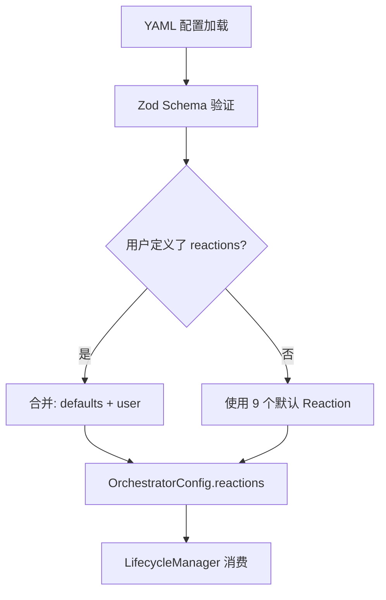
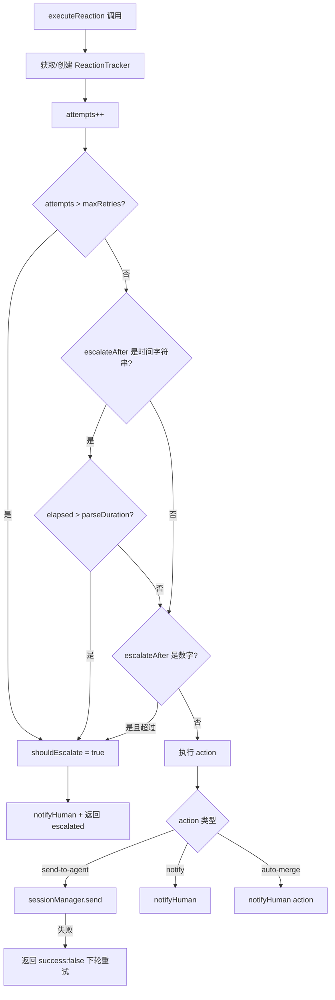

# PD-03.06 Agent-Orchestrator — ReactionConfig 驱动的自动重试与人工升级

> 文档编号：PD-03.06
> 来源：Agent-Orchestrator `packages/core/src/lifecycle-manager.ts`
> GitHub：https://github.com/ComposioHQ/agent-orchestrator.git
> 问题域：PD-03 容错与重试 Fault Tolerance & Retry
> 状态：可复用方案

---

## 第 1 章 问题与动机

### 1.1 核心问题

Agent 编排系统在运行过程中会遇到多种失败场景：CI 检查失败、代码审查要求修改、合并冲突、Agent 卡死等。这些失败不是一次性的——CI 可能反复失败，Review 评论可能多轮迭代。系统需要一种机制来：

1. **自动响应**已知失败模式（如 CI 失败时自动通知 Agent 修复）
2. **限制重试次数**避免无限循环消耗预算
3. **时间维度升级**——超过一定时间仍未解决则通知人类介入
4. **按项目覆盖**——不同项目可以有不同的重试策略

传统做法是在每个失败处理点硬编码重试逻辑，导致策略分散、难以统一管理。Agent-Orchestrator 的做法是将重试策略抽象为声明式配置（ReactionConfig），由 LifecycleManager 统一执行。

### 1.2 Agent-Orchestrator 的解法概述

1. **声明式 ReactionConfig**：在 YAML 配置中定义每种事件的响应策略，包括 action（send-to-agent / notify / auto-merge）、retries 次数、escalateAfter 时间阈值（`config.ts:25-34`）
2. **ReactionTracker 状态追踪**：为每个 `sessionId:reactionKey` 组合维护 attempts 计数和 firstTriggered 时间戳，支持次数和时间双维度升级判断（`lifecycle-manager.ts:166-169`）
3. **状态转换驱动**：LifecycleManager 轮询检测状态变化，状态转换时自动触发对应 Reaction，状态恢复时自动清除 tracker（`lifecycle-manager.ts:460-468`）
4. **级联清理模式**：Session spawn 过程中每一层资源创建失败都会清理已分配的资源，避免泄漏（`session-manager.ts:405-556`）
5. **项目级覆盖**：全局 reactions 配置可被项目级 reactions 覆盖合并，实现差异化策略（`lifecycle-manager.ts:477-483`）

### 1.3 设计思想

| 设计原则 | 具体实现 | 理由 | 替代方案 |
|----------|----------|------|----------|
| 声明式配置优于命令式代码 | ReactionConfig YAML 定义 action/retries/escalateAfter | 策略集中管理，非开发者也能调整 | 在代码中硬编码每种失败的处理逻辑 |
| 双维度升级（次数+时间） | `retries` 限制次数，`escalateAfter` 限制时间 | 有些问题重试几次就该放弃，有些问题需要给 Agent 足够时间 | 只用次数或只用时间 |
| 状态转换清除 tracker | 状态变化时删除旧状态的 reactionTracker | 避免状态恢复后旧的重试计数影响新一轮处理 | 全局计数器不清除 |
| 级联资源清理 | spawn 每层 try-catch 清理已分配资源 | 防止 workspace/runtime/metadata 泄漏 | 依赖 GC 或定期清理 |
| 轮询+防重入 | `polling` 布尔锁防止并发轮询 | 避免上一轮未完成时启动新一轮导致状态混乱 | 用 mutex 或队列 |

---

## 第 2 章 源码实现分析

### 2.1 架构概览

Agent-Orchestrator 的容错体系由三层组成：

```
┌─────────────────────────────────────────────────────────┐
│                    YAML 配置层                           │
│  reactions:                                              │
│    ci-failed: { action: send-to-agent, retries: 2 }     │
│    changes-requested: { escalateAfter: "30m" }          │
│    agent-stuck: { action: notify, priority: urgent }    │
├─────────────────────────────────────────────────────────┤
│              LifecycleManager 引擎层                     │
│  ┌──────────┐  ┌───────────────┐  ┌──────────────────┐ │
│  │ pollAll  │→ │ checkSession  │→ │ executeReaction  │ │
│  │ (30s轮询)│  │ (状态检测)     │  │ (重试/升级)      │ │
│  └──────────┘  └───────────────┘  └──────────────────┘ │
│       ↑              ↓                    ↓             │
│  reactionTrackers   状态转换事件      notifyHuman       │
├─────────────────────────────────────────────────────────┤
│              Session 资源管理层                           │
│  spawn: workspace → runtime → metadata (级联清理)        │
│  restore: archive → workspace.restore → runtime.create  │
└─────────────────────────────────────────────────────────┘
```

### 2.2 核心实现

#### 2.2.1 ReactionConfig 声明式配置



对应源码 `packages/core/src/config.ts:214-278`：

```typescript
function applyDefaultReactions(config: OrchestratorConfig): OrchestratorConfig {
  const defaults: Record<string, (typeof config.reactions)[string]> = {
    "ci-failed": {
      auto: true,
      action: "send-to-agent",
      message:
        "CI is failing on your PR. Run `gh pr checks` to see the failures, fix them, and push.",
      retries: 2,
      escalateAfter: 2,
    },
    "changes-requested": {
      auto: true,
      action: "send-to-agent",
      message:
        "There are review comments on your PR. Check with `gh pr view --comments` and `gh api` for inline comments. Address each one, push fixes, and reply.",
      escalateAfter: "30m",
    },
    "merge-conflicts": {
      auto: true,
      action: "send-to-agent",
      message: "Your branch has merge conflicts. Rebase on the default branch and resolve them.",
      escalateAfter: "15m",
    },
    "agent-stuck": {
      auto: true,
      action: "notify",
      priority: "urgent",
      threshold: "10m",
    },
  };
  // 用户配置覆盖默认值
  config.reactions = { ...defaults, ...config.reactions };
  return config;
}
```

#### 2.2.2 executeReaction 重试与升级引擎



对应源码 `packages/core/src/lifecycle-manager.ts:292-416`：

```typescript
async function executeReaction(
  sessionId: SessionId,
  projectId: string,
  reactionKey: string,
  reactionConfig: ReactionConfig,
): Promise<ReactionResult> {
  const trackerKey = `${sessionId}:${reactionKey}`;
  let tracker = reactionTrackers.get(trackerKey);

  if (!tracker) {
    tracker = { attempts: 0, firstTriggered: new Date() };
    reactionTrackers.set(trackerKey, tracker);
  }

  tracker.attempts++;

  // 双维度升级判断
  const maxRetries = reactionConfig.retries ?? Infinity;
  const escalateAfter = reactionConfig.escalateAfter;
  let shouldEscalate = false;

  if (tracker.attempts > maxRetries) {
    shouldEscalate = true;
  }

  if (typeof escalateAfter === "string") {
    const durationMs = parseDuration(escalateAfter);
    if (durationMs > 0 && Date.now() - tracker.firstTriggered.getTime() > durationMs) {
      shouldEscalate = true;
    }
  }

  if (shouldEscalate) {
    const event = createEvent("reaction.escalated", {
      sessionId, projectId,
      message: `Reaction '${reactionKey}' escalated after ${tracker.attempts} attempts`,
      data: { reactionKey, attempts: tracker.attempts },
    });
    await notifyHuman(event, reactionConfig.priority ?? "urgent");
    return { reactionType: reactionKey, success: true, action: "escalated", escalated: true };
  }

  // 执行具体 action
  switch (reactionConfig.action ?? "notify") {
    case "send-to-agent": {
      if (reactionConfig.message) {
        try {
          await sessionManager.send(sessionId, reactionConfig.message);
          return { reactionType: reactionKey, success: true, action: "send-to-agent",
                   message: reactionConfig.message, escalated: false };
        } catch {
          return { reactionType: reactionKey, success: false,
                   action: "send-to-agent", escalated: false };
        }
      }
      break;
    }
    case "notify": { /* ... */ }
    case "auto-merge": { /* ... */ }
  }
}
```

### 2.3 实现细节

#### 状态转换时清除 Tracker

当 Session 状态发生变化时，旧状态对应的 reactionTracker 会被清除（`lifecycle-manager.ts:460-468`）。这确保了：如果 CI 失败触发了 2 次重试后 Agent 修复成功（状态变为 `pr_open`），之后 CI 再次失败时重试计数从 0 开始。

```typescript
// lifecycle-manager.ts:460-468
const oldEventType = statusToEventType(undefined, oldStatus);
if (oldEventType) {
  const oldReactionKey = eventToReactionKey(oldEventType);
  if (oldReactionKey) {
    reactionTrackers.delete(`${session.id}:${oldReactionKey}`);
  }
}
```

#### 级联资源清理（Session Spawn）

Session 创建是一个多步骤过程：保留 ID → 创建 workspace → 创建 runtime → 写 metadata。每一步失败都会清理前面已分配的资源（`session-manager.ts:405-556`）：

```
reserveSessionId ──→ workspace.create ──→ runtime.create ──→ writeMetadata
       │                    │                    │                 │
       │              失败时清理:           失败时清理:        失败时清理:
       │              deleteMetadata       workspace.destroy  runtime.destroy
       │                                  deleteMetadata     workspace.destroy
       │                                                     deleteMetadata
```

#### 轮询防重入

`pollAll()` 使用布尔锁 `polling` 防止并发执行（`lifecycle-manager.ts:524-580`）。如果上一轮轮询尚未完成，新一轮直接跳过。轮询失败不会中断循环——catch 块为空，下一个 interval 继续。

#### 通知路由

通知按优先级路由到不同渠道（`lifecycle-manager.ts:419-433`）。配置示例：urgent → [desktop, composio]，warning → [composio]，info → [composio]。每个 notifier 的失败被静默吞掉，不影响其他 notifier。

---

## 第 3 章 迁移指南

### 3.1 迁移清单

**阶段 1：核心 Reaction 引擎（1 个文件）**

- [ ] 定义 `ReactionConfig` 接口（action / retries / escalateAfter / priority）
- [ ] 实现 `ReactionTracker`（attempts 计数 + firstTriggered 时间戳）
- [ ] 实现 `executeReaction()` 函数（双维度升级判断 + action 分发）
- [ ] 实现 `parseDuration()` 工具函数（"10m" → 600000ms）

**阶段 2：状态机集成**

- [ ] 定义事件类型到 reactionKey 的映射表
- [ ] 在状态转换处调用 `executeReaction()`
- [ ] 状态转换时清除旧状态的 tracker
- [ ] 实现轮询防重入锁

**阶段 3：配置层**

- [ ] 定义默认 reactions（ci-failed / changes-requested / agent-stuck 等）
- [ ] 支持项目级覆盖（merge 语义：`{ ...global, ...project }`）
- [ ] 用 Zod 验证配置 schema

**阶段 4：通知路由**

- [ ] 按优先级路由到不同通知渠道
- [ ] 每个 notifier 独立 try-catch，互不影响

### 3.2 适配代码模板

以下是一个可直接复用的 TypeScript Reaction 引擎实现：

```typescript
// reaction-engine.ts — 可独立使用的 Reaction 引擎

interface ReactionConfig {
  auto: boolean;
  action: "send-to-agent" | "notify" | "auto-merge";
  message?: string;
  priority?: "urgent" | "action" | "warning" | "info";
  retries?: number;
  escalateAfter?: number | string; // 次数或时间字符串 "10m"/"30s"/"1h"
}

interface ReactionTracker {
  attempts: number;
  firstTriggered: Date;
}

interface ReactionResult {
  reactionType: string;
  success: boolean;
  escalated: boolean;
  action: string;
}

function parseDuration(str: string): number {
  const match = str.match(/^(\d+)(s|m|h)$/);
  if (!match) return 0;
  const value = parseInt(match[1], 10);
  const unit = match[2];
  return value * (unit === "s" ? 1000 : unit === "m" ? 60_000 : 3_600_000);
}

class ReactionEngine {
  private trackers = new Map<string, ReactionTracker>();

  async execute(
    key: string,
    config: ReactionConfig,
    handlers: {
      sendToAgent: (message: string) => Promise<boolean>;
      notifyHuman: (priority: string, message: string) => Promise<void>;
    },
  ): Promise<ReactionResult> {
    let tracker = this.trackers.get(key);
    if (!tracker) {
      tracker = { attempts: 0, firstTriggered: new Date() };
      this.trackers.set(key, tracker);
    }
    tracker.attempts++;

    // 双维度升级判断
    const maxRetries = config.retries ?? Infinity;
    let shouldEscalate = tracker.attempts > maxRetries;

    if (!shouldEscalate && typeof config.escalateAfter === "string") {
      const durationMs = parseDuration(config.escalateAfter);
      if (durationMs > 0 && Date.now() - tracker.firstTriggered.getTime() > durationMs) {
        shouldEscalate = true;
      }
    }
    if (!shouldEscalate && typeof config.escalateAfter === "number") {
      shouldEscalate = tracker.attempts > config.escalateAfter;
    }

    if (shouldEscalate) {
      await handlers.notifyHuman(
        config.priority ?? "urgent",
        `Reaction '${key}' escalated after ${tracker.attempts} attempts`,
      );
      return { reactionType: key, success: true, escalated: true, action: "escalated" };
    }

    // 执行 action
    if (config.action === "send-to-agent" && config.message) {
      const ok = await handlers.sendToAgent(config.message);
      return { reactionType: key, success: ok, escalated: false, action: "send-to-agent" };
    }

    await handlers.notifyHuman(config.priority ?? "info", `Reaction '${key}' triggered`);
    return { reactionType: key, success: true, escalated: false, action: "notify" };
  }

  /** 状态转换时清除 tracker */
  clearTracker(key: string): void {
    this.trackers.delete(key);
  }

  /** 清除已不存在的 session 的所有 tracker */
  pruneStale(activeKeys: Set<string>): void {
    for (const trackerKey of this.trackers.keys()) {
      const sessionPart = trackerKey.split(":")[0];
      if (sessionPart && !activeKeys.has(sessionPart)) {
        this.trackers.delete(trackerKey);
      }
    }
  }
}
```

### 3.3 适用场景

| 场景 | 适用度 | 说明 |
|------|--------|------|
| CI/CD 自动修复循环 | ⭐⭐⭐ | 核心场景：CI 失败 → 通知 Agent → 重试 N 次 → 升级人工 |
| 代码审查自动响应 | ⭐⭐⭐ | Review 评论 → Agent 自动修复 → 超时升级 |
| Agent 健康监控 | ⭐⭐ | 检测 stuck/needs_input → 通知人类 |
| 多项目差异化策略 | ⭐⭐⭐ | 不同项目不同重试次数和升级阈值 |
| 单次 LLM 调用重试 | ⭐ | 粒度太粗，不适合单次 API 调用级别的重试 |

---

## 第 4 章 测试用例

```typescript
import { describe, it, expect, vi, beforeEach } from "vitest";

// 基于 ReactionEngine 适配代码模板的测试

class ReactionEngine {
  private trackers = new Map<string, { attempts: number; firstTriggered: Date }>();

  async execute(
    key: string,
    config: { retries?: number; escalateAfter?: number | string; action: string; message?: string; priority?: string },
    handlers: { sendToAgent: (msg: string) => Promise<boolean>; notifyHuman: (p: string, m: string) => Promise<void> },
  ) {
    let tracker = this.trackers.get(key);
    if (!tracker) {
      tracker = { attempts: 0, firstTriggered: new Date() };
      this.trackers.set(key, tracker);
    }
    tracker.attempts++;

    const maxRetries = config.retries ?? Infinity;
    let shouldEscalate = tracker.attempts > maxRetries;

    if (!shouldEscalate && typeof config.escalateAfter === "number") {
      shouldEscalate = tracker.attempts > config.escalateAfter;
    }

    if (shouldEscalate) {
      await handlers.notifyHuman(config.priority ?? "urgent", `Escalated after ${tracker.attempts}`);
      return { reactionType: key, success: true, escalated: true, action: "escalated" };
    }

    if (config.action === "send-to-agent" && config.message) {
      const ok = await handlers.sendToAgent(config.message);
      return { reactionType: key, success: ok, escalated: false, action: "send-to-agent" };
    }

    await handlers.notifyHuman(config.priority ?? "info", `Triggered`);
    return { reactionType: key, success: true, escalated: false, action: "notify" };
  }

  clearTracker(key: string) { this.trackers.delete(key); }
}

describe("ReactionEngine", () => {
  let engine: ReactionEngine;
  let sendToAgent: ReturnType<typeof vi.fn>;
  let notifyHuman: ReturnType<typeof vi.fn>;

  beforeEach(() => {
    engine = new ReactionEngine();
    sendToAgent = vi.fn().mockResolvedValue(true);
    notifyHuman = vi.fn().mockResolvedValue(undefined);
  });

  it("should send-to-agent on first attempt", async () => {
    const result = await engine.execute(
      "session-1:ci-failed",
      { action: "send-to-agent", message: "Fix CI", retries: 2 },
      { sendToAgent, notifyHuman },
    );
    expect(result.escalated).toBe(false);
    expect(result.action).toBe("send-to-agent");
    expect(sendToAgent).toHaveBeenCalledWith("Fix CI");
  });

  it("should escalate after max retries exceeded", async () => {
    const config = { action: "send-to-agent", message: "Fix CI", retries: 2, escalateAfter: 2 };
    const handlers = { sendToAgent, notifyHuman };

    await engine.execute("s1:ci", config, handlers); // attempt 1
    await engine.execute("s1:ci", config, handlers); // attempt 2
    const result = await engine.execute("s1:ci", config, handlers); // attempt 3 > retries

    expect(result.escalated).toBe(true);
    expect(notifyHuman).toHaveBeenCalledWith("urgent", expect.stringContaining("Escalated"));
  });

  it("should reset tracker on clearTracker", async () => {
    const config = { action: "send-to-agent", message: "Fix", retries: 1, escalateAfter: 1 };
    const handlers = { sendToAgent, notifyHuman };

    await engine.execute("s1:ci", config, handlers); // attempt 1
    engine.clearTracker("s1:ci"); // 状态转换，清除 tracker
    const result = await engine.execute("s1:ci", config, handlers); // attempt 1 again

    expect(result.escalated).toBe(false);
    expect(result.action).toBe("send-to-agent");
  });

  it("should handle send-to-agent failure gracefully", async () => {
    sendToAgent.mockResolvedValue(false);
    const result = await engine.execute(
      "s1:ci",
      { action: "send-to-agent", message: "Fix", retries: 3 },
      { sendToAgent, notifyHuman },
    );
    expect(result.success).toBe(false);
    expect(result.escalated).toBe(false);
    // 下一轮轮询会再次触发，attempts 递增
  });

  it("should fall back to notify when action is notify", async () => {
    const result = await engine.execute(
      "s1:stuck",
      { action: "notify", priority: "urgent" },
      { sendToAgent, notifyHuman },
    );
    expect(result.action).toBe("notify");
    expect(notifyHuman).toHaveBeenCalledWith("urgent", expect.any(String));
  });
});
```

---

## 第 5 章 跨域关联

| 关联域 | 关系类型 | 说明 |
|--------|----------|------|
| PD-02 多 Agent 编排 | 依赖 | LifecycleManager 的轮询和 Reaction 执行依赖 SessionManager 的多 Session 管理能力 |
| PD-04 工具系统 | 协同 | Reaction 的 `send-to-agent` action 通过 Runtime 插件发送消息，依赖插件系统的 Registry 机制 |
| PD-09 Human-in-the-Loop | 协同 | 升级（escalation）本质上是从自动处理切换到人工介入，Notifier 插件是 HITL 的推送通道 |
| PD-10 中间件管道 | 互补 | Reaction 系统是事件驱动的响应管道，与中间件管道的请求处理管道互补 |
| PD-11 可观测性 | 依赖 | Reaction 事件（triggered / escalated）是可观测性数据的重要来源，每次 reaction 都生成 OrchestratorEvent |

---

## 第 6 章 来源文件索引

| 文件 | 行范围 | 关键实现 |
|------|--------|----------|
| `packages/core/src/lifecycle-manager.ts` | L1-L607 | LifecycleManager 完整实现：轮询、状态检测、Reaction 执行、升级 |
| `packages/core/src/lifecycle-manager.ts` | L166-L169 | ReactionTracker 接口定义 |
| `packages/core/src/lifecycle-manager.ts` | L292-L416 | executeReaction() 核心函数：重试计数、双维度升级、action 分发 |
| `packages/core/src/lifecycle-manager.ts` | L436-L521 | checkSession()：状态转换检测 + tracker 清除 + reaction 触发 |
| `packages/core/src/lifecycle-manager.ts` | L524-L580 | pollAll()：防重入轮询 + stale tracker 清理 |
| `packages/core/src/config.ts` | L25-L34 | ReactionConfigSchema Zod 定义 |
| `packages/core/src/config.ts` | L214-L278 | 9 个默认 Reaction 配置（ci-failed/changes-requested/agent-stuck 等） |
| `packages/core/src/types.ts` | L755-L787 | ReactionConfig / ReactionResult 接口定义 |
| `packages/core/src/types.ts` | L94-L101 | TERMINAL_STATUSES 终态集合 |
| `packages/core/src/types.ts` | L1049-L1064 | isIssueNotFoundError() 错误分类辅助函数 |
| `packages/core/src/types.ts` | L1067-L1086 | SessionNotRestorableError / WorkspaceMissingError 自定义错误类 |
| `packages/core/src/session-manager.ts` | L365-L388 | 原子 Session ID 保留（O_EXCL + 10 次重试） |
| `packages/core/src/session-manager.ts` | L405-L556 | spawn() 级联资源清理模式 |
| `packages/core/src/session-manager.ts` | L920-L1107 | restore()：archive 回退 + workspace 恢复 + runtime 重建 |
| `packages/core/src/metadata.ts` | L264-L274 | reserveSessionId() 原子文件创建（O_EXCL） |
| `packages/core/src/metadata.ts` | L191-L240 | deleteMetadata() 归档机制 + readArchivedMetadataRaw() 恢复 |
| `packages/plugins/runtime-tmux/src/index.ts` | L58-L91 | 长命令 buffer 降级（>200 字符用 load-buffer 替代 send-keys） |
| `packages/plugins/runtime-tmux/src/index.ts` | L103-L108 | destroy() best-effort 清理 |

---

## 第 7 章 横向对比维度

> **重要：** 本章用于自动填充 Butcher Wiki 的横向对比表。
> 必须严格按以下 JSON 格式输出，放在 `comparison_data` 代码块中。

```json comparison_data
{
  "project": "AgentOrchestrator",
  "dimensions": {
    "截断/错误检测": "LifecycleManager 轮询检测 14 种 SessionStatus 状态转换，inferPriority 按事件类型分级",
    "重试/恢复策略": "ReactionConfig 声明式配置，send-to-agent 自动重试 + 失败不升级等下轮",
    "超时保护": "escalateAfter 支持时间字符串（10m/30s/1h），parseDuration 解析后与 firstTriggered 比较",
    "优雅降级": "send-to-agent 失败返回 success:false 等下轮重试，不立即升级",
    "重试策略": "次数限制（retries）+ 时间限制（escalateAfter）双维度，状态转换时清除 tracker",
    "降级方案": "超过阈值后 escalate 到人工通知，按 priority 路由到不同 Notifier 渠道",
    "错误分类": "isIssueNotFoundError 区分业务错误与基础设施错误，自定义 Error 子类",
    "恢复机制": "Session restore 从 archive 恢复 metadata + workspace.restore 重建工作区",
    "配置预验证": "Zod schema 验证 YAML 配置，项目唯一性和 sessionPrefix 冲突检测",
    "监控告警": "OrchestratorEvent 事件体系，4 级优先级路由到多 Notifier 渠道",
    "并发容错": "pollAll 布尔锁防重入，Promise.allSettled 并发检查所有 Session",
    "级联清理": "spawn 4 层 try-catch 级联清理 workspace/runtime/metadata，best-effort 不抛异常"
  }
}
```

### 域元数据补充

```json domain_metadata
{
  "solution_summary": "AgentOrchestrator 用 ReactionConfig 声明式配置驱动 9 种事件的自动重试，支持 retries 次数 + escalateAfter 时间双维度升级到人工通知",
  "description": "CI/CD 流水线中 Agent 失败的声明式自动响应与人工升级",
  "sub_problems": [
    "Reaction tracker 状态转换时的清除时机：过早清除导致重试计数丢失，过晚清除导致误升级",
    "轮询间隔与 escalateAfter 精度不匹配：30s 轮询无法精确触发 15s 的升级阈值",
    "send-to-agent 消息在 tmux 中被截断：超过 200 字符的修复指令需要 buffer 降级"
  ],
  "best_practices": [
    "状态转换时清除对应 reactionTracker，避免旧计数影响新一轮重试",
    "send-to-agent 失败时返回 success:false 而非立即升级，给下一轮轮询机会",
    "用 Promise.allSettled 并发检查多 Session，单个失败不阻塞其他",
    "spawn 过程每层资源分配都配 try-catch 级联清理，防止泄漏",
    "项目级 reaction 配置覆盖全局默认，用 spread 合并语义"
  ]
}
```
