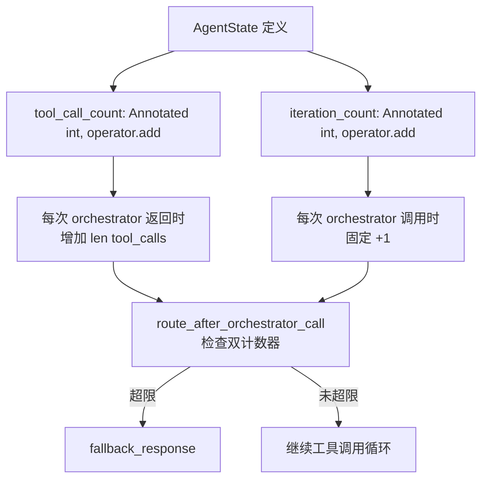
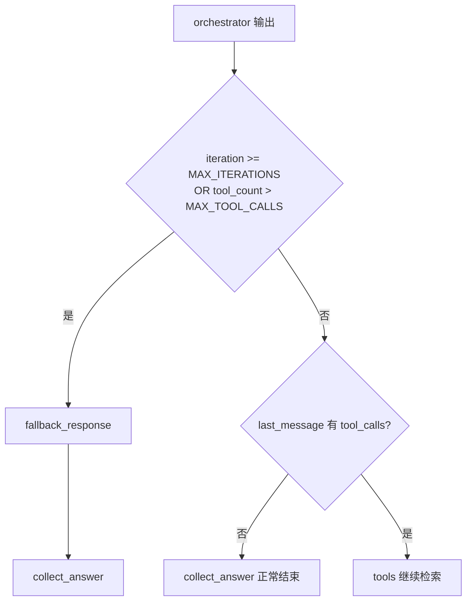
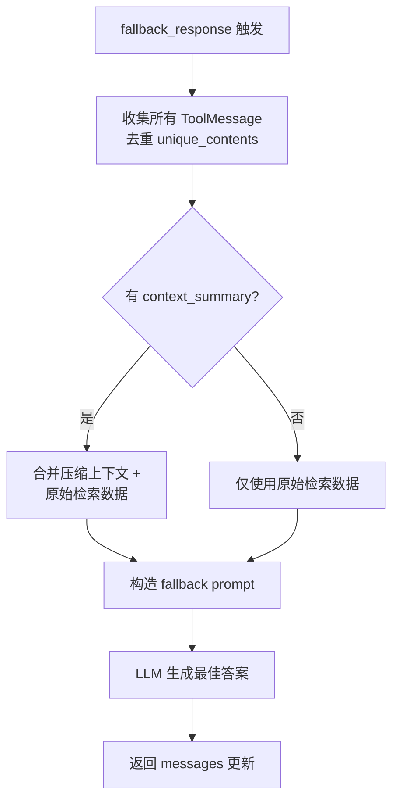

# PD-03.07 agentic-rag-for-dummies — 双计数器硬限制与 fallback 优雅降级

> 文档编号：PD-03.07
> 来源：agentic-rag-for-dummies `project/rag_agent/edges.py`, `project/rag_agent/nodes.py`, `project/config.py`
> GitHub：https://github.com/GiovanniPasq/agentic-rag-for-dummies.git
> 问题域：PD-03 容错与重试 Fault Tolerance & Retry
> 状态：可复用方案

---

## 第 1 章 问题与动机

### 1.1 核心问题

Agentic RAG 系统中，LLM 驱动的 Agent 在工具调用循环中存在两类失控风险：

1. **迭代失控**：LLM 反复调用工具但无法收敛到最终答案，消耗无限 token
2. **工具调用爆炸**：单次 LLM 响应生成大量 tool_calls，或多轮累积的工具调用总量失控
3. **无答案静默失败**：Agent 耗尽资源后直接崩溃，用户得不到任何有用响应

这三个问题在 RAG 场景中尤为突出——检索工具天然鼓励"再搜一次"的行为，LLM 容易陷入"搜索→发现不够→再搜索"的无限循环。

### 1.2 agentic-rag-for-dummies 的解法概述

该项目采用**极简但有效**的三层防护策略：

1. **双计数器硬限制**（`config.py:21-22`）：`MAX_TOOL_CALLS=8` 限制工具调用总量，`MAX_ITERATIONS=10` 限制 orchestrator 循环次数，两个计数器通过 LangGraph 的 `operator.add` reducer 自动累加
2. **条件路由降级**（`edges.py:15-28`）：`route_after_orchestrator_call` 在每次 orchestrator 输出后检查双计数器，超限时路由到 `fallback_response` 而非直接终止
3. **上下文感知 fallback**（`nodes.py:67-94`）：fallback 节点不是简单返回错误，而是汇总压缩上下文 + 原始检索数据，让 LLM 基于已有信息生成最佳答案
4. **工具层异常吞咽**（`tools.py:18-31, 39-53`）：所有工具方法用 try/except 包裹，异常转为错误字符串返回，避免异常冒泡中断整个图执行
5. **上下文压缩防膨胀**（`nodes.py:96-164`）：token 超阈值时自动压缩历史消息，防止上下文窗口溢出导致 LLM 调用失败

### 1.3 设计思想

| 设计原则 | 具体实现 | 理由 | 替代方案 |
|----------|----------|------|----------|
| 双维度限制 | tool_call_count + iteration_count 独立计数 | 单一计数器无法区分"调用多但轮次少"和"轮次多但调用少"两种失控模式 | 单一 step_count 计数器 |
| 硬限制优于软限制 | `>=` 比较直接路由，无警告/渐进机制 | 教学项目追求简洁可理解，硬限制零歧义 | 渐进式预算递减 + 警告 |
| 降级优于终止 | fallback_response 生成最佳答案而非返回错误 | 用户体验：即使不完美也比"系统错误"好 | 直接返回 "max retries exceeded" |
| 异常字符串化 | try/except 返回 `RETRIEVAL_ERROR: {e}` | LLM 可以理解错误字符串并调整策略，异常会中断图执行 | 让异常冒泡 + 全局 error handler |
| 累加式计数 | `Annotated[int, operator.add]` reducer | LangGraph 原生支持，每个节点只需返回增量，无需读取全局状态 | 手动在节点中 state["count"] += 1 |

---

## 第 2 章 源码实现分析

### 2.1 架构概览

agentic-rag-for-dummies 的容错架构嵌入在 LangGraph 状态图的路由逻辑中，不是独立的容错层，而是与业务流程深度耦合：

```
┌─────────────────────────────────────────────────────────────────┐
│                    Agent Subgraph (AgentState)                  │
│                                                                 │
│  ┌──────────┐    ┌───────────────────────┐    ┌──────────┐     │
│  │orchestrat│───→│route_after_orchestrator│───→│  tools   │     │
│  │   or     │    │      _call            │    │(ToolNode)│     │
│  └──────────┘    └───────────────────────┘    └────┬─────┘     │
│       ↑                │          │                 │           │
│       │                │          │                 ↓           │
│       │                │          │          ┌─────────────┐   │
│       │                │          │          │should_compre-│   │
│       │                │          │          │ ss_context   │   │
│       │                │          │          └──────┬──────┘   │
│       │                │          │                 │           │
│       │                │          │          ┌──────┴──────┐   │
│       │                │          │          │compress_     │   │
│       │                │          │          │context       │   │
│       ├────────────────┘          │          └──────┬──────┘   │
│       │  (token超限→压缩→重回)     │                 │           │
│       ←───────────────────────────┼─────────────────┘           │
│                                   │                             │
│                          ┌────────┴────────┐                   │
│                          │                 │                   │
│                     ┌────┴─────┐    ┌──────┴──────┐           │
│                     │ fallback │    │  collect    │           │
│                     │_response │    │  _answer    │           │
│                     └────┬─────┘    └──────┬──────┘           │
│                          │                 │                   │
│                          └────────┬────────┘                   │
│                                   ↓                            │
│                                  END                           │
└─────────────────────────────────────────────────────────────────┘

关键路由决策点：route_after_orchestrator_call
  - iteration >= 10 OR tool_count > 8 → fallback_response（优雅降级）
  - 无 tool_calls → collect_answer（正常完成）
  - 有 tool_calls → tools（继续检索）
```

### 2.2 核心实现

#### 2.2.1 双计数器状态定义



对应源码 `project/rag_agent/graph_state.py:21-30`：

```python
class AgentState(MessagesState):
    """State for individual agent subgraph"""
    question: str = ""
    question_index: int = 0
    context_summary: str = ""
    retrieval_keys: Annotated[Set[str], set_union] = set()
    final_answer: str = ""
    agent_answers: List[dict] = []
    tool_call_count: Annotated[int, operator.add] = 0    # 工具调用累计
    iteration_count: Annotated[int, operator.add] = 0    # 迭代轮次累计
```

`operator.add` 作为 reducer 意味着每个节点只需返回增量值，LangGraph 自动累加到全局状态。这是一个精巧的设计——`orchestrator` 节点返回 `{"tool_call_count": len(tool_calls), "iteration_count": 1}`，无需读取当前计数。

#### 2.2.2 条件路由与降级触发



对应源码 `project/rag_agent/edges.py:15-28`：

```python
def route_after_orchestrator_call(state: AgentState) -> Literal["tool", "fallback_response", "collect_answer"]:
    iteration = state.get("iteration_count", 0)
    tool_count = state.get("tool_call_count", 0)

    if iteration >= MAX_ITERATIONS or tool_count > MAX_TOOL_CALLS:
        return "fallback_response"

    last_message = state["messages"][-1]
    tool_calls = getattr(last_message, "tool_calls", None) or []

    if not tool_calls:
        return "collect_answer"
    
    return "tools"
```

注意 `iteration >= MAX_ITERATIONS`（>=）vs `tool_count > MAX_TOOL_CALLS`（>）的微妙差异：迭代计数从 1 开始（每次 orchestrator 返回 +1），工具计数从 0 开始累加实际调用数。

#### 2.2.3 Fallback 节点：上下文感知的优雅降级



对应源码 `project/rag_agent/nodes.py:67-94`：

```python
def fallback_response(state: AgentState, llm):
    seen = set()
    unique_contents = []
    for m in state["messages"]:
        if isinstance(m, ToolMessage) and m.content not in seen:
            unique_contents.append(m.content)
            seen.add(m.content)

    context_summary = state.get("context_summary", "").strip()

    context_parts = []
    if context_summary:
        context_parts.append(
            f"## Compressed Research Context (from prior iterations)\n\n{context_summary}")
    if unique_contents:
        context_parts.append(
            "## Retrieved Data (current iteration)\n\n" +
            "\n\n".join(f"--- DATA SOURCE {i} ---\n{content}"
                        for i, content in enumerate(unique_contents, 1)))

    context_text = "\n\n".join(context_parts) if context_parts \
        else "No data was retrieved from the documents."

    prompt_content = (
        f"USER QUERY: {state.get('question')}\n\n"
        f"{context_text}\n\n"
        f"INSTRUCTION:\nProvide the best possible answer using only the data above."
    )
    response = llm.invoke([
        SystemMessage(content=get_fallback_response_prompt()),
        HumanMessage(content=prompt_content)
    ])
    return {"messages": [response]}
```

fallback 的关键设计：它不是返回"抱歉，超时了"，而是**汇总两个信息源**——压缩上下文（prior iterations 的精华）和原始检索数据（当前 iteration 的 ToolMessage），让 LLM 基于所有已收集的信息生成最佳答案。

### 2.3 实现细节

#### 工具层异常吞咽

`tools.py` 中所有工具方法统一采用 try/except 模式，将异常转为带前缀的错误字符串（`tools.py:18-31`）：

```python
def _search_child_chunks(self, query: str, limit: int) -> str:
    try:
        results = self.collection.similarity_search(query, k=limit, score_threshold=0.7)
        if not results:
            return "NO_RELEVANT_CHUNKS"
        return "\n\n".join([...])
    except Exception as e:
        return f"RETRIEVAL_ERROR: {str(e)}"
```

错误字符串前缀约定：`NO_RELEVANT_CHUNKS`、`NO_PARENT_DOCUMENTS`、`NO_PARENT_DOCUMENT`、`RETRIEVAL_ERROR`、`PARENT_RETRIEVAL_ERROR`。这些前缀让 LLM 能区分"没找到"和"出错了"，从而决定是换个 query 重搜还是放弃。

#### 上下文压缩防膨胀

`should_compress_context`（`nodes.py:96-125`）在每次工具调用后检查 token 量：

```python
current_tokens = current_token_messages + current_token_summary
max_allowed = BASE_TOKEN_THRESHOLD + int(current_token_summary * TOKEN_GROWTH_FACTOR)
goto = "compress_context" if current_tokens > max_allowed else "orchestrator"
```

阈值公式 `BASE_TOKEN_THRESHOLD + summary * TOKEN_GROWTH_FACTOR` 是动态的——随着压缩摘要增长，允许的总 token 量也适度增长（`TOKEN_GROWTH_FACTOR=0.9`），避免频繁压缩。

#### 重复检索防护

`should_compress_context` 还维护 `retrieval_keys` 集合（`nodes.py:99-114`），记录已执行的搜索 query 和已检索的 parent ID。压缩后这些 key 被注入到摘要末尾（`nodes.py:152-162`），orchestrator prompt 明确指示"已列出的 query 和 parent ID 不要重复调用"（`prompts.py:70-72`）。

#### collect_answer 的防御性检查

`collect_answer`（`nodes.py:166-173`）对最后一条消息做三重验证：

```python
is_valid = isinstance(last_message, AIMessage) and last_message.content and not last_message.tool_calls
answer = last_message.content if is_valid else "Unable to generate an answer."
```

即使 LLM 返回了空内容或仍带 tool_calls 的消息，也不会崩溃，而是返回兜底文本。

---

## 第 3 章 迁移指南

### 3.1 迁移清单

**阶段 1：状态定义（必须）**
- [ ] 在 AgentState 中添加 `tool_call_count: Annotated[int, operator.add]` 和 `iteration_count: Annotated[int, operator.add]`
- [ ] 在 config 中定义 `MAX_TOOL_CALLS` 和 `MAX_ITERATIONS` 常量

**阶段 2：路由降级（必须）**
- [ ] 实现 `route_after_orchestrator_call` 条件路由函数
- [ ] 在 orchestrator 节点返回值中包含 `tool_call_count` 和 `iteration_count` 增量
- [ ] 实现 `fallback_response` 节点

**阶段 3：工具层防护（推荐）**
- [ ] 所有工具方法添加 try/except，异常转为错误字符串
- [ ] 定义错误前缀约定（如 `RETRIEVAL_ERROR`、`NO_RESULTS`）

**阶段 4：上下文压缩（可选）**
- [ ] 实现 token 估算函数
- [ ] 实现 `should_compress_context` + `compress_context` 节点
- [ ] 维护 `retrieval_keys` 防止重复检索

### 3.2 适配代码模板

以下模板可直接用于任何 LangGraph Agent，不依赖 agentic-rag-for-dummies 的其他组件：

```python
import operator
from typing import Annotated, Literal
from langgraph.graph import StateGraph, START, END, MessagesState
from langchain_core.messages import SystemMessage, HumanMessage, AIMessage, ToolMessage

# --- 配置 ---
MAX_TOOL_CALLS = 8
MAX_ITERATIONS = 10

# --- 状态 ---
class AgentState(MessagesState):
    tool_call_count: Annotated[int, operator.add] = 0
    iteration_count: Annotated[int, operator.add] = 0

# --- 路由 ---
def route_after_agent(state: AgentState) -> Literal["tools", "fallback", "done"]:
    if (state.get("iteration_count", 0) >= MAX_ITERATIONS
            or state.get("tool_call_count", 0) > MAX_TOOL_CALLS):
        return "fallback"
    last = state["messages"][-1]
    if getattr(last, "tool_calls", None):
        return "tools"
    return "done"

# --- Fallback ---
def fallback_node(state: AgentState):
    tool_data = [m.content for m in state["messages"] if isinstance(m, ToolMessage)]
    context = "\n---\n".join(tool_data) if tool_data else "No data retrieved."
    # 用你自己的 LLM 调用替换
    return {"messages": [AIMessage(content=f"[Fallback] Best answer from: {context[:500]}")]}

# --- Agent ---
def agent_node(state: AgentState, llm_with_tools):
    response = llm_with_tools.invoke(state["messages"])
    tc = response.tool_calls if hasattr(response, "tool_calls") else []
    return {
        "messages": [response],
        "tool_call_count": len(tc),
        "iteration_count": 1,
    }

# --- 图构建 ---
def build_graph(llm_with_tools, tool_node):
    from functools import partial
    g = StateGraph(AgentState)
    g.add_node("agent", partial(agent_node, llm_with_tools=llm_with_tools))
    g.add_node("tools", tool_node)
    g.add_node("fallback", fallback_node)
    g.add_edge(START, "agent")
    g.add_conditional_edges("agent", route_after_agent,
                            {"tools": "tools", "fallback": "fallback", "done": END})
    g.add_edge("tools", "agent")
    g.add_edge("fallback", END)
    return g.compile()
```

### 3.3 适用场景

| 场景 | 适用度 | 说明 |
|------|--------|------|
| 单 Agent RAG 检索循环 | ⭐⭐⭐ | 完美匹配：工具调用有限、需要降级答案 |
| 多 Agent 并行编排 | ⭐⭐ | 每个子 Agent 可独立应用双计数器，但缺少全局预算控制 |
| 长时间运行的研究 Agent | ⭐ | MAX_ITERATIONS=10 可能过于保守，需要调大或改为动态预算 |
| 流式输出场景 | ⭐⭐ | fallback 可以正常流式输出，但中途切换到 fallback 的体验需要前端配合 |
| 生产环境高并发 | ⭐ | 缺少指数退避、断路器、Provider 降级等生产级容错 |

---

## 第 4 章 测试用例

```python
import operator
import pytest
from typing import Annotated, Literal
from unittest.mock import MagicMock, patch
from langchain_core.messages import AIMessage, ToolMessage, HumanMessage

# 模拟 AgentState
class MockAgentState(dict):
    def get(self, key, default=None):
        return super().get(key, default)

# --- 测试 route_after_orchestrator_call ---
MAX_TOOL_CALLS = 8
MAX_ITERATIONS = 10

def route_after_orchestrator_call(state) -> Literal["tools", "fallback_response", "collect_answer"]:
    iteration = state.get("iteration_count", 0)
    tool_count = state.get("tool_call_count", 0)
    if iteration >= MAX_ITERATIONS or tool_count > MAX_TOOL_CALLS:
        return "fallback_response"
    last_message = state["messages"][-1]
    tool_calls = getattr(last_message, "tool_calls", None) or []
    if not tool_calls:
        return "collect_answer"
    return "tools"


class TestRouteAfterOrchestratorCall:
    def test_normal_completion(self):
        """LLM 返回无 tool_calls 的消息 → collect_answer"""
        state = MockAgentState(
            messages=[AIMessage(content="Here is the answer.")],
            iteration_count=3,
            tool_call_count=4,
        )
        assert route_after_orchestrator_call(state) == "collect_answer"

    def test_continue_with_tools(self):
        """LLM 返回带 tool_calls → tools"""
        msg = AIMessage(content="", tool_calls=[{"name": "search", "args": {"q": "test"}, "id": "1"}])
        state = MockAgentState(
            messages=[msg],
            iteration_count=2,
            tool_call_count=3,
        )
        assert route_after_orchestrator_call(state) == "tools"

    def test_iteration_limit_triggers_fallback(self):
        """迭代次数达到上限 → fallback"""
        state = MockAgentState(
            messages=[AIMessage(content="still searching...")],
            iteration_count=10,
            tool_call_count=5,
        )
        assert route_after_orchestrator_call(state) == "fallback_response"

    def test_tool_count_limit_triggers_fallback(self):
        """工具调用次数超限 → fallback"""
        state = MockAgentState(
            messages=[AIMessage(content="")],
            iteration_count=3,
            tool_call_count=9,
        )
        assert route_after_orchestrator_call(state) == "fallback_response"

    def test_both_limits_exceeded(self):
        """双计数器同时超限 → fallback"""
        state = MockAgentState(
            messages=[AIMessage(content="")],
            iteration_count=15,
            tool_call_count=20,
        )
        assert route_after_orchestrator_call(state) == "fallback_response"

    def test_boundary_tool_count_not_exceeded(self):
        """tool_count == MAX_TOOL_CALLS（边界）→ 不触发 fallback（> 而非 >=）"""
        state = MockAgentState(
            messages=[AIMessage(content="done")],
            iteration_count=5,
            tool_call_count=8,
        )
        assert route_after_orchestrator_call(state) == "collect_answer"


# --- 测试工具层异常吞咽 ---
class TestToolErrorHandling:
    def test_search_returns_error_string_on_exception(self):
        """工具异常被捕获并转为错误字符串"""
        from unittest.mock import MagicMock
        factory = MagicMock()
        factory.collection.similarity_search.side_effect = ConnectionError("DB down")
        # 模拟 _search_child_chunks 的 try/except 逻辑
        try:
            factory.collection.similarity_search("test", k=5, score_threshold=0.7)
        except Exception as e:
            result = f"RETRIEVAL_ERROR: {str(e)}"
        assert result == "RETRIEVAL_ERROR: DB down"

    def test_search_returns_no_results_marker(self):
        """无结果时返回特定标记而非空字符串"""
        results = []
        output = "NO_RELEVANT_CHUNKS" if not results else "has results"
        assert output == "NO_RELEVANT_CHUNKS"


# --- 测试 fallback 上下文汇总 ---
class TestFallbackResponse:
    def test_deduplicates_tool_messages(self):
        """fallback 对 ToolMessage 内容去重"""
        messages = [
            HumanMessage(content="query"),
            ToolMessage(content="data A", tool_call_id="1"),
            ToolMessage(content="data A", tool_call_id="2"),  # 重复
            ToolMessage(content="data B", tool_call_id="3"),
        ]
        seen = set()
        unique = []
        for m in messages:
            if isinstance(m, ToolMessage) and m.content not in seen:
                unique.append(m.content)
                seen.add(m.content)
        assert len(unique) == 2
        assert unique == ["data A", "data B"]

    def test_fallback_with_no_data(self):
        """无检索数据时 fallback 仍能生成提示"""
        context_parts = []
        context_text = "\n\n".join(context_parts) if context_parts \
            else "No data was retrieved from the documents."
        assert context_text == "No data was retrieved from the documents."
```

---

## 第 5 章 跨域关联

| 关联域 | 关系类型 | 说明 |
|--------|----------|------|
| PD-01 上下文管理 | 强依赖 | `compress_context` 节点同时服务于容错（防 token 溢出崩溃）和上下文管理（保持检索质量）。`BASE_TOKEN_THRESHOLD` + `TOKEN_GROWTH_FACTOR` 的动态阈值公式直接决定了压缩触发频率 |
| PD-02 多 Agent 编排 | 协同 | 双计数器方案作用于 Agent 子图内部。外层主图通过 `Send` 并行派发多个子 Agent（`edges.py:10-13`），每个子 Agent 独立维护自己的计数器，互不干扰 |
| PD-04 工具系统 | 依赖 | 工具层的 try/except 异常吞咽是容错的第一道防线。`ToolFactory` 的错误前缀约定（`RETRIEVAL_ERROR`、`NO_RELEVANT_CHUNKS`）让 orchestrator 能区分错误类型 |
| PD-08 搜索与检索 | 协同 | `retrieval_keys` 集合防止重复检索，既是容错机制（避免无效循环）也是检索优化（节省 token）。fallback 节点汇总检索数据的逻辑依赖于 ToolMessage 的结构化输出 |
| PD-09 Human-in-the-Loop | 互补 | 主图在 `request_clarification` 前设置了 `interrupt_before`（`graph.py:48`），当 query 不清晰时暂停等待用户输入，这是另一种"降级"——降级为人工介入 |
| PD-12 推理增强 | 互补 | `compress_context` 的压缩摘要注入到 orchestrator prompt 中作为 `[COMPRESSED CONTEXT FROM PRIOR RESEARCH]`，增强了 LLM 在后续迭代中的推理质量 |

---

## 第 6 章 来源文件索引

| 文件 | 行范围 | 关键实现 |
|------|--------|----------|
| `project/config.py` | L21-L24 | `MAX_TOOL_CALLS=8`, `MAX_ITERATIONS=10`, `BASE_TOKEN_THRESHOLD=2000`, `TOKEN_GROWTH_FACTOR=0.9` |
| `project/rag_agent/graph_state.py` | L21-L30 | `AgentState` 定义，`tool_call_count` 和 `iteration_count` 的 `operator.add` reducer |
| `project/rag_agent/edges.py` | L15-L28 | `route_after_orchestrator_call` 双计数器检查 + 三路路由 |
| `project/rag_agent/nodes.py` | L50-L65 | `orchestrator` 节点，返回 tool_call_count 和 iteration_count 增量 |
| `project/rag_agent/nodes.py` | L67-L94 | `fallback_response` 节点，汇总压缩上下文 + 原始检索数据 |
| `project/rag_agent/nodes.py` | L96-L125 | `should_compress_context` 动态阈值 token 检查 |
| `project/rag_agent/nodes.py` | L127-L164 | `compress_context` 消息压缩 + retrieval_keys 注入 |
| `project/rag_agent/nodes.py` | L166-L173 | `collect_answer` 防御性三重验证 |
| `project/rag_agent/tools.py` | L11-L31 | `_search_child_chunks` try/except 异常吞咽 |
| `project/rag_agent/tools.py` | L33-L53 | `_retrieve_many_parent_chunks` try/except 异常吞咽 |
| `project/rag_agent/tools.py` | L55-L73 | `_retrieve_parent_chunks` try/except 异常吞咽 |
| `project/rag_agent/graph.py` | L10-L51 | 图构建：子图 + 主图编排，fallback 边连接 |
| `project/rag_agent/prompts.py` | L83-L116 | `get_fallback_response_prompt` fallback 专用 prompt |
| `project/utils.py` | L27-L37 | `estimate_context_tokens` tiktoken 估算 |

---

## 第 7 章 横向对比维度

> **重要：** 本章用于自动填充 Butcher Wiki 的横向对比表。
> 必须严格按以下 JSON 格式输出，放在 `comparison_data` 代码块中。

```json comparison_data
{
  "project": "agentic-rag-for-dummies",
  "dimensions": {
    "截断/错误检测": "双计数器检测：iteration_count >= 10 OR tool_call_count > 8，operator.add 自动累加",
    "重试/恢复策略": "无显式重试，orchestrator prompt 指示 LLM 换 query 重搜",
    "超时保护": "硬限制替代超时：MAX_ITERATIONS=10 + MAX_TOOL_CALLS=8 双上限",
    "优雅降级": "fallback_response 汇总压缩上下文+原始检索数据生成最佳答案",
    "降级方案": "三路路由：正常完成→collect / 超限→fallback / 继续→tools",
    "错误分类": "工具层前缀约定：RETRIEVAL_ERROR / NO_RELEVANT_CHUNKS / NO_PARENT_DOCUMENT",
    "无动作循环防护": "retrieval_keys 集合记录已执行查询，prompt 指示不重复调用",
    "可配置重试参数": "config.py 集中定义 4 个阈值常量，修改无需改代码逻辑",
    "输出验证": "collect_answer 三重验证：isinstance + content 非空 + 无 tool_calls"
  }
}
```

### 域元数据补充

```json domain_metadata
{
  "solution_summary": "agentic-rag-for-dummies 用 operator.add 双计数器（tool_call_count + iteration_count）硬限制 Agent 循环，超限路由到 fallback_response 节点汇总已有上下文生成最佳答案",
  "description": "LangGraph reducer 原生累加计数器实现零侵入式循环限制",
  "sub_problems": [
    "LangGraph operator.add reducer 的计数器溢出：长会话中计数器只增不减，跨轮次复用 state 时需要手动重置",
    "fallback 节点的 LLM 调用本身也可能失败：降级路径中的 LLM 调用缺少二次降级保护"
  ],
  "best_practices": [
    "用 LangGraph Annotated reducer 做计数器：节点只返回增量，框架自动累加，避免并发读写竞态",
    "fallback 应汇总已有数据而非返回空错误：用户体验远优于 'max retries exceeded' 硬错误"
  ]
}
```
