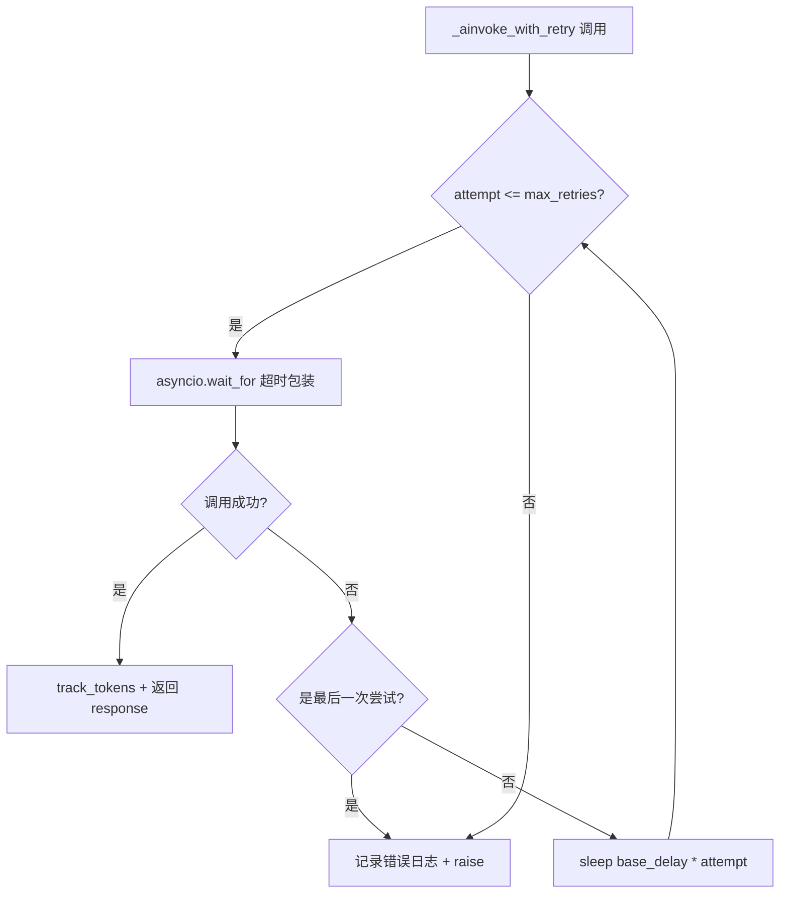
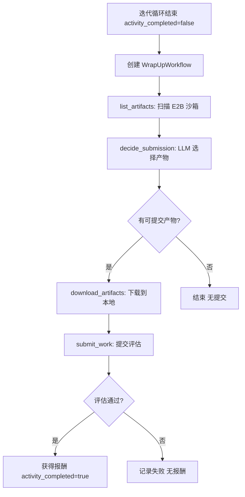

# PD-03.18 ClawWork — 指数退避重试与 WrapUp 兜底工作流

> 文档编号：PD-03.18
> 来源：ClawWork `livebench/agent/live_agent.py`, `livebench/agent/wrapup_workflow.py`
> GitHub：https://github.com/HKUDS/ClawWork.git
> 问题域：PD-03 容错与重试 Fault Tolerance & Retry
> 状态：可复用方案

---

## 第 1 章 问题与动机

### 1.1 核心问题

ClawWork 是一个 AI Agent 经济生存模拟平台（LiveBench），Agent 需要在有限预算下完成工作任务并获取报酬。在这个场景中，容错与重试面临三层挑战：

1. **API 调用层**：LLM API 调用可能因网络超时、速率限制、服务不可用而失败，每次失败都消耗时间和潜在的 token 成本
2. **任务迭代层**：Agent 在 15 轮迭代内可能无法完成任务（工具调用链过长、推理偏离），需要兜底机制避免"白干"
3. **全局任务层**：exhaust 模式下需要遍历所有任务，单个任务的 API 失败不应阻塞整个任务队列

这三层问题的核心矛盾是：**重试消耗预算（token 成本从余额扣除），但不重试则任务失败无收入**。Agent 必须在"花钱重试"和"放弃止损"之间找到平衡。

### 1.2 ClawWork 的解法概述

ClawWork 采用三层容错架构，每层有独立的重试策略和降级方案：

1. **API 调用层**：`_ainvoke_with_retry()` 实现线性退避重试（`base_delay * attempt`），配合 `asyncio.wait_for` 超时保护（`livebench/agent/live_agent.py:359-436`）
2. **任务迭代层**：迭代超限时触发 WrapUp 工作流（LangGraph 状态机），自动从 E2B 沙箱收集产物并兜底提交（`livebench/agent/live_agent.py:790-834`）
3. **全局任务层**：`run_exhaust_mode()` 维护 per-task 失败计数器，API 失败的任务重新入队，最多重试 10 次后放弃（`livebench/agent/live_agent.py:991-1143`）

### 1.3 设计思想

| 设计原则 | 具体实现 | 理由 | 替代方案 |
|----------|----------|------|----------|
| 经济感知重试 | 重试消耗余额，破产则停止 | Agent 有预算约束，无限重试会耗尽资金 | 固定重试次数不考虑成本 |
| 线性退避而非指数退避 | `base_delay * attempt`（0.5s, 1.0s, 1.5s） | 任务有时间压力，指数退避等待过长 | 指数退避 + 抖动 |
| 兜底提交优于完全放弃 | WrapUp 工作流收集半成品提交 | 部分完成的工作仍可能获得评分和报酬 | 直接放弃，0 收入 |
| API 错误与评估失败分离 | 仅 API_ERROR 触发重试，低分不重试 | 低分说明 Agent 能力不足，重试无意义 | 所有失败都重试 |
| 任务级隔离 | 单任务失败不影响队列中其他任务 | exhaust 模式需要最大化任务覆盖率 | 一个失败全部停止 |

---

## 第 2 章 源码实现分析

### 2.1 架构概览

ClawWork 的容错架构分为三层，从内到外依次是 API 重试、迭代兜底、全局调度：

```
┌─────────────────────────────────────────────────────────────┐
│                  run_exhaust_mode()                          │
│  ┌───────────────────────────────────────────────────────┐  │
│  │  per-task failure counter + re-queue (max 10 retries) │  │
│  │  ┌─────────────────────────────────────────────────┐  │  │
│  │  │           run_daily_session()                    │  │  │
│  │  │  ┌───────────────────────────────────────────┐  │  │  │
│  │  │  │  iteration loop (max 15 rounds)           │  │  │  │
│  │  │  │  ┌─────────────────────────────────────┐  │  │  │  │
│  │  │  │  │  _ainvoke_with_retry()              │  │  │  │  │
│  │  │  │  │  linear backoff + asyncio timeout   │  │  │  │  │
│  │  │  │  └─────────────────────────────────────┘  │  │  │  │
│  │  │  └───────────────────────────────────────────┘  │  │  │
│  │  │  ┌───────────────────────────────────────────┐  │  │  │
│  │  │  │  WrapUp Workflow (LangGraph)              │  │  │  │
│  │  │  │  list → decide → download → submit        │  │  │  │
│  │  │  └───────────────────────────────────────────┘  │  │  │
│  │  └─────────────────────────────────────────────────┘  │  │
│  └───────────────────────────────────────────────────────┘  │
└─────────────────────────────────────────────────────────────┘
```

### 2.2 核心实现

#### 2.2.1 API 调用层：线性退避重试



对应源码 `livebench/agent/live_agent.py:359-436`：

```python
async def _ainvoke_with_retry(self, messages: List[Dict[str, str]], timeout: float = 120.0) -> Any:
    for attempt in range(1, self.max_retries + 1):
        try:
            lc_messages = []
            for msg in messages:
                role = msg.get("role", "user")
                content = msg.get("content", "")
                if role == "system":
                    lc_messages.append(SystemMessage(content=content))
                elif role == "assistant" or role == "ai":
                    lc_messages.append(AIMessage(content=content))
                else:
                    lc_messages.append(HumanMessage(content=content))

            # 超时保护：asyncio.wait_for 包装异步调用
            try:
                response = await asyncio.wait_for(
                    self.agent.ainvoke(lc_messages),
                    timeout=timeout
                )
            except asyncio.TimeoutError:
                raise TimeoutError(f"API call timed out after {timeout} seconds")

            self._track_tokens_from_response(response)
            return response

        except Exception as e:
            error_type = type(e).__name__
            is_timeout = isinstance(e, (asyncio.TimeoutError, TimeoutError))
            self.logger.warning(
                f"Agent invocation attempt {attempt}/{self.max_retries} failed",
                context={"attempt": attempt, "max_retries": self.max_retries,
                         "error_type": error_type, "is_timeout": is_timeout},
                print_console=True
            )
            if attempt == self.max_retries:
                self.logger.error(f"Agent invocation failed after {self.max_retries} attempts",
                                  exception=e, print_console=True)
                raise e
            # 线性退避：base_delay * attempt
            retry_delay = self.base_delay * attempt
            await asyncio.sleep(retry_delay)
```

关键设计点：
- **线性退避**（`base_delay * attempt`）而非指数退避，默认 `base_delay=0.5s`，产生 0.5s → 1.0s → 1.5s 的等待序列（`live_agent.py:433`）
- **双层超时**：外层 `asyncio.wait_for` 限制单次调用时间，内层 ChatOpenAI 自带 `max_retries=3`（`live_agent.py:234`）
- **错误类型感知**：区分 timeout 和其他错误，日志中标记 `is_timeout` 便于事后分析（`live_agent.py:411`）

#### 2.2.2 任务迭代层：WrapUp 兜底工作流



对应源码 `livebench/agent/wrapup_workflow.py:41-93`：

```python
class WrapUpWorkflow:
    def __init__(self, llm=None, logger=None, economic_tracker=None, is_openrouter=False):
        self.llm = llm or ChatOpenAI(model="gpt-4o-mini", temperature=0.3)
        self.logger = logger
        self.economic_tracker = economic_tracker
        self.is_openrouter = is_openrouter
        self.graph = self._build_graph()

    def _build_graph(self) -> StateGraph:
        workflow = StateGraph(WrapUpState)
        workflow.add_node("list_artifacts", self._list_artifacts_node)
        workflow.add_node("decide_submission", self._decide_submission_node)
        workflow.add_node("download_artifacts", self._download_artifacts_node)
        workflow.add_node("submit_work", self._submit_work_node)

        workflow.set_entry_point("list_artifacts")
        workflow.add_edge("list_artifacts", "decide_submission")
        workflow.add_conditional_edges(
            "decide_submission", self._should_download,
            {"download": "download_artifacts", "end": END}
        )
        workflow.add_edge("download_artifacts", "submit_work")
        workflow.add_edge("submit_work", END)
        return workflow.compile()
```

WrapUp 工作流的触发点在 `live_agent.py:790-834`：

```python
# WRAP-UP WORKFLOW: If activity not completed, try to collect and submit artifacts
if not activity_completed and self.current_task:
    self.logger.terminal_print("🔄 Initiating wrap-up workflow to collect artifacts...")
    try:
        from livebench.agent.wrapup_workflow import create_wrapup_workflow
        sandbox_dir = os.path.join(self.data_path, "sandbox", date)
        wrapup = create_wrapup_workflow(
            llm=self.model, logger=self.logger,
            economic_tracker=self.economic_tracker, is_openrouter=self.is_openrouter
        )
        wrapup_result = await wrapup.run(
            date=date, task=self.current_task,
            sandbox_dir=sandbox_dir, conversation_history=messages
        )
        submission = wrapup_result.get("submission_result")
        if submission and isinstance(submission, dict) and submission.get("success"):
            payment = submission.get("payment", 0)
            if payment > 0:
                self.daily_work_income += payment
                activity_completed = True
    except Exception as e:
        self.logger.error(f"Wrap-up workflow failed: {str(e)}", ...)
```

### 2.3 实现细节

#### Exhaust 模式的任务级重试

`run_exhaust_mode()` 在 `live_agent.py:991-1143` 实现了全局任务调度的容错：

- **per-task 失败计数器**：`task_failures: Dict[str, int]` 记录每个任务的 API 失败次数
- **重新入队**：API 失败的任务 `pending_queue.append(task_id)` 放回队尾
- **最大重试上限**：`max_task_failures=10`，超过后任务被标记为 abandoned
- **恢复支持**：从 `task_completions.jsonl` 读取已完成任务，跳过已处理的任务和日期
- **API 错误与评估失败分离**：仅 `result == "API_ERROR"` 触发重试，评估低分视为"已完成"

```python
# live_agent.py:1111-1124
if result == "API_ERROR":
    failures = task_failures.get(task_id, 0) + 1
    task_failures[task_id] = failures
    if failures < max_task_failures:
        pending_queue.append(task_id)  # Re-queue for later retry
    else:
        task_abandoned.add(task_id)
else:
    task_conducted.add(task_id)  # Conducted regardless of evaluation outcome
```

#### E2B 沙箱健康检查与自动重建

`code_execution_sandbox.py:52-83` 中 `SessionSandbox.get_or_create_sandbox()` 实现了沙箱级容错：

- 每次使用前执行健康检查（`sandbox.files.list("/")`）
- 沙箱死亡时自动 kill + 重建
- 上传文件去重（`uploaded_reference_files` 缓存）

#### 经济感知的错误传播

`run_daily_session()` 在 API 失败时的处理（`live_agent.py:662-690`）：
- 标记 `session_api_error = True`
- 调用 `economic_tracker.end_task()` 结束成本追踪
- 返回 `"API_ERROR"` 给上层调度器
- `save_daily_state()` 记录 `api_error=True`，区分正常完成和异常中断

---

## 第 3 章 迁移指南

### 3.1 迁移清单

**阶段 1：API 调用层重试（1 个文件）**
- [ ] 实现 `_ainvoke_with_retry()` 方法，支持可配置的 `max_retries` 和 `base_delay`
- [ ] 用 `asyncio.wait_for` 包装异步 LLM 调用，设置超时
- [ ] 在每次失败时记录结构化日志（attempt 编号、错误类型、是否超时）
- [ ] 选择退避策略：线性（时间敏感场景）或指数（API 限流场景）

**阶段 2：任务迭代层兜底（2 个文件）**
- [ ] 定义 WrapUp 状态类型（TypedDict 或 Pydantic）
- [ ] 实现 4 节点 LangGraph 工作流：list → decide → download → submit
- [ ] 在主循环迭代超限时触发 WrapUp
- [ ] WrapUp 的 LLM 调用也需要 token 追踪（共享 economic_tracker）

**阶段 3：全局任务调度容错（1 个文件）**
- [ ] 实现 per-task 失败计数器和重新入队逻辑
- [ ] 区分 API 错误（可重试）和评估失败（不重试）
- [ ] 支持从 JSONL 文件恢复已完成任务（断点续跑）
- [ ] 设置全局最大重试次数上限

### 3.2 适配代码模板

#### 通用异步重试装饰器（可直接复用）

```python
import asyncio
from typing import TypeVar, Callable, Any

T = TypeVar('T')

async def invoke_with_retry(
    coro_factory: Callable[..., Any],
    *args,
    max_retries: int = 3,
    base_delay: float = 0.5,
    timeout: float = 120.0,
    backoff: str = "linear",  # "linear" or "exponential"
    on_retry: Callable[[int, Exception], None] | None = None,
    **kwargs
) -> Any:
    """
    通用异步重试包装器，支持线性/指数退避和超时保护。
    
    Args:
        coro_factory: 返回 awaitable 的工厂函数
        max_retries: 最大重试次数
        base_delay: 基础延迟（秒）
        timeout: 单次调用超时（秒）
        backoff: 退避策略 "linear" 或 "exponential"
        on_retry: 重试回调，接收 (attempt, exception)
    """
    for attempt in range(1, max_retries + 1):
        try:
            return await asyncio.wait_for(
                coro_factory(*args, **kwargs),
                timeout=timeout
            )
        except Exception as e:
            if on_retry:
                on_retry(attempt, e)
            if attempt == max_retries:
                raise
            if backoff == "linear":
                delay = base_delay * attempt
            else:  # exponential
                delay = base_delay * (2 ** (attempt - 1))
            await asyncio.sleep(delay)
```

#### 任务级重试调度器（exhaust 模式模板）

```python
from typing import Dict, List, Set
from dataclasses import dataclass, field

@dataclass
class ExhaustScheduler:
    """任务级重试调度器，支持 per-task 失败计数和断点恢复"""
    max_task_failures: int = 10
    task_failures: Dict[str, int] = field(default_factory=dict)
    task_conducted: Set[str] = field(default_factory=set)
    task_abandoned: Set[str] = field(default_factory=set)
    
    def should_retry(self, task_id: str, error_type: str) -> bool:
        """判断任务是否应该重试（仅 API 错误重试，评估失败不重试）"""
        if error_type != "API_ERROR":
            self.task_conducted.add(task_id)
            return False
        failures = self.task_failures.get(task_id, 0) + 1
        self.task_failures[task_id] = failures
        if failures >= self.max_task_failures:
            self.task_abandoned.add(task_id)
            return False
        return True
    
    def mark_conducted(self, task_id: str):
        self.task_conducted.add(task_id)
    
    def get_stats(self) -> Dict:
        return {
            "conducted": len(self.task_conducted),
            "abandoned": len(self.task_abandoned),
            "pending_retries": sum(
                1 for tid, count in self.task_failures.items()
                if tid not in self.task_conducted and tid not in self.task_abandoned
            )
        }
```

### 3.3 适用场景

| 场景 | 适用度 | 说明 |
|------|--------|------|
| 有预算约束的 Agent 系统 | ⭐⭐⭐ | 经济感知重试是核心差异化，适合 token 成本敏感场景 |
| 批量任务处理（exhaust 模式） | ⭐⭐⭐ | per-task 失败计数 + 重新入队非常适合大规模任务遍历 |
| 沙箱环境中的 Agent | ⭐⭐⭐ | WrapUp 工作流从沙箱收集产物的模式可直接复用 |
| 实时交互式 Agent | ⭐⭐ | 线性退避等待时间短，但 WrapUp 兜底不适合实时场景 |
| 无成本约束的 Agent | ⭐ | 经济感知重试的优势不明显，标准指数退避即可 |

---

## 第 4 章 测试用例

```python
import pytest
import asyncio
from unittest.mock import AsyncMock, MagicMock, patch
from typing import Dict, Any


class TestAinvokeWithRetry:
    """测试 _ainvoke_with_retry 的重试和超时行为"""

    @pytest.fixture
    def agent(self):
        """创建模拟 LiveAgent"""
        agent = MagicMock()
        agent.max_retries = 3
        agent.base_delay = 0.1  # 快速测试
        agent.api_timeout = 1.0
        agent.logger = MagicMock()
        agent.logger.warning = MagicMock()
        agent.logger.error = MagicMock()
        agent.logger.terminal_print = MagicMock()
        agent._track_tokens_from_response = MagicMock()
        return agent

    @pytest.mark.asyncio
    async def test_success_on_first_attempt(self, agent):
        """正常路径：首次调用成功"""
        mock_response = MagicMock()
        mock_response.content = "test response"
        agent.agent = MagicMock()
        agent.agent.ainvoke = AsyncMock(return_value=mock_response)

        from agent.live_agent import LiveAgent
        result = await LiveAgent._ainvoke_with_retry(
            agent, [{"role": "user", "content": "test"}]
        )
        assert result == mock_response
        assert agent.agent.ainvoke.call_count == 1

    @pytest.mark.asyncio
    async def test_retry_on_failure_then_success(self, agent):
        """重试路径：前两次失败，第三次成功"""
        mock_response = MagicMock()
        agent.agent = MagicMock()
        agent.agent.ainvoke = AsyncMock(
            side_effect=[Exception("API error"), Exception("timeout"), mock_response]
        )

        result = await LiveAgent._ainvoke_with_retry(
            agent, [{"role": "user", "content": "test"}]
        )
        assert result == mock_response
        assert agent.agent.ainvoke.call_count == 3

    @pytest.mark.asyncio
    async def test_all_retries_exhausted(self, agent):
        """降级路径：所有重试耗尽后抛出异常"""
        agent.agent = MagicMock()
        agent.agent.ainvoke = AsyncMock(side_effect=Exception("persistent failure"))

        with pytest.raises(Exception, match="persistent failure"):
            await LiveAgent._ainvoke_with_retry(
                agent, [{"role": "user", "content": "test"}]
            )
        assert agent.agent.ainvoke.call_count == 3

    @pytest.mark.asyncio
    async def test_timeout_triggers_retry(self, agent):
        """超时路径：asyncio.TimeoutError 触发重试"""
        mock_response = MagicMock()
        agent.agent = MagicMock()

        async def slow_then_fast(*args, **kwargs):
            if agent.agent.ainvoke.call_count <= 1:
                await asyncio.sleep(10)  # 超时
            return mock_response

        agent.agent.ainvoke = AsyncMock(side_effect=slow_then_fast)
        agent.api_timeout = 0.1

        # 第一次超时，第二次成功
        result = await LiveAgent._ainvoke_with_retry(
            agent, [{"role": "user", "content": "test"}], timeout=0.1
        )


class TestExhaustModeRetry:
    """测试 exhaust 模式的任务级重试逻辑"""

    def test_api_error_triggers_requeue(self):
        """API 错误应触发重新入队"""
        task_failures: Dict[str, int] = {}
        task_id = "task_001"
        max_task_failures = 10

        # 模拟 API 错误
        failures = task_failures.get(task_id, 0) + 1
        task_failures[task_id] = failures
        assert failures < max_task_failures  # 应该重新入队

    def test_max_failures_triggers_abandon(self):
        """达到最大失败次数应放弃任务"""
        task_failures = {"task_001": 9}
        task_id = "task_001"
        max_task_failures = 10

        failures = task_failures.get(task_id, 0) + 1
        task_failures[task_id] = failures
        assert failures >= max_task_failures  # 应该放弃

    def test_evaluation_failure_not_retried(self):
        """评估失败（非 API 错误）不应触发重试"""
        result = None  # run_daily_session 正常返回
        assert result != "API_ERROR"  # 不是 API 错误，标记为 conducted
```

---

## 第 5 章 跨域关联

| 关联域 | 关系类型 | 说明 |
|--------|----------|------|
| PD-01 上下文管理 | 协同 | WrapUp 工作流的 `_summarize_conversation()` 截取最近 10 条消息作为上下文，避免 token 超限 |
| PD-02 多 Agent 编排 | 依赖 | exhaust 模式的任务调度依赖 TaskManager 的 `force_assign_task()` 实现任务分配 |
| PD-04 工具系统 | 协同 | `_execute_tool()` 的错误处理返回错误字符串而非抛异常，工具失败不中断迭代循环 |
| PD-05 沙箱隔离 | 依赖 | WrapUp 工作流依赖 E2B SessionSandbox 的健康检查和产物下载能力 |
| PD-06 记忆持久化 | 协同 | `task_completions.jsonl` 既是经济追踪记录，也是 exhaust 模式断点恢复的数据源 |
| PD-07 质量检查 | 协同 | WrapUp 提交的产物仍需通过 LLM 评估（WorkEvaluator），低于 0.6 分不获得报酬 |
| PD-11 可观测性 | 依赖 | 每次重试都通过 LiveBenchLogger 记录结构化日志，`api_error` 标记写入 balance.jsonl |

---

## 第 6 章 来源文件索引

| 文件 | 行范围 | 关键实现 |
|------|--------|----------|
| `livebench/agent/live_agent.py` | L50-L116 | LiveAgent 构造函数：max_retries、base_delay、api_timeout 参数定义 |
| `livebench/agent/live_agent.py` | L359-L436 | `_ainvoke_with_retry()`：线性退避重试 + asyncio 超时保护 |
| `livebench/agent/live_agent.py` | L504-L893 | `run_daily_session()`：迭代循环 + API 错误处理 + WrapUp 触发 |
| `livebench/agent/live_agent.py` | L662-L690 | API 失败后的 session_api_error 标记和 break 逻辑 |
| `livebench/agent/live_agent.py` | L790-L834 | WrapUp 工作流触发和结果处理 |
| `livebench/agent/live_agent.py` | L991-L1143 | `run_exhaust_mode()`：per-task 失败计数 + 重新入队 + 恢复支持 |
| `livebench/agent/wrapup_workflow.py` | L26-L38 | WrapUpState TypedDict 定义 |
| `livebench/agent/wrapup_workflow.py` | L41-L93 | WrapUpWorkflow 类：LangGraph 4 节点工作流构建 |
| `livebench/agent/wrapup_workflow.py` | L101-L179 | `_list_artifacts_node()`：E2B 沙箱多目录扫描 |
| `livebench/agent/wrapup_workflow.py` | L181-L272 | `_decide_submission_node()`：LLM 决策 + JSON 解析容错 |
| `livebench/agent/economic_tracker.py` | L117-L156 | `start_task()` / `end_task()`：任务级成本追踪生命周期 |
| `livebench/agent/economic_tracker.py` | L438-L464 | `save_daily_state()`：api_error 标记持久化 |
| `livebench/agent/economic_tracker.py` | L678-L732 | `record_task_completion()`：去重写入 + attempt 记录 |
| `livebench/main.py` | L33-L46 | `run_agent()`：顶层 try-except 捕获 Agent 运行异常 |
| `livebench/main.py` | L172-L174 | 配置注入 max_retries 和 base_delay 到 LiveAgent |
| `livebench/configs/default_config.json` | L25-L27 | 默认配置：max_retries=3, base_delay=0.5 |
| `livebench/tools/productivity/code_execution_sandbox.py` | L52-L83 | SessionSandbox 健康检查与自动重建 |

---

## 第 7 章 横向对比维度

> **重要：** 本章用于自动填充 Butcher Wiki 的横向对比表。

```json comparison_data
{
  "project": "ClawWork",
  "dimensions": {
    "重试策略": "线性退避 base_delay×attempt，默认 0.5s/1.0s/1.5s，配合 asyncio.wait_for 超时",
    "降级方案": "WrapUp LangGraph 工作流：扫描沙箱产物→LLM 选择→下载→兜底提交",
    "错误分类": "API_ERROR 可重试 vs 评估失败不重试，经济感知（破产停止）",
    "恢复机制": "task_completions.jsonl 断点恢复，exhaust 模式跳过已完成任务",
    "超时保护": "双层超时：asyncio.wait_for 120s + ChatOpenAI 内置 max_retries=3",
    "输出验证": "WrapUp 的 LLM 决策节点解析 JSON 数组，解析失败时降级为提交全部产物",
    "资源管理模式": "E2B 沙箱健康检查 + 每任务结束后 cleanup，防止沙箱泄漏",
    "并发容错": "exhaust 模式 per-task 失败计数器，最多 10 次 API 重试后 abandon"
  }
}
```

### 域元数据补充

```json domain_metadata
{
  "solution_summary": "ClawWork 用三层容错架构（线性退避API重试 + LangGraph WrapUp兜底工作流 + exhaust模式per-task失败计数器）实现经济感知的Agent任务容错",
  "description": "预算约束下的重试成本权衡：重试消耗token预算，需在重试收益和成本之间动态平衡",
  "sub_problems": [
    "迭代超限后半成品产物的自动收集与兜底提交：Agent未完成任务但沙箱中已有部分产物",
    "API错误与评估失败的区分处理：前者值得重试，后者重试无意义",
    "经济感知重试：重试消耗token预算，破产后必须停止重试"
  ],
  "best_practices": [
    "兜底提交优于完全放弃：半成品仍可能获得部分评分和报酬",
    "区分可重试错误和不可重试错误：API失败重试，评估低分不重试",
    "断点恢复用JSONL追加写：task_completions.jsonl支持exhaust模式跨进程恢复"
  ]
}
```
