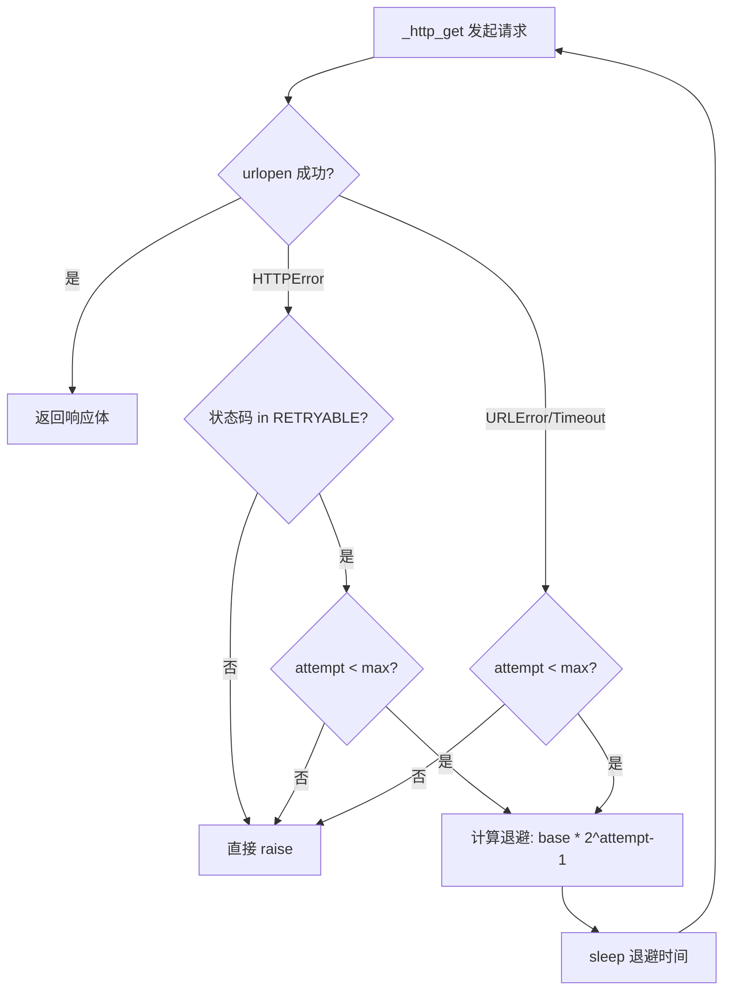
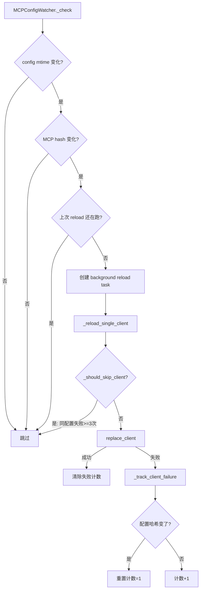

# PD-03.CoPaw CoPaw — 三层容错与配置感知重试

> 文档编号：PD-03.CoPaw
> 来源：CoPaw `src/copaw/agents/skills_hub.py` `src/copaw/app/mcp/watcher.py` `src/copaw/app/mcp/manager.py`
> GitHub：https://github.com/agentscope-ai/CoPaw.git
> 问题域：PD-03 容错与重试 Fault Tolerance & Retry
> 状态：可复用方案

---

## 第 1 章 问题与动机

### 1.1 核心问题

CoPaw 是一个基于 AgentScope 的多渠道 AI 助手平台，需要同时管理 HTTP 外部服务调用（Skills Hub）、MCP 子进程客户端连接、定时任务执行、多渠道消息投递等多个故障域。每个域的失败模式不同：

- **Skills Hub HTTP 调用**：面对 408/429/500/502/503/504 等瞬态错误，需要指数退避重试；GitHub API 有速率限制，403 需要特殊处理
- **MCP 客户端连接**：子进程启动可能超时或失败，配置热更新时需要在不中断服务的前提下替换客户端
- **定时任务执行**：Cron 任务和心跳任务需要超时保护，失败不能阻塞调度器
- **Agent 查询处理**：LLM 调用可能抛出任意异常，需要保存错误现场（debug dump）并确保会话状态持久化

核心挑战在于：这些容错机制分布在不同层级，需要各自独立又协调一致。

### 1.2 CoPaw 的解法概述

1. **HTTP 层指数退避重试**：`skills_hub.py:84-88` 实现 `_compute_backoff_seconds`，基于 `base * 2^(attempt-1)` 计算退避时间，受 `backoff_cap` 上限约束，所有参数通过环境变量可配置
2. **MCP 客户端失败追踪**：`watcher.py:64-67` 维护 `_client_failures` 字典，记录每个客户端的 `(retry_count, last_config_hash)` 元组，相同配置连续失败超过 `max_retries` 后停止重试，配置变更自动重置计数
3. **MCP 连接超时保护**：`manager.py:100-102` 使用 `asyncio.wait_for(client.connect(), timeout=60.0)` 防止子进程连接无限阻塞
4. **有序关闭协议**：`_app.py:119-138` 按 watchers → cron → channels → mcp → runner 顺序关闭，每层独立 try-except 防止级联失败
5. **错误现场保存**：`query_error_dump.py:48-102` 将异常、traceback、agent 状态序列化到临时 JSON 文件，附加到异常消息中便于事后分析

### 1.3 设计思想

| 设计原则 | 具体实现 | 理由 | 替代方案 |
|----------|----------|------|----------|
| 环境变量驱动重试参数 | `COPAW_SKILLS_HUB_HTTP_RETRIES/BACKOFF_BASE/BACKOFF_CAP` | 不同部署环境网络条件不同，硬编码不灵活 | 配置文件、Pydantic Settings |
| 配置哈希感知重试 | `_client_failures` 按 `(count, config_hash)` 追踪 | 相同配置反复失败无意义，配置变更应重置计数 | 纯计数器（无法区分配置是否变更） |
| 非阻塞热更新 | `replace_client` 先连接新客户端再加锁替换 | 连接耗时不应持有锁，避免阻塞 `get_clients` | 加锁后连接（阻塞所有查询） |
| 有序关闭 | 按依赖反序关闭，每层独立 try-except | 上游关闭失败不应阻止下游清理 | 统一 try-except（一个失败全部跳过） |
| 错误现场持久化 | 异常时写 JSON dump 到 tmpdir | 生产环境日志可能被截断，完整现场便于复现 | 仅日志记录 |

---

## 第 2 章 源码实现分析

### 2.1 架构概览

CoPaw 的容错体系分为三层：HTTP 客户端层、MCP 进程管理层、应用生命周期层。

```
┌─────────────────────────────────────────────────────────┐
│                    Application Layer                     │
│  _app.py: 有序启动/关闭 + 独立 try-except 隔离          │
│  runner.py: CancelledError 处理 + error dump            │
├─────────────────────────────────────────────────────────┤
│                  MCP Process Layer                       │
│  manager.py: asyncio.wait_for 超时 + lock-free connect  │
│  watcher.py: config-hash 感知重试 + 非阻塞 reload       │
├─────────────────────────────────────────────────────────┤
│                  HTTP Client Layer                       │
│  skills_hub.py: 指数退避 + 状态码分类 + 环境变量配置     │
└─────────────────────────────────────────────────────────┘
```

### 2.2 核心实现

#### 2.2.1 HTTP 指数退避重试



对应源码 `src/copaw/agents/skills_hub.py:40-219`：

```python
RETRYABLE_HTTP_STATUS = {408, 409, 425, 429, 500, 502, 503, 504}

def _compute_backoff_seconds(attempt: int) -> float:
    base = _hub_http_backoff_base()   # 环境变量, 默认 0.8
    cap = _hub_http_backoff_cap()     # 环境变量, 默认 6.0
    return min(cap, base * (2 ** max(0, attempt - 1)))

def _http_get(url, params=None, accept="application/json"):
    retries = _hub_http_retries()     # 环境变量, 默认 3
    timeout = _hub_http_timeout()     # 环境变量, 默认 15s
    attempts = retries + 1
    last_error = None
    for attempt in range(1, attempts + 1):
        try:
            with urlopen(req, timeout=timeout) as resp:
                return resp.read().decode("utf-8")
        except HTTPError as e:
            status = getattr(e, "code", 0) or 0
            # GitHub 403 速率限制特殊处理：直接抛出提示设置 token
            if status == 403 and "api.github.com" in host:
                if "rate limit" in body.lower():
                    raise RuntimeError("GitHub API rate limit exceeded...")
            if attempt < attempts and status in RETRYABLE_HTTP_STATUS:
                delay = _compute_backoff_seconds(attempt)
                logger.warning("Hub HTTP %s (attempt %d/%d), retrying in %.2fs",
                               status, attempt, attempts, delay)
                time.sleep(delay)
                continue
            raise
        except (URLError, TimeoutError) as e:
            if attempt < attempts:
                delay = _compute_backoff_seconds(attempt)
                time.sleep(delay)
                continue
            raise
```

关键设计点：
- `RETRYABLE_HTTP_STATUS` 集合（`skills_hub.py:40-49`）明确列出可重试状态码，包含 409（Conflict）和 425（Too Early）这两个不常见但合理的瞬态错误
- GitHub 403 速率限制不走重试路径，而是直接抛出带操作指引的 `RuntimeError`（`skills_hub.py:158-172`）
- 退避公式 `min(cap, base * 2^(attempt-1))` 确保首次重试等待 0.8s，第二次 1.6s，第三次被 cap 限制在 6s

#### 2.2.2 MCP 客户端配置感知重试



对应源码 `src/copaw/app/mcp/watcher.py:262-318`：

```python
class MCPConfigWatcher:
    # _client_failures: {client_key: (retry_count, last_config_hash)}
    _max_retries: int = 3

    def _should_skip_client(self, key: str, client_hash: int) -> bool:
        if key in self._client_failures:
            retry_count, last_hash = self._client_failures[key]
            if last_hash == client_hash and retry_count >= self._max_retries:
                logger.debug(f"skipping client '{key}', failed {retry_count} times")
                return True
        return False

    def _track_client_failure(self, key: str, client_hash: int) -> None:
        if key in self._client_failures:
            old_count, old_hash = self._client_failures[key]
            new_count = old_count + 1 if old_hash == client_hash else 1
        else:
            new_count = 1
        self._client_failures[key] = (new_count, client_hash)
```

这个设计的精妙之处在于 `_track_client_failure`（`watcher.py:297-305`）：当配置哈希变化时（`old_hash != client_hash`），计数器重置为 1 而非累加。这意味着用户修改配置后，系统自动获得新的重试机会，无需手动干预。

#### 2.2.3 MCP 连接超时与无锁连接

对应源码 `src/copaw/app/mcp/manager.py:75-134`：

```python
async def replace_client(self, key, client_config, timeout=60.0):
    # 1. 锁外连接新客户端（可能耗时）
    new_client = StdIOStatefulClient(
        name=client_config.name,
        command=client_config.command,
        args=client_config.args, env=client_config.env,
    )
    try:
        await asyncio.wait_for(new_client.connect(), timeout=timeout)
    except asyncio.TimeoutError:
        logger.warning(f"Timeout connecting MCP client '{key}' after {timeout}s")
        try: await new_client.close()
        except Exception: pass
        raise
    except Exception as e:
        try: await new_client.close()
        except Exception: pass
        raise

    # 2. 锁内原子替换
    async with self._lock:
        old_client = self._clients.get(key)
        self._clients[key] = new_client
        if old_client is not None:
            try: await old_client.close()
            except Exception as e:
                logger.warning(f"Error closing old MCP client '{key}': {e}")
```

### 2.3 实现细节

#### 应用生命周期有序关闭

`_app.py:116-138` 的关闭顺序体现了依赖反序原则：

```python
# stop order: watchers -> cron -> channels -> mcp -> runner
try:
    await config_watcher.stop()
except Exception: pass
if mcp_watcher:
    try: await mcp_watcher.stop()
    except Exception: pass
try:
    await cron_manager.stop()
finally:
    await channel_manager.stop_all()
    if mcp_manager:
        try: await mcp_manager.close_all()
        except Exception: pass
    await runner.stop()
```

每层独立 try-except 确保：即使 config_watcher 关闭失败，cron_manager 仍会被关闭。`finally` 块保证 channel_manager 和 runner 一定会被清理。

#### Agent 查询错误现场保存

`runner.py:146-170` 和 `query_error_dump.py:48-102` 协作实现错误现场持久化：

```python
# runner.py
except asyncio.CancelledError:
    if agent is not None:
        await agent.interrupt()  # 优雅中断 agent
    raise
except Exception as e:
    debug_dump_path = write_query_error_dump(
        request=request, exc=e, locals_=locals()
    )
    # 将 dump 路径附加到异常消息
    e.args = ((f"{e.args[0]}\n(Details: {debug_dump_path})"),) + e.args[1:]
    raise
finally:
    # 无论成功失败，都保存会话状态
    await self.session.save_session_state(session_id, user_id, agent)
```

`write_query_error_dump` 将 traceback、异常类型、request 信息、agent 状态全部序列化到 `/tmp/copaw_query_error_*.json`，即使日志被截断也能完整复现。

#### 定时任务超时保护

`executor.py:75` 和 `heartbeat.py:129-141` 都使用 `asyncio.wait_for` 设置硬超时：

```python
# executor.py - Cron 任务超时
await asyncio.wait_for(_run(), timeout=job.runtime.timeout_seconds)

# heartbeat.py - 心跳超时 120s
await asyncio.wait_for(_run_and_dispatch(), timeout=120)
```

Cron 任务的超时时间通过 `JobRuntimeSpec.timeout_seconds`（`models.py:62`，默认 120s）可配置，心跳固定 120s。


---

## 第 3 章 迁移指南

### 3.1 迁移清单

**阶段 1：HTTP 指数退避重试（1 个文件）**
- [ ] 定义可重试状态码集合
- [ ] 实现 `_compute_backoff_seconds(attempt)` 退避函数
- [ ] 用环境变量暴露 retries/backoff_base/backoff_cap/timeout
- [ ] 在 HTTP 请求循环中集成重试逻辑
- [ ] 对特殊错误（如 GitHub 403 rate limit）添加快速失败路径

**阶段 2：配置感知重试追踪（2 个文件）**
- [ ] 实现 `_client_failures: Dict[str, tuple[int, int]]` 失败追踪
- [ ] 实现 `_should_skip_client(key, config_hash)` 跳过判断
- [ ] 实现 `_track_client_failure(key, config_hash)` 计数更新（配置变更重置）
- [ ] 在 watcher 的 reload 流程中集成追踪逻辑

**阶段 3：应用生命周期容错（1 个文件）**
- [ ] 按依赖反序设计关闭顺序
- [ ] 每个组件关闭用独立 try-except 包裹
- [ ] 关键组件用 finally 保证清理

### 3.2 适配代码模板

#### 可复用的环境变量驱动指数退避重试器

```python
"""Reusable exponential backoff HTTP retry — adapted from CoPaw skills_hub.py"""
import os
import time
import logging
from urllib.request import Request, urlopen
from urllib.error import HTTPError, URLError

logger = logging.getLogger(__name__)

RETRYABLE_STATUS = {408, 429, 500, 502, 503, 504}

def _env_float(key: str, default: float, minimum: float) -> float:
    try:
        return max(minimum, float(os.environ.get(key, str(default))))
    except Exception:
        return default

def _env_int(key: str, default: int, minimum: int) -> int:
    try:
        return max(minimum, int(os.environ.get(key, str(default))))
    except Exception:
        return default

def compute_backoff(attempt: int, base: float = 0.8, cap: float = 6.0) -> float:
    """Exponential backoff: base * 2^(attempt-1), capped at cap."""
    return min(cap, base * (2 ** max(0, attempt - 1)))

def http_get_with_retry(
    url: str,
    timeout: float | None = None,
    retries: int | None = None,
    backoff_base: float | None = None,
    backoff_cap: float | None = None,
) -> str:
    timeout = timeout or _env_float("HTTP_TIMEOUT", 15.0, 3.0)
    retries = retries or _env_int("HTTP_RETRIES", 3, 0)
    backoff_base = backoff_base or _env_float("HTTP_BACKOFF_BASE", 0.8, 0.1)
    backoff_cap = backoff_cap or _env_float("HTTP_BACKOFF_CAP", 6.0, 0.5)

    req = Request(url, headers={"User-Agent": "my-agent/1.0"})
    attempts = retries + 1
    last_error: Exception | None = None

    for attempt in range(1, attempts + 1):
        try:
            with urlopen(req, timeout=timeout) as resp:
                return resp.read().decode("utf-8")
        except HTTPError as e:
            last_error = e
            status = getattr(e, "code", 0) or 0
            if attempt < attempts and status in RETRYABLE_STATUS:
                delay = compute_backoff(attempt, backoff_base, backoff_cap)
                logger.warning("HTTP %s (attempt %d/%d), retry in %.2fs",
                               status, attempt, attempts, delay)
                time.sleep(delay)
                continue
            raise
        except (URLError, TimeoutError) as e:
            last_error = e
            if attempt < attempts:
                delay = compute_backoff(attempt, backoff_base, backoff_cap)
                logger.warning("Network error (attempt %d/%d), retry in %.2fs",
                               attempt, attempts, delay)
                time.sleep(delay)
                continue
            raise

    if last_error:
        raise last_error
    raise RuntimeError(f"Failed after {attempts} attempts: {url}")
```

#### 可复用的配置感知失败追踪器

```python
"""Config-hash-aware failure tracker — adapted from CoPaw MCPConfigWatcher"""
from typing import Dict, Tuple

class ConfigAwareFailureTracker:
    """Track failures per key with config-hash awareness.
    
    When config changes (hash differs), retry count resets to 1.
    When same config fails repeatedly, stop retrying after max_retries.
    """
    def __init__(self, max_retries: int = 3):
        self._failures: Dict[str, Tuple[int, int]] = {}
        self._max_retries = max_retries

    def should_skip(self, key: str, config_hash: int) -> bool:
        if key in self._failures:
            count, last_hash = self._failures[key]
            return last_hash == config_hash and count >= self._max_retries
        return False

    def track_failure(self, key: str, config_hash: int) -> int:
        if key in self._failures:
            old_count, old_hash = self._failures[key]
            new_count = old_count + 1 if old_hash == config_hash else 1
        else:
            new_count = 1
        self._failures[key] = (new_count, config_hash)
        return new_count

    def clear(self, key: str) -> None:
        self._failures.pop(key, None)

    def clear_all(self) -> None:
        self._failures.clear()
```

### 3.3 适用场景

| 场景 | 适用度 | 说明 |
|------|--------|------|
| HTTP API 客户端重试 | ⭐⭐⭐ | 环境变量驱动的指数退避，开箱即用 |
| 子进程/外部服务热更新 | ⭐⭐⭐ | 配置哈希感知重试 + 非阻塞替换模式 |
| 多组件应用关闭 | ⭐⭐⭐ | 有序关闭 + 独立 try-except 模式通用 |
| 高并发 LLM 调用重试 | ⭐⭐ | 缺少抖动（jitter），高并发场景可能重试风暴 |
| 分布式系统容错 | ⭐ | 单进程设计，无分布式锁/断路器 |

---

## 第 4 章 测试用例

```python
"""Tests for CoPaw fault tolerance patterns."""
import time
import pytest
from unittest.mock import patch, MagicMock

# --- Test exponential backoff computation ---

class TestComputeBackoff:
    def test_first_attempt_returns_base(self):
        """attempt=1 → base * 2^0 = base"""
        from copaw.agents.skills_hub import _compute_backoff_seconds
        with patch("copaw.agents.skills_hub._hub_http_backoff_base", return_value=0.8), \
             patch("copaw.agents.skills_hub._hub_http_backoff_cap", return_value=6.0):
            assert _compute_backoff_seconds(1) == 0.8

    def test_second_attempt_doubles(self):
        """attempt=2 → base * 2^1 = 1.6"""
        from copaw.agents.skills_hub import _compute_backoff_seconds
        with patch("copaw.agents.skills_hub._hub_http_backoff_base", return_value=0.8), \
             patch("copaw.agents.skills_hub._hub_http_backoff_cap", return_value=6.0):
            assert _compute_backoff_seconds(2) == 1.6

    def test_cap_limits_backoff(self):
        """attempt=10 → capped at 6.0"""
        from copaw.agents.skills_hub import _compute_backoff_seconds
        with patch("copaw.agents.skills_hub._hub_http_backoff_base", return_value=0.8), \
             patch("copaw.agents.skills_hub._hub_http_backoff_cap", return_value=6.0):
            assert _compute_backoff_seconds(10) == 6.0

    def test_zero_attempt_returns_base(self):
        """attempt=0 → max(0, 0-1) = 0 → base * 2^0 = base"""
        from copaw.agents.skills_hub import _compute_backoff_seconds
        with patch("copaw.agents.skills_hub._hub_http_backoff_base", return_value=0.8), \
             patch("copaw.agents.skills_hub._hub_http_backoff_cap", return_value=6.0):
            assert _compute_backoff_seconds(0) == 0.8


# --- Test config-aware failure tracking ---

class TestConfigAwareFailureTracker:
    """Tests based on MCPConfigWatcher._should_skip_client / _track_client_failure"""

    def setup_method(self):
        from copaw.app.mcp.watcher import MCPConfigWatcher
        self.watcher = MCPConfigWatcher.__new__(MCPConfigWatcher)
        self.watcher._client_failures = {}
        self.watcher._max_retries = 3

    def test_first_failure_not_skipped(self):
        assert not self.watcher._should_skip_client("client-a", 12345)

    def test_track_increments_count(self):
        self.watcher._track_client_failure("client-a", 12345)
        assert self.watcher._client_failures["client-a"] == (1, 12345)
        self.watcher._track_client_failure("client-a", 12345)
        assert self.watcher._client_failures["client-a"] == (2, 12345)

    def test_skip_after_max_retries_same_hash(self):
        for _ in range(3):
            self.watcher._track_client_failure("client-a", 12345)
        assert self.watcher._should_skip_client("client-a", 12345)

    def test_config_change_resets_count(self):
        for _ in range(3):
            self.watcher._track_client_failure("client-a", 12345)
        # 配置变更（新哈希）→ 计数重置为 1
        self.watcher._track_client_failure("client-a", 99999)
        assert self.watcher._client_failures["client-a"] == (1, 99999)
        assert not self.watcher._should_skip_client("client-a", 99999)

    def test_different_clients_independent(self):
        for _ in range(3):
            self.watcher._track_client_failure("client-a", 111)
        assert self.watcher._should_skip_client("client-a", 111)
        assert not self.watcher._should_skip_client("client-b", 222)


# --- Test retryable status codes ---

class TestRetryableStatus:
    def test_retryable_set_contains_expected(self):
        from copaw.agents.skills_hub import RETRYABLE_HTTP_STATUS
        for code in [408, 429, 500, 502, 503, 504]:
            assert code in RETRYABLE_HTTP_STATUS
        # 非瞬态错误不在集合中
        for code in [400, 401, 403, 404, 405]:
            assert code not in RETRYABLE_HTTP_STATUS

    def test_409_and_425_are_retryable(self):
        """CoPaw 特有：409 Conflict 和 425 Too Early 也可重试"""
        from copaw.agents.skills_hub import RETRYABLE_HTTP_STATUS
        assert 409 in RETRYABLE_HTTP_STATUS
        assert 425 in RETRYABLE_HTTP_STATUS
```


---

## 第 5 章 跨域关联

| 关联域 | 关系类型 | 说明 |
|--------|----------|------|
| PD-04 工具系统 | 依赖 | Skills Hub 的 HTTP 重试直接服务于工具安装流程，`install_skill_from_hub` 依赖 `_http_get` 的重试能力 |
| PD-06 记忆持久化 | 协同 | `MemoryManager.start()` 失败时 `runner.py:200-207` 捕获异常但不阻塞启动，体现可选组件降级；`compact_memory` 和 `summary_memory` 内部 LLM 调用失败返回空字符串而非抛异常 |
| PD-10 中间件管道 | 协同 | MCP ConfigWatcher 的轮询-检测-重载流程本身是一个简化的中间件管道，`_check → _reload_changed_clients_wrapper → _reload_single_client` 三级调用链 |
| PD-11 可观测性 | 依赖 | 每次重试都有 `logger.warning` 记录（attempt/total/delay），`query_error_dump` 将完整错误现场写入 JSON 文件 |
| PD-01 上下文管理 | 协同 | `TimestampedDashScopeChatFormatter._format` 在 token 超过 `memory_compact_threshold` 时跳过旧消息（`memory_manager.py:408-419`），这是上下文溢出的容错降级 |
| PD-09 Human-in-the-Loop | 协同 | `runner.py:146-149` 对 `CancelledError` 的特殊处理支持用户主动中断 agent 执行 |

---

## 第 6 章 来源文件索引

| 文件 | 行范围 | 关键实现 |
|------|--------|----------|
| `src/copaw/agents/skills_hub.py` | L40-49 | `RETRYABLE_HTTP_STATUS` 可重试状态码集合 |
| `src/copaw/agents/skills_hub.py` | L52-88 | 环境变量驱动的 timeout/retries/backoff 配置函数 |
| `src/copaw/agents/skills_hub.py` | L84-88 | `_compute_backoff_seconds` 指数退避计算 |
| `src/copaw/agents/skills_hub.py` | L127-219 | `_http_get` 完整重试循环（含 GitHub 403 特殊处理） |
| `src/copaw/app/mcp/watcher.py` | L64-67 | `_client_failures` 失败追踪字典定义 |
| `src/copaw/app/mcp/watcher.py` | L262-295 | `_reload_single_client` + `_should_skip_client` 配置感知跳过 |
| `src/copaw/app/mcp/watcher.py` | L297-318 | `_track_client_failure` 配置哈希感知计数 |
| `src/copaw/app/mcp/watcher.py` | L192-213 | `_reload_changed_clients_wrapper` 非阻塞 reload + 快照更新 |
| `src/copaw/app/mcp/manager.py` | L75-134 | `replace_client` 锁外连接 + 锁内替换 + 超时保护 |
| `src/copaw/app/mcp/manager.py` | L152-167 | `close_all` 快照后清空 + 逐个关闭 |
| `src/copaw/app/runner/runner.py` | L146-170 | `query_handler` 异常处理：CancelledError + error dump |
| `src/copaw/app/runner/query_error_dump.py` | L48-102 | `write_query_error_dump` 错误现场 JSON 序列化 |
| `src/copaw/app/_app.py` | L116-138 | 有序关闭协议：watchers → cron → channels → mcp → runner |
| `src/copaw/app/crons/executor.py` | L75 | Cron 任务 `asyncio.wait_for` 超时保护 |
| `src/copaw/app/crons/heartbeat.py` | L129-141 | 心跳任务 120s 超时保护 |
| `src/copaw/app/crons/manager.py` | L243-273 | `_execute_once` 状态追踪 + 异常记录 |
| `src/copaw/agents/memory/memory_manager.py` | L650-660 | `compact_memory` LLM 调用失败返回空字符串降级 |

---

## 第 7 章 横向对比维度

```json comparison_data
{
  "project": "CoPaw",
  "dimensions": {
    "重试策略": "环境变量驱动指数退避（base=0.8, cap=6s），无抖动",
    "错误分类": "RETRYABLE_HTTP_STATUS 集合（含 409/425），GitHub 403 快速失败",
    "超时保护": "asyncio.wait_for 统一超时：MCP 连接 60s，Cron 任务可配置，心跳 120s",
    "优雅降级": "MemoryManager 启动失败不阻塞，compact/summary 失败返回空字符串",
    "可配置重试参数": "4 个环境变量：RETRIES/TIMEOUT/BACKOFF_BASE/BACKOFF_CAP",
    "恢复机制": "配置哈希感知重试：相同配置失败 3 次停止，配置变更自动重置计数",
    "级联清理": "有序关闭：watchers→cron→channels→mcp→runner，每层独立 try-except",
    "监控告警": "每次重试 logger.warning + query_error_dump JSON 现场保存",
    "外部服务容错": "Skills Hub HTTP 重试 + GitHub 403 rate limit 特殊提示",
    "配置预验证": "Pydantic model_validator 校验 cron 5 字段 + task_type 字段一致性"
  }
}
```

### 域元数据补充

```json domain_metadata
{
  "solution_summary": "CoPaw 用环境变量驱动的指数退避 HTTP 重试 + 配置哈希感知的 MCP 客户端失败追踪 + 有序关闭协议实现三层容错",
  "description": "配置热更新场景下的重试计数管理：配置变更应重置失败计数",
  "sub_problems": [
    "配置热更新时相同配置反复失败需要停止重试，配置变更需要重置计数：用 (count, config_hash) 元组追踪",
    "子进程客户端连接耗时不应持有全局锁：锁外连接 + 锁内原子替换避免阻塞查询路径",
    "Agent 查询异常的完整现场保存：日志可能被截断，需要将 traceback+request+agent_state 写入临时 JSON 文件"
  ],
  "best_practices": [
    "用环境变量暴露重试参数（retries/backoff_base/backoff_cap/timeout），不同部署环境灵活调整",
    "配置感知重试追踪：用 (count, config_hash) 元组，配置变更自动重置计数",
    "有序关闭按依赖反序执行，每层独立 try-except 防止级联失败"
  ]
}
```
