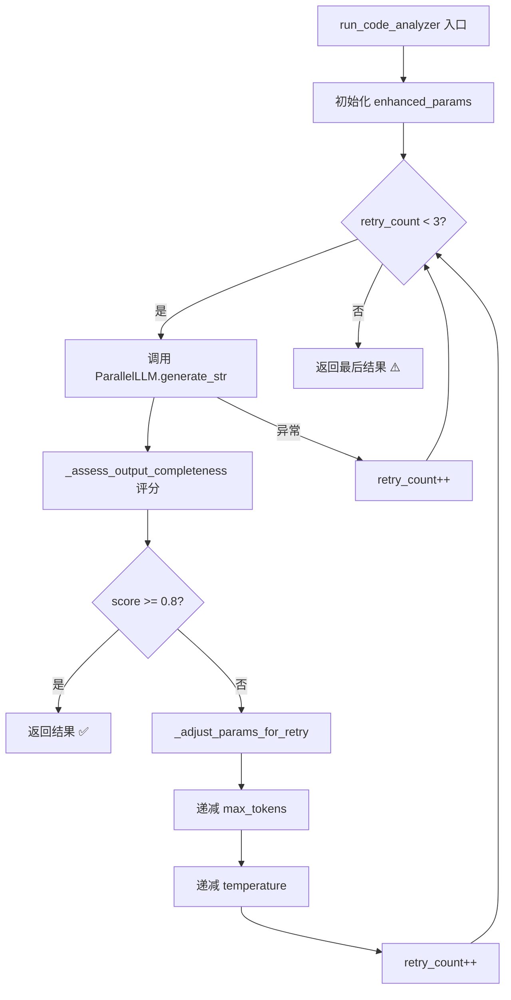
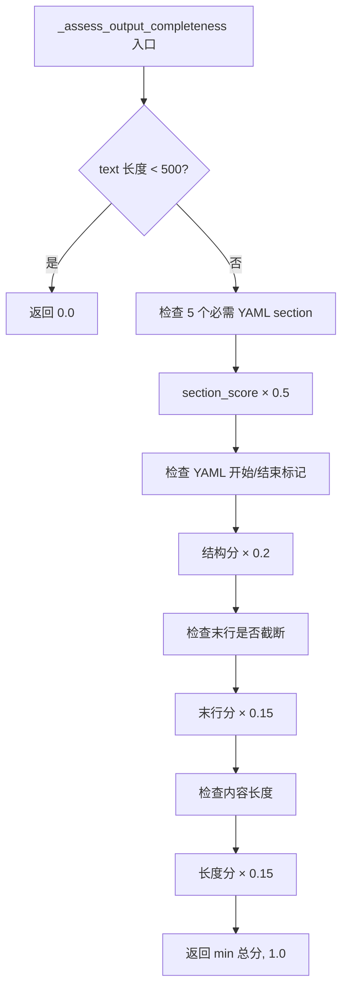

# PD-03.08 DeepCode — 参数递减重试与输出完整性验证

> 文档编号：PD-03.08
> 来源：DeepCode `workflows/agent_orchestration_engine.py`, `utils/llm_utils.py`
> GitHub：https://github.com/HKUDS/DeepCode.git
> 问题域：PD-03 容错与重试 Fault Tolerance & Retry
> 状态：可复用方案

---

## 第 1 章 问题与动机（≥ 30 行）

### 1.1 核心问题

在 LLM 驱动的多 Agent 研究复现流水线中，代码规划阶段需要 LLM 生成完整的 YAML 格式实现计划（包含 5 个必需 section：file_structure、implementation_components、validation_approach、environment_setup、implementation_strategy）。这个过程面临两个核心挑战：

1. **Context Window 溢出**：当输入论文内容较长时，input tokens + requested output tokens 可能超过模型的总 context 限制（如 qwen-max 的 32768 token），导致 `maximum context length exceeded` 错误
2. **输出截断**：即使不报错，LLM 也可能因 max_tokens 不足而输出不完整的 YAML 计划，缺少关键 section，导致下游代码生成阶段失败

传统的重试策略（如简单增大 max_tokens）在这种场景下会适得其反——增大输出 token 只会让 context 溢出更严重。DeepCode 的核心洞察是：**重试时应该减少而非增加 output tokens，为更长的 input 腾出空间，同时降低 temperature 以获得更稳定的输出**。

### 1.2 DeepCode 的解法概述

DeepCode 实现了一套"参数递减重试 + 输出完整性评估"的容错方案：

1. **`_adjust_params_for_retry`**：每次重试递减 max_tokens（100% → 90% → 80% of retry_max_tokens），同时递减 temperature（每次 -0.15），迫使模型用更简洁的方式表达相同内容（`workflows/agent_orchestration_engine.py:150-197`）
2. **`_assess_output_completeness`**：基于 4 维评分（必需 section 存在性 50% + YAML 结构完整性 20% + 末行截断检测 15% + 最小长度 15%）评估输出质量，阈值 0.8 决定是否重试（`workflows/agent_orchestration_engine.py:68-147`）
3. **`run_code_analyzer` 重试循环**：最多 3 次重试，每次调用 `_adjust_params_for_retry` 调整参数后重新请求 LLM（`workflows/agent_orchestration_engine.py:808-856`）
4. **OpenAI API 层指数退避重试**：`_call_openai_with_tools` 实现 3 次重试 + 指数退避（2s → 4s → 8s），处理 JSON 解析错误和 API 异常（`workflows/code_implementation_workflow.py:1020-1163`）
5. **多层 Fallback**：资源处理阶段先尝试直接函数调用，失败后 fallback 到 LLM Agent（`workflows/agent_orchestration_engine.py:526-620`）

### 1.3 设计思想

| 设计原则 | 具体实现 | 理由 | 替代方案 |
|----------|----------|------|----------|
| 反直觉参数调整 | 重试时减少 max_tokens 而非增加 | input+output 共享 context window，减少 output 为 input 腾空间 | 增大 max_tokens（会加剧溢出） |
| 多维完整性评估 | 4 维加权评分而非简单长度检查 | YAML 计划有明确的结构要求，单一指标不够 | 仅检查长度或正则匹配 |
| Temperature 递减 | 每次重试降低 0.15，最低 0.05 | 低 temperature 输出更确定性，减少截断风险 | 固定 temperature |
| 配置驱动 Token 限制 | 从 YAML 配置读取 base/retry token 限制 | 不同模型 context 不同，需要可配置 | 硬编码 token 限制 |
| 直接调用优先 | 文件操作先用 Python 函数，失败再用 LLM | 确定性操作不需要 LLM，减少不确定性和成本 | 所有操作都走 LLM |

---

## 第 2 章 源码实现分析（≥ 60 行，核心章节）

### 2.1 架构概览

DeepCode 的容错体系分为三层：

```
┌─────────────────────────────────────────────────────────────┐
│                    Orchestration Layer                        │
│  execute_multi_agent_research_pipeline()                     │
│  ├── Phase 4: orchestrate_code_planning_agent()              │
│  │   └── run_code_analyzer() ← 重试循环 + 完整性验证         │
│  ├── Phase 2: run_resource_processor()                       │
│  │   └── 直接调用 → LLM Fallback                            │
│  └── Phase 8: synthesize_code_implementation_agent()         │
│      └── _pure_code_implementation_loop() ← 超时 + 紧急裁剪  │
├─────────────────────────────────────────────────────────────┤
│                    Parameter Adjustment Layer                 │
│  _adjust_params_for_retry()  ← Token 递减 + Temperature 递减 │
│  _assess_output_completeness() ← 4 维完整性评分              │
│  get_token_limits()          ← 配置驱动 Token 限制           │
├─────────────────────────────────────────────────────────────┤
│                    API Communication Layer                    │
│  _call_openai_with_tools()   ← 3 次重试 + 指数退避           │
│  _call_anthropic_with_tools() ← 异常捕获                    │
│  _call_google_with_tools()   ← 异常捕获                     │
│  _repair_truncated_json()    ← JSON 修复                    │
└─────────────────────────────────────────────────────────────┘
```

### 2.2 核心实现

#### 2.2.1 参数递减重试策略



对应源码 `workflows/agent_orchestration_engine.py:150-197`：

```python
def _adjust_params_for_retry(
    params: RequestParams, retry_count: int, config_path: str = "mcp_agent.config.yaml"
) -> RequestParams:
    """
    Token减少策略以适应模型context限制

    策略说明（针对qwen/qwen-max的32768 token限制）：
    - 第1次重试：REDUCE到retry_max_tokens（从config读取，默认15000）
    - 第2次重试：REDUCE到retry_max_tokens的80%
    - 第3次重试：REDUCE到retry_max_tokens的60%
    - 降低temperature提高稳定性和可预测性

    为什么要REDUCE而不是INCREASE？
    - qwen/qwen-max最大context = 32768 tokens (input + output 总和)
    - 当遇到 "maximum context length exceeded" 错误时，说明 input + requested_output > 32768
    - INCREASING max_tokens只会让问题更严重！
    - 正确做法：DECREASE output tokens，为更多input留出空间
    """
    _, retry_max_tokens = get_token_limits(config_path)

    if retry_count == 0:
        new_max_tokens = retry_max_tokens
    elif retry_count == 1:
        new_max_tokens = int(retry_max_tokens * 0.9)
    else:
        new_max_tokens = int(retry_max_tokens * 0.8)

    new_temperature = max(params.temperature - (retry_count * 0.15), 0.05)

    return new_max_tokens, new_temperature
```

#### 2.2.2 输出完整性评估



对应源码 `workflows/agent_orchestration_engine.py:68-147`：

```python
def _assess_output_completeness(text: str) -> float:
    """精准评估YAML格式实现计划的完整性"""
    if not text or len(text.strip()) < 500:
        return 0.0

    score = 0.0
    text_lower = text.lower()

    # 1. 检查5个必需的YAML sections (权重: 0.5)
    required_sections = [
        "file_structure:",
        "implementation_components:",
        "validation_approach:",
        "environment_setup:",
        "implementation_strategy:",
    ]
    sections_found = sum(1 for section in required_sections if section in text_lower)
    score += (sections_found / len(required_sections)) * 0.5

    # 2. 检查YAML结构完整性 (权重: 0.2)
    has_yaml_start = any(
        marker in text for marker in ["```yaml", "complete_reproduction_plan:", "paper_info:"]
    )
    has_yaml_end = any(
        marker in text[-500:] for marker in ["```", "implementation_strategy:", "validation_approach:"]
    )
    if has_yaml_start and has_yaml_end:
        score += 0.2
    elif has_yaml_start:
        score += 0.1

    # 3. 检查最后一行完整性 (权重: 0.15)
    lines = text.strip().split("\n")
    if lines:
        last_line = lines[-1].strip()
        if last_line.endswith(("```", ".", ":", "]", "}")) or last_line.startswith(("-", "*", " ")):
            score += 0.15

    # 4. 检查合理的最小长度 (权重: 0.15)
    length = len(text)
    if length >= 10000:
        score += 0.15
    elif length >= 5000:
        score += 0.10
    elif length >= 2000:
        score += 0.05

    return min(score, 1.0)
```

### 2.3 实现细节

#### 2.3.1 重试循环集成

重试循环在 `run_code_analyzer` 中实现（`workflows/agent_orchestration_engine.py:808-856`），将参数调整和完整性评估串联：

```python
max_retries = 3
retry_count = 0

while retry_count < max_retries:
    try:
        result = await code_aggregator_agent.generate_str(
            message=message, request_params=enhanced_params
        )
        completeness_score = _assess_output_completeness(result)

        if completeness_score >= 0.8:
            return result
        else:
            new_max_tokens, new_temperature = _adjust_params_for_retry(
                enhanced_params, retry_count
            )
            enhanced_params = RequestParams(
                maxTokens=new_max_tokens,
                temperature=new_temperature,
                max_iterations=max_iterations,
                tool_filter=tool_filter if tool_filter else None,
            )
            retry_count += 1
    except Exception as e:
        retry_count += 1
        if retry_count >= max_retries:
            raise
```

#### 2.3.2 API 层指数退避

`_call_openai_with_tools`（`workflows/code_implementation_workflow.py:1020-1163`）实现了独立的 API 层重试：

- 3 次重试，初始延迟 2 秒，指数退避（2s → 4s → 8s）
- 区分 JSONDecodeError、ValueError/AttributeError/TypeError、通用 Exception 三类错误
- JSON 解析失败时调用 `_repair_truncated_json` 尝试修复
- 最终失败返回空响应而非崩溃

#### 2.3.3 JSON 修复机制

`_repair_truncated_json`（`workflows/code_implementation_workflow.py:913-998`）实现了 5 级 JSON 修复：

1. 移除尾部逗号
2. 闭合未关闭的结构（计算 `{`/`}` 和 `[`/`]` 差值）
3. 在错误位置截断并闭合
4. 工具特定默认值（如 write_file 提取 file_path）
5. 返回 None 表示修复失败

#### 2.3.4 实现循环超时保护

`_pure_code_implementation_loop`（`workflows/code_implementation_workflow.py:296-464`）实现了双重保护：

- **迭代上限**：max_iterations = 800
- **时间上限**：max_time = 7200 秒（2 小时）
- **紧急消息裁剪**：当 messages > 50 条时触发 ConciseMemoryAgent 压缩

#### 2.3.5 直接调用优先 Fallback

`run_resource_processor`（`workflows/agent_orchestration_engine.py:485-632`）实现了确定性操作优先策略：

- 本地文件：直接 `move_file_to()`，检查 `[SUCCESS]` 标记
- URL 下载：直接 `download_file_to()`，检查 `[SUCCESS]` 标记
- 两者都失败：fallback 到 LLM Agent（ResourceProcessorAgent）
- 全部失败：返回 `partial` 状态，提供 paper_dir 供手动处理


---

## 第 3 章 迁移指南（≥ 40 行）

### 3.1 迁移清单

**阶段 1：核心重试机制（必须）**
- [ ] 实现 `adjust_params_for_retry()` 参数递减函数
- [ ] 实现 `assess_output_completeness()` 多维评分函数
- [ ] 在 LLM 调用点集成重试循环（max_retries=3）
- [ ] 从配置文件读取 base_max_tokens 和 retry_max_tokens

**阶段 2：API 层容错（推荐）**
- [ ] 实现指数退避重试（初始 2s，倍增）
- [ ] 实现 JSON 修复函数（处理截断的 JSON 响应）
- [ ] 区分错误类型（JSON 解析、API 异常、通用异常）

**阶段 3：高级保护（可选）**
- [ ] 实现迭代上限 + 时间上限双重保护
- [ ] 实现确定性操作优先 Fallback（先直接调用，失败再用 LLM）
- [ ] 实现 ConciseMemoryAgent 消息裁剪（messages > 50 时触发）

### 3.2 适配代码模板

```python
"""
DeepCode 参数递减重试方案 — 可复用模板
适用于任何需要 LLM 生成结构化输出（JSON/YAML）的场景
"""
import time
import yaml
from dataclasses import dataclass
from typing import Optional, Tuple, List


@dataclass
class RetryConfig:
    """重试配置，建议从 YAML 配置文件加载"""
    base_max_tokens: int = 16000
    retry_max_tokens: int = 15000
    max_retries: int = 3
    temperature: float = 0.7
    temperature_decay: float = 0.15
    min_temperature: float = 0.05
    completeness_threshold: float = 0.8


def adjust_params_for_retry(
    config: RetryConfig,
    retry_count: int,
) -> Tuple[int, float]:
    """
    参数递减策略：每次重试减少 max_tokens 并降低 temperature
    
    核心洞察：LLM context = input + output，减少 output 为 input 腾空间
    """
    if retry_count == 0:
        new_max_tokens = config.retry_max_tokens
    elif retry_count == 1:
        new_max_tokens = int(config.retry_max_tokens * 0.9)
    else:
        new_max_tokens = int(config.retry_max_tokens * 0.8)

    new_temperature = max(
        config.temperature - (retry_count * config.temperature_decay),
        config.min_temperature,
    )
    return new_max_tokens, new_temperature


def assess_output_completeness(
    text: str,
    required_sections: List[str],
    min_length: int = 500,
) -> float:
    """
    多维输出完整性评估
    
    Args:
        text: LLM 输出文本
        required_sections: 必需的 section 关键词列表
        min_length: 最小有效长度
    
    Returns:
        0.0-1.0 的完整性分数
    """
    if not text or len(text.strip()) < min_length:
        return 0.0

    score = 0.0
    text_lower = text.lower()

    # 维度 1：必需 section 存在性（权重 50%）
    sections_found = sum(1 for s in required_sections if s.lower() in text_lower)
    score += (sections_found / len(required_sections)) * 0.5

    # 维度 2：结构完整性（权重 20%）— 自定义检测逻辑
    has_start = text.strip().startswith(("{", "[", "```", "---"))
    has_end = text.strip().endswith(("}", "]", "```", "---", ":"))
    if has_start and has_end:
        score += 0.2
    elif has_start:
        score += 0.1

    # 维度 3：末行截断检测（权重 15%）
    lines = text.strip().split("\n")
    if lines:
        last_line = lines[-1].strip()
        if len(last_line) > 0 and not last_line[-1].isalnum():
            score += 0.15  # 末行以标点结尾，可能完整

    # 维度 4：内容长度（权重 15%）
    length = len(text)
    if length >= 10000:
        score += 0.15
    elif length >= 5000:
        score += 0.10
    elif length >= 2000:
        score += 0.05

    return min(score, 1.0)


async def llm_call_with_decreasing_retry(
    llm_client,
    prompt: str,
    config: RetryConfig,
    required_sections: List[str],
) -> Optional[str]:
    """
    带参数递减重试的 LLM 调用
    
    完整的重试循环，集成参数调整和完整性评估
    """
    retry_count = 0
    last_result = None

    while retry_count < config.max_retries:
        max_tokens, temperature = adjust_params_for_retry(config, retry_count)

        try:
            result = await llm_client.generate(
                prompt=prompt,
                max_tokens=max_tokens,
                temperature=temperature,
            )
            last_result = result

            completeness = assess_output_completeness(result, required_sections)
            if completeness >= config.completeness_threshold:
                return result

            retry_count += 1

        except Exception as e:
            retry_count += 1
            if retry_count >= config.max_retries:
                if last_result:
                    return last_result
                raise

    return last_result


def repair_truncated_json(raw_text: str) -> Optional[dict]:
    """
    5 级 JSON 修复策略
    
    逐级尝试修复截断的 JSON，从最轻量到最激进
    """
    import json
    import re

    # Level 1: 直接解析
    try:
        return json.loads(raw_text)
    except json.JSONDecodeError:
        pass

    # Level 2: 移除尾部逗号
    cleaned = re.sub(r',\s*([}\]])', r'\1', raw_text)
    try:
        return json.loads(cleaned)
    except json.JSONDecodeError:
        pass

    # Level 3: 闭合未关闭的结构
    open_braces = cleaned.count('{') - cleaned.count('}')
    open_brackets = cleaned.count('[') - cleaned.count(']')
    patched = cleaned + ']' * open_brackets + '}' * open_braces
    try:
        return json.loads(patched)
    except json.JSONDecodeError:
        pass

    # Level 4: 在最后一个完整键值对处截断
    last_comma = cleaned.rfind(',')
    if last_comma > 0:
        truncated = cleaned[:last_comma]
        open_b = truncated.count('{') - truncated.count('}')
        open_k = truncated.count('[') - truncated.count(']')
        truncated += ']' * open_k + '}' * open_b
        try:
            return json.loads(truncated)
        except json.JSONDecodeError:
            pass

    # Level 5: 修复失败
    return None
```

### 3.3 适用场景

| 场景 | 适用度 | 说明 |
|------|--------|------|
| LLM 生成结构化 YAML/JSON 计划 | ⭐⭐⭐ | 核心场景，完整性评估直接适用 |
| Context Window 受限的小模型 | ⭐⭐⭐ | 参数递减策略专为此设计 |
| 多步 Agent 流水线 | ⭐⭐⭐ | 每步都可能失败，需要独立重试 |
| 简单文本生成（无结构要求） | ⭐ | 完整性评估无法发挥作用 |
| 流式输出场景 | ⭐ | 参数递减对流式输出意义不大 |

---

## 第 4 章 测试用例（≥ 20 行）

```python
import pytest
from unittest.mock import AsyncMock, MagicMock


class TestAdjustParamsForRetry:
    """测试参数递减策略"""

    def test_first_retry_uses_retry_max_tokens(self):
        config = RetryConfig(retry_max_tokens=15000, temperature=0.7)
        max_tokens, temp = adjust_params_for_retry(config, retry_count=0)
        assert max_tokens == 15000
        assert temp == 0.7

    def test_second_retry_reduces_to_90_percent(self):
        config = RetryConfig(retry_max_tokens=15000, temperature=0.7)
        max_tokens, temp = adjust_params_for_retry(config, retry_count=1)
        assert max_tokens == 13500  # 15000 * 0.9
        assert temp == pytest.approx(0.55)  # 0.7 - 0.15

    def test_third_retry_reduces_to_80_percent(self):
        config = RetryConfig(retry_max_tokens=15000, temperature=0.7)
        max_tokens, temp = adjust_params_for_retry(config, retry_count=2)
        assert max_tokens == 12000  # 15000 * 0.8
        assert temp == pytest.approx(0.40)  # 0.7 - 0.30

    def test_temperature_floor(self):
        config = RetryConfig(retry_max_tokens=15000, temperature=0.2, min_temperature=0.05)
        _, temp = adjust_params_for_retry(config, retry_count=2)
        assert temp == 0.05  # 不低于 min_temperature


class TestAssessOutputCompleteness:
    """测试输出完整性评估"""

    def test_empty_text_returns_zero(self):
        assert assess_output_completeness("", ["section:"]) == 0.0

    def test_short_text_returns_zero(self):
        assert assess_output_completeness("short", ["section:"], min_length=500) == 0.0

    def test_all_sections_present_scores_high(self):
        sections = ["file_structure:", "implementation_components:", "validation_approach:"]
        text = "```yaml\n" + "\n".join(f"{s} content here" for s in sections)
        text += "\n" * 200 + "x" * 10000 + "\n```"
        score = assess_output_completeness(text, sections, min_length=100)
        assert score >= 0.7

    def test_missing_sections_scores_low(self):
        sections = ["file_structure:", "implementation_components:", "validation_approach:"]
        text = "x" * 2000 + "\nfile_structure: something\n```"
        score = assess_output_completeness(text, sections, min_length=100)
        assert score < 0.5


class TestRepairTruncatedJson:
    """测试 JSON 修复"""

    def test_valid_json_passes_through(self):
        result = repair_truncated_json('{"key": "value"}')
        assert result == {"key": "value"}

    def test_trailing_comma_removed(self):
        result = repair_truncated_json('{"key": "value",}')
        assert result == {"key": "value"}

    def test_unclosed_brace_fixed(self):
        result = repair_truncated_json('{"key": "value"')
        assert result == {"key": "value"}

    def test_deeply_truncated_returns_none(self):
        result = repair_truncated_json('{"key": "val')
        # 可能修复成功也可能失败，取决于截断位置
        # 这里测试不会抛异常
        assert result is None or isinstance(result, dict)


@pytest.mark.asyncio
class TestLlmCallWithDecreasingRetry:
    """测试完整重试循环"""

    async def test_success_on_first_try(self):
        mock_client = AsyncMock()
        mock_client.generate.return_value = "file_structure: x\nimplementation_components: y\nvalidation_approach: z\n" + "x" * 10000
        config = RetryConfig(max_retries=3)
        sections = ["file_structure:", "implementation_components:", "validation_approach:"]

        result = await llm_call_with_decreasing_retry(mock_client, "prompt", config, sections)
        assert result is not None
        assert mock_client.generate.call_count == 1

    async def test_retries_on_incomplete_output(self):
        mock_client = AsyncMock()
        mock_client.generate.side_effect = [
            "short incomplete",  # 第 1 次：不完整
            "short incomplete",  # 第 2 次：不完整
            "file_structure: x\nimplementation_components: y\nvalidation_approach: z\n" + "x" * 10000,  # 第 3 次：完整
        ]
        config = RetryConfig(max_retries=3, completeness_threshold=0.5)
        sections = ["file_structure:", "implementation_components:", "validation_approach:"]

        result = await llm_call_with_decreasing_retry(mock_client, "prompt", config, sections)
        assert mock_client.generate.call_count == 3
```


---

## 第 5 章 跨域关联

| 关联域 | 关系类型 | 说明 |
|--------|----------|------|
| PD-01 上下文管理 | 强依赖 | 参数递减策略的核心动机就是 context window 管理——减少 output tokens 为 input 腾空间。ConciseMemoryAgent 的消息裁剪（messages > 50 时触发）也是上下文压缩的一种形式 |
| PD-02 多 Agent 编排 | 协同 | 重试发生在编排流水线的各个阶段（Phase 4 代码规划、Phase 8 代码实现），每个阶段有独立的重试策略。编排引擎需要感知重试状态以决定是否继续下游 |
| PD-04 工具系统 | 协同 | `_call_openai_with_tools` 的重试逻辑专门处理 tool_calls 的 JSON 解析失败，`_repair_truncated_json` 针对工具调用参数的修复。工具执行失败也会触发 fallback |
| PD-06 记忆持久化 | 协同 | ConciseMemoryAgent 在重试/消息裁剪时保留 initial_plan + code_summary，确保重试后不丢失关键上下文。`implement_code_summary.md` 作为持久化知识库跨轮次传递 |
| PD-07 质量检查 | 依赖 | `_assess_output_completeness` 本质上是一个质量检查器，4 维评分机制可以扩展为更通用的 LLM 输出质量评估框架 |
| PD-11 可观测性 | 协同 | 每次重试都有详细日志（retry_count、completeness_score、adjusted params），但缺少结构化的 cost tracking（未记录每次重试消耗的 tokens） |

---

## 第 6 章 来源文件索引

| 文件 | 行范围 | 关键实现 |
|------|--------|----------|
| `workflows/agent_orchestration_engine.py` | L68-L147 | `_assess_output_completeness()` 4 维完整性评分 |
| `workflows/agent_orchestration_engine.py` | L150-L197 | `_adjust_params_for_retry()` 参数递减策略 |
| `workflows/agent_orchestration_engine.py` | L199-L230 | `get_token_limits()` 配置驱动 Token 限制 |
| `workflows/agent_orchestration_engine.py` | L808-L856 | `run_code_analyzer()` 重试循环集成 |
| `workflows/agent_orchestration_engine.py` | L485-L632 | `run_resource_processor()` 直接调用优先 Fallback |
| `workflows/code_implementation_workflow.py` | L913-L998 | `_repair_truncated_json()` 5 级 JSON 修复 |
| `workflows/code_implementation_workflow.py` | L1020-L1163 | `_call_openai_with_tools()` API 层指数退避 |
| `workflows/code_implementation_workflow.py` | L296-L464 | `_pure_code_implementation_loop()` 迭代/时间双重保护 |
| `workflows/agents/memory_agent_concise.py` | L1-L2156 | `ConciseMemoryAgent` 消息裁剪与知识库持久化 |
| `workflows/agents/code_implementation_agent.py` | L280-L410 | `_handle_read_file_with_memory_optimization()` 读取优化 |

---

## 第 7 章 横向对比维度

```json comparison_data
{
  "project": "DeepCode",
  "dimensions": {
    "截断/错误检测": "4维加权评分：section存在性50%+YAML结构20%+末行截断15%+长度15%",
    "重试/恢复策略": "参数递减重试：max_tokens逐次减10%/20%，temperature每次-0.15",
    "超时保护": "双重保护：迭代上限800次+时间上限7200秒",
    "优雅降级": "直接函数调用优先，失败fallback到LLM Agent",
    "重试策略": "业务层3次参数递减+API层3次指数退避(2s→4s→8s)",
    "降级方案": "资源处理：直接调用→LLM Agent→partial状态手动处理",
    "错误分类": "区分JSONDecodeError/ValueError/TypeError/通用Exception",
    "恢复机制": "5级JSON修复：去逗号→闭合结构→截断闭合→工具默认值→放弃",
    "输出验证": "YAML计划5个必需section检查+结构完整性+末行完整性",
    "配置预验证": "从YAML配置读取base/retry token限制，运行前确定参数边界",
    "续写能力": "无续写，通过减少output tokens迫使模型用更简洁方式表达"
  }
}
```

### 域元数据补充

```json domain_metadata
{
  "solution_summary": "DeepCode用参数递减重试（max_tokens逐次减10%/20%+temperature递减0.15）配合4维输出完整性评分（阈值0.8）解决LLM结构化输出截断问题",
  "description": "重试时减少而非增加output tokens是context受限场景的反直觉但有效策略",
  "sub_problems": [
    "参数递减方向选择：context受限时应减少output而非增加，避免加剧溢出",
    "结构化输出多维完整性评估：单一长度检查不足以判断YAML/JSON计划的可用性"
  ],
  "best_practices": [
    "重试时递减temperature：低temperature输出更确定性，减少截断风险",
    "确定性操作不走LLM：文件操作等确定性任务先用直接函数调用，失败再fallback到LLM",
    "JSON修复分级尝试：从最轻量（去逗号）到最激进（截断闭合），逐级修复"
  ]
}
```

