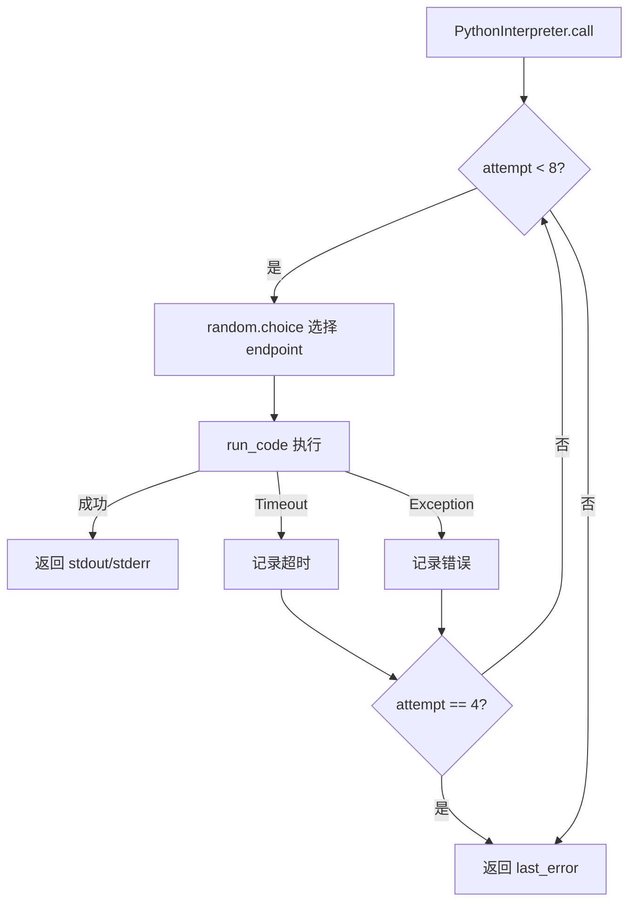
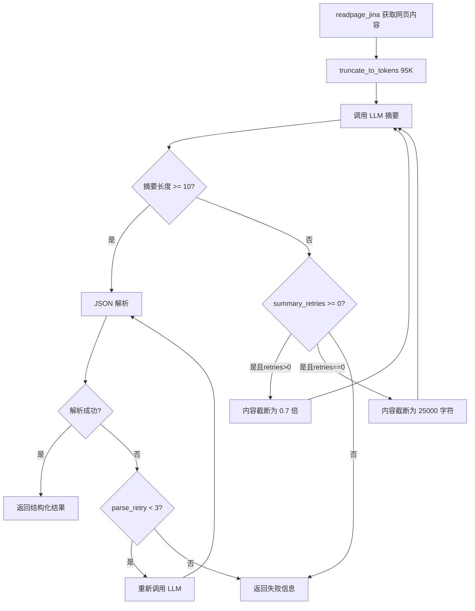

# PD-03.14 DeepResearch — 三层重试与渐进截断降级

> 文档编号：PD-03.14
> 来源：DeepResearch `inference/react_agent.py` `inference/tool_python.py` `inference/tool_visit.py`
> GitHub：https://github.com/Alibaba-NLP/DeepResearch
> 问题域：PD-03 容错与重试 Fault Tolerance & Retry
> 状态：可复用方案

---

## 第 1 章 问题与动机（≥ 30 行）

### 1.1 核心问题

DeepResearch 是阿里巴巴 NLP 团队的深度研究 Agent，核心流程是 ReAct 循环：LLM 推理 → 工具调用 → 观察结果 → 继续推理。这个流程中每一步都可能失败：

- **LLM 推理服务**：自托管 vLLM 服务可能因负载过高返回空响应、API 超时或连接错误
- **沙箱代码执行**：SandboxFusion 多 endpoint 部署，单个 endpoint 可能宕机或超时
- **网页抓取**：Jina Reader API 可能因目标网站反爬、网络波动返回空内容
- **LLM 摘要提取**：对抓取内容做摘要时，内容过长导致 token 超限，摘要结果可能为空或非法 JSON
- **搜索 API**：Serper API 的 HTTP 连接可能因网络抖动失败

单次失败不应终止整个研究流程。一个深度研究任务可能运行数十轮 ReAct 循环（最多 100 轮），耗时可达 150 分钟，任何一次未处理的异常都会浪费前面所有的计算。

### 1.2 DeepResearch 的解法概述

DeepResearch 采用**三层重试架构**，每层针对不同的失败模式：

1. **核心推理层**：`call_server` 指数退避重试（`react_agent.py:59-110`），base×2^attempt + 随机抖动，上限 30s，最多 10 次
2. **工具执行层**：每个工具独立重试策略 — PythonInterpreter 8 次随机 endpoint 轮换（`tool_python.py:76-109`），Jina 3 次固定延迟（`tool_visit.py:143-167`），Serper 5 次无延迟（`tool_search.py:63-71`）
3. **结果处理层**：摘要失败时渐进截断内容长度（0.7x 递减，最终降至 25000 字符），JSON 解析失败时重新调用 LLM（`tool_visit.py:199-232`）

此外，在 Agent 主循环层面还有两道**全局保护**：
- **Token 预算保护**：上下文超过 110K token 时强制要求 LLM 给出最终答案（`react_agent.py:186-209`）
- **时间预算保护**：运行超过 150 分钟自动终止（`react_agent.py:140-150`）

### 1.3 设计思想

| 设计原则 | 具体实现 | 理由 | 替代方案 |
|----------|----------|------|----------|
| 分层重试 | 推理/工具/结果三层各自重试 | 不同层失败模式不同，重试策略应独立 | 统一重试装饰器（但无法区分失败类型） |
| 指数退避+抖动 | base×2^attempt + random(0,1)，cap 30s | 避免多 worker 同时重试造成雷群效应 | 固定延迟（简单但可能加剧拥塞） |
| 随机 endpoint 轮换 | SandboxFusion 从 endpoint 列表随机选择 | 单 endpoint 故障时自动绕过 | 轮询（有序但故障 endpoint 仍会被命中） |
| 渐进截断降级 | 摘要失败时内容长度×0.7，最终降至 25000 | 内容过长是摘要失败的主因，逐步缩短找到可处理长度 | 一次性截断到固定长度（可能丢失过多信息） |
| 全局预算保护 | Token 上限 110K + 时间上限 150min | 防止无限循环耗尽资源 | 仅限制 LLM 调用次数（不够精确） |

---

## 第 2 章 源码实现分析（≥ 60 行，核心章节）

### 2.1 架构概览

DeepResearch 的容错体系分布在三个层次，每层有独立的重试逻辑和降级策略：

```
┌─────────────────────────────────────────────────────────┐
│                   Agent 主循环 (_run)                     │
│  ┌─────────────┐  ┌──────────────┐  ┌────────────────┐  │
│  │ Token 预算   │  │ 时间预算      │  │ LLM 调用预算   │  │
│  │ 110K 上限    │  │ 150min 上限   │  │ 100 次上限     │  │
│  └──────┬──────┘  └──────┬───────┘  └───────┬────────┘  │
│         └────────────────┼──────────────────┘            │
│                          ▼                               │
│  ┌──────────────────────────────────────────────────┐   │
│  │          核心推理层 (call_server)                   │   │
│  │  指数退避: 1s×2^n + jitter, cap 30s, max 10次     │   │
│  └──────────────────────┬───────────────────────────┘   │
│                          ▼                               │
│  ┌──────────────────────────────────────────────────┐   │
│  │          工具执行层 (各工具独立重试)                  │   │
│  │  ┌─────────┐ ┌──────────┐ ┌────────┐ ┌────────┐ │   │
│  │  │Python×8 │ │ Jina×3   │ │Serper×5│ │Scholar5│ │   │
│  │  │随机EP   │ │ 0.5s延迟 │ │无延迟  │ │无延迟  │ │   │
│  │  └─────────┘ └──────────┘ └────────┘ └────────┘ │   │
│  └──────────────────────┬───────────────────────────┘   │
│                          ▼                               │
│  ┌──────────────────────────────────────────────────┐   │
│  │          结果处理层 (渐进截断 + JSON 修复)           │   │
│  │  摘要重试: 内容×0.7 递减, 最终 25000 字符           │   │
│  │  JSON 修复: 3 次重新调用 LLM + 手动提取 {}          │   │
│  └──────────────────────────────────────────────────┘   │
└─────────────────────────────────────────────────────────┘
```

### 2.2 核心实现

#### 2.2.1 核心推理层：指数退避重试

```mermaid
graph TD
    A[call_server 入口] --> B{attempt < max_tries?}
    B -->|是| C[调用 OpenAI API]
    C --> D{响应有效?}
    D -->|有效且非空| E[返回 content]
    D -->|空响应| F[记录警告]
    C -->|APIError/Timeout| G[记录错误]
    F --> H{是最后一次?}
    G --> H
    H -->|否| I[sleep: min&#40;1×2^n + rand&#40;0,1&#41;, 30&#41;]
    I --> B
    H -->|是| J[返回 vllm server error]
    B -->|否| J
```



对应源码 `inference/react_agent.py:59-110`：

```python
def call_server(self, msgs, planning_port, max_tries=10):
    openai_api_key = "EMPTY"
    openai_api_base = f"http://127.0.0.1:{planning_port}/v1"
    client = OpenAI(
        api_key=openai_api_key,
        base_url=openai_api_base,
        timeout=600.0,  # 单次请求 10 分钟超时
    )
    base_sleep_time = 1
    for attempt in range(max_tries):
        try:
            chat_response = client.chat.completions.create(
                model=self.model,
                messages=msgs,
                stop=["\n<tool_response>", "<tool_response>"],
                temperature=self.llm_generate_cfg.get('temperature', 0.6),
                top_p=self.llm_generate_cfg.get('top_p', 0.95),
                logprobs=True,
                max_tokens=10000,
                presence_penalty=self.llm_generate_cfg.get('presence_penalty', 1.1)
            )
            content = chat_response.choices[0].message.content
            if content and content.strip():
                return content.strip()
            else:
                print(f"Warning: Attempt {attempt + 1} received an empty response.")
        except (APIError, APIConnectionError, APITimeoutError) as e:
            print(f"Error: Attempt {attempt + 1} failed with an API or network error: {e}")
        except Exception as e:
            print(f"Error: Attempt {attempt + 1} failed with an unexpected error: {e}")

        if attempt < max_tries - 1:
            sleep_time = base_sleep_time * (2 ** attempt) + random.uniform(0, 1)
            sleep_time = min(sleep_time, 30)  # 上限 30 秒
            print(f"Retrying in {sleep_time:.2f} seconds...")
            time.sleep(sleep_time)
        else:
            print("Error: All retry attempts have been exhausted.")
    return f"vllm server error!!!"
```

关键设计点：
- **空响应也触发重试**（L90-94）：vLLM 在高负载下可能返回空内容，这不是异常但需要重试
- **三类异常分别捕获**（L96-99）：`APIError`、`APIConnectionError`、`APITimeoutError` 是 OpenAI SDK 的标准异常分类
- **退避公式**（L102）：`1 × 2^attempt + random(0,1)`，实际延迟序列约为 1.x, 2.x, 4.x, 8.x, 16.x, 30, 30, 30, 30 秒

#### 2.2.2 工具执行层：随机 endpoint 轮换



对应源码 `inference/tool_python.py:72-112`：

```python
def call(self, params, files=None, timeout=50, **kwargs) -> str:
    try:
        code = params
        last_error = None
        for attempt in range(8):
            try:
                # 每次随机选择一个 endpoint
                endpoint = random.choice(SANDBOX_FUSION_ENDPOINTS)
                print(f"Attempt {attempt + 1}/5 using endpoint: {endpoint}")
                code_result = run_code(
                    RunCodeRequest(code=code, language='python', run_timeout=timeout),
                    max_attempts=1,  # SandboxFusion 内部不重试
                    client_timeout=timeout,
                    endpoint=endpoint
                )
                # ... 处理结果 ...
                return result if result.strip() else 'Finished execution.'
            except Timeout as e:
                last_error = f'[Python Interpreter Error] TimeoutError: ...'
                if attempt == 4:  # 注意：循环 8 次但第 5 次就放弃
                    return last_error
                continue
            except Exception as e:
                last_error = f'[Python Interpreter Error]: {str(e)} on endpoint {endpoint}'
                if attempt == 4:
                    return last_error
                continue
        return last_error if last_error else '[Python Interpreter Error]: All attempts failed.'
    except Exception as e:
        return f"[Python Interpreter Error]: {str(e)}"
```

注意一个有趣的 bug/设计：循环范围是 `range(8)` 但在 `attempt == 4` 时就提前返回错误，实际最多只执行 5 次。这可能是开发过程中调整重试次数时遗留的不一致。

#### 2.2.3 结果处理层：渐进截断降级



对应源码 `inference/tool_visit.py:179-254`：

```python
def readpage_jina(self, url: str, goal: str) -> str:
    content = self.html_readpage_jina(url)  # 内部已有 8 次重试
    if content and not content.startswith("[visit] Failed"):
        content = truncate_to_tokens(content, max_tokens=95000)
        messages = [{"role": "user", "content": EXTRACTOR_PROMPT.format(
            webpage_content=content, goal=goal)}]
        raw = summary_page_func(messages, max_retries=max_retries)
        summary_retries = 3
        # 渐进截断：每次缩短到 70%，最终降至 25000 字符
        while len(raw) < 10 and summary_retries >= 0:
            truncate_length = int(0.7 * len(content)) if summary_retries > 0 else 25000
            content = content[:truncate_length]
            messages = [{"role": "user", "content": EXTRACTOR_PROMPT.format(
                webpage_content=content, goal=goal)}]
            raw = summary_page_func(messages, max_retries=max_retries)
            summary_retries -= 1
        # JSON 解析重试：最多 3 次
        parse_retry_times = 0
        while parse_retry_times < 3:
            try:
                raw = json.loads(raw)
                break
            except:
                raw = summary_page_func(messages, max_retries=max_retries)
                parse_retry_times += 1
```

### 2.3 实现细节

#### 全局预算保护机制

Agent 主循环 `_run`（`react_agent.py:120-226`）实现了三重预算保护：

1. **LLM 调用次数**（L136-138）：`MAX_LLM_CALL_PER_RUN = 100`，每轮递减，耗尽时注入提示 "Sorry, the number of llm calls exceeds the limit"
2. **时间预算**（L140-150）：`150 * 60` 秒（2.5 小时），超时返回 "No answer found after 2h30mins"
3. **Token 预算**（L186-209）：上下文超过 `110 * 1024` token 时，注入强制结束指令要求 LLM 给出最终答案

Token 超限时的强制结束指令（`react_agent.py:193`）：
```python
messages[-1]['content'] = "You have now reached the maximum context length you can handle. "
    "You should stop making tool calls and, based on all the information above, "
    "think again and provide what you consider the most likely answer..."
```

#### 搜索 API 的简单重试

Serper 搜索（`tool_search.py:63-71`）和 Scholar（`tool_scholar.py:39-48`）都使用相同的 5 次无延迟重试模式：

```python
for i in range(5):
    try:
        conn.request("POST", "/search", payload, headers)
        res = conn.getresponse()
        break
    except Exception as e:
        if i == 4:
            return f"Google search Timeout, return None, Please try again later."
        continue
```

#### HTTP 客户端级别的 urllib3 重试

视频分析工具（`file_tools/video_analysis.py:97-109`）使用 requests 的 HTTPAdapter 配置了 urllib3 级别的自动重试：

```python
retry_adapter = requests.adapters.HTTPAdapter(
    max_retries=requests.packages.urllib3.util.Retry(
        total=RETRY_ATTEMPTS,       # 3 次
        backoff_factor=RETRY_DELAY,  # 1 秒
        status_forcelist=[500, 502, 503, 504]  # 仅对服务端错误重试
    )
)
```

#### 并发执行层的容错

`run_multi_react.py:174-225` 使用 ThreadPoolExecutor 并发执行多个研究任务，对每个 Future 的异常做了分类处理：

- `TimeoutError`：记录超时错误结果，标记 prediction 为 `[Failed]`
- 其他 `Exception`：记录异常详情，同样标记为 `[Failed]`
- 所有错误结果都写入 JSONL 文件，不丢失任何任务状态


---

## 第 3 章 迁移指南（≥ 40 行）

### 3.1 迁移清单

**阶段 1：核心推理层重试（必须）**
- [ ] 封装 LLM 调用为带指数退避的重试函数
- [ ] 区分空响应和异常两种失败模式
- [ ] 配置退避参数：base_sleep、max_sleep、max_retries
- [ ] 添加随机抖动避免雷群效应

**阶段 2：工具层独立重试（推荐）**
- [ ] 为每个外部服务工具配置独立重试策略
- [ ] 多 endpoint 服务使用随机选择策略
- [ ] 搜索类 API 使用简单重试（无延迟）
- [ ] HTTP 客户端配置 urllib3 级别自动重试

**阶段 3：结果处理层降级（推荐）**
- [ ] 内容过长导致 LLM 失败时，实现渐进截断
- [ ] JSON 解析失败时，先尝试手动提取 `{}`，再重新调用 LLM
- [ ] 所有降级路径都返回结构化的错误信息，不抛异常

**阶段 4：全局预算保护（必须）**
- [ ] 设置 Token 上限，超限时强制要求 LLM 总结已有信息
- [ ] 设置时间上限，超时时返回已有的最佳结果
- [ ] 设置 LLM 调用次数上限，防止无限循环

### 3.2 适配代码模板

#### 通用指数退避重试器

```python
import time
import random
from typing import TypeVar, Callable, Optional
from openai import APIError, APIConnectionError, APITimeoutError

T = TypeVar('T')

def retry_with_exponential_backoff(
    func: Callable[..., T],
    max_retries: int = 10,
    base_sleep: float = 1.0,
    max_sleep: float = 30.0,
    retryable_exceptions: tuple = (APIError, APIConnectionError, APITimeoutError),
    validate_result: Optional[Callable[[T], bool]] = None,
) -> T:
    """
    指数退避重试，支持结果验证。
    源自 DeepResearch react_agent.py:59-110 的模式。
    """
    last_error = None
    for attempt in range(max_retries):
        try:
            result = func()
            if validate_result is None or validate_result(result):
                return result
            last_error = f"Result validation failed on attempt {attempt + 1}"
        except retryable_exceptions as e:
            last_error = str(e)
        except Exception as e:
            last_error = str(e)

        if attempt < max_retries - 1:
            sleep_time = min(base_sleep * (2 ** attempt) + random.uniform(0, 1), max_sleep)
            time.sleep(sleep_time)

    raise RuntimeError(f"All {max_retries} retries exhausted. Last error: {last_error}")


# 使用示例
content = retry_with_exponential_backoff(
    func=lambda: client.chat.completions.create(model="gpt-4", messages=msgs).choices[0].message.content,
    validate_result=lambda r: r and r.strip(),  # 空响应也重试
    max_retries=10,
)
```

#### 渐进截断降级器

```python
def progressive_truncation_retry(
    content: str,
    process_func: Callable[[str], str],
    shrink_ratio: float = 0.7,
    min_length: int = 25000,
    max_retries: int = 3,
    min_valid_length: int = 10,
) -> str:
    """
    内容过长导致处理失败时，逐步截断重试。
    源自 DeepResearch tool_visit.py:199-221 的模式。
    """
    for attempt in range(max_retries):
        result = process_func(content)
        if len(result) >= min_valid_length:
            return result
        # 最后一次使用最小长度
        if attempt == max_retries - 1:
            content = content[:min_length]
        else:
            content = content[:int(len(content) * shrink_ratio)]
    return ""  # 所有重试失败
```

#### 多 endpoint 随机轮换

```python
import random
from typing import List, Callable, TypeVar

T = TypeVar('T')

def random_endpoint_retry(
    endpoints: List[str],
    call_func: Callable[[str], T],
    max_retries: int = 5,
) -> T:
    """
    从 endpoint 列表随机选择，失败时换一个重试。
    源自 DeepResearch tool_python.py:76-109 的模式。
    """
    last_error = None
    for attempt in range(max_retries):
        endpoint = random.choice(endpoints)
        try:
            return call_func(endpoint)
        except Exception as e:
            last_error = f"Endpoint {endpoint} failed: {e}"
    raise RuntimeError(f"All {max_retries} attempts failed. Last: {last_error}")
```

### 3.3 适用场景

| 场景 | 适用度 | 说明 |
|------|--------|------|
| 自托管 LLM 推理服务 | ⭐⭐⭐ | 指数退避+空响应检测完美匹配 vLLM/TGI 场景 |
| 多 endpoint 沙箱执行 | ⭐⭐⭐ | 随机轮换策略适合无状态的代码执行服务 |
| 网页抓取+摘要管道 | ⭐⭐⭐ | 渐进截断降级是处理长内容的实用模式 |
| 云端 LLM API（OpenAI/Claude） | ⭐⭐ | 指数退避适用，但云端 API 通常自带重试 |
| 有状态的工具调用 | ⭐ | 随机 endpoint 不适合需要会话保持的场景 |

---

## 第 4 章 测试用例（≥ 20 行）

```python
import pytest
import time
from unittest.mock import MagicMock, patch

class TestExponentialBackoffRetry:
    """测试指数退避重试逻辑，对应 react_agent.py:59-110"""

    def test_success_on_first_attempt(self):
        """首次成功直接返回"""
        mock_client = MagicMock()
        mock_client.chat.completions.create.return_value.choices = [
            MagicMock(message=MagicMock(content="valid response"))
        ]
        # 应该只调用一次
        result = retry_with_exponential_backoff(
            func=lambda: mock_client.chat.completions.create(
                model="test", messages=[]
            ).choices[0].message.content,
            validate_result=lambda r: r and r.strip(),
            max_retries=3,
        )
        assert result == "valid response"

    def test_retry_on_empty_response(self):
        """空响应触发重试"""
        call_count = 0
        def mock_call():
            nonlocal call_count
            call_count += 1
            return "" if call_count < 3 else "valid"
        result = retry_with_exponential_backoff(
            func=mock_call,
            validate_result=lambda r: r and r.strip(),
            max_retries=5,
            base_sleep=0.01,
        )
        assert result == "valid"
        assert call_count == 3

    def test_exponential_backoff_timing(self):
        """验证退避时间指数增长"""
        sleep_times = []
        original_sleep = time.sleep
        with patch('time.sleep', side_effect=lambda t: sleep_times.append(t)):
            try:
                retry_with_exponential_backoff(
                    func=lambda: (_ for _ in ()).throw(ConnectionError("fail")),
                    retryable_exceptions=(ConnectionError,),
                    max_retries=4,
                    base_sleep=1.0,
                    max_sleep=30.0,
                )
            except RuntimeError:
                pass
        # 3 次 sleep（4 次尝试之间）
        assert len(sleep_times) == 3
        # 验证指数增长趋势（含抖动）
        assert sleep_times[0] < sleep_times[1] < sleep_times[2]
        assert all(t <= 31.0 for t in sleep_times)  # cap + jitter

    def test_max_retries_exhausted(self):
        """重试耗尽抛出异常"""
        with pytest.raises(RuntimeError, match="All 3 retries exhausted"):
            retry_with_exponential_backoff(
                func=lambda: (_ for _ in ()).throw(ConnectionError("fail")),
                retryable_exceptions=(ConnectionError,),
                max_retries=3,
                base_sleep=0.01,
            )


class TestProgressiveTruncation:
    """测试渐进截断降级，对应 tool_visit.py:199-221"""

    def test_success_without_truncation(self):
        """内容长度合适时不截断"""
        result = progressive_truncation_retry(
            content="x" * 10000,
            process_func=lambda c: f"summary of {len(c)} chars",
            max_retries=3,
        )
        assert "10000" in result

    def test_progressive_shrink(self):
        """验证渐进截断比例"""
        lengths_seen = []
        call_count = 0
        def mock_process(content):
            nonlocal call_count
            lengths_seen.append(len(content))
            call_count += 1
            return "" if call_count < 3 else "valid summary"
        result = progressive_truncation_retry(
            content="x" * 100000,
            process_func=mock_process,
            shrink_ratio=0.7,
            max_retries=3,
        )
        assert result == "valid summary"
        assert lengths_seen[0] == 100000
        assert lengths_seen[1] == 70000  # 100000 * 0.7


class TestRandomEndpointRetry:
    """测试随机 endpoint 轮换，对应 tool_python.py:76-109"""

    def test_failover_to_different_endpoint(self):
        """失败时切换到不同 endpoint"""
        endpoints_tried = []
        def mock_call(endpoint):
            endpoints_tried.append(endpoint)
            if endpoint == "bad":
                raise ConnectionError("down")
            return "success"
        result = random_endpoint_retry(
            endpoints=["bad", "good"],
            call_func=mock_call,
            max_retries=10,
        )
        assert result == "success"
        assert "good" in endpoints_tried
```


---

## 第 5 章 跨域关联

| 关联域 | 关系类型 | 说明 |
|--------|----------|------|
| PD-01 上下文管理 | 协同 | Token 预算保护（110K 上限）是上下文管理的一部分，超限时强制总结而非截断丢弃 |
| PD-02 多 Agent 编排 | 协同 | `run_multi_react.py` 的 ThreadPoolExecutor 并发容错确保单任务失败不影响其他任务 |
| PD-04 工具系统 | 依赖 | 每个工具的重试策略嵌入在工具 `call` 方法内部，工具系统的注册机制决定了重试逻辑的分布位置 |
| PD-05 沙箱隔离 | 协同 | SandboxFusion 多 endpoint 随机轮换是沙箱高可用的关键，`max_attempts=1` 将重试权交给上层 |
| PD-08 搜索与检索 | 协同 | Serper/Scholar 的 5 次重试和 Jina 的 3 次重试保障了搜索管道的可靠性 |
| PD-11 可观测性 | 依赖 | 当前仅用 print 记录重试日志，缺乏结构化的可观测性（无 metrics、无 trace） |
| PD-12 推理增强 | 协同 | Token 超限时的强制总结指令是一种降级推理策略，用简短推理替代完整 ReAct 循环 |

---

## 第 6 章 来源文件索引

| 文件 | 行范围 | 关键实现 |
|------|--------|----------|
| `inference/react_agent.py` | L59-110 | `call_server` 指数退避重试，核心推理层 |
| `inference/react_agent.py` | L120-226 | `_run` 主循环，Token/时间/调用次数三重预算保护 |
| `inference/react_agent.py` | L186-209 | Token 超限强制结束逻辑 |
| `inference/tool_python.py` | L20-26 | `SANDBOX_FUSION_ENDPOINTS` 多 endpoint 配置 |
| `inference/tool_python.py` | L72-112 | `PythonInterpreter.call` 随机 endpoint 轮换重试 |
| `inference/tool_visit.py` | L99-129 | `Visit.call_server` LLM 摘要重试 + JSON 提取 |
| `inference/tool_visit.py` | L132-167 | `jina_readpage` Jina API 3 次重试 |
| `inference/tool_visit.py` | L169-177 | `html_readpage_jina` 8 次内容有效性重试 |
| `inference/tool_visit.py` | L179-254 | `readpage_jina` 渐进截断降级 + JSON 解析重试 |
| `inference/tool_search.py` | L63-71 | `google_search_with_serp` Serper 5 次重试 |
| `inference/tool_scholar.py` | L39-48 | `google_scholar_with_serp` Scholar 5 次重试 |
| `inference/file_tools/video_analysis.py` | L97-109 | urllib3 HTTPAdapter 自动重试配置 |
| `inference/run_multi_react.py` | L174-225 | ThreadPoolExecutor 并发任务容错 |

---

## 第 7 章 横向对比维度

> **重要：** 本章用于自动填充 Butcher Wiki 的横向对比表。
> 必须严格按以下 JSON 格式输出，放在 `comparison_data` 代码块中。

```json comparison_data
{
  "project": "DeepResearch",
  "dimensions": {
    "重试策略": "三层独立重试：推理层指数退避10次、工具层随机EP轮换5-8次、结果层渐进截断3次",
    "截断/错误检测": "空响应检测 + OpenAI SDK 三类异常分类 + 内容有效性前缀检查",
    "超时保护": "三重预算：Token 110K上限 + 时间150min + LLM调用100次",
    "优雅降级": "摘要失败时内容×0.7渐进截断至25000字符，Token超限时强制总结已有信息",
    "降级方案": "渐进截断（0.7倍递减）+ JSON手动提取{} + 强制结束指令",
    "外部服务容错": "Jina 3次0.5s延迟 + Serper/Scholar 5次无延迟 + urllib3自动重试500/502/503/504",
    "错误分类": "区分空响应/API异常/通用异常三类，工具层区分Timeout和通用Exception",
    "并发容错": "ThreadPoolExecutor + Future异常捕获，失败任务写入JSONL不阻塞其他任务",
    "数据供应商路由": "SandboxFusion多endpoint随机选择，每次重试换endpoint绕过故障节点"
  }
}
```

### 域元数据补充

```json domain_metadata
{
  "solution_summary": "DeepResearch 用三层独立重试（推理层指数退避10次+工具层随机EP轮换+结果层渐进截断）配合Token/时间/调用次数三重预算保护实现深度研究Agent容错",
  "description": "长时间多轮ReAct循环中的分层容错与渐进降级策略",
  "sub_problems": [
    "LLM推理服务返回空响应（非异常）需要与真正的API错误区分处理",
    "渐进截断的收缩比例选择：过大（0.9）收敛慢浪费重试次数，过小（0.3）丢失过多信息",
    "多endpoint随机选择的循环次数与提前退出条件不一致（range(8) vs attempt==4）"
  ],
  "best_practices": [
    "空响应也应触发重试：vLLM等推理服务高负载时可能返回空内容而非抛异常",
    "Token超限时注入强制总结指令而非直接截断：保留LLM对已有信息的推理能力",
    "多endpoint服务将内部重试设为1次，重试权交给上层以实现endpoint轮换"
  ]
}
```
