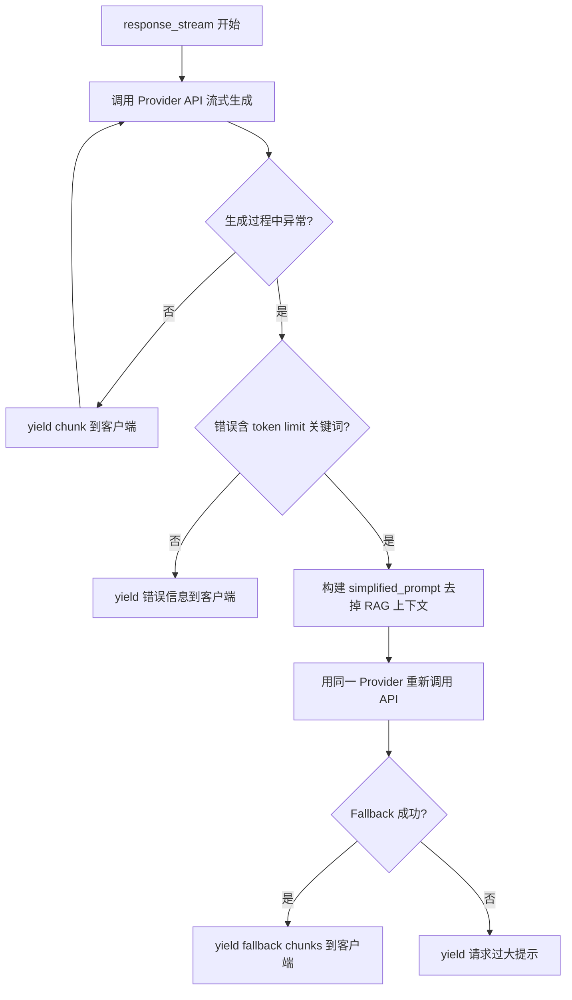
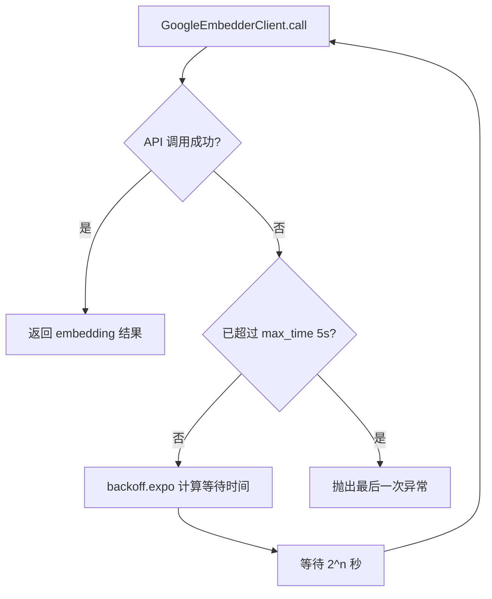
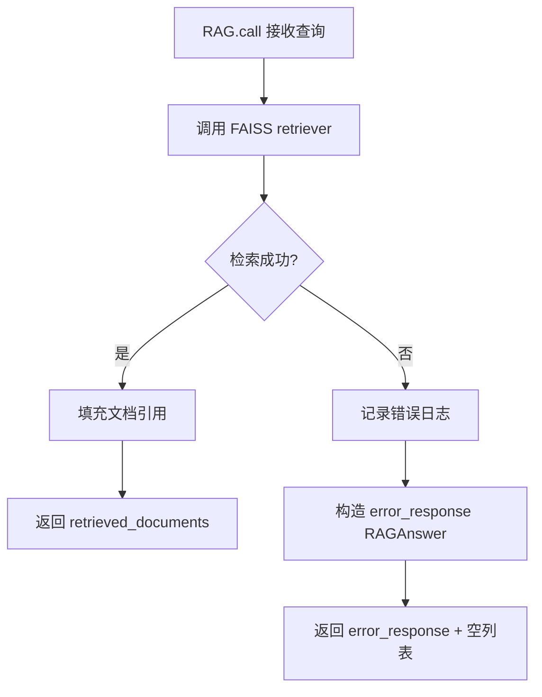

# PD-03.06 DeepWiki — 流式 Token 超限 Fallback 与多层指数退避

> 文档编号：PD-03.06
> 来源：DeepWiki `api/simple_chat.py` `api/google_embedder_client.py` `api/rag.py`
> GitHub：https://github.com/AsyncFuncAI/deepwiki-open.git
> 问题域：PD-03 容错与重试 Fault Tolerance & Retry
> 状态：可复用方案

---

## 第 1 章 问题与动机

### 1.1 核心问题

DeepWiki 是一个将 Git 仓库转化为交互式 Wiki 的系统，其核心流程是：克隆仓库 → 文档切分 → Embedding 向量化 → RAG 检索 → LLM 流式生成。这条链路上每一步都可能失败：

1. **Embedding API 调用失败**：Google/OpenAI/DashScope 等 Embedding 服务可能因速率限制、网络超时、服务不可用而失败
2. **RAG 检索失败**：FAISS 检索器可能因 Embedding 维度不一致、索引损坏而抛异常
3. **LLM 流式响应中途失败**：流式生成过程中检测到 token limit 错误，此时已经开始向客户端推送数据
4. **多 Provider 异构错误**：支持 7 种 LLM Provider（Google/OpenAI/OpenRouter/Ollama/Bedrock/Azure/DashScope），每种的错误类型和格式不同

最棘手的是第 3 点：流式响应已经开始，无法简单返回 HTTP 错误码，必须在流内部实现 fallback。

### 1.2 DeepWiki 的解法概述

1. **流式 Token 超限检测 + 无上下文 Fallback**：在 `response_stream()` 生成器内部捕获异常，检测 token limit 关键词，自动构建去掉 RAG 上下文的简化 prompt 重试（`api/simple_chat.py:564-733`）
2. **Embedding 层指数退避重试**：`GoogleEmbedderClient.call()` 使用 `@backoff.on_exception(backoff.expo, max_time=5)` 装饰器自动重试（`api/google_embedder_client.py:206-253`）
3. **RAG 检索优雅降级**：`RAG.call()` 捕获检索异常后返回错误响应对象而非抛异常，上层继续无 RAG 回答（`api/rag.py:426-445`）
4. **Embedding 维度不一致过滤**：`_validate_and_filter_embeddings()` 两遍扫描过滤异常维度的文档，避免 FAISS 索引构建失败（`api/rag.py:251-343`）
5. **多 Provider 统一 backoff 装饰器**：OpenAI/Azure/DashScope/Bedrock 客户端均使用相同的 `@backoff.on_exception` 模式，捕获各自的异常类型

### 1.3 设计思想

| 设计原则 | 具体实现 | 理由 | 替代方案 |
|----------|----------|------|----------|
| 流内 Fallback | 在 async generator 内部 try/except 并重建 prompt 重试 | 流式响应已开始，无法返回 HTTP 错误 | 预检 token 数量（但无法精确预测 LLM 实际消耗） |
| 装饰器级重试 | `@backoff.on_exception` 统一应用于所有 API 客户端 | 重试逻辑与业务逻辑解耦，一行代码即可添加 | 手动 for 循环重试（代码重复） |
| 两遍扫描过滤 | 先统计 embedding 维度分布，再按众数过滤 | 混合维度会导致 FAISS 崩溃，众数策略保留最多有效文档 | 严格要求所有维度一致（一个失败全部失败） |
| 错误字符串匹配 | 用 `"maximum context length" in error_message` 检测 token 超限 | 不同 Provider 的错误格式不统一，字符串匹配是最通用的方式 | 按异常类型分类（需要为每个 Provider 维护异常映射） |
| 降级而非中断 | RAG 失败时继续无 RAG 回答，而非返回错误 | 用户体验优先：有回答总比没回答好 | 严格模式：RAG 失败则拒绝回答 |

---

## 第 2 章 源码实现分析

### 2.1 架构概览

DeepWiki 的容错体系分为三层：

```
┌─────────────────────────────────────────────────────────┐
│                    HTTP 请求层                            │
│  simple_chat.py: chat_completions_stream()               │
│  ┌─────────────────────────────────────────────────────┐ │
│  │ 流式响应层 response_stream()                         │ │
│  │  ├─ 正常路径: Provider API → yield chunks            │ │
│  │  └─ Token 超限: 检测错误 → 去上下文 → 重试 → yield   │ │
│  └─────────────────────────────────────────────────────┘ │
├─────────────────────────────────────────────────────────┤
│                    RAG 检索层                             │
│  rag.py: RAG.call()                                      │
│  ├─ 正常路径: FAISS 检索 → 返回文档                      │
│  ├─ 异常路径: 捕获异常 → 返回 error_response             │
│  └─ 预处理: _validate_and_filter_embeddings() 过滤坏向量  │
├─────────────────────────────────────────────────────────┤
│                  Embedding/API 客户端层                    │
│  google_embedder_client.py / openai_client.py / ...      │
│  └─ @backoff.on_exception(backoff.expo, max_time=5)      │
│     自动指数退避重试                                      │
└─────────────────────────────────────────────────────────┘
```

### 2.2 核心实现

#### 2.2.1 流式 Token 超限 Fallback



对应源码 `api/simple_chat.py:559-733`：

```python
except Exception as e_outer:
    logger.error(f"Error in streaming response: {str(e_outer)}")
    error_message = str(e_outer)

    # Check for token limit errors
    if "maximum context length" in error_message or \
       "token limit" in error_message or \
       "too many tokens" in error_message:
        # If we hit a token limit error, try again without context
        logger.warning("Token limit exceeded, retrying without context")
        try:
            # Create a simplified prompt without context
            simplified_prompt = f"/no_think {system_prompt}\n\n"
            if conversation_history:
                simplified_prompt += f"<conversation_history>\n{conversation_history}</conversation_history>\n\n"
            if request.filePath and file_content:
                simplified_prompt += f"<currentFileContent path=\"{request.filePath}\">\n{file_content}\n</currentFileContent>\n\n"
            simplified_prompt += "<note>Answering without retrieval augmentation due to input size constraints.</note>\n\n"
            simplified_prompt += f"<query>\n{query}\n</query>\n\nAssistant: "

            # 按 Provider 类型分别处理 fallback 调用
            if request.provider == "ollama":
                fallback_api_kwargs = model.convert_inputs_to_api_kwargs(
                    input=simplified_prompt, model_kwargs=model_kwargs, model_type=ModelType.LLM)
                fallback_response = await model.acall(
                    api_kwargs=fallback_api_kwargs, model_type=ModelType.LLM)
                async for chunk in fallback_response:
                    text = getattr(chunk, 'response', None) or getattr(chunk, 'text', None) or str(chunk)
                    if text and not text.startswith('model=') and not text.startswith('created_at='):
                        text = text.replace('<think>', '').replace('</think>', '')
                        yield text
            # ... 其他 Provider 的 fallback 处理（openrouter, openai, bedrock, azure, dashscope, google）
```

关键设计点：
- **错误检测用字符串匹配**（`simple_chat.py:564`）：三个关键词覆盖主流 Provider 的 token 超限错误格式
- **Fallback 策略是去掉 RAG 上下文**（`simple_chat.py:569-578`）：保留 system_prompt + conversation_history + file_content，只去掉 `context_text`（RAG 检索结果）
- **每个 Provider 独立处理 fallback**（`simple_chat.py:580-730`）：因为不同 Provider 的 API 调用方式和响应格式不同

#### 2.2.2 Embedding 指数退避重试



对应源码 `api/google_embedder_client.py:206-253`：

```python
@backoff.on_exception(
    backoff.expo,
    (Exception,),  # Google AI may raise various exceptions
    max_time=5,
)
def call(self, api_kwargs: Dict = {}, model_type: ModelType = ModelType.UNDEFINED):
    if model_type != ModelType.EMBEDDER:
        raise ValueError(f"GoogleEmbedderClient only supports EMBEDDER model type")

    safe_log_kwargs = {k: v for k, v in api_kwargs.items() if k not in {"content", "contents"}}
    log.info("Google AI Embeddings call kwargs (sanitized): %s", safe_log_kwargs)

    try:
        if "content" in api_kwargs:
            response = genai.embed_content(**api_kwargs)
        elif "contents" in api_kwargs:
            kwargs = api_kwargs.copy()
            contents = kwargs.pop("contents")
            response = genai.embed_content(content=contents, **kwargs)
        else:
            raise ValueError("Either 'content' or 'contents' must be provided")
        return response
    except Exception as e:
        log.error(f"Error calling Google AI Embeddings API: {e}")
        raise
```

关键设计点：
- **`max_time=5` 而非 `max_tries`**（`google_embedder_client.py:209`）：用时间上限而非次数上限，因为 Embedding 调用通常很快，5 秒内可以重试 2-3 次
- **捕获 `(Exception,)` 通用异常**（`google_embedder_client.py:208`）：Google AI SDK 可能抛出多种异常类型，用通用捕获确保都能重试
- **日志脱敏**（`google_embedder_client.py:224`）：重试前记录日志但排除 content/contents 字段，避免日志膨胀

#### 2.2.3 RAG 检索优雅降级



对应源码 `api/rag.py:416-445`：

```python
def call(self, query: str, language: str = "en") -> Tuple[List]:
    try:
        retrieved_documents = self.retriever(query)
        retrieved_documents[0].documents = [
            self.transformed_docs[doc_index]
            for doc_index in retrieved_documents[0].doc_indices
        ]
        return retrieved_documents
    except Exception as e:
        logger.error(f"Error in RAG call: {str(e)}")
        error_response = RAGAnswer(
            rationale="Error occurred while processing the query.",
            answer=f"I apologize, but I encountered an error while processing your question. Please try again or rephrase your question."
        )
        return error_response, []
```

上层调用处 `api/simple_chat.py:200-234` 的双层 try/except：

```python
try:
    rag_query = query
    if request.filePath:
        rag_query = f"Contexts related to {request.filePath}"
    try:
        retrieved_documents = request_rag(rag_query, language=request.language)
        if retrieved_documents and retrieved_documents[0].documents:
            # 正常处理检索结果...
            documents = retrieved_documents[0].documents
            # 按文件路径分组格式化上下文
        else:
            logger.warning("No documents retrieved from RAG")
    except Exception as e:
        logger.error(f"Error in RAG retrieval: {str(e)}")
        # Continue without RAG if there's an error
except Exception as e:
    logger.error(f"Error retrieving documents: {str(e)}")
    context_text = ""
```

### 2.3 实现细节

#### Embedding 维度不一致过滤

`api/rag.py:251-343` 实现了两遍扫描策略：

1. **第一遍**：遍历所有文档，统计每种 embedding 维度出现的次数
2. **确定目标维度**：取出现次数最多的维度作为 `target_size`
3. **第二遍**：只保留维度等于 `target_size` 的文档，过滤掉异常维度

这解决了一个实际问题：当 Embedding API 部分失败时（如某些文档因 token 超限被截断），返回的向量维度可能不一致，直接传给 FAISS 会导致 `"All embeddings should be of the same size"` 错误。

#### Token 计数降级

`api/data_pipeline.py:27-70` 的 `count_tokens()` 函数在 tiktoken 编码失败时降级为字符数除以 4 的粗略估算：

```python
except Exception as e:
    logger.warning(f"Error counting tokens with tiktoken: {e}")
    return len(text) // 4  # Rough approximation fallback
```

#### 多 Provider 统一 backoff 模式

OpenAI 客户端（`api/openai_client.py:400-410`）的 backoff 装饰器精确捕获 5 种异常：

```python
@backoff.on_exception(
    backoff.expo,
    (
        APITimeoutError,
        InternalServerError,
        RateLimitError,
        UnprocessableEntityError,
        BadRequestError,
    ),
    max_time=5,
)
def call(self, api_kwargs: Dict = {}, model_type: ModelType = ModelType.UNDEFINED):
```

与 Google Embedder 的 `(Exception,)` 通用捕获不同，OpenAI 客户端精确列出了可重试的异常类型，避免对不可恢复的错误（如认证失败）进行无意义重试。

---

## 第 3 章 迁移指南

### 3.1 迁移清单

**阶段 1：Embedding 层重试（1 个文件）**
- [ ] 安装 `backoff` 库：`pip install backoff`
- [ ] 在 Embedding 客户端的 `call()` 方法上添加 `@backoff.on_exception` 装饰器
- [ ] 配置 `max_time` 或 `max_tries`，根据业务场景选择

**阶段 2：RAG 检索降级（1 个文件）**
- [ ] 在 RAG 检索调用处添加 try/except
- [ ] 设计降级响应对象（如 `ErrorResponse`）
- [ ] 确保上层代码能处理降级响应（检查返回类型）

**阶段 3：流式 Fallback（核心，1 个文件）**
- [ ] 在流式生成器内部添加外层 try/except
- [ ] 定义 token 超限错误的检测关键词列表
- [ ] 实现 simplified_prompt 构建逻辑（去掉最大的上下文块）
- [ ] 为每个 Provider 实现 fallback 调用路径
- [ ] 添加 fallback 失败时的最终降级消息

### 3.2 适配代码模板

#### 通用流式 Fallback 模板

```python
import backoff
from typing import AsyncGenerator

# 1. Embedding 层重试装饰器
@backoff.on_exception(
    backoff.expo,
    (Exception,),
    max_time=10,
    on_backoff=lambda details: logger.warning(
        f"Embedding retry #{details['tries']} after {details['wait']:.1f}s"
    ),
)
def embed_with_retry(client, text: str):
    """带指数退避的 Embedding 调用"""
    return client.embed(text)


# 2. RAG 检索降级包装
def safe_rag_retrieve(retriever, query: str, fallback_context: str = ""):
    """RAG 检索失败时返回空上下文而非抛异常"""
    try:
        docs = retriever.retrieve(query)
        if docs:
            return "\n\n".join(doc.text for doc in docs)
        return fallback_context
    except Exception as e:
        logger.error(f"RAG retrieval failed: {e}")
        return fallback_context


# 3. 流式 Token 超限 Fallback
TOKEN_LIMIT_KEYWORDS = [
    "maximum context length",
    "token limit",
    "too many tokens",
    "context_length_exceeded",
    "max_tokens",
]

async def stream_with_fallback(
    llm_client,
    full_prompt: str,
    system_prompt: str,
    query: str,
    model_kwargs: dict,
) -> AsyncGenerator[str, None]:
    """流式生成，token 超限时自动 fallback 到无上下文 prompt"""
    try:
        async for chunk in llm_client.stream(full_prompt, **model_kwargs):
            yield chunk
    except Exception as e:
        error_msg = str(e).lower()
        if any(kw in error_msg for kw in TOKEN_LIMIT_KEYWORDS):
            logger.warning("Token limit hit, falling back to simplified prompt")
            simplified = f"{system_prompt}\n\n<query>{query}</query>"
            try:
                async for chunk in llm_client.stream(simplified, **model_kwargs):
                    yield chunk
            except Exception as e2:
                logger.error(f"Fallback also failed: {e2}")
                yield "\n[Error: Request too large. Please try a shorter query.]"
        else:
            yield f"\n[Error: {str(e)}]"
```

### 3.3 适用场景

| 场景 | 适用度 | 说明 |
|------|--------|------|
| RAG + LLM 流式应用 | ⭐⭐⭐ | 完美匹配：RAG 上下文是最大的 token 消耗源，去掉它是最有效的降级 |
| 多 Provider LLM 网关 | ⭐⭐⭐ | backoff 装饰器模式可直接复用到任何 API 客户端 |
| Embedding 批量处理 | ⭐⭐⭐ | 指数退避 + 维度过滤组合解决批量 Embedding 的常见问题 |
| 非流式 LLM 调用 | ⭐⭐ | 非流式场景可以直接返回 HTTP 错误码，不需要流内 fallback |
| 实时对话系统 | ⭐⭐ | fallback 会导致延迟增加，实时场景需要权衡 |

---

## 第 4 章 测试用例

```python
import pytest
from unittest.mock import AsyncMock, MagicMock, patch
from dataclasses import dataclass


# ---- 测试 Token 超限检测 ----

TOKEN_LIMIT_KEYWORDS = [
    "maximum context length",
    "token limit",
    "too many tokens",
]

def is_token_limit_error(error_message: str) -> bool:
    """从 simple_chat.py:564 提取的检测逻辑"""
    return any(kw in error_message for kw in TOKEN_LIMIT_KEYWORDS)


class TestTokenLimitDetection:
    def test_openai_token_limit(self):
        assert is_token_limit_error(
            "This model's maximum context length is 128000 tokens"
        )

    def test_generic_token_limit(self):
        assert is_token_limit_error("token limit exceeded for this request")

    def test_too_many_tokens(self):
        assert is_token_limit_error("Request has too many tokens: 150000")

    def test_unrelated_error(self):
        assert not is_token_limit_error("Connection timeout after 30s")

    def test_rate_limit_not_matched(self):
        assert not is_token_limit_error("Rate limit exceeded, retry after 60s")


# ---- 测试 Embedding 维度过滤 ----

@dataclass
class MockDocument:
    vector: list
    meta_data: dict

class TestEmbeddingDimensionFilter:
    def _filter(self, documents):
        """从 rag.py:251-343 提取的过滤逻辑简化版"""
        if not documents:
            return []
        embedding_sizes = {}
        for doc in documents:
            if doc.vector is not None:
                size = len(doc.vector)
                embedding_sizes[size] = embedding_sizes.get(size, 0) + 1
        if not embedding_sizes:
            return []
        target_size = max(embedding_sizes.keys(), key=lambda k: embedding_sizes[k])
        return [doc for doc in documents if doc.vector is not None and len(doc.vector) == target_size]

    def test_all_same_dimension(self):
        docs = [MockDocument(vector=[0.1]*768, meta_data={}) for _ in range(5)]
        assert len(self._filter(docs)) == 5

    def test_mixed_dimensions_keeps_majority(self):
        docs = [
            MockDocument(vector=[0.1]*768, meta_data={}),
            MockDocument(vector=[0.1]*768, meta_data={}),
            MockDocument(vector=[0.1]*768, meta_data={}),
            MockDocument(vector=[0.1]*256, meta_data={}),  # 异常维度
        ]
        result = self._filter(docs)
        assert len(result) == 3
        assert all(len(d.vector) == 768 for d in result)

    def test_empty_documents(self):
        assert self._filter([]) == []

    def test_all_none_vectors(self):
        docs = [MockDocument(vector=None, meta_data={}) for _ in range(3)]
        assert self._filter(docs) == []


# ---- 测试 RAG 降级 ----

class TestRAGGracefulDegradation:
    def test_retrieval_error_returns_error_response(self):
        """模拟 rag.py:437-445 的降级行为"""
        class MockRAG:
            def call(self, query):
                try:
                    raise RuntimeError("FAISS index corrupted")
                except Exception as e:
                    return {"rationale": "Error occurred", "answer": "Please try again"}, []

        rag = MockRAG()
        result, docs = rag.call("test query")
        assert result["answer"] == "Please try again"
        assert docs == []

    def test_no_documents_returns_warning(self):
        """模拟 simple_chat.py:230-231 的空结果处理"""
        retrieved = None
        context_text = ""
        if not retrieved:
            context_text = ""
        assert context_text == ""


# ---- 测试 Token 计数降级 ----

class TestTokenCountFallback:
    def test_fallback_approximation(self):
        """模拟 data_pipeline.py:66-70 的降级逻辑"""
        text = "Hello world, this is a test sentence."
        # 正常情况用 tiktoken，失败时用 len(text) // 4
        fallback_count = len(text) // 4
        assert fallback_count == 9  # 37 // 4 = 9
        assert fallback_count > 0
```

---


## 第 5 章 跨域关联

| 关联域 | 关系类型 | 说明 |
|--------|----------|------|
| PD-01 上下文管理 | 强依赖 | Token 超限 Fallback 的本质是上下文管理的应急手段——当上下文超出窗口时，通过去掉 RAG 上下文来缩减 prompt 长度。DeepWiki 的 `input_too_large` 预检（`simple_chat.py:81-89`）也是上下文管理的一部分 |
| PD-08 搜索与检索 | 协同 | RAG 检索层的优雅降级直接影响容错策略。检索失败时 `context_text` 为空，LLM 仍可回答但质量下降。Embedding 维度过滤（`rag.py:251-343`）是检索层的防御性措施 |
| PD-04 工具系统 | 协同 | 多 Provider 客户端（OpenAI/Google/Azure/DashScope/Bedrock/OpenRouter/Ollama）各自实现 backoff 重试，属于工具系统的容错层。Provider 选择逻辑在 `config.py` 的 `get_model_config()` 中 |
| PD-11 可观测性 | 协同 | 每次重试、降级、fallback 都有 `logger.error/warning` 记录，但缺少结构化的重试指标（如重试次数、降级频率）。可以通过 PD-11 的 OTel 集成增强 |

---

## 第 6 章 来源文件索引

| 文件 | 行范围 | 关键实现 |
|------|--------|----------|
| `api/simple_chat.py` | L76-77 | `chat_completions_stream()` 入口，FastAPI 流式端点 |
| `api/simple_chat.py` | L81-89 | `input_too_large` 预检：token 数 > 8000 时标记 |
| `api/simple_chat.py` | L116-129 | Retriever 准备阶段的异常处理：embedding 不一致检测 |
| `api/simple_chat.py` | L191-238 | RAG 检索双层 try/except：外层捕获文档检索错误，内层捕获 RAG 调用错误 |
| `api/simple_chat.py` | L464-558 | 正常流式响应路径：按 Provider 类型分发 |
| `api/simple_chat.py` | L559-736 | Token 超限 Fallback 核心：错误检测 + simplified_prompt 构建 + 多 Provider fallback |
| `api/google_embedder_client.py` | L206-253 | `@backoff.on_exception(backoff.expo, (Exception,), max_time=5)` 指数退避重试 |
| `api/rag.py` | L251-343 | `_validate_and_filter_embeddings()` 两遍扫描过滤异常维度 |
| `api/rag.py` | L416-445 | `RAG.call()` 检索异常捕获 + 错误响应构造 |
| `api/rag.py` | L59-89 | `Memory.call()` 对话历史访问的防御性编程 + 自动恢复 |
| `api/openai_client.py` | L29-35 | OpenAI 异常类型导入：APITimeoutError, RateLimitError 等 |
| `api/openai_client.py` | L400-410 | OpenAI 客户端 backoff 装饰器：精确捕获 5 种异常 |
| `api/data_pipeline.py` | L27-70 | `count_tokens()` tiktoken 失败时降级为 `len(text) // 4` |
| `api/data_pipeline.py` | L871-895 | 数据库加载失败时降级为重新构建 |

---

## 第 7 章 横向对比维度

> **重要：** 本章用于自动填充 Butcher Wiki 的横向对比表。
> 必须严格按以下 JSON 格式输出，放在 `comparison_data` 代码块中。

```json comparison_data
{
  "project": "DeepWiki",
  "dimensions": {
    "截断/错误检测": "流式响应中字符串匹配 3 个 token limit 关键词",
    "重试/恢复策略": "backoff.on_exception 指数退避，max_time=5s",
    "超时保护": "OpenRouter 60s 超时，Ollama 健康检查 5s 超时",
    "优雅降级": "RAG 失败继续无 RAG 回答，token 超限去上下文重试",
    "重试策略": "Embedding 层通用 Exception 重试，OpenAI 层精确 5 类异常重试",
    "降级方案": "去掉 RAG 上下文构建 simplified_prompt 重试",
    "错误分类": "token 超限 vs 其他错误二分法，按字符串匹配",
    "恢复机制": "Memory 对话历史损坏时自动重建 CustomConversation",
    "输出验证": "Embedding 维度两遍扫描过滤，按众数保留一致维度",
    "连接池管理": "无连接池，每次请求新建 RAG 实例和 Provider 客户端"
  }
}
```

### 域元数据补充

```json domain_metadata
{
  "solution_summary": "DeepWiki 在流式响应生成器内部检测 token limit 错误关键词后自动去掉 RAG 上下文构建 simplified_prompt 重试，Embedding 层用 backoff.expo 指数退避，RAG 检索失败时优雅降级为无 RAG 回答",
  "description": "流式响应中途失败时的流内 fallback 策略，区别于请求前的预检机制",
  "sub_problems": [
    "流式响应已开始推送后发生 token 超限：无法返回 HTTP 错误码，必须在 async generator 内部实现 fallback",
    "Embedding 批量处理中部分文档维度不一致：混合维度导致 FAISS 索引构建失败，需要按众数过滤",
    "多 Provider 异构错误格式：7 种 Provider 的 token 超限错误消息格式不同，需要通用检测策略"
  ],
  "best_practices": [
    "流式 fallback 应保留 system_prompt 和 conversation_history，只去掉最大的上下文块（RAG 结果）",
    "Embedding 维度过滤用两遍扫描 + 众数策略，比严格一致性检查更鲁棒",
    "backoff 装饰器用 max_time 而非 max_tries 控制重试上限，适合延迟敏感场景"
  ]
}
```

