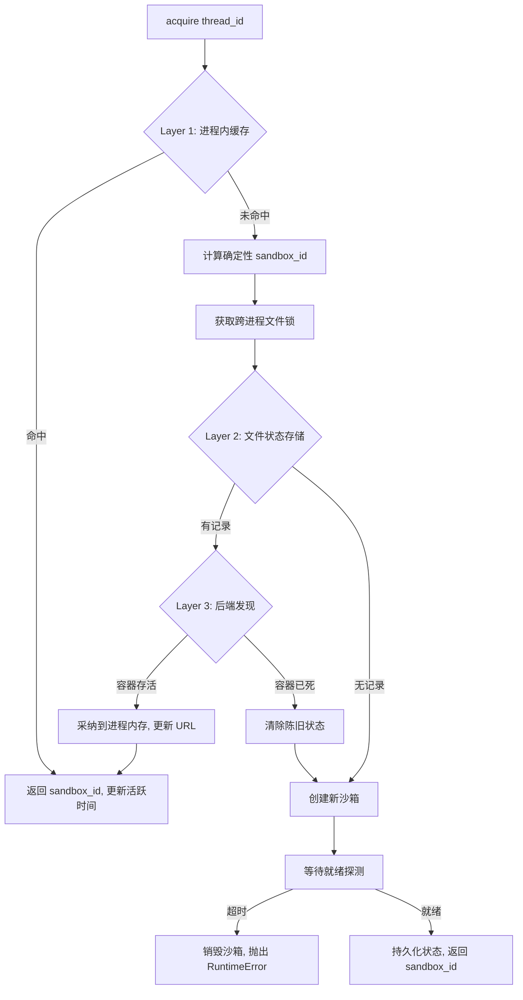
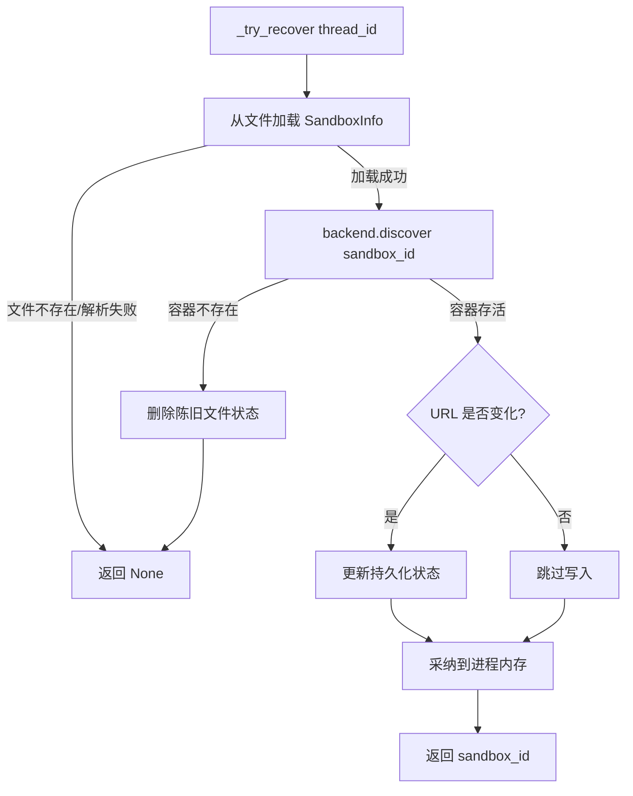

# PD-03.03 DeerFlow — 三层一致性恢复与沙箱容错体系

> 文档编号：PD-03.03
> 来源：DeerFlow `backend/src/community/aio_sandbox/aio_sandbox_provider.py`, `backend/src/community/aio_sandbox/file_state_store.py`, `backend/src/community/aio_sandbox/backend.py`
> GitHub：https://github.com/bytedance/deer-flow.git
> 问题域：PD-03 容错与重试 Fault Tolerance & Retry
> 状态：可复用方案

---

## 第 1 章 问题与动机（≥ 30 行）

### 1.1 核心问题

Agent 系统中的沙箱（Sandbox）是代码执行的隔离环境，通常以容器形式运行。沙箱的生命周期管理面临多层容错挑战：

1. **跨进程沙箱丢失**：同一个 thread 的请求可能被不同进程处理（如 Gunicorn 多 worker、K8s 多 Pod），进程 A 创建的沙箱在进程 B 中不可见，导致重复创建或找不到已有沙箱。
2. **容器意外终止**：Docker/Apple Container 可能因 OOM、手动 stop 或宿主机重启而消失，持久化的状态指向一个已不存在的容器。
3. **端口漂移**：容器重启后端口可能变化，持久化的 URL 失效。
4. **进程崩溃后资源泄漏**：进程异常退出时未清理容器，导致孤儿容器占用端口和内存。
5. **空闲资源浪费**：长时间无请求的沙箱持续占用资源，在多租户场景下尤为严重。
6. **运行时检测降级**：macOS 上 Apple Container 可能未安装，需要自动降级到 Docker。
7. **文件锁竞态**：多进程同时尝试为同一 thread 创建沙箱时的竞态条件。

这些问题的共同特征是：**沙箱状态分散在进程内存、文件系统和容器运行时三个层面**，任何一层的不一致都会导致系统故障。

### 1.2 DeerFlow 的解法概述

DeerFlow 2.0 的 AioSandboxProvider 实现了一套完整的沙箱容错体系：

1. **三层一致性恢复**（`aio_sandbox_provider.py:327-359`）：进程内缓存 → 跨进程状态存储 → 后端发现，逐层降级查找已有沙箱
2. **跨进程文件锁**（`file_state_store.py:81-102`）：基于 `fcntl.flock` 的互斥锁，防止多进程竞态创建
3. **确定性 ID 生成**（`aio_sandbox_provider.py:174-181`）：SHA256 哈希确保不同进程为同一 thread 生成相同的 sandbox_id
4. **信号处理优雅关闭**（`aio_sandbox_provider.py:274-292`）：SIGTERM/SIGINT 触发容器清理，保留原始信号处理器链
5. **空闲超时回收**（`aio_sandbox_provider.py:236-270`）：后台守护线程定期检查并释放空闲沙箱
6. **运行时自动检测**（`local_backend.py:63-88`）：Apple Container → Docker 自动降级
7. **就绪轮询**（`backend.py:16-35`）：创建后轮询健康端点，超时则销毁并报错

### 1.3 设计思想

| 设计原则 | 具体实现 | 理由 | 替代方案 |
|----------|----------|------|----------|
| 确定性寻址 | SHA256(thread_id)[:8] 作为 sandbox_id | 不同进程无需通信即可定位同一沙箱 | UUID（需要共享存储传递 ID） |
| 逐层降级 | 内存缓存 → 文件状态 → 容器发现 | 快路径零 IO，慢路径仍能恢复 | 单一 Redis 存储（增加外部依赖） |
| 悲观锁 | fcntl.flock 排他锁 | 防止多进程同时创建同一 thread 的沙箱 | 乐观锁 + CAS（文件系统不支持原子 CAS） |
| 幂等关闭 | `_shutdown_called` 标志位 | atexit + signal 可能重复触发 | 引用计数（过度设计） |
| 资源清理分离 | 先清内存，再清文件，最后清容器 | 任一步骤失败不影响后续清理 | 事务式全有全无（容器清理无法回滚） |
| 健康探测 | 轮询 /v1/sandbox 端点 | 容器启动到服务就绪有延迟 | TCP 端口探测（服务未就绪也可能端口已开） |

---

## 第 2 章 源码实现分析（核心章节）

### 2.1 架构概览

DeerFlow 的沙箱容错体系由四个核心组件构成：

```
┌─────────────────────────────────────────────────────────────────┐
│                    AioSandboxProvider                            │
│  ┌──────────────┐  ┌──────────────────┐  ┌──────────────────┐  │
│  │ In-Process   │  │ FileSandboxState  │  │ SandboxBackend   │  │
│  │ Cache        │  │ Store (JSON+flock)│  │ (Local/Remote)   │  │
│  │ (Layer 1)    │  │ (Layer 2)         │  │ (Layer 3)        │  │
│  └──────┬───────┘  └────────┬─────────┘  └────────┬─────────┘  │
│         │ miss              │ miss                 │ discover   │
│         └──────────────────►└─────────────────────►│            │
│                                                     │            │
│  ┌──────────────┐  ┌──────────────────┐            │            │
│  │ IdleChecker  │  │ SignalHandler    │            │            │
│  │ (daemon thd) │  │ (SIGTERM/SIGINT) │            │            │
│  └──────────────┘  └──────────────────┘            │            │
└─────────────────────────────────────────────────────┼────────────┘
                                                      │
                              ┌────────────────────────┼────────────┐
                              │                        ▼            │
                              │  ┌──────────────┐  ┌──────────┐   │
                              │  │ LocalBackend │  │ Remote   │   │
                              │  │ (Docker/AC)  │  │ Backend  │   │
                              │  └──────────────┘  │ (K8s)    │   │
                              │                     └──────────┘   │
                              └────────────────────────────────────┘
```

### 2.2 核心实现

#### 2.2.1 三层一致性恢复



对应源码 `aio_sandbox_provider.py:327-359`：

```python
def _acquire_internal(self, thread_id: str | None) -> str:
    """Internal sandbox acquisition with three-layer consistency.

    Layer 1: In-process cache (fastest, covers same-process repeated access)
    Layer 2: Cross-process state store + file lock (covers multi-process)
    Layer 3: Backend discovery (covers containers started by other processes)
    """
    # ── Layer 1: In-process cache (fast path) ──
    if thread_id:
        with self._lock:
            if thread_id in self._thread_sandboxes:
                existing_id = self._thread_sandboxes[thread_id]
                if existing_id in self._sandboxes:
                    logger.info(f"Reusing in-process sandbox {existing_id} for thread {thread_id}")
                    self._last_activity[existing_id] = time.time()
                    return existing_id
                else:
                    del self._thread_sandboxes[thread_id]

    # Deterministic ID for thread-specific, random for anonymous
    sandbox_id = self._deterministic_sandbox_id(thread_id) if thread_id else str(uuid.uuid4())[:8]

    # ── Layer 2 & 3: Cross-process recovery + creation ──
    if thread_id:
        with self._state_store.lock(thread_id):
            recovered_id = self._try_recover(thread_id)
            if recovered_id is not None:
                return recovered_id
            return self._create_sandbox(thread_id, sandbox_id)
    else:
        return self._create_sandbox(thread_id, sandbox_id)
```

关键设计点：
- Layer 1 使用 `threading.Lock` 保护进程内字典，零 IO 开销
- Layer 2 进入前先获取 `fcntl.flock` 跨进程锁（`file_state_store.py:94-95`）
- Layer 3 的 `_try_recover` 调用 `backend.discover()` 验证容器是否真正存活

#### 2.2.2 跨进程恢复与陈旧状态清理



对应源码 `aio_sandbox_provider.py:361-397`：

```python
def _try_recover(self, thread_id: str) -> str | None:
    info = self._state_store.load(thread_id)
    if info is None:
        return None

    # Re-discover: verifies sandbox is alive and gets current connection info
    # (handles cases like port changes after container restart)
    discovered = self._backend.discover(info.sandbox_id)
    if discovered is None:
        logger.info(f"Persisted sandbox {info.sandbox_id} for thread {thread_id} could not be recovered")
        self._state_store.remove(thread_id)
        return None

    # Adopt into this process's memory
    sandbox = AioSandbox(id=discovered.sandbox_id, base_url=discovered.sandbox_url)
    with self._lock:
        self._sandboxes[discovered.sandbox_id] = sandbox
        self._sandbox_infos[discovered.sandbox_id] = discovered
        self._last_activity[discovered.sandbox_id] = time.time()
        self._thread_sandboxes[thread_id] = discovered.sandbox_id

    # Update state if connection info changed
    if discovered.sandbox_url != info.sandbox_url:
        self._state_store.save(thread_id, discovered)

    return discovered.sandbox_id
```

### 2.3 实现细节

#### 2.3.1 确定性 ID 与跨进程寻址

`aio_sandbox_provider.py:174-181` 使用 SHA256 哈希生成确定性 sandbox_id：

```python
@staticmethod
def _deterministic_sandbox_id(thread_id: str) -> str:
    return hashlib.sha256(thread_id.encode()).hexdigest()[:8]
```

这确保了：进程 A 和进程 B 对同一 thread_id 计算出相同的 sandbox_id，从而能通过容器名（`deer-flow-sandbox-{sandbox_id}`）发现彼此创建的容器。

#### 2.3.2 文件锁互斥

`file_state_store.py:81-102` 使用 `fcntl.flock` 实现跨进程互斥：

```python
@contextmanager
def lock(self, thread_id: str) -> Generator[None, None, None]:
    thread_dir = self._thread_dir(thread_id)
    os.makedirs(thread_dir, exist_ok=True)
    lock_path = thread_dir / SANDBOX_LOCK_FILE
    lock_file = open(lock_path, "w")
    try:
        fcntl.flock(lock_file.fileno(), fcntl.LOCK_EX)
        yield
    finally:
        try:
            fcntl.flock(lock_file.fileno(), fcntl.LOCK_UN)
            lock_file.close()
        except OSError:
            pass
```

注意 `finally` 块中的 `except OSError: pass` — 即使解锁失败也不抛异常，因为进程退出时 OS 会自动释放 flock。

#### 2.3.3 信号处理与优雅关闭

`aio_sandbox_provider.py:274-292` 注册 SIGTERM/SIGINT 处理器：

```python
def _register_signal_handlers(self) -> None:
    self._original_sigterm = signal.getsignal(signal.SIGTERM)
    self._original_sigint = signal.getsignal(signal.SIGINT)

    def signal_handler(signum, frame):
        self.shutdown()
        original = self._original_sigterm if signum == signal.SIGTERM else self._original_sigint
        if callable(original):
            original(signum, frame)
        elif original == signal.SIG_DFL:
            signal.signal(signum, signal.SIG_DFL)
            signal.raise_signal(signum)

    try:
        signal.signal(signal.SIGTERM, signal_handler)
        signal.signal(signal.SIGINT, signal_handler)
    except ValueError:
        logger.debug("Could not register signal handlers (not main thread)")
```

设计要点：
- 保存并链式调用原始信号处理器，不破坏 FastAPI/Uvicorn 的关闭流程
- `except ValueError` 处理非主线程场景（Python 限制只有主线程能注册信号处理器）
- `shutdown()` 方法通过 `_shutdown_called` 标志位保证幂等性（`aio_sandbox_provider.py:479-481`）

#### 2.3.4 空闲超时回收

`aio_sandbox_provider.py:246-270` 实现后台守护线程定期清理：

```python
def _idle_checker_loop(self) -> None:
    idle_timeout = self._config.get("idle_timeout", DEFAULT_IDLE_TIMEOUT)
    while not self._idle_checker_stop.wait(timeout=IDLE_CHECK_INTERVAL):
        try:
            self._cleanup_idle_sandboxes(idle_timeout)
        except Exception as e:
            logger.error(f"Error in idle checker loop: {e}")
```

- 使用 `threading.Event.wait(timeout=60)` 替代 `time.sleep(60)`，支持即时停止
- 外层 `try/except` 确保单次清理失败不会终止守护线程
- 清理时逐个 release，单个失败不影响其他沙箱（`aio_sandbox_provider.py:266-270`）

#### 2.3.5 就绪轮询与创建失败回滚

`backend.py:16-35` 和 `aio_sandbox_provider.py:417-419`：

```python
# backend.py
def wait_for_sandbox_ready(sandbox_url: str, timeout: int = 30) -> bool:
    start_time = time.time()
    while time.time() - start_time < timeout:
        try:
            response = requests.get(f"{sandbox_url}/v1/sandbox", timeout=5)
            if response.status_code == 200:
                return True
        except requests.exceptions.RequestException:
            pass
        time.sleep(1)
    return False

# aio_sandbox_provider.py:417-419
if not wait_for_sandbox_ready(info.sandbox_url, timeout=60):
    self._backend.destroy(info)
    raise RuntimeError(f"Sandbox {sandbox_id} failed to become ready within timeout")
```

创建失败时立即销毁容器，避免孤儿资源。

#### 2.3.6 运行时自动检测与降级

`local_backend.py:63-88`：

```python
def _detect_runtime(self) -> str:
    import platform
    if platform.system() == "Darwin":
        try:
            result = subprocess.run(
                ["container", "--version"],
                capture_output=True, text=True, check=True, timeout=5,
            )
            return "container"
        except (FileNotFoundError, subprocess.CalledProcessError, subprocess.TimeoutExpired):
            logger.info("Apple Container not available, falling back to Docker")
    return "docker"
```

三种异常全部捕获：命令不存在、执行失败、超时，统一降级到 Docker。

#### 2.3.7 端口分配与异常回滚

`local_backend.py:106-112`：

```python
def create(self, thread_id, sandbox_id, extra_mounts=None) -> SandboxInfo:
    container_name = f"{self._container_prefix}-{sandbox_id}"
    port = get_free_port(start_port=self._base_port)
    try:
        container_id = self._start_container(container_name, port, extra_mounts)
    except Exception:
        release_port(port)
        raise
```

端口是稀缺资源，容器启动失败时必须立即释放，否则端口泄漏会导致后续创建全部失败。

#### 2.3.8 文件状态存储的防御性设计

`file_state_store.py:55-79` 对所有文件操作都做了异常捕获：

- `save()`: `OSError` → 警告日志，不抛异常（沙箱已创建，状态丢失只影响跨进程恢复）
- `load()`: `OSError | JSONDecodeError | KeyError` → 返回 None（触发重新创建）
- `remove()`: `OSError` → 警告日志（孤儿文件无害，下次 load 会覆盖）

这种"写失败不致命，读失败降级"的策略确保状态存储层的故障不会级联到沙箱创建流程。


---

## 第 3 章 迁移指南

### 3.1 迁移清单

**阶段 1：基础状态存储（1 个文件）**
- [ ] 实现 `SandboxStateStore` 抽象基类（save/load/remove/lock）
- [ ] 实现 `FileSandboxStateStore`（JSON + fcntl.flock）
- [ ] 确认目标平台支持 fcntl（Linux/macOS），Windows 需替换为 `msvcrt.locking`

**阶段 2：确定性 ID + 三层恢复（核心）**
- [ ] 实现确定性 ID 生成（SHA256 哈希截断）
- [ ] 实现三层 acquire 逻辑：进程缓存 → 文件状态 → 后端发现
- [ ] 实现 `_try_recover` 含陈旧状态清理

**阶段 3：生命周期管理**
- [ ] 实现信号处理器注册（SIGTERM/SIGINT）+ 原始处理器链式调用
- [ ] 实现空闲超时守护线程
- [ ] 实现幂等 shutdown

**阶段 4：后端抽象**
- [ ] 定义 `SandboxBackend` 抽象基类（create/destroy/is_alive/discover）
- [ ] 实现至少一个后端（Local 或 Remote）
- [ ] 实现 `wait_for_sandbox_ready` 就绪轮询

### 3.2 适配代码模板

以下是一个可直接复用的三层恢复 Provider 骨架：

```python
"""Minimal three-layer sandbox provider template."""

import hashlib
import threading
import time
from abc import ABC, abstractmethod
from contextlib import contextmanager
from pathlib import Path
from typing import Any, Generator

import fcntl
import json


class StateStore:
    """File-based state store with cross-process locking."""

    def __init__(self, base_dir: str):
        self._base = Path(base_dir) / ".sandbox-state"

    def _path(self, key: str) -> Path:
        return self._base / key

    def save(self, key: str, data: dict) -> None:
        path = self._path(key)
        path.parent.mkdir(parents=True, exist_ok=True)
        try:
            path.with_suffix(".json").write_text(json.dumps(data))
        except OSError:
            pass  # 写失败不致命

    def load(self, key: str) -> dict | None:
        path = self._path(key).with_suffix(".json")
        if not path.exists():
            return None
        try:
            return json.loads(path.read_text())
        except (OSError, json.JSONDecodeError, KeyError):
            return None

    def remove(self, key: str) -> None:
        try:
            self._path(key).with_suffix(".json").unlink(missing_ok=True)
        except OSError:
            pass

    @contextmanager
    def lock(self, key: str) -> Generator[None, None, None]:
        lock_path = self._path(key).with_suffix(".lock")
        lock_path.parent.mkdir(parents=True, exist_ok=True)
        f = open(lock_path, "w")
        try:
            fcntl.flock(f.fileno(), fcntl.LOCK_EX)
            yield
        finally:
            try:
                fcntl.flock(f.fileno(), fcntl.LOCK_UN)
                f.close()
            except OSError:
                pass


class ThreeLayerProvider:
    """Three-layer consistency sandbox provider."""

    def __init__(self, state_dir: str):
        self._lock = threading.Lock()
        self._cache: dict[str, Any] = {}       # Layer 1: in-process
        self._store = StateStore(state_dir)     # Layer 2: cross-process
        self._activity: dict[str, float] = {}

    @staticmethod
    def _deterministic_id(key: str) -> str:
        return hashlib.sha256(key.encode()).hexdigest()[:8]

    def acquire(self, key: str) -> str:
        # Layer 1: in-process cache
        with self._lock:
            if key in self._cache:
                self._activity[key] = time.time()
                return self._cache[key]

        resource_id = self._deterministic_id(key)

        # Layer 2+3: cross-process recovery
        with self._store.lock(key):
            # Layer 2: persisted state
            state = self._store.load(key)
            if state and self._is_alive(state):
                with self._lock:
                    self._cache[key] = state["id"]
                    self._activity[key] = time.time()
                return state["id"]
            elif state:
                self._store.remove(key)  # 清除陈旧状态

            # Layer 3: create new
            resource = self._create(resource_id)
            self._store.save(key, {"id": resource_id, "url": resource["url"]})
            with self._lock:
                self._cache[key] = resource_id
                self._activity[key] = time.time()
            return resource_id

    def _is_alive(self, state: dict) -> bool:
        """Override: check if resource is still alive."""
        raise NotImplementedError

    def _create(self, resource_id: str) -> dict:
        """Override: create a new resource."""
        raise NotImplementedError
```

### 3.3 适用场景

| 场景 | 适用度 | 说明 |
|------|--------|------|
| 多进程 Web 服务器（Gunicorn/Uvicorn） | ⭐⭐⭐ | 核心场景：多 worker 共享沙箱 |
| K8s 多 Pod 部署 | ⭐⭐⭐ | 需要共享 PVC 或替换为 Redis 状态存储 |
| 单进程开发环境 | ⭐⭐ | 三层恢复退化为 Layer 1 直接命中，无额外开销 |
| Serverless / Lambda | ⭐ | 无持久文件系统，需替换为 Redis/DynamoDB 状态存储 |
| 非容器化资源管理（如数据库连接池） | ⭐⭐ | 三层恢复模式可泛化，但需适配 discover 逻辑 |

---

## 第 4 章 测试用例

```python
"""Tests for three-layer sandbox consistency recovery."""

import hashlib
import json
import os
import tempfile
import threading
import time
from pathlib import Path
from unittest.mock import MagicMock, patch

import pytest


class TestDeterministicId:
    """Test deterministic sandbox ID generation."""

    def test_same_thread_same_id(self):
        """Same thread_id always produces same sandbox_id."""
        thread_id = "test-thread-123"
        id1 = hashlib.sha256(thread_id.encode()).hexdigest()[:8]
        id2 = hashlib.sha256(thread_id.encode()).hexdigest()[:8]
        assert id1 == id2

    def test_different_threads_different_ids(self):
        """Different thread_ids produce different sandbox_ids."""
        id1 = hashlib.sha256("thread-a".encode()).hexdigest()[:8]
        id2 = hashlib.sha256("thread-b".encode()).hexdigest()[:8]
        assert id1 != id2

    def test_id_length(self):
        """Sandbox ID is exactly 8 characters."""
        sid = hashlib.sha256("any-thread".encode()).hexdigest()[:8]
        assert len(sid) == 8


class TestFileStateStore:
    """Test file-based state store with cross-process locking."""

    def setup_method(self):
        self.tmpdir = tempfile.mkdtemp()

    def test_save_load_roundtrip(self):
        """State can be saved and loaded back."""
        state_file = Path(self.tmpdir) / "test" / "sandbox.json"
        state_file.parent.mkdir(parents=True, exist_ok=True)
        data = {"sandbox_id": "abc12345", "sandbox_url": "http://localhost:8080"}
        state_file.write_text(json.dumps(data))
        loaded = json.loads(state_file.read_text())
        assert loaded["sandbox_id"] == "abc12345"

    def test_load_missing_returns_none(self):
        """Loading non-existent state returns None."""
        state_file = Path(self.tmpdir) / "missing" / "sandbox.json"
        assert not state_file.exists()

    def test_load_corrupted_returns_none(self):
        """Loading corrupted JSON returns None gracefully."""
        state_file = Path(self.tmpdir) / "corrupt" / "sandbox.json"
        state_file.parent.mkdir(parents=True, exist_ok=True)
        state_file.write_text("not valid json{{{")
        try:
            json.loads(state_file.read_text())
            assert False, "Should have raised"
        except json.JSONDecodeError:
            pass  # Expected: graceful degradation

    def test_remove_idempotent(self):
        """Removing non-existent state doesn't raise."""
        state_file = Path(self.tmpdir) / "gone" / "sandbox.json"
        # Should not raise
        if state_file.exists():
            state_file.unlink()


class TestThreeLayerRecovery:
    """Test the three-layer consistency recovery logic."""

    def test_layer1_cache_hit(self):
        """Layer 1: in-process cache returns immediately."""
        cache = {"thread-1": "sandbox-abc"}
        activity = {"thread-1": time.time()}
        # Simulate cache hit
        assert "thread-1" in cache
        assert cache["thread-1"] == "sandbox-abc"

    def test_layer2_file_recovery(self):
        """Layer 2: recover from persisted file state."""
        tmpdir = tempfile.mkdtemp()
        state_file = Path(tmpdir) / "thread-1" / "sandbox.json"
        state_file.parent.mkdir(parents=True, exist_ok=True)
        state_file.write_text(json.dumps({
            "sandbox_id": "abc12345",
            "sandbox_url": "http://localhost:9090"
        }))
        loaded = json.loads(state_file.read_text())
        assert loaded["sandbox_id"] == "abc12345"

    def test_stale_state_cleanup(self):
        """Stale state is cleaned up when container is dead."""
        tmpdir = tempfile.mkdtemp()
        state_file = Path(tmpdir) / "thread-1" / "sandbox.json"
        state_file.parent.mkdir(parents=True, exist_ok=True)
        state_file.write_text(json.dumps({"sandbox_id": "dead"}))
        # Simulate: backend.discover returns None (container dead)
        # → remove stale state
        state_file.unlink()
        assert not state_file.exists()

    def test_concurrent_acquire_safety(self):
        """Multiple threads acquiring same thread_id don't create duplicates."""
        results = []
        lock = threading.Lock()

        def acquire():
            sid = hashlib.sha256("shared-thread".encode()).hexdigest()[:8]
            with lock:
                results.append(sid)

        threads = [threading.Thread(target=acquire) for _ in range(10)]
        for t in threads:
            t.start()
        for t in threads:
            t.join()

        # All threads should compute the same deterministic ID
        assert len(set(results)) == 1


class TestIdleTimeout:
    """Test idle sandbox cleanup."""

    def test_idle_detection(self):
        """Sandboxes idle beyond timeout are detected."""
        activity = {
            "active": time.time(),
            "idle": time.time() - 700,  # 700s > 600s default timeout
        }
        idle_timeout = 600
        idle_sandboxes = [
            sid for sid, last in activity.items()
            if time.time() - last > idle_timeout
        ]
        assert "idle" in idle_sandboxes
        assert "active" not in idle_sandboxes

    def test_shutdown_idempotent(self):
        """Shutdown can be called multiple times safely."""
        shutdown_count = 0
        shutdown_called = False

        def shutdown():
            nonlocal shutdown_count, shutdown_called
            if shutdown_called:
                return
            shutdown_called = True
            shutdown_count += 1

        shutdown()
        shutdown()
        shutdown()
        assert shutdown_count == 1
```


---

## 第 5 章 跨域关联

| 关联域 | 关系类型 | 说明 |
|--------|----------|------|
| PD-05 沙箱隔离 | 强依赖 | 本方案是 PD-05 沙箱隔离的容错补充。DeerFlow 的 `AioSandboxProvider` 同时实现了沙箱的创建隔离（PD-05）和故障恢复（PD-03）。参见 `PD-05-DeerFlow-Abstract-Sandbox-Provider双后端沙箱隔离.md` |
| PD-03 悬空工具调用 | 协同 | 本方案处理沙箱层面的容错，`PD-03-DeerFlow-悬空工具调用修复与双线程池超时保护.md` 处理 LLM 消息层面的容错。两者共同构成 DeerFlow 的完整容错体系 |
| PD-06 记忆持久化 | 协同 | 三层恢复中的 Layer 2（文件状态存储）与 PD-06 的持久化模式相似，都使用 JSON 文件 + 跨进程锁。参见 `PD-06-DeerFlow-LangGraph-Checkpoint持久化方案.md` |
| PD-11 可观测性 | 协同 | 每层恢复都有详细的 logger.info/warning 日志，便于追踪沙箱生命周期。与 `PD-11-DeerFlow-LangSmith追踪与Token预算守卫方案.md` 的日志体系互补 |
| PD-02 多 Agent 编排 | 依赖 | SubagentExecutor 的超时保护（PD-03.02）依赖本方案提供的沙箱环境。子 Agent 在沙箱中执行代码，沙箱恢复确保子 Agent 不会因沙箱丢失而失败 |

---

## 第 6 章 来源文件索引

| 文件 | 行范围 | 关键实现 |
|------|--------|----------|
| `backend/src/community/aio_sandbox/aio_sandbox_provider.py` | L48-L498 | AioSandboxProvider 完整实现：三层恢复、信号处理、空闲回收 |
| `backend/src/community/aio_sandbox/aio_sandbox_provider.py` | L174-L181 | 确定性 sandbox_id 生成（SHA256 哈希） |
| `backend/src/community/aio_sandbox/aio_sandbox_provider.py` | L327-L359 | `_acquire_internal` 三层一致性恢复核心逻辑 |
| `backend/src/community/aio_sandbox/aio_sandbox_provider.py` | L361-L397 | `_try_recover` 跨进程恢复与陈旧状态清理 |
| `backend/src/community/aio_sandbox/aio_sandbox_provider.py` | L274-L292 | 信号处理器注册与链式调用 |
| `backend/src/community/aio_sandbox/aio_sandbox_provider.py` | L246-L270 | 空闲超时守护线程 |
| `backend/src/community/aio_sandbox/aio_sandbox_provider.py` | L477-L497 | 幂等 shutdown |
| `backend/src/community/aio_sandbox/file_state_store.py` | L27-L103 | FileSandboxStateStore：JSON 持久化 + fcntl 文件锁 |
| `backend/src/community/aio_sandbox/file_state_store.py` | L81-L102 | 跨进程文件锁 context manager |
| `backend/src/community/aio_sandbox/backend.py` | L16-L35 | `wait_for_sandbox_ready` 就绪轮询 |
| `backend/src/community/aio_sandbox/backend.py` | L38-L98 | SandboxBackend 抽象基类（create/destroy/is_alive/discover） |
| `backend/src/community/aio_sandbox/local_backend.py` | L63-L88 | 运行时自动检测（Apple Container → Docker 降级） |
| `backend/src/community/aio_sandbox/local_backend.py` | L106-L112 | 端口分配与异常回滚 |
| `backend/src/community/aio_sandbox/remote_backend.py` | L90-L110 | Provisioner HTTP 创建（30s 超时） |
| `backend/src/community/aio_sandbox/remote_backend.py` | L112-L124 | Provisioner 销毁（15s 超时，失败不抛异常） |
| `backend/src/community/aio_sandbox/remote_backend.py` | L140-L157 | Provisioner 发现（10s 超时，404 返回 None） |
| `backend/src/sandbox/exceptions.py` | L4-L71 | 结构化沙箱异常层次（SandboxError → 5 个子类） |

---

## 第 7 章 横向对比维度

```json comparison_data
{
  "project": "DeerFlow",
  "dimensions": {
    "恢复机制": "三层一致性恢复：进程缓存→文件状态→后端发现，逐层降级",
    "截断/错误检测": "就绪轮询 /v1/sandbox 端点，60s 超时后销毁并抛 RuntimeError",
    "超时保护": "空闲超时 600s 守护线程回收 + 就绪轮询 30s/60s 超时",
    "优雅降级": "运行时检测 Apple Container→Docker 降级；文件状态写失败不致命",
    "级联清理": "信号处理器链式调用 + atexit 注册 + 幂等 shutdown 三重保障",
    "资源管理模式": "端口分配异常回滚 + 创建失败立即销毁 + 空闲定时回收",
    "重试/恢复策略": "就绪轮询每秒重试；陈旧状态自动清除后重新创建",
    "外部服务容错": "Provisioner HTTP 调用分级超时（创建30s/销毁15s/发现10s），销毁失败仅警告",
    "锁错误处理": "fcntl.flock 解锁失败静默忽略（OS 进程退出自动释放）",
    "陈旧锁清理": "确定性 ID + 文件状态 + 后端发现三层验证，自动清除指向已死容器的状态"
  }
}
```

### 域元数据补充

```json domain_metadata
{
  "solution_summary": "DeerFlow 用 SHA256 确定性 ID + fcntl 文件锁 + 三层逐级恢复（进程缓存→JSON 状态→容器发现）实现跨进程沙箱一致性，配合信号处理器链式关闭和空闲守护线程回收",
  "description": "跨进程资源一致性恢复与孤儿资源自动清理",
  "sub_problems": [
    "跨进程沙箱寻址：不同 worker 进程需要定位同一 thread 的沙箱而无共享内存",
    "容器端口漂移：容器重启后端口变化导致持久化的 URL 失效",
    "信号处理器链冲突：自定义 SIGTERM 处理器可能覆盖框架（FastAPI/Uvicorn）的关闭逻辑",
    "空闲资源回收精度：守护线程轮询间隔（60s）与实际空闲超时（600s）的精度权衡"
  ],
  "best_practices": [
    "确定性 ID 替代 UUID：用哈希函数从业务键生成资源 ID，免去跨进程 ID 传递",
    "三层逐级恢复：快路径零 IO，慢路径仍能恢复，避免单点依赖",
    "信号处理器必须链式调用原始处理器：保存 getsignal 结果并在自定义逻辑后回调",
    "文件状态写失败不致命：状态丢失只影响跨进程恢复，不影响当前进程的沙箱使用",
    "创建失败必须立即清理：端口、容器等稀缺资源在异常路径中必须回滚"
  ]
}
```
