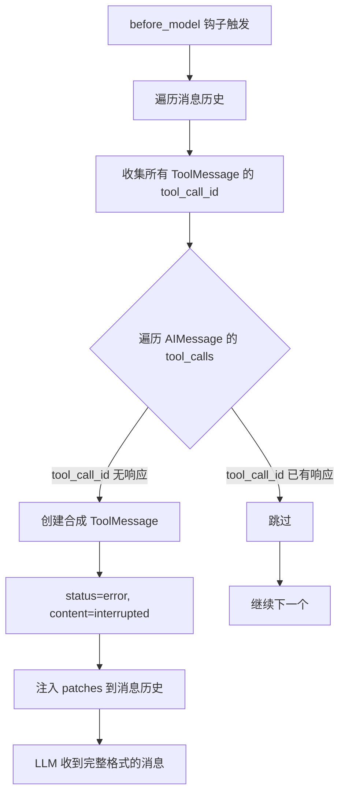
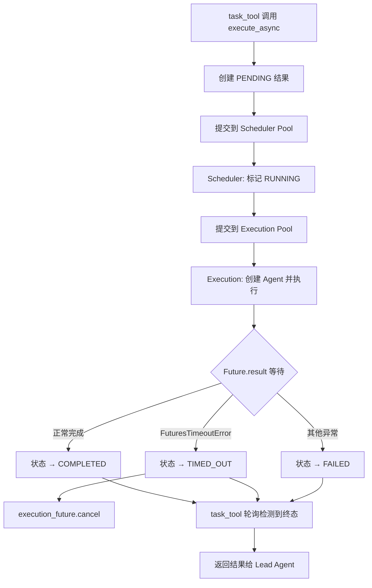

# PD-03.02 DeerFlow — 悬空工具调用修复与双线程池超时保护

> 文档编号：PD-03.02
> 来源：DeerFlow `backend/src/agents/middlewares/dangling_tool_call_middleware.py`, `backend/src/subagents/executor.py`
> GitHub：https://github.com/bytedance/deer-flow
> 问题域：PD-03 容错与重试 Fault Tolerance & Retry
> 状态：可复用方案

---

## 第 1 章 问题与动机

### 1.1 核心问题

Agent 系统在运行时面临两类典型的容错挑战：

1. **悬空工具调用（Dangling Tool Call）**：当用户中断请求或网络异常导致 AIMessage 中包含 `tool_calls` 但缺少对应的 `ToolMessage` 响应时，LLM 在下一轮对话中会因消息格式不完整而报错。这是 LangChain/LangGraph 生态中一个常见但容易被忽视的问题——大多数项目直接崩溃或丢弃整个对话历史。

2. **子 Agent 执行失控**：子 Agent 可能因 LLM 幻觉、工具调用死循环或外部服务不可用而无限运行，耗尽 token 预算和计算资源。没有超时保护的子 Agent 是生产环境中的定时炸弹。

3. **并发子 Agent 资源竞争**：LLM 可能在单次响应中生成过多并行 task 工具调用，超出系统承载能力，导致线程池耗尽或内存溢出。

### 1.2 DeerFlow 的解法概述

DeerFlow 采用三层防御体系解决上述问题：

1. **DanglingToolCallMiddleware**（`dangling_tool_call_middleware.py:22`）：在 LLM 调用前扫描消息历史，为缺失响应的工具调用注入合成 ToolMessage，确保对话格式始终合法。
2. **双线程池超时保护**（`executor.py:70-74`）：scheduler 线程池负责调度，execution 线程池负责执行，通过 `Future.result(timeout=N)` 实现精确超时控制。
3. **SubagentLimitMiddleware**（`subagent_limit_middleware.py:24`）：在 LLM 响应后截断超额的并行 task 工具调用，硬性限制并发子 Agent 数量在 [2, 4] 范围内。

### 1.3 设计思想

| 设计原则 | 具体实现 | 理由 | 替代方案 |
|----------|----------|------|----------|
| 消息历史自愈 | 注入合成 ToolMessage 填补空缺 | 保持对话连续性，不丢弃历史 | 截断历史到最后完整轮次（丢失上下文） |
| 双池隔离 | scheduler 池 + execution 池分离 | 调度逻辑不被执行阻塞 | 单线程池（超时任务阻塞调度） |
| 5 态状态机 | PENDING→RUNNING→COMPLETED/FAILED/TIMED_OUT | 精确区分失败原因，便于上层决策 | 简单 success/failure 二态（无法区分超时） |
| 硬性并发限制 | middleware 截断超额 tool_calls | 比 prompt 限制更可靠 | 仅靠 prompt 指示 LLM 限制并发（不可靠） |
| 防御性轮询 | 16 分钟轮询超时兜底 | 防止线程池超时机制失效 | 仅依赖 Future.result timeout（可能泄漏） |

---

## 第 2 章 源码实现分析

### 2.1 架构概览

DeerFlow 的容错体系由三个独立组件构成，分别作用于 Agent 生命周期的不同阶段：

```
┌─────────────────────────────────────────────────────────────┐
│                    Lead Agent 中间件链                        │
│                                                             │
│  ┌──────────────┐  ┌──────────────┐  ┌──────────────────┐  │
│  │ ThreadData   │→ │ Sandbox      │→ │ DanglingToolCall │  │
│  │ Middleware   │  │ Middleware   │  │ Middleware       │  │
│  └──────────────┘  └──────────────┘  │ (before_model)   │  │
│                                      └──────────────────┘  │
│                                                             │
│  ┌──────────────┐  ┌──────────────┐  ┌──────────────────┐  │
│  │ Summarization│→ │ Title/Memory │→ │ SubagentLimit    │  │
│  │ Middleware   │  │ Middleware   │  │ Middleware       │  │
│  └──────────────┘  └──────────────┘  │ (after_model)    │  │
│                                      └──────────────────┘  │
│                                                             │
│  ┌──────────────────────────────────────────────────────┐  │
│  │ Clarification Middleware (always last)                │  │
│  └──────────────────────────────────────────────────────┘  │
└─────────────────────────────────────────────────────────────┘
                           │
                           ▼ task tool 调用
┌─────────────────────────────────────────────────────────────┐
│                  SubagentExecutor                            │
│                                                             │
│  ┌─────────────────┐    ┌─────────────────┐                │
│  │ Scheduler Pool  │───→│ Execution Pool  │                │
│  │ (3 workers)     │    │ (3 workers)     │                │
│  │ 调度 + 超时监控  │    │ 实际 Agent 执行  │                │
│  └─────────────────┘    └─────────────────┘                │
│                                                             │
│  状态机: PENDING → RUNNING → COMPLETED / FAILED / TIMED_OUT │
└─────────────────────────────────────────────────────────────┘
```

### 2.2 核心实现

#### 2.2.1 DanglingToolCallMiddleware — 悬空工具调用自愈



对应源码 `backend/src/agents/middlewares/dangling_tool_call_middleware.py:30-66`：

```python
def _fix_dangling_tool_calls(self, state: AgentState) -> dict | None:
    messages = state.get("messages", [])
    if not messages:
        return None

    # Collect IDs of all existing ToolMessages
    existing_tool_msg_ids: set[str] = set()
    for msg in messages:
        if isinstance(msg, ToolMessage):
            existing_tool_msg_ids.add(msg.tool_call_id)

    # Find dangling tool calls and build patch messages
    patches: list[ToolMessage] = []
    for msg in messages:
        if getattr(msg, "type", None) != "ai":
            continue
        tool_calls = getattr(msg, "tool_calls", None)
        if not tool_calls:
            continue
        for tc in tool_calls:
            tc_id = tc.get("id")
            if tc_id and tc_id not in existing_tool_msg_ids:
                patches.append(
                    ToolMessage(
                        content="[Tool call was interrupted and did not return a result.]",
                        tool_call_id=tc_id,
                        name=tc.get("name", "unknown"),
                        status="error",
                    )
                )
                existing_tool_msg_ids.add(tc_id)

    if not patches:
        return None

    logger.warning(f"Injecting {len(patches)} placeholder ToolMessage(s) for dangling tool calls")
    return {"messages": patches}
```

关键设计点：
- 使用 `existing_tool_msg_ids` 集合做 O(1) 查找，避免 O(n²) 遍历（`dangling_tool_call_middleware.py:36-39`）
- 合成消息设置 `status="error"` 而非 `status="success"`，让 LLM 知道工具调用未成功（`dangling_tool_call_middleware.py:57`）
- 同时实现 `before_model` 和 `abefore_model`，支持同步和异步两种调用路径（`dangling_tool_call_middleware.py:68-74`）

#### 2.2.2 双线程池超时保护



对应源码 `backend/src/subagents/executor.py:325-387`：

```python
def execute_async(self, task: str, task_id: str | None = None) -> str:
    if task_id is None:
        task_id = str(uuid.uuid4())[:8]

    result = SubagentResult(
        task_id=task_id, trace_id=self.trace_id,
        status=SubagentStatus.PENDING,
    )

    with _background_tasks_lock:
        _background_tasks[task_id] = result

    def run_task():
        with _background_tasks_lock:
            _background_tasks[task_id].status = SubagentStatus.RUNNING
            _background_tasks[task_id].started_at = datetime.now()
            result_holder = _background_tasks[task_id]

        try:
            execution_future: Future = _execution_pool.submit(
                self.execute, task, result_holder
            )
            try:
                exec_result = execution_future.result(
                    timeout=self.config.timeout_seconds  # 默认 900s = 15 分钟
                )
                with _background_tasks_lock:
                    _background_tasks[task_id].status = exec_result.status
                    _background_tasks[task_id].result = exec_result.result
                    _background_tasks[task_id].error = exec_result.error
                    _background_tasks[task_id].completed_at = datetime.now()
            except FuturesTimeoutError:
                logger.error(f"Subagent execution timed out after {self.config.timeout_seconds}s")
                with _background_tasks_lock:
                    _background_tasks[task_id].status = SubagentStatus.TIMED_OUT
                    _background_tasks[task_id].error = (
                        f"Execution timed out after {self.config.timeout_seconds} seconds"
                    )
                    _background_tasks[task_id].completed_at = datetime.now()
                execution_future.cancel()
        except Exception as e:
            with _background_tasks_lock:
                _background_tasks[task_id].status = SubagentStatus.FAILED
                _background_tasks[task_id].error = str(e)
                _background_tasks[task_id].completed_at = datetime.now()

    _scheduler_pool.submit(run_task)
    return task_id
```

### 2.3 实现细节

#### 双线程池设计（`executor.py:69-74`）

```python
# Thread pool for background task scheduling and orchestration
_scheduler_pool = ThreadPoolExecutor(max_workers=3, thread_name_prefix="subagent-scheduler-")

# Thread pool for actual subagent execution (with timeout support)
_execution_pool = ThreadPoolExecutor(max_workers=3, thread_name_prefix="subagent-exec-")
```

为什么需要两个线程池？如果只用一个池，当 `Future.result(timeout=N)` 阻塞等待时，调度线程本身也被占用。双池设计让 scheduler 线程可以同时监控多个 execution 任务的超时。

#### 5 态状态机（`executor.py:25-32`）

```python
class SubagentStatus(Enum):
    PENDING = "pending"      # 已创建，等待调度
    RUNNING = "running"      # 正在执行
    COMPLETED = "completed"  # 成功完成
    FAILED = "failed"        # 异常失败
    TIMED_OUT = "timed_out"  # 超时终止
```

#### SubagentLimitMiddleware — 并发硬限制（`subagent_limit_middleware.py:40-67`）

该中间件在 `after_model` 钩子中运行，检查 LLM 最新响应中的 task 工具调用数量，超过 `max_concurrent`（默认 3，范围 [2, 4]）的部分直接截断：

```python
def _truncate_task_calls(self, state: AgentState) -> dict | None:
    last_msg = messages[-1]
    tool_calls = getattr(last_msg, "tool_calls", None)
    task_indices = [i for i, tc in enumerate(tool_calls) if tc.get("name") == "task"]
    if len(task_indices) <= self.max_concurrent:
        return None
    indices_to_drop = set(task_indices[self.max_concurrent:])
    truncated_tool_calls = [tc for i, tc in enumerate(tool_calls) if i not in indices_to_drop]
    updated_msg = last_msg.model_copy(update={"tool_calls": truncated_tool_calls})
    return {"messages": [updated_msg]}
```

#### 轮询兜底超时（`task_tool.py:178-184`）

task_tool 在后端轮询子 Agent 状态时，设置了 192 次 × 5 秒 = 16 分钟的兜底超时，比线程池的 15 分钟超时多 1 分钟，作为最后的安全网：

```python
if poll_count > 192:  # 192 * 5s = 16 minutes
    return f"Task polling timed out after 16 minutes."
```

#### 线程安全的全局状态（`executor.py:65-67`）

```python
_background_tasks: dict[str, SubagentResult] = {}
_background_tasks_lock = threading.Lock()
```

所有对 `_background_tasks` 的读写都通过 `_background_tasks_lock` 保护，确保多线程环境下的数据一致性。

---

## 第 3 章 迁移指南

### 3.1 迁移清单

**阶段 1：悬空工具调用修复（1 个文件）**
- [ ] 实现 `DanglingToolCallMiddleware`，在 `before_model` 钩子中扫描并修补消息历史
- [ ] 确保中间件同时支持同步 `before_model` 和异步 `abefore_model`
- [ ] 将中间件注册到 Agent 的中间件链中（位于 model 调用之前）

**阶段 2：双线程池超时保护（2 个文件）**
- [ ] 定义 `SubagentConfig` dataclass，包含 `timeout_seconds` 和 `max_turns` 字段
- [ ] 定义 `SubagentStatus` 枚举（5 态：PENDING/RUNNING/COMPLETED/FAILED/TIMED_OUT）
- [ ] 实现 `SubagentExecutor`，使用 scheduler + execution 双线程池
- [ ] 在 task_tool 中实现轮询 + 兜底超时

**阶段 3：并发限制（1 个文件）**
- [ ] 实现 `SubagentLimitMiddleware`，在 `after_model` 钩子中截断超额 task 调用
- [ ] 配置 `max_concurrent` 参数（建议默认 3，范围 [2, 4]）

### 3.2 适配代码模板

#### 模板 1：通用悬空工具调用修复中间件

```python
"""Generic dangling tool call fixer for any LangChain/LangGraph agent."""

from langchain_core.messages import AIMessage, ToolMessage


def fix_dangling_tool_calls(messages: list) -> list:
    """Scan message history and inject synthetic ToolMessages for dangling tool calls.

    Args:
        messages: The conversation message history.

    Returns:
        List of synthetic ToolMessages to append (empty if no dangling calls found).
    """
    # Collect existing ToolMessage IDs
    existing_ids: set[str] = set()
    for msg in messages:
        if isinstance(msg, ToolMessage):
            existing_ids.add(msg.tool_call_id)

    # Find dangling tool calls
    patches: list[ToolMessage] = []
    for msg in messages:
        if not isinstance(msg, AIMessage):
            continue
        for tc in getattr(msg, "tool_calls", []) or []:
            tc_id = tc.get("id")
            if tc_id and tc_id not in existing_ids:
                patches.append(
                    ToolMessage(
                        content="[Tool call was interrupted and did not return a result.]",
                        tool_call_id=tc_id,
                        name=tc.get("name", "unknown"),
                        status="error",
                    )
                )
                existing_ids.add(tc_id)  # Prevent duplicates

    return patches
```

#### 模板 2：带超时保护的子 Agent 执行器

```python
"""Subagent executor with dual thread pool and timeout protection."""

import threading
from concurrent.futures import Future, ThreadPoolExecutor
from concurrent.futures import TimeoutError as FuturesTimeoutError
from dataclasses import dataclass
from datetime import datetime
from enum import Enum
from typing import Any, Callable


class TaskStatus(Enum):
    PENDING = "pending"
    RUNNING = "running"
    COMPLETED = "completed"
    FAILED = "failed"
    TIMED_OUT = "timed_out"


@dataclass
class TaskResult:
    task_id: str
    status: TaskStatus
    result: Any = None
    error: str | None = None
    started_at: datetime | None = None
    completed_at: datetime | None = None


class TimeoutExecutor:
    """Execute callables with timeout protection using dual thread pools."""

    def __init__(self, max_scheduler_workers: int = 3, max_exec_workers: int = 3):
        self._scheduler_pool = ThreadPoolExecutor(
            max_workers=max_scheduler_workers, thread_name_prefix="scheduler-"
        )
        self._exec_pool = ThreadPoolExecutor(
            max_workers=max_exec_workers, thread_name_prefix="exec-"
        )
        self._tasks: dict[str, TaskResult] = {}
        self._lock = threading.Lock()

    def submit(
        self, task_id: str, fn: Callable, timeout_seconds: int = 900
    ) -> str:
        """Submit a task with timeout protection.

        Args:
            task_id: Unique task identifier.
            fn: Callable to execute (no args, returns result).
            timeout_seconds: Maximum execution time.

        Returns:
            task_id for status polling.
        """
        result = TaskResult(task_id=task_id, status=TaskStatus.PENDING)
        with self._lock:
            self._tasks[task_id] = result

        def _run():
            with self._lock:
                self._tasks[task_id].status = TaskStatus.RUNNING
                self._tasks[task_id].started_at = datetime.now()

            try:
                future: Future = self._exec_pool.submit(fn)
                try:
                    exec_result = future.result(timeout=timeout_seconds)
                    with self._lock:
                        self._tasks[task_id].status = TaskStatus.COMPLETED
                        self._tasks[task_id].result = exec_result
                        self._tasks[task_id].completed_at = datetime.now()
                except FuturesTimeoutError:
                    with self._lock:
                        self._tasks[task_id].status = TaskStatus.TIMED_OUT
                        self._tasks[task_id].error = f"Timed out after {timeout_seconds}s"
                        self._tasks[task_id].completed_at = datetime.now()
                    future.cancel()
            except Exception as e:
                with self._lock:
                    self._tasks[task_id].status = TaskStatus.FAILED
                    self._tasks[task_id].error = str(e)
                    self._tasks[task_id].completed_at = datetime.now()

        self._scheduler_pool.submit(_run)
        return task_id

    def get_status(self, task_id: str) -> TaskResult | None:
        with self._lock:
            return self._tasks.get(task_id)
```

### 3.3 适用场景

| 场景 | 适用度 | 说明 |
|------|--------|------|
| LangChain/LangGraph Agent 系统 | ⭐⭐⭐ | 直接复用，DanglingToolCallMiddleware 是通用方案 |
| 多子 Agent 并行编排 | ⭐⭐⭐ | 双线程池 + 5 态状态机是标准做法 |
| 单 Agent + 工具调用 | ⭐⭐ | 悬空修复有用，超时保护可简化为单池 |
| 非 LangChain 框架 | ⭐⭐ | 设计思想可迁移，但需适配消息格式 |
| 无工具调用的纯对话 Agent | ⭐ | 不需要悬空修复，超时保护仍有价值 |

---

## 第 4 章 测试用例

```python
"""Tests for DeerFlow fault tolerance components."""

import threading
import time
import uuid
from concurrent.futures import ThreadPoolExecutor
from unittest.mock import MagicMock, patch

import pytest
from langchain_core.messages import AIMessage, HumanMessage, ToolMessage


# ============================================================
# Test DanglingToolCallMiddleware
# ============================================================

class TestDanglingToolCallFixer:
    """Test the dangling tool call detection and patching logic."""

    def test_no_dangling_calls(self):
        """Normal case: all tool calls have responses."""
        messages = [
            HumanMessage(content="hello"),
            AIMessage(content="", tool_calls=[{"id": "tc1", "name": "search", "args": {}}]),
            ToolMessage(content="result", tool_call_id="tc1"),
        ]
        patches = fix_dangling_tool_calls(messages)
        assert len(patches) == 0

    def test_single_dangling_call(self):
        """One tool call without a response should be patched."""
        messages = [
            HumanMessage(content="hello"),
            AIMessage(content="", tool_calls=[{"id": "tc1", "name": "search", "args": {}}]),
            # No ToolMessage for tc1
        ]
        patches = fix_dangling_tool_calls(messages)
        assert len(patches) == 1
        assert patches[0].tool_call_id == "tc1"
        assert patches[0].status == "error"
        assert "interrupted" in patches[0].content.lower()

    def test_multiple_dangling_calls(self):
        """Multiple dangling calls in one AIMessage."""
        messages = [
            AIMessage(content="", tool_calls=[
                {"id": "tc1", "name": "search", "args": {}},
                {"id": "tc2", "name": "fetch", "args": {}},
            ]),
            ToolMessage(content="ok", tool_call_id="tc1"),
            # tc2 is dangling
        ]
        patches = fix_dangling_tool_calls(messages)
        assert len(patches) == 1
        assert patches[0].tool_call_id == "tc2"

    def test_empty_messages(self):
        """Empty message list should return no patches."""
        assert fix_dangling_tool_calls([]) == []

    def test_no_duplicate_patches(self):
        """Same dangling call should not be patched twice."""
        messages = [
            AIMessage(content="", tool_calls=[{"id": "tc1", "name": "a", "args": {}}]),
        ]
        patches = fix_dangling_tool_calls(messages)
        assert len(patches) == 1


# ============================================================
# Test SubagentStatus and TimeoutExecutor
# ============================================================

class TestTimeoutExecutor:
    """Test the dual thread pool executor with timeout."""

    def test_successful_execution(self):
        """Task completes within timeout."""
        executor = TimeoutExecutor(max_scheduler_workers=1, max_exec_workers=1)
        task_id = executor.submit("t1", lambda: "done", timeout_seconds=10)

        # Poll until complete
        for _ in range(20):
            result = executor.get_status(task_id)
            if result and result.status == TaskStatus.COMPLETED:
                break
            time.sleep(0.1)

        result = executor.get_status(task_id)
        assert result.status == TaskStatus.COMPLETED
        assert result.result == "done"

    def test_timeout_execution(self):
        """Task exceeds timeout and is marked TIMED_OUT."""
        executor = TimeoutExecutor(max_scheduler_workers=1, max_exec_workers=1)

        def slow_task():
            time.sleep(10)
            return "late"

        task_id = executor.submit("t2", slow_task, timeout_seconds=1)

        for _ in range(30):
            result = executor.get_status(task_id)
            if result and result.status == TaskStatus.TIMED_OUT:
                break
            time.sleep(0.2)

        result = executor.get_status(task_id)
        assert result.status == TaskStatus.TIMED_OUT
        assert "timed out" in result.error.lower()

    def test_failed_execution(self):
        """Task raises exception and is marked FAILED."""
        executor = TimeoutExecutor(max_scheduler_workers=1, max_exec_workers=1)

        def failing_task():
            raise ValueError("something broke")

        task_id = executor.submit("t3", failing_task, timeout_seconds=10)

        for _ in range(20):
            result = executor.get_status(task_id)
            if result and result.status == TaskStatus.FAILED:
                break
            time.sleep(0.1)

        result = executor.get_status(task_id)
        assert result.status == TaskStatus.FAILED
        assert "something broke" in result.error

    def test_thread_safety(self):
        """Multiple concurrent submissions should not corrupt state."""
        executor = TimeoutExecutor(max_scheduler_workers=3, max_exec_workers=3)
        task_ids = []
        for i in range(5):
            tid = executor.submit(f"t{i}", lambda: "ok", timeout_seconds=5)
            task_ids.append(tid)

        time.sleep(2)
        for tid in task_ids:
            result = executor.get_status(tid)
            assert result is not None
            assert result.status in (TaskStatus.COMPLETED, TaskStatus.RUNNING)
```

---

## 第 5 章 跨域关联

| 关联域 | 关系类型 | 说明 |
|--------|----------|------|
| PD-01 上下文管理 | 协同 | DanglingToolCallMiddleware 保证消息历史完整性，是上下文管理的前置条件；SummarizationMiddleware 在同一中间件链中负责上下文压缩 |
| PD-02 多 Agent 编排 | 依赖 | 双线程池超时保护是子 Agent 编排的基础设施；SubagentLimitMiddleware 限制并发数量，防止编排层资源耗尽 |
| PD-04 工具系统 | 协同 | 悬空工具调用修复直接作用于工具调用消息；工具过滤（`_filter_tools`）通过 allowlist/denylist 限制子 Agent 可用工具，减少出错面 |
| PD-05 沙箱隔离 | 协同 | SubagentExecutor 传递父 Agent 的 sandbox_state 给子 Agent，超时终止时沙箱资源需要清理 |
| PD-10 中间件管道 | 依赖 | DanglingToolCallMiddleware 和 SubagentLimitMiddleware 都是中间件管道的组成部分，依赖 `before_model`/`after_model` 钩子机制 |
| PD-11 可观测性 | 协同 | trace_id 贯穿父子 Agent，所有状态变更都有 logger 记录；SubagentResult 包含 started_at/completed_at 用于耗时分析 |

---

## 第 6 章 来源文件索引

| 文件 | 行范围 | 关键实现 |
|------|--------|----------|
| `backend/src/agents/middlewares/dangling_tool_call_middleware.py` | L1-L75 | DanglingToolCallMiddleware 完整实现 |
| `backend/src/subagents/executor.py` | L25-L32 | SubagentStatus 5 态枚举定义 |
| `backend/src/subagents/executor.py` | L35-L57 | SubagentResult 数据结构 |
| `backend/src/subagents/executor.py` | L65-L74 | 双线程池定义（scheduler + execution） |
| `backend/src/subagents/executor.py` | L122-L323 | SubagentExecutor 核心执行逻辑 |
| `backend/src/subagents/executor.py` | L325-L387 | execute_async 异步执行 + 超时保护 |
| `backend/src/subagents/executor.py` | L390 | MAX_CONCURRENT_SUBAGENTS = 3 |
| `backend/src/subagents/config.py` | L7-L28 | SubagentConfig（timeout_seconds=900） |
| `backend/src/agents/middlewares/subagent_limit_middleware.py` | L24-L75 | SubagentLimitMiddleware 并发截断 |
| `backend/src/tools/builtins/task_tool.py` | L129-L184 | task_tool 轮询 + 兜底超时（16 分钟） |
| `backend/src/agents/lead_agent/agent.py` | L186-L235 | 中间件链构建（含 DanglingToolCall 注册位置） |

---

## 第 7 章 横向对比维度

> **重要：** 本章用于自动填充 Butcher Wiki 的横向对比表。

```json comparison_data
{
  "project": "DeerFlow",
  "dimensions": {
    "截断/错误检测": "DanglingToolCallMiddleware 在 before_model 扫描消息历史，检测缺失 ToolMessage 的工具调用",
    "重试/恢复策略": "注入合成 ToolMessage（status=error）自愈消息历史，不重试原调用",
    "超时保护": "双线程池架构：scheduler 池监控 + execution 池执行，默认 15 分钟超时 + 16 分钟轮询兜底",
    "优雅降级": "5 态状态机（PENDING/RUNNING/COMPLETED/FAILED/TIMED_OUT），超时返回错误信息而非崩溃",
    "错误分类": "SubagentStatus 枚举区分 FAILED（异常）和 TIMED_OUT（超时）两类失败",
    "并发容错": "SubagentLimitMiddleware 硬性截断超额 task 调用，限制范围 [2,4]，比 prompt 限制更可靠",
    "监控告警": "trace_id 贯穿父子 Agent，所有状态变更含 logger.info/warning/error 记录"
  }
}
```

### 域元数据补充

```json domain_metadata
{
  "solution_summary": "DeerFlow 用 DanglingToolCallMiddleware 注入合成 ToolMessage 修复悬空工具调用，双线程池（scheduler+execution）实现 15 分钟超时保护，SubagentLimitMiddleware 硬性截断超额并发",
  "description": "中间件钩子是容错逻辑的理想注入点，before_model 修复历史、after_model 限制并发",
  "sub_problems": [
    "悬空工具调用：用户中断或网络异常导致 AIMessage 的 tool_calls 缺少对应 ToolMessage",
    "子 Agent 并发过载：LLM 单次响应生成过多并行 task 调用超出线程池容量"
  ],
  "best_practices": [
    "用中间件钩子注入容错逻辑，与业务代码解耦",
    "双线程池隔离调度与执行，避免超时监控被执行阻塞",
    "轮询兜底超时应比主超时多 1-2 分钟，作为最后安全网",
    "合成错误消息应标记 status=error，让 LLM 知道调用未成功"
  ]
}
```
