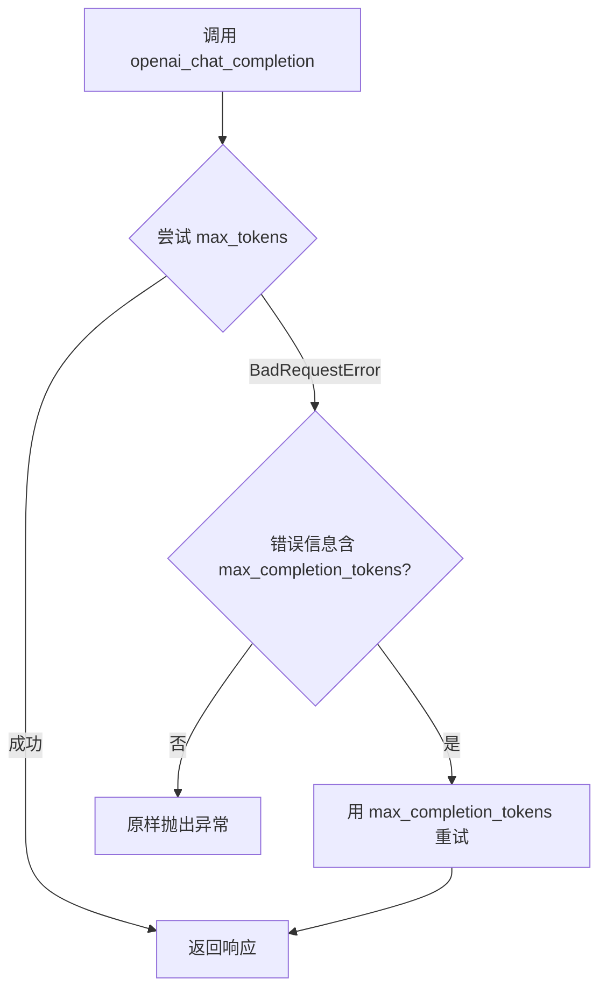
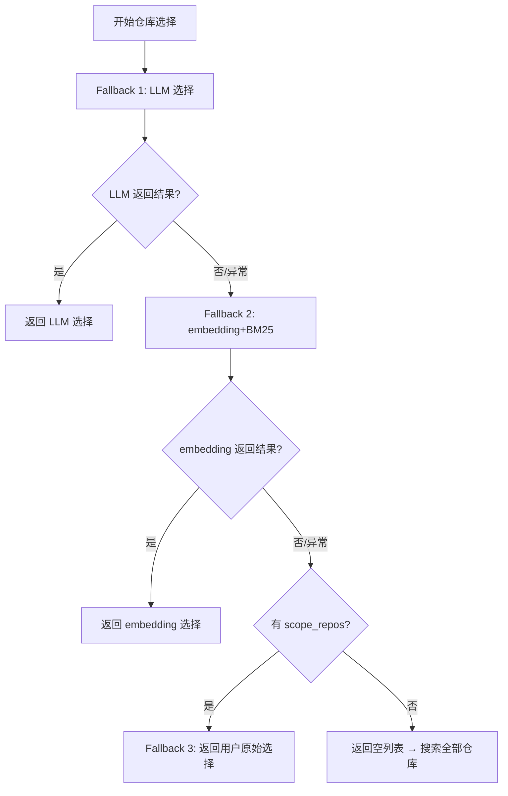
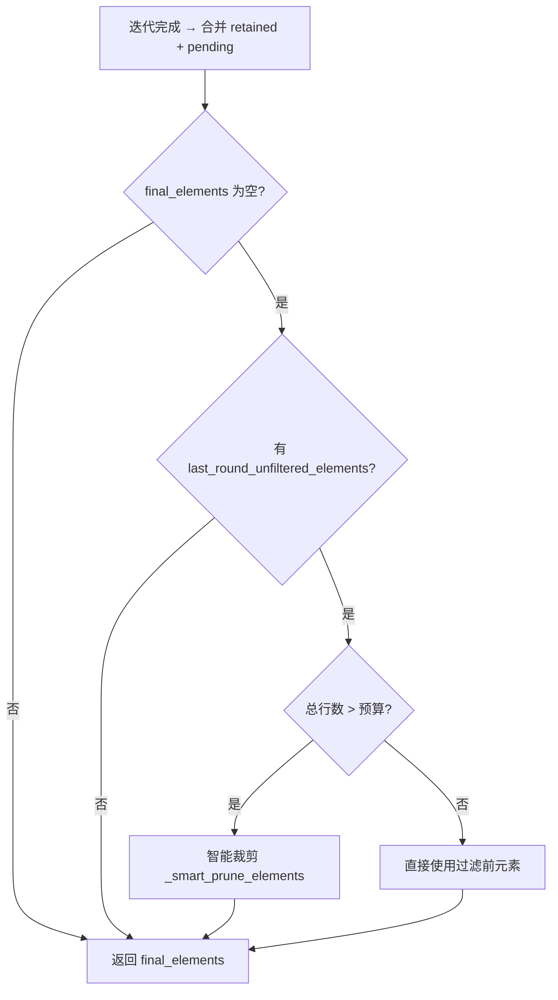

# PD-03.06 FastCode — 多层级容错降级体系

> 文档编号：PD-03.06
> 来源：FastCode `fastcode/llm_utils.py` `fastcode/retriever.py` `fastcode/iterative_agent.py` `fastcode/answer_generator.py`
> GitHub：https://github.com/HKUDS/FastCode.git
> 问题域：PD-03 容错与重试 Fault Tolerance & Retry
> 状态：可复用方案

---

## 第 1 章 问题与动机

### 1.1 核心问题

FastCode 是一个基于 LLM 的代码检索与问答系统，其核心流程涉及多轮 LLM 调用、多阶段检索、仓库选择等环节。每个环节都可能因以下原因失败：

1. **API 参数不兼容**：不同 LLM 模型对参数命名不一致（如 `max_tokens` vs `max_completion_tokens`），直接导致 BadRequestError
2. **LLM 选择失败**：LLM 在仓库选择阶段可能返回空结果或无法匹配的仓库名
3. **迭代检索过滤清空**：多轮迭代中 LLM 的 `keep_files` 指令可能因路径不匹配导致所有元素被过滤
4. **JSON 解析失败**：LLM 输出的 JSON 可能包含注释、非标准引号、未闭合括号等格式问题
5. **上下文溢出**：检索到的代码元素总行数可能超出 token 预算

这些问题的共同特征是：**失败不可预测，但必须有确定性的降级路径**。

### 1.2 FastCode 的解法概述

FastCode 采用"多层级 fallback 链"策略，在系统的四个关键层面实现容错：

1. **API 兼容层**：`openai_chat_completion()` 自动捕获 `max_tokens` 参数错误，降级为 `max_completion_tokens`（`llm_utils.py:10-17`）
2. **仓库选择层**：三级 fallback 链 — LLM 选择 → embedding+BM25 选择 → 用户原始选择（`retriever.py:563-592`）
3. **迭代检索层**：过滤清空时回退到过滤前元素 + 智能裁剪（`iterative_agent.py:325-338`）
4. **JSON 解析层**：五级解析策略 — 直接解析 → 清洗解析 → 正则修复 → AST 解析 → 增量提取（`iterative_agent.py:2779-2841`）
5. **上下文管理层**：prompt 超限时自动截断 context，保留系统指令完整性（`answer_generator.py:109-141`）

### 1.3 设计思想

| 设计原则 | 具体实现 | 理由 | 替代方案 |
|----------|----------|------|----------|
| 参数嗅探降级 | 先尝试宽兼容参数，捕获特定错误后切换 | 避免维护模型兼容性列表 | 预配置模型参数映射表 |
| 三级 fallback 链 | LLM → embedding+BM25 → 用户原始输入 | 每级降低智能但提高确定性 | 单一方法 + 重试 |
| 过滤前快照保留 | 每轮过滤前保存 `last_round_unfiltered_elements` | 防止 LLM 误判导致数据全丢 | 不过滤直接返回 |
| 多策略 JSON 解析 | 5 种解析策略逐级尝试 | LLM 输出格式不可控 | 强制 structured output |
| 预算感知裁剪 | 超预算时按优先级评分裁剪而非截断 | 保留最相关内容 | 简单截断前 N 行 |

---

## 第 2 章 源码实现分析

### 2.1 架构概览

FastCode 的容错体系分布在四个层次，从底层 API 到上层业务逻辑逐层防护：

```
┌─────────────────────────────────────────────────────────┐
│                  AnswerGenerator                         │
│  prompt 超限 → 自动截断 context → 保留系统指令           │
├─────────────────────────────────────────────────────────┤
│                  IterativeAgent                           │
│  过滤清空 → 回退快照 → 智能裁剪                          │
│  JSON 解析 → 5 级策略链                                  │
│  迭代控制 → 自适应停止（ROI/预算/停滞检测）              │
├─────────────────────────────────────────────────────────┤
│                  HybridRetriever                          │
│  仓库选择 → LLM → embedding+BM25 → 用户原始选择         │
│  工具调用失败 → fallback 到 file_selection               │
├─────────────────────────────────────────────────────────┤
│                  openai_chat_completion                   │
│  max_tokens 失败 → max_completion_tokens 降级            │
└─────────────────────────────────────────────────────────┘
```

### 2.2 核心实现

#### 2.2.1 API 参数自动降级



对应源码 `fastcode/llm_utils.py:1-17`：

```python
from openai import BadRequestError

def openai_chat_completion(client, *, max_tokens, **kwargs):
    """Call OpenAI-compatible chat completions with max_tokens fallback.

    Tries max_tokens first (broadest compatibility), falls back to
    max_completion_tokens if the model rejects max_tokens (e.g. gpt-5.2, o1).
    """
    try:
        return client.chat.completions.create(max_tokens=max_tokens, **kwargs)
    except BadRequestError as e:
        if "max_tokens" in str(e) and "max_completion_tokens" in str(e):
            return client.chat.completions.create(
                max_completion_tokens=max_tokens, **kwargs
            )
        raise
```

关键设计：通过检查错误消息中是否同时包含两个参数名来判断是否为参数兼容性问题，而非盲目重试。非兼容性错误（如 API key 无效）会原样抛出。

#### 2.2.2 三级仓库选择 Fallback



对应源码 `fastcode/retriever.py:517-592`：

```python
def _select_relevant_repositories_by_llm(
    self, query: str, top_k: int = 5,
    scope_repos: Optional[List[str]] = None
) -> List[str]:
    # ... 省略 overview 加载 ...
    try:
        selected = self.repo_selector.select_relevant_repos(
            query, repo_overviews, max_repos=top_k
        )
        if selected:
            self.logger.info(f"LLM selected repos: {selected}")
            return selected
        self.logger.warning("LLM returned no repos, falling back to embedding-based selection")
    except Exception as e:
        self.logger.error(f"LLM repo selection failed: {e}, falling back to embedding-based selection")

    # Fallback 1: use the original embedding+BM25 method
    try:
        embedding_selected = self._select_relevant_repositories(query, None, top_k)
        if embedding_selected:
            return embedding_selected
    except Exception as e:
        self.logger.error(f"Embedding-based repo selection also failed: {e}")

    # Fallback 2: return user's original scope_repos selection
    if scope_repos:
        self.logger.warning(f"All repo selection methods failed, falling back to user's original selection: {scope_repos}")
        return scope_repos

    # Final fallback: return empty list (will search all repos)
    return []
```

#### 2.2.3 迭代检索的过滤清空回退



对应源码 `fastcode/iterative_agent.py:322-338`：

```python
final_elements = self._merge_elements(retained_elements, pending_elements) \
    if pending_elements else retained_elements

# Fallback: if last round filtered everything out, use pre-filter elements
if not final_elements and last_round_unfiltered_elements:
    total_lines = self._calculate_total_lines(last_round_unfiltered_elements)
    if total_lines > self.adaptive_line_budget:
        self.logger.info(
            f"Fallback to pre-filter elements with smart pruning: "
            f"{total_lines} lines > {self.adaptive_line_budget} budget"
        )
        final_elements = self._smart_prune_elements(last_round_unfiltered_elements)
    else:
        final_elements = last_round_unfiltered_elements
```

### 2.3 实现细节

#### 五级 JSON 解析策略链

`_robust_json_parse` 方法（`iterative_agent.py:2779-2841`）实现了五级渐进式解析：

| 策略 | 方法 | 处理的问题 |
|------|------|-----------|
| 1 | `json.loads()` 直接解析 | 标准 JSON |
| 2 | `_sanitize_json_string()` + 解析 | 行内注释、控制字符 |
| 3 | 正则修复未引用 key + 解析 | `{key: "value"}` → `{"key": "value"}` |
| 4 | `ast.literal_eval()` | Python 风格字典（单引号等） |
| 5 | 增量括号匹配提取 | 截断的 JSON、尾部垃圾 |

#### 自适应迭代停止机制

`_should_continue_iteration`（`iterative_agent.py:2268-2387`）实现六重检查：

1. **置信度阈值**：达到目标即停
2. **硬性迭代上限**：防止无限循环
3. **行预算检查**：防止 token 溢出
4. **停滞检测**：连续两轮波动 < 1.0 则停止
5. **连续低效检测**：连续两轮低 ROI 则停止
6. **成本效益估算**：剩余预算不足以弥合置信度差距则停止

#### 智能裁剪优先级评分

`_calculate_element_priority_score`（`iterative_agent.py:2016-2076`）综合五个因子：

- 检索相关度（40% 权重）
- 来源加成（agent 发现 > LLM 选择 > 语义匹配）
- 元素类型（function > class > file）
- 大小惩罚（50-200 行最优）
- 选择粒度加成（精确选择 > 文件级）

---

## 第 3 章 迁移指南

### 3.1 迁移清单

#### 阶段 1：API 兼容层（1 个文件）

- [ ] 创建 `llm_utils.py`，封装 `openai_chat_completion()` 函数
- [ ] 将所有直接调用 `client.chat.completions.create()` 的地方替换为该封装
- [ ] 确保 `BadRequestError` 从 `openai` 包正确导入

#### 阶段 2：多级 Fallback 选择器（核心）

- [ ] 在选择/决策逻辑中实现 try-except 链式 fallback
- [ ] 每级 fallback 记录日志（warning 级别），便于事后分析降级频率
- [ ] 最终 fallback 必须是确定性的（如用户原始输入、默认值）

#### 阶段 3：过滤安全网

- [ ] 在任何 LLM 驱动的过滤操作前保存快照
- [ ] 过滤结果为空时回退到快照
- [ ] 回退时检查是否需要裁剪（预算控制）

#### 阶段 4：健壮 JSON 解析

- [ ] 实现多策略 JSON 解析器（至少 3 级）
- [ ] 在所有 LLM 输出解析处使用该解析器
- [ ] 解析完全失败时返回安全默认值而非抛异常

### 3.2 适配代码模板

#### 模板 1：通用 Fallback 链

```python
from typing import TypeVar, Callable, List, Optional, Any
import logging

T = TypeVar("T")
logger = logging.getLogger(__name__)

def fallback_chain(
    strategies: List[Callable[[], T]],
    strategy_names: List[str],
    default: T,
    logger: logging.Logger = logger,
) -> T:
    """
    执行 fallback 链：依次尝试每个策略，第一个成功的返回结果。
    全部失败则返回 default。
    
    用法：
        result = fallback_chain(
            strategies=[
                lambda: llm_select(query),
                lambda: embedding_select(query),
                lambda: user_original_selection,
            ],
            strategy_names=["LLM", "Embedding+BM25", "User Original"],
            default=[],
        )
    """
    for strategy, name in zip(strategies, strategy_names):
        try:
            result = strategy()
            if result:  # 非空即成功
                logger.info(f"Strategy '{name}' succeeded")
                return result
            logger.warning(f"Strategy '{name}' returned empty, trying next")
        except Exception as e:
            logger.error(f"Strategy '{name}' failed: {e}, trying next")
    
    logger.warning(f"All strategies failed, using default")
    return default
```

#### 模板 2：健壮 JSON 解析器

```python
import json
import re
import ast
from typing import Any

def robust_json_parse(text: str) -> Any:
    """多策略 JSON 解析，处理 LLM 输出的各种格式问题"""
    
    # 提取 JSON 块（去除 markdown 代码块标记）
    json_match = re.search(r'```(?:json)?\s*([\s\S]*?)```', text)
    json_str = json_match.group(1).strip() if json_match else text.strip()
    
    # 策略 1：直接解析
    try:
        return json.loads(json_str)
    except json.JSONDecodeError:
        pass
    
    # 策略 2：去除行内注释
    cleaned = re.sub(r'(?<!\\)//.*$', '', json_str, flags=re.MULTILINE)
    cleaned = re.sub(r'(?<!\\)#.*$', '', cleaned, flags=re.MULTILINE)
    try:
        return json.loads(cleaned)
    except json.JSONDecodeError:
        pass
    
    # 策略 3：修复未引用的 key
    try:
        fixed = re.sub(r'([{,]\s*)([a-zA-Z_]\w*)(\s*:)', r'\1"\2"\3', cleaned)
        return json.loads(fixed)
    except (json.JSONDecodeError, Exception):
        pass
    
    # 策略 4：Python 字面量解析（处理单引号）
    try:
        result = ast.literal_eval(json_str)
        if isinstance(result, (dict, list)):
            return result
    except (ValueError, SyntaxError):
        pass
    
    # 策略 5：增量括号匹配
    start = json_str.find('{')
    if start != -1:
        for end in range(len(json_str), start, -1):
            subset = json_str[start:end]
            if subset.count('{') == subset.count('}'):
                try:
                    return json.loads(subset)
                except json.JSONDecodeError:
                    continue
    
    raise json.JSONDecodeError("All parsing strategies failed", json_str, 0)
```

#### 模板 3：过滤安全网

```python
from typing import List, Dict, Any, Callable

def safe_filter_with_snapshot(
    elements: List[Dict[str, Any]],
    filter_fn: Callable[[List[Dict[str, Any]]], List[Dict[str, Any]]],
    budget_fn: Callable[[List[Dict[str, Any]]], int],
    prune_fn: Callable[[List[Dict[str, Any]]], List[Dict[str, Any]]],
    budget_limit: int,
) -> List[Dict[str, Any]]:
    """
    带快照的安全过滤：过滤清空时回退到过滤前元素。
    超预算时智能裁剪。
    """
    snapshot = list(elements)  # 保存快照
    
    filtered = filter_fn(elements)
    
    if not filtered and snapshot:
        # 回退到快照
        total = budget_fn(snapshot)
        if total > budget_limit:
            return prune_fn(snapshot)
        return snapshot
    
    return filtered
```

### 3.3 适用场景

| 场景 | 适用度 | 说明 |
|------|--------|------|
| LLM 驱动的多阶段 pipeline | ⭐⭐⭐ | 每个阶段都需要 fallback |
| 多模型/多 Provider 切换 | ⭐⭐⭐ | API 参数降级直接可用 |
| RAG 检索系统 | ⭐⭐⭐ | 仓库选择 fallback + 过滤安全网 |
| 单次 LLM 调用场景 | ⭐⭐ | JSON 解析器有用，其他过重 |
| 非 LLM 系统 | ⭐ | fallback 链模式通用，但具体实现不适用 |

---

## 第 4 章 测试用例

```python
import json
import pytest
from unittest.mock import MagicMock, patch
from openai import BadRequestError


class TestOpenAIChatCompletion:
    """测试 API 参数自动降级"""
    
    def test_normal_max_tokens(self):
        """正常情况：max_tokens 直接成功"""
        client = MagicMock()
        client.chat.completions.create.return_value = "response"
        
        from fastcode.llm_utils import openai_chat_completion
        result = openai_chat_completion(client, max_tokens=1000, model="gpt-4")
        
        client.chat.completions.create.assert_called_once_with(
            max_tokens=1000, model="gpt-4"
        )
        assert result == "response"
    
    def test_fallback_to_max_completion_tokens(self):
        """降级：max_tokens 失败后切换到 max_completion_tokens"""
        client = MagicMock()
        error = BadRequestError(
            message="Use max_completion_tokens instead of max_tokens",
            response=MagicMock(status_code=400),
            body=None,
        )
        client.chat.completions.create.side_effect = [error, "fallback_response"]
        
        from fastcode.llm_utils import openai_chat_completion
        result = openai_chat_completion(client, max_tokens=1000, model="o1")
        
        assert result == "fallback_response"
        assert client.chat.completions.create.call_count == 2
    
    def test_non_param_error_propagates(self):
        """非参数错误：原样抛出"""
        client = MagicMock()
        error = BadRequestError(
            message="Invalid API key",
            response=MagicMock(status_code=400),
            body=None,
        )
        client.chat.completions.create.side_effect = error
        
        from fastcode.llm_utils import openai_chat_completion
        with pytest.raises(BadRequestError, match="Invalid API key"):
            openai_chat_completion(client, max_tokens=1000, model="gpt-4")


class TestFallbackChain:
    """测试三级 fallback 仓库选择"""
    
    def test_first_strategy_succeeds(self):
        """第一级成功直接返回"""
        from tests.templates import fallback_chain
        result = fallback_chain(
            strategies=[lambda: ["repo1", "repo2"]],
            strategy_names=["LLM"],
            default=[],
        )
        assert result == ["repo1", "repo2"]
    
    def test_fallback_to_second(self):
        """第一级失败，第二级成功"""
        from tests.templates import fallback_chain
        result = fallback_chain(
            strategies=[
                lambda: [],  # 空结果
                lambda: ["repo3"],
            ],
            strategy_names=["LLM", "Embedding"],
            default=[],
        )
        assert result == ["repo3"]
    
    def test_all_fail_returns_default(self):
        """全部失败返回默认值"""
        def raise_error():
            raise RuntimeError("fail")
        
        from tests.templates import fallback_chain
        result = fallback_chain(
            strategies=[raise_error, lambda: []],
            strategy_names=["LLM", "Embedding"],
            default=["default_repo"],
        )
        assert result == ["default_repo"]


class TestRobustJsonParse:
    """测试多策略 JSON 解析"""
    
    def test_standard_json(self):
        """标准 JSON 直接解析"""
        from tests.templates import robust_json_parse
        result = robust_json_parse('{"key": "value"}')
        assert result == {"key": "value"}
    
    def test_json_with_comments(self):
        """含行内注释的 JSON"""
        from tests.templates import robust_json_parse
        result = robust_json_parse('{"key": "value"} // comment')
        assert result == {"key": "value"}
    
    def test_unquoted_keys(self):
        """未引用的 key"""
        from tests.templates import robust_json_parse
        result = robust_json_parse('{key: "value"}')
        assert result == {"key": "value"}
    
    def test_python_style_dict(self):
        """Python 风格字典（单引号）"""
        from tests.templates import robust_json_parse
        result = robust_json_parse("{'key': 'value'}")
        assert result == {"key": "value"}
    
    def test_truncated_json(self):
        """截断的 JSON（尾部有垃圾）"""
        from tests.templates import robust_json_parse
        result = robust_json_parse('{"key": "value"} some garbage text')
        assert result == {"key": "value"}


class TestSafeFilterWithSnapshot:
    """测试过滤安全网"""
    
    def test_normal_filter(self):
        """正常过滤"""
        from tests.templates import safe_filter_with_snapshot
        elements = [{"element": {"start_line": 1, "end_line": 50}}]
        result = safe_filter_with_snapshot(
            elements=elements,
            filter_fn=lambda x: x,  # 不过滤
            budget_fn=lambda x: 50,
            prune_fn=lambda x: x[:1],
            budget_limit=100,
        )
        assert len(result) == 1
    
    def test_filter_empties_fallback_to_snapshot(self):
        """过滤清空时回退到快照"""
        from tests.templates import safe_filter_with_snapshot
        elements = [{"element": {"start_line": 1, "end_line": 50}}]
        result = safe_filter_with_snapshot(
            elements=elements,
            filter_fn=lambda x: [],  # 全部过滤
            budget_fn=lambda x: 50,
            prune_fn=lambda x: x[:1],
            budget_limit=100,
        )
        assert len(result) == 1  # 回退到快照
    
    def test_fallback_with_pruning(self):
        """回退时超预算触发裁剪"""
        from tests.templates import safe_filter_with_snapshot
        elements = [
            {"element": {"start_line": 1, "end_line": 500}},
            {"element": {"start_line": 1, "end_line": 500}},
        ]
        result = safe_filter_with_snapshot(
            elements=elements,
            filter_fn=lambda x: [],
            budget_fn=lambda x: 1000,  # 超预算
            prune_fn=lambda x: x[:1],  # 裁剪到 1 个
            budget_limit=600,
        )
        assert len(result) == 1
```

---

## 第 5 章 跨域关联

| 关联域 | 关系类型 | 说明 |
|--------|----------|------|
| PD-01 上下文管理 | 协同 | `answer_generator.py` 的 prompt 截断是上下文管理的容错手段；`iterative_agent.py` 的行预算控制本质是上下文窗口管理 |
| PD-04 工具系统 | 依赖 | `openai_chat_completion` 封装是工具系统的底层组件；`_execute_tool_calls_with_selection` 的 fallback 依赖工具调用结果 |
| PD-08 搜索与检索 | 协同 | 三级仓库选择 fallback 直接服务于检索质量；迭代检索的过滤安全网保障检索结果不丢失 |
| PD-12 推理增强 | 协同 | 自适应迭代停止机制（ROI 分析、停滞检测）是推理过程的质量控制；五级 JSON 解析处理推理输出的格式问题 |
| PD-11 可观测性 | 依赖 | 每级 fallback 都有详细日志记录（info/warning/error 分级），是可观测性的基础数据源 |

---

## 第 6 章 来源文件索引

| 文件 | 行范围 | 关键实现 |
|------|--------|----------|
| `fastcode/llm_utils.py` | L1-L17 | API 参数自动降级（max_tokens → max_completion_tokens） |
| `fastcode/retriever.py` | L517-L592 | 三级仓库选择 fallback（LLM → embedding+BM25 → 用户原始选择） |
| `fastcode/retriever.py` | L266-L282 | 仓库选择入口：LLM 方法 vs embedding 方法分发 |
| `fastcode/retriever.py` | L920-L935 | 工具调用无结果时 fallback 到 file_selection |
| `fastcode/iterative_agent.py` | L322-L338 | 迭代检索过滤清空回退 + 智能裁剪 |
| `fastcode/iterative_agent.py` | L1971-L2014 | 智能裁剪 `_smart_prune_elements`（优先级评分） |
| `fastcode/iterative_agent.py` | L2016-L2076 | 元素优先级评分 `_calculate_element_priority_score` |
| `fastcode/iterative_agent.py` | L2268-L2387 | 自适应迭代停止 `_should_continue_iteration`（6 重检查） |
| `fastcode/iterative_agent.py` | L2779-L2841 | 五级 JSON 解析 `_robust_json_parse` |
| `fastcode/iterative_agent.py` | L643-L657 | Round 1 解析失败 fallback（安全默认值） |
| `fastcode/iterative_agent.py` | L1299-L1309 | Round N LLM 调用失败 fallback（停止迭代） |
| `fastcode/iterative_agent.py` | L968-L971 | 元素选择失败 fallback 到文件级选择 |
| `fastcode/iterative_agent.py` | L1250-L1265 | `_fallback_file_selection` 实现 |
| `fastcode/answer_generator.py` | L109-L141 | Prompt 超限自动截断 context |
| `fastcode/answer_generator.py` | L163-L166 | Summary 解析失败 fallback 生成 |
| `fastcode/repo_selector.py` | L365-L417 | 模糊匹配 `_fuzzy_match_repo`（精确 → 子串 → Jaccard） |

---

## 第 7 章 横向对比维度

```json comparison_data
{
  "project": "FastCode",
  "dimensions": {
    "截断/错误检测": "检查 BadRequestError 消息内容判断参数兼容性；检测 finish_reason 和空响应",
    "重试/恢复策略": "参数嗅探式单次重试（非指数退避），失败后立即切换参数名重试",
    "超时保护": "自适应行预算控制（按查询复杂度动态调整 6000-12000 行），6 重迭代停止检查",
    "优雅降级": "三级 fallback 链（LLM→embedding+BM25→用户原始选择），每级降低智能提高确定性",
    "降级方案": "API 参数降级 + 仓库选择降级 + 过滤清空回退 + JSON 解析降级 + prompt 截断",
    "错误分类": "区分参数兼容性错误（可降级）vs 其他错误（原样抛出），通过错误消息内容判断",
    "恢复机制": "过滤前快照保留，清空时回退到快照 + 智能裁剪（优先级评分排序）",
    "输出验证": "五级 JSON 解析策略链（直接→清洗→正则→AST→增量），覆盖注释/单引号/截断等问题",
    "模糊匹配容错": "仓库名三级模糊匹配（精确→子串→Jaccard 相似度），容忍 LLM 输出的命名偏差"
  }
}
```

### 域元数据补充

```json domain_metadata
{
  "solution_summary": "FastCode 用参数嗅探降级 + 三级 fallback 链 + 过滤前快照回退 + 五级 JSON 解析策略链实现多层级容错，每层降低智能但提高确定性",
  "description": "LLM 输出格式不可控时的多策略渐进式解析与降级",
  "sub_problems": [
    "LLM 返回的实体名与系统内部名不完全匹配（大小写、缩写、多余标点）需要模糊匹配容错",
    "多轮迭代中 LLM 的过滤指令可能因路径格式不一致导致所有元素被误过滤",
    "API 参数命名在不同模型版本间不兼容（max_tokens vs max_completion_tokens）",
    "迭代检索的成本效益递减：后续轮次的置信度增益可能不值得额外的 token 消耗"
  ],
  "best_practices": [
    "参数嗅探优于预配置：先尝试宽兼容参数，通过错误消息判断是否需要降级",
    "过滤操作前必须保存快照：LLM 驱动的过滤不可信，需要回退路径",
    "fallback 链的每级应降低智能但提高确定性：最终 fallback 必须是确定性的",
    "JSON 解析应覆盖 LLM 常见输出问题：注释、单引号、未引用 key、截断"
  ]
}
```
