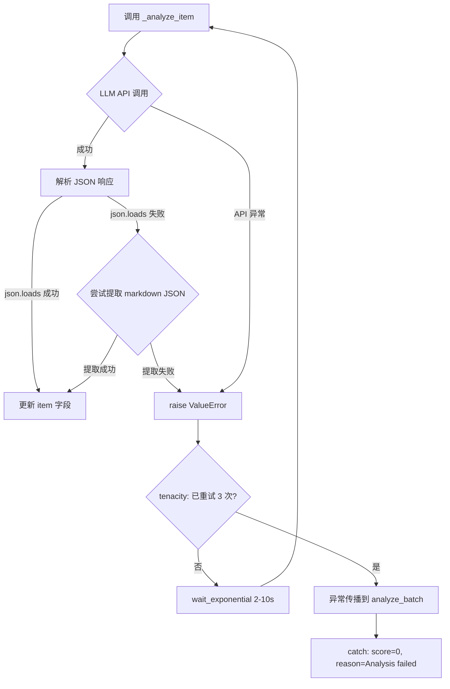
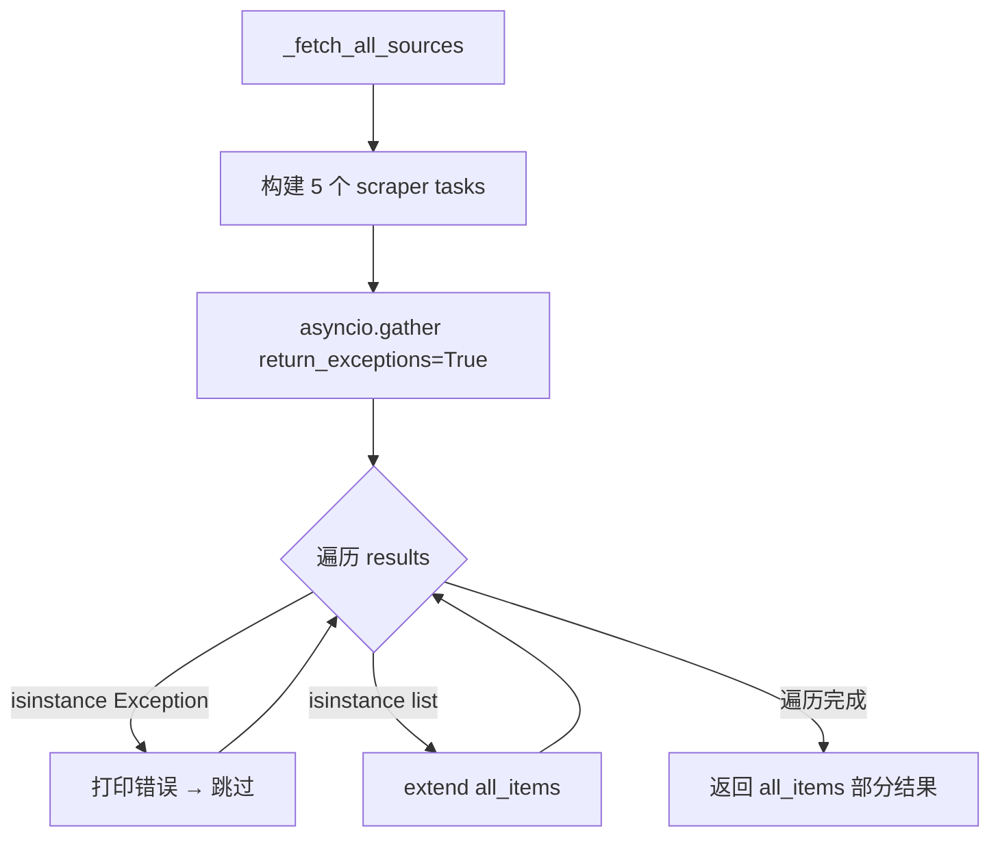
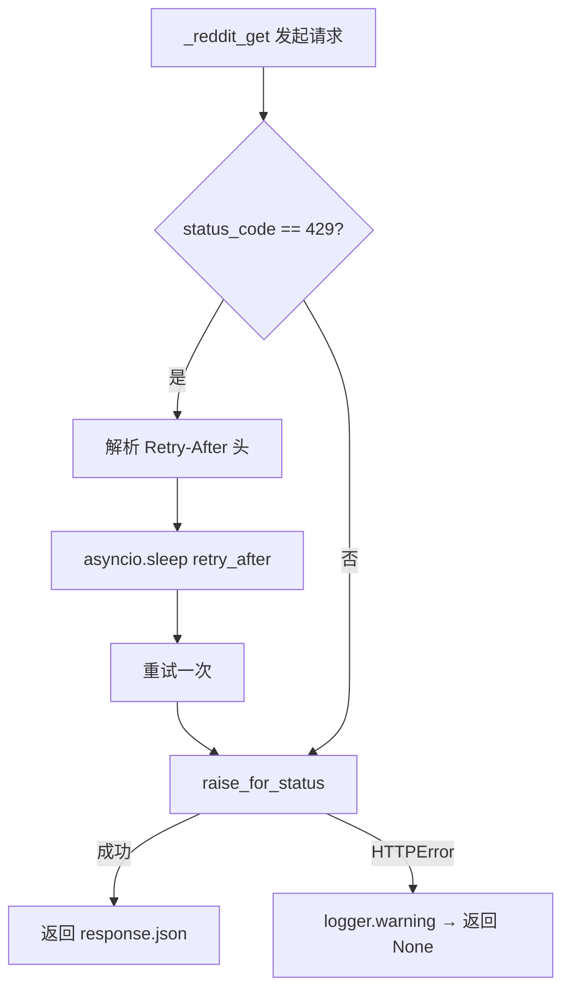

# PD-03.07 Horizon — tenacity 指数退避 + asyncio.gather 故障隔离

> 文档编号：PD-03.07
> 来源：Horizon `src/ai/analyzer.py` `src/ai/enricher.py` `src/scrapers/reddit.py`
> GitHub：https://github.com/Thysrael/Horizon.git
> 问题域：PD-03 容错与重试 Fault Tolerance & Retry
> 状态：可复用方案

---

## 第 1 章 问题与动机

### 1.1 核心问题

Horizon 是一个 AI 驱动的信息聚合系统，从 GitHub、Hacker News、Reddit、Telegram、RSS 五个数据源并行抓取内容，经 AI 分析评分后生成每日摘要。这个流水线面临三层容错挑战：

1. **数据源层**：5 个外部 API 各有不同的限流策略（Reddit 429 + Retry-After、GitHub Token 限额、Telegram 反爬），任何一个源的失败不应阻塞其他源
2. **AI 分析层**：LLM API 调用可能因网络抖动、速率限制、响应格式异常而失败，每个 item 的分析失败不应影响批次中其他 item
3. **JSON 解析层**：LLM 返回的 JSON 可能被 markdown 代码块包裹（```json ... ```），直接 json.loads 会失败

如果不做容错，一个 Reddit 429 就能让整个聚合流程崩溃，用户看不到任何输出。

### 1.2 Horizon 的解法概述

Horizon 采用**三层防御**策略：

1. **tenacity 装饰器重试**（`src/ai/analyzer.py:51-54`、`src/ai/enricher.py:105-108`）：AI 调用用 `@retry(stop=stop_after_attempt(3), wait=wait_exponential(min=2, max=10))` 包裹，3 次重试 + 2-10 秒指数退避
2. **asyncio.gather(return_exceptions=True) 故障隔离**（`src/orchestrator.py:201`、`src/scrapers/reddit.py:42`）：所有并发任务用 return_exceptions=True 收集，异常被当作普通返回值处理而非传播
3. **HTTP 429 手动重试**（`src/scrapers/reddit.py:201-205`、`src/scrapers/telegram.py:54-58`）：解析 Retry-After 头后 sleep 再重试一次

### 1.3 设计思想

| 设计原则 | 具体实现 | 理由 | 替代方案 |
|----------|----------|------|----------|
| 故障隔离优先 | asyncio.gather(return_exceptions=True) 收集异常 | 一个源失败不影响其他源，保证部分结果可用 | 逐个 await + try/except（串行，慢） |
| 声明式重试 | tenacity @retry 装饰器 | 重试逻辑与业务逻辑分离，参数一目了然 | 手写 while 循环重试（易出错） |
| 协议感知限流 | 解析 Retry-After 头决定等待时间 | 尊重服务端限流指示，避免盲目重试 | 固定等待时间（可能太短或太长） |
| 逐项降级 | analyze_batch 中单 item 失败赋默认值继续 | 批量分析不因单个 item 中断 | 整批重试（浪费已成功的结果） |
| 静默降级 | 搜索/概念提取失败返回空列表 | 辅助功能失败不阻塞主流程 | 抛异常中断（过度反应） |

---

## 第 2 章 源码实现分析

### 2.1 架构概览

Horizon 的容错架构分三层，每层有独立的错误处理策略：

```
┌─────────────────────────────────────────────────────────┐
│                   HorizonOrchestrator                    │
│  _fetch_all_sources() → asyncio.gather(return_exc=True) │
│  异常源 → 打印警告 → 跳过 → 继续处理其他源的结果         │
├─────────────────────────────────────────────────────────┤
│  Layer 1: 数据源层                                       │
│  ┌──────────┐ ┌──────────┐ ┌──────────┐ ┌──────────┐   │
│  │ GitHub   │ │ HN       │ │ Reddit   │ │ Telegram │   │
│  │ try/exc  │ │ gather   │ │ gather   │ │ gather   │   │
│  │ →[]      │ │ →skip    │ │ →skip    │ │ →skip    │   │
│  └──────────┘ └──────────┘ └──────────┘ └──────────┘   │
│       ↓              ↓           ↓            ↓         │
│  HTTP 429? → parse Retry-After → sleep → retry once     │
├─────────────────────────────────────────────────────────┤
│  Layer 2: AI 分析层                                      │
│  ┌──────────────────┐  ┌──────────────────┐             │
│  │ ContentAnalyzer   │  │ ContentEnricher  │             │
│  │ @retry(3, exp)    │  │ @retry(3, exp)   │             │
│  │ 失败→score=0      │  │ 失败→print err   │             │
│  └──────────────────┘  └──────────────────┘             │
├─────────────────────────────────────────────────────────┤
│  Layer 3: JSON 解析层                                    │
│  json.loads → 失败 → 尝试 ```json 提取 → 尝试 ``` 提取   │
│  → 仍失败 → raise ValueError → 被 tenacity 重试捕获      │
└─────────────────────────────────────────────────────────┘
```

### 2.2 核心实现

#### 2.2.1 tenacity 指数退避重试（AI 层）



对应源码 `src/ai/analyzer.py:51-141`：

```python
@retry(
    stop=stop_after_attempt(3),
    wait=wait_exponential(min=2, max=10)
)
async def _analyze_item(self, item: ContentItem) -> None:
    # ... 构建 prompt ...
    response = await self.client.complete(
        system=CONTENT_ANALYSIS_SYSTEM,
        user=user_prompt,
        temperature=0.3
    )
    # 多级 JSON 解析容错
    try:
        result = json.loads(response)
    except json.JSONDecodeError:
        if "```json" in response:
            json_str = response.split("```json")[1].split("```")[0].strip()
            result = json.loads(json_str)
        elif "```" in response:
            json_str = response.split("```")[1].split("```")[0].strip()
            result = json.loads(json_str)
        else:
            raise ValueError(f"Invalid JSON response: {response}")
    # 更新 item
    item.ai_score = float(result.get("score", 0))
    item.ai_reason = result.get("reason", "")
```

批量分析的逐项降级 `src/ai/analyzer.py:36-47`：

```python
for item in batch:
    try:
        await self._analyze_item(item)
        analyzed_items.append(item)
    except Exception as e:
        print(f"Error analyzing item {item.id}: {e}")
        item.ai_score = 0.0
        item.ai_reason = "Analysis failed"
        item.ai_summary = item.title
        analyzed_items.append(item)
```

#### 2.2.2 asyncio.gather 故障隔离（编排层）



对应源码 `src/orchestrator.py:200-211`：

```python
# Fetch all concurrently
results = await asyncio.gather(*tasks, return_exceptions=True)

# Flatten results
all_items = []
for result in results:
    if isinstance(result, Exception):
        self.console.print(f"[red]Error fetching source: {result}[/red]")
    elif isinstance(result, list):
        all_items.extend(result)
return all_items
```

同样的模式在 Reddit scraper 内部也有使用（`src/scrapers/reddit.py:42-49`）：

```python
results = await asyncio.gather(*tasks, return_exceptions=True)
items = []
for result in results:
    if isinstance(result, Exception):
        logger.warning("Error fetching Reddit source: %s", result)
    elif isinstance(result, list):
        items.extend(result)
return items
```

#### 2.2.3 HTTP 429 限流处理（数据源层）



对应源码 `src/scrapers/reddit.py:197-210`：

```python
async def _reddit_get(self, url: str, params: dict) -> Optional[dict]:
    headers = {"User-Agent": USER_AGENT}
    try:
        response = await self.client.get(url, params=params, headers=headers, follow_redirects=True)
        if response.status_code == 429:
            retry_after = int(response.headers.get("Retry-After", 5))
            logger.warning("Reddit rate limited, retrying after %ds", retry_after)
            await asyncio.sleep(retry_after)
            response = await self.client.get(url, params=params, headers=headers, follow_redirects=True)
        response.raise_for_status()
        return response.json()
    except httpx.HTTPError as e:
        logger.warning("Reddit request failed for %s: %s", url, e)
        return None
```

Telegram 使用完全相同的 429 处理模式（`src/scrapers/telegram.py:53-62`）：

```python
response = await self.client.get(url, headers=headers, follow_redirects=True, timeout=120.0)
if response.status_code == 429:
    retry_after = int(response.headers.get("Retry-After", 5))
    logger.warning("Telegram rate limited for %s, retrying after %ds", cfg.channel, retry_after)
    await asyncio.sleep(retry_after)
    response = await self.client.get(url, headers=headers, follow_redirects=True, timeout=120.0)
response.raise_for_status()
```

### 2.3 实现细节

**搜索模块的并发控制与故障隔离**（`src/search.py:13-106`）：

Reddit 搜索使用 Semaphore 限制并发度为 5（`src/search.py:13`）：
```python
_reddit_semaphore = asyncio.Semaphore(5)
```

搜索相关内容时，HN 和 Reddit 搜索并行执行，各自失败互不影响（`src/search.py:77-86`）：
```python
hn_results, reddit_results = await asyncio.gather(
    search_hn(query, client),
    search_reddit(query, client),
    return_exceptions=True,
)
if isinstance(hn_results, Exception):
    hn_results = []
if isinstance(reddit_results, Exception):
    reddit_results = []
```

**DuckDuckGo 搜索的静默降级**（`src/ai/enricher.py:52-69`）：

Web 搜索失败时返回空列表，不影响后续 enrichment 流程：
```python
async def _web_search(self, query: str, max_results: int = 3) -> list:
    try:
        # Suppress primp stderr warning
        stderr = sys.stderr
        sys.stderr = open(os.devnull, "w")
        try:
            ddgs = DDGS()
            results = ddgs.text(query, max_results=max_results)
        finally:
            sys.stderr.close()
            sys.stderr = stderr
    except Exception:
        return []
```

**概念提取的静默降级**（`src/ai/enricher.py:93-103`）：

AI 概念提取失败时返回空列表，enrichment 跳过搜索步骤但不中断：
```python
try:
    response = await self.client.complete(
        system=CONCEPT_EXTRACTION_SYSTEM,
        user=user_prompt,
        temperature=0.3,
    )
    result = json.loads(response.strip().strip("`").replace("json\n", "", 1))
    queries = result.get("queries", [])
    return queries[:3]
except Exception:
    return []
```

**httpx 全局超时配置**（`src/orchestrator.py:172`）：

所有 HTTP 请求共享 30 秒超时的 AsyncClient：
```python
async with httpx.AsyncClient(timeout=30.0) as client:
```

Telegram 单独设置了 120 秒超时（`src/scrapers/telegram.py:53`），因为 Telegram Web 页面加载较慢。

---

## 第 3 章 迁移指南

### 3.1 迁移清单

**阶段 1：基础重试（1 个文件）**
- [ ] 安装 tenacity：`pip install tenacity>=9.0.0`
- [ ] 为所有 LLM 调用添加 `@retry` 装饰器
- [ ] 配置 `stop_after_attempt(3)` + `wait_exponential(min=2, max=10)`

**阶段 2：故障隔离（改造并发调用点）**
- [ ] 将所有 `asyncio.gather(*tasks)` 改为 `asyncio.gather(*tasks, return_exceptions=True)`
- [ ] 在结果遍历中添加 `isinstance(result, Exception)` 检查
- [ ] 异常结果记录日志后跳过，不中断流程

**阶段 3：HTTP 限流处理（改造 HTTP 客户端）**
- [ ] 在 HTTP 请求方法中检查 `response.status_code == 429`
- [ ] 解析 `Retry-After` 头（默认值 5 秒）
- [ ] `asyncio.sleep(retry_after)` 后重试一次

**阶段 4：JSON 解析容错（改造 LLM 响应解析）**
- [ ] 先尝试 `json.loads(response)`
- [ ] 失败后尝试从 ` ```json ``` ` 代码块中提取
- [ ] 仍失败则 raise，让 tenacity 重试

### 3.2 适配代码模板

#### 模板 1：tenacity 重试 + JSON 解析容错

```python
import json
from tenacity import retry, stop_after_attempt, wait_exponential


def parse_llm_json(response: str) -> dict:
    """多级 JSON 解析容错，适配 LLM 常见输出格式。"""
    try:
        return json.loads(response)
    except json.JSONDecodeError:
        pass
    # 尝试从 markdown 代码块提取
    if "```json" in response:
        json_str = response.split("```json")[1].split("```")[0].strip()
        return json.loads(json_str)
    if "```" in response:
        json_str = response.split("```")[1].split("```")[0].strip()
        return json.loads(json_str)
    raise ValueError(f"Cannot parse JSON from response: {response[:200]}")


@retry(
    stop=stop_after_attempt(3),
    wait=wait_exponential(min=2, max=10),
)
async def call_llm_with_retry(client, system: str, user: str) -> dict:
    """带重试的 LLM 调用，返回解析后的 JSON。"""
    response = await client.complete(system=system, user=user)
    return parse_llm_json(response)
```

#### 模板 2：asyncio.gather 故障隔离

```python
import asyncio
import logging
from typing import List, TypeVar

T = TypeVar("T")
logger = logging.getLogger(__name__)


async def gather_with_isolation(
    tasks: List,
    task_names: List[str] | None = None,
) -> List:
    """并发执行任务，单个失败不影响其他任务。

    返回成功结果的列表，失败的任务被跳过并记录日志。
    """
    results = await asyncio.gather(*tasks, return_exceptions=True)
    successful = []
    for i, result in enumerate(results):
        if isinstance(result, Exception):
            name = task_names[i] if task_names else f"task-{i}"
            logger.warning("Task %s failed: %s", name, result)
        else:
            successful.append(result)
    return successful
```

#### 模板 3：HTTP 429 限流处理

```python
import asyncio
import logging
from typing import Optional
import httpx

logger = logging.getLogger(__name__)


async def http_get_with_rate_limit(
    client: httpx.AsyncClient,
    url: str,
    params: dict = None,
    headers: dict = None,
    default_retry_after: int = 5,
) -> Optional[dict]:
    """HTTP GET 请求，自动处理 429 限流。"""
    try:
        response = await client.get(
            url, params=params, headers=headers, follow_redirects=True
        )
        if response.status_code == 429:
            retry_after = int(
                response.headers.get("Retry-After", default_retry_after)
            )
            logger.warning("Rate limited at %s, retrying after %ds", url, retry_after)
            await asyncio.sleep(retry_after)
            response = await client.get(
                url, params=params, headers=headers, follow_redirects=True
            )
        response.raise_for_status()
        return response.json()
    except httpx.HTTPError as e:
        logger.warning("HTTP request failed for %s: %s", url, e)
        return None
```

### 3.3 适用场景

| 场景 | 适用度 | 说明 |
|------|--------|------|
| 多数据源聚合系统 | ⭐⭐⭐ | 完美匹配：多源并行 + 单源失败隔离 |
| LLM 批量分析流水线 | ⭐⭐⭐ | tenacity 重试 + 逐项降级是标准做法 |
| 爬虫/数据采集系统 | ⭐⭐⭐ | 429 处理 + gather 隔离直接可用 |
| 单一 API 调用场景 | ⭐⭐ | tenacity 重试有用，但 gather 隔离不需要 |
| 实时低延迟系统 | ⭐ | 指数退避会增加延迟，不适合实时场景 |

---

## 第 4 章 测试用例

```python
import asyncio
import json
import pytest
from unittest.mock import AsyncMock, patch, MagicMock
from tenacity import retry, stop_after_attempt, wait_exponential


# ---- 测试 1：tenacity 重试行为 ----

class TestTenacityRetry:
    """测试 tenacity 指数退避重试。"""

    @pytest.mark.asyncio
    async def test_retry_succeeds_on_third_attempt(self):
        """第 3 次调用成功，前 2 次失败。"""
        call_count = 0

        @retry(stop=stop_after_attempt(3), wait=wait_exponential(min=0.01, max=0.05))
        async def flaky_call():
            nonlocal call_count
            call_count += 1
            if call_count < 3:
                raise ConnectionError("API timeout")
            return {"score": 8.5}

        result = await flaky_call()
        assert result == {"score": 8.5}
        assert call_count == 3

    @pytest.mark.asyncio
    async def test_retry_exhausted_raises(self):
        """3 次全部失败后异常传播。"""
        @retry(stop=stop_after_attempt(3), wait=wait_exponential(min=0.01, max=0.05))
        async def always_fail():
            raise ConnectionError("permanent failure")

        with pytest.raises(ConnectionError, match="permanent failure"):
            await always_fail()


# ---- 测试 2：asyncio.gather 故障隔离 ----

class TestGatherIsolation:
    """测试 asyncio.gather(return_exceptions=True) 故障隔离。"""

    @pytest.mark.asyncio
    async def test_partial_failure_returns_successful_results(self):
        """部分任务失败时，成功的结果仍然返回。"""
        async def success():
            return [{"id": "item1"}]

        async def failure():
            raise ConnectionError("source down")

        results = await asyncio.gather(
            success(), failure(), success(),
            return_exceptions=True,
        )

        items = []
        for result in results:
            if isinstance(result, Exception):
                continue
            items.extend(result)

        assert len(items) == 2
        assert items[0]["id"] == "item1"

    @pytest.mark.asyncio
    async def test_all_failures_returns_empty(self):
        """所有任务失败时返回空列表。"""
        async def failure():
            raise ConnectionError("down")

        results = await asyncio.gather(
            failure(), failure(),
            return_exceptions=True,
        )

        items = []
        for result in results:
            if not isinstance(result, Exception):
                items.extend(result)

        assert len(items) == 0


# ---- 测试 3：JSON 解析容错 ----

class TestJsonParsing:
    """测试 LLM 响应 JSON 解析容错。"""

    def test_plain_json(self):
        """正常 JSON 直接解析。"""
        response = '{"score": 8.5, "reason": "important"}'
        result = json.loads(response)
        assert result["score"] == 8.5

    def test_markdown_wrapped_json(self):
        """从 ```json 代码块中提取。"""
        response = 'Here is the result:\n```json\n{"score": 7.0}\n```'
        try:
            result = json.loads(response)
        except json.JSONDecodeError:
            json_str = response.split("```json")[1].split("```")[0].strip()
            result = json.loads(json_str)
        assert result["score"] == 7.0

    def test_generic_code_block_json(self):
        """从 ``` 代码块中提取（无 json 标记）。"""
        response = '```\n{"score": 6.0}\n```'
        try:
            result = json.loads(response)
        except json.JSONDecodeError:
            json_str = response.split("```")[1].split("```")[0].strip()
            result = json.loads(json_str)
        assert result["score"] == 6.0


# ---- 测试 4：HTTP 429 限流处理 ----

class TestRateLimitHandling:
    """测试 HTTP 429 Retry-After 处理。"""

    @pytest.mark.asyncio
    async def test_429_retry_after_header(self):
        """429 响应后按 Retry-After 等待并重试。"""
        call_count = 0

        async def mock_get(*args, **kwargs):
            nonlocal call_count
            call_count += 1
            resp = MagicMock()
            if call_count == 1:
                resp.status_code = 429
                resp.headers = {"Retry-After": "1"}
            else:
                resp.status_code = 200
                resp.json.return_value = {"data": {"children": []}}
                resp.raise_for_status = MagicMock()
            return resp

        client = AsyncMock()
        client.get = mock_get

        # 模拟 _reddit_get 逻辑
        response = await client.get("https://reddit.com/test", params={}, headers={})
        if response.status_code == 429:
            retry_after = int(response.headers.get("Retry-After", 5))
            await asyncio.sleep(0.01)  # 测试中缩短等待
            response = await client.get("https://reddit.com/test", params={}, headers={})

        assert response.status_code == 200
        assert call_count == 2


# ---- 测试 5：逐项降级 ----

class TestItemLevelDegradation:
    """测试批量分析中单 item 失败的降级处理。"""

    @pytest.mark.asyncio
    async def test_failed_item_gets_default_score(self):
        """分析失败的 item 获得默认 score=0。"""
        items_data = [
            {"id": "1", "title": "Good item"},
            {"id": "2", "title": "Bad item"},
        ]

        analyzed = []
        for item in items_data:
            try:
                if item["id"] == "2":
                    raise ValueError("LLM returned garbage")
                item["ai_score"] = 8.0
                analyzed.append(item)
            except Exception:
                item["ai_score"] = 0.0
                item["ai_reason"] = "Analysis failed"
                analyzed.append(item)

        assert len(analyzed) == 2
        assert analyzed[0]["ai_score"] == 8.0
        assert analyzed[1]["ai_score"] == 0.0
        assert analyzed[1]["ai_reason"] == "Analysis failed"
```

---

## 第 5 章 跨域关联

| 关联域 | 关系类型 | 说明 |
|--------|----------|------|
| PD-01 上下文管理 | 协同 | enricher 中 `content_text[:4000]` 和 `comments_text[:2000]` 的截断是上下文窗口管理的一部分，与容错中的 JSON 解析失败互相关联——截断过短可能导致 LLM 输出不完整 |
| PD-02 多 Agent 编排 | 依赖 | asyncio.gather 故障隔离是编排层的基础设施，Horizon 的 orchestrator 用它实现 5 源并行抓取 + AI 分析流水线 |
| PD-04 工具系统 | 协同 | DuckDuckGo 搜索（enricher._web_search）作为外部工具，其静默降级策略是工具系统容错的典型案例 |
| PD-08 搜索与检索 | 协同 | search.py 中 HN/Reddit 搜索的 gather(return_exceptions=True) 与 Semaphore(5) 并发控制，是搜索层容错的具体实现 |
| PD-11 可观测性 | 依赖 | 所有容错路径都通过 logger.warning 或 print 记录失败信息，但缺少结构化的失败计数和重试指标 |

---

## 第 6 章 来源文件索引

| 文件 | 行范围 | 关键实现 |
|------|--------|----------|
| `src/ai/analyzer.py` | L51-L54 | tenacity @retry 装饰器配置（3 次/2-10s 指数退避） |
| `src/ai/analyzer.py` | L36-L47 | analyze_batch 逐项降级（失败 item 赋 score=0） |
| `src/ai/analyzer.py` | L123-L134 | 多级 JSON 解析容错（plain → ```json → ```） |
| `src/ai/enricher.py` | L105-L108 | tenacity @retry 装饰器配置（与 analyzer 相同参数） |
| `src/ai/enricher.py` | L46-L50 | enrich_batch 逐项 try/except 降级 |
| `src/ai/enricher.py` | L52-L69 | DuckDuckGo 搜索静默降级 + stderr 抑制 |
| `src/ai/enricher.py` | L93-L103 | 概念提取静默降级（失败返回空列表） |
| `src/ai/enricher.py` | L167-L178 | enricher 的多级 JSON 解析容错 |
| `src/orchestrator.py` | L172 | httpx.AsyncClient(timeout=30.0) 全局超时 |
| `src/orchestrator.py` | L200-L211 | 编排层 asyncio.gather(return_exceptions=True) 故障隔离 |
| `src/scrapers/reddit.py` | L42-L49 | Reddit scraper 内部 gather 故障隔离 |
| `src/scrapers/reddit.py` | L109 | 评论获取 gather(return_exceptions=True) |
| `src/scrapers/reddit.py` | L197-L210 | HTTP 429 + Retry-After 处理 |
| `src/scrapers/telegram.py` | L40-L47 | Telegram scraper gather 故障隔离 |
| `src/scrapers/telegram.py` | L53-L62 | Telegram 429 + Retry-After 处理（120s 超时） |
| `src/scrapers/hackernews.py` | L40-L41 | HN story 并发获取 gather(return_exceptions=True) |
| `src/scrapers/hackernews.py` | L63-L67 | HN 评论获取 gather + 异常跳过 |
| `src/search.py` | L13 | Reddit 搜索 Semaphore(5) 并发限制 |
| `src/search.py` | L77-L86 | 搜索模块 gather(return_exceptions=True) 双源隔离 |
| `src/search.py` | L98-L105 | 顶层搜索 gather + 异常跳过 |
| `src/main.py` | L42-L75 | CLI 入口 try/except 全局兜底 + KeyboardInterrupt 处理 |

---

## 第 7 章 横向对比维度

> **重要：** 本章用于自动填充 Butcher Wiki 的横向对比表。
> 必须严格按以下 JSON 格式输出，放在 `comparison_data` 代码块中。

```json comparison_data
{
  "project": "Horizon",
  "dimensions": {
    "重试策略": "tenacity @retry 3次 + wait_exponential(2-10s)，AI 分析和内容富化两处统一配置",
    "降级方案": "逐项降级：分析失败赋 score=0 继续；搜索/概念提取失败返回空列表",
    "错误分类": "无显式分类，所有异常统一由 tenacity 重试或 try/except 静默降级",
    "并发容错": "asyncio.gather(return_exceptions=True) 贯穿全栈，5 源/多 subreddit/评论获取均隔离",
    "外部服务容错": "HTTP 429 解析 Retry-After 头后 sleep 重试一次，非 429 错误返回 None",
    "重试提示解析": "解析 Retry-After 头，默认 5 秒，Reddit 和 Telegram 两处使用",
    "超时保护": "httpx.AsyncClient(timeout=30.0) 全局超时，Telegram 单独 120s",
    "输出验证": "多级 JSON 解析：plain → ```json 提取 → ``` 提取 → raise 触发重试",
    "截断/错误检测": "无 token 截断检测，依赖 LLM 返回完整 JSON 或重试",
    "监控告警": "logger.warning + print 记录失败，无结构化指标或告警阈值"
  }
}
```

### 域元数据补充

```json domain_metadata
{
  "solution_summary": "Horizon 用 tenacity 指数退避（3次/2-10s）保护 AI 调用，asyncio.gather(return_exceptions=True) 贯穿 5 数据源实现故障隔离，HTTP 429 解析 Retry-After 头重试",
  "description": "多数据源聚合场景下的分层容错：数据源层隔离 + AI 层重试 + 解析层容错",
  "sub_problems": [
    "DuckDuckGo 搜索库的 stderr 警告污染宿主进程输出：需要临时重定向 stderr 到 /dev/null",
    "LLM 返回 JSON 被 markdown 代码块包裹（```json 或 ```）：需要多级提取策略",
    "多数据源并行抓取中单源 429 限流不应阻塞其他源的结果收集"
  ],
  "best_practices": [
    "tenacity 参数统一：同类 LLM 调用使用相同的重试配置，降低认知负担",
    "asyncio.gather(return_exceptions=True) 应作为多源并发的默认模式，而非 try/except 逐个 await",
    "HTTP 429 处理应解析 Retry-After 头而非硬编码等待时间"
  ]
}
```
