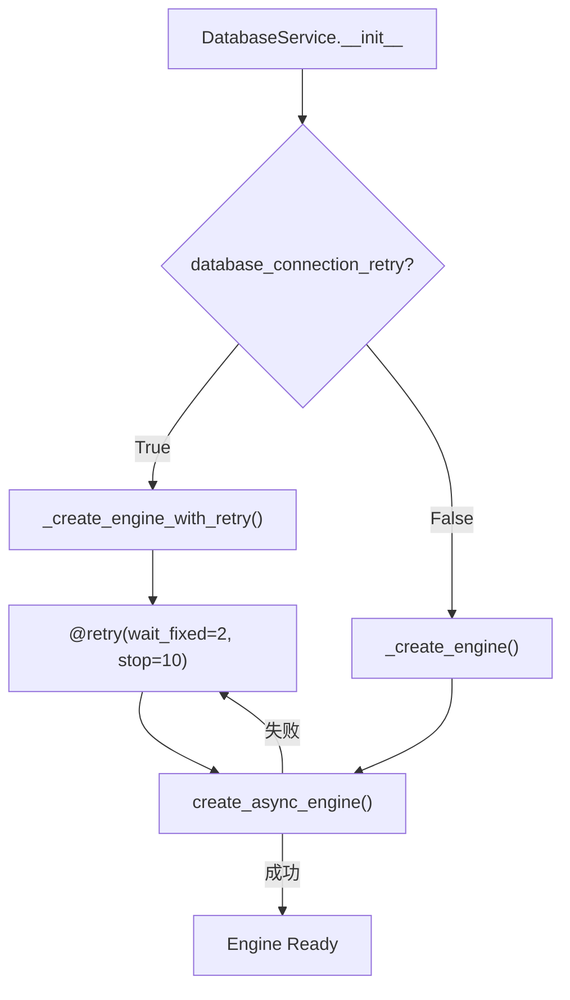
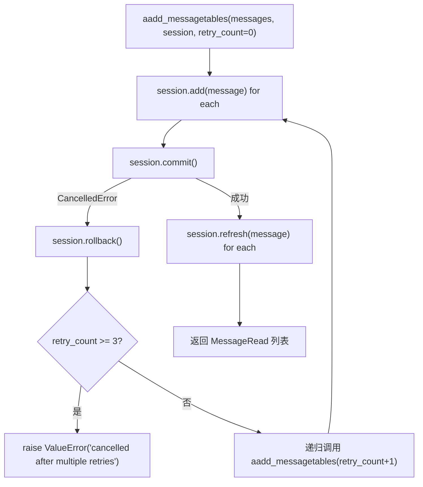
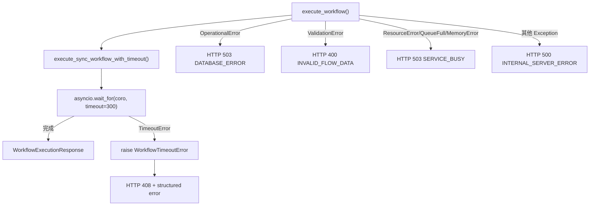

# PD-03.NN Langflow — 四层容错体系与 tenacity 配置化重试

> 文档编号：PD-03.NN
> 来源：Langflow `services/database/service.py`, `memory.py`, `api/v2/workflow.py`, `services/jobs/service.py`
> GitHub：https://github.com/langflow-ai/langflow.git
> 问题域：PD-03 容错与重试 Fault Tolerance & Retry
> 状态：可复用方案

---

## 第 1 章 问题与动机

### 1.1 核心问题

Langflow 是一个可视化 LLM 应用构建平台，用户通过拖拽组件构建 Flow（工作流），后端执行涉及数据库连接、消息持久化、外部 API 调用、组件构建等多个故障点。核心挑战：

1. **数据库连接不稳定**：SQLite/PostgreSQL 在启动阶段或高并发下可能连接失败，需要重试
2. **异步取消竞态**：`asyncio.CancelledError` 在 `session.commit()` 期间被触发（`build_public_tmp` 路径），导致消息写入丢失
3. **工作流执行超时**：用户构建的 Flow 可能包含耗时组件（LLM 调用、视频索引），需要超时保护
4. **组件级错误隔离**：单个组件失败不应导致整个 Flow 崩溃，需要返回部分结果
5. **外部 API 速率限制**：Embedding 服务（HuggingFace、TwelveLabs）有速率限制，需要差异化退避策略

### 1.2 Langflow 的解法概述

Langflow 采用四层容错体系，从基础设施到业务逻辑逐层防护：

1. **基础设施层**：`DatabaseService` 用 tenacity `@retry(wait_fixed(2), stop_after_attempt(10))` 保护引擎创建和表初始化（`service.py:171`）
2. **数据层**：`aadd_messagetables()` 用递归重试 + `max_retries=3` 处理 `CancelledError` 竞态（`memory.py:179`）
3. **执行层**：`execute_sync_workflow_with_timeout()` 用 `asyncio.wait_for(timeout=300)` 保护工作流执行（`workflow.py:287`）
4. **组件层**：`embed_chunk_with_retry()` 用双层 tenacity 装饰器区分速率限制错误和普通错误（`opensearch_multimodal.py:1089-1116`）

### 1.3 设计思想

| 设计原则 | 具体实现 | 理由 | 替代方案 |
|----------|----------|------|----------|
| 配置驱动重试 | `database_connection_retry` 开关控制是否启用重试引擎 | 开发环境快速失败，生产环境容错 | 硬编码重试（不灵活） |
| 错误分类差异化 | 速率限制用长退避(2-30s)，普通错误用短退避(1-8s) | 429 需要更长冷却，其他错误快速重试即可 | 统一退避策略（浪费时间或触发限流） |
| 两级错误响应 | 系统错误返回 HTTP 4xx/5xx，组件错误返回 HTTP 200 + error body | 允许客户端获取部分结果用于调试 | 统一返回错误码（丢失部分结果） |
| Job 状态机 | QUEUED→IN_PROGRESS→COMPLETED/FAILED/TIMED_OUT/CANCELLED | 精确追踪每个 Job 的生命周期 | 简单 success/fail 二态 |
| CancelledError 语义区分 | `exc.args[0] == "LANGFLOW_USER_CANCELLED"` 区分用户取消和系统取消 | 用户取消是正常操作，系统取消是异常 | 统一处理所有取消（无法区分意图） |

---

## 第 2 章 源码实现分析

### 2.1 架构概览

Langflow 的容错体系分布在四个层次，每层有独立的重试策略和错误处理逻辑：

```
┌─────────────────────────────────────────────────────────────┐
│                    API Layer (workflow.py)                    │
│  asyncio.wait_for(timeout=300) + 两级错误响应策略             │
│  系统错误 → HTTP 4xx/5xx  |  组件错误 → HTTP 200 + error     │
├─────────────────────────────────────────────────────────────┤
│                  Job Layer (jobs/service.py)                  │
│  execute_with_status() 状态机包装器                           │
│  QUEUED → IN_PROGRESS → COMPLETED/FAILED/TIMED_OUT/CANCELLED │
├─────────────────────────────────────────────────────────────┤
│                 Data Layer (memory.py)                        │
│  aadd_messagetables() 递归重试 max_retries=3                 │
│  CancelledError → rollback → retry                           │
├─────────────────────────────────────────────────────────────┤
│              Infrastructure Layer (database/service.py)       │
│  tenacity @retry(wait_fixed=2, stop=10)                      │
│  _create_engine_with_retry / create_db_and_tables_with_retry │
├─────────────────────────────────────────────────────────────┤
│              Component Layer (opensearch, twelvelabs, etc.)   │
│  双层 tenacity: rate_limit(5次,2-30s) + other(3次,1-8s)      │
│  _wait_for_task_completion: 轮询 + consecutive_errors 计数   │
└─────────────────────────────────────────────────────────────┘
```

### 2.2 核心实现

#### 2.2.1 基础设施层：tenacity 配置化重试



对应源码 `src/backend/base/langflow/services/database/service.py:45-69`：
```python
class DatabaseService(Service):
    def __init__(self, settings_service: SettingsService):
        # ...
        if self.settings_service.settings.database_connection_retry:
            self.engine = self._create_engine_with_retry()
        else:
            self.engine = self._create_engine()

    @retry(wait=wait_fixed(2), stop=stop_after_attempt(10))
    def _create_engine_with_retry(self) -> AsyncEngine:
        """Create the engine for the database with retry logic."""
        return self._create_engine()
```

同样的策略应用于表创建（`service.py:511-513`）：
```python
    @retry(wait=wait_fixed(2), stop=stop_after_attempt(10))
    async def create_db_and_tables_with_retry(self) -> None:
        await self.create_db_and_tables()
```

关键设计：`wait_fixed(2)` 而非指数退避，因为数据库连接失败通常是暂时性的（服务启动中），固定 2 秒间隔足够且可预测。

#### 2.2.2 数据层：CancelledError 递归重试



对应源码 `src/backend/base/langflow/memory.py:179-228`：
```python
async def aadd_messagetables(messages: list[MessageTable], session: AsyncSession, retry_count: int = 0):
    max_retries = 3
    try:
        try:
            for message in messages:
                result = session.add(message)
                if asyncio.iscoroutine(result):
                    await result
            await session.commit()
        except asyncio.CancelledError:
            await session.rollback()
            if retry_count >= max_retries:
                await logger.awarning(
                    f"Max retries ({max_retries}) reached for aadd_messagetables due to CancelledError"
                )
                error_msg = "Add Message operation cancelled after multiple retries"
                raise ValueError(error_msg) from None
            return await aadd_messagetables(messages, session, retry_count + 1)
        for message in messages:
            await session.refresh(message)
    except asyncio.CancelledError as e:
        await logger.aexception(e)
        error_msg = "Operation cancelled"
        raise ValueError(error_msg) from e
```

注意双层 try-except 结构：内层捕获 commit 阶段的 CancelledError 并重试，外层捕获 refresh 阶段的 CancelledError 并直接失败。这是因为 commit 失败可以 rollback 重试，但 refresh 失败说明数据已提交但无法读回，属于不同的故障模式。

#### 2.2.3 执行层：asyncio.wait_for 超时保护



对应源码 `src/backend/base/langflow/api/v2/workflow.py:261-299`：
```python
async def execute_sync_workflow_with_timeout(
    workflow_request, flow, job_id, api_key_user, background_tasks, http_request,
) -> WorkflowExecutionResponse:
    try:
        return await asyncio.wait_for(
            execute_sync_workflow(
                workflow_request=workflow_request, flow=flow, job_id=job_id,
                api_key_user=api_key_user, background_tasks=background_tasks,
                http_request=http_request,
            ),
            timeout=EXECUTION_TIMEOUT,  # 300 seconds
        )
    except asyncio.TimeoutError as e:
        raise WorkflowTimeoutError from e
```

两级错误响应策略（`workflow.py:302-421`）：
- **系统错误**（graph 构建失败、验证错误）→ raise exception → HTTP 4xx/5xx
- **组件执行错误** → `create_error_response()` → HTTP 200 + error in body

这允许客户端在部分组件失败时仍能获取已成功组件的输出。

#### 2.2.4 Job 状态机与 CancelledError 语义区分

对应源码 `src/backend/base/langflow/services/jobs/service.py:140-207`：
```python
async def execute_with_status(self, job_id, run_coro_func, *args, **kwargs):
    try:
        await self.update_job_status(job_id, JobStatus.IN_PROGRESS)
        result = await run_coro_func(*args, **kwargs)
    except AssertionError as e:
        await self.update_job_status(job_id, JobStatus.FAILED, finished_timestamp=True)
        raise
    except asyncio.TimeoutError as e:
        await self.update_job_status(job_id, JobStatus.TIMED_OUT, finished_timestamp=True)
        raise
    except asyncio.CancelledError as exc:
        if exc.args and exc.args[0] == "LANGFLOW_USER_CANCELLED":
            await self.update_job_status(job_id, JobStatus.CANCELLED, finished_timestamp=True)
        else:
            await self.update_job_status(job_id, JobStatus.FAILED, finished_timestamp=True)
        raise
    except Exception as e:
        await self.update_job_status(job_id, JobStatus.FAILED, finished_timestamp=True)
        raise
    else:
        await self.update_job_status(job_id, JobStatus.COMPLETED, finished_timestamp=True)
        return result
```

### 2.3 实现细节

#### 2.3.1 组件层双层 tenacity 装饰器

OpenSearch 多模态组件对 Embedding 调用使用了双层 tenacity 装饰器，按错误类型差异化退避（`opensearch_multimodal.py:1069-1127`）：

```python
# 速率限制错误：长退避（2-30s），5 次重试
retry_on_rate_limit = retry(
    retry=retry_if_exception(is_rate_limit_error),
    stop=stop_after_attempt(5),
    wait=wait_exponential(multiplier=2, min=2, max=30),
    reraise=True,
)

# 其他错误：短退避（1-8s），3 次重试
retry_on_other_errors = retry(
    retry=retry_if_exception(is_other_retryable_error),
    stop=stop_after_attempt(3),
    wait=wait_exponential(multiplier=1, min=1, max=8),
    reraise=True,
)

@retry_on_rate_limit
@retry_on_other_errors
def _embed(text: str) -> list[float]:
    return selected_embedding.embed_documents([text])[0]
```

速率限制检测通过字符串匹配实现：`"429" in error_str or "rate_limit" in error_str`。

#### 2.3.2 SSE 事件发射超时保护

`WebhookEventManager.emit()` 对慢消费者使用 1 秒超时（`event_manager.py:128-137`）：

```python
for queue in listeners:
    try:
        await asyncio.wait_for(queue.put(event), timeout=SSE_EMIT_TIMEOUT_SECONDS)  # 1.0s
    except asyncio.TimeoutError:
        logger.warning(f"Queue full for flow {flow_id}, dropping event {event_type}")
    except Exception as e:
        dead_queues.add(queue)
```

超时后丢弃事件而非阻塞，防止慢消费者拖垮整个事件广播系统。死亡队列在循环结束后批量清理。

#### 2.3.3 Alembic 迁移渐进降级重试

数据库迁移检测到 schema 不一致时，采用渐进降级策略（`service.py:412-426`）：

```python
@staticmethod
def try_downgrade_upgrade_until_success(alembic_cfg, retries=5):
    for i in range(1, retries + 1):
        try:
            command.check(alembic_cfg)
            break
        except util.exc.AutogenerateDiffsDetected:
            command.downgrade(alembic_cfg, f"-{i}")  # 逐步回退 -1, -2, -3...
            time.sleep(3)
            command.upgrade(alembic_cfg, "head")
```

每次回退一个版本再升级到 head，最多回退 5 个版本。这比直接 downgrade 到 base 更保守，减少数据丢失风险。

#### 2.3.4 自定义异常层次结构

`WorkflowExecutionError` 作为基类，派生出 5 个具体异常（`exceptions/api.py:13-34`）：

```
WorkflowExecutionError (base)
├── WorkflowTimeoutError        → HTTP 408
├── WorkflowValidationError     → HTTP 400
├── WorkflowQueueFullError      → HTTP 503
├── WorkflowResourceError       → HTTP 503
└── WorkflowServiceUnavailableError → HTTP 503
```

每个异常映射到特定的 HTTP 状态码和结构化错误响应（含 `error`、`code`、`message` 字段）。

#### 2.3.5 TwelveLabs 轮询容错

视频索引任务使用轮询 + 连续错误计数（`pegasus_index.py:148-187`）：

```python
def _wait_for_task_completion(self, client, task_id, video_path, max_retries=120, sleep_time=10):
    retries = 0
    consecutive_errors = 0
    max_consecutive_errors = 5
    while retries < max_retries:
        try:
            task = self._check_task_status(client, task_id, video_path)  # 内部有 @retry
            if task.status == "ready": return task
            if task.status in ("failed", "error"): raise TaskError(...)
            consecutive_errors = 0  # 成功则重置
        except (ValueError, KeyError) as e:
            consecutive_errors += 1
            if consecutive_errors >= max_consecutive_errors:
                raise  # 连续 5 次错误才放弃
```

双层重试：内层 `_check_task_status` 有 `@retry(stop=5, wait=exponential(5-60s))`，外层轮询有 `max_retries=120`（总计最多 20 分钟）。连续错误计数器在成功时重置，避免偶发错误累积。

---

## 第 3 章 迁移指南

### 3.1 迁移清单

**阶段 1：基础设施容错（1-2 天）**
- [ ] 安装 tenacity：`pip install tenacity`
- [ ] 为数据库引擎创建添加 `@retry` 装饰器
- [ ] 添加配置开关控制是否启用重试（开发环境关闭加速启动）
- [ ] 为表创建/迁移添加重试保护

**阶段 2：数据层容错（1 天）**
- [ ] 识别 `asyncio.CancelledError` 可能出现的写入路径
- [ ] 为关键写入操作添加递归重试 + max_retries 限制
- [ ] 确保 rollback 在重试前执行

**阶段 3：执行层超时保护（1 天）**
- [ ] 用 `asyncio.wait_for()` 包装长时间运行的协程
- [ ] 定义自定义异常层次结构（Timeout/Validation/Resource）
- [ ] 实现两级错误响应：系统错误 vs 业务错误

**阶段 4：组件层差异化重试（按需）**
- [ ] 为外部 API 调用添加 tenacity 重试
- [ ] 区分速率限制错误和普通错误，使用不同退避策略
- [ ] 为轮询类操作添加连续错误计数器

### 3.2 适配代码模板

#### 模板 1：配置驱动的数据库重试

```python
from tenacity import retry, stop_after_attempt, wait_fixed
from sqlalchemy.ext.asyncio import AsyncEngine, create_async_engine

class DatabaseService:
    def __init__(self, settings):
        if settings.connection_retry_enabled:
            self.engine = self._create_engine_with_retry(settings)
        else:
            self.engine = self._create_engine(settings)

    @staticmethod
    def _create_engine(settings) -> AsyncEngine:
        return create_async_engine(
            settings.database_url,
            pool_size=settings.pool_size,
            max_overflow=settings.max_overflow,
        )

    @staticmethod
    @retry(wait=wait_fixed(2), stop=stop_after_attempt(10))
    def _create_engine_with_retry(settings) -> AsyncEngine:
        return DatabaseService._create_engine(settings)
```

#### 模板 2：CancelledError 安全写入

```python
import asyncio
from sqlmodel.ext.asyncio.session import AsyncSession

async def safe_batch_write(
    items: list,
    session: AsyncSession,
    retry_count: int = 0,
    max_retries: int = 3,
):
    """带 CancelledError 重试的批量写入。"""
    try:
        for item in items:
            session.add(item)
        await session.commit()
    except asyncio.CancelledError:
        await session.rollback()
        if retry_count >= max_retries:
            raise ValueError("Write cancelled after max retries") from None
        return await safe_batch_write(items, session, retry_count + 1, max_retries)
    
    # commit 成功后 refresh
    for item in items:
        await session.refresh(item)
    return items
```

#### 模板 3：双层 tenacity 差异化重试

```python
from tenacity import (
    retry, retry_if_exception, stop_after_attempt, wait_exponential,
)

def is_rate_limit_error(exc: Exception) -> bool:
    err = str(exc).lower()
    return "429" in err or "rate limit" in err

retry_rate_limit = retry(
    retry=retry_if_exception(is_rate_limit_error),
    stop=stop_after_attempt(5),
    wait=wait_exponential(multiplier=2, min=2, max=30),
    reraise=True,
)

retry_other = retry(
    retry=retry_if_exception(lambda e: not is_rate_limit_error(e)),
    stop=stop_after_attempt(3),
    wait=wait_exponential(multiplier=1, min=1, max=8),
    reraise=True,
)

@retry_rate_limit
@retry_other
def call_embedding_api(text: str) -> list[float]:
    return embedding_client.embed([text])[0]
```

#### 模板 4：Job 状态机包装器

```python
import asyncio
from enum import Enum

class JobStatus(str, Enum):
    QUEUED = "QUEUED"
    IN_PROGRESS = "IN_PROGRESS"
    COMPLETED = "COMPLETED"
    FAILED = "FAILED"
    TIMED_OUT = "TIMED_OUT"
    CANCELLED = "CANCELLED"

async def execute_with_status(job_id, update_status_fn, coro_fn, *args, **kwargs):
    """状态机包装器：自动管理 Job 生命周期。"""
    try:
        await update_status_fn(job_id, JobStatus.IN_PROGRESS)
        result = await coro_fn(*args, **kwargs)
    except asyncio.TimeoutError:
        await update_status_fn(job_id, JobStatus.TIMED_OUT)
        raise
    except asyncio.CancelledError as exc:
        status = JobStatus.CANCELLED if _is_user_cancel(exc) else JobStatus.FAILED
        await update_status_fn(job_id, status)
        raise
    except Exception:
        await update_status_fn(job_id, JobStatus.FAILED)
        raise
    else:
        await update_status_fn(job_id, JobStatus.COMPLETED)
        return result

def _is_user_cancel(exc: asyncio.CancelledError) -> bool:
    return bool(exc.args and exc.args[0] == "USER_CANCELLED")
```

### 3.3 适用场景

| 场景 | 适用度 | 说明 |
|------|--------|------|
| Web 应用 + 数据库后端 | ⭐⭐⭐ | 配置化重试 + 连接池管理直接适用 |
| LLM 应用（多 Provider） | ⭐⭐⭐ | 双层 tenacity 差异化退避非常适合 |
| 异步任务队列系统 | ⭐⭐⭐ | Job 状态机 + CancelledError 语义区分 |
| 实时流式应用（SSE/WebSocket） | ⭐⭐ | SSE 超时丢弃策略可借鉴，但需要根据业务调整 |
| 批量数据处理管道 | ⭐⭐ | 连续错误计数器适合，但可能需要更复杂的断路器 |
| 微服务间 RPC | ⭐ | 缺少断路器和熔断机制，需要额外补充 |

---

## 第 4 章 测试用例

```python
import asyncio
import pytest
from unittest.mock import AsyncMock, MagicMock, patch
from tenacity import retry, stop_after_attempt, wait_fixed


class TestDatabaseRetry:
    """测试基础设施层 tenacity 重试。"""

    def test_create_engine_with_retry_succeeds_after_failures(self):
        """引擎创建在第 3 次尝试成功。"""
        call_count = 0

        @retry(wait=wait_fixed(0.01), stop=stop_after_attempt(10))
        def create_engine_with_retry():
            nonlocal call_count
            call_count += 1
            if call_count < 3:
                raise ConnectionError("Database not ready")
            return "engine"

        result = create_engine_with_retry()
        assert result == "engine"
        assert call_count == 3

    def test_create_engine_exhausts_retries(self):
        """引擎创建耗尽重试次数后抛出异常。"""
        @retry(wait=wait_fixed(0.01), stop=stop_after_attempt(3))
        def create_engine_with_retry():
            raise ConnectionError("Database permanently down")

        with pytest.raises(ConnectionError):
            create_engine_with_retry()


class TestCancelledErrorRetry:
    """测试数据层 CancelledError 递归重试。"""

    @pytest.mark.asyncio
    async def test_retry_on_cancelled_error(self):
        """CancelledError 触发重试，第 2 次成功。"""
        call_count = 0

        async def mock_commit():
            nonlocal call_count
            call_count += 1
            if call_count == 1:
                raise asyncio.CancelledError()

        session = AsyncMock()
        session.commit = mock_commit
        session.rollback = AsyncMock()
        session.add = MagicMock()
        session.refresh = AsyncMock()

        # 简化版 aadd_messagetables
        async def safe_write(items, sess, retry_count=0, max_retries=3):
            try:
                for item in items:
                    sess.add(item)
                await sess.commit()
            except asyncio.CancelledError:
                await sess.rollback()
                if retry_count >= max_retries:
                    raise ValueError("Max retries") from None
                return await safe_write(items, sess, retry_count + 1, max_retries)
            return items

        result = await safe_write(["msg1"], session)
        assert result == ["msg1"]
        assert call_count == 2
        session.rollback.assert_called_once()

    @pytest.mark.asyncio
    async def test_max_retries_exceeded(self):
        """超过最大重试次数后抛出 ValueError。"""
        session = AsyncMock()
        session.commit = AsyncMock(side_effect=asyncio.CancelledError())
        session.rollback = AsyncMock()
        session.add = MagicMock()

        async def safe_write(items, sess, retry_count=0, max_retries=3):
            try:
                for item in items:
                    sess.add(item)
                await sess.commit()
            except asyncio.CancelledError:
                await sess.rollback()
                if retry_count >= max_retries:
                    raise ValueError("Max retries") from None
                return await safe_write(items, sess, retry_count + 1, max_retries)

        with pytest.raises(ValueError, match="Max retries"):
            await safe_write(["msg1"], session)


class TestWorkflowTimeout:
    """测试执行层超时保护。"""

    @pytest.mark.asyncio
    async def test_timeout_raises_error(self):
        """超时触发 TimeoutError。"""
        async def slow_workflow():
            await asyncio.sleep(10)

        with pytest.raises(asyncio.TimeoutError):
            await asyncio.wait_for(slow_workflow(), timeout=0.01)

    @pytest.mark.asyncio
    async def test_fast_workflow_completes(self):
        """正常工作流在超时前完成。"""
        async def fast_workflow():
            return {"result": "ok"}

        result = await asyncio.wait_for(fast_workflow(), timeout=1.0)
        assert result == {"result": "ok"}


class TestJobStatusMachine:
    """测试 Job 状态机。"""

    @pytest.mark.asyncio
    async def test_successful_execution(self):
        """成功执行更新状态为 COMPLETED。"""
        statuses = []

        async def update_status(job_id, status, **kwargs):
            statuses.append(status)

        async def success_fn():
            return "result"

        result = await self._execute_with_status("job1", update_status, success_fn)
        assert result == "result"
        assert statuses == ["IN_PROGRESS", "COMPLETED"]

    @pytest.mark.asyncio
    async def test_timeout_sets_timed_out(self):
        """超时更新状态为 TIMED_OUT。"""
        statuses = []

        async def update_status(job_id, status, **kwargs):
            statuses.append(status)

        async def timeout_fn():
            raise asyncio.TimeoutError()

        with pytest.raises(asyncio.TimeoutError):
            await self._execute_with_status("job1", update_status, timeout_fn)
        assert "TIMED_OUT" in statuses

    @staticmethod
    async def _execute_with_status(job_id, update_fn, coro_fn):
        try:
            await update_fn(job_id, "IN_PROGRESS")
            result = await coro_fn()
        except asyncio.TimeoutError:
            await update_fn(job_id, "TIMED_OUT")
            raise
        except Exception:
            await update_fn(job_id, "FAILED")
            raise
        else:
            await update_fn(job_id, "COMPLETED")
            return result
```

---

## 第 5 章 跨域关联

| 关联域 | 关系类型 | 说明 |
|--------|----------|------|
| PD-01 上下文管理 | 协同 | 工作流超时保护（300s）间接限制了上下文窗口的增长；组件错误返回部分结果减少了上下文浪费 |
| PD-02 多 Agent 编排 | 依赖 | Job 状态机（QUEUED→IN_PROGRESS→COMPLETED）是多组件编排的基础；`execute_with_status` 包装器可用于任何编排节点 |
| PD-04 工具系统 | 协同 | 组件层的双层 tenacity 装饰器直接应用于工具调用（Embedding、视频索引）；工具调用失败通过 `ComponentBuildError` 上报 |
| PD-06 记忆持久化 | 依赖 | `aadd_messagetables` 的 CancelledError 重试直接保护消息持久化；数据库引擎重试保护所有记忆读写操作 |
| PD-10 中间件管道 | 协同 | SSE 事件发射超时（1s）是事件管道的容错机制；死亡队列清理防止管道堵塞 |
| PD-11 可观测性 | 依赖 | Job 状态机的每次状态转换都有 `logger.ainfo/aerror` 记录；`ComponentBuildError` 包含格式化的 traceback |

---

## 第 6 章 来源文件索引

| 文件 | 行范围 | 关键实现 |
|------|--------|----------|
| `src/backend/base/langflow/services/database/service.py` | L26, L45-69 | tenacity import + DatabaseService 初始化，配置驱动重试开关 |
| `src/backend/base/langflow/services/database/service.py` | L171-174 | `_create_engine_with_retry()` tenacity 装饰器 |
| `src/backend/base/langflow/services/database/service.py` | L511-513 | `create_db_and_tables_with_retry()` tenacity 装饰器 |
| `src/backend/base/langflow/services/database/service.py` | L412-426 | `try_downgrade_upgrade_until_success()` 渐进降级迁移 |
| `src/backend/base/langflow/memory.py` | L179-228 | `aadd_messagetables()` CancelledError 递归重试 |
| `src/backend/base/langflow/api/v2/workflow.py` | L71, L261-299 | `EXECUTION_TIMEOUT=300` + `asyncio.wait_for` 超时保护 |
| `src/backend/base/langflow/api/v2/workflow.py` | L109-258 | `execute_workflow()` 两级错误响应策略 |
| `src/backend/base/langflow/api/v2/workflow.py` | L405-421 | 组件错误 → HTTP 200 + error body |
| `src/backend/base/langflow/services/jobs/service.py` | L140-207 | `execute_with_status()` Job 状态机包装器 |
| `src/backend/base/langflow/services/jobs/service.py` | L186-196 | CancelledError 语义区分（用户 vs 系统） |
| `src/backend/base/langflow/exceptions/api.py` | L9-34 | 自定义异常层次结构（5 个 Workflow 异常） |
| `src/backend/base/langflow/services/event_manager.py` | L21-22, L128-137 | SSE 事件发射超时（1s）+ 死亡队列清理 |
| `src/lfx/src/lfx/components/elastic/opensearch_multimodal.py` | L1069-1127 | 双层 tenacity 装饰器（速率限制 vs 普通错误） |
| `src/lfx/src/lfx/components/twelvelabs/pegasus_index.py` | L133-187 | `@retry(exponential 5-60s)` + 轮询连续错误计数 |
| `src/lfx/src/lfx/graph/vertex/base.py` | L642-664 | 组件构建错误捕获 + `ComponentBuildError` 包装 |

---

## 第 7 章 横向对比维度

> **重要：** 本章用于自动填充 Butcher Wiki 的横向对比表。
> 必须严格按以下 JSON 格式输出，放在 `comparison_data` 代码块中。

```json comparison_data
{
  "project": "Langflow",
  "dimensions": {
    "重试策略": "tenacity @retry 配置化：固定等待(2s×10次)用于DB，指数退避(5-60s)用于API",
    "错误分类": "双层 tenacity 装饰器按 429/非429 分流，5 类自定义 Workflow 异常",
    "超时保护": "asyncio.wait_for(300s) 工作流级 + 1s SSE 事件发射级双层超时",
    "优雅降级": "组件错误返回 HTTP 200 + error body，允许部分结果；SSE 超时丢弃事件",
    "连接池管理": "async_sessionmaker + 配置化 pool_size/max_overflow/poolclass",
    "恢复机制": "CancelledError 递归重试(max=3) + Alembic 渐进降级(downgrade -1~-5)",
    "并发容错": "SSE 死亡队列批量清理 + asyncio.Lock 保护 listener 集合",
    "配置预验证": "database_connection_retry 开关 + db_driver_connection_settings 配置化"
  }
}
```

### 域元数据补充

```json domain_metadata
{
  "solution_summary": "Langflow 用 tenacity 配置化重试(DB层) + CancelledError 递归重试(数据层) + asyncio.wait_for 超时(执行层) + 双层差异化退避(组件层) 构建四层容错体系",
  "description": "可视化工作流平台中组件级错误隔离与部分结果返回的容错模式",
  "sub_problems": [
    "asyncio.CancelledError 在 session.commit() 期间被触发导致写入丢失，需要 rollback+递归重试",
    "CancelledError 语义模糊：用户主动取消与系统异常取消需要通过 exc.args 区分处理",
    "Alembic 迁移 schema 不一致时需要渐进降级（逐版本回退）而非直接回退到 base",
    "SSE 慢消费者阻塞事件广播：需要超时丢弃 + 死亡队列清理防止整体拖慢",
    "双层 tenacity 装饰器叠加时外层捕获内层已处理的异常：需要 retry_if_exception 精确分流"
  ],
  "best_practices": [
    "配置开关控制重试：开发环境关闭重试快速失败，生产环境开启容错",
    "两级错误响应：系统错误返回 HTTP 错误码，业务错误返回 200+error body 保留部分结果",
    "CancelledError 语义标记：通过 exc.args 传递取消原因，区分用户操作和系统异常",
    "SSE 事件发射设超时上限：防止慢消费者拖垮广播系统，超时后丢弃而非阻塞"
  ]
}
```
