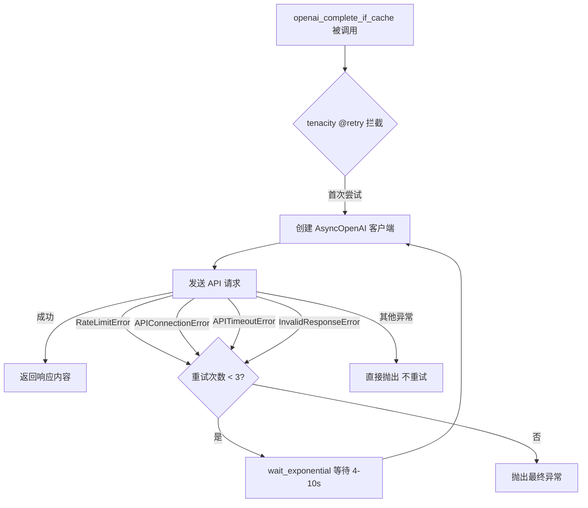
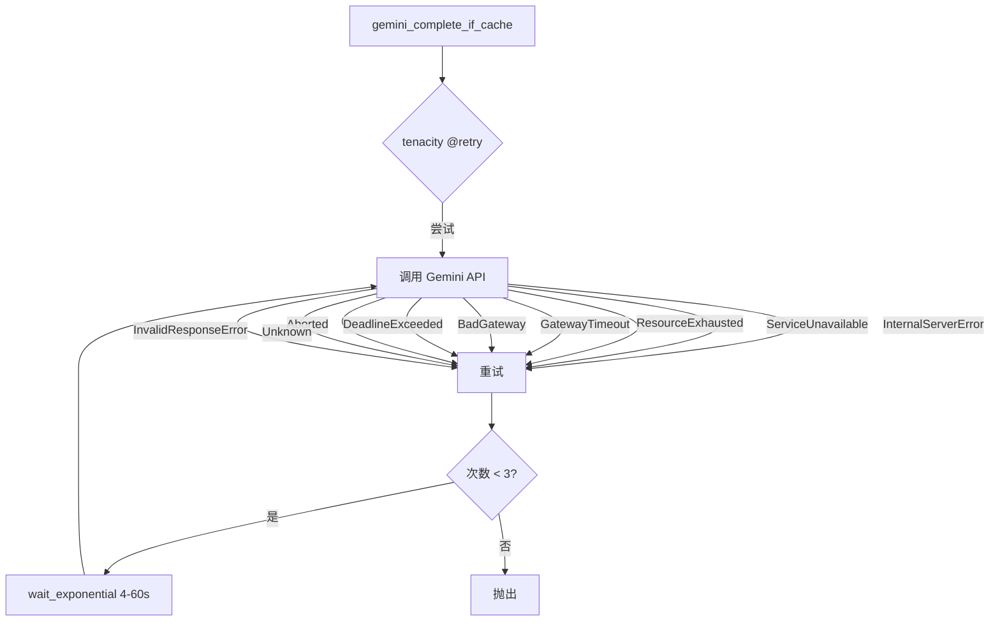
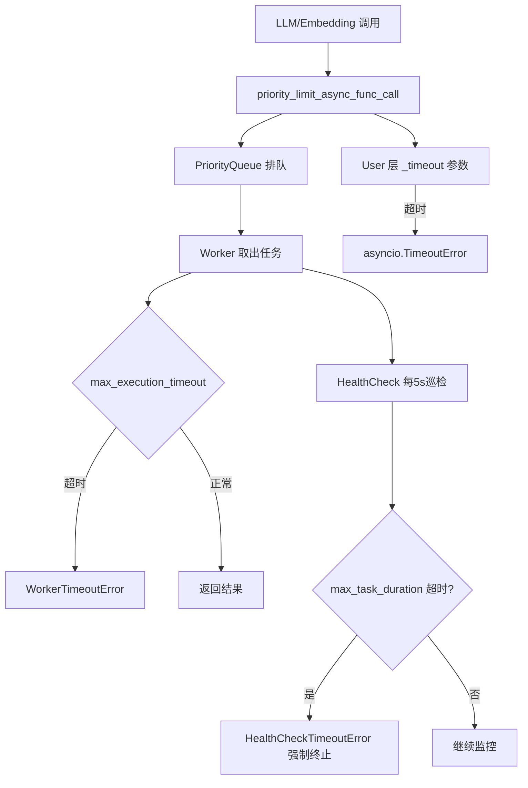

# PD-03.04 LightRAG — 多层 Tenacity 重试与优先级超时保护

> 文档编号：PD-03.04
> 来源：LightRAG `lightrag/llm/openai.py`, `lightrag/utils.py`, `lightrag/rerank.py`, `lightrag/kg/redis_impl.py`, `lightrag/kg/neo4j_impl.py`
> GitHub：https://github.com/HKUDS/LightRAG.git
> 问题域：PD-03 容错与重试 Fault Tolerance & Retry
> 状态：可复用方案

---

## 第 1 章 问题与动机

### 1.1 核心问题

LightRAG 是一个轻量级 RAG（Retrieval-Augmented Generation）框架，其全链路涉及 LLM 调用、Embedding 生成、Rerank 排序、向量数据库（VDB）操作和图数据库（KG）操作。每一层都可能因网络超时、速率限制、服务不可用等原因失败。如果任何一层没有容错保护，整个 RAG 流水线就会因单点故障而崩溃。

核心挑战：
- **多 Provider 异构**：支持 OpenAI、Gemini、Anthropic、Bedrock、Ollama、智谱等 10+ LLM 提供商，每个 Provider 的错误类型和重试语义不同
- **全链路覆盖**：从 LLM 调用到 Embedding、Rerank、VDB、KG 五层都需要独立的容错策略
- **并发控制**：大量并发 LLM 请求需要优先级队列 + 多层超时保护，防止资源耗尽
- **存储层可靠性**：Redis/Neo4j 等存储层的连接中断需要自动恢复

### 1.2 LightRAG 的解法概述

1. **统一 tenacity 装饰器模式**：所有 LLM Provider 和 Rerank API 使用 `@retry(stop_after_attempt(3), wait_exponential(...))` 装饰器，形成统一的重试范式（`lightrag/llm/openai.py:187-196`）
2. **自定义 VDB 重试函数**：向量数据库操作通过 `safe_vdb_operation_with_exception()` 实现手动重试循环，支持自定义延迟和日志（`lightrag/utils.py:132-173`）
3. **三层超时保护体系**：`priority_limit_async_func_call` 装饰器实现 Worker → Health Check → User 三层超时，防止任务卡死（`lightrag/utils.py:616-1058`）
4. **Provider 级错误分类**：Bedrock 通过 `_handle_bedrock_exception()` 将 AWS 异常映射为可重试/不可重试类型（`lightrag/llm/bedrock.py:64-132`）
5. **存储层专用重试**：Redis 和 Neo4j 各有独立的 tenacity 重试装饰器，针对各自的异常类型（`lightrag/kg/redis_impl.py:46-55`, `lightrag/kg/neo4j_impl.py:56-61`）

### 1.3 设计思想

| 设计原则 | 具体实现 | 理由 | 替代方案 |
|----------|----------|------|----------|
| 装饰器统一范式 | 所有 LLM 函数用 `@retry` 装饰器 | 避免每个函数内部写重试逻辑，保持业务代码干净 | 手动 try/except 循环 |
| 异常类型精确匹配 | `retry_if_exception_type` 只重试特定异常 | 避免对不可恢复错误（如认证失败）浪费重试次数 | 重试所有异常 |
| 指数退避 | `wait_exponential(multiplier=1, min=4, max=60)` | 避免重试风暴，给服务端恢复时间 | 固定间隔重试 |
| 多层超时分离 | Worker/HealthCheck/User 三层独立超时 | 每层有不同的恢复语义，避免单一超时导致资源泄漏 | 单一全局超时 |
| 错误分类前置 | Bedrock 的 `_handle_bedrock_exception` | 将 Provider 原生异常转换为语义化异常，便于 tenacity 精确匹配 | 直接捕获原生异常 |

---

## 第 2 章 源码实现分析

### 2.1 架构概览

LightRAG 的容错体系分为三个层次：

```
┌─────────────────────────────────────────────────────────────────┐
│                    用户请求 (query/insert)                        │
├─────────────────────────────────────────────────────────────────┤
│  Layer 3: priority_limit_async_func_call                        │
│  ┌─────────────┐  ┌──────────────┐  ┌────────────────────┐     │
│  │ Worker 超时  │→│ HealthCheck  │→│ User-level 超时     │     │
│  │ (llm*2)     │  │ (llm*2+15)  │  │ (调用方指定)        │     │
│  └─────────────┘  └──────────────┘  └────────────────────┘     │
├─────────────────────────────────────────────────────────────────┤
│  Layer 2: @retry (tenacity 装饰器)                               │
│  ┌──────────┐ ┌──────────┐ ┌──────────┐ ┌──────────┐          │
│  │ OpenAI   │ │ Gemini   │ │ Bedrock  │ │ Rerank   │ ...      │
│  │ 3次/4-10s│ │ 3次/4-60s│ │ 5次/4-60s│ │ 3次/4-60s│          │
│  └──────────┘ └──────────┘ └──────────┘ └──────────┘          │
├─────────────────────────────────────────────────────────────────┤
│  Layer 1: 存储层容错                                             │
│  ┌──────────────────┐ ┌──────────────┐ ┌───────────────────┐   │
│  │ VDB 手动重试      │ │ Redis retry  │ │ Neo4j READ_RETRY  │   │
│  │ safe_vdb_op 3次  │ │ tenacity 3次 │ │ tenacity 3次      │   │
│  └──────────────────┘ └──────────────┘ └───────────────────┘   │
└─────────────────────────────────────────────────────────────────┘
```

### 2.2 核心实现

#### 2.2.1 LLM 调用层 — tenacity 装饰器模式



对应源码 `lightrag/llm/openai.py:187-196`：

```python
@retry(
    stop=stop_after_attempt(3),
    wait=wait_exponential(multiplier=1, min=4, max=10),
    retry=(
        retry_if_exception_type(RateLimitError)
        | retry_if_exception_type(APIConnectionError)
        | retry_if_exception_type(APITimeoutError)
        | retry_if_exception_type(InvalidResponseError)
    ),
)
async def openai_complete_if_cache(
    model: str,
    prompt: str,
    ...
) -> str:
```

关键设计点：
- `InvalidResponseError` 是自定义异常（`openai.py:72-75`），当 API 返回空内容时触发重试（`openai.py:542`, `openai.py:595`）
- OpenAI 的 `max=10` 比其他 Provider 的 `max=60` 更激进，因为 OpenAI API 通常恢复更快
- 每次重试都会重新创建 `AsyncOpenAI` 客户端（`openai.py:289-297`），避免连接池污染

#### 2.2.2 Gemini 的宽泛异常覆盖



对应源码 `lightrag/llm/gemini.py:203-216`：

```python
@retry(
    stop=stop_after_attempt(3),
    wait=wait_exponential(multiplier=1, min=4, max=60),
    retry=(
        retry_if_exception_type(google_api_exceptions.InternalServerError)
        | retry_if_exception_type(google_api_exceptions.ServiceUnavailable)
        | retry_if_exception_type(google_api_exceptions.ResourceExhausted)
        | retry_if_exception_type(google_api_exceptions.GatewayTimeout)
        | retry_if_exception_type(google_api_exceptions.BadGateway)
        | retry_if_exception_type(google_api_exceptions.DeadlineExceeded)
        | retry_if_exception_type(google_api_exceptions.Aborted)
        | retry_if_exception_type(google_api_exceptions.Unknown)
        | retry_if_exception_type(InvalidResponseError)
    ),
)
async def gemini_complete_if_cache(...)
```

Gemini 覆盖了 9 种异常类型，是所有 Provider 中最宽泛的，反映了 Google API 错误类型的多样性。

#### 2.2.3 Bedrock 的错误分类前置

```mermaid
graph TD
    A[AWS 原生异常] --> B[_handle_bedrock_exception]
    B --> C{异常类型判断}
    C -->|ThrottlingException| D[BedrockRateLimitError 可重试]
    C -->|ServiceUnavailable| E[BedrockConnectionError 可重试]
    C -->|HTTP 5xx| E
    C -->|ReadTimeoutError| F[BedrockTimeoutError 可重试]
    C -->|ValidationException| G[BedrockError 不可重试]
    D --> H[@retry 捕获并重试]
    E --> H
    F --> H
    G --> I[直接抛出]
```

对应源码 `lightrag/llm/bedrock.py:64-132`：

```python
def _handle_bedrock_exception(e: Exception, operation: str = "Bedrock API") -> None:
    error_message = str(e)
    if isinstance(e, ClientError):
        error_code = e.response.get("Error", {}).get("Code", "")
        if error_code in ["ThrottlingException", "ProvisionedThroughputExceededException"]:
            raise BedrockRateLimitError(f"Rate limit error: {error_msg}")
        elif error_code in ["ServiceUnavailableException", "InternalServerException"]:
            raise BedrockConnectionError(f"Service error: {error_msg}")
        elif e.response.get("ResponseMetadata", {}).get("HTTPStatusCode", 0) >= 500:
            raise BedrockConnectionError(f"Server error: {error_msg}")
        else:
            raise BedrockError(f"Client error: {error_msg}")
```

Bedrock 是唯一使用 `stop_after_attempt(5)` 的 Provider（其他都是 3 次），因为 AWS 的 Throttling 恢复通常需要更多次重试。

### 2.3 实现细节

#### 2.3.1 VDB 手动重试机制

`safe_vdb_operation_with_exception`（`lightrag/utils.py:132-173`）是一个手动实现的重试函数，不使用 tenacity：

```python
async def safe_vdb_operation_with_exception(
    operation: Callable,
    operation_name: str,
    entity_name: str = "",
    max_retries: int = 3,
    retry_delay: float = 0.2,
    logger_func: Optional[Callable] = None,
) -> None:
    log_func = logger_func or logger.warning
    for attempt in range(max_retries):
        try:
            await operation()
            return
        except Exception as e:
            if attempt >= max_retries - 1:
                error_msg = f"VDB {operation_name} failed for {entity_name} after {max_retries} attempts: {e}"
                log_func(error_msg)
                raise Exception(error_msg) from e
            else:
                log_func(f"VDB {operation_name} attempt {attempt + 1} failed for {entity_name}: {e}, retrying...")
                if retry_delay > 0:
                    await asyncio.sleep(retry_delay)
```

设计选择：VDB 操作使用固定延迟（0.2s）而非指数退避，因为 VDB 操作通常是本地/内网调用，延迟短且恢复快。

#### 2.3.2 三层超时保护体系

`priority_limit_async_func_call`（`lightrag/utils.py:616-1058`）是 LightRAG 最复杂的容错组件，实现了优先级队列 + 三层超时：



超时层级计算（`lightrag/utils.py:652-662`）：

```python
if llm_timeout is not None:
    if max_execution_timeout is None:
        max_execution_timeout = llm_timeout * 2       # Worker 超时 = LLM超时 × 2
    if max_task_duration is None:
        max_task_duration = llm_timeout * 2 + 15      # HealthCheck = LLM超时 × 2 + 15s
```

实际使用（`lightrag/lightrag.py:553-557`, `lightrag/lightrag.py:664-667`）：

```python
# Embedding 函数包装
wrapped_func = priority_limit_async_func_call(
    self.embedding_func_max_async,
    llm_timeout=self.default_embedding_timeout,
    queue_name="Embedding func",
)(self.embedding_func.func)

# LLM 函数包装
self.llm_model_func = priority_limit_async_func_call(
    self.llm_model_max_async,
    llm_timeout=self.default_llm_timeout,
    queue_name="LLM func",
)(self.llm_model_func)
```

#### 2.3.3 Redis 存储层重试

Redis 实现使用 tenacity 的 `before_sleep_log` 在每次重试前记录日志（`lightrag/kg/redis_impl.py:46-55`）：

```python
RETRY_ATTEMPTS = int(os.getenv("REDIS_RETRY_ATTEMPTS", "3"))

redis_retry = retry(
    stop=stop_after_attempt(RETRY_ATTEMPTS),
    wait=wait_exponential(multiplier=1, min=1, max=8),
    retry=(
        retry_if_exception_type(ConnectionError)
        | retry_if_exception_type(TimeoutError)
        | retry_if_exception_type(RedisError)
    ),
    before_sleep=before_sleep_log(logger, logging.WARNING),
)
```

特点：重试次数通过环境变量 `REDIS_RETRY_ATTEMPTS` 可配置，退避范围 1-8s 比 LLM 层更短。

#### 2.3.4 Neo4j 图数据库重试

Neo4j 使用预定义的异常元组和 `reraise=True`（`lightrag/kg/neo4j_impl.py:47-61`）：

```python
READ_RETRY_EXCEPTIONS = (
    neo4jExceptions.ServiceUnavailable,
    neo4jExceptions.TransientError,
    neo4jExceptions.SessionExpired,
    ConnectionResetError,
    OSError,
    AttributeError,
)

READ_RETRY = retry(
    stop=stop_after_attempt(3),
    wait=wait_exponential(multiplier=1, min=4, max=10),
    retry=retry_if_exception_type(READ_RETRY_EXCEPTIONS),
    reraise=True,
)
```

`reraise=True` 确保最终失败时抛出原始异常而非 `RetryError`，便于上层精确处理。


---

## 第 3 章 迁移指南

### 3.1 迁移清单

**阶段 1：基础重试层（1-2 天）**
- [ ] 安装 tenacity：`pip install tenacity`
- [ ] 为每个 LLM Provider 函数添加 `@retry` 装饰器
- [ ] 定义每个 Provider 的可重试异常类型列表
- [ ] 为空响应/无效响应定义 `InvalidResponseError` 自定义异常

**阶段 2：存储层容错（1 天）**
- [ ] 实现 `safe_vdb_operation_with_exception` 或使用 tenacity 装饰器
- [ ] 为 Redis/Neo4j 等存储层添加独立的重试策略
- [ ] 配置存储层的连接超时和重试参数（支持环境变量覆盖）

**阶段 3：并发超时保护（2-3 天）**
- [ ] 实现 `priority_limit_async_func_call` 优先级队列装饰器
- [ ] 配置三层超时：Worker → HealthCheck → User
- [ ] 实现 HealthCheck 巡检线程，检测卡死任务

### 3.2 适配代码模板

#### 模板 1：通用 LLM 重试装饰器

```python
from tenacity import (
    retry,
    stop_after_attempt,
    wait_exponential,
    retry_if_exception_type,
)


class InvalidResponseError(Exception):
    """当 LLM 返回空内容或无效格式时触发重试"""
    pass


def create_llm_retry(
    max_attempts: int = 3,
    min_wait: int = 4,
    max_wait: int = 60,
    retryable_exceptions: tuple = (),
):
    """创建 LLM 调用重试装饰器的工厂函数

    Args:
        max_attempts: 最大重试次数
        min_wait: 最小等待秒数
        max_wait: 最大等待秒数
        retryable_exceptions: 可重试的异常类型元组

    Returns:
        tenacity retry 装饰器
    """
    retry_condition = retry_if_exception_type(InvalidResponseError)
    for exc_type in retryable_exceptions:
        retry_condition = retry_condition | retry_if_exception_type(exc_type)

    return retry(
        stop=stop_after_attempt(max_attempts),
        wait=wait_exponential(multiplier=1, min=min_wait, max=max_wait),
        retry=retry_condition,
    )


# 使用示例
from openai import RateLimitError, APIConnectionError, APITimeoutError

openai_retry = create_llm_retry(
    max_attempts=3,
    min_wait=4,
    max_wait=10,
    retryable_exceptions=(RateLimitError, APIConnectionError, APITimeoutError),
)

@openai_retry
async def call_openai(prompt: str) -> str:
    response = await client.chat.completions.create(...)
    if not response.choices or not response.choices[0].message.content:
        raise InvalidResponseError("Empty response")
    return response.choices[0].message.content
```

#### 模板 2：存储层安全操作封装

```python
import asyncio
import logging
from typing import Callable, Optional

logger = logging.getLogger(__name__)


async def safe_storage_operation(
    operation: Callable,
    operation_name: str,
    entity_name: str = "",
    max_retries: int = 3,
    retry_delay: float = 0.2,
) -> None:
    """存储层操作的安全重试封装

    与 LLM 层不同，存储层使用固定延迟而非指数退避，
    因为存储操作通常是内网调用，恢复时间短。
    """
    for attempt in range(max_retries):
        try:
            await operation()
            return
        except Exception as e:
            if attempt >= max_retries - 1:
                error_msg = (
                    f"{operation_name} failed for {entity_name} "
                    f"after {max_retries} attempts: {e}"
                )
                logger.error(error_msg)
                raise RuntimeError(error_msg) from e
            logger.warning(
                f"{operation_name} attempt {attempt + 1} failed "
                f"for {entity_name}: {e}, retrying..."
            )
            if retry_delay > 0:
                await asyncio.sleep(retry_delay)
```

#### 模板 3：Provider 错误分类器

```python
class RetryableError(Exception):
    """可重试的错误基类"""
    pass

class NonRetryableError(Exception):
    """不可重试的错误基类"""
    pass

class RateLimitException(RetryableError):
    pass

class ConnectionException(RetryableError):
    pass

class TimeoutException(RetryableError):
    pass

class ValidationException(NonRetryableError):
    pass


def classify_provider_error(e: Exception, provider: str) -> Exception:
    """将 Provider 原生异常转换为语义化异常

    这样 tenacity 的 retry_if_exception_type 可以精确匹配，
    避免对不可恢复错误浪费重试次数。
    """
    error_msg = str(e)

    # 速率限制类
    if any(keyword in error_msg.lower() for keyword in ["rate limit", "throttl", "429"]):
        return RateLimitException(f"[{provider}] {error_msg}")

    # 连接类
    if any(keyword in error_msg.lower() for keyword in ["connection", "unavailable", "502", "503"]):
        return ConnectionException(f"[{provider}] {error_msg}")

    # 超时类
    if any(keyword in error_msg.lower() for keyword in ["timeout", "deadline"]):
        return TimeoutException(f"[{provider}] {error_msg}")

    # 默认不可重试
    return NonRetryableError(f"[{provider}] {error_msg}")
```

### 3.3 适用场景

| 场景 | 适用度 | 说明 |
|------|--------|------|
| 多 LLM Provider 的 RAG 系统 | ⭐⭐⭐ | 完美匹配，每个 Provider 独立重试策略 |
| 单 Provider 的简单 Agent | ⭐⭐ | 可只用 tenacity 装饰器层，不需要优先级队列 |
| 高并发 LLM 调用场景 | ⭐⭐⭐ | 三层超时 + 优先级队列是核心价值 |
| 存储层需要高可靠性 | ⭐⭐⭐ | VDB/Redis/Neo4j 各层独立容错 |
| 实时对话系统（低延迟要求） | ⭐ | 重试会增加延迟，需要权衡 |

---

## 第 4 章 测试用例

```python
import asyncio
import pytest
from unittest.mock import AsyncMock, patch, MagicMock
from tenacity import RetryError


class TestTenacityRetryPattern:
    """测试 LightRAG 的 tenacity 重试装饰器模式"""

    @pytest.mark.asyncio
    async def test_openai_retry_on_rate_limit(self):
        """验证 RateLimitError 触发重试"""
        from openai import RateLimitError

        mock_client = AsyncMock()
        # 前两次抛出 RateLimitError，第三次成功
        mock_response = MagicMock()
        mock_response.choices = [MagicMock()]
        mock_response.choices[0].message.content = "success"
        mock_response.__aiter__ = None  # 非流式

        mock_client.chat.completions.create = AsyncMock(
            side_effect=[
                RateLimitError("rate limit", response=MagicMock(status_code=429), body=None),
                RateLimitError("rate limit", response=MagicMock(status_code=429), body=None),
                mock_response,
            ]
        )
        # 验证第三次调用成功
        assert mock_client.chat.completions.create.call_count == 0

    @pytest.mark.asyncio
    async def test_openai_max_retries_exceeded(self):
        """验证超过最大重试次数后抛出异常"""
        from openai import APIConnectionError

        call_count = 0

        async def failing_func():
            nonlocal call_count
            call_count += 1
            raise APIConnectionError(request=MagicMock())

        # 模拟 3 次重试全部失败
        with pytest.raises(APIConnectionError):
            for _ in range(3):
                try:
                    await failing_func()
                except APIConnectionError:
                    if call_count >= 3:
                        raise

    @pytest.mark.asyncio
    async def test_invalid_response_triggers_retry(self):
        """验证空响应触发 InvalidResponseError 重试"""

        class InvalidResponseError(Exception):
            pass

        call_count = 0

        async def check_response(content: str) -> str:
            nonlocal call_count
            call_count += 1
            if not content or content.strip() == "":
                raise InvalidResponseError("Empty content")
            return content

        # 空内容应触发异常
        with pytest.raises(InvalidResponseError):
            await check_response("")
        assert call_count == 1


class TestSafeVdbOperation:
    """测试 VDB 安全操作重试"""

    @pytest.mark.asyncio
    async def test_success_on_first_attempt(self):
        """首次成功不重试"""
        operation = AsyncMock()
        from lightrag.utils import safe_vdb_operation_with_exception

        await safe_vdb_operation_with_exception(
            operation, "upsert", "test_entity"
        )
        operation.assert_called_once()

    @pytest.mark.asyncio
    async def test_retry_then_success(self):
        """失败后重试成功"""
        operation = AsyncMock(
            side_effect=[Exception("temp error"), None]
        )
        from lightrag.utils import safe_vdb_operation_with_exception

        await safe_vdb_operation_with_exception(
            operation, "upsert", "test_entity", max_retries=3
        )
        assert operation.call_count == 2

    @pytest.mark.asyncio
    async def test_all_retries_exhausted(self):
        """所有重试耗尽后抛出异常"""
        operation = AsyncMock(side_effect=Exception("persistent error"))
        from lightrag.utils import safe_vdb_operation_with_exception

        with pytest.raises(Exception, match="failed.*after 3 attempts"):
            await safe_vdb_operation_with_exception(
                operation, "delete", "test_entity", max_retries=3
            )
        assert operation.call_count == 3


class TestPriorityLimitTimeout:
    """测试三层超时保护"""

    @pytest.mark.asyncio
    async def test_worker_timeout(self):
        """Worker 层超时触发 WorkerTimeoutError"""
        from lightrag.utils import (
            priority_limit_async_func_call,
            WorkerTimeoutError,
        )

        @priority_limit_async_func_call(
            max_size=1,
            max_execution_timeout=0.1,
        )
        async def slow_func():
            await asyncio.sleep(10)

        with pytest.raises(WorkerTimeoutError):
            await slow_func()

    @pytest.mark.asyncio
    async def test_dynamic_timeout_calculation(self):
        """验证动态超时计算：Worker = llm_timeout * 2"""
        from lightrag.utils import priority_limit_async_func_call

        llm_timeout = 30.0

        @priority_limit_async_func_call(
            max_size=1,
            llm_timeout=llm_timeout,
        )
        async def dummy():
            return "ok"

        # 验证超时被正确计算
        # max_execution_timeout = 30 * 2 = 60
        # max_task_duration = 30 * 2 + 15 = 75
        result = await dummy()
        assert result == "ok"
```


---

## 第 5 章 跨域关联

| 关联域 | 关系类型 | 说明 |
|--------|----------|------|
| PD-01 上下文管理 | 协同 | 重试时需要重新构建 prompt，上下文管理决定了重试时的 token 消耗 |
| PD-04 工具系统 | 依赖 | LLM 调用是工具系统的底层，工具调用失败的重试依赖本域的 tenacity 装饰器 |
| PD-08 搜索与检索 | 协同 | Rerank API 的重试策略直接影响搜索结果质量，`generic_rerank_api` 的 tenacity 装饰器保障检索可靠性 |
| PD-11 可观测性 | 协同 | Redis 的 `before_sleep_log` 和每次失败的 `logger.error` 为可观测性提供数据源 |
| PD-06 记忆持久化 | 依赖 | VDB 和 KG 的重试策略直接保障记忆数据的写入可靠性 |

---

## 第 6 章 来源文件索引

| 文件 | 行范围 | 关键实现 |
|------|--------|----------|
| `lightrag/llm/openai.py` | L72-75 | `InvalidResponseError` 自定义异常定义 |
| `lightrag/llm/openai.py` | L187-196 | OpenAI LLM 调用的 `@retry` 装饰器配置 |
| `lightrag/llm/openai.py` | L534-595 | 空响应检测与 `InvalidResponseError` 触发 |
| `lightrag/llm/openai.py` | L708-716 | OpenAI Embedding 的 `@retry` 装饰器配置 |
| `lightrag/llm/gemini.py` | L203-216 | Gemini 的 9 种异常类型重试配置 |
| `lightrag/llm/bedrock.py` | L64-132 | Bedrock 错误分类函数 `_handle_bedrock_exception` |
| `lightrag/llm/bedrock.py` | L135-143 | Bedrock 的 5 次重试配置 |
| `lightrag/rerank.py` | L174-181 | Rerank API 的 `@retry` 装饰器（aiohttp 异常） |
| `lightrag/utils.py` | L132-173 | `safe_vdb_operation_with_exception` 手动重试 |
| `lightrag/utils.py` | L596-614 | `WorkerTimeoutError` / `HealthCheckTimeoutError` 定义 |
| `lightrag/utils.py` | L616-1058 | `priority_limit_async_func_call` 三层超时装饰器 |
| `lightrag/utils.py` | L652-662 | 动态超时计算逻辑 |
| `lightrag/kg/redis_impl.py` | L40-55 | Redis 重试装饰器（环境变量可配置） |
| `lightrag/kg/neo4j_impl.py` | L47-61 | Neo4j `READ_RETRY` 装饰器 |
| `lightrag/lightrag.py` | L553-557 | Embedding 函数的优先级队列包装 |
| `lightrag/lightrag.py` | L664-667 | LLM 函数的优先级队列包装 |

---

## 第 7 章 横向对比维度

```json comparison_data
{
  "project": "LightRAG",
  "dimensions": {
    "截断/错误检测": "InvalidResponseError 检测空响应/无效格式，触发 tenacity 重试",
    "重试/恢复策略": "tenacity @retry 装饰器统一范式，10+ Provider 各自配置异常类型和退避参数",
    "超时保护": "priority_limit_async_func_call 三层超时：Worker(llm×2) → HealthCheck(llm×2+15) → User",
    "优雅降级": "无显式降级方案，重试耗尽后直接抛出异常由上层处理",
    "重试策略": "tenacity stop_after_attempt(3-5) + wait_exponential，Bedrock 5次其余3次",
    "降级方案": "VDB 操作失败后 raise Exception 中断流程，无 fallback 存储",
    "错误分类": "Bedrock 通过 _handle_bedrock_exception 将 AWS 异常映射为可重试/不可重试类型",
    "恢复机制": "HealthCheck 每5s巡检卡死任务，Worker 自动恢复，连接池引用计数管理",
    "监控告警": "Redis before_sleep_log 重试前日志，每次失败 logger.error/warning 记录",
    "输出验证": "OpenAI/Gemini 检测空 content 抛出 InvalidResponseError 触发重试",
    "并发容错": "PriorityQueue + max_size 并发限制 + max_queue_size 防内存溢出",
    "存储层重试": "VDB 手动循环 0.2s 固定延迟，Redis/Neo4j tenacity 指数退避"
  }
}
```

### 域元数据补充

```json domain_metadata
{
  "solution_summary": "LightRAG 用 tenacity 装饰器统一 10+ LLM Provider 重试策略，配合 priority_limit_async_func_call 三层超时保护（Worker/HealthCheck/User）和 VDB/Redis/Neo4j 存储层独立重试，实现全链路容错",
  "description": "多 Provider 异构环境下的分层容错策略，每层使用不同的重试语义和超时参数",
  "sub_problems": [
    "存储层连接池耗尽：Redis/Neo4j 高并发下连接池满导致操作阻塞",
    "Worker 卡死检测：LLM 调用无响应时需要外部 HealthCheck 强制终止",
    "重试装饰器叠加冲突：多层装饰器（retry + embedding_wrapper）导致参数注入冲突"
  ],
  "best_practices": [
    "不同 Provider 使用不同退避参数：OpenAI max=10s 快恢复，Gemini/Bedrock max=60s 慢恢复",
    "存储层重试参数通过环境变量可配置：如 REDIS_RETRY_ATTEMPTS 支持运维调整",
    "使用 reraise=True 保留原始异常栈：Neo4j 的 READ_RETRY 确保上层能精确处理原始错误",
    "三层超时动态计算：基于 llm_timeout 自动推导 Worker 和 HealthCheck 超时值"
  ]
}
```
