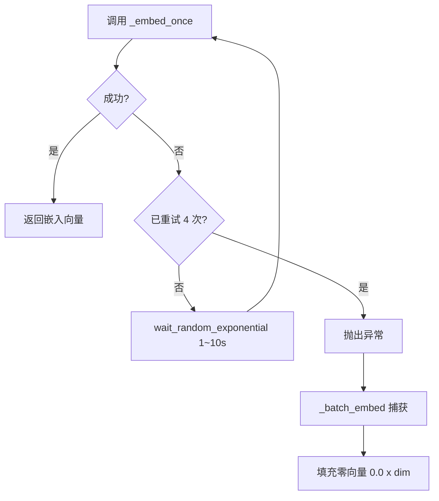
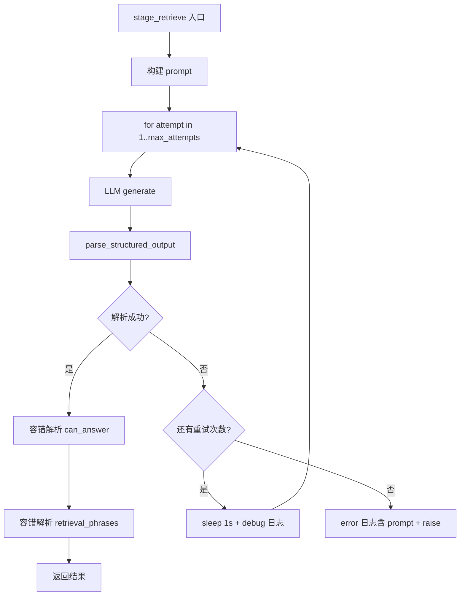
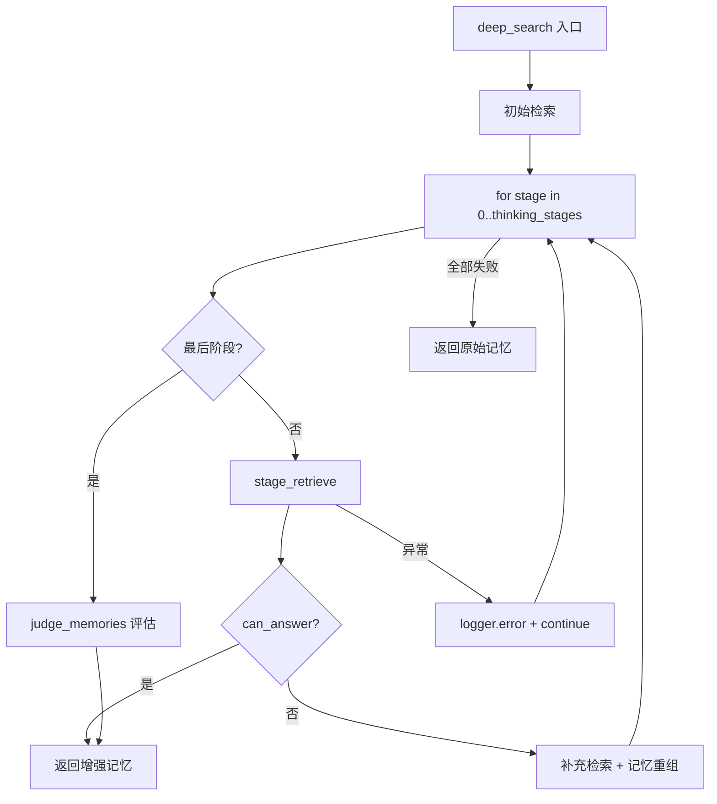

# PD-03.NN MemOS — 三层容错与 tenacity 嵌入重试体系

> 文档编号：PD-03.NN
> 来源：MemOS `src/memos/mem_feedback/feedback.py`, `src/memos/memories/textual/tree_text_memory/retrieve/advanced_searcher.py`, `src/memos/api/middleware/rate_limit.py`
> GitHub：https://github.com/MemTensor/MemOS.git
> 问题域：PD-03 容错与重试 Fault Tolerance & Retry
> 状态：可复用方案

---

## 第 1 章 问题与动机

### 1.1 核心问题

MemOS 是一个记忆操作系统，核心能力是将用户对话转化为结构化记忆并持久化到图数据库（PolarDB/Neo4j）。这个过程涉及三类高频失败场景：

1. **Embedding 服务不稳定**：调用 Ollama/OpenAI 嵌入模型时，网络抖动、服务过载、速率限制都可能导致单次调用失败。而 MemOS 的记忆写入流程中，embedding 是前置依赖——嵌入失败意味着整条记忆无法入库。
2. **图数据库写入竞态**：PolarDB 连接池在高并发下可能耗尽，连接可能因服务器重启而失效（`conn.closed != 0`），健康检查（`SELECT 1`）可能超时。MemOS 的 feedback 流程中，单次用户反馈可能触发多条记忆的并发写入。
3. **LLM 结构化输出不可靠**：AdvancedSearcher 的多阶段检索依赖 LLM 返回结构化 JSON（含 `can_answer`、`retrieval_phrases` 等字段），但 LLM 输出格式不稳定——可能返回非标准 JSON、缺少字段、布尔值用 "yes"/"true" 混写。

这三类问题的共同特征是：**单次失败不代表永久失败**，重试通常能成功。但重试策略的选择直接影响系统的可用性和成本。

### 1.2 MemOS 的解法概述

MemOS 采用三层容错体系，每层针对不同的失败模式：

1. **tenacity 装饰器层**（`feedback.py:115-127`）：用 `@retry` 装饰器包裹 embedding 和 DB 操作，提供声明式的指数退避重试。embedding 重试 4 次（`wait_random_exponential(1, max=10)`），DB 操作重试 3 次（`wait_random_exponential(1, min=4, max=10)`）。
2. **手动循环重试层**（`advanced_searcher.py:100-133`）：对 LLM 结构化输出解析使用 for 循环 + try/except，固定 1 秒间隔重试，最多 3 次。失败时记录 prompt 用于事后分析。
3. **降级兜底层**（`feedback.py:129-142`, `rate_limit.py:84-86`）：embedding 批量处理中单批失败时用零向量填充继续；Redis 限流不可用时降级为进程内内存限流；Reranker 服务不可用时返回零分排序。

### 1.3 设计思想

| 设计原则 | 具体实现 | 理由 | 替代方案 |
|----------|----------|------|----------|
| 分层重试 | tenacity 装饰器 + 手动循环 + 降级兜底 | 不同失败模式需要不同重试策略 | 统一用 tenacity（但 LLM 解析需要自定义逻辑） |
| 指数退避 + 随机抖动 | `wait_random_exponential(multiplier=1, max=10)` | 避免重试风暴，错开并发请求 | 固定间隔（但会造成同步重试） |
| 零向量降级 | embedding 失败时填充 `[0.0] * dim` | 保证记忆写入流程不中断，后续可重新嵌入 | 跳过该记忆（但会丢失数据） |
| 连接健康检查 | `SELECT 1` 探活 + `putconn(close=True)` 回收 | 避免使用已断开的连接导致业务错误 | 依赖连接池自动回收（但 PolarDB 不可靠） |
| 结构化输出容错解析 | 布尔值多格式兼容 + `retrival_phrases` 拼写容错 | LLM 输出不可控，必须宽容解析 | 严格 JSON Schema 验证（但会频繁失败） |

---

## 第 2 章 源码实现分析

### 2.1 架构概览

MemOS 的容错体系分布在三个核心模块中，形成从 API 入口到存储层的完整防护链：

```
┌─────────────────────────────────────────────────────────────┐
│                     API Layer                                │
│  RateLimitMiddleware (rate_limit.py)                         │
│  ├─ Redis 滑动窗口限流                                       │
│  └─ 降级: 进程内内存限流                                      │
├─────────────────────────────────────────────────────────────┤
│                   Business Layer                             │
│  MemFeedback (feedback.py)                                   │
│  ├─ _embed_once: tenacity 4次 + 指数退避                     │
│  ├─ _batch_embed: 批量降级(零向量填充)                        │
│  ├─ _retry_db_operation: tenacity 3次 + 指数退避             │
│  └─ process_feedback: 30s 超时 + 并发 Future                 │
│                                                              │
│  AdvancedSearcher (advanced_searcher.py)                     │
│  ├─ stage_retrieve: 手动循环 3次 + 1s 间隔                   │
│  ├─ judge_memories: 手动循环 3次 + 1s 间隔                   │
│  ├─ memory_recreate_enhancement: while 循环重试              │
│  └─ deep_search: 阶段级 try/except + continue               │
├─────────────────────────────────────────────────────────────┤
│                   Storage Layer                              │
│  PolarDB (polardb.py)                                        │
│  ├─ _get_connection: 500次重试 + 健康检查                    │
│  ├─ 连接池耗尽: 指数退避 0.5s/1.0s/2.0s                     │
│  └─ _return_connection: 状态验证 + 安全回收                   │
├─────────────────────────────────────────────────────────────┤
│                   Cross-Cutting                              │
│  timed_with_status (utils.py)                                │
│  └─ fallback 参数: 异常时执行降级函数                         │
│  GeneralTextMemory (general.py)                              │
│  └─ extract: tenacity 3次 + retry_if_exception_type          │
└─────────────────────────────────────────────────────────────┘
```

### 2.2 核心实现

#### 2.2.1 tenacity 装饰器重试：Embedding 与 DB 操作



对应源码 `src/memos/mem_feedback/feedback.py:115-142`：

```python
@retry(stop=stop_after_attempt(4), wait=wait_random_exponential(multiplier=1, max=10))
def _embed_once(self, texts):
    return self.embedder.embed(texts)

@retry(stop=stop_after_attempt(3), wait=wait_random_exponential(multiplier=1, min=4, max=10))
def _retry_db_operation(self, operation):
    try:
        return operation()
    except Exception as e:
        logger.error(
            f"[0107 Feedback Core: _retry_db_operation] DB operation failed: {e}", exc_info=True
        )
        raise

def _batch_embed(self, texts: list[str], embed_bs: int = 5):
    results = []
    dim = self.embedder.config.embedding_dims
    for i in range(0, len(texts), embed_bs):
        batch = texts[i : i + embed_bs]
        try:
            results.extend(self._embed_once(batch))
        except Exception as e:
            logger.error(
                f"Embedding batch failed, Cover with all zeros: {len(batch)} entries: {e}"
            )
            results.extend([[0.0] * dim for _ in range(len(batch))])
    return results
```

关键设计点：
- `_embed_once` 的 `stop_after_attempt(4)` 意味着最多 4 次尝试（3 次重试），`wait_random_exponential` 在 1~10 秒间随机退避（`feedback.py:115`）
- `_retry_db_operation` 的 `min=4` 参数确保 DB 重试的最小等待时间为 4 秒，给数据库更多恢复时间（`feedback.py:119`）
- `_batch_embed` 是外层兜底：即使 tenacity 4 次重试全部失败，也不会中断整个 feedback 流程，而是用零向量填充（`feedback.py:139-141`）

#### 2.2.2 手动循环重试：LLM 结构化输出解析



对应源码 `src/memos/memories/textual/tree_text_memory/retrieve/advanced_searcher.py:71-133`：

```python
def stage_retrieve(self, stage_id, query, previous_retrieval_phrases, text_memories):
    args = {
        "template_name": f"stage{stage_id}_expand_retrieve",
        "query": query,
        "previous_retrieval_phrases": prev_phrases_text,
        "memories": text_memories,
    }
    prompt = self.build_prompt(**args)

    max_attempts = max(0, self.max_retry_times) + 1
    for attempt in range(1, max_attempts + 1):
        try:
            llm_response = self.process_llm.generate(
                [{"role": "user", "content": prompt}]
            ).strip()
            result = parse_structured_output(content=llm_response)

            # 布尔值多格式兼容
            can_answer_str = str(result.get("can_answer", "")).strip().lower()
            can_answer = can_answer_str in {"true", "yes", "y", "1"}

            # 字段名拼写容错: retrieval_phrases 和 retrival_phrases 都接受
            phrases_val = result.get("retrieval_phrases", result.get("retrival_phrases", []))
            if isinstance(phrases_val, list):
                retrieval_phrases = [str(p).strip() for p in phrases_val if str(p).strip()]
            elif isinstance(phrases_val, str) and phrases_val.strip():
                retrieval_phrases = [p.strip() for p in phrases_val.splitlines() if p.strip()]
            else:
                retrieval_phrases = []

            return can_answer, reason, retrieval_phrases

        except Exception as e:
            if attempt < max_attempts:
                logger.debug(f"[stage_retrieve]🔁 retry {attempt}/{max_attempts} failed: {e!s}")
                time.sleep(1)
            else:
                logger.error(
                    f"[stage_retrieve]❌ all {max_attempts} attempts failed: {e!s}; \nprompt: {prompt}",
                    exc_info=True,
                )
                raise e
```

关键设计点：
- `max_retry_times = 2`（`advanced_searcher.py:56`），加上首次尝试共 3 次
- 布尔值容错：接受 `"true"`, `"yes"`, `"y"`, `"1"` 四种格式（`advanced_searcher.py:109-110`）
- 字段名容错：同时检查 `retrieval_phrases` 和 `retrival_phrases`（LLM 常见拼写错误）（`advanced_searcher.py:114`）
- 最终失败时记录完整 prompt，便于事后分析 LLM 为何返回不可解析的输出（`advanced_searcher.py:130`）

#### 2.2.3 阶段级容错：deep_search 的 continue 策略



对应源码 `src/memos/memories/textual/tree_text_memory/retrieve/advanced_searcher.py:232-364`：

```python
def deep_search(self, query, top_k, info=None, memory_type="All", ...):
    # ... 初始检索 ...
    for current_stage_id in range(self.thinking_stages + 1):
        try:
            if current_stage_id == self.thinking_stages:
                reason, can_answer = self.judge_memories(query=query, text_memories=...)
                # ... 返回结果 ...
            can_answer, reason, retrieval_phrases = self.stage_retrieve(...)
            if can_answer:
                return enhanced_memories[:top_k]
            else:
                # 补充检索 + 记忆重组
                # ...
        except Exception as e:
            logger.error("Error in stage %d: %s", current_stage_id, str(e), exc_info=True)
            # Continue to next stage instead of failing completely
            continue
    logger.error("Deep search failed, returning original memories")
    return memories  # 最终兜底：返回原始记忆
```

关键设计点（`advanced_searcher.py:359-364`）：
- 单个阶段失败不会中断整个 deep_search 流程，而是跳到下一阶段
- 所有阶段都失败时，返回初始检索的原始记忆（而非空结果或异常）
- 这是一种"尽力而为"的降级策略：deep_search 的增强是锦上添花，失败时退回基础检索

### 2.3 实现细节

#### 2.3.1 Redis → 内存的双层限流降级

`rate_limit.py` 实现了一个完整的降级链：

1. 首次调用 `_get_redis()` 时尝试连接 Redis（`rate_limit.py:36-51`）
2. 连接失败时 `_redis_client` 保持 `None`，后续所有限流请求自动走内存路径
3. 即使 Redis 连接成功，单次限流检查失败时也降级到内存（`rate_limit.py:117-119`）
4. 内存限流是进程级的（`defaultdict(list)`），不支持分布式，但保证了单进程内的基本保护

#### 2.3.2 timed_with_status 装饰器的 fallback 机制

`utils.py:11-99` 定义了一个通用的计时+降级装饰器，被 Reranker 等组件使用：

```python
# http_bge.py:126-131
@timed_with_status(
    log_prefix="model_timed_rerank",
    fallback=lambda exc, self, query, graph_results, top_k, *a, **kw: [
        (item, 0.0) for item in graph_results[:top_k]
    ],
)
def rerank(self, query, graph_results, top_k, ...):
    ...
```

Reranker 服务不可用时，返回所有候选项但分数为 0.0，保证下游流程不中断。

#### 2.3.3 PolarDB 连接池的分级退避

`polardb.py:206-337` 的 `_get_connection()` 对不同错误类型使用不同退避策略：

- **连接已关闭**（`conn.closed != 0`）：短退避 0.1s × 2^attempt（`polardb.py:234`）
- **健康检查失败**（`SELECT 1` 异常）：同上短退避（`polardb.py:266`）
- **连接池耗尽**（`PoolError` 含 "exhausted"）：长退避 0.5s × 2^attempt（`polardb.py:296`）

连接池耗尽使用更长的退避时间，因为需要等待其他线程归还连接。

#### 2.3.4 GeneralTextMemory 的条件重试

`general.py:38-44` 使用 `retry_if_exception_type(json.JSONDecodeError)` 精确限定重试条件：

```python
@retry(
    stop=stop_after_attempt(3),
    retry=retry_if_exception_type(json.JSONDecodeError),
    before_sleep=lambda retry_state: logger.warning(
        f"Extracting memory failed due to JSON decode error: {retry_state.outcome.exception()}, "
        f"Attempt retry: {retry_state.attempt_number} / {3}"
    ),
)
def extract(self, messages):
    ...
```

只有 JSON 解析错误才重试，其他异常（如网络错误）直接抛出。这避免了对不可恢复错误的无意义重试。

#### 2.3.5 并发超时保护

`feedback.py:1193-1211` 的 `process_feedback` 方法使用 `concurrent.futures.wait` 设置 30 秒超时：

```python
_done, pending = concurrent.futures.wait([answer_future, core_future], timeout=30)
for fut in pending:
    fut.cancel()
```

超时后取消未完成的 Future，返回空结果而非无限等待。

---

## 第 3 章 迁移指南

### 3.1 迁移清单

**阶段 1：基础重试（1 天）**
- [ ] 安装 tenacity：`pip install tenacity`
- [ ] 为所有 LLM 调用添加 `@retry` 装饰器
- [ ] 为所有数据库写入操作添加 `@retry` 装饰器
- [ ] 配置合理的 `stop_after_attempt` 和 `wait_random_exponential`

**阶段 2：批量降级（0.5 天）**
- [ ] 为 embedding 批量处理添加零向量降级
- [ ] 为 reranker 添加零分降级
- [ ] 确保降级不会导致下游类型错误

**阶段 3：结构化输出容错（0.5 天）**
- [ ] 为 LLM 结构化输出添加多格式兼容解析
- [ ] 添加字段名拼写容错
- [ ] 最终失败时记录完整 prompt

**阶段 4：连接池健康检查（0.5 天）**
- [ ] 为数据库连接添加 `SELECT 1` 健康检查
- [ ] 实现连接池耗尽的差异化退避
- [ ] 添加连接回收的安全逻辑

### 3.2 适配代码模板

#### 模板 1：tenacity 双层重试 + 批量降级

```python
from tenacity import retry, stop_after_attempt, wait_random_exponential
import logging

logger = logging.getLogger(__name__)


class ResilientEmbedder:
    """可直接复用的嵌入重试 + 批量降级模板。"""

    def __init__(self, embedder, embedding_dim: int = 1536, batch_size: int = 5):
        self.embedder = embedder
        self.embedding_dim = embedding_dim
        self.batch_size = batch_size

    @retry(
        stop=stop_after_attempt(4),
        wait=wait_random_exponential(multiplier=1, max=10),
    )
    def _embed_once(self, texts: list[str]) -> list[list[float]]:
        """单批嵌入，tenacity 自动重试 4 次。"""
        return self.embedder.embed(texts)

    def batch_embed(self, texts: list[str]) -> list[list[float]]:
        """批量嵌入，单批失败时用零向量降级。"""
        results = []
        for i in range(0, len(texts), self.batch_size):
            batch = texts[i : i + self.batch_size]
            try:
                results.extend(self._embed_once(batch))
            except Exception as e:
                logger.error(f"Embedding batch {i//self.batch_size} failed after all retries: {e}")
                results.extend([[0.0] * self.embedding_dim for _ in batch])
        return results
```

#### 模板 2：LLM 结构化输出容错解析

```python
import time
import logging

logger = logging.getLogger(__name__)


def resilient_llm_parse(
    llm,
    prompt: str,
    required_fields: list[str],
    max_retries: int = 2,
    retry_delay: float = 1.0,
) -> dict:
    """
    LLM 结构化输出的容错解析模板。
    
    - 自动重试 max_retries 次
    - 布尔值多格式兼容
    - 最终失败时记录完整 prompt
    """
    max_attempts = max_retries + 1
    for attempt in range(1, max_attempts + 1):
        try:
            response = llm.generate([{"role": "user", "content": prompt}]).strip()
            result = parse_structured_output(response)  # 你的 JSON 解析函数

            # 布尔值容错
            for key in result:
                val = str(result[key]).strip().lower()
                if val in {"true", "yes", "y", "1"}:
                    result[key] = True
                elif val in {"false", "no", "n", "0"}:
                    result[key] = False

            # 验证必要字段
            missing = [f for f in required_fields if f not in result]
            if missing:
                raise ValueError(f"Missing fields: {missing}")

            return result

        except Exception as e:
            if attempt < max_attempts:
                logger.debug(f"LLM parse retry {attempt}/{max_attempts}: {e}")
                time.sleep(retry_delay)
            else:
                logger.error(f"LLM parse failed after {max_attempts} attempts: {e}\nprompt: {prompt}")
                raise
```

#### 模板 3：timed_with_status 降级装饰器

```python
import functools
import time
import logging

logger = logging.getLogger(__name__)


def with_fallback(fallback_fn=None, log_prefix=""):
    """通用降级装饰器：异常时执行 fallback 函数。"""
    def decorator(fn):
        @functools.wraps(fn)
        def wrapper(*args, **kwargs):
            start = time.perf_counter()
            try:
                return fn(*args, **kwargs)
            except Exception as e:
                elapsed = (time.perf_counter() - start) * 1000
                logger.error(f"[{log_prefix or fn.__name__}] failed in {elapsed:.0f}ms: {e}")
                if fallback_fn and callable(fallback_fn):
                    return fallback_fn(e, *args, **kwargs)
                raise
        return wrapper
    return decorator


# 使用示例
@with_fallback(
    fallback_fn=lambda exc, self, query, candidates, top_k, **kw: [
        (item, 0.0) for item in candidates[:top_k]
    ],
    log_prefix="reranker",
)
def rerank(self, query, candidates, top_k):
    # 调用外部 reranker 服务
    ...
```

### 3.3 适用场景

| 场景 | 适用度 | 说明 |
|------|--------|------|
| LLM 应用的 embedding 调用 | ⭐⭐⭐ | tenacity 指数退避是标准做法 |
| 图数据库/关系数据库写入 | ⭐⭐⭐ | DB 操作的瞬时失败非常常见 |
| LLM 结构化输出解析 | ⭐⭐⭐ | LLM 输出不可控，容错解析是必须的 |
| 外部 API 调用（搜索、rerank） | ⭐⭐⭐ | fallback 降级保证流程不中断 |
| 批量处理流水线 | ⭐⭐ | 零向量降级适合嵌入，但不适合所有场景 |
| 高并发连接池管理 | ⭐⭐ | PolarDB 的 500 次重试过于激进，建议 3-5 次 |

---

## 第 4 章 测试用例

```python
import json
import time
import pytest
from unittest.mock import MagicMock, patch, call


class TestTenacityEmbedRetry:
    """测试 tenacity 装饰器的 embedding 重试行为。"""

    def test_embed_once_succeeds_on_third_attempt(self):
        """前两次失败，第三次成功。"""
        embedder = MagicMock()
        embedder.embed.side_effect = [
            ConnectionError("timeout"),
            ConnectionError("timeout"),
            [[0.1, 0.2, 0.3]],
        ]
        # 模拟 _embed_once 的 tenacity 行为
        from tenacity import retry, stop_after_attempt, wait_random_exponential

        @retry(stop=stop_after_attempt(4), wait=wait_random_exponential(multiplier=0.01, max=0.1))
        def embed_once(texts):
            return embedder.embed(texts)

        result = embed_once(["test"])
        assert result == [[0.1, 0.2, 0.3]]
        assert embedder.embed.call_count == 3

    def test_embed_once_exhausts_retries(self):
        """4 次全部失败，抛出异常。"""
        embedder = MagicMock()
        embedder.embed.side_effect = ConnectionError("persistent failure")

        from tenacity import retry, stop_after_attempt, wait_random_exponential

        @retry(stop=stop_after_attempt(4), wait=wait_random_exponential(multiplier=0.01, max=0.1))
        def embed_once(texts):
            return embedder.embed(texts)

        with pytest.raises(ConnectionError):
            embed_once(["test"])
        assert embedder.embed.call_count == 4

    def test_batch_embed_zero_vector_fallback(self):
        """批量嵌入中单批失败时填充零向量。"""
        dim = 3
        embedder = MagicMock()
        embedder.embed.side_effect = [
            [[0.1, 0.2, 0.3], [0.4, 0.5, 0.6]],  # 第一批成功
            Exception("service unavailable"),         # 第二批失败
        ]

        # 模拟 _batch_embed 逻辑
        results = []
        texts = ["a", "b", "c", "d"]
        batch_size = 2
        for i in range(0, len(texts), batch_size):
            batch = texts[i : i + batch_size]
            try:
                results.extend(embedder.embed(batch))
            except Exception:
                results.extend([[0.0] * dim for _ in batch])

        assert len(results) == 4
        assert results[0] == [0.1, 0.2, 0.3]  # 成功批次
        assert results[2] == [0.0, 0.0, 0.0]  # 降级零向量
        assert results[3] == [0.0, 0.0, 0.0]


class TestLLMStructuredOutputParsing:
    """测试 LLM 结构化输出的容错解析。"""

    def test_boolean_multi_format(self):
        """布尔值多格式兼容。"""
        for truthy in ["true", "True", "yes", "Yes", "y", "Y", "1"]:
            val = str(truthy).strip().lower()
            assert val in {"true", "yes", "y", "1"}

    def test_field_name_typo_tolerance(self):
        """字段名拼写容错：retrival_phrases（少一个 e）。"""
        result = {"can_answer": "false", "retrival_phrases": ["query1", "query2"]}
        phrases = result.get("retrieval_phrases", result.get("retrival_phrases", []))
        assert phrases == ["query1", "query2"]

    def test_phrases_string_to_list(self):
        """retrieval_phrases 为字符串时自动拆分。"""
        result = {"retrieval_phrases": "query1\nquery2\nquery3"}
        phrases_val = result.get("retrieval_phrases", [])
        if isinstance(phrases_val, str) and phrases_val.strip():
            phrases = [p.strip() for p in phrases_val.splitlines() if p.strip()]
        else:
            phrases = phrases_val
        assert phrases == ["query1", "query2", "query3"]


class TestDeepSearchStageFallback:
    """测试 deep_search 的阶段级容错。"""

    def test_stage_failure_continues_to_next(self):
        """单阶段失败不中断整个流程。"""
        stages_executed = []
        original_memories = ["mem1", "mem2"]

        for stage_id in range(3):
            try:
                if stage_id == 1:
                    raise RuntimeError("LLM timeout")
                stages_executed.append(stage_id)
            except Exception:
                continue

        # 阶段 0 和 2 执行成功，阶段 1 被跳过
        assert stages_executed == [0, 2]

    def test_all_stages_fail_returns_original(self):
        """所有阶段失败时返回原始记忆。"""
        original_memories = ["mem1", "mem2"]
        result = None

        for stage_id in range(3):
            try:
                raise RuntimeError("persistent failure")
            except Exception:
                continue

        if result is None:
            result = original_memories

        assert result == original_memories


class TestRateLimitFallback:
    """测试限流的 Redis → 内存降级。"""

    def test_memory_fallback_when_redis_unavailable(self):
        """Redis 不可用时降级到内存限流。"""
        from collections import defaultdict

        memory_store = defaultdict(list)
        rate_limit = 3
        rate_window = 60
        key = "test_client"

        # 模拟 3 次请求
        for _ in range(rate_limit):
            now = time.time()
            memory_store[key].append(now)

        # 第 4 次应被拒绝
        current_count = len(memory_store[key])
        assert current_count >= rate_limit
```

---

## 第 5 章 跨域关联

| 关联域 | 关系类型 | 说明 |
|--------|----------|------|
| PD-01 上下文管理 | 协同 | deep_search 的多阶段检索会累积 `previous_retrieval_phrases`，上下文持续增长；stage_retrieve 的重试会重复发送相同 prompt，消耗额外 token |
| PD-04 工具系统 | 依赖 | `_embed_once` 和 `_retry_db_operation` 本质上是对外部工具（embedder、graph_store）的容错包装；工具注册时应声明重试策略 |
| PD-06 记忆持久化 | 依赖 | MemOS 的容错体系直接服务于记忆持久化：`_retry_db_operation` 保护图数据库写入，`_batch_embed` 保护嵌入生成，两者都是记忆入库的前置步骤 |
| PD-07 质量检查 | 协同 | `filter_fault_update` 方法（`feedback.py:747-791`）在执行记忆更新前用 LLM 做二次验证，是容错与质量检查的交叉点 |
| PD-08 搜索与检索 | 协同 | AdvancedSearcher 的 deep_search 是搜索增强流程，其容错策略（阶段级 continue + 原始记忆兜底）直接影响搜索质量 |
| PD-11 可观测性 | 协同 | `timed_with_status` 装饰器同时提供计时日志和降级能力；每次重试都有 debug/error 级别日志，便于事后分析失败模式 |

---

## 第 6 章 来源文件索引

| 文件 | 行范围 | 关键实现 |
|------|--------|----------|
| `src/memos/mem_feedback/feedback.py` | L115-L117 | `_embed_once`: tenacity 4 次指数退避重试 |
| `src/memos/mem_feedback/feedback.py` | L119-L127 | `_retry_db_operation`: tenacity 3 次 DB 重试 |
| `src/memos/mem_feedback/feedback.py` | L129-L142 | `_batch_embed`: 批量嵌入零向量降级 |
| `src/memos/mem_feedback/feedback.py` | L1193-L1217 | `process_feedback`: 30s 并发超时保护 |
| `src/memos/mem_feedback/feedback.py` | L747-L791 | `filter_fault_update`: LLM 二次验证过滤 |
| `src/memos/memories/textual/tree_text_memory/retrieve/advanced_searcher.py` | L56 | `max_retry_times = 2` 配置 |
| `src/memos/memories/textual/tree_text_memory/retrieve/advanced_searcher.py` | L71-L133 | `stage_retrieve`: 手动循环重试 + 结构化输出容错 |
| `src/memos/memories/textual/tree_text_memory/retrieve/advanced_searcher.py` | L135-L166 | `judge_memories`: 手动循环重试 |
| `src/memos/memories/textual/tree_text_memory/retrieve/advanced_searcher.py` | L193-L230 | `memory_recreate_enhancement`: while 循环重试 |
| `src/memos/memories/textual/tree_text_memory/retrieve/advanced_searcher.py` | L232-L364 | `deep_search`: 阶段级 continue 容错 |
| `src/memos/api/middleware/rate_limit.py` | L36-L51 | `_get_redis`: 懒初始化 + 连接失败降级 |
| `src/memos/api/middleware/rate_limit.py` | L77-L119 | `_check_rate_limit_redis`: Redis 滑动窗口 + 内存降级 |
| `src/memos/api/middleware/rate_limit.py` | L153-L207 | `RateLimitMiddleware`: 429 响应 + Retry-After 头 |
| `src/memos/utils.py` | L11-L99 | `timed_with_status`: 通用计时 + fallback 装饰器 |
| `src/memos/reranker/http_bge.py` | L126-L131 | Reranker fallback: 零分降级 |
| `src/memos/memories/textual/general.py` | L38-L44 | `extract`: tenacity 条件重试（仅 JSONDecodeError） |
| `src/memos/graph_dbs/polardb.py` | L206-L337 | `_get_connection`: 连接池健康检查 + 分级退避 |
| `src/memos/mem_reader/read_multi_modal/file_content_parser.py` | L745-L824 | `_make_fallback` + `_process_chunk`: LLM 失败降级为原始文本 |

---

## 第 7 章 横向对比维度

```json comparison_data
{
  "project": "MemOS",
  "dimensions": {
    "重试策略": "tenacity 装饰器(embedding 4次/DB 3次) + 手动循环(LLM解析 3次) 双模式",
    "降级方案": "三级降级：零向量填充、零分排序、原始记忆兜底",
    "错误分类": "retry_if_exception_type 精确分流：仅 JSONDecodeError 触发重试",
    "超时保护": "concurrent.futures.wait 30s 超时 + Future.cancel()",
    "存储层重试": "PolarDB 连接池 SELECT 1 健康检查 + 池耗尽差异化退避",
    "连接池管理": "putconn(close=True) 回收坏连接 + 池耗尽长退避(0.5s×2^n)",
    "输出验证": "布尔值四格式兼容 + 字段名拼写容错(retrival→retrieval)",
    "外部服务容错": "Redis限流→内存降级 + Reranker→零分降级 + LLM→原始文本降级",
    "并发容错": "ContextThreadPoolExecutor + as_completed 逐个捕获异常不中断批次",
    "阶段级容错": "deep_search 多阶段 try/except+continue，单阶段失败不中断流程"
  }
}
```

### 域元数据补充

```json domain_metadata
{
  "solution_summary": "MemOS 用 tenacity 装饰器(4次/3次指数退避)保护 embedding 和 DB 操作，手动循环重试 LLM 结构化输出解析，批量失败时零向量填充降级",
  "description": "记忆系统中 embedding/DB/LLM 三类操作的分层容错与零向量降级",
  "sub_problems": [
    "embedding 批量处理中单批失败需要零向量填充保证维度一致性，避免下游向量索引构建失败",
    "LLM 结构化输出的字段名拼写不稳定（如 retrieval 拼成 retrival），需要多候选字段名容错",
    "图数据库连接池耗尽与连接失效需要差异化退避策略：池耗尽等更久（等归还），连接失效短退避（快重连）",
    "多阶段迭代检索中单阶段 LLM 失败应 continue 而非中断，最终兜底返回初始检索结果"
  ],
  "best_practices": [
    "tenacity 的 retry_if_exception_type 精确限定重试条件，避免对不可恢复错误浪费重试次数",
    "timed_with_status 装饰器将计时、日志、降级三合一，减少样板代码",
    "连接池健康检查用 SELECT 1 而非依赖驱动层自动检测，主动发现坏连接"
  ]
}
```
