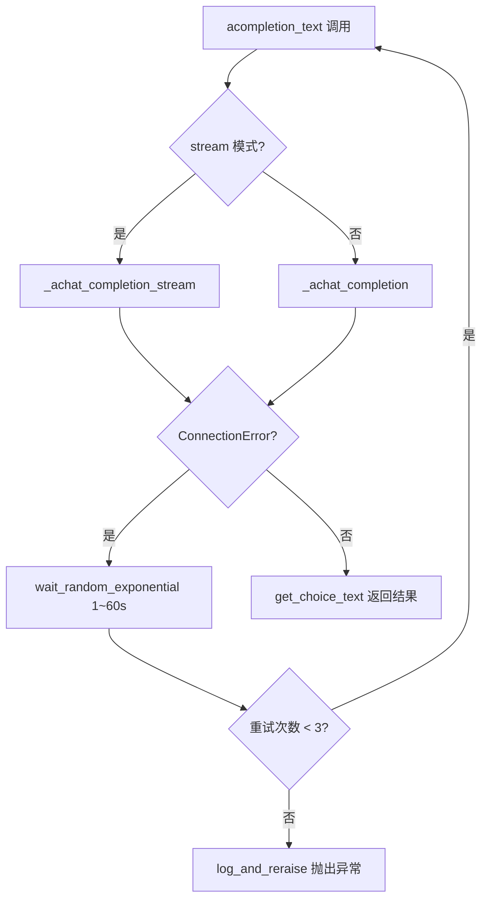
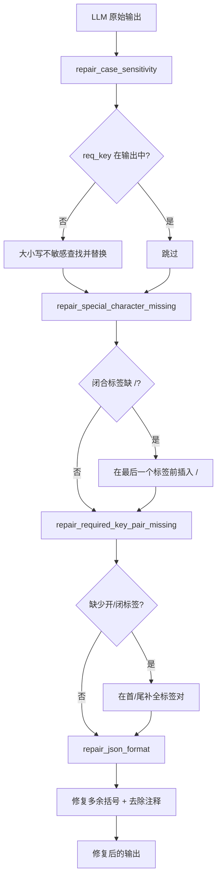
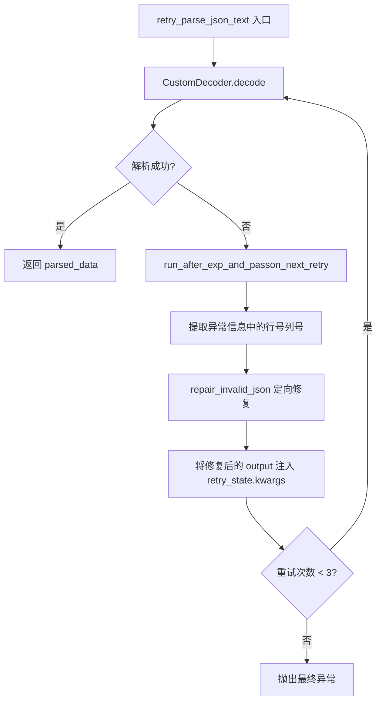

# PD-03.06 MetaGPT — 双层重试与 LLM 输出修复链

> 文档编号：PD-03.06
> 来源：MetaGPT `metagpt/provider/base_llm.py`, `metagpt/utils/repair_llm_raw_output.py`, `metagpt/provider/postprocess/base_postprocess_plugin.py`
> GitHub：https://github.com/FoundationAgents/MetaGPT.git
> 问题域：PD-03 容错与重试 Fault Tolerance & Retry
> 状态：可复用方案

---

## 第 1 章 问题与动机

### 1.1 核心问题

在多 Agent 软件工程系统中，LLM 调用面临两类截然不同的失败模式：

1. **传输层失败** — API 连接超时、速率限制、服务不可用等网络级错误，需要重试整个请求
2. **语义层失败** — LLM 返回的内容格式不正确（JSON 损坏、大小写不匹配、特殊字符缺失、转义错误），需要修复输出而非重新请求

传统做法是对所有失败统一重试，但这会浪费 token 和时间。MetaGPT 的核心洞察是：**语义层失败不需要重新调用 LLM，只需要在本地修复输出文本**。这催生了"双层重试"架构——外层重试处理传输失败，内层修复链处理输出格式问题。

### 1.2 MetaGPT 的解法概述

1. **传输层重试（BaseLLM + OpenAILLM）**：使用 tenacity 的 `wait_random_exponential(min=1, max=60)` + `stop_after_attempt(3~6)` 处理 `ConnectionError` / `APIConnectionError`，见 `metagpt/provider/base_llm.py:249-254` 和 `metagpt/provider/openai_api.py:165-171`
2. **输出修复链（repair_llm_raw_output）**：4 种修复类型（大小写、缺失键对、特殊字符、JSON 格式）组成管道式修复链，见 `metagpt/utils/repair_llm_raw_output.py:17-22`
3. **后处理插件（BasePostProcessPlugin）**：将修复链封装为可扩展的插件体系，按 schema 驱动修复流程，见 `metagpt/provider/postprocess/base_postprocess_plugin.py:15-69`
4. **双层重试嵌套**：外层 `_aask_v1` 重试 3 次（重新调用 LLM），内层 `retry_parse_json_text` 重试 3 次（本地修复 JSON），最大循环 3×3=9 次，见 `metagpt/utils/repair_llm_raw_output.py:296-299`
5. **配置开关**：`Config.repair_llm_output` 控制是否启用修复链，默认关闭（OpenAI 模型通常不需要），开源模型建议开启，见 `metagpt/config2.py:75`

### 1.3 设计思想

| 设计原则 | 具体实现 | 理由 | 替代方案 |
|----------|----------|------|----------|
| 分层容错 | 传输层 retry + 语义层 repair 分离 | 语义修复不需要重新调用 LLM，节省 token | 统一重试（浪费 token） |
| 管道式修复 | 4 种 RepairType 按序执行 | 每种修复独立，可组合，可单独测试 | 单一正则修复（脆弱） |
| 配置驱动 | `repair_llm_output` 开关 | OpenAI 模型输出质量高不需要修复，开源模型需要 | 始终修复（浪费计算） |
| 宽容解析 | CustomDecoder 支持单引号、三引号 | 开源模型常输出非标准 JSON | 严格 json.loads（频繁失败） |
| 渐进修复 | retry 间用 `repair_invalid_json` 修复上次错误 | 每次重试前先修复已知问题，提高成功率 | 每次重试用原始输出（重复失败） |

---

## 第 2 章 源码实现分析

### 2.1 架构概览

MetaGPT 的容错体系分为三层，从外到内依次是：

```
┌─────────────────────────────────────────────────────────────┐
│  Layer 1: 传输层重试 (BaseLLM.acompletion_text)            │
│  tenacity @retry: ConnectionError → 指数退避 → 最多 3 次    │
│  ┌───────────────────────────────────────────────────────┐  │
│  │  Layer 2: 输出修复链 (BasePostProcessPlugin.run)      │  │
│  │  repair_case_sensitivity → repair_special_char →      │  │
│  │  repair_required_key_pair → repair_json_format        │  │
│  │  ┌─────────────────────────────────────────────────┐  │  │
│  │  │  Layer 3: JSON 解析重试 (retry_parse_json_text) │  │  │
│  │  │  CustomDecoder.decode → 失败 →                  │  │  │
│  │  │  repair_invalid_json → 重试 → 最多 3 次         │  │  │
│  │  └─────────────────────────────────────────────────┘  │  │
│  └───────────────────────────────────────────────────────┘  │
└─────────────────────────────────────────────────────────────┘
```

### 2.2 核心实现

#### 2.2.1 传输层重试：BaseLLM.acompletion_text



对应源码 `metagpt/provider/base_llm.py:249-263`：

```python
@retry(
    stop=stop_after_attempt(3),
    wait=wait_random_exponential(min=1, max=60),
    after=after_log(logger, logger.level("WARNING").name),
    retry=retry_if_exception_type(ConnectionError),
    retry_error_callback=log_and_reraise,
)
async def acompletion_text(
    self, messages: list[dict], stream: bool = False, timeout: int = USE_CONFIG_TIMEOUT
) -> str:
    """Asynchronous version of completion. Return str. Support stream-print"""
    if stream:
        return await self._achat_completion_stream(messages, timeout=self.get_timeout(timeout))
    resp = await self._achat_completion(messages, timeout=self.get_timeout(timeout))
    return self.get_choice_text(resp)
```

OpenAI 子类在 `metagpt/provider/openai_api.py:165-178` 覆写了此方法，将重试次数提升到 6 次，并将异常类型改为 `APIConnectionError`：

```python
@retry(
    wait=wait_random_exponential(min=1, max=60),
    stop=stop_after_attempt(6),
    after=after_log(logger, logger.level("WARNING").name),
    retry=retry_if_exception_type(APIConnectionError),
    retry_error_callback=log_and_reraise,
)
async def acompletion_text(self, messages: list[dict], stream=False, timeout=USE_CONFIG_TIMEOUT) -> str:
    """when streaming, print each token in place."""
    if stream:
        return await self._achat_completion_stream(messages, timeout=timeout)
    rsp = await self._achat_completion(messages, timeout=self.get_timeout(timeout))
    return self.get_choice_text(rsp)
```

#### 2.2.2 输出修复链：repair_llm_raw_output 四阶段管道



对应源码 `metagpt/utils/repair_llm_raw_output.py:143-154`：

```python
def _repair_llm_raw_output(output: str, req_key: str, repair_type: RepairType = None) -> str:
    repair_types = [repair_type] if repair_type else [item for item in RepairType if item not in [RepairType.JSON]]
    for repair_type in repair_types:
        if repair_type == RepairType.CS:
            output = repair_case_sensitivity(output, req_key)
        elif repair_type == RepairType.RKPM:
            output = repair_required_key_pair_missing(output, req_key)
        elif repair_type == RepairType.SCM:
            output = repair_special_character_missing(output, req_key)
        elif repair_type == RepairType.JSON:
            output = repair_json_format(output)
    return output
```

四种修复类型定义在 `metagpt/utils/repair_llm_raw_output.py:17-22`：

```python
class RepairType(Enum):
    CS = "case sensitivity"           # "Original requirements" → "Original Requirements"
    RKPM = "required key pair missing" # 缺少 [CONTENT] 或 [/CONTENT]
    SCM = "special character missing"  # [CONTENT] 缺少 / 变成 [CONTENT][CONTENT]
    JSON = "json format"              # 多余的 [ ] } 和行内注释
```

#### 2.2.3 JSON 解析重试与渐进修复



对应源码 `metagpt/utils/repair_llm_raw_output.py:245-306`：

```python
def run_after_exp_and_passon_next_retry(logger) -> Callable[["RetryCallState"], None]:
    def run_and_passon(retry_state: RetryCallState) -> None:
        if retry_state.outcome.failed:
            if retry_state.args:
                func_param_output = retry_state.args[0]
            elif retry_state.kwargs:
                func_param_output = retry_state.kwargs.get("output", "")
            exp_str = str(retry_state.outcome.exception())
            repaired_output = repair_invalid_json(func_param_output, exp_str)
            retry_state.kwargs["output"] = repaired_output  # 关键：修改下次重试的输入
    return run_and_passon

@retry(
    stop=repair_stop_after_attempt,
    wait=wait_fixed(1),
    after=run_after_exp_and_passon_next_retry(logger),
)
def retry_parse_json_text(output: str) -> Union[list, dict]:
    parsed_data = CustomDecoder(strict=False).decode(output)
    return parsed_data
```

这里的核心技巧是 `run_after_exp_and_passon_next_retry`：它在每次重试失败后，从异常信息中提取错误位置（行号、列号），用 `repair_invalid_json` 定向修复该位置的问题，然后通过修改 `retry_state.kwargs["output"]` 将修复后的文本传给下一次重试。这实现了**渐进式修复**——每次重试都在上一次修复的基础上继续。

### 2.3 实现细节

#### BasePostProcessPlugin 的 4 步修复流程

`metagpt/provider/postprocess/base_postprocess_plugin.py:18-34` 定义了完整的后处理管道：

1. **repair_llm_raw_output** — 用 schema 字段名 + req_key 修复大小写和标签
2. **extract_content_from_output** — 从 `[CONTENT]...[/CONTENT]` 中提取 JSON 内容
3. **repair_llm_raw_output (JSON)** — 专门修复 JSON 格式问题
4. **retry_parse_json_text** — 带重试的 JSON 解析

#### CustomDecoder 的宽容解析

`metagpt/utils/custom_decoder.py:273-294` 实现了自定义 JSON 解码器，支持：
- 单引号字符串 `'key': 'value'`
- 三引号字符串 `"""value"""`
- 混合引号 `"key": 'value'`

这是专门为开源模型设计的，因为它们经常输出非标准 JSON。

#### WriteCodeReview 的业务层重试

`metagpt/actions/write_code_review.py:147` 在业务层也使用了 tenacity 重试：

```python
@retry(wait=wait_random_exponential(min=1, max=60), stop=stop_after_attempt(6))
async def write_code_review_and_rewrite(self, context_prompt, cr_prompt, doc):
```

这是第三层重试——当代码审查结果为 LBTM（Looks Bad To Me）时，重新生成审查和代码。配合 `run` 方法中的 `k` 次迭代循环（`metagpt/actions/write_code_review.py:169-171`），形成了"审查-重写-再审查"的质量保证循环。

#### 超时保护

`metagpt/const.py:139` 定义了全局 LLM API 超时：`LLM_API_TIMEOUT = 300`（5 分钟）。`BaseLLM.get_timeout` 方法（`metagpt/provider/base_llm.py:329-330`）按优先级选择超时值：调用参数 > 配置值 > 全局默认值。


---

## 第 3 章 迁移指南

### 3.1 迁移清单

**阶段 1：传输层重试（1 天）**
- [ ] 安装 tenacity：`pip install tenacity`
- [ ] 在 LLM 调用入口添加 `@retry` 装饰器
- [ ] 配置 `wait_random_exponential(min=1, max=60)` + `stop_after_attempt(3)`
- [ ] 实现 `log_and_reraise` 回调记录最终失败

**阶段 2：输出修复链（2 天）**
- [ ] 实现 RepairType 枚举和 4 种修复函数
- [ ] 实现 `repair_invalid_json` 基于错误位置的定向修复
- [ ] 实现 `CustomDecoder` 宽容 JSON 解析器（或使用 `json5` 库替代）
- [ ] 将修复链封装为 PostProcessPlugin

**阶段 3：双层重试集成（1 天）**
- [ ] 实现 `run_after_exp_and_passon_next_retry` 渐进修复回调
- [ ] 配置 `repair_llm_output` 开关
- [ ] 集成测试：模拟各种 LLM 输出错误

### 3.2 适配代码模板

以下是可直接复用的传输层重试 + 输出修复链模板：

```python
"""可复用的 LLM 容错模板 — 基于 MetaGPT 双层重试架构"""
import json
import re
from enum import Enum
from typing import Union, Callable

from tenacity import (
    retry, stop_after_attempt, wait_random_exponential,
    wait_fixed, after_log, retry_if_exception_type,
    RetryCallState,
)
import logging

logger = logging.getLogger(__name__)


# === Layer 1: 传输层重试 ===

def log_and_reraise(retry_state: RetryCallState):
    """重试耗尽后记录并重新抛出"""
    logger.error(f"Retry exhausted. Last exception: {retry_state.outcome.exception()}")
    raise retry_state.outcome.exception()


@retry(
    stop=stop_after_attempt(3),
    wait=wait_random_exponential(min=1, max=60),
    retry=retry_if_exception_type(ConnectionError),
    retry_error_callback=log_and_reraise,
)
async def llm_completion_with_retry(client, messages: list[dict], timeout: int = 300) -> str:
    """传输层重试：处理网络错误"""
    resp = await client.chat.completions.create(
        messages=messages, timeout=timeout
    )
    return resp.choices[0].message.content


# === Layer 2: 输出修复链 ===

class RepairType(Enum):
    CASE_SENSITIVITY = "case_sensitivity"
    KEY_PAIR_MISSING = "key_pair_missing"
    SPECIAL_CHAR = "special_char_missing"
    JSON_FORMAT = "json_format"


def repair_case_sensitivity(output: str, req_key: str) -> str:
    """修复大小写不匹配"""
    if req_key in output:
        return output
    lower_output = output.lower()
    lower_key = req_key.lower()
    if lower_key in lower_output:
        idx = lower_output.find(lower_key)
        source = output[idx: idx + len(lower_key)]
        output = output.replace(source, req_key)
    return output


def repair_json_format(output: str) -> str:
    """修复常见 JSON 格式问题"""
    output = output.strip()
    # 去除多余的外层括号
    if output.startswith("[{"):
        output = output[1:]
    elif output.endswith("}]"):
        output = output[:-1]
    # 去除行内注释
    lines = []
    for line in output.split("\n"):
        for m in re.finditer(r'(".*?"|\'.*?\')|(#|//)', line):
            if m.group(2):
                line = line[:m.start(2)].rstrip()
                break
        lines.append(line)
    return "\n".join(lines)


def repair_pipeline(output: str, req_keys: list[str]) -> str:
    """管道式修复链"""
    for key in req_keys:
        output = repair_case_sensitivity(output, key)
    output = repair_json_format(output)
    return output


# === Layer 3: JSON 解析重试（渐进修复） ===

def repair_invalid_json_by_error(output: str, error_msg: str) -> str:
    """根据 JSON 解析错误信息定向修复"""
    pattern = r"line (\d+) column (\d+)"
    matches = re.findall(pattern, error_msg)
    if not matches:
        return output
    line_no = int(matches[0][0]) - 1
    arr = output.split("\n")
    if line_no < len(arr):
        line = arr[line_no].strip()
        if not line.endswith(",") and not line.endswith("{") and not line.endswith("["):
            arr[line_no] = arr[line_no].rstrip() + ","
    return "\n".join(arr)


def make_progressive_repair_callback(logger) -> Callable:
    """创建渐进修复回调：每次重试前修复上次的错误"""
    def callback(retry_state: RetryCallState) -> None:
        if retry_state.outcome.failed:
            output = retry_state.kwargs.get("output", "")
            error_msg = str(retry_state.outcome.exception())
            repaired = repair_invalid_json_by_error(output, error_msg)
            retry_state.kwargs["output"] = repaired
            logger.warning(f"JSON parse failed (attempt {retry_state.attempt_number}), repairing...")
    return callback


@retry(
    stop=stop_after_attempt(3),
    wait=wait_fixed(1),
    after=make_progressive_repair_callback(logger),
)
def parse_json_with_retry(output: str) -> Union[dict, list]:
    """带渐进修复的 JSON 解析"""
    return json.loads(output, strict=False)


# === 组合使用 ===

async def robust_llm_call(client, messages, req_keys=None):
    """完整的双层容错调用"""
    # Layer 1: 传输层重试
    raw_output = await llm_completion_with_retry(client, messages)
    # Layer 2: 输出修复链
    if req_keys:
        repaired = repair_pipeline(raw_output, req_keys)
    else:
        repaired = raw_output
    # Layer 3: JSON 解析重试
    try:
        return parse_json_with_retry(output=repaired)
    except Exception:
        return raw_output  # 降级：返回原始文本
```

### 3.3 适用场景

| 场景 | 适用度 | 说明 |
|------|--------|------|
| 多 Agent 软件工程系统 | ⭐⭐⭐ | MetaGPT 的核心场景，需要结构化 JSON 输出 |
| 使用开源 LLM 的项目 | ⭐⭐⭐ | 开源模型输出格式不稳定，修复链价值最大 |
| 需要 JSON 结构化输出的 Agent | ⭐⭐⭐ | 修复链专门针对 JSON 格式问题设计 |
| 简单对话式 Agent | ⭐ | 不需要结构化输出，传输层重试即可 |
| 使用 OpenAI function calling 的项目 | ⭐⭐ | function calling 已保证格式，修复链价值有限 |

---

## 第 4 章 测试用例

```python
"""基于 MetaGPT 真实函数签名的测试用例"""
import pytest
from unittest.mock import MagicMock, AsyncMock, patch


class TestRepairCaseSensitivity:
    """测试大小写修复 — repair_case_sensitivity"""

    def test_exact_match_no_repair(self):
        """req_key 已存在时不修复"""
        output = '[CONTENT]{"Original Requirements": "test"}[/CONTENT]'
        result = repair_case_sensitivity(output, "Original Requirements")
        assert result == output

    def test_case_mismatch_repair(self):
        """大小写不匹配时修复"""
        output = '[CONTENT]{"Original requirements": "test"}[/CONTENT]'
        result = repair_case_sensitivity(output, "Original Requirements")
        assert "Original Requirements" in result

    def test_no_match_at_all(self):
        """完全不匹配时不修改"""
        output = '[CONTENT]{"something_else": "test"}[/CONTENT]'
        result = repair_case_sensitivity(output, "Original Requirements")
        assert result == output


class TestRepairSpecialCharacterMissing:
    """测试特殊字符修复 — repair_special_character_missing"""

    def test_missing_slash_in_closing_tag(self):
        """闭合标签缺少 / 时修复"""
        output = "[CONTENT]some data[CONTENT]"
        result = repair_special_character_missing(output, "[/CONTENT]")
        assert "[/CONTENT]" in result

    def test_already_correct(self):
        """已正确时不修改"""
        output = "[CONTENT]some data[/CONTENT]"
        result = repair_special_character_missing(output, "[/CONTENT]")
        assert result == output


class TestRepairJsonFormat:
    """测试 JSON 格式修复 — repair_json_format"""

    def test_extra_leading_bracket(self):
        """去除多余的前导 ["""
        output = '[{"key": "value"}'
        result = repair_json_format(output)
        assert result == '{"key": "value"}'

    def test_extra_trailing_bracket(self):
        """去除多余的尾部 ]"""
        output = '{"key": "value"}]'
        result = repair_json_format(output)
        assert result == '{"key": "value"}'

    def test_inline_comments_removed(self):
        """去除行内注释"""
        output = '{\n"key": "value" # this is a comment\n}'
        result = repair_json_format(output)
        assert "#" not in result


class TestRepairInvalidJson:
    """测试基于错误位置的 JSON 修复 — repair_invalid_json"""

    def test_missing_comma(self):
        """缺少逗号时补充"""
        output = '{\n"key1": "value1"\n"key2": "value2"\n}'
        error = "Expecting ',' delimiter: line 3 column 1 (char 20)"
        result = repair_invalid_json(output, error)
        assert '"key1": "value1",' in result or result != output

    def test_no_match_pattern(self):
        """错误信息不含行列号时原样返回"""
        output = '{"key": "value"}'
        error = "some random error"
        result = repair_invalid_json(output, error)
        assert result == output


class TestRetryParseJsonText:
    """测试带重试的 JSON 解析 — retry_parse_json_text"""

    def test_valid_json(self):
        """有效 JSON 直接解析"""
        result = retry_parse_json_text(output='{"key": "value"}')
        assert result == {"key": "value"}

    def test_repairable_json(self):
        """可修复的 JSON 经重试后成功"""
        # 单引号 JSON 通过 CustomDecoder 解析
        result = retry_parse_json_text(output="{'key': 'value'}")
        assert result == {"key": "value"}


class TestDoubleLayerRetry:
    """测试双层重试的交互"""

    @pytest.mark.asyncio
    async def test_transport_retry_on_connection_error(self):
        """传输层：ConnectionError 触发重试"""
        mock_llm = MagicMock()
        call_count = 0

        async def mock_completion(*args, **kwargs):
            nonlocal call_count
            call_count += 1
            if call_count < 3:
                raise ConnectionError("Connection refused")
            return {"choices": [{"message": {"content": '{"result": "ok"}'}}]}

        mock_llm._achat_completion = mock_completion
        # 验证第 3 次调用成功
        # (实际测试需要实例化 BaseLLM 子类)

    def test_repair_config_controls_retry_count(self):
        """repair_llm_output 配置控制内层重试次数"""
        # repair_llm_output=False → stop_after_attempt(0) → 不重试
        # repair_llm_output=True  → stop_after_attempt(3) → 最多 3 次
        from metagpt.utils.repair_llm_raw_output import repair_stop_after_attempt
        # 验证配置开关影响重试行为
```


---

## 第 5 章 跨域关联

| 关联域 | 关系类型 | 说明 |
|--------|----------|------|
| PD-01 上下文管理 | 协同 | `BaseLLM.compress_messages` 在 token 超限时截断消息，与重试机制配合——重试时可能需要压缩上下文以适应限制 |
| PD-04 工具系统 | 依赖 | `repair_escape_error` 专门修复 RoleZero 解析工具调用命令时的转义错误，工具调用的 JSON 参数也依赖修复链 |
| PD-07 质量检查 | 协同 | `WriteCodeReview` 的 LGTM/LBTM 循环是质量检查的一部分，其 `@retry` 装饰器确保审查过程本身的容错 |
| PD-11 可观测性 | 协同 | `after_log` 和 `general_after_log` 在每次重试时记录日志，`CostManager.update_cost` 追踪每次调用的 token 消耗 |
| PD-12 推理增强 | 协同 | `BaseLLM.reasoning_content` 属性支持推理模型的 thinking 内容提取，修复链需要处理推理标签不干扰 JSON 提取 |

---

## 第 6 章 来源文件索引

| 文件 | 行范围 | 关键实现 |
|------|--------|----------|
| `metagpt/provider/base_llm.py` | L17-23 | tenacity 导入和重试装饰器配置 |
| `metagpt/provider/base_llm.py` | L249-263 | `acompletion_text` 传输层重试（3 次，指数退避） |
| `metagpt/provider/base_llm.py` | L329-330 | `get_timeout` 超时优先级链 |
| `metagpt/provider/openai_api.py` | L165-178 | OpenAI 子类重试覆写（6 次，APIConnectionError） |
| `metagpt/utils/repair_llm_raw_output.py` | L17-22 | RepairType 枚举定义 |
| `metagpt/utils/repair_llm_raw_output.py` | L24-41 | `repair_case_sensitivity` 大小写修复 |
| `metagpt/utils/repair_llm_raw_output.py` | L44-64 | `repair_special_character_missing` 特殊字符修复 |
| `metagpt/utils/repair_llm_raw_output.py` | L67-105 | `repair_required_key_pair_missing` 标签对补全 |
| `metagpt/utils/repair_llm_raw_output.py` | L108-140 | `repair_json_format` JSON 格式修复 + 注释去除 |
| `metagpt/utils/repair_llm_raw_output.py` | L143-154 | `_repair_llm_raw_output` 管道式修复入口 |
| `metagpt/utils/repair_llm_raw_output.py` | L184-242 | `repair_invalid_json` 基于错误位置的定向修复 |
| `metagpt/utils/repair_llm_raw_output.py` | L245-280 | `run_after_exp_and_passon_next_retry` 渐进修复回调 |
| `metagpt/utils/repair_llm_raw_output.py` | L287-306 | `retry_parse_json_text` 带重试的 JSON 解析 |
| `metagpt/utils/repair_llm_raw_output.py` | L360-398 | `repair_escape_error` 转义字符修复 |
| `metagpt/provider/postprocess/base_postprocess_plugin.py` | L15-69 | BasePostProcessPlugin 4 步修复流程 |
| `metagpt/provider/postprocess/llm_output_postprocess.py` | L10-20 | `llm_output_postprocess` 插件入口 |
| `metagpt/utils/custom_decoder.py` | L273-294 | CustomDecoder 宽容 JSON 解析器 |
| `metagpt/actions/write_code_review.py` | L147-165 | `write_code_review_and_rewrite` 业务层重试 |
| `metagpt/actions/action_node.py` | L428-452 | `_aask_v1` 结构化输出解析入口 |
| `metagpt/utils/common.py` | L539-554 | `general_after_log` 重试日志回调 |
| `metagpt/utils/common.py` | L888-896 | `log_and_reraise` 重试耗尽回调 |
| `metagpt/config2.py` | L75 | `repair_llm_output` 配置开关 |
| `metagpt/const.py` | L139 | `LLM_API_TIMEOUT = 300` 全局超时 |

---

## 第 7 章 横向对比维度

```json comparison_data
{
  "project": "MetaGPT",
  "dimensions": {
    "截断/错误检测": "4 种 RepairType 枚举分类：大小写、标签对缺失、特殊字符、JSON 格式",
    "重试/恢复策略": "双层重试：传输层 tenacity 指数退避 + 语义层渐进式 JSON 修复重试",
    "超时保护": "全局 LLM_API_TIMEOUT=300s，三级优先级：调用参数 > 配置 > 默认",
    "优雅降级": "repair_llm_output 配置开关，OpenAI 关闭修复链，开源模型开启",
    "重试策略": "传输层 3~6 次指数退避，解析层 3 次固定间隔，双层最大 9 次",
    "降级方案": "CustomDecoder 宽容解析（单引号/三引号），解析失败返回原始文本",
    "错误分类": "传输错误(ConnectionError/APIConnectionError) vs 语义错误(RepairType 枚举)",
    "恢复机制": "渐进修复：每次重试前根据上次异常位置定向修复 JSON",
    "输出验证": "BasePostProcessPlugin 4 步管道：修复→提取→格式化→解析验证",
    "配置预验证": "repair_llm_output 布尔开关，按模型类型预设是否启用修复链"
  }
}
```

### 域元数据补充

```json domain_metadata
{
  "solution_summary": "MetaGPT 用双层重试架构分离传输层(tenacity指数退避)与语义层(4种RepairType管道修复+渐进式JSON重试)，配合CustomDecoder宽容解析和repair_llm_output配置开关",
  "description": "语义层输出修复可避免不必要的LLM重调用，本地文本修复比重新请求更经济",
  "sub_problems": [
    "LLM 输出大小写不一致导致 schema 字段匹配失败",
    "LLM 输出标签对不完整（缺少闭合标签或开始标签）",
    "LLM 输出 JSON 含行内注释（# 或 //）导致解析失败",
    "LLM 输出 JSON 含非标准引号（单引号、三引号）",
    "工具调用命令中的转义字符错误（\\f \\a 等被 Python 解释为控制字符）",
    "双层重试嵌套导致最大重试次数指数膨胀（外层×内层）需要预算控制"
  ],
  "best_practices": [
    "语义修复优先于重新调用：JSON 格式问题本地修复比重新请求 LLM 更经济",
    "渐进式修复：每次重试前根据上次异常信息定向修复，而非重复尝试相同输入",
    "按模型能力配置修复链：OpenAI 等强模型关闭修复，开源模型开启",
    "宽容解析器兜底：CustomDecoder 支持非标准 JSON 格式作为最后防线",
    "修复类型枚举化：每种修复独立可测试、可组合、可按需启用"
  ]
}
```

