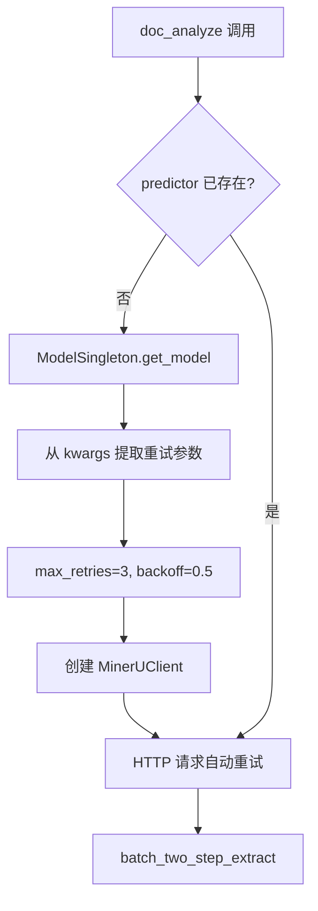
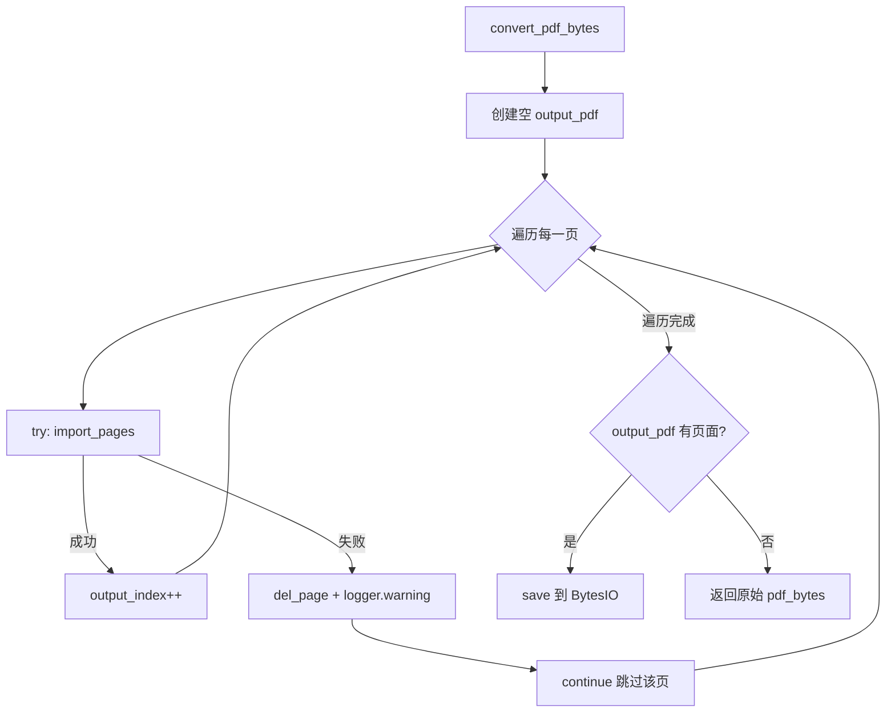
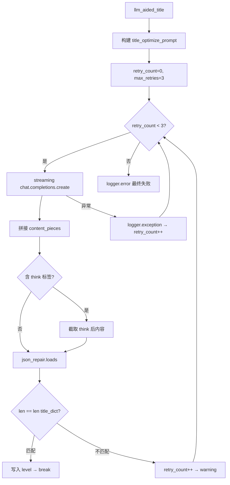

# PD-03.MinerU MinerU — 多层容错与逐页跳过降级

> 文档编号：PD-03.MinerU
> 来源：MinerU `mineru/backend/vlm/vlm_analyze.py`, `mineru/utils/llm_aided.py`, `mineru/cli/common.py`
> GitHub：https://github.com/opendatalab/MinerU.git
> 问题域：PD-03 容错与重试 Fault Tolerance & Retry
> 状态：可复用方案

---

## 第 1 章 问题与动机

### 1.1 核心问题

MinerU 是一个 PDF 文档智能解析系统，支持 pipeline（传统 OCR）、VLM（视觉语言模型）和 hybrid（混合）三种后端。在生产环境中面临以下容错挑战：

1. **VLM 推理服务不稳定**：HTTP 远程推理服务可能因网络抖动、服务过载、GPU OOM 等原因返回错误，单次请求失败不应导致整个文档解析失败
2. **PDF 页面损坏**：真实世界的 PDF 文件可能包含损坏页面，pypdfium2 导入单页时可能抛异常，不能因一页损坏丢弃整个文档
3. **LLM 标题优化输出不可控**：调用 OpenAI 兼容 API 优化标题层级时，LLM 可能返回格式错误、数量不匹配的结果，需要重试验证
4. **PDF 渲染进程卡死**：多进程并行渲染 PDF 页面为图片时，子进程可能因内存不足或 GPU 驱动问题卡死，需要超时强制终止
5. **分布式 Worker 任务超时**：Tianshu 分布式部署中，Worker 可能因硬件故障或 OOM 导致任务长时间无响应，需要调度器检测并重置

### 1.2 MinerU 的解法概述

MinerU 采用**分层容错**策略，在不同层级实现不同粒度的容错：

1. **HTTP 传输层**：`max_retries=3` + `retry_backoff_factor=0.5` 指数退避重试，由 MinerUClient 在 HTTP 客户端层自动处理（`vlm_analyze.py:51-52`）
2. **页面级跳过**：PDF 页面导入失败时逐页 try-except 跳过损坏页，保留可用页面继续处理（`common.py:62-69`）
3. **LLM 输出验证重试**：标题优化调用设置 `max_retries=3` 的 while 循环，每次验证输出数量是否匹配，不匹配则重试（`llm_aided.py:83-128`）
4. **进程级超时保护**：PDF 渲染使用 ProcessPoolExecutor + `wait(timeout=300s)`，超时后 SIGTERM→SIGKILL 两阶段强制终止（`pdf_image_tools.py:135-192`）
5. **任务级故障恢复**：Tianshu 调度器定期扫描超时任务（默认 60 分钟），自动重置为 pending 状态重新分配（`task_scheduler.py:144-150`）

### 1.3 设计思想

| 设计原则 | 具体实现 | 理由 | 替代方案 |
|----------|----------|------|----------|
| 分层容错 | HTTP/页面/LLM/进程/任务五层独立容错 | 不同层级的故障模式不同，需要不同粒度的恢复策略 | 统一重试装饰器（粒度太粗） |
| 逐页跳过 | 单页导入失败 continue，不中断整个文档 | PDF 损坏通常是局部的，丢弃一页好过丢弃整个文档 | 整文档重试（浪费资源） |
| 输出验证驱动重试 | LLM 重试条件是输出数量不匹配，不是异常 | LLM 可能返回 200 但内容不符合预期，纯异常捕获不够 | 仅捕获异常（漏掉逻辑错误） |
| 两阶段进程终止 | SIGTERM 等 0.1s → SIGKILL 强制杀死 | 给进程优雅退出机会，但不允许无限等待 | 直接 SIGKILL（可能丢数据） |
| 环境变量配置超时 | `MINERU_PDF_RENDER_TIMEOUT` 默认 300s | 不同硬件性能差异大，需要运行时可调 | 硬编码超时值 |

---

## 第 2 章 源码实现分析

### 2.1 架构概览

MinerU 的容错体系分布在五个层级，从底层 HTTP 到顶层任务调度：

```
┌─────────────────────────────────────────────────────────┐
│  Layer 5: Task Scheduler (Tianshu)                      │
│  ┌─────────────────────────────────────────────────┐    │
│  │ reset_stale_tasks(60min) → pending              │    │
│  └─────────────────────────────────────────────────┘    │
├─────────────────────────────────────────────────────────┤
│  Layer 4: Process Timeout (PDF Rendering)               │
│  ┌─────────────────────────────────────────────────┐    │
│  │ ProcessPoolExecutor + wait(timeout=300s)         │    │
│  │ → SIGTERM → 0.1s → SIGKILL                      │    │
│  └─────────────────────────────────────────────────┘    │
├─────────────────────────────────────────────────────────┤
│  Layer 3: LLM Output Validation (Title Optimization)    │
│  ┌─────────────────────────────────────────────────┐    │
│  │ while retry_count < 3:                           │    │
│  │   call LLM → json_repair → len check → break    │    │
│  └─────────────────────────────────────────────────┘    │
├─────────────────────────────────────────────────────────┤
│  Layer 2: Page-Level Skip (PDF Import)                  │
│  ┌─────────────────────────────────────────────────┐    │
│  │ for page in pages:                               │    │
│  │   try: import_page  except: skip + log           │    │
│  └─────────────────────────────────────────────────┘    │
├─────────────────────────────────────────────────────────┤
│  Layer 1: HTTP Transport Retry (VLM Client)             │
│  ┌─────────────────────────────────────────────────┐    │
│  │ MinerUClient(max_retries=3,                      │    │
│  │              retry_backoff_factor=0.5)            │    │
│  └─────────────────────────────────────────────────┘    │
└─────────────────────────────────────────────────────────┘
```

### 2.2 核心实现

#### 2.2.1 HTTP 传输层重试（VLM 推理客户端）



对应源码 `mineru/backend/vlm/vlm_analyze.py:46-216`：

```python
class ModelSingleton:
    _instance = None
    _models = {}

    def get_model(self, backend: str, model_path: str | None,
                  server_url: str | None, **kwargs) -> MinerUClient:
        key = (backend, model_path, server_url)
        if key not in self._models:
            # 从 kwargs 提取 HTTP 客户端重试参数
            max_retries = kwargs.get("max_retries", 3)           # L51
            retry_backoff_factor = kwargs.get("retry_backoff_factor", 0.5)  # L52
            http_timeout = kwargs.get("http_timeout", 600)       # L49

            self._models[key] = MinerUClient(
                backend=backend,
                server_url=server_url,
                max_retries=max_retries,              # L214
                retry_backoff_factor=retry_backoff_factor,  # L215
                http_timeout=http_timeout,             # L212
                # ... 其他参数
            )
        return self._models[key]
```

关键设计：`ModelSingleton` 单例模式确保同一 backend+model+server 组合只创建一个客户端实例，重试参数在客户端初始化时注入，后续所有推理请求自动享有重试保护。默认 `max_retries=3` 配合 `retry_backoff_factor=0.5` 意味着重试间隔为 0.5s → 1s → 2s。

#### 2.2.2 页面级跳过容错（PDF 导入）



对应源码 `mineru/cli/common.py:54-82`：

```python
def convert_pdf_bytes_to_bytes_by_pypdfium2(pdf_bytes, start_page_id=0, end_page_id=None):
    pdf = pdfium.PdfDocument(pdf_bytes)
    output_pdf = pdfium.PdfDocument.new()
    try:
        end_page_id = get_end_page_id(end_page_id, len(pdf))
        output_index = 0
        for page_index in range(start_page_id, end_page_id + 1):
            try:
                output_pdf.import_pages(pdf, pages=[page_index])  # L64
                output_index += 1
            except Exception as page_error:
                output_pdf.del_page(output_index)                 # L67
                logger.warning(f"Failed to import page {page_index}: {page_error}, skipping this page.")
                continue                                          # L69

        output_buffer = io.BytesIO()
        output_pdf.save(output_buffer)
        output_bytes = output_buffer.getvalue()
    except Exception as e:
        logger.warning(f"Error in converting PDF bytes: {e}, Using original PDF bytes.")
        output_bytes = pdf_bytes  # 整体失败时回退到原始 PDF
    pdf.close()
    output_pdf.close()
    return output_bytes
```

关键设计：双层 try-except — 内层捕获单页导入异常并跳过，外层捕获整体异常并回退到原始 PDF。`del_page(output_index)` 清理已分配但未成功写入的页面槽位，防止空白页残留。

#### 2.2.3 LLM 输出验证重试（标题优化）



对应源码 `mineru/utils/llm_aided.py:83-128`：

```python
retry_count = 0
max_retries = 3
dict_completion = None

while retry_count < max_retries:
    try:
        completion = client.chat.completions.create(**api_params)  # L101
        content_pieces = []
        for chunk in completion:
            if chunk.choices and chunk.choices[0].delta.content is not None:
                content_pieces.append(chunk.choices[0].delta.content)
        content = "".join(content_pieces).strip()

        # 处理推理模型的 thinking tags
        if "</think>" in content:                                  # L108
            idx = content.index("</think>") + len("</think>")
            content = content[idx:].strip()

        dict_completion = json_repair.loads(content)               # L111
        dict_completion = {int(k): int(v) for k, v in dict_completion.items()}

        if len(dict_completion) == len(title_dict):                # L115
            for i, origin_title_block in enumerate(origin_title_list):
                origin_title_block["level"] = int(dict_completion[i])
            break
        else:
            logger.warning("The number of titles in the optimized result is not equal...")
            retry_count += 1
    except Exception as e:
        logger.exception(e)
        retry_count += 1

if dict_completion is None:
    logger.error("Failed to decode dict after maximum retries.")   # L128
```

关键设计：
- **流式响应拼接**：使用 `stream=True` 逐 chunk 拼接，避免大响应超时
- **thinking tags 剥离**：兼容推理模型（如 DeepSeek-R1）的 `<think>...</think>` 输出
- **json_repair 容错解析**：不用 `json.loads`，而用 `json_repair.loads` 自动修复 LLM 输出的非标准 JSON
- **数量验证**：重试条件不仅是异常，还包括输出数量不匹配（LLM 可能丢失或新增标题）
- **静默降级**：所有重试耗尽后仅 log error，不抛异常，标题保持原始层级

### 2.3 实现细节

#### 进程级超时保护（PDF 渲染）

`mineru/utils/pdf_image_tools.py:55-169` 实现了多进程 PDF 渲染的超时保护：

```python
# 超时配置：环境变量 > 默认 300s
if timeout is None:
    timeout = get_load_images_timeout()  # MINERU_PDF_RENDER_TIMEOUT, default 300

executor = ProcessPoolExecutor(max_workers=actual_threads)
try:
    futures = [executor.submit(_load_images_from_pdf_worker, ...) for ...]
    done, not_done = wait(futures, timeout=timeout, return_when=ALL_COMPLETED)

    if not_done:  # 超时
        _terminate_executor_processes(executor)  # SIGTERM → SIGKILL
        raise TimeoutError(f"PDF to images conversion timeout after {timeout}s")
except Exception as e:
    _terminate_executor_processes(executor)  # 任何异常都清理子进程
    raise
finally:
    executor.shutdown(wait=False, cancel_futures=True)
```

两阶段进程终止 `_terminate_executor_processes`（`pdf_image_tools.py:172-192`）：

```python
def _terminate_executor_processes(executor):
    if hasattr(executor, '_processes'):
        for pid, process in executor._processes.items():
            if process.is_alive():
                try:
                    os.kill(pid, signal.SIGTERM)  # 第一阶段：优雅退出
                except (ProcessLookupError, OSError):
                    pass
        time.sleep(0.1)  # 等待 100ms
        for pid, process in executor._processes.items():
            if process.is_alive():
                try:
                    os.kill(pid, signal.SIGKILL)  # 第二阶段：强制终止
                except (ProcessLookupError, OSError):
                    pass
```

#### Worker 任务故障恢复（Tianshu 调度器）

`projects/mineru_tianshu/task_scheduler.py:144-150` 实现超时任务自动重置：

```python
stale_task_counter += 1
if stale_task_counter * self.monitor_interval >= self.stale_task_timeout * 60:
    stale_task_counter = 0
    reset_count = self.db.reset_stale_tasks(self.stale_task_timeout)
    if reset_count > 0:
        logger.warning(f"Reset {reset_count} stale tasks (timeout: {self.stale_task_timeout}m)")
```

Worker 优雅关闭（`litserve_worker.py:131-149`）：

```python
def teardown(self):
    if self.enable_worker_loop and self.worker_thread and self.worker_thread.is_alive():
        self.running = False
        timeout = self.poll_interval * 2
        self.worker_thread.join(timeout=timeout)
        if self.worker_thread.is_alive():
            logger.warning(f"Worker thread did not stop within {timeout}s, forcing exit")
```


---

## 第 3 章 迁移指南

### 3.1 迁移清单

**阶段 1：HTTP 客户端重试（1 天）**
- [ ] 为 VLM/LLM 推理客户端添加 `max_retries` 和 `retry_backoff_factor` 参数
- [ ] 使用 `httpx` 或 `urllib3.Retry` 实现传输层自动重试
- [ ] 配置合理的 `http_timeout`（推荐 300-600s，视模型推理时间而定）

**阶段 2：页面级容错（0.5 天）**
- [ ] 在批量处理循环中为每个单元添加 try-except-continue
- [ ] 记录跳过的单元（页码、错误原因）供事后审计
- [ ] 添加整体回退逻辑（所有单元失败时返回原始输入）

**阶段 3：LLM 输出验证重试（1 天）**
- [ ] 定义输出验证函数（不仅检查异常，还检查业务逻辑）
- [ ] 使用 `json_repair` 替代 `json.loads` 解析 LLM 输出
- [ ] 处理推理模型的 thinking tags 剥离
- [ ] 设置最大重试次数，耗尽后静默降级

**阶段 4：进程超时保护（0.5 天）**
- [ ] 使用 `concurrent.futures.wait(timeout=)` 替代无限等待
- [ ] 实现两阶段进程终止（SIGTERM → SIGKILL）
- [ ] 通过环境变量暴露超时配置

### 3.2 适配代码模板

#### 模板 1：带输出验证的 LLM 重试

```python
import json_repair
from openai import OpenAI
from loguru import logger


def llm_call_with_validation(
    client: OpenAI,
    messages: list[dict],
    model: str,
    validator: callable,
    max_retries: int = 3,
    temperature: float = 0.7,
) -> dict | None:
    """
    带输出验证的 LLM 调用重试。
    validator(parsed_output) -> bool，返回 True 表示输出有效。
    """
    for attempt in range(max_retries):
        try:
            completion = client.chat.completions.create(
                model=model,
                messages=messages,
                temperature=temperature,
                stream=True,
            )
            # 流式拼接
            content_pieces = []
            for chunk in completion:
                if chunk.choices and chunk.choices[0].delta.content:
                    content_pieces.append(chunk.choices[0].delta.content)
            content = "".join(content_pieces).strip()

            # 剥离 thinking tags
            if "</think>" in content:
                content = content[content.index("</think>") + len("</think>"):].strip()

            # 容错 JSON 解析
            parsed = json_repair.loads(content)

            # 业务验证
            if validator(parsed):
                return parsed
            else:
                logger.warning(f"Attempt {attempt+1}/{max_retries}: output validation failed")
        except Exception as e:
            logger.warning(f"Attempt {attempt+1}/{max_retries}: {e}")

    logger.error(f"All {max_retries} attempts failed")
    return None  # 静默降级
```

#### 模板 2：逐项跳过容错

```python
from loguru import logger


def process_items_with_skip(items: list, processor: callable, fallback=None):
    """
    逐项处理，单项失败跳过不中断。
    返回 (成功结果列表, 跳过项索引列表)。
    """
    results = []
    skipped = []
    for idx, item in enumerate(items):
        try:
            result = processor(item)
            results.append(result)
        except Exception as e:
            logger.warning(f"Item {idx} failed: {e}, skipping")
            skipped.append(idx)
            if fallback is not None:
                results.append(fallback)
            continue

    if not results and items:
        logger.error("All items failed, returning empty")
    return results, skipped
```

#### 模板 3：多进程超时保护

```python
import os
import signal
import time
from concurrent.futures import ProcessPoolExecutor, wait, ALL_COMPLETED
from loguru import logger


def run_with_process_timeout(
    fn: callable,
    args_list: list[tuple],
    timeout: int = 300,
    max_workers: int = 4,
):
    """
    多进程执行，带全局超时和两阶段终止。
    """
    executor = ProcessPoolExecutor(max_workers=max_workers)
    try:
        futures = [executor.submit(fn, *args) for args in args_list]
        done, not_done = wait(futures, timeout=timeout, return_when=ALL_COMPLETED)

        if not_done:
            _terminate_processes(executor)
            raise TimeoutError(f"Timeout after {timeout}s, {len(not_done)} tasks incomplete")

        return [f.result() for f in futures]
    except Exception:
        _terminate_processes(executor)
        raise
    finally:
        executor.shutdown(wait=False, cancel_futures=True)


def _terminate_processes(executor):
    if hasattr(executor, '_processes'):
        for pid, proc in executor._processes.items():
            if proc.is_alive():
                try:
                    os.kill(pid, signal.SIGTERM)
                except (ProcessLookupError, OSError):
                    pass
        time.sleep(0.1)
        for pid, proc in executor._processes.items():
            if proc.is_alive():
                try:
                    os.kill(pid, signal.SIGKILL)
                except (ProcessLookupError, OSError):
                    pass
```

### 3.3 适用场景

| 场景 | 适用度 | 说明 |
|------|--------|------|
| PDF/文档批量解析 | ⭐⭐⭐ | 直接适用，逐页跳过 + 进程超时是核心需求 |
| VLM/LLM 远程推理调用 | ⭐⭐⭐ | HTTP 重试 + 输出验证重试组合使用 |
| 多进程 GPU 推理 | ⭐⭐⭐ | 进程超时保护防止 GPU OOM 卡死 |
| 分布式任务队列 | ⭐⭐ | 超时任务重置适用于任何 Worker 架构 |
| 流式 LLM 输出解析 | ⭐⭐ | thinking tags 剥离 + json_repair 组合 |
| 单次 API 调用 | ⭐ | 过于简单，直接用 httpx retry 即可 |

---

## 第 4 章 测试用例

```python
import io
import json
import pytest
from unittest.mock import MagicMock, patch, PropertyMock


class TestPageLevelSkip:
    """测试 PDF 页面级跳过容错"""

    def test_skip_corrupted_page(self):
        """损坏页面应被跳过，其余页面正常处理"""
        import pypdfium2 as pdfium

        # 创建一个 3 页的测试 PDF
        doc = pdfium.PdfDocument.new()
        for _ in range(3):
            doc.new_page(612, 792)
        buf = io.BytesIO()
        doc.save(buf)
        pdf_bytes = buf.getvalue()
        doc.close()

        # Mock import_pages 使第 2 页失败
        from mineru.cli.common import convert_pdf_bytes_to_bytes_by_pypdfium2
        original_import = pdfium.PdfDocument.import_pages

        call_count = 0
        def mock_import(self, src, pages=None):
            nonlocal call_count
            call_count += 1
            if call_count == 2:  # 第 2 页
                raise RuntimeError("Corrupted page")
            return original_import(self, src, pages=pages)

        with patch.object(pdfium.PdfDocument, 'import_pages', mock_import):
            result = convert_pdf_bytes_to_bytes_by_pypdfium2(pdf_bytes)

        # 结果应该是有效的 PDF（2 页）
        result_doc = pdfium.PdfDocument(result)
        assert len(result_doc) == 2
        result_doc.close()

    def test_all_pages_corrupted_fallback(self):
        """所有页面损坏时应回退到原始 PDF"""
        import pypdfium2 as pdfium
        from mineru.cli.common import convert_pdf_bytes_to_bytes_by_pypdfium2

        doc = pdfium.PdfDocument.new()
        doc.new_page(612, 792)
        buf = io.BytesIO()
        doc.save(buf)
        pdf_bytes = buf.getvalue()
        doc.close()

        with patch.object(pdfium.PdfDocument, 'import_pages', side_effect=RuntimeError("All bad")):
            result = convert_pdf_bytes_to_bytes_by_pypdfium2(pdf_bytes)

        # 应返回原始 bytes（外层 except 兜底）
        assert isinstance(result, bytes)
        assert len(result) > 0


class TestLLMOutputValidationRetry:
    """测试 LLM 输出验证重试"""

    def test_retry_on_count_mismatch(self):
        """输出数量不匹配时应重试"""
        from mineru.utils.llm_aided import llm_aided_title

        mock_client = MagicMock()
        # 第 1 次返回数量不匹配，第 2 次返回正确
        mock_chunk_bad = MagicMock()
        mock_chunk_bad.choices = [MagicMock(delta=MagicMock(content='{"0":1}'))]
        mock_chunk_good = MagicMock()
        mock_chunk_good.choices = [MagicMock(delta=MagicMock(content='{"0":1,"1":2}'))]

        mock_client.chat.completions.create.side_effect = [
            iter([mock_chunk_bad]),    # 第 1 次：只有 1 个标题
            iter([mock_chunk_good]),   # 第 2 次：2 个标题（正确）
        ]

        page_info_list = [
            {"para_blocks": [
                {"type": "title", "lines": [{"bbox": [0, 0, 100, 20]}], "bbox": [0, 0, 100, 20]},
                {"type": "title", "lines": [{"bbox": [0, 0, 100, 15]}], "bbox": [0, 0, 100, 15]},
            ], "page_idx": 0}
        ]

        config = {"api_key": "test", "base_url": "http://test", "model": "test"}
        with patch('mineru.utils.llm_aided.OpenAI', return_value=mock_client):
            llm_aided_title(page_info_list, config)

        assert mock_client.chat.completions.create.call_count == 2

    def test_max_retries_exhausted(self):
        """重试耗尽后应静默降级，不抛异常"""
        from mineru.utils.llm_aided import llm_aided_title

        mock_client = MagicMock()
        mock_client.chat.completions.create.side_effect = Exception("API Error")

        page_info_list = [
            {"para_blocks": [
                {"type": "title", "lines": [{"bbox": [0, 0, 100, 20]}], "bbox": [0, 0, 100, 20]},
            ], "page_idx": 0}
        ]

        config = {"api_key": "test", "base_url": "http://test", "model": "test"}
        with patch('mineru.utils.llm_aided.OpenAI', return_value=mock_client):
            # 不应抛异常
            llm_aided_title(page_info_list, config)

        assert mock_client.chat.completions.create.call_count == 3


class TestProcessTimeout:
    """测试进程超时保护"""

    def test_timeout_raises_error(self):
        """超时应抛出 TimeoutError"""
        import time
        from mineru.utils.pdf_image_tools import load_images_from_pdf

        # 创建一个极小的 PDF
        import pypdfium2 as pdfium
        doc = pdfium.PdfDocument.new()
        doc.new_page(612, 792)
        buf = io.BytesIO()
        doc.save(buf)
        pdf_bytes = buf.getvalue()
        doc.close()

        # 设置极短超时
        with pytest.raises(TimeoutError):
            # Mock worker 使其永远不返回
            with patch('mineru.utils.pdf_image_tools._load_images_from_pdf_worker',
                       side_effect=lambda *a: time.sleep(100)):
                load_images_from_pdf(pdf_bytes, timeout=1)
```


---

## 第 5 章 跨域关联

| 关联域 | 关系类型 | 说明 |
|--------|----------|------|
| PD-01 上下文管理 | 协同 | LLM 标题优化的 prompt 构建需要控制输入长度，标题数量过多时可能超出上下文窗口 |
| PD-02 多 Agent 编排 | 协同 | Tianshu 的 Worker 循环拉取 + Scheduler 监控是一种轻量级多 Agent 编排，容错在 Worker 层和 Scheduler 层分别实现 |
| PD-04 工具系统 | 依赖 | VLM 推理客户端的 `max_retries` 参数通过 kwargs 透传，工具注册时需要暴露这些配置项 |
| PD-05 沙箱隔离 | 协同 | ProcessPoolExecutor 的多进程渲染本质上是进程级沙箱隔离，超时终止防止子进程资源泄漏 |
| PD-11 可观测性 | 依赖 | 所有容错路径都使用 loguru 记录 warning/error，是事后分析失败模式的关键数据源 |

---

## 第 6 章 来源文件索引

| 文件 | 行范围 | 关键实现 |
|------|--------|----------|
| `mineru/backend/vlm/vlm_analyze.py` | L23-219 | ModelSingleton 单例 + MinerUClient 初始化（max_retries, retry_backoff_factor） |
| `mineru/utils/llm_aided.py` | L9-128 | LLM 标题优化：while 重试循环 + json_repair + thinking tags 剥离 + 数量验证 |
| `mineru/cli/common.py` | L54-82 | PDF 页面级跳过：逐页 try-except-continue + 整体 fallback |
| `mineru/utils/pdf_image_tools.py` | L55-169 | 多进程 PDF 渲染超时保护：ProcessPoolExecutor + wait(timeout) |
| `mineru/utils/pdf_image_tools.py` | L172-192 | 两阶段进程终止：SIGTERM → 0.1s → SIGKILL |
| `mineru/utils/os_env_config.py` | L9-11 | 环境变量超时配置：MINERU_PDF_RENDER_TIMEOUT 默认 300s |
| `projects/mineru_tianshu/task_scheduler.py` | L70-92 | Worker 健康检查：aiohttp + 10s 超时 |
| `projects/mineru_tianshu/task_scheduler.py` | L144-150 | 超时任务自动重置：stale_task_timeout 分钟后重置为 pending |
| `projects/mineru_tianshu/litserve_worker.py` | L131-149 | Worker 优雅关闭：running=False + thread.join(timeout) |
| `projects/mineru_tianshu/litserve_worker.py` | L161-198 | Worker 主循环：双层 try-except + 任务失败更新状态 |
| `projects/mcp/src/mineru/api.py` | L443-613 | MCP API 轮询重试：max_retries=180 + retry_interval=10s + 部分完成降级 |

---

## 第 7 章 横向对比维度

> **重要：** 本章用于自动填充 Butcher Wiki 的横向对比表。

```json comparison_data
{
  "project": "MinerU",
  "dimensions": {
    "重试策略": "HTTP 层 max_retries=3 + backoff_factor=0.5 指数退避；LLM 层 while 循环 max_retries=3",
    "降级方案": "页面级跳过损坏页 + 整体回退原始 PDF + LLM 重试耗尽静默保留原始层级",
    "超时保护": "ProcessPoolExecutor wait(300s) + SIGTERM→SIGKILL 两阶段终止",
    "错误分类": "区分 HTTP 传输错误、页面损坏、LLM 输出不匹配、进程卡死四类",
    "截断/错误检测": "LLM 输出用 json_repair 容错解析 + thinking tags 剥离 + 数量一致性验证",
    "优雅降级": "逐页跳过不中断文档 + Worker 优雅关闭 join(timeout) + 批量任务部分完成继续",
    "恢复机制": "Tianshu 调度器 reset_stale_tasks 自动重置超时任务为 pending",
    "资源管理模式": "ModelSingleton 单例复用推理客户端 + clean_memory 清理推理中间结果",
    "外部服务容错": "VLM 推理 http_timeout=600s + 健康检查 aiohttp 10s 超时",
    "输出验证": "LLM 标题数量匹配验证 + MCP API 轮询状态 done/failed/error 三态检查",
    "多模态降级": "Windows 环境自动降级为单进程渲染（跳过 ProcessPoolExecutor）"
  }
}
```

### 域元数据补充

```json domain_metadata
{
  "solution_summary": "MinerU 用五层分级容错（HTTP重试/页面跳过/LLM输出验证/进程超时终止/任务重置）实现文档解析的渐进降级，核心是逐页跳过损坏页 + json_repair 容错解析 + SIGTERM→SIGKILL 两阶段进程终止",
  "description": "文档解析场景下页面级粒度的容错与多进程渲染超时保护",
  "sub_problems": [
    "PDF 单页损坏导致 pypdfium2 import_pages 异常：需要逐页跳过而非整文档失败",
    "LLM 推理模型返回 thinking tags 包裹的输出：需要剥离 <think>...</think> 后再解析 JSON",
    "多进程 PDF 渲染子进程卡死：SIGTERM 不响应时需要 SIGKILL 强制终止并清理资源",
    "json_repair 与 json.loads 的选择：LLM 输出常含非标准 JSON（尾逗号、单引号），json_repair 自动修复",
    "Windows 环境不支持 ProcessPoolExecutor 的 fork：需要自动降级为单进程模式"
  ],
  "best_practices": [
    "LLM 输出验证不仅检查异常，还要检查业务逻辑（如数量一致性）",
    "两阶段进程终止：先 SIGTERM 给优雅退出机会，再 SIGKILL 兜底",
    "通过环境变量暴露超时配置，适应不同硬件性能差异",
    "使用 json_repair 替代 json.loads 解析 LLM 输出，提高容错率",
    "单例模式复用推理客户端，避免重试时重复初始化模型"
  ]
}
```

