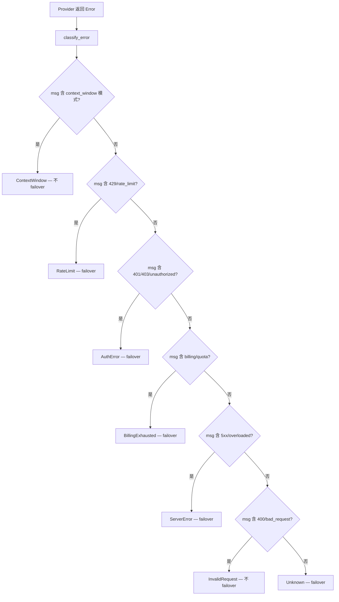
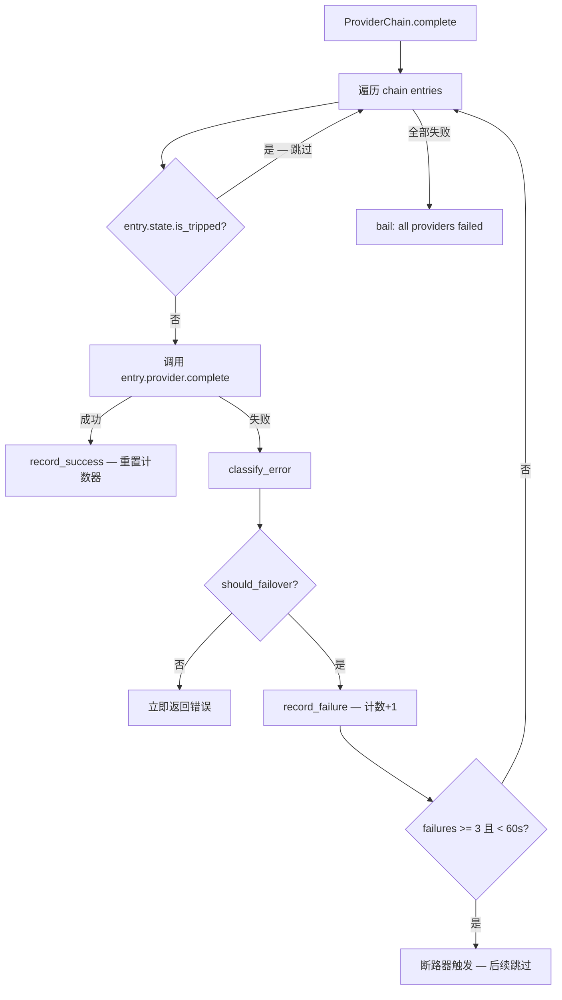
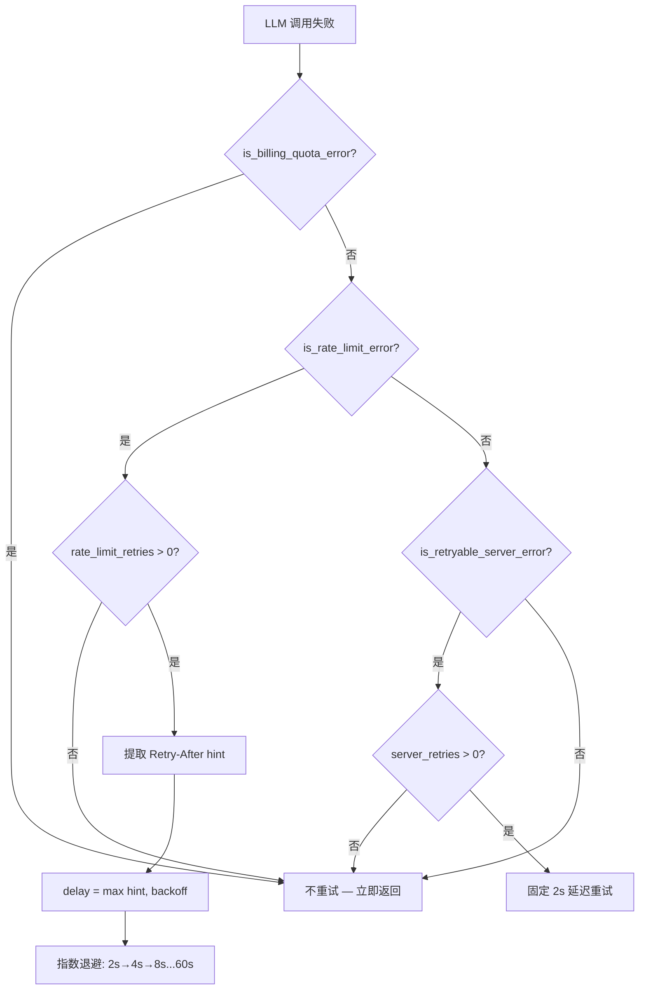

# PD-03.01 Moltis — ProviderChain 断路器与分层重试容错体系

> 文档编号：PD-03.01
> 来源：Moltis `crates/agents/src/provider_chain.rs` `crates/agents/src/runner.rs` `crates/memory/src/embeddings_fallback.rs`
> GitHub：https://github.com/moltis-org/moltis.git
> 问题域：PD-03 容错与重试 Fault Tolerance & Retry
> 状态：可复用方案

---

## 第 1 章 问题与动机

### 1.1 核心问题

LLM Agent 系统在生产环境中面临多层容错挑战：

1. **多 Provider 异构错误**：不同 LLM 供应商（OpenAI、Anthropic、Google 等）返回的错误格式各异，429/500/401 的表现形式不统一
2. **瞬态故障与持久故障混淆**：速率限制（可重试）和配额耗尽（不可重试）需要不同处理策略
3. **Provider 雪崩**：一个 Provider 持续失败时，如果不跳过它，每次请求都会浪费时间等待超时
4. **Embedding 层独立容错**：向量嵌入和 LLM 补全是两条独立的调用链，各自需要 fallback 机制
5. **流式响应中途失败**：streaming 模式下无法像同步调用那样透明重试，需要特殊处理
6. **MCP 外部服务崩溃**：外部工具服务（MCP Server）可能随时死亡，需要自动检测和重启

Moltis 作为一个 Rust 实现的 Agent 框架，用类型系统和零成本抽象构建了一套完整的分层容错体系。

### 1.2 Moltis 的解法概述

1. **7 类错误分类枚举** (`provider_chain.rs:26-41`)：将所有 Provider 错误归类为 RateLimit/AuthError/ServerError/BillingExhausted/ContextWindow/InvalidRequest/Unknown，每类有明确的 failover 策略
2. **per-Provider 断路器** (`provider_chain.rs:136-175`)：每个 Provider 独立维护 `consecutive_failures` 计数器，3 次连续失败触发断路，60s 冷却后自动恢复
3. **双层重试分离** (`runner.rs:108-217`)：Runner 层区分 server error（固定 2s 延迟，最多 1 次）和 rate limit（指数退避 2s-60s，最多 10 次），两套独立计数器
4. **Retry-After 解析** (`runner.rs:152-177`)：从 Provider 错误消息中提取 `retry_after_ms=`、`Retry-After:` 等 hint，优先使用 Provider 建议的等待时间
5. **Embedding 独立 Fallback 链** (`embeddings_fallback.rs:65-68`)：`FallbackEmbeddingProvider` 维护独立的断路器和 active provider 指针，支持 single/batch 两种模式
6. **MCP 健康监控与指数退避重启** (`gateway/mcp_health.rs:17-20`)：30s 轮询检测，死亡服务自动重启，退避 5s→10s→20s→40s→80s（上限 300s），最多 5 次

### 1.3 设计思想

| 设计原则 | 具体实现 | 理由 | 替代方案 |
|----------|----------|------|----------|
| 错误分类优先于重试 | `classify_error()` 基于字符串模式匹配 9 种 context window 模式 | 不同错误需要不同策略，ContextWindow 不应 failover | 用 HTTP status code 分类（但 Provider SDK 常丢失原始状态码） |
| 断路器内嵌而非外挂 | `ProviderState` 直接嵌入 `ChainEntry` | 零额外分配，无需外部断路器库 | 使用 tower-circuit-breaker 等中间件 |
| 透明代理模式 | `ProviderChain` 实现 `LlmProvider` trait | 调用方无需感知 failover 存在 | 在调用方手动管理 Provider 列表 |
| 重试预算独立 | server_retries 和 rate_limit_retries 分开计数 | 避免 server error 消耗 rate limit 的重试预算 | 共享一个全局重试计数器 |
| 流式降级选择 | streaming 不做中途重试，选最佳 Provider 直接开始 | 流式中途切换 Provider 会导致输出不连贯 | 缓冲整个流再重试（延迟大） |

---

## 第 2 章 源码实现分析

### 2.1 架构概览

Moltis 的容错体系分为三层，每层独立运作：

```
┌─────────────────────────────────────────────────────────┐
│                    Runner 层 (runner.rs)                  │
│  ┌─────────────────┐  ┌──────────────────────────────┐  │
│  │ 错误模式检测     │  │ 分层重试引擎                  │  │
│  │ is_context_window│  │ server: 2s × 1次             │  │
│  │ is_rate_limit    │  │ rate_limit: 2s-60s × 10次    │  │
│  │ is_billing_quota │  │ + Retry-After hint 解析       │  │
│  └─────────────────┘  └──────────────────────────────┘  │
├─────────────────────────────────────────────────────────┤
│              ProviderChain 层 (provider_chain.rs)         │
│  ┌──────────┐  ┌──────────┐  ┌──────────┐              │
│  │Provider A│  │Provider B│  │Provider C│  ...          │
│  │ CB: 0/3  │  │ CB: 2/3  │  │ CB: ✓    │              │
│  │ [active] │  │ [ready]  │  │ [tripped]│              │
│  └──────────┘  └──────────┘  └──────────┘              │
├─────────────────────────────────────────────────────────┤
│           Embedding Fallback 层 (embeddings_fallback.rs) │
│  ┌──────────┐  ┌──────────┐                             │
│  │Embed A   │  │Embed B   │  active → A                 │
│  │ CB: 0/3  │  │ CB: 0/3  │                             │
│  └──────────┘  └──────────┘                             │
├─────────────────────────────────────────────────────────┤
│           MCP Health 层 (mcp_health.rs)                  │
│  轮询 30s │ 重启退避 5s×2^n (上限 300s) │ 最多 5 次     │
└─────────────────────────────────────────────────────────┘
```

### 2.2 核心实现

#### 2.2.1 错误分类引擎



对应源码 `crates/agents/src/provider_chain.rs:73-131`：

```rust
pub fn classify_error(err: &anyhow::Error) -> ProviderErrorKind {
    let msg = err.to_string().to_lowercase();

    // Context window — must check first since "request too large" overlaps.
    if CONTEXT_WINDOW_PATTERNS.iter().any(|p| msg.contains(p)) {
        return ProviderErrorKind::ContextWindow;
    }

    // Rate limiting.
    if msg.contains("429")
        || msg.contains("rate limit")
        || msg.contains("rate_limit")
        || msg.contains("too many requests")
    {
        return ProviderErrorKind::RateLimit;
    }

    // Auth errors.
    if msg.contains("401") || msg.contains("403")
        || msg.contains("unauthorized") || msg.contains("forbidden")
        || msg.contains("invalid api key") || msg.contains("invalid_api_key")
        || msg.contains("authentication")
    {
        return ProviderErrorKind::AuthError;
    }

    // Billing / quota exhaustion.
    if msg.contains("billing") || msg.contains("quota")
        || msg.contains("insufficient_quota") || msg.contains("usage limit")
        || msg.contains("credit")
    {
        return ProviderErrorKind::BillingExhausted;
    }

    // Server errors.
    if msg.contains("500") || msg.contains("502") || msg.contains("503")
        || msg.contains("504") || msg.contains("internal server error")
        || msg.contains("bad gateway") || msg.contains("service unavailable")
        || msg.contains("overloaded")
    {
        return ProviderErrorKind::ServerError;
    }

    // Invalid request (400-level, non-auth, non-rate-limit).
    if msg.contains("400") || msg.contains("bad request")
        || msg.contains("invalid_request")
    {
        return ProviderErrorKind::InvalidRequest;
    }

    ProviderErrorKind::Unknown
}
```

关键设计：ContextWindow 检查优先于其他模式，因为 "request too large" 可能同时匹配 ServerError。`should_failover()` 方法明确 ContextWindow 和 InvalidRequest 不触发 failover（`provider_chain.rs:46-55`），因为这两类错误换 Provider 也无法解决。

#### 2.2.2 断路器与 ProviderChain



对应源码 `crates/agents/src/provider_chain.rs:136-175`（断路器状态机）：

```rust
struct ProviderState {
    consecutive_failures: AtomicUsize,
    last_failure: Mutex<Option<Instant>>,
}

impl ProviderState {
    fn record_success(&self) {
        self.consecutive_failures.store(0, Ordering::SeqCst);
    }

    fn record_failure(&self) {
        self.consecutive_failures.fetch_add(1, Ordering::SeqCst);
        *self.last_failure.lock().unwrap_or_else(|e| e.into_inner()) =
            Some(Instant::now());
    }

    /// Trips after 3 consecutive failures; resets after 60s cooldown.
    fn is_tripped(&self) -> bool {
        let failures = self.consecutive_failures.load(Ordering::SeqCst);
        if failures < 3 { return false; }
        let last = self.last_failure.lock().unwrap_or_else(|e| e.into_inner());
        match *last {
            Some(t) if t.elapsed() < Duration::from_secs(60) => true,
            _ => {
                drop(last);
                self.consecutive_failures.store(0, Ordering::SeqCst);
                false
            },
        }
    }
}
```

断路器使用 `AtomicUsize` + `Mutex<Option<Instant>>` 实现，无需外部库。`unwrap_or_else(|e| e.into_inner())` 处理 Mutex 中毒（poisoned mutex），确保即使 panic 也不会永久锁死。

#### 2.2.3 Runner 层分层重试



对应源码 `crates/agents/src/runner.rs:108-217`（重试参数与策略）：

```rust
const SERVER_RETRY_DELAY: Duration = Duration::from_secs(2);
const RATE_LIMIT_INITIAL_RETRY_MS: u64 = 2_000;
const RATE_LIMIT_MAX_RETRY_MS: u64 = 60_000;
const RATE_LIMIT_MAX_RETRIES: u8 = 10;

fn next_rate_limit_retry_ms(previous_ms: Option<u64>) -> u64 {
    previous_ms
        .map(|ms| ms.saturating_mul(2))
        .unwrap_or(RATE_LIMIT_INITIAL_RETRY_MS)
        .clamp(RATE_LIMIT_INITIAL_RETRY_MS, RATE_LIMIT_MAX_RETRY_MS)
}

fn extract_retry_after_ms(msg: &str, max_ms: u64) -> Option<u64> {
    let lower = msg.to_ascii_lowercase();
    for (needle, default_ms) in [
        ("retry_after_ms=", true),
        ("retry-after-ms=", true),
        ("retry_after=", false),
        ("retry-after:", false),
        ("retry after ", false),
        ("retry in ", false),
    ] {
        if let Some(idx) = lower.find(needle) {
            let fragment = &lower[idx + needle.len()..];
            if let Some(ms) = parse_retry_delay_ms_from_fragment(
                fragment, default_ms, max_ms
            ) {
                return Some(ms);
            }
        }
    }
    None
}
```

`next_retry_delay_ms()` (`runner.rs:179-217`) 是核心调度函数：先检查 billing（不重试），再检查 rate limit（指数退避 + hint），最后检查 server error（固定延迟）。两套计数器 `server_retries_remaining` 和 `rate_limit_retries_remaining` 完全独立，互不消耗。

### 2.3 实现细节

**Retry-After 解析器** (`runner.rs:123-150`) 支持多种格式：
- `retry_after_ms=1234`（毫秒）
- `Retry-After: 30`（秒）
- `retry after 30s` / `retry in 45 seconds`（自然语言）

解析器自动识别 ms/sec/min 单位，并用 `clamp(1, max_ms)` 防止 Provider 返回不合理的等待时间。

**流式模式的特殊处理** (`provider_chain.rs:340-362`)：streaming 无法中途切换 Provider，所以 `stream_with_tools()` 选择第一个未触发断路器的 Provider 直接开始。如果全部 tripped，回退到 primary（可能已冷却）。

**Embedding Fallback 的 active 指针** (`embeddings_fallback.rs:67-68`)：`FallbackEmbeddingProvider` 维护一个 `AtomicUsize` 的 `active` 索引，fallback 成功后更新 active，后续请求直接从新的 active 开始遍历，避免每次都从失败的 primary 开始。

**MCP 健康监控** (`gateway/mcp_health.rs:29-109`)：30s 轮询所有 MCP 服务器状态，检测到 "running → dead" 转换时触发自动重启。重启使用指数退避 `min(5s × 2^n, 300s)`，最多 5 次。服务恢复后重置计数器。特别处理了 OAuth 认证中的服务器（`awaiting_auth` 状态不触发重启）。

---

## 第 3 章 迁移指南

### 3.1 迁移清单

**阶段 1：错误分类（1 个文件）**
- [ ] 定义 `ProviderErrorKind` 枚举（至少 5 种：RateLimit/Auth/Server/ContextWindow/Unknown）
- [ ] 实现 `classify_error()` 函数，基于字符串模式匹配
- [ ] 为每种错误类型定义 `should_failover()` 策略
- [ ] 收集目标 Provider 的实际错误消息格式，补充模式列表

**阶段 2：断路器（1 个文件）**
- [ ] 实现 `ProviderState`：连续失败计数 + 最后失败时间
- [ ] 配置阈值：失败次数（默认 3）和冷却时间（默认 60s）
- [ ] 实现 `is_tripped()` 含自动冷却恢复逻辑
- [ ] 处理并发安全（Rust 用 Atomic，Python 用 threading.Lock）

**阶段 3：Provider Chain（1 个文件）**
- [ ] 实现 `ProviderChain` 包装多个 Provider
- [ ] 让 Chain 实现与单个 Provider 相同的接口（透明代理）
- [ ] 同步调用：遍历 chain，跳过 tripped，失败时 failover
- [ ] 流式调用：选择第一个非 tripped Provider 直接开始

**阶段 4：分层重试（集成到 Runner）**
- [ ] 分离 server error 和 rate limit 的重试计数器
- [ ] 实现指数退避：`min(initial × 2^n, max)`
- [ ] 实现 Retry-After 解析（至少支持 `Retry-After:` header 格式）
- [ ] 添加 billing/quota 错误的短路逻辑（不重试）

### 3.2 适配代码模板

以下是 Python 版本的核心迁移模板，可直接复用：

```python
"""Provider Chain with Circuit Breaker — 迁移自 Moltis provider_chain.rs"""
import time
import threading
from enum import Enum, auto
from dataclasses import dataclass, field
from typing import Protocol, Optional
import re
import logging

logger = logging.getLogger(__name__)


class ProviderErrorKind(Enum):
    RATE_LIMIT = auto()
    AUTH_ERROR = auto()
    SERVER_ERROR = auto()
    BILLING_EXHAUSTED = auto()
    CONTEXT_WINDOW = auto()
    INVALID_REQUEST = auto()
    UNKNOWN = auto()

    @property
    def should_failover(self) -> bool:
        return self in (
            self.RATE_LIMIT, self.AUTH_ERROR,
            self.SERVER_ERROR, self.BILLING_EXHAUSTED, self.UNKNOWN,
        )


CONTEXT_WINDOW_PATTERNS = [
    "context_length_exceeded", "max_tokens", "too many tokens",
    "request too large", "maximum context length", "context window",
    "token limit", "content_too_large", "request_too_large",
]

def classify_error(error_msg: str) -> ProviderErrorKind:
    msg = error_msg.lower()
    if any(p in msg for p in CONTEXT_WINDOW_PATTERNS):
        return ProviderErrorKind.CONTEXT_WINDOW
    if any(p in msg for p in ["429", "rate limit", "rate_limit", "too many requests"]):
        return ProviderErrorKind.RATE_LIMIT
    if any(p in msg for p in ["401", "403", "unauthorized", "forbidden", "invalid api key"]):
        return ProviderErrorKind.AUTH_ERROR
    if any(p in msg for p in ["billing", "quota", "insufficient_quota", "credit"]):
        return ProviderErrorKind.BILLING_EXHAUSTED
    if any(p in msg for p in ["500", "502", "503", "504", "internal server error", "overloaded"]):
        return ProviderErrorKind.SERVER_ERROR
    if any(p in msg for p in ["400", "bad request", "invalid_request"]):
        return ProviderErrorKind.INVALID_REQUEST
    return ProviderErrorKind.UNKNOWN


@dataclass
class CircuitBreaker:
    """Per-provider circuit breaker: 3 failures → trip for 60s."""
    threshold: int = 3
    cooldown_secs: float = 60.0
    _failures: int = field(default=0, init=False)
    _last_failure: Optional[float] = field(default=None, init=False)
    _lock: threading.Lock = field(default_factory=threading.Lock, init=False)

    def record_success(self):
        with self._lock:
            self._failures = 0

    def record_failure(self):
        with self._lock:
            self._failures += 1
            self._last_failure = time.monotonic()

    @property
    def is_tripped(self) -> bool:
        with self._lock:
            if self._failures < self.threshold:
                return False
            if self._last_failure and (time.monotonic() - self._last_failure) < self.cooldown_secs:
                return True
            # Cooldown expired, reset
            self._failures = 0
            return False


class LLMProvider(Protocol):
    def name(self) -> str: ...
    async def complete(self, messages: list, tools: list) -> dict: ...


@dataclass
class ChainEntry:
    provider: LLMProvider
    breaker: CircuitBreaker = field(default_factory=CircuitBreaker)


class ProviderChain:
    """Failover chain with per-provider circuit breakers."""

    def __init__(self, providers: list[LLMProvider]):
        self.chain = [ChainEntry(provider=p) for p in providers]

    async def complete(self, messages: list, tools: list) -> dict:
        errors = []
        for entry in self.chain:
            if entry.breaker.is_tripped:
                continue
            try:
                result = await entry.provider.complete(messages, tools)
                entry.breaker.record_success()
                return result
            except Exception as e:
                kind = classify_error(str(e))
                entry.breaker.record_failure()
                if not kind.should_failover:
                    raise
                logger.warning(
                    "provider %s failed (%s), trying next",
                    entry.provider.name(), kind.name,
                )
                errors.append(f"{entry.provider.name()}: {e}")
        raise RuntimeError(f"all providers failed: {'; '.join(errors)}")


def extract_retry_after_ms(msg: str, max_ms: int = 60_000) -> Optional[int]:
    """Extract retry delay from provider error message."""
    lower = msg.lower()
    patterns = [
        (r"retry_after_ms=(\d+)", 1),       # milliseconds
        (r"retry-after:\s*(\d+)", 1000),     # seconds
        (r"retry after (\d+)\s*s", 1000),    # "retry after 30s"
        (r"retry in (\d+)\s*sec", 1000),     # "retry in 45 seconds"
    ]
    for pattern, multiplier in patterns:
        m = re.search(pattern, lower)
        if m:
            return min(int(m.group(1)) * multiplier, max_ms)
    return None
```

### 3.3 适用场景

| 场景 | 适用度 | 说明 |
|------|--------|------|
| 多 Provider LLM 应用 | ⭐⭐⭐ | 核心场景：OpenAI + Anthropic + 本地模型的 failover |
| 单 Provider + 重试 | ⭐⭐⭐ | 用 `ProviderChain::single()` 退化为纯重试模式 |
| Embedding 服务 | ⭐⭐⭐ | FallbackEmbeddingProvider 可直接复用 |
| 外部工具/MCP 服务 | ⭐⭐ | MCP 健康监控模式可迁移到任何外部服务管理 |
| 高并发 API 网关 | ⭐⭐ | 断路器防雪崩，但缺少半开状态的精细控制 |
| 需要精确 SLA 的场景 | ⭐ | 断路器参数硬编码，缺少运行时动态调整 |

---

## 第 4 章 测试用例

基于 Moltis 真实测试模式（`provider_chain.rs:366-765`），以下是可运行的 Python 测试：

```python
import asyncio
import pytest
from unittest.mock import AsyncMock, MagicMock


class MockProvider:
    def __init__(self, name: str, fail_msg: str = None):
        self._name = name
        self._fail_msg = fail_msg

    def name(self) -> str:
        return self._name

    async def complete(self, messages, tools):
        if self._fail_msg:
            raise RuntimeError(self._fail_msg)
        return {"text": "ok", "usage": {"input": 1, "output": 1}}


class TestErrorClassification:
    def test_rate_limit(self):
        assert classify_error("429 Too Many Requests") == ProviderErrorKind.RATE_LIMIT

    def test_context_window_priority(self):
        # context_length_exceeded 应优先于其他模式
        assert classify_error("context_length_exceeded: request too large") == ProviderErrorKind.CONTEXT_WINDOW

    def test_billing_not_retryable(self):
        kind = classify_error("insufficient_quota: billing limit reached")
        assert kind == ProviderErrorKind.BILLING_EXHAUSTED
        assert kind.should_failover  # billing 应 failover 到其他 provider

    def test_invalid_request_no_failover(self):
        kind = classify_error("400 Bad Request: invalid JSON")
        assert kind == ProviderErrorKind.INVALID_REQUEST
        assert not kind.should_failover

    def test_unknown_defaults_to_failover(self):
        kind = classify_error("connection reset by peer")
        assert kind == ProviderErrorKind.UNKNOWN
        assert kind.should_failover


class TestCircuitBreaker:
    def test_trips_after_threshold(self):
        cb = CircuitBreaker(threshold=3, cooldown_secs=60)
        for _ in range(3):
            cb.record_failure()
        assert cb.is_tripped

    def test_resets_on_success(self):
        cb = CircuitBreaker(threshold=3)
        cb.record_failure()
        cb.record_failure()
        cb.record_success()
        cb.record_failure()  # 只有 1 次连续失败
        assert not cb.is_tripped

    def test_cooldown_recovery(self):
        cb = CircuitBreaker(threshold=3, cooldown_secs=0.1)
        for _ in range(3):
            cb.record_failure()
        assert cb.is_tripped
        import time; time.sleep(0.15)
        assert not cb.is_tripped  # 冷却后自动恢复


class TestProviderChain:
    @pytest.mark.asyncio
    async def test_primary_succeeds(self):
        chain = ProviderChain([
            MockProvider("primary"),
            MockProvider("fallback"),
        ])
        result = await chain.complete([], [])
        assert result["text"] == "ok"

    @pytest.mark.asyncio
    async def test_failover_on_rate_limit(self):
        chain = ProviderChain([
            MockProvider("primary", fail_msg="429 rate limit exceeded"),
            MockProvider("fallback"),
        ])
        result = await chain.complete([], [])
        assert result["text"] == "ok"

    @pytest.mark.asyncio
    async def test_no_failover_on_context_window(self):
        chain = ProviderChain([
            MockProvider("primary", fail_msg="context_length_exceeded"),
            MockProvider("fallback"),
        ])
        with pytest.raises(RuntimeError, match="context_length_exceeded"):
            await chain.complete([], [])

    @pytest.mark.asyncio
    async def test_all_fail(self):
        chain = ProviderChain([
            MockProvider("a", fail_msg="429 rate limit"),
            MockProvider("b", fail_msg="503 service unavailable"),
        ])
        with pytest.raises(RuntimeError, match="all providers failed"):
            await chain.complete([], [])


class TestRetryAfterParsing:
    def test_retry_after_ms(self):
        assert extract_retry_after_ms("retry_after_ms=1234") == 1234

    def test_retry_after_header(self):
        assert extract_retry_after_ms("Retry-After: 30") == 30_000

    def test_retry_after_natural(self):
        assert extract_retry_after_ms("retry after 5s") == 5_000

    def test_clamped_to_max(self):
        assert extract_retry_after_ms("retry_after_ms=999999", max_ms=60_000) == 60_000

    def test_no_hint(self):
        assert extract_retry_after_ms("generic error") is None
```

---

## 第 5 章 跨域关联

| 关联域 | 关系类型 | 说明 |
|--------|----------|------|
| PD-01 上下文管理 | 依赖 | ContextWindow 错误触发上下文压缩而非 failover，`AgentRunError::ContextWindowExceeded` 由调用方处理压缩逻辑 |
| PD-02 多 Agent 编排 | 协同 | Runner 的 `max_iterations` 限制（默认 25）防止 Agent 循环，`SubAgentStart/End` 事件追踪子 Agent 生命周期 |
| PD-04 工具系统 | 协同 | `sanitize_tool_result()` 在工具返回结果时截断 base64/hex blob，防止工具输出撑爆上下文 |
| PD-08 搜索与检索 | 依赖 | `FallbackEmbeddingProvider` 为向量检索提供 embedding 容错，active 指针确保检索不因单个 embedding 服务故障中断 |
| PD-11 可观测性 | 协同 | `#[cfg(feature = "metrics")]` 条件编译记录 `COMPLETION_ERRORS_TOTAL`（含 provider/model/error_type 标签）、`COMPLETION_DURATION_SECONDS` 等指标 |

---

## 第 6 章 来源文件索引

| 文件 | 行范围 | 关键实现 |
|------|--------|----------|
| `crates/agents/src/provider_chain.rs` | L1-L765 | ProviderChain 完整实现：错误分类枚举、classify_error()、ProviderState 断路器、ChainEntry、ProviderChain（实现 LlmProvider trait）、完整测试套件 |
| `crates/agents/src/provider_chain.rs` | L26-L56 | `ProviderErrorKind` 枚举定义 + `should_failover()` 策略 |
| `crates/agents/src/provider_chain.rs` | L59-L131 | `CONTEXT_WINDOW_PATTERNS` 常量 + `classify_error()` 分类函数 |
| `crates/agents/src/provider_chain.rs` | L136-L175 | `ProviderState` 断路器：AtomicUsize 计数 + 60s 冷却 |
| `crates/agents/src/provider_chain.rs` | L231-L338 | `ProviderChain::complete()` 主循环：遍历 chain、跳过 tripped、failover 逻辑 |
| `crates/agents/src/provider_chain.rs` | L340-L362 | `ProviderChain::stream/stream_with_tools()` 流式降级选择 |
| `crates/agents/src/runner.rs` | L37-L106 | 四组错误模式常量：CONTEXT_WINDOW / RETRYABLE_SERVER / RATE_LIMIT / BILLING_QUOTA |
| `crates/agents/src/runner.rs` | L108-L121 | 重试参数常量：SERVER_RETRY_DELAY=2s, RATE_LIMIT 2s-60s, MAX_RETRIES=10 |
| `crates/agents/src/runner.rs` | L123-L177 | `parse_retry_delay_ms_from_fragment()` + `extract_retry_after_ms()` Retry-After 解析器 |
| `crates/agents/src/runner.rs` | L179-L217 | `next_retry_delay_ms()` 核心重试调度：billing 短路 → rate limit 指数退避 → server 固定延迟 |
| `crates/agents/src/runner.rs` | L815-L909 | 非流式 agent loop 中的重试集成：错误检测 → delay → continue |
| `crates/agents/src/runner.rs` | L1303-L1523 | 流式 agent loop 中的重试集成：StreamEvent::Error 处理 |
| `crates/memory/src/embeddings_fallback.rs` | L1-L284 | FallbackEmbeddingProvider 完整实现：独立断路器、active 指针、embed/embed_batch 双模式 |
| `crates/memory/src/embeddings_fallback.rs` | L65-L68 | `FallbackEmbeddingProvider` 结构体：chain + active AtomicUsize |
| `crates/memory/src/embeddings_fallback.rs` | L106-L140 | `embed()` 实现：从 active 开始遍历、fallback 后更新 active 指针 |
| `crates/gateway/src/mcp_health.rs` | L1-L109 | MCP 健康监控：30s 轮询、指数退避重启（5s×2^n, 上限 300s）、最多 5 次 |
| `crates/providers/src/ws_pool.rs` | L1-L60 | WebSocket 连接池：MAX_IDLE=4/8、IDLE_TIMEOUT=55s、MAX_LIFETIME=300s |

---

## 第 7 章 横向对比维度

> **重要：** 本章用于自动填充 Butcher Wiki 的横向对比表。

```json comparison_data
{
  "project": "Moltis",
  "dimensions": {
    "错误分类": "7 类枚举 ProviderErrorKind + 字符串模式匹配 classify_error()",
    "重试策略": "双轨分离：server 固定 2s×1 次 + rate_limit 指数退避 2s-60s×10 次",
    "降级方案": "ProviderChain 透明代理 + FallbackEmbeddingProvider active 指针切换",
    "截断/错误检测": "9 种 CONTEXT_WINDOW_PATTERNS 字符串匹配，优先于其他分类",
    "超时保护": "agent_max_iterations=25 循环上限 + WS 连接池 IDLE_TIMEOUT=55s/MAX_LIFETIME=300s",
    "优雅降级": "流式模式选最佳非 tripped Provider 直接开始，不做中途重试",
    "恢复机制": "断路器 60s 冷却自动恢复 + MCP 服务 running 状态重置计数器",
    "监控告警": "条件编译 metrics feature：COMPLETION_ERRORS_TOTAL 含 provider/model/error_type 标签",
    "重试提示解析": "6 种 Retry-After 格式解析（ms/s/min 单位自适应 + clamp 防护）",
    "断路器模型": "per-provider 独立 AtomicUsize 计数 + Mutex<Instant>，3 次触发/60s 冷却",
    "外部服务容错": "MCP 健康轮询 30s + 指数退避重启 5s×2^n（上限 300s，最多 5 次）"
  }
}
```

### 域元数据补充

```json domain_metadata
{
  "solution_summary": "Moltis 用 Rust 类型系统构建三层容错：ProviderChain 7 类错误分类 + per-provider 断路器（3 次/60s），Runner 双轨重试（server 2s×1 + rate_limit 指数退避 2s-60s×10），Embedding 独立 Fallback 链 + MCP 指数退避重启",
  "description": "Rust 原生断路器实现：AtomicUsize + Mutex 零依赖，条件编译 metrics 可选观测",
  "sub_problems": [
    "流式响应无法中途切换 Provider：streaming 模式下 failover 只能在开始前选择，中途错误无法透明重试",
    "Retry-After 格式碎片化：不同 Provider 用 ms/s/min 不同单位和 header/body 不同位置返回重试提示",
    "Mutex 中毒恢复：panic 导致 Mutex poisoned 后断路器状态需要 into_inner() 降级恢复",
    "断路器参数硬编码：阈值和冷却时间为编译期常量，无法运行时动态调整"
  ],
  "best_practices": [
    "错误分类检查顺序很重要：ContextWindow 必须优先于 ServerError，避免 'request too large' 误分类",
    "server error 和 rate limit 用独立计数器：避免一种错误消耗另一种的重试预算",
    "断路器成功时立即重置：record_success() 清零 consecutive_failures，一次成功即恢复信任",
    "Retry-After hint 优先但不替代退避状态：即使使用 Provider 建议的等待时间，仍推进指数退避状态机",
    "billing/quota 错误不重试：账户级别问题短期内不会恢复，立即暴露给调用方"
  ]
}
```
