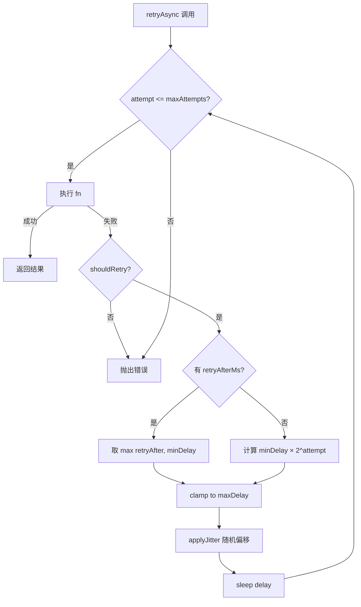
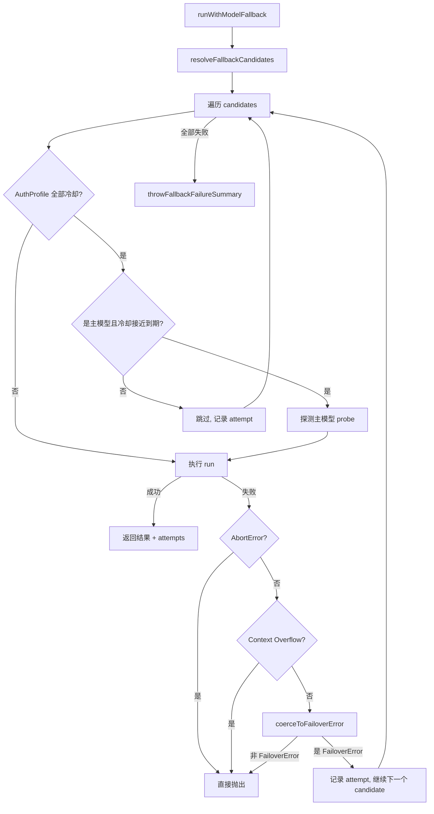
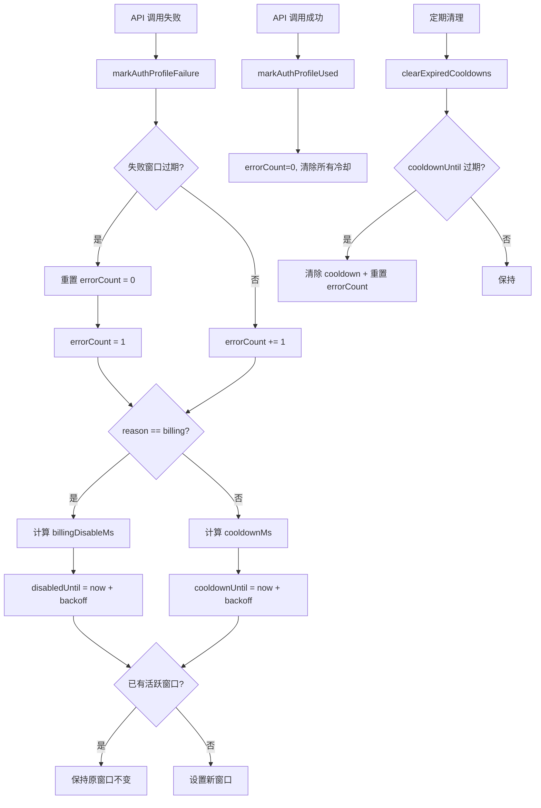

# PD-03.XX OpenClaw — 四层容错体系与 AuthProfile 冷却状态机

> 文档编号：PD-03.XX
> 来源：OpenClaw `src/infra/retry.ts` `src/agents/model-fallback.ts` `src/agents/api-key-rotation.ts` `src/agents/auth-profiles/usage.ts`
> GitHub：https://github.com/openclaw/openclaw.git
> 问题域：PD-03 容错与重试 Fault Tolerance & Retry
> 状态：可复用方案

---

## 第 1 章 问题与动机（≥ 30 行）

### 1.1 核心问题

LLM Agent 系统面临的容错挑战远比传统 Web 服务复杂：

1. **多 Provider 异构错误格式**：Anthropic 返回 `{"type":"error","error":{"type":"rate_limit_error",...}}`，OpenAI 返回 `{"error":{"code":"rate_limit_exceeded",...}}`，Google 返回 `{"error":{"status":"RESOURCE_EXHAUSTED",...}}`。同一语义（速率限制）在 7+ 种 Provider 中有完全不同的 HTTP 状态码和 JSON 结构。
2. **API 密钥池管理**：单个 Provider 可能配置多个 API Key（环境变量 `ANTHROPIC_API_KEY`、`ANTHROPIC_API_KEY_1`、`ANTHROPIC_API_KEYS` 列表），当一个 Key 触发速率限制时需要自动轮转到下一个。
3. **模型级故障转移**：主模型不可用时需要自动切换到备选模型（可能是不同 Provider），同时尊重配置的 allowlist 和 alias 映射。
4. **Auth Profile 冷却**：OAuth/API Key 凭证在触发速率限制后需要进入冷却期，冷却时间随连续失败次数指数增长（1min → 5min → 25min → 1h），且 billing 错误需要更长的独立禁用窗口（5h → 10h → 20h → 24h max）。
5. **工具调用无限循环**：LLM 可能反复生成相同的 tool_calls 消耗 token 无进展，需要断路器机制检测并中断。

### 1.2 OpenClaw 的解法概述

OpenClaw 构建了四层容错体系，从底层到顶层依次为：

1. **通用重试层** (`src/infra/retry.ts:70-136`)：指数退避 + 抖动 + Retry-After 解析，支持 `shouldRetry` 过滤器
2. **API Key 轮转层** (`src/agents/api-key-rotation.ts:40-72`)：同一 Provider 内多 Key 自动轮转，仅对速率限制错误触发
3. **模型故障转移层** (`src/agents/model-fallback.ts:280-410`)：跨 Provider/Model 候选链遍历，含 AuthProfile 冷却感知和探测恢复机制
4. **工具循环断路器** (`src/agents/tool-loop-detection.ts:372-495`)：滑动窗口 + 哈希签名检测重复调用，三级告警（warning → critical → global breaker）

### 1.3 设计思想

| 设计原则 | 具体实现 | 理由 | 替代方案 |
|----------|----------|------|----------|
| 错误分类优先于重试 | `classifyFailoverReason()` 将 50+ 种错误模式归类为 7 种 FailoverReason | 不同错误类型需要不同处理策略（billing 不应重试，rate_limit 应退避） | 统一重试所有错误（浪费预算） |
| 冷却窗口不可变性 | `keepActiveWindowOrRecompute()` 保持活跃冷却窗口不被重试延长 | 防止重试风暴无限延长恢复时间 | 每次失败重新计算冷却（导致永远无法恢复） |
| 探测恢复机制 | `shouldProbePrimaryDuringCooldown()` 在冷却接近到期时主动探测主模型 | 避免长期停留在降级模型上 | 等待冷却完全到期（延迟恢复） |
| Context Overflow 不降级 | `isLikelyContextOverflowError()` 检测后直接 rethrow，不尝试更小窗口的模型 | 切换到更小上下文窗口的模型只会更快失败 | 尝试所有候选模型（浪费时间） |
| 工具循环哈希检测 | `hashToolCall()` 用 SHA-256 对工具名+参数做稳定哈希 | 精确检测重复调用而非仅靠计数 | 简单计数（无法区分不同参数的调用） |

---

## 第 2 章 源码实现分析（核心章节）

### 2.1 架构概览

```
┌─────────────────────────────────────────────────────────────────┐
│                    Agent Run (attempt.ts)                        │
│  ┌───────────────────────────────────────────────────────────┐  │
│  │ Layer 4: Tool Loop Detection (tool-loop-detection.ts)     │  │
│  │  滑动窗口 30 条 → warning(10) → critical(20) → breaker(30)│  │
│  └───────────────────────────────────────────────────────────┘  │
│  ┌───────────────────────────────────────────────────────────┐  │
│  │ Layer 3: Model Fallback (model-fallback.ts)               │  │
│  │  Primary → Fallback1 → Fallback2 → Configured Default    │  │
│  │  ┌─────────────────────────────────────────────────────┐  │  │
│  │  │ AuthProfile Cooldown (auth-profiles/usage.ts)       │  │  │
│  │  │  isProfileInCooldown → skip or probe                │  │  │
│  │  └─────────────────────────────────────────────────────┘  │  │
│  └───────────────────────────────────────────────────────────┘  │
│  ┌───────────────────────────────────────────────────────────┐  │
│  │ Layer 2: API Key Rotation (api-key-rotation.ts)           │  │
│  │  Key1 → Key2 → Key3 (仅 rate_limit 触发)                 │  │
│  └───────────────────────────────────────────────────────────┘  │
│  ┌───────────────────────────────────────────────────────────┐  │
│  │ Layer 1: Generic Retry (infra/retry.ts)                   │  │
│  │  指数退避 + 抖动 + Retry-After + shouldRetry              │  │
│  └───────────────────────────────────────────────────────────┘  │
│  ┌───────────────────────────────────────────────────────────┐  │
│  │ Error Classification (failover-error.ts + errors.ts)      │  │
│  │  50+ patterns → 7 FailoverReason types                    │  │
│  └───────────────────────────────────────────────────────────┘  │
└─────────────────────────────────────────────────────────────────┘
```

### 2.2 核心实现

#### 2.2.1 通用重试引擎



对应源码 `src/infra/retry.ts:70-136`：

```typescript
export async function retryAsync<T>(
  fn: () => Promise<T>,
  attemptsOrOptions: number | RetryOptions = 3,
  initialDelayMs = 300,
): Promise<T> {
  // 简单模式：纯数字参数
  if (typeof attemptsOrOptions === "number") {
    const attempts = Math.max(1, Math.round(attemptsOrOptions));
    let lastErr: unknown;
    for (let i = 0; i < attempts; i += 1) {
      try { return await fn(); }
      catch (err) {
        lastErr = err;
        if (i === attempts - 1) break;
        const delay = initialDelayMs * 2 ** i;  // 指数退避
        await sleep(delay);
      }
    }
    throw lastErr ?? new Error("Retry failed");
  }
  // 高级模式：RetryOptions 对象
  const resolved = resolveRetryConfig(DEFAULT_RETRY_CONFIG, options);
  // ... shouldRetry 过滤 + retryAfterMs 解析 + jitter 应用
}
```

关键设计点：
- 默认配置 `attempts:3, minDelayMs:300, maxDelayMs:30_000, jitter:0` (`src/infra/retry.ts:25-30`)
- `retryAfterMs` 回调允许从 Provider 响应头解析 Retry-After 值 (`src/infra/retry.ts:115-118`)
- `applyJitter()` 使用 `(Math.random() * 2 - 1) * jitter` 双向偏移 (`src/infra/retry.ts:62-68`)

#### 2.2.2 模型故障转移与 AuthProfile 冷却



对应源码 `src/agents/model-fallback.ts:280-410`：

```typescript
export async function runWithModelFallback<T>(params: {
  cfg: OpenClawConfig | undefined;
  provider: string; model: string;
  run: (provider: string, model: string) => Promise<T>;
  onError?: ModelFallbackErrorHandler;
}): Promise<ModelFallbackRunResult<T>> {
  const candidates = resolveFallbackCandidates({ ... });
  const authStore = params.cfg
    ? ensureAuthProfileStore(params.agentDir, { allowKeychainPrompt: false })
    : null;
  const attempts: FallbackAttempt[] = [];

  for (let i = 0; i < candidates.length; i += 1) {
    const candidate = candidates[i];
    // AuthProfile 冷却检查
    if (authStore) {
      const profileIds = resolveAuthProfileOrder({ ... });
      const isAnyProfileAvailable = profileIds.some(
        (id) => !isProfileInCooldown(authStore, id)
      );
      if (profileIds.length > 0 && !isAnyProfileAvailable) {
        // 主模型探测逻辑：冷却接近到期时主动尝试
        const shouldProbe = shouldProbePrimaryDuringCooldown({ ... });
        if (!shouldProbe) {
          attempts.push({ ...candidate, error: "Provider in cooldown" });
          continue;  // 跳过此候选
        }
      }
    }
    try {
      const result = await params.run(candidate.provider, candidate.model);
      return { result, ...candidate, attempts };
    } catch (err) {
      if (shouldRethrowAbort(err)) throw err;
      if (isLikelyContextOverflowError(errMessage)) throw err;
      // 只有 FailoverError 才继续尝试下一个候选
      const normalized = coerceToFailoverError(err, { ... });
      if (!isFailoverError(normalized)) throw err;
      // ... 记录 attempt, 调用 onError
    }
  }
  throwFallbackFailureSummary({ ... });
}
```

#### 2.2.3 AuthProfile 冷却状态机



对应源码 `src/agents/auth-profiles/usage.ts:270-276`（冷却时间计算）：

```typescript
export function calculateAuthProfileCooldownMs(errorCount: number): number {
  const normalized = Math.max(1, errorCount);
  return Math.min(
    60 * 60 * 1000, // 1 hour max
    60 * 1000 * 5 ** Math.min(normalized - 1, 3),
  );
  // errorCount=1 → 1min, =2 → 5min, =3 → 25min, >=4 → 60min(capped)
}
```

Billing 错误使用独立的更长退避 (`src/agents/auth-profiles/usage.ts:328-339`)：

```typescript
function calculateAuthProfileBillingDisableMsWithConfig(params: {
  errorCount: number; baseMs: number; maxMs: number;
}): number {
  const exponent = Math.min(normalized - 1, 10);
  const raw = baseMs * 2 ** exponent;
  return Math.min(maxMs, raw);
  // 默认 baseMs=5h, maxMs=24h → 5h → 10h → 20h → 24h(capped)
}
```

### 2.3 实现细节

#### 错误分类引擎

`src/agents/pi-embedded-helpers/errors.ts:613-673` 定义了 6 类错误模式，每类包含多个正则/字符串匹配器：

- `rateLimit`: 7 个模式（rate_limit, 429, quota exceeded, resource_exhausted, tpm...）
- `overloaded`: 4 个模式（overloaded_error, service unavailable, high demand...）
- `timeout`: 7 个模式（timeout, timed out, deadline exceeded, stop reason: abort...）
- `billing`: 5 个模式（402, payment required, insufficient credits, credit balance...）
- `auth`: 13 个模式（invalid_api_key, unauthorized, forbidden, 401, 403, expired...）
- `format`: 6 个模式（tool_use.id, tool_use_id, invalid request format...）

`classifyFailoverReason()` (`src/agents/pi-embedded-helpers/errors.ts:848-884`) 按优先级依次匹配，确保 image dimension 错误不被误分类。

#### 探测节流机制

`src/agents/model-fallback.ts:236-278` 实现了探测节流：
- `MIN_PROBE_INTERVAL_MS = 30_000`：同一 Provider 每 30 秒最多探测一次
- `PROBE_MARGIN_MS = 2 * 60 * 1000`：冷却到期前 2 分钟开始探测
- 按 `agentDir::provider` 维度隔离节流状态

#### 工具循环断路器

`src/agents/tool-loop-detection.ts:27-30` 定义三级阈值：
- `WARNING_THRESHOLD = 10`：警告级别，注入提示让 LLM 自行停止
- `CRITICAL_THRESHOLD = 20`：严重级别，强制中断
- `GLOBAL_CIRCUIT_BREAKER_THRESHOLD = 30`：全局断路器，阻断会话执行

检测器类型 (`src/agents/tool-loop-detection.ts:9-13`)：
- `generic_repeat`：通用重复检测
- `known_poll_no_progress`：已知轮询工具（command_status, process.poll）无进展
- `ping_pong`：两个工具交替调用形成乒乓循环
- `global_circuit_breaker`：全局兜底


---

## 第 3 章 迁移指南

### 3.1 迁移清单

**阶段 1：错误分类基础设施**
- [ ] 实现 `FailoverError` 类型化错误类，包含 `reason`、`provider`、`model`、`status`、`code` 字段
- [ ] 实现 `classifyFailoverReason()` 错误分类函数，覆盖 rate_limit / billing / auth / timeout / format / model_not_found
- [ ] 为每个目标 Provider 收集错误消息样本，编写匹配正则

**阶段 2：通用重试层**
- [ ] 实现 `retryAsync()` 支持指数退避 + 抖动 + `shouldRetry` + `retryAfterMs`
- [ ] 配置合理默认值：`attempts:3, minDelayMs:300, maxDelayMs:30_000`

**阶段 3：API Key 轮转**
- [ ] 实现多 Key 收集（环境变量列表、前缀扫描、主 Key）
- [ ] 实现 `executeWithApiKeyRotation()` 仅对 rate_limit 错误触发轮转

**阶段 4：模型故障转移**
- [ ] 实现候选模型链解析（primary → fallbacks → configured default）
- [ ] 实现 allowlist 过滤和 alias 映射
- [ ] 实现 AuthProfile 冷却状态机（cooldownUntil / disabledUntil 双轨）
- [ ] 实现探测恢复机制（冷却接近到期时主动探测主模型）

**阶段 5：工具循环断路器**
- [ ] 实现工具调用哈希签名（SHA-256 of toolName + stableStringify(params)）
- [ ] 实现滑动窗口记录（默认 30 条）
- [ ] 实现三级检测器：generic_repeat / known_poll_no_progress / ping_pong

### 3.2 适配代码模板

#### 通用重试 + 错误分类（TypeScript）

```typescript
// retry.ts — 可直接复用
type RetryConfig = {
  attempts: number;
  minDelayMs: number;
  maxDelayMs: number;
  jitter: number; // 0-1
};

type RetryOptions = RetryConfig & {
  label?: string;
  shouldRetry?: (err: unknown, attempt: number) => boolean;
  retryAfterMs?: (err: unknown) => number | undefined;
  onRetry?: (info: { attempt: number; delayMs: number; err: unknown }) => void;
};

const DEFAULT_CONFIG: RetryConfig = {
  attempts: 3, minDelayMs: 300, maxDelayMs: 30_000, jitter: 0,
};

function applyJitter(delayMs: number, jitter: number): number {
  if (jitter <= 0) return delayMs;
  const offset = (Math.random() * 2 - 1) * jitter;
  return Math.max(0, Math.round(delayMs * (1 + offset)));
}

export async function retryAsync<T>(
  fn: () => Promise<T>,
  options: Partial<RetryOptions> = {},
): Promise<T> {
  const cfg = { ...DEFAULT_CONFIG, ...options };
  const shouldRetry = options.shouldRetry ?? (() => true);
  let lastErr: unknown;

  for (let attempt = 1; attempt <= cfg.attempts; attempt++) {
    try {
      return await fn();
    } catch (err) {
      lastErr = err;
      if (attempt >= cfg.attempts || !shouldRetry(err, attempt)) break;

      const retryAfter = options.retryAfterMs?.(err);
      const baseDelay = retryAfter != null
        ? Math.max(retryAfter, cfg.minDelayMs)
        : cfg.minDelayMs * 2 ** (attempt - 1);
      const delay = Math.min(
        applyJitter(baseDelay, cfg.jitter),
        cfg.maxDelayMs,
      );
      options.onRetry?.({ attempt, delayMs: delay, err });
      await new Promise((r) => setTimeout(r, delay));
    }
  }
  throw lastErr ?? new Error("Retry failed");
}
```

#### AuthProfile 冷却状态机（TypeScript）

```typescript
// auth-cooldown.ts — 可直接复用
type ProfileStats = {
  errorCount: number;
  cooldownUntil?: number;
  disabledUntil?: number;
  disabledReason?: string;
  lastFailureAt?: number;
  failureCounts?: Record<string, number>;
};

function calculateCooldownMs(errorCount: number): number {
  const n = Math.max(1, errorCount);
  return Math.min(60 * 60_000, 60_000 * 5 ** Math.min(n - 1, 3));
  // 1min → 5min → 25min → 60min
}

function calculateBillingDisableMs(
  errorCount: number,
  baseMs = 5 * 3600_000,
  maxMs = 24 * 3600_000,
): number {
  const n = Math.max(1, errorCount);
  return Math.min(maxMs, baseMs * 2 ** Math.min(n - 1, 10));
  // 5h → 10h → 20h → 24h
}

function isInCooldown(stats: ProfileStats): boolean {
  const until = Math.max(stats.cooldownUntil ?? 0, stats.disabledUntil ?? 0);
  return until > 0 && Date.now() < until;
}

function markFailure(stats: ProfileStats, reason: string): ProfileStats {
  const now = Date.now();
  const windowMs = 24 * 3600_000;
  const windowExpired = stats.lastFailureAt
    ? now - stats.lastFailureAt > windowMs : false;
  const errorCount = (windowExpired ? 0 : stats.errorCount) + 1;

  const updated: ProfileStats = {
    ...stats, errorCount, lastFailureAt: now,
    failureCounts: {
      ...(windowExpired ? {} : stats.failureCounts),
      [reason]: ((windowExpired ? 0 : stats.failureCounts?.[reason]) ?? 0) + 1,
    },
  };

  if (reason === "billing") {
    // 保持活跃窗口不变，防止重试延长恢复时间
    if (!stats.disabledUntil || now >= stats.disabledUntil) {
      updated.disabledUntil = now + calculateBillingDisableMs(errorCount);
    }
    updated.disabledReason = "billing";
  } else {
    if (!stats.cooldownUntil || now >= stats.cooldownUntil) {
      updated.cooldownUntil = now + calculateCooldownMs(errorCount);
    }
  }
  return updated;
}

function markSuccess(stats: ProfileStats): ProfileStats {
  return { ...stats, errorCount: 0,
    cooldownUntil: undefined, disabledUntil: undefined,
    disabledReason: undefined, failureCounts: undefined };
}
```

### 3.3 适用场景

| 场景 | 适用度 | 说明 |
|------|--------|------|
| 多 Provider LLM 应用 | ⭐⭐⭐ | 完整的四层容错体系直接适用 |
| 单 Provider + 多 Key | ⭐⭐⭐ | API Key 轮转层独立可用 |
| Agent 工具调用系统 | ⭐⭐⭐ | 工具循环断路器防止 token 浪费 |
| 简单 API 调用 | ⭐⭐ | 仅需通用重试层，其余过度设计 |
| 实时流式场景 | ⭐ | 流式响应中途失败无法透明重试 |

---

## 第 4 章 测试用例

```typescript
import { describe, it, expect, vi, beforeEach } from "vitest";

// ---- retryAsync 测试 ----
describe("retryAsync", () => {
  it("成功时直接返回", async () => {
    const fn = vi.fn().mockResolvedValue("ok");
    const result = await retryAsync(fn, { attempts: 3 });
    expect(result).toBe("ok");
    expect(fn).toHaveBeenCalledTimes(1);
  });

  it("指数退避重试", async () => {
    const fn = vi.fn()
      .mockRejectedValueOnce(new Error("fail1"))
      .mockRejectedValueOnce(new Error("fail2"))
      .mockResolvedValue("ok");
    const delays: number[] = [];
    const result = await retryAsync(fn, {
      attempts: 3, minDelayMs: 100, maxDelayMs: 10000,
      onRetry: ({ delayMs }) => delays.push(delayMs),
    });
    expect(result).toBe("ok");
    expect(fn).toHaveBeenCalledTimes(3);
    expect(delays[0]).toBe(100);  // 100 * 2^0
    expect(delays[1]).toBe(200);  // 100 * 2^1
  });

  it("shouldRetry 过滤非重试错误", async () => {
    const billingErr = Object.assign(new Error("billing"), { status: 402 });
    const fn = vi.fn().mockRejectedValue(billingErr);
    await expect(retryAsync(fn, {
      attempts: 3,
      shouldRetry: (err) => (err as any).status !== 402,
    })).rejects.toThrow("billing");
    expect(fn).toHaveBeenCalledTimes(1);
  });

  it("retryAfterMs 优先于指数退避", async () => {
    const fn = vi.fn()
      .mockRejectedValueOnce(Object.assign(new Error("rate"), { retryAfter: 5000 }))
      .mockResolvedValue("ok");
    const delays: number[] = [];
    await retryAsync(fn, {
      attempts: 2, minDelayMs: 100,
      retryAfterMs: (err) => (err as any).retryAfter,
      onRetry: ({ delayMs }) => delays.push(delayMs),
    });
    expect(delays[0]).toBe(5000);
  });
});

// ---- AuthProfile 冷却测试 ----
describe("calculateCooldownMs", () => {
  it("指数退避序列 1min→5min→25min→60min", () => {
    expect(calculateCooldownMs(1)).toBe(60_000);
    expect(calculateCooldownMs(2)).toBe(300_000);
    expect(calculateCooldownMs(3)).toBe(1_500_000);
    expect(calculateCooldownMs(4)).toBe(3_600_000); // capped at 1h
    expect(calculateCooldownMs(100)).toBe(3_600_000); // still capped
  });
});

describe("markFailure 冷却窗口不可变性", () => {
  it("活跃冷却窗口内重试不延长恢复时间", () => {
    const now = Date.now();
    const stats: ProfileStats = {
      errorCount: 1,
      cooldownUntil: now + 300_000, // 5min from now
      lastFailureAt: now - 1000,
    };
    const updated = markFailure(stats, "rate_limit");
    // 冷却窗口应保持不变
    expect(updated.cooldownUntil).toBe(now + 300_000);
  });
});

// ---- 错误分类测试 ----
describe("classifyFailoverReason", () => {
  it("识别 rate_limit 错误", () => {
    expect(classifyFailoverReason("rate_limit_error")).toBe("rate_limit");
    expect(classifyFailoverReason("429 Too Many Requests")).toBe("rate_limit");
    expect(classifyFailoverReason("resource_exhausted")).toBe("rate_limit");
  });

  it("识别 billing 错误", () => {
    expect(classifyFailoverReason("402 Payment Required")).toBe("billing");
    expect(classifyFailoverReason("insufficient credits")).toBe("billing");
  });

  it("Context Overflow 不触发 failover", () => {
    expect(isLikelyContextOverflowError("context length exceeded")).toBe(true);
    // 在 model-fallback 中会直接 rethrow 而非尝试下一个候选
  });
});

// ---- 工具循环断路器测试 ----
describe("detectToolCallLoop", () => {
  it("重复调用超过阈值触发 warning", () => {
    const state: SessionState = { toolCallHistory: [] };
    const config = { enabled: true, warningThreshold: 3, criticalThreshold: 5,
      globalCircuitBreakerThreshold: 10, historySize: 30 };
    // 模拟 3 次相同调用
    for (let i = 0; i < 3; i++) {
      recordToolCall(state, "web_search", { query: "test" }, `id-${i}`, config);
      recordToolCallOutcome(state, {
        toolName: "web_search", toolParams: { query: "test" },
        toolCallId: `id-${i}`, result: { content: [{ type: "text", text: "same" }] },
        config,
      });
    }
    const result = detectToolCallLoop(state, "web_search", { query: "test" }, config);
    expect(result.stuck).toBe(true);
    expect(result.level).toBe("warning");
  });
});
```


---

## 第 5 章 跨域关联

| 关联域 | 关系类型 | 说明 |
|--------|----------|------|
| PD-01 上下文管理 | 协同 | Context Overflow 错误被容错层识别后 rethrow 给上下文压缩层处理，而非尝试模型降级。`isLikelyContextOverflowError()` 是两个域的桥梁 |
| PD-02 多 Agent 编排 | 依赖 | 模型故障转移层为每个 Agent 独立维护候选链和 AuthProfile 冷却状态（通过 `agentDir` 隔离） |
| PD-04 工具系统 | 协同 | 工具循环断路器 (`tool-loop-detection.ts`) 嵌入工具执行管道，检测 LLM 生成的重复 tool_calls |
| PD-06 记忆持久化 | 依赖 | AuthProfile 冷却状态通过 `saveAuthProfileStore()` 持久化到磁盘，跨会话保持冷却记忆 |
| PD-10 中间件管道 | 协同 | 错误分类结果通过 `onError` 回调传递给中间件管道，用于可观测性和告警 |
| PD-11 可观测性 | 协同 | `FallbackAttempt[]` 记录每次故障转移尝试的 provider/model/error/reason/status，供追踪系统消费 |

---

## 第 6 章 来源文件索引

| 文件 | 行范围 | 关键实现 |
|------|--------|----------|
| `src/infra/retry.ts` | L1-L136 | 通用重试引擎：指数退避 + 抖动 + Retry-After 解析 |
| `src/agents/model-fallback.ts` | L31-L43 | ModelCandidate / FallbackAttempt 类型定义 |
| `src/agents/model-fallback.ts` | L64-L87 | createModelCandidateCollector：去重 + allowlist 过滤 |
| `src/agents/model-fallback.ts` | L173-L234 | resolveFallbackCandidates：候选链解析逻辑 |
| `src/agents/model-fallback.ts` | L236-L278 | 探测节流机制：MIN_PROBE_INTERVAL_MS / PROBE_MARGIN_MS |
| `src/agents/model-fallback.ts` | L280-L410 | runWithModelFallback：核心故障转移循环 |
| `src/agents/api-key-rotation.ts` | L40-L72 | executeWithApiKeyRotation：API Key 轮转 |
| `src/agents/auth-profiles/usage.ts` | L35-L42 | isProfileInCooldown：冷却状态检查 |
| `src/agents/auth-profiles/usage.ts` | L167-L218 | clearExpiredCooldowns：过期冷却清理 + errorCount 重置 |
| `src/agents/auth-profiles/usage.ts` | L270-L276 | calculateAuthProfileCooldownMs：5^n 指数退避 |
| `src/agents/auth-profiles/usage.ts` | L328-L339 | calculateAuthProfileBillingDisableMsWithConfig：2^n billing 退避 |
| `src/agents/auth-profiles/usage.ts` | L363-L414 | computeNextProfileUsageStats：冷却状态机核心 |
| `src/agents/failover-error.ts` | L7-L36 | FailoverError 类定义 |
| `src/agents/failover-error.ts` | L148-L186 | resolveFailoverReasonFromError：HTTP 状态码 + 错误码映射 |
| `src/agents/failover-error.ts` | L211-L240 | coerceToFailoverError：任意错误 → FailoverError 转换 |
| `src/agents/pi-embedded-helpers/errors.ts` | L613-L673 | ERROR_PATTERNS：6 类 50+ 错误模式定义 |
| `src/agents/pi-embedded-helpers/errors.ts` | L848-L884 | classifyFailoverReason：错误分类主函数 |
| `src/agents/command-poll-backoff.ts` | L1-L83 | 命令轮询退避：5s→10s→30s→60s + 陈旧记录清理 |
| `src/agents/tool-loop-detection.ts` | L27-L30 | 三级阈值常量定义 |
| `src/agents/tool-loop-detection.ts` | L106-L108 | hashToolCall：SHA-256 工具调用签名 |
| `src/agents/tool-loop-detection.ts` | L372-L495 | detectToolCallLoop：三检测器循环检测主函数 |
| `src/agents/live-auth-keys.ts` | L100-L140 | collectProviderApiKeys：多源 API Key 收集 |
| `src/agents/live-auth-keys.ts` | L150-L171 | isApiKeyRateLimitError：速率限制错误检测 |

---

## 第 7 章 横向对比维度

> **重要：** 本章用于自动填充 Butcher Wiki 的横向对比表。

```json comparison_data
{
  "project": "OpenClaw",
  "dimensions": {
    "重试策略": "通用 retryAsync 指数退避 + 抖动 + Retry-After 解析，默认 3 次 300ms-30s",
    "降级方案": "四层体系：通用重试 → API Key 轮转 → 模型故障转移 → 工具断路器",
    "错误分类": "50+ 正则模式归类为 7 种 FailoverReason，按优先级链式匹配",
    "截断/错误检测": "isLikelyContextOverflowError 含中文代理错误检测，Context Overflow 直接 rethrow 不降级",
    "超时保护": "AbortController + setTimeout 双重超时，探测节流 30s 间隔",
    "断路器模型": "工具循环三级断路器：warning(10) → critical(20) → global(30)，SHA-256 哈希签名",
    "重试/恢复策略": "AuthProfile 冷却状态机 5^n 退避（1min→60min），billing 独立 2^n 退避（5h→24h）",
    "密钥轮转": "多源 API Key 收集（环境变量列表/前缀扫描/主 Key）+ 仅 rate_limit 触发轮转",
    "冷却探测": "冷却到期前 2min 主动探测主模型恢复，30s 节流防止探测风暴",
    "冷却窗口不可变": "keepActiveWindowOrRecompute 保持活跃冷却窗口不被重试延长"
  }
}
```

### 域元数据补充

```json domain_metadata
{
  "solution_summary": "OpenClaw 用四层容错体系（通用重试→API Key轮转→模型故障转移→工具断路器）+ AuthProfile 5^n 冷却状态机实现多 Provider 弹性容错",
  "description": "凭证级冷却状态机与模型级故障转移的分层协作",
  "sub_problems": [
    "AuthProfile 冷却窗口内重试导致恢复时间无限延长：需要冷却窗口不可变性保护",
    "主模型冷却期间长期停留在降级模型：需要探测恢复机制在冷却接近到期时主动尝试",
    "工具调用乒乓循环：两个工具交替调用形成 A→B→A→B 模式，单工具重复检测无法捕获",
    "探测请求风暴：多个并发会话同时探测同一 Provider 导致再次触发速率限制"
  ],
  "best_practices": [
    "Context Overflow 不应触发模型降级：切换到更小窗口的模型只会更快失败",
    "冷却窗口应不可变：活跃冷却期内的重试不应延长恢复时间",
    "API Key 轮转应仅对 rate_limit 触发：billing/auth 错误换 Key 无意义",
    "工具循环检测应基于哈希签名而非简单计数：区分不同参数的调用"
  ]
}
```

