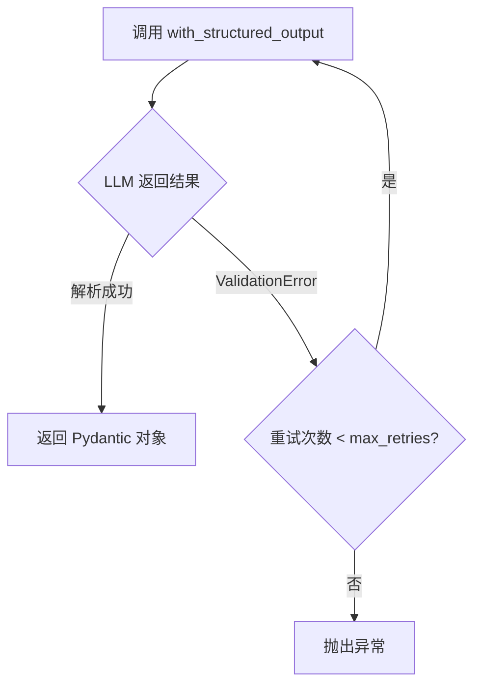
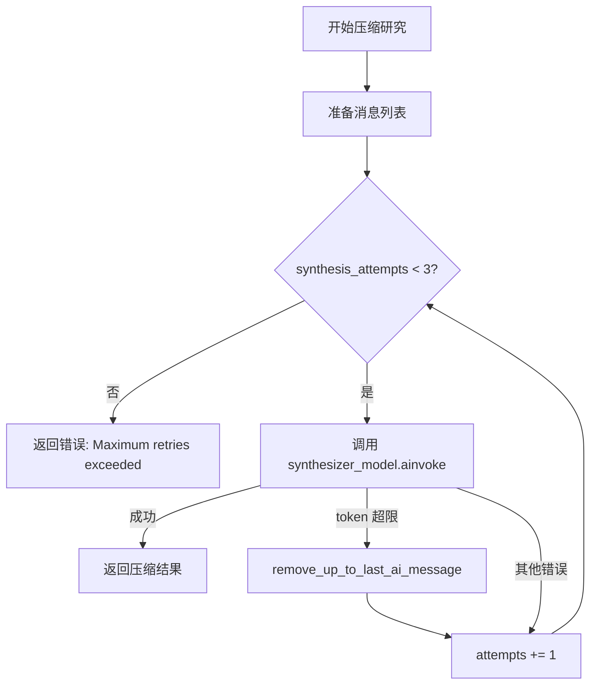
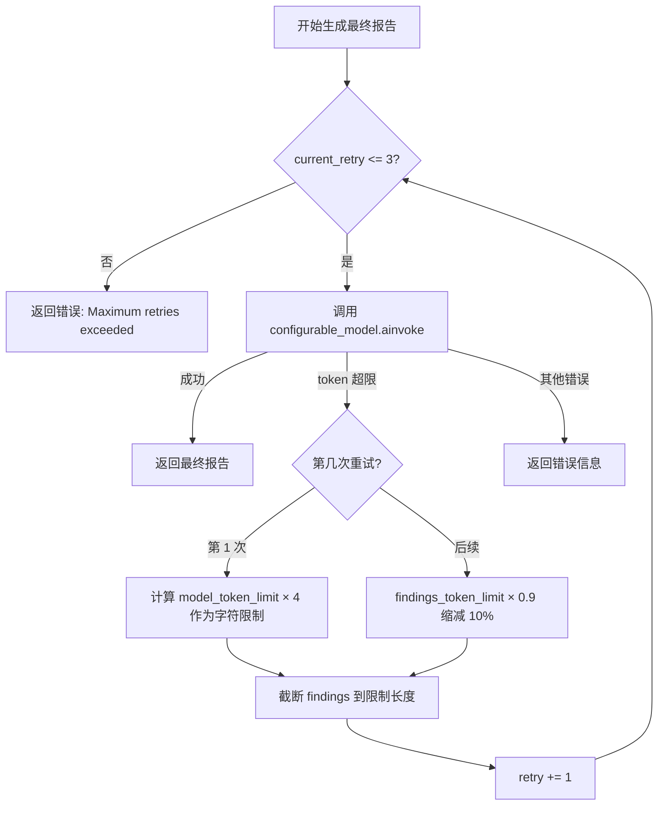

# PD-03.07 Open Deep Research — 多层级渐进容错与 Token 超限自愈

> 文档编号：PD-03.07
> 来源：Open Deep Research `src/open_deep_research/deep_researcher.py`, `src/open_deep_research/utils.py`
> GitHub：https://github.com/langchain-ai/open_deep_research.git
> 问题域：PD-03 容错与重试 Fault Tolerance & Retry
> 状态：可复用方案

---

## 第 1 章 问题与动机

### 1.1 核心问题

在多层级 Agent 研究系统中，LLM 调用失败是常态而非异常。Open Deep Research 面临的核心容错挑战包括：

1. **结构化输出解析失败**：LLM 返回的 JSON/Pydantic 结构不符合预期 schema，导致 `with_structured_output` 抛出 ValidationError
2. **Token 上下文超限**：研究过程中累积的消息（搜索结果、工具输出、AI 回复）不断增长，最终超过模型的 context window
3. **工具执行异常**：外部搜索 API（Tavily）、MCP 工具调用可能因网络超时、速率限制、认证失败等原因抛出异常
4. **最终报告生成溢出**：所有研究发现汇总后的 findings 文本可能超过报告生成模型的 token 限制
5. **并发子 Agent 失败**：多个 researcher 并行执行时，单个失败不应导致整个研究流程崩溃

这些问题的严重性在于：Open Deep Research 是一个多层嵌套的 LangGraph 系统（主图 → supervisor 子图 → researcher 子图），任何一层的未处理异常都会向上冒泡，导致整个研究任务失败。

### 1.2 Open Deep Research 的解法概述

该项目采用**四层容错架构**，每层针对不同类型的失败：

1. **LangChain `with_retry` 层**：所有 `with_structured_output` 调用都链式附加 `.with_retry(stop_after_attempt=N)`，自动重试结构化输出解析失败（`deep_researcher.py:92`、`deep_researcher.py:145`、`deep_researcher.py:208`、`deep_researcher.py:409`）
2. **手动 while 循环重试 + 渐进截断层**：`compress_research` 和 `final_report_generation` 使用手动 while 循环，在 token 超限时渐进移除/截断消息内容（`deep_researcher.py:544`、`deep_researcher.py:639`）
3. **工具安全包裹层**：`execute_tool_safely` 捕获所有工具调用异常，返回错误字符串而非抛出异常（`deep_researcher.py:427-432`）
4. **多 Provider token 超限检测层**：`is_token_limit_exceeded` 统一检测 OpenAI/Anthropic/Gemini 三种 Provider 的 token 超限错误格式（`utils.py:665-785`）

### 1.3 设计思想

| 设计原则 | 具体实现 | 理由 | 替代方案 |
|----------|----------|------|----------|
| 分层容错 | 4 层独立容错机制，每层处理不同类型失败 | 不同失败类型需要不同恢复策略，统一处理会丢失语义 | 全局 try-catch + 统一重试（丢失错误类型信息） |
| 渐进降级 | token 超限时逐步截断内容而非直接失败 | 保留尽可能多的研究成果，避免全部丢失 | 直接返回错误（浪费已完成的研究） |
| 错误字符串化 | 工具失败返回错误描述字符串，不中断 Agent 循环 | LLM 可以理解错误描述并调整策略 | 抛出异常中断流程（LLM 无法自适应） |
| 多 Provider 兼容 | 按 Provider 分类检测 token 超限错误 | 不同 Provider 的错误格式完全不同 | 通用字符串匹配（误判率高） |
| 可配置重试次数 | `max_structured_output_retries` 通过 Configuration 暴露 | 不同模型的结构化输出稳定性不同 | 硬编码重试次数（无法适配不同模型） |

---

## 第 2 章 源码实现分析

### 2.1 架构概览

Open Deep Research 的容错机制分布在三层子图中，每层有独立的容错策略：

```
┌─────────────────────────────────────────────────────────────────┐
│                    Main Deep Researcher Graph                    │
│                                                                  │
│  clarify_with_user ──→ write_research_brief ──→ research_supervisor ──→ final_report_generation │
│  [with_retry]          [with_retry]              │                    [while + 渐进截断]        │
│                                                  │                                              │
│  ┌───────────────────────────────────────────────┤                                              │
│  │         Supervisor Subgraph                   │                                              │
│  │  supervisor ──→ supervisor_tools              │                                              │
│  │  [with_retry]   [try-catch → 优雅终止]        │                                              │
│  │                  │                            │                                              │
│  │  ┌───────────────┤ asyncio.gather             │                                              │
│  │  │  Researcher Subgraph ×N (并行)             │                                              │
│  │  │  researcher ──→ researcher_tools ──→ compress_research                                    │
│  │  │  [with_retry]   [execute_tool_safely]  [while + 消息截断]                                 │
│  │  └────────────────────────────────────────────┘                                              │
│  └───────────────────────────────────────────────────────────────────────────────────────────────┘
```

容错层级关系：
- **第 1 层（自动重试）**：LangChain 内置 `with_retry`，处理结构化输出解析失败
- **第 2 层（安全包裹）**：`execute_tool_safely`，处理工具执行异常
- **第 3 层（渐进截断）**：手动 while 循环 + `remove_up_to_last_ai_message` / 字符截断
- **第 4 层（优雅终止）**：supervisor_tools 的 try-catch，token 超限时优雅结束研究阶段

### 2.2 核心实现

#### 2.2.1 LangChain with_retry 链式容错



对应源码 `src/open_deep_research/deep_researcher.py:89-94`：

```python
# Configure model with structured output and retry logic
clarification_model = (
    configurable_model
    .with_structured_output(ClarifyWithUser)
    .with_retry(stop_after_attempt=configurable.max_structured_output_retries)
    .with_config(model_config)
)
```

该模式在项目中被统一应用于所有结构化输出调用点：
- `clarify_with_user`（`deep_researcher.py:89-94`）：用户澄清分析
- `write_research_brief`（`deep_researcher.py:142-147`）：研究简报生成
- `supervisor`（`deep_researcher.py:205-210`）：supervisor 工具调用
- `researcher`（`deep_researcher.py:406-411`）：researcher 工具调用
- `tavily_search` 中的摘要模型（`utils.py:91-93`）：搜索结果摘要

重试次数通过 `Configuration.max_structured_output_retries`（默认值 3）统一配置（`configuration.py:42-53`）。

#### 2.2.2 compress_research 渐进消息截断



对应源码 `src/open_deep_research/deep_researcher.py:541-585`：

```python
# Step 3: Attempt compression with retry logic for token limit issues
synthesis_attempts = 0
max_attempts = 3

while synthesis_attempts < max_attempts:
    try:
        # Create system prompt focused on compression task
        compression_prompt = compress_research_system_prompt.format(date=get_today_str())
        messages = [SystemMessage(content=compression_prompt)] + researcher_messages
        
        # Execute compression
        response = await synthesizer_model.ainvoke(messages)
        
        # Extract raw notes from all tool and AI messages
        raw_notes_content = "\n".join([
            str(message.content) 
            for message in filter_messages(researcher_messages, include_types=["tool", "ai"])
        ])
        
        # Return successful compression result
        return {
            "compressed_research": str(response.content),
            "raw_notes": [raw_notes_content]
        }
        
    except Exception as e:
        synthesis_attempts += 1
        
        # Handle token limit exceeded by removing older messages
        if is_token_limit_exceeded(e, configurable.research_model):
            researcher_messages = remove_up_to_last_ai_message(researcher_messages)
            continue
        
        # For other errors, continue retrying
        continue

# Step 4: Return error result if all attempts failed
return {
    "compressed_research": "Error synthesizing research report: Maximum retries exceeded",
    "raw_notes": [raw_notes_content]
}
```

关键设计：token 超限时调用 `remove_up_to_last_ai_message`（`utils.py:848-866`）从消息列表末尾向前查找最后一条 AIMessage，截断到该位置之前。这样每次重试都移除最近一轮对话，逐步缩小上下文直到模型能处理。

#### 2.2.3 final_report_generation 渐进字符截断



对应源码 `src/open_deep_research/deep_researcher.py:635-697`：

```python
# Step 3: Attempt report generation with token limit retry logic
max_retries = 3
current_retry = 0
findings_token_limit = None

while current_retry <= max_retries:
    try:
        final_report_prompt = final_report_generation_prompt.format(
            research_brief=state.get("research_brief", ""),
            messages=get_buffer_string(state.get("messages", [])),
            findings=findings,
            date=get_today_str()
        )
        
        final_report = await configurable_model.with_config(writer_model_config).ainvoke([
            HumanMessage(content=final_report_prompt)
        ])
        
        return {
            "final_report": final_report.content, 
            "messages": [final_report],
            **cleared_state
        }
        
    except Exception as e:
        if is_token_limit_exceeded(e, configurable.final_report_model):
            current_retry += 1
            
            if current_retry == 1:
                model_token_limit = get_model_token_limit(configurable.final_report_model)
                if not model_token_limit:
                    return {
                        "final_report": f"Error generating final report: Token limit exceeded...",
                        "messages": [AIMessage(content="Report generation failed due to token limits")],
                        **cleared_state
                    }
                findings_token_limit = model_token_limit * 4
            else:
                findings_token_limit = int(findings_token_limit * 0.9)
            
            findings = findings[:findings_token_limit]
            continue
        else:
            return {
                "final_report": f"Error generating final report: {e}",
                "messages": [AIMessage(content="Report generation failed due to an error")],
                **cleared_state
            }
```

关键设计点：
- 首次重试时用 `model_token_limit × 4` 估算字符限制（1 token ≈ 4 字符）
- 后续每次缩减 10%（`× 0.9`），这是一个保守的收缩比例，避免过度丢失信息
- 如果模型不在 `MODEL_TOKEN_LIMITS` 映射表中，直接返回错误而非盲目截断

### 2.3 实现细节

#### 2.3.1 execute_tool_safely — 工具安全包裹

`src/open_deep_research/deep_researcher.py:427-432`：

```python
async def execute_tool_safely(tool, args, config):
    """Safely execute a tool with error handling."""
    try:
        return await tool.ainvoke(args, config)
    except Exception as e:
        return f"Error executing tool: {str(e)}"
```

这个函数虽然简短，但设计意图明确：将异常转化为错误字符串，让 LLM 在下一轮对话中看到错误描述并自行决定如何处理（重试、换工具、或放弃）。所有 researcher 的工具调用都通过此函数执行（`deep_researcher.py:475-479`）。

#### 2.3.2 多 Provider Token 超限检测

`src/open_deep_research/utils.py:665-785` 实现了三个 Provider 的 token 超限检测：

```
is_token_limit_exceeded(exception, model_name)
    ├── 从 model_name 推断 provider（openai:/anthropic:/google:）
    ├── _check_openai_token_limit：检查 BadRequestError + token/context/length 关键词
    ├── _check_anthropic_token_limit：检查 BadRequestError + "prompt is too long"
    └── _check_gemini_token_limit：检查 ResourceExhausted 异常类型
```

如果无法从 model_name 推断 provider，则依次检查所有三种 Provider 的模式（`utils.py:697-701`）。

#### 2.3.3 supervisor_tools 的优雅终止

`src/open_deep_research/deep_researcher.py:332-342`：当并行 researcher 执行失败时，supervisor_tools 不是抛出异常，而是优雅地结束研究阶段，将已收集的 notes 返回：

```python
except Exception as e:
    if is_token_limit_exceeded(e, configurable.research_model) or True:
        return Command(
            goto=END,
            update={
                "notes": get_notes_from_tool_calls(supervisor_messages),
                "research_brief": state.get("research_brief", "")
            }
        )
```

注意 `or True` — 这意味着**任何异常**都会触发优雅终止，不仅仅是 token 超限。这是一个防御性设计：宁可用不完整的研究结果生成报告，也不让整个流程崩溃。

#### 2.3.4 summarize_webpage 超时保护

`src/open_deep_research/utils.py:185-213`：网页摘要使用 `asyncio.wait_for` 设置 60 秒超时，超时后返回原始内容而非失败：

```python
summary = await asyncio.wait_for(
    model.ainvoke([HumanMessage(content=prompt_content)]),
    timeout=60.0
)
```

#### 2.3.5 并发溢出保护

`src/open_deep_research/deep_researcher.py:291-321`：当 LLM 生成的 ConductResearch 调用数超过 `max_concurrent_research_units` 时，超出部分返回错误消息而非执行：

```python
allowed_conduct_research_calls = conduct_research_calls[:configurable.max_concurrent_research_units]
overflow_conduct_research_calls = conduct_research_calls[configurable.max_concurrent_research_units:]

# Handle overflow research calls with error messages
for overflow_call in overflow_conduct_research_calls:
    all_tool_messages.append(ToolMessage(
        content=f"Error: Did not run this research as you have already exceeded the maximum number of concurrent research units.",
        name="ConductResearch",
        tool_call_id=overflow_call["id"]
    ))
```


---

## 第 3 章 迁移指南

### 3.1 迁移清单

**阶段 1：基础容错（1-2 个文件）**
- [ ] 实现 `is_token_limit_exceeded` 多 Provider 检测函数
- [ ] 实现 `get_model_token_limit` 模型 token 限制映射表
- [ ] 为所有 `with_structured_output` 调用添加 `.with_retry(stop_after_attempt=N)`

**阶段 2：渐进截断（核心能力）**
- [ ] 实现 `remove_up_to_last_ai_message` 消息截断函数
- [ ] 在 LLM 压缩/摘要节点中添加 while 循环 + 渐进截断逻辑
- [ ] 在最终输出生成节点中添加字符级渐进截断（`model_limit × 4` 估算 + `× 0.9` 缩减）

**阶段 3：工具安全与并发保护**
- [ ] 实现 `execute_tool_safely` 包裹所有外部工具调用
- [ ] 添加并发溢出保护（限制最大并行数，超出部分返回错误消息）
- [ ] 为网页摘要等耗时操作添加 `asyncio.wait_for` 超时保护

**阶段 4：优雅终止**
- [ ] 在 supervisor/orchestrator 层添加 try-catch，异常时优雅结束并返回已有结果
- [ ] 确保所有失败路径都返回有意义的错误消息（而非空值或未处理异常）

### 3.2 适配代码模板

#### 模板 1：多 Provider Token 超限检测

```python
"""Multi-provider token limit detection utility."""

from typing import Optional

# Token limits for known models (update as needed)
MODEL_TOKEN_LIMITS: dict[str, int] = {
    "openai:gpt-4o": 128000,
    "openai:gpt-4.1": 1047576,
    "anthropic:claude-sonnet-4": 200000,
    "google:gemini-1.5-pro": 2097152,
}

def is_token_limit_exceeded(exception: Exception, model_name: str = "") -> bool:
    """Detect token limit exceeded across OpenAI, Anthropic, and Gemini providers."""
    error_str = str(exception).lower()
    class_name = exception.__class__.__name__
    module_name = getattr(exception.__class__, '__module__', '').lower()
    
    # OpenAI: BadRequestError with token/context keywords
    if 'openai' in module_name and class_name in ('BadRequestError', 'InvalidRequestError'):
        if any(kw in error_str for kw in ('token', 'context', 'length', 'reduce')):
            return True
    
    # Anthropic: BadRequestError with "prompt is too long"
    if 'anthropic' in module_name and class_name == 'BadRequestError':
        if 'prompt is too long' in error_str:
            return True
    
    # Gemini: ResourceExhausted
    if 'google' in module_name and class_name in ('ResourceExhausted', 'GoogleGenerativeAIFetchError'):
        return True
    
    return False

def get_model_token_limit(model_name: str) -> Optional[int]:
    """Look up token limit for a model. Returns None if unknown."""
    for key, limit in MODEL_TOKEN_LIMITS.items():
        if key in model_name:
            return limit
    return None
```

#### 模板 2：渐进截断重试循环

```python
"""Progressive truncation retry pattern for LLM calls."""

import asyncio
from typing import Any

async def invoke_with_progressive_truncation(
    model: Any,
    build_prompt: callable,
    content: str,
    model_name: str,
    max_retries: int = 3,
    shrink_ratio: float = 0.9,
) -> str:
    """Invoke LLM with progressive content truncation on token limit errors.
    
    Args:
        model: LangChain chat model instance
        build_prompt: Function that takes content string and returns message list
        content: The variable-length content to include in prompt
        model_name: Model identifier for token limit lookup
        max_retries: Maximum number of truncation retries
        shrink_ratio: Ratio to shrink content by on each retry (0.9 = keep 90%)
    
    Returns:
        Model response content string
    
    Raises:
        RuntimeError: If all retries exhausted or unknown model token limit
    """
    current_retry = 0
    char_limit = None
    current_content = content
    
    while current_retry <= max_retries:
        try:
            messages = build_prompt(current_content)
            response = await model.ainvoke(messages)
            return response.content
        except Exception as e:
            if not is_token_limit_exceeded(e, model_name):
                raise
            
            current_retry += 1
            if char_limit is None:
                token_limit = get_model_token_limit(model_name)
                if not token_limit:
                    raise RuntimeError(
                        f"Token limit exceeded but model '{model_name}' not in lookup table"
                    ) from e
                char_limit = token_limit * 4  # 1 token ≈ 4 chars
            else:
                char_limit = int(char_limit * shrink_ratio)
            
            current_content = content[:char_limit]
    
    raise RuntimeError(f"Max retries ({max_retries}) exhausted for token limit truncation")
```

#### 模板 3：工具安全执行包裹

```python
"""Safe tool execution wrapper for LangGraph agent tools."""

import asyncio
from typing import Any

async def execute_tool_safely(
    tool: Any,
    args: dict,
    config: Any = None,
    timeout: float = 60.0,
) -> str:
    """Execute a tool with error handling and optional timeout.
    
    Returns error string instead of raising, allowing LLM to handle failures.
    """
    try:
        result = await asyncio.wait_for(
            tool.ainvoke(args, config),
            timeout=timeout,
        )
        return result
    except asyncio.TimeoutError:
        return f"Error: Tool '{getattr(tool, 'name', 'unknown')}' timed out after {timeout}s"
    except Exception as e:
        return f"Error executing tool '{getattr(tool, 'name', 'unknown')}': {str(e)}"
```

### 3.3 适用场景

| 场景 | 适用度 | 说明 |
|------|--------|------|
| 多层 LangGraph Agent 系统 | ⭐⭐⭐ | 直接适用，架构完全匹配 |
| 单层 ReAct Agent | ⭐⭐⭐ | execute_tool_safely + with_retry 即可覆盖 |
| 长文本生成（报告/论文） | ⭐⭐⭐ | 渐进截断模式非常适合 findings 汇总场景 |
| 多 Provider 切换系统 | ⭐⭐ | is_token_limit_exceeded 可直接复用，但缺少 Provider 切换逻辑 |
| 实时流式输出系统 | ⭐ | 渐进截断需要重试，与流式输出冲突 |

---

## 第 4 章 测试用例

```python
"""Tests for Open Deep Research fault tolerance patterns."""

import asyncio
import pytest
from unittest.mock import AsyncMock, MagicMock, patch


class TestIsTokenLimitExceeded:
    """Test multi-provider token limit detection."""
    
    def test_openai_bad_request_with_token_keyword(self):
        """OpenAI BadRequestError with 'token' keyword should be detected."""
        exc = type('BadRequestError', (Exception,), {
            '__module__': 'openai._exceptions'
        })("This model's maximum context length is 128000 tokens")
        assert is_token_limit_exceeded(exc, "openai:gpt-4o") is True
    
    def test_anthropic_prompt_too_long(self):
        """Anthropic BadRequestError with 'prompt is too long' should be detected."""
        exc = type('BadRequestError', (Exception,), {
            '__module__': 'anthropic._exceptions'
        })("prompt is too long: 250000 tokens > 200000 maximum")
        assert is_token_limit_exceeded(exc, "anthropic:claude-sonnet-4") is True
    
    def test_gemini_resource_exhausted(self):
        """Gemini ResourceExhausted should be detected."""
        exc = type('ResourceExhausted', (Exception,), {
            '__module__': 'google.api_core.exceptions'
        })("Resource exhausted")
        assert is_token_limit_exceeded(exc, "google:gemini-1.5-pro") is True
    
    def test_unrelated_error_not_detected(self):
        """Non-token-limit errors should not be detected."""
        exc = ValueError("Something else went wrong")
        assert is_token_limit_exceeded(exc, "openai:gpt-4o") is False
    
    def test_unknown_provider_checks_all(self):
        """Unknown provider should check all provider patterns."""
        exc = type('BadRequestError', (Exception,), {
            '__module__': 'openai._exceptions'
        })("maximum context length exceeded")
        assert is_token_limit_exceeded(exc, "custom:my-model") is True


class TestRemoveUpToLastAiMessage:
    """Test message truncation for token limit recovery."""
    
    def test_removes_up_to_last_ai_message(self):
        """Should truncate messages up to the last AIMessage."""
        messages = [
            MagicMock(spec_set=['content']),  # HumanMessage
            type('AIMessage', (), {})(),       # AIMessage at index 1
            MagicMock(spec_set=['content']),  # ToolMessage
            type('AIMessage', (), {})(),       # AIMessage at index 3
            MagicMock(spec_set=['content']),  # ToolMessage
        ]
        # Mock isinstance checks
        from langchain_core.messages import AIMessage
        result = remove_up_to_last_ai_message(messages)
        # Should return messages[:3] (up to but not including last AIMessage)
        assert len(result) < len(messages)
    
    def test_no_ai_messages_returns_original(self):
        """If no AIMessage found, return original list."""
        messages = [MagicMock(), MagicMock()]
        result = remove_up_to_last_ai_message(messages)
        assert result == messages


class TestExecuteToolSafely:
    """Test tool execution safety wrapper."""
    
    @pytest.mark.asyncio
    async def test_successful_execution(self):
        """Successful tool execution returns result."""
        tool = AsyncMock()
        tool.ainvoke.return_value = "search results"
        result = await execute_tool_safely(tool, {"query": "test"})
        assert result == "search results"
    
    @pytest.mark.asyncio
    async def test_exception_returns_error_string(self):
        """Failed tool execution returns error string instead of raising."""
        tool = AsyncMock()
        tool.ainvoke.side_effect = ConnectionError("Network timeout")
        tool.name = "tavily_search"
        result = await execute_tool_safely(tool, {"query": "test"})
        assert "Error" in result
        assert "Network timeout" in result
    
    @pytest.mark.asyncio
    async def test_timeout_returns_error_string(self):
        """Timed out tool execution returns timeout error string."""
        async def slow_tool(*args, **kwargs):
            await asyncio.sleep(10)
        
        tool = MagicMock()
        tool.ainvoke = slow_tool
        tool.name = "slow_search"
        result = await execute_tool_safely(tool, {}, timeout=0.1)
        assert "timed out" in result.lower()


class TestProgressiveTruncation:
    """Test progressive truncation retry pattern."""
    
    @pytest.mark.asyncio
    async def test_succeeds_after_truncation(self):
        """Should succeed after truncating content on token limit error."""
        model = AsyncMock()
        call_count = 0
        
        async def side_effect(messages):
            nonlocal call_count
            call_count += 1
            if call_count == 1:
                exc = type('BadRequestError', (Exception,), {
                    '__module__': 'openai._exceptions'
                })("maximum context length exceeded")
                raise exc
            return MagicMock(content="Generated report")
        
        model.ainvoke = side_effect
        
        result = await invoke_with_progressive_truncation(
            model=model,
            build_prompt=lambda c: [{"role": "user", "content": c}],
            content="x" * 1000000,
            model_name="openai:gpt-4o",
        )
        assert result == "Generated report"
        assert call_count == 2
    
    @pytest.mark.asyncio
    async def test_shrinks_by_ratio_each_retry(self):
        """Content should shrink by shrink_ratio on each retry."""
        captured_lengths = []
        model = AsyncMock()
        
        async def side_effect(messages):
            content = messages[0]["content"] if isinstance(messages[0], dict) else str(messages[0])
            captured_lengths.append(len(content))
            exc = type('BadRequestError', (Exception,), {
                '__module__': 'openai._exceptions'
            })("maximum context length exceeded")
            raise exc
        
        model.ainvoke = side_effect
        
        with pytest.raises(RuntimeError, match="Max retries"):
            await invoke_with_progressive_truncation(
                model=model,
                build_prompt=lambda c: [{"role": "user", "content": c}],
                content="x" * 1000000,
                model_name="openai:gpt-4o",
                max_retries=3,
                shrink_ratio=0.9,
            )
        
        # First call uses original content, subsequent calls should be progressively shorter
        assert len(captured_lengths) == 4  # initial + 3 retries
```


---

## 第 5 章 跨域关联

| 关联域 | 关系类型 | 说明 |
|--------|----------|------|
| PD-01 上下文管理 | 强依赖 | `remove_up_to_last_ai_message` 和渐进字符截断本质上是上下文压缩策略，token 超限容错与上下文管理密不可分 |
| PD-02 多 Agent 编排 | 协同 | supervisor_tools 的 `asyncio.gather` 并行执行 + 异常优雅终止，是多 Agent 编排中的容错关键 |
| PD-04 工具系统 | 协同 | `execute_tool_safely` 是工具系统的容错层，MCP 工具的 `wrap_mcp_authenticate_tool` 处理认证错误 |
| PD-08 搜索与检索 | 依赖 | Tavily 搜索的 `summarize_webpage` 有 60s 超时保护，搜索失败时返回原始内容降级 |
| PD-11 可观测性 | 协同 | 每次失败都通过 `logging.warning` 记录，但缺少结构化的失败指标收集（可改进点） |

---

## 第 6 章 来源文件索引

| 文件 | 行范围 | 关键实现 |
|------|--------|----------|
| `src/open_deep_research/deep_researcher.py` | L89-94 | clarify_with_user 的 with_retry 链式容错 |
| `src/open_deep_research/deep_researcher.py` | L142-147 | write_research_brief 的 with_retry |
| `src/open_deep_research/deep_researcher.py` | L205-210 | supervisor 的 with_retry |
| `src/open_deep_research/deep_researcher.py` | L289-342 | supervisor_tools 并发执行 + 异常优雅终止 |
| `src/open_deep_research/deep_researcher.py` | L406-411 | researcher 的 with_retry |
| `src/open_deep_research/deep_researcher.py` | L427-432 | execute_tool_safely 工具安全包裹 |
| `src/open_deep_research/deep_researcher.py` | L541-585 | compress_research 渐进消息截断重试 |
| `src/open_deep_research/deep_researcher.py` | L635-697 | final_report_generation 渐进字符截断重试 |
| `src/open_deep_research/utils.py` | L91-93 | tavily_search 摘要模型的 with_retry |
| `src/open_deep_research/utils.py` | L185-213 | summarize_webpage 60s 超时保护 |
| `src/open_deep_research/utils.py` | L665-785 | is_token_limit_exceeded 多 Provider 检测 |
| `src/open_deep_research/utils.py` | L788-846 | MODEL_TOKEN_LIMITS 映射表 + get_model_token_limit |
| `src/open_deep_research/utils.py` | L848-866 | remove_up_to_last_ai_message 消息截断 |
| `src/open_deep_research/configuration.py` | L42-53 | max_structured_output_retries 配置（默认 3） |
| `src/open_deep_research/configuration.py` | L64-76 | max_concurrent_research_units 配置（默认 5） |

---

## 第 7 章 横向对比维度

> **重要：** 本章用于自动填充 Butcher Wiki 的横向对比表。
> 必须严格按以下 JSON 格式输出，放在 `comparison_data` 代码块中。

```json comparison_data
{
  "project": "OpenDeepResearch",
  "dimensions": {
    "截断/错误检测": "is_token_limit_exceeded 按 Provider 分类检测 OpenAI/Anthropic/Gemini 三种错误格式",
    "重试/恢复策略": "四层容错：with_retry 自动重试 + while 渐进截断 + 工具安全包裹 + 优雅终止",
    "超时保护": "summarize_webpage 使用 asyncio.wait_for 60s 超时，超时返回原始内容",
    "优雅降级": "compress_research 失败返回错误字符串，supervisor_tools 异常时优雅结束返回已有 notes",
    "重试策略": "结构化输出用 with_retry(stop_after_attempt=3)，压缩/报告用 while 循环最多 3 次",
    "降级方案": "工具失败返回错误字符串让 LLM 自适应，token 超限渐进截断保留最多内容",
    "错误分类": "区分 token 超限（渐进截断）vs 其他错误（直接重试或返回错误）",
    "并发容错": "asyncio.gather 并行执行 researcher，单个失败触发 supervisor 优雅终止",
    "输出验证": "with_structured_output + with_retry 自动验证 Pydantic schema 并重试",
    "渐进截断收缩比": "final_report 每次缩减 10%（×0.9），compress_research 按 AIMessage 边界截断",
    "可配置重试参数": "max_structured_output_retries 通过 Configuration 暴露，支持 UI 调整（1-10）"
  }
}
```

### 域元数据补充

```json domain_metadata
{
  "solution_summary": "Open Deep Research 用四层容错架构（with_retry + while 渐进截断 + execute_tool_safely + supervisor 优雅终止）处理多层 LangGraph 子图中的结构化输出失败和 token 超限",
  "description": "多层嵌套 Agent 系统中每层需要独立的容错策略，统一处理会丢失错误语义",
  "sub_problems": [
    "渐进截断的两种粒度选择：按消息边界截断（compress_research）vs 按字符截断（final_report），适用场景不同",
    "多 Provider 异构异常类型检测：同一语义错误在 OpenAI/Anthropic/Gemini 中的异常类名和消息格式完全不同",
    "并行子 Agent 全部失败时的兜底：asyncio.gather 的异常传播需要在外层 try-catch 中统一处理",
    "模型 token 限制映射表维护：新模型发布后映射表过期导致无法计算截断阈值"
  ],
  "best_practices": [
    "工具失败返回错误字符串而非抛出异常，让 LLM 在下一轮自行决定恢复策略",
    "渐进截断优于一次性大幅截断：0.9 收缩比保守但避免信息过度丢失",
    "结构化输出重试次数应可配置：不同模型的 schema 遵从度差异大",
    "supervisor 层的 catch-all 优雅终止：宁可用不完整结果生成报告也不让流程崩溃"
  ]
}
```

