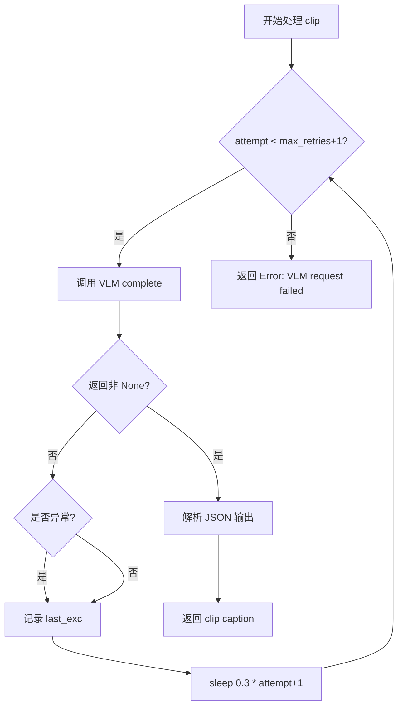
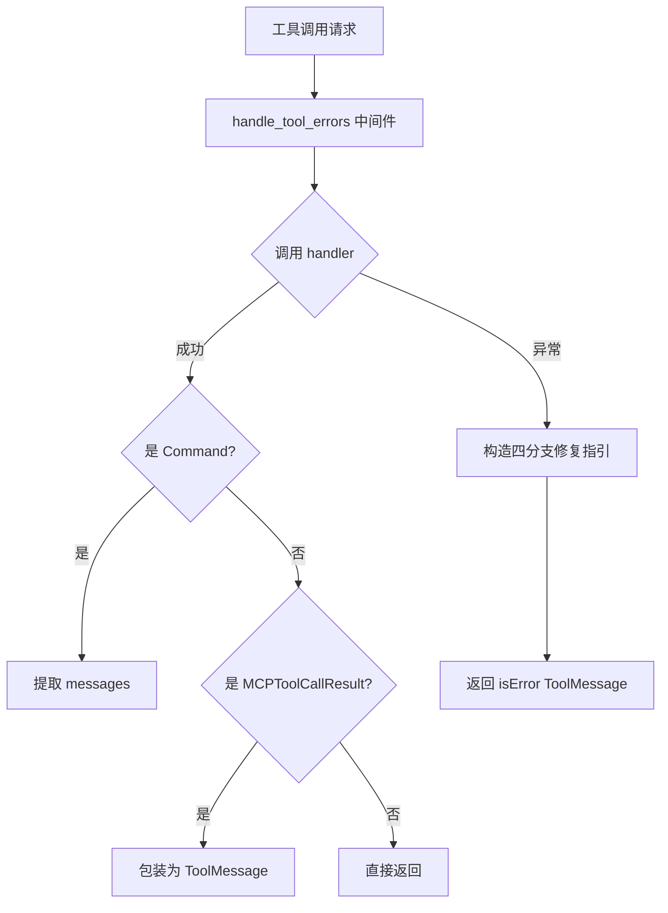
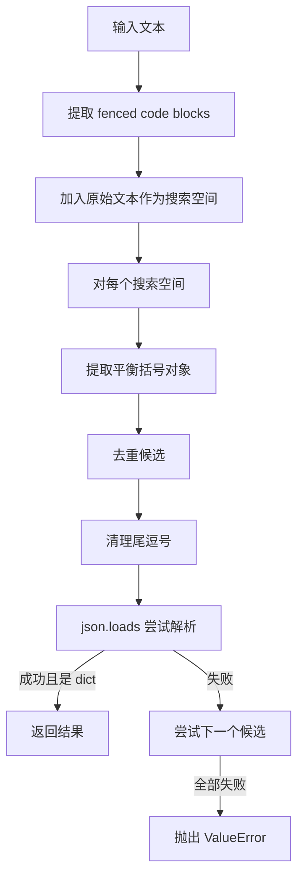
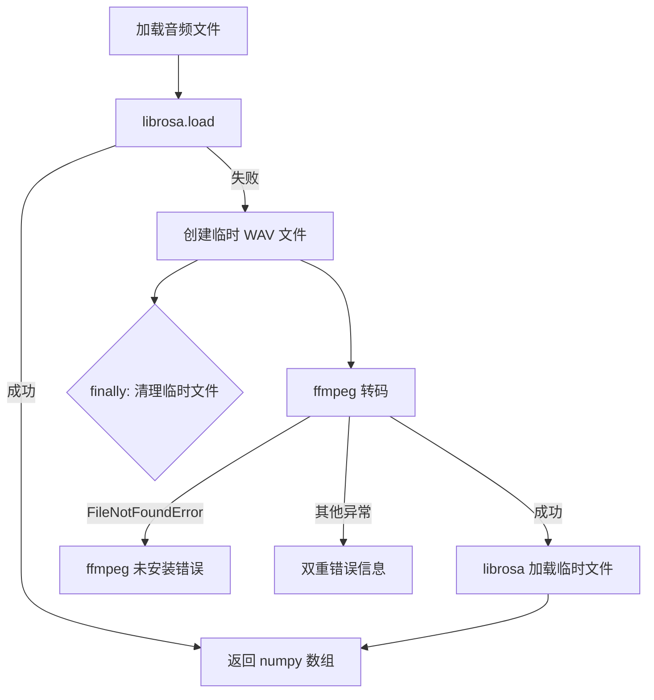

# PD-03.OS OpenStoryline — 三层容错与 LLM 引导式自修复

> 文档编号：PD-03.OS
> 来源：OpenStoryline `src/open_storyline/nodes/core_nodes/understand_clips.py`, `src/open_storyline/mcp/hooks/chat_middleware.py`, `config.toml`
> GitHub：https://github.com/FireRedTeam/FireRed-OpenStoryline.git
> 问题域：PD-03 容错与重试 Fault Tolerance & Retry
> 状态：可复用方案

---

## 第 1 章 问题与动机

### 1.1 核心问题

OpenStoryline 是一个视频故事线自动生成系统，其工作流涉及多个 LLM/VLM 调用节点（视频理解、BGM 选择、脚本生成、配音等），每个节点都可能因以下原因失败：

- **VLM 请求失败**：视觉语言模型处理视频帧时超时或返回空响应
- **LLM 输出格式错误**：模型返回的 JSON 无法解析（尾逗号、非标准引号、缺少闭合括号）
- **外部依赖不可用**：音频加载库 librosa 无法处理特定格式，ffmpeg 未安装
- **节点依赖缺失**：当前节点的前置节点未执行，缺少输入数据
- **MCP 工具调用异常**：工具参数错误、依赖节点未就绪、偶发性网络错误

这些失败如果不处理，会导致整个视频生成流水线崩溃。OpenStoryline 的核心设计思想是：**每一层都有自己的容错策略，从配置层到节点层到中间件层，形成三层防御纵深**。

### 1.2 OpenStoryline 的解法概述

1. **配置层容错**：`config.toml` 中为 LLM/VLM 分别配置 `max_retries=2` 和 `timeout`，由 ChatOpenAI SDK 自动处理传输层重试（`config.py:101,110`）
2. **节点层容错**：每个节点实现 `default_process()` 降级方法，当 VLM 不可用或 mode 非 auto 时返回安全默认值；`understand_clips` 节点内置手动重试循环 + 线性退避（`understand_clips.py:117-139`）
3. **中间件层容错**：`handle_tool_errors` 中间件捕获所有工具调用异常，生成包含四分支修复指引的 ToolMessage，引导 LLM Agent 自主决定下一步（`chat_middleware.py:224-268`）
4. **JSON 解析容错**：`parse_json_dict` 实现多策略 JSON 提取——先尝试 fenced code block，再尝试平衡括号提取，最后清理尾逗号（`parse_json.py:146-200`）
5. **级联降级**：音频加载 librosa → ffmpeg fallback → 错误上报；BGM 选择解析失败 → 降级选第一个候选（`select_bgm.py:97-105, 170-217`）

### 1.3 设计思想

| 设计原则 | 具体实现 | 理由 | 替代方案 |
|----------|----------|------|----------|
| 双层重试分离 | SDK 层 max_retries 处理传输错误，节点层手动循环处理业务错误 | 传输层重试（429/5xx）和业务层重试（空响应/解析失败）的触发条件不同 | 统一用 tenacity 装饰器（但无法区分错误类型） |
| 抽象降级接口 | BaseNode 强制子类实现 `default_process()` | 每个节点的降级行为不同（返回空 BGM vs 返回 "no caption"），不能用通用降级 | 统一返回 None（但下游节点无法区分"跳过"和"失败"） |
| LLM 引导式自修复 | handle_tool_errors 返回四分支修复指引文本 | 让 Agent 自主判断错误类型并选择修复策略，比硬编码重试更灵活 | 自动重试 N 次（但无法处理参数错误等需要修改的情况） |
| 多策略 JSON 解析 | fenced block → balanced extraction → trailing comma strip | LLM 输出格式不可控，单一解析策略覆盖率不足 | 用 json_repair 库（但不处理 fenced block 包裹） |
| 外部工具级联降级 | librosa → ffmpeg → RuntimeError | 不同环境的音频解码能力不同，优先用纯 Python 方案 | 只用 ffmpeg（但增加外部依赖） |

---

## 第 2 章 源码实现分析

### 2.1 架构概览

OpenStoryline 的容错体系分为三层，从外到内依次是：

```
┌─────────────────────────────────────────────────────────────┐
│                    Layer 3: 中间件层                          │
│  handle_tool_errors → 捕获异常 → 四分支修复指引 → Agent 自决   │
├─────────────────────────────────────────────────────────────┤
│                    Layer 2: 节点层                            │
│  default_process() 降级 │ 手动重试循环 │ JSON 多策略解析       │
├─────────────────────────────────────────────────────────────┤
│                    Layer 1: 配置/SDK 层                       │
│  max_retries=2 │ timeout=30s │ ChatOpenAI 内置传输层重试       │
└─────────────────────────────────────────────────────────────┘
```

调用链路：Agent → `handle_tool_errors` 中间件 → `log_tool_request` 中间件 → `ToolInterceptor.inject_media_content_before` → `BaseNode.__call__` → `process()` / `default_process()` → LLM SDK（内置 max_retries）

### 2.2 核心实现

#### 2.2.1 节点层：VLM 重试循环 + 线性退避



对应源码 `src/open_storyline/nodes/core_nodes/understand_clips.py:117-159`：

```python
max_retries = 2
raw = None
last_exc: Exception | None = None

for attempt in range(max_retries + 1):
    try:
        raw = await llm.complete(
            system_prompt=system_prompt,
            user_prompt=user_prompt,
            media=media,
            temperature=0.3,
            top_p=0.9,
            max_tokens=2048,
            model_preferences=None,
        )
        if raw is not None:
            last_exc = None
            break
    except Exception as e:
        last_exc = e

    if attempt < max_retries:
        await asyncio.sleep(0.3 * (attempt + 1))

if raw is None:
    out_item["caption"] = "Error: VLM request failed"
    # ... aes_score 降级赋值 -1.0 ...
    node_state.node_summary.add_error(repr(last_exc))
    clip_captions.append(out_item)
    continue
```

关键设计点：
- **线性退避**（0.3s, 0.6s, 0.9s）而非指数退避，因为 VLM 调用本身较慢，不需要长等待
- **None 检测**：VLM 可能返回 None 而非抛异常（空响应），需要额外判断
- **逐 clip 隔离**：单个 clip 失败不影响其他 clip 的处理，用 `continue` 跳过

#### 2.2.2 中间件层：LLM 引导式自修复



对应源码 `src/open_storyline/mcp/hooks/chat_middleware.py:224-268`：

```python
@wrap_tool_call
async def handle_tool_errors(request, handler):
    try:
        out = await handler(request)

        if isinstance(out, Command):
            return out.update.get('messages')[0]

        elif isinstance(out, MCPToolCallResult) and not isinstance(out.content, str):
            return ToolMessage(
                content=out.content[0].get("text", ""),
                tool_call_id=out.tool_call_id,
                name=out.name,
                additional_kwargs={
                    "isError": False,
                    "mcp_raw_text": True,
                },
            )
        return out

    except Exception as e:
        tc = request.tool_call
        safe_args = _mask_secrets(tc.get("args") or {})
        tool_name = tc.get("name", "")

        return ToolMessage(
            content=(
                "Tool call failed\n"
                f"Tool name: {tool_name}\n"
                f"Tool params: {safe_args}\n"
                f"Error messege: {type(e).__name__}: {e}\n"
                "If it is a parameter issue, please correct the parameters and call again. "
                "If it is due to the lack of a preceding dependency, please call the preceding node first. "
                "If you think it's an occasional error, please try to call it again; "
                "If you think it's impossible to continue, please explain the reason to the user."
            ),
            tool_call_id=tc["id"],
            name=tool_name,
            additional_kwargs={
                "isError": True,
                "error_type": type(e).__name__,
                "error_message": str(e),
                "safe_args": safe_args,
            },
        )
```

四分支修复指引的设计：
1. **参数错误** → "correct the parameters and call again"
2. **依赖缺失** → "call the preceding node first"
3. **偶发错误** → "try to call it again"
4. **不可恢复** → "explain the reason to the user"

这种设计将错误分类的决策权交给 LLM Agent，而非硬编码规则。

### 2.3 实现细节

#### 2.3.1 多策略 JSON 解析

`parse_json_dict`（`src/open_storyline/utils/parse_json.py:146-200`）的解析策略链：



关键技巧：
- `_strip_trailing_commas` 支持多轮清理（最多 10 轮），处理嵌套尾逗号
- `_extract_balanced_object` 正确跳过字符串内的花括号，避免误匹配
- BOM 字符（`\ufeff`）自动剥离

#### 2.3.2 音频加载级联降级

`SelectBGMNode._load_audio_mono`（`src/open_storyline/nodes/core_nodes/select_bgm.py:170-217`）：



#### 2.3.3 BaseNode 模式感知错误报告

`BaseNode.__call__`（`src/open_storyline/nodes/core_nodes/base_node.py:206-245`）根据 `developer_mode` 切换错误详情级别：

- **开发模式**：返回完整 traceback（含文件路径和行号）
- **生产模式**：返回 `node_summary` 摘要（用户友好的错误描述）

#### 2.3.4 递归依赖补全

`ToolInterceptor.inject_media_content_before`（`src/open_storyline/mcp/hooks/node_interceptors.py:112-228`）在节点执行前检查依赖，缺失时递归执行前置节点：

- 对每个缺失的 `kind`，尝试所有候选节点（按 priority 排序）
- 单个候选失败时 `continue` 尝试下一个
- 所有候选都失败时抛出 `ToolException`
- 递归深度通过 `depth` 参数追踪（用于日志缩进）

#### 2.3.5 采样回调参数降级

`sampling_handler.py:398-414` 中模型参数绑定的两级降级：

```python
try:
    bound = bound.bind(temperature=temperature, max_tokens=max_tokens, top_p=top_p)
except Exception:
    bound = bound.bind(temperature=temperature, max_tokens=max_tokens)
# ... 如果还失败 ...
except TypeError:
    bound2 = model.bind(temperature=temperature)
```

三级降级：全参数 → 去掉 top_p → 只保留 temperature。

