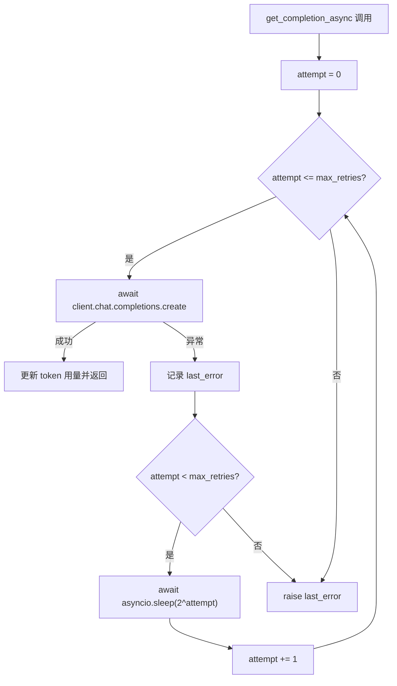
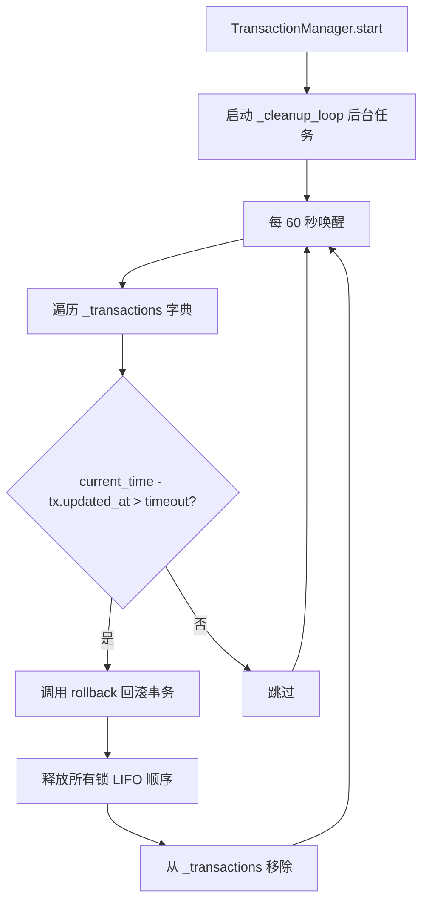

# PD-03.OV OpenViking — VLM 指数退避重试与事务超时自动回滚

> 文档编号：PD-03.OV
> 来源：OpenViking `openviking/models/vlm/backends/openai_vlm.py`, `openviking/storage/transaction/transaction_manager.py`
> GitHub：https://github.com/volcengine/OpenViking.git
> 问题域：PD-03 容错与重试 Fault Tolerance & Retry
> 状态：可复用方案

---

## 第 1 章 问题与动机

### 1.1 核心问题

OpenViking 是字节跳动火山引擎的开源知识管理系统，核心依赖两类外部不可靠资源：

1. **VLM/LLM API 调用**：多 Provider（OpenAI、VolcEngine、LiteLLM 11+ 供应商）的异步补全请求可能因网络超时、速率限制、服务不可用而失败
2. **分布式文件系统事务**：基于 AGFS（Agent File System）的资源操作需要路径锁和事务保证，进程崩溃或超时可能导致锁泄漏和数据不一致

这两个问题域的容错需求截然不同：VLM 调用需要快速重试恢复，事务系统需要超时检测 + 自动回滚 + 锁清理。

### 1.2 OpenViking 的解法概述

1. **统一的指数退避重试模式**：所有 VLM 后端（OpenAI/VolcEngine/LiteLLM）在 `get_completion_async` 中实现相同的 `2^attempt` 秒延迟重试循环，通过 `max_retries` 参数控制上限（`openai_vlm.py:82-95`）
2. **7 态事务状态机**：TransactionRecord 定义 INIT→AQUIRE→EXEC→COMMIT/FAIL→RELEASING→RELEASED 完整生命周期（`transaction_record.py:17-28`）
3. **后台超时清理循环**：TransactionManager 启动 asyncio 后台任务，每 60 秒扫描超时事务并自动回滚（`transaction_manager.py:104-126`）
4. **路径锁死锁预防**：PathLock 采用"先检查父目录锁→创建锁→再验证父目录锁→确认锁所有权"的 4 步协议防止竞态（`path_lock.py:129-194`）
5. **LIFO 锁释放顺序**：事务回滚时按逆序释放锁，避免释放顺序不当导致的中间状态暴露（`path_lock.py:320-331`）

### 1.3 设计思想

| 设计原则 | 具体实现 | 理由 | 替代方案 |
|----------|----------|------|----------|
| 重试与业务解耦 | 重试循环内嵌在每个 VLM 后端的 async 方法中 | 调用方无需关心重试逻辑，传入 max_retries 即可 | 装饰器模式（tenacity），但增加依赖 |
| 指数退避无抖动 | `await asyncio.sleep(2**attempt)` 纯指数 | 实现简单，适合单客户端场景 | 加随机抖动防止多客户端同步重试 |
| 事务超时兜底 | 后台 60s 轮询 + configurable timeout（默认 3600s） | 防止进程崩溃后锁永久泄漏 | 锁文件 TTL / 分布式锁服务 |
| 锁文件协议 | `.path.ovlock` 文件内容为 transaction_id | 无需额外锁服务，利用文件系统原子性 | Redis 分布式锁 / etcd lease |
| 单例事务管理器 | threading.Lock 保护的全局单例 | 确保同一进程内事务 ID 不冲突 | 依赖注入容器 |

---

## 第 2 章 源码实现分析

### 2.1 架构概览

OpenViking 的容错体系分为两个独立层：VLM 调用层的重试和存储事务层的回滚。

```
┌─────────────────────────────────────────────────────────┐
│                    VLM 调用层（重试）                      │
│  ┌──────────┐  ┌──────────────┐  ┌──────────────────┐   │
│  │ OpenAIVLM│  │VolcEngineVLM │  │ LiteLLMVLMProvider│   │
│  │ (继承)   │←─│ (继承 OpenAI)│  │ (独立实现)        │   │
│  └────┬─────┘  └──────┬───────┘  └────────┬──────────┘   │
│       │               │                   │              │
│       └───────────────┼───────────────────┘              │
│                       ▼                                  │
│          get_completion_async(max_retries)                │
│          for attempt in range(max_retries+1):            │
│              try: await client.create(...)                │
│              except: await sleep(2**attempt)              │
├─────────────────────────────────────────────────────────┤
│                  存储事务层（回滚）                        │
│  ┌──────────────────┐    ┌───────────┐    ┌──────────┐  │
│  │TransactionManager│───→│ PathLock  │───→│ AGFSClient│  │
│  │  (单例 + 后台清理) │    │(锁文件协议)│    │(文件系统) │  │
│  └────────┬─────────┘    └───────────┘    └──────────┘  │
│           │                                              │
│  ┌────────▼─────────┐    ┌───────────────────────┐      │
│  │TransactionRecord │    │TransactionObserver    │      │
│  │(7态状态机+锁列表) │    │(健康检查+悬挂检测)     │      │
│  └──────────────────┘    └───────────────────────┘      │
└─────────────────────────────────────────────────────────┘
```

### 2.2 核心实现

#### 2.2.1 VLM 指数退避重试



对应源码 `openviking/models/vlm/backends/openai_vlm.py:70-95`：

```python
async def get_completion_async(
    self, prompt: str, thinking: bool = False, max_retries: int = 0
) -> str:
    """Get text completion asynchronously"""
    client = self.get_async_client()
    kwargs = {
        "model": self.model or "gpt-4o-mini",
        "messages": [{"role": "user", "content": prompt}],
        "temperature": self.temperature,
    }

    last_error = None
    for attempt in range(max_retries + 1):
        try:
            response = await client.chat.completions.create(**kwargs)
            self._update_token_usage_from_response(response)
            return response.choices[0].message.content or ""
        except Exception as e:
            last_error = e
            if attempt < max_retries:
                await asyncio.sleep(2**attempt)

    if last_error:
        raise last_error
    else:
        raise RuntimeError("Unknown error in async completion")
```

关键设计点：
- `max_retries` 默认为 0（不重试），由上层 `VLMBase.max_retries`（配置默认 2）传入（`base.py:24`）
- 三个后端（OpenAI、VolcEngine、LiteLLM）完全复制相同的重试循环，VolcEngine 继承 OpenAI 但重写了此方法以添加 `thinking` 参数（`volcengine_vlm.py:76-102`）
- LiteLLM 后端通过 `litellm.drop_params = True` 全局配置自动丢弃不支持的参数（`litellm_vlm.py:110`），这是一种隐式的参数兼容容错

#### 2.2.2 事务超时自动回滚



对应源码 `openviking/storage/transaction/transaction_manager.py:104-126`：

```python
async def _cleanup_loop(self) -> None:
    """Background loop for cleaning up timed-out transactions."""
    while self._running:
        try:
            await asyncio.sleep(60)  # Check every minute
            await self._cleanup_timed_out()
        except asyncio.CancelledError:
            break
        except Exception as e:
            logger.error(f"Error in cleanup loop: {e}")

async def _cleanup_timed_out(self) -> None:
    """Clean up timed-out transactions."""
    current_time = time.time()
    timed_out = []

    for tx_id, tx in self._transactions.items():
        if current_time - tx.updated_at > self._timeout:
            timed_out.append(tx_id)

    for tx_id in timed_out:
        logger.warning(f"Transaction timed out: {tx_id}")
        await self.rollback(tx_id)
```

### 2.3 实现细节

#### 路径锁 4 步防竞态协议

PathLock 的 `acquire_normal` 方法（`path_lock.py:129-194`）实现了一个精心设计的锁获取协议：

1. **检查目标目录是否被其他事务锁定** — 避免覆盖他人的锁
2. **检查父目录是否被其他事务锁定** — 防止父目录的 rm/mv 操作与子目录操作冲突
3. **创建锁文件** — 写入当前 transaction_id
4. **再次检查父目录锁** — 防止步骤 2-3 之间的竞态窗口
5. **验证锁所有权** — 读回锁文件确认内容是自己的 transaction_id

这个"double-check"模式类似于双重检查锁定（DCL），但应用在文件系统层面。

#### RM 操作的底部向上批量锁定

`acquire_rm`（`path_lock.py:221-281`）对删除操作采用特殊策略：
- 递归收集所有子目录
- 按深度降序排列（最深的先锁）
- 分批并行创建锁文件（`max_parallel` 控制并发度，默认 8）
- 失败时逆序释放所有已获取的锁

#### 7 态事务状态机

`TransactionRecord`（`transaction_record.py:17-28`）定义了完整的状态流转：

```
INIT → AQUIRE → EXEC → COMMIT → RELEASING → RELEASED
                  ↓
                FAIL → RELEASING → RELEASED
```

每次状态变更都更新 `updated_at` 时间戳，这是超时检测的依据。

#### HTTP 层统一超时

`HttpCollection`（`http_collection.py:19`）对所有 VikingDB HTTP 请求设置 `DEFAULT_TIMEOUT = 30` 秒，所有 requests 调用都传入 `timeout=DEFAULT_TIMEOUT`，确保不会因为 VikingDB 服务无响应而永久阻塞。

#### JSON 解析多层容错

`llm.py:23-72` 的 `parse_json_from_response` 实现了 4 层 JSON 解析降级：
1. 直接 `json.loads`
2. 提取 markdown 代码块中的 JSON
3. 正则提取 `{...}` 或 `[...]`
4. 修复引号问题后重试
5. 最终使用 `json_repair` 库兜底


---

## 第 3 章 迁移指南

### 3.1 迁移清单

**阶段 1：VLM 重试层（1 个文件）**
- [ ] 在 LLM/VLM 调用封装中添加 `max_retries` 参数
- [ ] 实现 `for attempt in range(max_retries + 1)` 循环
- [ ] 添加 `await asyncio.sleep(2**attempt)` 指数退避
- [ ] 确保 `last_error` 在所有重试耗尽后正确抛出
- [ ] 在每次成功调用后更新 token 用量统计

**阶段 2：事务管理层（3 个文件）**
- [ ] 定义事务状态枚举（至少 INIT/EXEC/COMMIT/FAIL/RELEASED）
- [ ] 实现 TransactionRecord dataclass（id, locks, status, timestamps）
- [ ] 实现 TransactionManager 单例（create/begin/commit/rollback）
- [ ] 添加后台清理循环（asyncio.create_task + sleep 轮询）
- [ ] 实现路径锁协议（锁文件 + 所有权验证）

**阶段 3：可观测性（1 个文件）**
- [ ] 实现 TransactionObserver（状态表格 + 健康检查 + 悬挂检测）

### 3.2 适配代码模板

#### VLM 重试模板（可直接复用）

```python
import asyncio
from typing import Any, Optional


class RetryableAPIClient:
    """通用的带指数退避重试的 API 客户端封装"""

    def __init__(self, max_retries: int = 2, base_delay: float = 1.0):
        self.max_retries = max_retries
        self.base_delay = base_delay

    async def call_with_retry(
        self,
        func,
        *args,
        max_retries: Optional[int] = None,
        **kwargs,
    ) -> Any:
        """带指数退避的异步调用

        Args:
            func: 异步可调用对象
            max_retries: 覆盖默认重试次数
        """
        retries = max_retries if max_retries is not None else self.max_retries
        last_error = None

        for attempt in range(retries + 1):
            try:
                return await func(*args, **kwargs)
            except Exception as e:
                last_error = e
                if attempt < retries:
                    delay = self.base_delay * (2 ** attempt)
                    await asyncio.sleep(delay)

        raise last_error
```

#### 事务超时回滚模板

```python
import asyncio
import time
import uuid
from dataclasses import dataclass, field
from enum import Enum
from typing import Dict, List, Optional


class TxStatus(str, Enum):
    INIT = "INIT"
    EXEC = "EXEC"
    COMMIT = "COMMIT"
    FAIL = "FAIL"
    RELEASED = "RELEASED"


@dataclass
class TxRecord:
    id: str = field(default_factory=lambda: str(uuid.uuid4()))
    status: TxStatus = TxStatus.INIT
    locks: List[str] = field(default_factory=list)
    updated_at: float = field(default_factory=time.time)

    def touch(self, status: TxStatus):
        self.status = status
        self.updated_at = time.time()


class TxManager:
    def __init__(self, timeout: int = 3600, cleanup_interval: int = 60):
        self._txs: Dict[str, TxRecord] = {}
        self._timeout = timeout
        self._interval = cleanup_interval
        self._task: Optional[asyncio.Task] = None

    async def start(self):
        self._task = asyncio.create_task(self._cleanup_loop())

    async def _cleanup_loop(self):
        while True:
            try:
                await asyncio.sleep(self._interval)
                now = time.time()
                expired = [
                    tid for tid, tx in self._txs.items()
                    if now - tx.updated_at > self._timeout
                ]
                for tid in expired:
                    await self.rollback(tid)
            except asyncio.CancelledError:
                break

    async def rollback(self, tx_id: str):
        tx = self._txs.pop(tx_id, None)
        if tx:
            tx.touch(TxStatus.FAIL)
            # 逆序释放锁
            for lock in reversed(tx.locks):
                await self._release_lock(lock)
            tx.touch(TxStatus.RELEASED)

    async def _release_lock(self, lock_path: str):
        """释放锁文件 — 需要根据实际存储层实现"""
        pass
```

### 3.3 适用场景

| 场景 | 适用度 | 说明 |
|------|--------|------|
| 多 Provider LLM 调用 | ⭐⭐⭐ | 指数退避重试是标配，直接复用 |
| 文件系统事务操作 | ⭐⭐⭐ | 锁文件协议适合无外部依赖的场景 |
| 数据库事务管理 | ⭐⭐ | 概念可借鉴，但数据库通常有内置事务 |
| 微服务间调用 | ⭐⭐ | 重试模式可用，但需加断路器 |
| 高并发分布式锁 | ⭐ | 锁文件协议不适合高并发，建议用 Redis/etcd |

---

## 第 4 章 测试用例

```python
import asyncio
import time
import pytest


class TestVLMRetry:
    """测试 VLM 指数退避重试"""

    @pytest.mark.asyncio
    async def test_retry_succeeds_on_second_attempt(self):
        """第二次尝试成功"""
        call_count = 0

        async def flaky_api():
            nonlocal call_count
            call_count += 1
            if call_count < 2:
                raise ConnectionError("API timeout")
            return "success"

        from tests.retry_template import RetryableAPIClient
        client = RetryableAPIClient(max_retries=2, base_delay=0.01)
        result = await client.call_with_retry(flaky_api)
        assert result == "success"
        assert call_count == 2

    @pytest.mark.asyncio
    async def test_retry_exhausted_raises_last_error(self):
        """重试耗尽后抛出最后一个错误"""
        async def always_fail():
            raise ValueError("persistent error")

        from tests.retry_template import RetryableAPIClient
        client = RetryableAPIClient(max_retries=2, base_delay=0.01)
        with pytest.raises(ValueError, match="persistent error"):
            await client.call_with_retry(always_fail)

    @pytest.mark.asyncio
    async def test_exponential_backoff_timing(self):
        """验证指数退避的延迟递增"""
        timestamps = []

        async def record_and_fail():
            timestamps.append(time.monotonic())
            raise RuntimeError("fail")

        from tests.retry_template import RetryableAPIClient
        client = RetryableAPIClient(max_retries=2, base_delay=0.1)
        with pytest.raises(RuntimeError):
            await client.call_with_retry(record_and_fail)

        # 3 次调用：attempt 0, 1, 2
        assert len(timestamps) == 3
        # 第一次退避 ~0.1s，第二次 ~0.2s
        gap1 = timestamps[1] - timestamps[0]
        gap2 = timestamps[2] - timestamps[1]
        assert gap1 >= 0.08  # 0.1s with tolerance
        assert gap2 >= 0.16  # 0.2s with tolerance


class TestTransactionTimeout:
    """测试事务超时回滚"""

    @pytest.mark.asyncio
    async def test_timeout_triggers_rollback(self):
        """超时事务被自动回滚"""
        from tests.tx_template import TxManager, TxRecord, TxStatus

        mgr = TxManager(timeout=1, cleanup_interval=1)
        await mgr.start()

        tx = TxRecord()
        tx.touch(TxStatus.EXEC)
        mgr._txs[tx.id] = tx

        # 等待超时 + 清理周期
        await asyncio.sleep(2.5)

        assert tx.id not in mgr._txs
        assert tx.status == TxStatus.RELEASED
        mgr._task.cancel()

    @pytest.mark.asyncio
    async def test_active_transaction_not_rolled_back(self):
        """活跃事务不会被误回滚"""
        from tests.tx_template import TxManager, TxRecord, TxStatus

        mgr = TxManager(timeout=10, cleanup_interval=1)
        await mgr.start()

        tx = TxRecord()
        tx.touch(TxStatus.EXEC)
        mgr._txs[tx.id] = tx

        await asyncio.sleep(2)

        assert tx.id in mgr._txs
        assert tx.status == TxStatus.EXEC
        mgr._task.cancel()
```


---

## 第 5 章 跨域关联

| 关联域 | 关系类型 | 说明 |
|--------|----------|------|
| PD-04 工具系统 | 协同 | VLMFactory 工厂模式创建不同 Provider 后端，重试参数通过 config 注入；LiteLLM 的 `drop_params=True` 是工具兼容性容错 |
| PD-06 记忆持久化 | 依赖 | TransactionManager 保护文件系统写操作的原子性，记忆持久化依赖事务保证数据一致性 |
| PD-08 搜索与检索 | 协同 | HttpCollection 的 `DEFAULT_TIMEOUT=30s` 保护向量检索请求不会永久阻塞 |
| PD-11 可观测性 | 协同 | TransactionObserver 提供事务健康检查、悬挂检测、状态汇总表格；TokenUsageTracker 追踪每次 VLM 调用的 token 消耗 |
| PD-01 上下文管理 | 间接 | VLM 重试时复用相同的 prompt 和 kwargs，不会因重试导致上下文膨胀 |

---

## 第 6 章 来源文件索引

| 文件 | 行范围 | 关键实现 |
|------|--------|----------|
| `openviking/models/vlm/backends/openai_vlm.py` | L70-L95 | OpenAI VLM 指数退避重试循环 |
| `openviking/models/vlm/backends/volcengine_vlm.py` | L76-L102 | VolcEngine VLM 重试（继承 OpenAI + thinking 参数） |
| `openviking/models/vlm/backends/litellm_vlm.py` | L229-L250 | LiteLLM 多 Provider 重试 + drop_params 容错 |
| `openviking/models/vlm/base.py` | L14-L27 | VLMBase 抽象类，max_retries 配置（默认 2） |
| `openviking/models/vlm/llm.py` | L23-L72 | parse_json_from_response 4 层 JSON 解析降级 |
| `openviking/storage/transaction/transaction_manager.py` | L30-L383 | TransactionManager 单例 + 后台超时清理 |
| `openviking/storage/transaction/transaction_record.py` | L17-L28 | 7 态事务状态机枚举 |
| `openviking/storage/transaction/path_lock.py` | L24-L331 | PathLock 锁文件协议 + LIFO 释放 |
| `openviking/storage/observers/transaction_observer.py` | L21-L223 | 事务可观测性（健康检查 + 悬挂检测） |
| `openviking/storage/vectordb/collection/http_collection.py` | L19 | DEFAULT_TIMEOUT=30s HTTP 请求超时 |

---

## 第 7 章 横向对比维度

```json comparison_data
{
  "project": "OpenViking",
  "dimensions": {
    "重试策略": "纯指数退避 2^attempt 秒，无抖动，max_retries 配置化（默认 2）",
    "超时保护": "事务层 3600s 超时 + HTTP 层 30s 超时，后台 60s 轮询清理",
    "恢复机制": "7 态状态机驱动事务回滚，LIFO 逆序释放路径锁",
    "锁错误处理": "锁文件协议 + 4 步防竞态验证 + 底部向上批量锁定",
    "优雅降级": "json_repair 4 层 JSON 解析降级 + LiteLLM drop_params 参数兼容",
    "事务重试": "超时事务自动回滚但不重试，由上层业务决定是否重新发起",
    "陈旧锁清理": "后台 cleanup_loop 按 updated_at 超时检测，自动回滚并释放锁",
    "错误分类": "VLM 层捕获所有 Exception 统一重试，不区分可恢复/不可恢复错误",
    "并发容错": "RM 操作 max_parallel=8 批量并行锁定，失败时逆序回滚已获取的锁",
    "监控告警": "TransactionObserver 提供 is_healthy/get_hanging_transactions 接口"
  }
}
```

### 域元数据补充

```json domain_metadata
{
  "solution_summary": "OpenViking 用 2^attempt 指数退避统一 3 种 VLM 后端重试，TransactionManager 后台 60s 轮询超时事务自动回滚并 LIFO 释放路径锁",
  "description": "文件系统事务的锁文件协议与超时自动回滚是无外部依赖的轻量容错方案",
  "sub_problems": [
    "锁文件创建与父目录锁检查之间的竞态窗口：需要 double-check 协议防止并发覆盖",
    "RM 操作递归子目录锁定的批量并发度控制：过高并发可能耗尽文件系统 IO",
    "事务状态机中 RELEASING 阶段的部分释放：锁释放过程中崩溃导致部分锁泄漏"
  ],
  "best_practices": [
    "锁释放采用 LIFO 逆序：与获取顺序相反，避免中间状态暴露",
    "事务超时基于 updated_at 而非 created_at：活跃操作会刷新时间戳，避免长事务被误杀"
  ]
}
```

