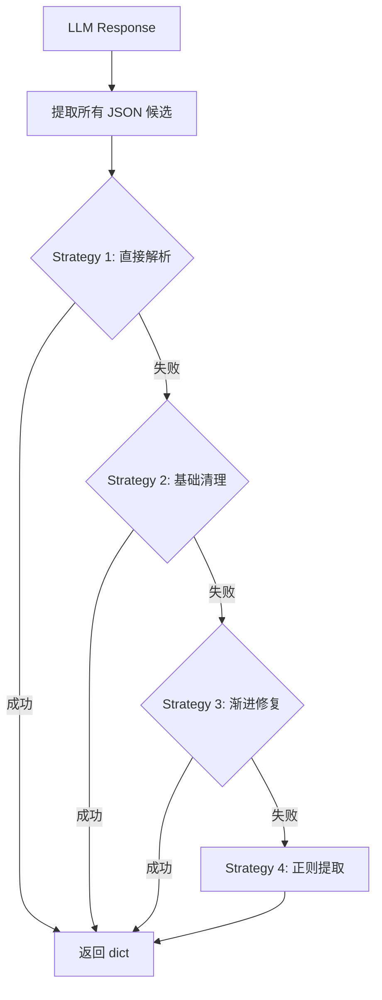
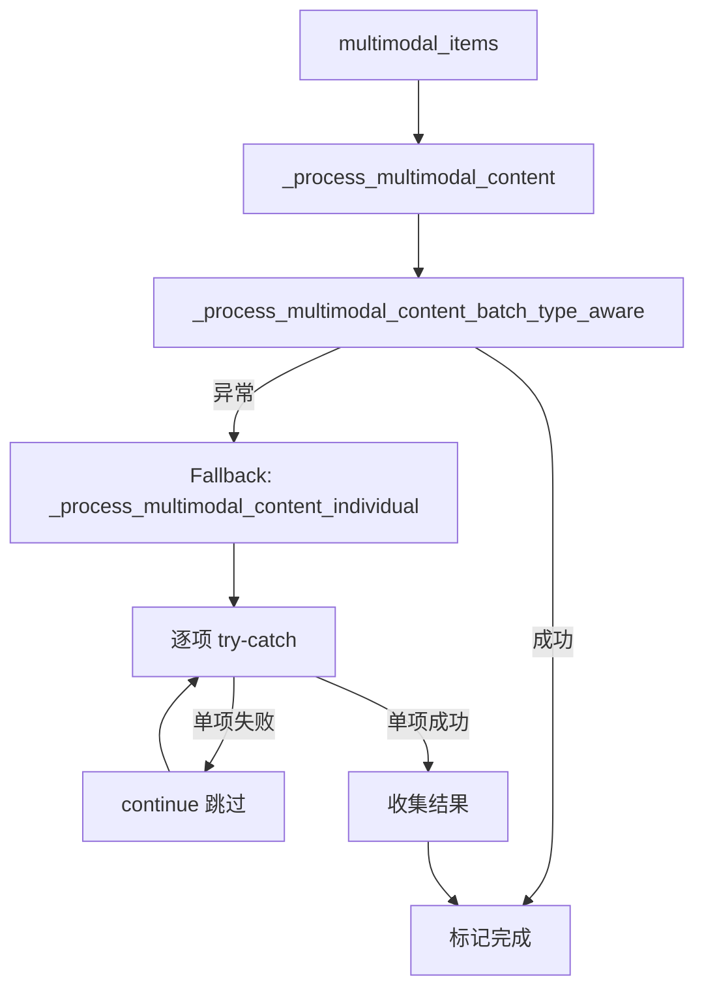
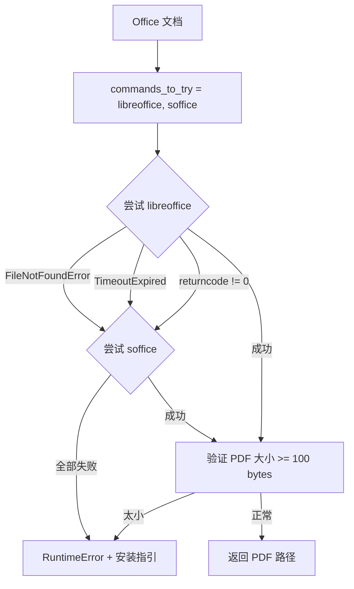

# PD-03.06 RAG-Anything — 四级 JSON 解析回退 + 多模态批量→逐项降级

> 文档编号：PD-03.06
> 来源：RAG-Anything `raganything/modalprocessors.py`, `raganything/processor.py`, `raganything/parser.py`
> GitHub：https://github.com/HKUDS/RAG-Anything.git
> 问题域：PD-03 容错与重试 Fault Tolerance & Retry
> 状态：可复用方案

---

## 第 1 章 问题与动机（≥ 30 行）

### 1.1 核心问题

RAG-Anything 是一个多模态 RAG 管道，将 PDF/图片/Office 文档解析为结构化内容后，通过 LLM 生成描述、提取实体关系并注入知识图谱。这条管道中有多个容错脆弱点：

1. **LLM 输出格式不可控**：LLM 生成的 JSON 经常包含 smart quotes、trailing commas、未转义反斜杠、thinking tags 等非标准内容，直接 `json.loads()` 必然失败
2. **多模态批量处理的级联失败**：批量并发处理图片/表格/公式时，一个 item 的 LLM 调用失败不应拖垮整批
3. **文档解析器不可用**：MinerU 或 Docling 可能未安装或版本不兼容，需要在运行前检测并给出明确指引
4. **外部命令执行不确定性**：LibreOffice 转换 Office 文档时可能超时、命令不存在、输出为空
5. **多模态处理器选择**：不同内容类型需要不同处理器，未知类型需要 generic fallback

### 1.2 RAG-Anything 的解法概述

RAG-Anything 在四个层级实现容错：

1. **JSON 解析层**：`_robust_json_parse` 提供 4 级渐进式回退策略（直接解析 → 基础清理 → 渐进修复 → 正则提取），确保 LLM 输出总能被解析（`modalprocessors.py:547-688`）
2. **多模态处理层**：批量处理失败时自动降级到逐项处理，每个 item 独立 try-catch 不影响其他（`processor.py:519-543`）
3. **解析器层**：LibreOffice 命令多候选尝试（libreoffice → soffice），60 秒超时保护，输出文件大小验证（`parser.py:108-191`）
4. **实体兜底层**：所有 LLM 调用的 except 分支都构造 `fallback_entity`，保证知识图谱不会因为单个描述生成失败而丢失节点（`modalprocessors.py:921-928`）

### 1.3 设计思想

| 设计原则 | 具体实现 | 理由 | 替代方案 |
|----------|----------|------|----------|
| 渐进式修复优于一次性解析 | 4 级 JSON 解析策略，从宽松到激进 | LLM 输出的错误模式多样，单一修复策略覆盖率低 | 强制 structured output（依赖模型能力） |
| 批量降级到逐项 | batch → individual fallback | 批量处理效率高但脆弱，逐项处理慢但稳定 | 全部逐项处理（牺牲性能） |
| fallback_entity 兜底 | 每个 processor 的 except 都返回最小可用实体 | 知识图谱宁可有低质量节点也不能丢节点 | 跳过失败项（丢失信息） |
| 命令多候选探测 | libreoffice → soffice 顺序尝试 | 不同 OS 的命令名不同 | 硬编码单一命令名 |
| 预检查 + 明确错误信息 | `check_installation()` + 详细安装指引 | 运行时才发现依赖缺失浪费用户时间 | 静默失败 |

---

## 第 2 章 源码实现分析（≥ 60 行，核心章节）

### 2.1 架构概览

RAG-Anything 的容错体系分布在三个文件中，形成四层防御：

```
┌─────────────────────────────────────────────────────────┐
│                    RAGAnything Pipeline                   │
├─────────────────────────────────────────────────────────┤
│  Layer 4: Entity Fallback (modalprocessors.py)           │
│  ┌─────────────────────────────────────────────────┐    │
│  │ fallback_entity = { entity_name, entity_type,   │    │
│  │                     summary: content[:100] }     │    │
│  └─────────────────────────────────────────────────┘    │
├─────────────────────────────────────────────────────────┤
│  Layer 3: JSON Parse Fallback (modalprocessors.py)       │
│  ┌──────┐  ┌──────────┐  ┌───────────┐  ┌──────────┐  │
│  │Direct│→ │Basic     │→ │Progressive│→ │Regex     │  │
│  │Parse │  │Cleanup   │  │Quote Fix  │  │Extraction│  │
│  └──────┘  └──────────┘  └───────────┘  └──────────┘  │
├─────────────────────────────────────────────────────────┤
│  Layer 2: Batch → Individual Degradation (processor.py)  │
│  ┌──────────────────┐    ┌────────────────────────┐    │
│  │ Batch Type-Aware │ →  │ Individual Processing  │    │
│  │ (concurrent)     │    │ (sequential, per-item) │    │
│  └──────────────────┘    └────────────────────────┘    │
├─────────────────────────────────────────────────────────┤
│  Layer 1: Parser Fallback (parser.py)                    │
│  ┌──────────┐  ┌──────────┐  ┌──────────────────┐     │
│  │MinerU    │  │Docling   │  │LibreOffice       │     │
│  │(primary) │  │(alt)     │  │(cmd candidates)  │     │
│  └──────────┘  └──────────┘  └──────────────────┘     │
└─────────────────────────────────────────────────────────┘
```

### 2.2 核心实现

#### 2.2.1 四级 JSON 解析回退（_robust_json_parse）



对应源码 `raganything/modalprocessors.py:547-688`：

```python
def _robust_json_parse(self, response: str) -> dict:
    """Robust JSON parsing with multiple fallback strategies"""

    # Strategy 1: Try direct parsing first
    for json_candidate in self._extract_all_json_candidates(response):
        result = self._try_parse_json(json_candidate)
        if result:
            return result

    # Strategy 2: Try with basic cleanup
    for json_candidate in self._extract_all_json_candidates(response):
        cleaned = self._basic_json_cleanup(json_candidate)
        result = self._try_parse_json(cleaned)
        if result:
            return result

    # Strategy 3: Try progressive quote fixing
    for json_candidate in self._extract_all_json_candidates(response):
        fixed = self._progressive_quote_fix(json_candidate)
        result = self._try_parse_json(fixed)
        if result:
            return result

    # Strategy 4: Fallback to regex field extraction
    return self._extract_fields_with_regex(response)
```

`_extract_all_json_candidates` 的关键设计（`modalprocessors.py:573-616`）：先清除 `<think>`/`<thinking>` 标签（兼容 qwen2.5-think、deepseek-r1 等推理模型），然后用三种方法提取候选 JSON：代码块匹配、花括号平衡匹配、简单正则匹配。

`_basic_json_cleanup`（`modalprocessors.py:628-640`）处理 smart quotes（`""`→`""`）和 trailing commas。

`_progressive_quote_fix`（`modalprocessors.py:642-655`）处理 LaTeX 反斜杠等转义问题。

`_extract_fields_with_regex`（`modalprocessors.py:657-688`）作为最终兜底，用正则逐字段提取 `detailed_description`、`entity_name`、`entity_type`、`summary`。

#### 2.2.2 多模态批量→逐项降级



对应源码 `raganything/processor.py:519-543`：

```python
try:
    await self._process_multimodal_content_batch_type_aware(
        multimodal_items=multimodal_items, file_path=file_path, doc_id=doc_id
    )
    await self._mark_multimodal_processing_complete(doc_id)
except Exception as e:
    self.logger.error(f"Error in multimodal processing: {e}")
    self.logger.warning("Falling back to individual multimodal processing")
    await self._process_multimodal_content_individual(
        multimodal_items, file_path, doc_id
    )
    await self._mark_multimodal_processing_complete(doc_id)
```

在逐项处理中（`processor.py:572-625`），每个 item 独立 try-catch，失败后 `continue` 不影响后续 item。

#### 2.2.3 LibreOffice 命令多候选探测



对应源码 `raganything/parser.py:108-191`：

```python
commands_to_try = ["libreoffice", "soffice"]
conversion_successful = False
for cmd in commands_to_try:
    try:
        convert_cmd = [cmd, "--headless", "--convert-to", "pdf",
                       "--outdir", str(temp_path), str(doc_path)]
        convert_subprocess_kwargs = {
            "capture_output": True, "text": True,
            "timeout": 60,  # 60 second timeout
        }
        result = subprocess.run(convert_cmd, **convert_subprocess_kwargs)
        if result.returncode == 0:
            conversion_successful = True
            break
    except FileNotFoundError:
        cls.logger.warning(f"LibreOffice command '{cmd}' not found")
    except subprocess.TimeoutExpired:
        cls.logger.warning(f"LibreOffice command '{cmd}' timed out")
```

### 2.3 实现细节

**fallback_entity 统一模式**：所有四种 ModalProcessor（Image/Table/Equation/Generic）在 `generate_description_only` 和 `process_multimodal_content` 的 except 分支中都构造相同结构的 fallback_entity（`modalprocessors.py:921-928, 984-991, 1116-1123, 1178-1185, 1304-1311, 1362-1369, 1478-1485, 1524-1531`）：

```python
fallback_entity = {
    "entity_name": entity_name if entity_name
        else f"image_{compute_mdhash_id(str(modal_content))}",
    "entity_type": "image",  # 对应各自类型
    "summary": f"Image content: {str(modal_content)[:100]}",
}
return str(modal_content), fallback_entity
```

**GenericModalProcessor 作为终极兜底**：`raganything.py:212` 中 generic processor 始终注册，`utils.py:246-248` 中未知 content_type 自动路由到 generic。

**文本编码多候选**：`parser.py:230-248` 中读取文本文件时尝试 utf-8 → gbk → latin-1 → cp1252 四种编码。

**asyncio.gather + return_exceptions**：`processor.py:827` 中批量并发使用 `return_exceptions=True`，异常不会中断其他任务，而是作为结果收集后过滤。


---

## 第 3 章 迁移指南（≥ 40 行）

### 3.1 迁移清单

**阶段 1：JSON 解析容错（1-2 小时）**
- [ ] 复制 `_robust_json_parse` 及其 4 个辅助方法到你的 LLM 调用层
- [ ] 在 `_extract_all_json_candidates` 中添加你使用的推理模型的 thinking tag 清理
- [ ] 在 `_extract_fields_with_regex` 中调整字段名匹配你的 JSON schema

**阶段 2：批量降级模式（2-3 小时）**
- [ ] 在批量处理入口添加 try-except，except 分支调用逐项处理函数
- [ ] 逐项处理函数中每个 item 独立 try-catch + continue
- [ ] 使用 `asyncio.gather(*tasks, return_exceptions=True)` 收集并发结果

**阶段 3：fallback_entity 兜底（1 小时）**
- [ ] 为每种内容处理器定义 fallback 返回值结构
- [ ] 确保 fallback 返回值与正常返回值结构一致（接口兼容）
- [ ] 使用 content hash 生成 fallback entity_name 避免冲突

**阶段 4：外部命令容错（1 小时）**
- [ ] 外部命令调用添加 timeout 参数
- [ ] 多候选命令名顺序尝试
- [ ] 输出文件存在性 + 大小验证

### 3.2 适配代码模板

**可复用的 4 级 JSON 解析器：**

```python
import re
import json
from typing import Optional, List


class RobustJSONParser:
    """4-level progressive JSON parsing with fallback strategies.
    Adapted from RAG-Anything's _robust_json_parse pattern."""

    def __init__(self, required_fields: List[str] = None,
                 thinking_tags: List[str] = None):
        """
        Args:
            required_fields: Fields to extract in regex fallback
            thinking_tags: Model-specific thinking tags to strip
        """
        self.required_fields = required_fields or ["content", "name", "type"]
        self.thinking_tags = thinking_tags or ["think", "thinking"]

    def parse(self, response: str) -> dict:
        """Parse LLM response with 4-level fallback."""
        candidates = self._extract_candidates(response)

        # Level 1: Direct parse
        for c in candidates:
            if result := self._try_parse(c):
                return result

        # Level 2: Basic cleanup (smart quotes, trailing commas)
        for c in candidates:
            cleaned = self._basic_cleanup(c)
            if result := self._try_parse(cleaned):
                return result

        # Level 3: Progressive escape fixing
        for c in candidates:
            fixed = self._fix_escapes(c)
            if result := self._try_parse(fixed):
                return result

        # Level 4: Regex field extraction
        return self._regex_extract(response)

    def _extract_candidates(self, response: str) -> list:
        cleaned = response
        for tag in self.thinking_tags:
            cleaned = re.sub(
                rf"<{tag}>.*?</{tag}>", "", cleaned,
                flags=re.DOTALL | re.IGNORECASE
            )
        candidates = re.findall(
            r"```(?:json)?\s*(\{.*?\})\s*```", cleaned, re.DOTALL
        )
        # Balanced braces extraction
        depth, start = 0, -1
        for i, ch in enumerate(cleaned):
            if ch == "{":
                if depth == 0: start = i
                depth += 1
            elif ch == "}":
                depth -= 1
                if depth == 0 and start != -1:
                    candidates.append(cleaned[start:i+1])
        return candidates

    def _try_parse(self, s: str) -> Optional[dict]:
        try:
            return json.loads(s) if s and s.strip() else None
        except (json.JSONDecodeError, ValueError):
            return None

    def _basic_cleanup(self, s: str) -> str:
        s = s.replace('\u201c', '"').replace('\u201d', '"')
        return re.sub(r",(\s*[}\]])", r"\1", s)

    def _fix_escapes(self, s: str) -> str:
        return re.sub(r'(?<!\\)\\(?=")', r"\\\\", s)

    def _regex_extract(self, response: str) -> dict:
        result = {}
        for field in self.required_fields:
            match = re.search(
                rf'"{field}":\s*"([^"]*(?:\\.[^"]*)*)"', response, re.DOTALL
            )
            result[field] = match.group(1) if match else ""
        return result
```

**可复用的批量降级模式：**

```python
import asyncio
from typing import List, Any, Callable


async def process_with_batch_fallback(
    items: List[Any],
    batch_fn: Callable,
    individual_fn: Callable,
    max_concurrency: int = 5,
) -> List[Any]:
    """Process items with batch-first, individual-fallback strategy.
    Adapted from RAG-Anything's _process_multimodal_content pattern."""
    try:
        return await batch_fn(items)
    except Exception as e:
        print(f"Batch failed: {e}, falling back to individual processing")
        results = []
        sem = asyncio.Semaphore(max_concurrency)
        for item in items:
            async with sem:
                try:
                    result = await individual_fn(item)
                    results.append(result)
                except Exception as item_err:
                    print(f"Item failed: {item_err}, skipping")
                    continue
        return results
```

### 3.3 适用场景

| 场景 | 适用度 | 说明 |
|------|--------|------|
| LLM 输出 JSON 解析 | ⭐⭐⭐ | 任何需要从 LLM 提取结构化数据的场景 |
| 多模态/批量处理管道 | ⭐⭐⭐ | 批量处理中需要隔离单项失败 |
| 外部工具链调用 | ⭐⭐ | 依赖外部 CLI 工具的场景 |
| 知识图谱构建 | ⭐⭐⭐ | 实体提取失败时需要兜底节点 |
| 单次 LLM 调用 | ⭐ | 简单场景直接 try-except 即可 |

---

## 第 4 章 测试用例（≥ 20 行）

```python
import pytest
import json


class TestRobustJSONParse:
    """Tests based on RAG-Anything's _robust_json_parse (modalprocessors.py:547)"""

    def setup_method(self):
        from raganything.modalprocessors import BaseModalProcessor
        # BaseModalProcessor needs lightrag, mock it minimally
        self.parser = BaseModalProcessor.__new__(BaseModalProcessor)

    def test_level1_direct_parse(self):
        """Strategy 1: Valid JSON parses directly"""
        response = '{"detailed_description": "A chart", "entity_info": {"entity_name": "Fig1", "entity_type": "image", "summary": "Chart"}}'
        result = self.parser._robust_json_parse(response)
        assert result["detailed_description"] == "A chart"
        assert result["entity_info"]["entity_name"] == "Fig1"

    def test_level1_json_in_code_block(self):
        """Strategy 1: JSON wrapped in markdown code block"""
        response = '```json\n{"detailed_description": "test", "entity_info": {"entity_name": "E1", "entity_type": "t", "summary": "s"}}\n```'
        result = self.parser._robust_json_parse(response)
        assert result["detailed_description"] == "test"

    def test_level2_smart_quotes(self):
        """Strategy 2: Smart quotes cleaned up"""
        response = '{\u201cdetailed_description\u201d: \u201ctest\u201d, \u201centity_info\u201d: {\u201centity_name\u201d: \u201cE1\u201d, \u201centity_type\u201d: \u201ct\u201d, \u201csummary\u201d: \u201cs\u201d}}'
        result = self.parser._robust_json_parse(response)
        assert "detailed_description" in result or "content" in result

    def test_level2_trailing_comma(self):
        """Strategy 2: Trailing comma removed"""
        response = '{"detailed_description": "test", "entity_info": {"entity_name": "E1", "entity_type": "t", "summary": "s",}}'
        result = self.parser._robust_json_parse(response)
        assert result is not None

    def test_level4_regex_fallback(self):
        """Strategy 4: Completely broken JSON falls back to regex"""
        response = 'Some text "detailed_description": "A description here" and "entity_name": "MyEntity" also "entity_type": "image" with "summary": "Short"'
        result = self.parser._robust_json_parse(response)
        assert result["detailed_description"] == "A description here"

    def test_thinking_tags_stripped(self):
        """Thinking tags from reasoning models are stripped"""
        response = '<think>Let me analyze...</think>{"detailed_description": "clean", "entity_info": {"entity_name": "E", "entity_type": "t", "summary": "s"}}'
        candidates = self.parser._extract_all_json_candidates(response)
        assert any('"detailed_description"' in c for c in candidates)


class TestBatchToIndividualFallback:
    """Tests for batch → individual degradation (processor.py:519-543)"""

    @pytest.mark.asyncio
    async def test_batch_success_no_fallback(self):
        """When batch succeeds, individual processing is not called"""
        batch_called = False
        individual_called = False

        async def batch_fn(items):
            nonlocal batch_called
            batch_called = True
            return [{"result": i} for i in items]

        async def individual_fn(item):
            nonlocal individual_called
            individual_called = True
            return {"result": item}

        from tests.test_helpers import process_with_batch_fallback
        results = await process_with_batch_fallback([1, 2, 3], batch_fn, individual_fn)
        assert batch_called
        assert not individual_called
        assert len(results) == 3

    @pytest.mark.asyncio
    async def test_batch_failure_triggers_individual(self):
        """When batch fails, falls back to individual processing"""
        async def batch_fn(items):
            raise RuntimeError("Batch processing failed")

        async def individual_fn(item):
            return {"result": item}

        from tests.test_helpers import process_with_batch_fallback
        results = await process_with_batch_fallback([1, 2, 3], batch_fn, individual_fn)
        assert len(results) == 3

    @pytest.mark.asyncio
    async def test_individual_item_failure_skipped(self):
        """Individual item failure doesn't affect other items"""
        async def batch_fn(items):
            raise RuntimeError("Batch failed")

        async def individual_fn(item):
            if item == 2:
                raise ValueError("Item 2 failed")
            return {"result": item}

        from tests.test_helpers import process_with_batch_fallback
        results = await process_with_batch_fallback([1, 2, 3], batch_fn, individual_fn)
        assert len(results) == 2  # Item 2 skipped


class TestFallbackEntity:
    """Tests for fallback_entity pattern (modalprocessors.py:921-928)"""

    def test_fallback_entity_has_required_fields(self):
        """Fallback entity must have entity_name, entity_type, summary"""
        from lightrag.utils import compute_mdhash_id
        content = "some image content"
        fallback = {
            "entity_name": f"image_{compute_mdhash_id(content)}",
            "entity_type": "image",
            "summary": f"Image content: {content[:100]}",
        }
        assert "entity_name" in fallback
        assert "entity_type" in fallback
        assert "summary" in fallback
        assert fallback["entity_type"] == "image"

    def test_fallback_entity_name_uses_hash(self):
        """Fallback entity_name uses content hash to avoid collisions"""
        from lightrag.utils import compute_mdhash_id
        content1 = "image A"
        content2 = "image B"
        name1 = f"image_{compute_mdhash_id(content1)}"
        name2 = f"image_{compute_mdhash_id(content2)}"
        assert name1 != name2
```


---

## 第 5 章 跨域关联

| 关联域 | 关系类型 | 说明 |
|--------|----------|------|
| PD-01 上下文管理 | 协同 | `ContextExtractor` 的 `_truncate_context` 在 token 超限时截断到句子边界，与上下文窗口管理直接相关 |
| PD-02 多 Agent 编排 | 协同 | 批量多模态处理使用 `asyncio.Semaphore` 控制并发度，与并行编排的并发限制模式一致 |
| PD-04 工具系统 | 依赖 | 解析器层的 MinerU/Docling/LibreOffice 都是外部工具，容错策略依赖工具系统的安装检测能力 |
| PD-07 质量检查 | 协同 | `_robust_json_parse` 的 4 级策略本质上是对 LLM 输出质量的渐进式修复 |
| PD-08 搜索与检索 | 协同 | fallback_entity 保证知识图谱节点完整性，直接影响后续检索的召回率 |

---

## 第 6 章 来源文件索引

| 文件 | 行范围 | 关键实现 |
|------|--------|----------|
| `raganything/modalprocessors.py` | L547-L688 | `_robust_json_parse` 四级 JSON 解析回退 |
| `raganything/modalprocessors.py` | L573-L616 | `_extract_all_json_candidates` thinking tag 清理 + 三种候选提取 |
| `raganything/modalprocessors.py` | L628-L655 | `_basic_json_cleanup` + `_progressive_quote_fix` |
| `raganything/modalprocessors.py` | L657-L688 | `_extract_fields_with_regex` 正则兜底 |
| `raganything/modalprocessors.py` | L921-L928 | ImageModalProcessor fallback_entity 模式 |
| `raganything/modalprocessors.py` | L1116-L1123 | TableModalProcessor fallback_entity 模式 |
| `raganything/modalprocessors.py` | L1304-L1311 | EquationModalProcessor fallback_entity 模式 |
| `raganything/modalprocessors.py` | L1478-L1485 | GenericModalProcessor fallback_entity 模式 |
| `raganything/processor.py` | L519-L543 | 批量→逐项降级入口 |
| `raganything/processor.py` | L572-L625 | 逐项处理 per-item try-catch |
| `raganything/processor.py` | L703-L844 | `_process_multimodal_content_batch_type_aware` 并发处理 + gather |
| `raganything/processor.py` | L827 | `asyncio.gather(*tasks, return_exceptions=True)` |
| `raganything/parser.py` | L108-L171 | LibreOffice 多候选命令 + 60s 超时 |
| `raganything/parser.py` | L187-L191 | PDF 输出大小验证（>= 100 bytes） |
| `raganything/parser.py` | L230-L248 | 文本文件多编码尝试（utf-8/gbk/latin-1/cp1252） |
| `raganything/raganything.py` | L212 | GenericModalProcessor 始终注册为兜底 |
| `raganything/utils.py` | L228-L248 | `get_processor_for_type` 未知类型路由到 generic |
| `raganything/batch_parser.py` | L279-L321 | 批量解析 ThreadPoolExecutor + per-file 错误收集 |

---

## 第 7 章 横向对比维度

> **重要：** 本章用于自动填充 Butcher Wiki 的横向对比表。

```json comparison_data
{
  "project": "RAG-Anything",
  "dimensions": {
    "截断/错误检测": "LLM 输出 JSON 解析失败时触发，无显式截断检测",
    "重试/恢复策略": "无重试，采用 4 级渐进式解析修复替代重试",
    "超时保护": "LibreOffice 转换 60s 超时，MinerU 子进程无显式超时",
    "优雅降级": "批量→逐项降级 + fallback_entity 兜底双层降级",
    "降级方案": "batch_type_aware → individual + generic processor 兜底",
    "错误分类": "FileNotFoundError/TimeoutExpired/JSONDecodeError 分类处理",
    "恢复机制": "per-item continue 跳过失败项，不中断管道",
    "输出验证": "PDF 大小 >= 100 bytes 验证，content_list 非空检查",
    "并发容错": "asyncio.gather(return_exceptions=True) 隔离并发失败",
    "多模态降级": "4 种专用 Processor + GenericProcessor 终极兜底"
  }
}
```

### 域元数据补充

```json domain_metadata
{
  "solution_summary": "RAG-Anything 用 4 级渐进式 JSON 解析回退 + 批量→逐项自动降级 + fallback_entity 兜底实现多模态管道容错",
  "description": "多模态内容处理管道中 LLM 输出解析与批量处理的容错降级",
  "sub_problems": [
    "LLM 输出含推理模型 thinking tags 导致 JSON 提取失败",
    "多模态批量并发中单项失败的隔离与降级",
    "外部 CLI 工具多命令名兼容（libreoffice vs soffice）",
    "文本文件多编码兼容（utf-8/gbk/latin-1/cp1252）"
  ],
  "best_practices": [
    "渐进式修复优于一次性解析：从宽松到激进逐级尝试",
    "fallback 返回值必须与正常返回值结构一致，保证接口兼容",
    "GenericProcessor 作为终极兜底始终注册，处理未知内容类型",
    "asyncio.gather 使用 return_exceptions=True 隔离并发任务失败"
  ]
}
```

