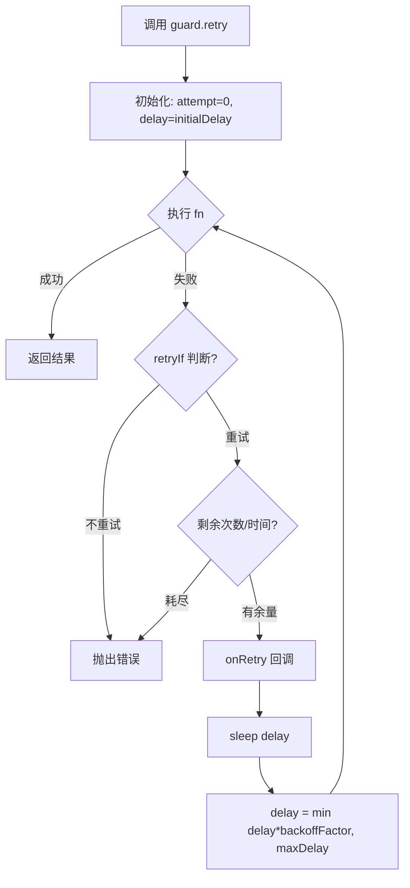
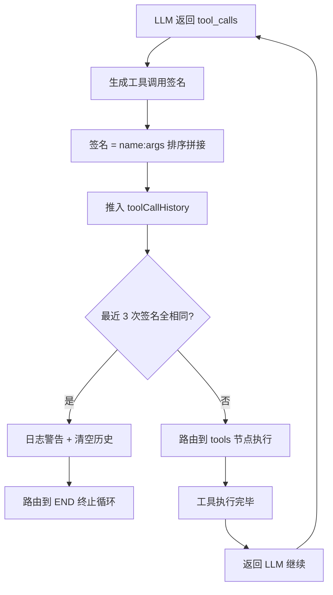
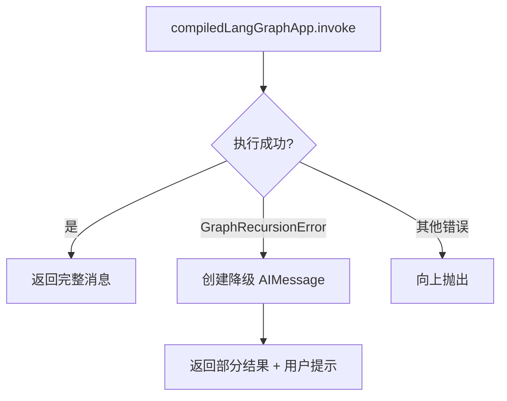

# PD-03.17 Refly — 四层容错 Guard 体系与无限循环检测

> 文档编号：PD-03.17
> 来源：Refly `packages/utils/src/guard.ts` `packages/skill-template/src/skills/agent.ts`
> GitHub：https://github.com/refly-ai/refly.git
> 问题域：PD-03 容错与重试 Fault Tolerance & Retry
> 状态：可复用方案

---

## 第 1 章 问题与动机（≥ 30 行）

### 1.1 核心问题

Refly 是一个全栈 AI 知识工作台，Agent 执行链路涉及 LLM 调用、工具并行执行、沙箱代码运行、分布式锁竞争、BullMQ 任务队列等多个故障点。任何一环失败都可能导致用户请求卡死或资源泄漏。核心挑战包括：

1. **Agent 无限循环**：LLM 反复生成相同的工具调用，消耗 token 但无进展
2. **LangGraph 递归爆炸**：工具调用链超过深度限制触发 `GraphRecursionError`
3. **模块初始化竞态**：NestJS 模块启动时依赖的 Redis/BullMQ 可能尚未就绪
4. **分布式锁死锁**：高并发下锁获取失败或锁持有者崩溃导致永久阻塞
5. **卡死任务检测**：Agent 执行中途崩溃，数据库状态永远停留在 `executing`
6. **沙箱生命周期失败**：Scalebox 沙箱创建/连接可能因网络抖动失败

### 1.2 Refly 的解法概述

Refly 构建了一套四层容错体系，从底层工具库到上层业务逻辑层层防护：

1. **Guard 工具库**（`packages/utils/src/guard.ts:220-314`）：提供 `guard.retry`（同步/异步重试）和 `guard.retryGenerator`（流式重试），支持指数退避、超时控制、条件过滤，以及 `guard.defer`/`guard.bracket` 的 RAII 资源管理
2. **Agent 循环检测**（`packages/skill-template/src/skills/agent.ts:458-502`）：通过工具调用签名比对检测连续 3 次相同调用，主动终止无限循环；同时设置 `GraphRecursionError` 捕获作为兜底
3. **模块初始化重试**（`packages/utils/src/on-module-init.ts:31-65`）：`runModuleInitWithTimeoutAndRetry` 为 NestJS 模块启动提供超时 + 线性退避重试
4. **卡死任务巡检**（`apps/api/src/modules/skill/skill.service.ts:186-271`）：定时 Cron 任务扫描超时的 `executing` 状态记录，通过 `AbortController` + 数据库直接更新双路径强制终止
5. **分布式锁自动续期**（`apps/api/src/modules/common/redis.service.ts:471-562`）：Redis 锁带 1/2 TTL 自动续期 + 最大生命周期限制，防止锁泄漏

### 1.3 设计思想

| 设计原则 | 具体实现 | 理由 | 替代方案 |
|----------|----------|------|----------|
| 签名比对检测循环 | 工具调用 name+args 排序拼接为签名，滑动窗口比对 | 比简单计数更精确，能区分不同工具调用组合 | 仅计数迭代次数（无法区分有效进展） |
| 双层递归保护 | 循环检测（主动）+ GraphRecursionError 捕获（被动） | 主动检测更早终止，被动捕获兜底极端情况 | 仅依赖 LangGraph recursionLimit |
| Guard 链式 API | `guard.retry(fn, config).orThrow(factory)` | 统一错误处理风格，避免 try-catch 嵌套 | 每处调用自行 try-catch |
| 锁自动续期 + 最大生命周期 | 1/2 TTL 续期 + 300s 上限 | 防止长任务锁过期，同时防止无限续期 | 固定长 TTL（浪费资源或仍可能过期） |
| 卡死任务双路径终止 | AbortController.abort() + 数据库直接 update | 优先走正常中止流程，失败则直接改库 | 仅依赖 AbortController（可能已丢失） |
| 工具调用并发限制 | `p-limit(concurrencyLimit)` 控制并行工具数 | 防止 LLM 一次生成过多工具调用耗尽资源 | 无限制并行（可能 OOM） |

---

## 第 2 章 源码实现分析（≥ 60 行，核心章节）

### 2.1 架构概览

Refly 的容错体系分为四层，从底层工具到上层业务逐层叠加：

```
┌─────────────────────────────────────────────────────────┐
│  Layer 4: 业务层容错                                      │
│  ┌─────────────────┐  ┌──────────────────────────────┐  │
│  │ Stuck Actions    │  │ Distributed Lock + Renewal   │  │
│  │ Cron 巡检        │  │ Redis waitLock/acquireLock   │  │
│  └─────────────────┘  └──────────────────────────────┘  │
├─────────────────────────────────────────────────────────┤
│  Layer 3: Agent 执行层容错                                │
│  ┌─────────────────┐  ┌──────────────────────────────┐  │
│  │ Loop Detection   │  │ GraphRecursionError Catch    │  │
│  │ 签名滑动窗口      │  │ 优雅降级返回部分结果           │  │
│  └─────────────────┘  └──────────────────────────────┘  │
├─────────────────────────────────────────────────────────┤
│  Layer 2: 模块初始化层                                    │
│  ┌──────────────────────────────────────────────────┐   │
│  │ runModuleInitWithTimeoutAndRetry                  │   │
│  │ 超时 10s + 线性退避 3 次重试                        │   │
│  └──────────────────────────────────────────────────┘   │
├─────────────────────────────────────────────────────────┤
│  Layer 1: Guard 工具库                                    │
│  ┌──────────┐ ┌──────────┐ ┌───────┐ ┌───────────────┐ │
│  │ retry    │ │retryGen  │ │ defer │ │ bracket(RAII) │ │
│  │ 指数退避  │ │流式重试   │ │ 资源  │ │ 多资源 LIFO   │ │
│  └──────────┘ └──────────┘ └───────┘ └───────────────┘ │
└─────────────────────────────────────────────────────────┘
```

### 2.2 核心实现

#### 2.2.1 Guard.retry — 通用重试引擎



对应源码 `packages/utils/src/guard.ts:220-259`：

```typescript
guard.retry = <T>(fn: () => T | Promise<T>, config: RetryConfig): GuardWrapper<Promise<T>> => {
  return guard(async () => {
    const {
      maxAttempts,
      timeout,
      initialDelay = 0,
      maxDelay = 1000,
      backoffFactor = 1,
      retryIf,
      onRetry,
    } = config;

    let lastError: unknown;
    const startTime = Date.now();
    let delay = initialDelay;
    let attempt = 0;

    while (true) {
      attempt++;
      try {
        return await fn();
      } catch (error) {
        lastError = error;
        const shouldRetry = retryIf ? retryIf(error) : true;
        const hasMoreAttempts = maxAttempts ? attempt < maxAttempts : true;
        const hasMoreTime = timeout ? Date.now() - startTime < timeout : true;

        if (!shouldRetry || !hasMoreAttempts || !hasMoreTime) {
          throw lastError;
        }
        await onRetry?.(error, attempt);
        await sleep(delay);
        delay = Math.min(delay * backoffFactor, maxDelay);
      }
    }
  });
};
```

关键设计点：
- **双模式终止**：同时支持 `maxAttempts`（次数）和 `timeout`（时间）两种退出条件（`guard.ts:246-248`）
- **条件过滤**：`retryIf` 谓词允许只对特定错误重试，避免对不可恢复错误浪费时间
- **链式 API**：返回 `GuardWrapper`，可接 `.orThrow()` 或 `.orElse()` 处理最终失败

#### 2.2.2 Agent 无限循环检测



对应源码 `packages/skill-template/src/skills/agent.ts:458-502`：

```typescript
// Track tool call history for loop detection
let toolCallHistory: string[] = [];

workflow.addConditionalEdges('llm', (graphState: typeof MessagesAnnotation.State) => {
  const lastMessage = graphState.messages[graphState.messages.length - 1] as AIMessage;

  if (lastMessage?.tool_calls && lastMessage?.tool_calls?.length > 0) {
    // Create a signature for the current tool calls to detect loops
    const currentToolSignature = lastMessage.tool_calls
      .map((tc) => `${tc?.name ?? ''}:${JSON.stringify(tc?.args ?? {})}`)
      .sort()
      .join('|');

    // Check for repeated identical tool calls (potential infinite loop)
    toolCallHistory.push(currentToolSignature);
    const recentCalls = toolCallHistory.slice(-MAX_IDENTICAL_TOOL_CALLS);
    const allIdentical =
      recentCalls.length === MAX_IDENTICAL_TOOL_CALLS &&
      recentCalls.every((call) => call === currentToolSignature);

    if (allIdentical) {
      this.engine.logger.warn(
        `Detected ${MAX_IDENTICAL_TOOL_CALLS} identical consecutive tool calls, breaking potential infinite loop`,
        { toolSignature: currentToolSignature },
      );
      toolCallHistory = [];
      return END;
    }
    return 'tools';
  }
  toolCallHistory = [];
  return END;
});
```

关键设计点：
- **签名排序**：`sort()` 确保工具调用顺序不同但内容相同时也能检测到（`agent.ts:471`）
- **滑动窗口**：`slice(-MAX_IDENTICAL_TOOL_CALLS)` 只看最近 3 次，不受历史干扰（`agent.ts:476`）
- **常量配置**：`MAX_IDENTICAL_TOOL_CALLS = 3`、`MAX_TOOL_ITERATIONS = 25`、`DEFAULT_RECURSION_LIMIT = 51`（`agent.ts:37-41`）

#### 2.2.3 GraphRecursionError 优雅降级



对应源码 `packages/skill-template/src/skills/agent.ts:547-607`：

```typescript
try {
  const result = await compiledLangGraphApp.invoke(
    { messages: requestMessages },
    { ...config, recursionLimit: DEFAULT_RECURSION_LIMIT }
  );
  return { messages: result.messages };
} catch (error) {
  if (error instanceof GraphRecursionError) {
    this.engine.logger.warn(
      `Agent reached recursion limit (${DEFAULT_RECURSION_LIMIT} steps, ~${MAX_TOOL_ITERATIONS} iterations). Returning partial result.`
    );
    const limitReachedMessage = new AIMessage({
      content: 'I apologize, but I have reached the maximum number of iterations...'
    });
    return { messages: [limitReachedMessage] };
  }
  throw error;
}
```

### 2.3 实现细节

#### 模块初始化超时重试

`runModuleInitWithTimeoutAndRetry`（`packages/utils/src/on-module-init.ts:31-65`）为 NestJS 模块启动提供防护：

- 超时：默认 10s，通过 `Promise.race` 实现
- 重试：默认 3 次，线性退避（`retryDelayMs * attempt`，即 1s、2s、3s）
- 用于 `SkillService.onModuleInit`（`skill.service.ts:120-142`）和 `RedisService.onModuleInit`

#### 分布式锁自动续期

`acquireLock`（`redis.service.ts:471-562`）实现了生产级分布式锁：

- **Token 唯一性**：`${process.pid}-${Date.now()}` 防止误释放
- **自动续期**：`setInterval` 每 `TTL/2` 续期一次
- **最大生命周期**：默认 300s 后停止续期，防止无限持有
- **Lua 原子操作**：释放和续期都用 Lua 脚本保证原子性
- **清理保障**：`onModuleDestroy` 清理所有活跃定时器

#### 卡死任务巡检

`checkStuckActions`（`skill.service.ts:186-271`）定期扫描超时任务：

- BullMQ 定时任务，可配置间隔（`skill.stuckCheckInterval`）
- 查找 `status='executing'` 且 `updatedAt < cutoffTime` 的记录
- 限制每次处理 100 条，防止巡检本身过载
- `Promise.allSettled` 并行中止，单条失败不影响其他
- 双路径终止：优先 `abortAction`（走 AbortController），失败则直接改数据库

#### 沙箱生命周期重试

`withLifecycleRetry`（`apps/api/src/modules/tool/sandbox/wrapper/base.ts:137-171`）：

- 使用 `guard.retry` 包装沙箱创建/连接
- 线性退避（`backoffFactor: 1`），收集所有错误消息
- 失败时抛出聚合异常（`SandboxCreationException` / `SandboxConnectionException`）

---

## 第 3 章 迁移指南（≥ 40 行）

### 3.1 迁移清单

**阶段 1：Guard 工具库（1 个文件）**
- [ ] 复制 `packages/utils/src/guard.ts` 到项目工具库
- [ ] 适配 `RetryConfig` 接口到项目的错误类型体系
- [ ] 为 `guard.retry` 添加项目级默认配置（如默认 maxAttempts=3）

**阶段 2：Agent 循环检测（改造 Agent 执行层）**
- [ ] 在 LangGraph conditional edges 中加入工具调用签名比对逻辑
- [ ] 配置 `MAX_IDENTICAL_TOOL_CALLS`（建议 3）和 `DEFAULT_RECURSION_LIMIT`（建议 2*maxIterations+1）
- [ ] 添加 `GraphRecursionError` 捕获，返回降级消息而非崩溃

**阶段 3：模块初始化防护**
- [ ] 复制 `runModuleInitWithTimeoutAndRetry` 到项目工具库
- [ ] 在所有 `onModuleInit` 中包装初始化逻辑
- [ ] 配置合理的超时时间（建议 10-30s）

**阶段 4：分布式锁与卡死检测**
- [ ] 实现带自动续期的 Redis 分布式锁（需要 Lua 脚本支持）
- [ ] 实现 `waitLock` 指数退避获取逻辑
- [ ] 添加定时任务扫描卡死的 `executing` 状态记录
- [ ] 实现 AbortController + 数据库直接更新的双路径终止

### 3.2 适配代码模板

#### Guard.retry 通用重试模板（TypeScript）

```typescript
import { guard, RetryConfig } from './guard';

// 1. 基础重试：LLM 调用
const result = await guard
  .retry(
    () => llmClient.chat(messages),
    {
      maxAttempts: 3,
      initialDelay: 1000,
      maxDelay: 5000,
      backoffFactor: 2,
      retryIf: (err) => {
        // 只对可恢复错误重试
        const msg = (err as Error).message;
        return msg.includes('rate_limit') || msg.includes('timeout') || msg.includes('503');
      },
      onRetry: (err, attempt) => {
        logger.warn(`LLM call failed (attempt ${attempt}): ${(err as Error).message}`);
      },
    },
  )
  .orThrow((err) => new LLMCallError(`LLM call failed after retries: ${err}`));

// 2. 流式重试：SSE 流中断后从头重试
const stream = guard.retryGenerator(
  () => llmClient.streamChat(messages),
  { maxAttempts: 2, initialDelay: 500, backoffFactor: 2 },
);
for await (const chunk of stream) {
  yield chunk;
}

// 3. RAII 资源管理：锁获取 + 自动释放
await guard.defer(
  async () => {
    const release = await redis.waitLock('my-key');
    return [release, () => release()] as const;
  },
  async (release) => {
    await doProtectedWork();
  },
);
```

#### Agent 循环检测模板

```typescript
const MAX_IDENTICAL_CALLS = 3;
let callHistory: string[] = [];

function shouldContinue(state: GraphState): 'tools' | '__end__' {
  const lastMsg = state.messages.at(-1) as AIMessage;
  if (!lastMsg?.tool_calls?.length) {
    callHistory = [];
    return '__end__';
  }

  const signature = lastMsg.tool_calls
    .map((tc) => `${tc.name}:${JSON.stringify(tc.args)}`)
    .sort()
    .join('|');

  callHistory.push(signature);
  const recent = callHistory.slice(-MAX_IDENTICAL_CALLS);

  if (recent.length === MAX_IDENTICAL_CALLS && recent.every((c) => c === signature)) {
    logger.warn('Infinite loop detected, terminating');
    callHistory = [];
    return '__end__';
  }
  return 'tools';
}
```

### 3.3 适用场景

| 场景 | 适用度 | 说明 |
|------|--------|------|
| LangGraph Agent 系统 | ⭐⭐⭐ | 循环检测 + 递归限制直接可用 |
| NestJS 微服务 | ⭐⭐⭐ | 模块初始化重试 + 分布式锁完美匹配 |
| 多工具并行 Agent | ⭐⭐⭐ | p-limit 并发控制 + 工具错误隔离 |
| 纯 Python Agent | ⭐⭐ | 需要将 TypeScript Guard 移植为 Python 装饰器 |
| 无状态 API 服务 | ⭐ | 卡死检测和锁续期对无状态服务意义不大 |

---

## 第 4 章 测试用例（≥ 20 行）

```typescript
import { guard } from './guard';
import { runModuleInitWithTimeoutAndRetry } from './on-module-init';

describe('Guard.retry', () => {
  test('should retry on failure and succeed', async () => {
    let attempts = 0;
    const result = await guard
      .retry(
        async () => {
          attempts++;
          if (attempts < 3) throw new Error('transient');
          return 'ok';
        },
        { maxAttempts: 5, initialDelay: 10 },
      )
      .orThrow();
    expect(result).toBe('ok');
    expect(attempts).toBe(3);
  });

  test('should respect retryIf predicate', async () => {
    let attempts = 0;
    await expect(
      guard
        .retry(
          async () => {
            attempts++;
            throw new Error('permanent');
          },
          {
            maxAttempts: 5,
            retryIf: (err) => (err as Error).message !== 'permanent',
          },
        )
        .orThrow(),
    ).rejects.toThrow('permanent');
    expect(attempts).toBe(1); // 不重试
  });

  test('should respect timeout', async () => {
    const start = Date.now();
    await expect(
      guard
        .retry(
          async () => {
            await new Promise((r) => setTimeout(r, 100));
            throw new Error('slow');
          },
          { timeout: 250, initialDelay: 10 },
        )
        .orThrow(),
    ).rejects.toThrow('slow');
    expect(Date.now() - start).toBeLessThan(500);
  });
});

describe('Agent Loop Detection', () => {
  test('should detect 3 identical consecutive tool calls', () => {
    const MAX = 3;
    const history: string[] = [];
    const signature = 'search:{"query":"test"}';

    for (let i = 0; i < MAX; i++) {
      history.push(signature);
    }

    const recent = history.slice(-MAX);
    const allIdentical =
      recent.length === MAX && recent.every((c) => c === signature);
    expect(allIdentical).toBe(true);
  });

  test('should not trigger on different tool calls', () => {
    const MAX = 3;
    const history = [
      'search:{"query":"a"}',
      'search:{"query":"b"}',
      'search:{"query":"a"}',
    ];
    const recent = history.slice(-MAX);
    const sig = recent[recent.length - 1];
    const allIdentical =
      recent.length === MAX && recent.every((c) => c === sig);
    expect(allIdentical).toBe(false);
  });
});

describe('runModuleInitWithTimeoutAndRetry', () => {
  test('should succeed on first attempt', async () => {
    let called = 0;
    await runModuleInitWithTimeoutAndRetry(
      async () => { called++; },
      { timeoutMs: 5000, maxAttempts: 3, retryDelayMs: 100 },
    );
    expect(called).toBe(1);
  });

  test('should retry on timeout', async () => {
    let called = 0;
    await expect(
      runModuleInitWithTimeoutAndRetry(
        async () => {
          called++;
          await new Promise((r) => setTimeout(r, 5000)); // 超时
        },
        { timeoutMs: 100, maxAttempts: 2, retryDelayMs: 50 },
      ),
    ).rejects.toThrow('timed out');
    expect(called).toBe(2);
  });
});
```

---

## 第 5 章 跨域关联

| 关联域 | 关系类型 | 说明 |
|--------|----------|------|
| PD-01 上下文管理 | 协同 | `compressAgentLoopMessages` 在 Agent 循环中动态压缩消息，防止 token 超限触发错误；压缩失败时 catch 但不中断（`agent.ts:272-277`） |
| PD-02 多 Agent 编排 | 依赖 | Agent 循环检测和递归限制是 LangGraph StateGraph 编排的安全网；`p-limit` 并发控制防止工具调用过载 |
| PD-04 工具系统 | 协同 | 工具调用失败被捕获并返回 ToolMessage 错误内容（`agent.ts:377-389`），不中断 Agent 循环；无效工具名返回友好错误 |
| PD-06 记忆持久化 | 依赖 | 卡死任务检测依赖 Prisma 数据库中 `actionResult` 的 `status` 和 `updatedAt` 字段 |
| PD-11 可观测性 | 协同 | 每次重试、循环检测、锁获取都有结构化日志；OpenTelemetry span 追踪任务入队（`skill.service.ts:1041-1059`） |

---

## 第 6 章 来源文件索引

| 文件 | 行范围 | 关键实现 |
|------|--------|----------|
| `packages/utils/src/guard.ts` | L6-14 | RetryConfig 接口定义 |
| `packages/utils/src/guard.ts` | L94-105 | guard.bestEffort 最佳努力执行 |
| `packages/utils/src/guard.ts` | L141-158 | guard.defer RAII 资源管理 |
| `packages/utils/src/guard.ts` | L177-213 | guard.bracket 多资源 LIFO 释放 |
| `packages/utils/src/guard.ts` | L220-259 | guard.retry 通用重试引擎 |
| `packages/utils/src/guard.ts` | L266-314 | guard.retryGenerator 流式重试 |
| `packages/utils/src/on-module-init.ts` | L31-65 | runModuleInitWithTimeoutAndRetry |
| `packages/skill-template/src/skills/agent.ts` | L37-43 | 递归控制常量定义 |
| `packages/skill-template/src/skills/agent.ts` | L458-502 | 无限循环检测 conditional edges |
| `packages/skill-template/src/skills/agent.ts` | L547-607 | GraphRecursionError 捕获与降级 |
| `packages/skill-template/src/skills/agent.ts` | L310-451 | 增强工具节点：并发控制 + 错误隔离 |
| `packages/skill-template/src/utils/context-manager.ts` | L947-1014 | compressAgentLoopMessages 压缩 |
| `apps/api/src/modules/skill/skill.service.ts` | L120-142 | SkillService.onModuleInit 超时重试 |
| `apps/api/src/modules/skill/skill.service.ts` | L144-184 | setupStuckActionsCheckJobs Cron 配置 |
| `apps/api/src/modules/skill/skill.service.ts` | L186-271 | checkStuckActions 卡死任务巡检 |
| `apps/api/src/modules/skill/skill.service.ts` | L667-773 | skillInvokePreCheck 分布式锁保护 |
| `apps/api/src/modules/common/redis.service.ts` | L471-562 | acquireLock 自动续期锁 |
| `apps/api/src/modules/common/redis.service.ts` | L580-627 | waitLock 指数退避获取 |
| `apps/api/src/modules/common/redis.service.ts` | L629-657 | releaseLock Lua 原子释放 |
| `apps/api/src/modules/action/action.service.ts` | L606-649 | abortAction AbortController 终止 |
| `apps/api/src/modules/tool/sandbox/wrapper/base.ts` | L137-171 | withLifecycleRetry 沙箱生命周期重试 |
| `apps/api/src/modules/tool/sandbox/codebox-adapter.ts` | L415-429 | CodeBox.run 执行 fallback |

---

## 第 7 章 横向对比维度

> **重要：** 本章用于自动填充 Butcher Wiki 的横向对比表。

```json comparison_data
{
  "project": "Refly",
  "dimensions": {
    "截断/错误检测": "工具调用签名滑动窗口比对检测无限循环，GraphRecursionError 兜底",
    "重试/恢复策略": "Guard 链式 API 支持指数退避+超时双模式，retryGenerator 支持流式重试",
    "超时保护": "模块初始化 10s 超时，分布式锁 300s 最大生命周期，卡死任务定时巡检",
    "优雅降级": "递归超限返回部分结果+用户提示，沙箱 CodeInterpreter 失败降级到 runCode",
    "重试策略": "guard.retry 支持次数/时间双终止+条件过滤+回调，线性/指数退避可配",
    "降级方案": "CodeInterpreter→runCode，AbortController→数据库直接更新，锁获取失败→继续执行",
    "错误分类": "retryIf 谓词按错误类型决定是否重试，工具不存在/名称过长提前过滤",
    "恢复机制": "卡死任务 Cron 巡检+Promise.allSettled 并行恢复，锁自动续期防过期",
    "并发容错": "p-limit 控制工具并行度，Promise.all 工具执行单个失败返回错误 ToolMessage 不中断",
    "锁错误处理": "Lua 原子操作释放/续期，Token 唯一性防误释放，续期失败自动清理定时器",
    "资源管理模式": "guard.defer RAII + guard.bracket 多资源 LIFO 释放"
  }
}
```

### 域元数据补充

```json domain_metadata
{
  "solution_summary": "Refly 用 Guard 链式 API（retry/retryGenerator/defer/bracket）+ 工具调用签名滑动窗口无限循环检测 + Redis 自动续期分布式锁 + Cron 卡死任务巡检构建四层容错体系",
  "description": "Agent 工具调用循环检测与分布式锁自动续期是全栈 AI 系统的关键容错维度",
  "sub_problems": [
    "Agent 工具调用无限循环：LLM 反复生成相同 tool_calls 消耗 token 无进展",
    "分布式锁持有者崩溃后锁无法释放：需要自动续期+最大生命周期双重保护",
    "NestJS 模块初始化时外部依赖未就绪：Redis/BullMQ 连接延迟导致启动失败",
    "流式 AsyncGenerator 中断后需要从头重试：普通 retry 无法处理 yield 中间状态"
  ],
  "best_practices": [
    "用签名比对而非简单计数检测循环：排序后拼接 name+args 能精确识别重复",
    "分布式锁必须有最大生命周期上限：防止续期定时器无限运行导致资源泄漏",
    "卡死任务巡检用 Promise.allSettled：单条恢复失败不影响其他任务处理",
    "Guard 链式 API 统一错误处理：避免 try-catch 嵌套，orThrow/orElse 语义清晰"
  ]
}
```
