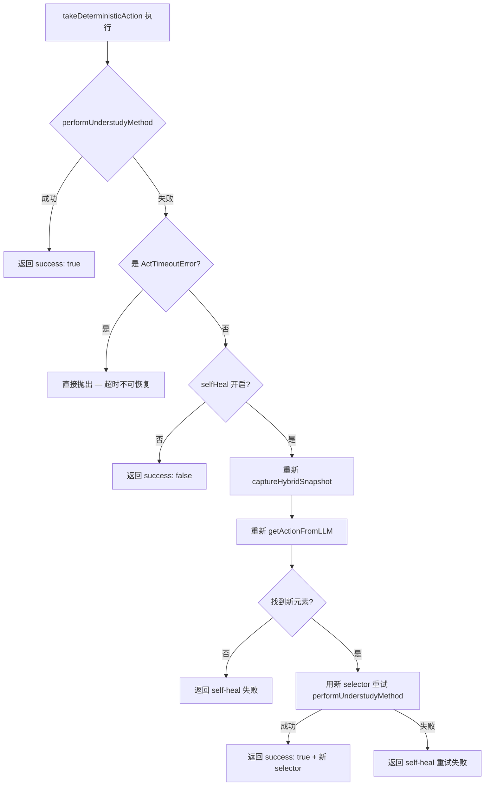
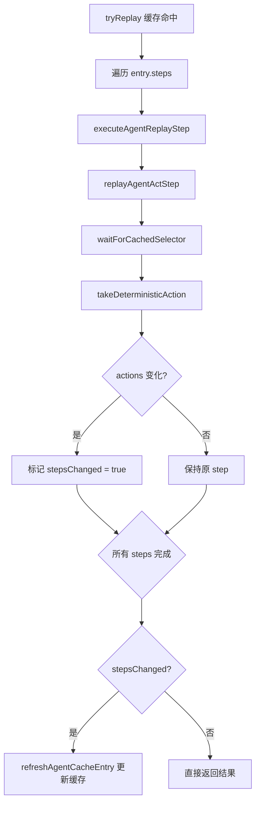

# PD-03.18 Stagehand — LLM 驱动 DOM 自愈与分层超时保护

> 文档编号：PD-03.18
> 来源：Stagehand `packages/core/lib/v3/handlers/actHandler.ts`
> GitHub：https://github.com/browserbase/stagehand.git
> 问题域：PD-03 容错与重试 Fault Tolerance & Retry
> 状态：可复用方案

---

## 第 1 章 问题与动机（≥ 30 行）

### 1.1 核心问题

浏览器自动化中 DOM 元素的选择器（XPath/CSS）天然不稳定：页面动态渲染、A/B 测试、前端框架版本升级都会导致之前有效的选择器失效。传统的 Playwright/Puppeteer 脚本在选择器失效时直接抛出异常，需要人工维护选择器映射表。

Stagehand 面临的核心容错挑战：

1. **DOM 选择器漂移**：LLM 推理出的 XPath 选择器在执行时可能因页面状态变化而找不到元素
2. **缓存条目过期**：缓存的操作序列（ActCache/AgentCache）在页面结构变化后 replay 失败
3. **LLM 推理不确定性**：LLM 返回的 element ID 可能无法映射到有效的 XPath
4. **多步操作级联失败**：两步操作（twoStep）中第一步成功但第二步因 DOM 变化失败
5. **网络与 DOM 稳定性**：操作执行前页面可能仍有未完成的网络请求导致 DOM 不稳定

### 1.2 Stagehand 的解法概述

Stagehand 实现了一套三层容错体系：

1. **ActHandler selfHeal 自愈**（`actHandler.ts:337-436`）：DOM 操作失败时，重新捕获页面快照（captureHybridSnapshot），通过 LLM 重新推理定位元素，用新选择器重试操作
2. **AgentCache/ActCache 缓存自修复**（`AgentCache.ts:609-611`, `ActCache.ts:259-270`）：replay 缓存条目时如果选择器发生变化，自动检测差异并 refreshCacheEntry 更新缓存
3. **分层超时保护**（`timeoutGuard.ts:5-21`, `timeoutConfig.ts:12-28`）：createTimeoutGuard 创建可复用的超时检查函数，在操作流程的每个关键节点调用 ensureTimeRemaining()
4. **DOM 网络静默等待**（`actHandlerUtils.ts:539-695`）：waitForDomNetworkQuiet 监听 CDP Network 事件，等待所有网络请求完成后再执行操作
5. **LLM 调用重试**（`OpenAIClient.ts:50`, `AnthropicClient.ts:259`）：LLM 客户端内置递减重试计数器，schema 验证失败或工具调用解析失败时自动重试

### 1.3 设计思想

| 设计原则 | 具体实现 | 理由 | 替代方案 |
|----------|----------|------|----------|
| LLM 即容错引擎 | selfHeal 用 LLM 重新推理替代固定重试 | DOM 变化后原选择器无意义，需要重新理解页面 | 固定选择器映射表（脆弱） |
| 缓存自进化 | replay 时检测选择器变化并自动更新缓存 | 避免缓存永久失效，下次 replay 直接命中 | 缓存失效后完全重新执行（浪费） |
| 超时预算制 | createTimeoutGuard 在流程各节点检查剩余时间 | 避免单步操作耗尽整个操作的超时预算 | 单一 Promise.race 超时（粒度粗） |
| 非阻塞降级 | waitForCachedSelector 超时后继续执行而非抛异常 | 选择器等待失败不一定意味着操作失败 | 严格等待（可能误杀） |
| 错误类型分层 | ActTimeoutError 穿透 selfHeal，普通错误触发自愈 | 超时是全局约束不应被局部重试消耗 | 统一错误处理（无法区分可恢复/不可恢复） |

---

## 第 2 章 源码实现分析（≥ 60 行，核心章节）

### 2.1 架构概览

Stagehand 的容错体系由三层组成，从外到内依次是：超时保护层、自愈层、缓存自修复层。

```
┌─────────────────────────────────────────────────────────┐
│                   V3 (Stagehand 入口)                    │
│  selfHeal: true (默认开启)                               │
├─────────────────────────────────────────────────────────┤
│  ┌─────────────────────────────────────────────────┐    │
│  │         TimeoutGuard (超时预算层)                 │    │
│  │  createTimeoutGuard(timeoutMs, errorFactory)     │    │
│  │  → ensureTimeRemaining() 在每个关键节点调用       │    │
│  ├─────────────────────────────────────────────────┤    │
│  │         ActHandler.act() (操作执行层)             │    │
│  │  1. waitForDomNetworkQuiet → DOM 稳定            │    │
│  │  2. captureHybridSnapshot → 页面快照              │    │
│  │  3. getActionFromLLM → LLM 推理                  │    │
│  │  4. takeDeterministicAction → 执行操作            │    │
│  │     ├─ 成功 → 返回结果                           │    │
│  │     └─ 失败 → selfHeal 自愈                      │    │
│  │        ├─ 重新 captureHybridSnapshot             │    │
│  │        ├─ 重新 getActionFromLLM                  │    │
│  │        └─ 用新选择器重试 performUnderstudyMethod  │    │
│  ├─────────────────────────────────────────────────┤    │
│  │     ActCache / AgentCache (缓存自修复层)          │    │
│  │  tryReplay → replayCachedActions                 │    │
│  │  → takeDeterministicAction (含 selfHeal)         │    │
│  │  → haveActionsChanged? → refreshCacheEntry       │    │
│  └─────────────────────────────────────────────────┘    │
├─────────────────────────────────────────────────────────┤
│  LLM Client 层 (OpenAI/Anthropic)                       │
│  retries 递减计数器：schema 验证失败 / 解析失败时重试     │
└─────────────────────────────────────────────────────────┘
```

### 2.2 核心实现

#### 2.2.1 ActHandler selfHeal 自愈机制



对应源码 `packages/core/lib/v3/handlers/actHandler.ts:330-436`：

```typescript
// ActHandler.takeDeterministicAction — selfHeal 核心逻辑
catch (err) {
  if (err instanceof ActTimeoutError) {
    throw err; // 超时错误穿透，不进入自愈
  }
  const msg = err instanceof Error ? err.message : String(err);

  if (this.selfHeal) {
    v3Logger({
      category: "action",
      message: "Error performing action. Reprocessing the page and trying again",
      level: 1,
      auxiliary: {
        error: { value: msg, type: "string" },
        action: { value: JSON.stringify(action), type: "object" },
      },
    });

    try {
      // 重新捕获页面快照
      ensureTimeRemaining?.();
      const { combinedTree, combinedXpathMap } =
        await captureHybridSnapshot(page, { experimental: true });

      // 用 LLM 重新推理定位元素
      ensureTimeRemaining?.();
      const { action: fallbackAction, response: fallbackResponse } =
        await this.getActionFromLLM({
          instruction,
          domElements: combinedTree,
          xpathMap: combinedXpathMap,
          llmClient: effectiveClient,
          requireMethodAndArguments: false, // 放宽要求
        });

      // 用新选择器重试
      let newSelector = action.selector;
      if (fallbackAction?.selector) {
        newSelector = fallbackAction.selector;
      }

      ensureTimeRemaining?.();
      await performUnderstudyMethod(
        page, page.mainFrame(), method,
        newSelector, resolvedArgs, settleTimeout,
      );

      return {
        success: true,
        message: `Action [${method}] performed successfully on selector: ${newSelector}`,
        actions: [{ selector: newSelector, description: action.description, method, arguments: placeholderArgs }],
      };
    } catch (retryErr) {
      if (retryErr instanceof ActTimeoutError) throw retryErr;
      return { success: false, message: `Failed to perform act after self-heal: ${retryMsg}` };
    }
  }
}
```

关键设计点：
- `requireMethodAndArguments: false`（`actHandler.ts:381`）：自愈时放宽 LLM 输出要求，只需要定位到元素即可，方法和参数沿用原始值
- `ensureTimeRemaining?.()`（`actHandler.ts:361,373,400`）：自愈流程中持续检查超时预算，避免自愈本身耗尽时间
- ActTimeoutError 穿透（`actHandler.ts:331,424`）：超时错误不进入自愈循环，直接向上抛出

#### 2.2.2 AgentCache 缓存自修复



对应源码 `packages/core/lib/v3/cache/AgentCache.ts:572-624`：

```typescript
// AgentCache.replayAgentCacheEntry — 缓存 replay 与自修复
private async replayAgentCacheEntry(
  context: AgentCacheContext,
  entry: CachedAgentEntry,
  llmClientOverride?: LLMClient,
): Promise<AgentResult | null> {
  const ctx = this.getContext();
  const handler = this.getActHandler();
  if (!ctx || !handler) return null;
  const effectiveClient = llmClientOverride ?? this.getDefaultLlmClient();
  try {
    const updatedSteps: AgentReplayStep[] = [];
    let stepsChanged = false;
    for (const step of entry.steps ?? []) {
      const replayedStep =
        (await this.executeAgentReplayStep(
          step, ctx, handler, effectiveClient, context.variables,
        )) ?? step;
      stepsChanged ||= replayedStep !== step; // 引用比较检测变化
      updatedSteps.push(replayedStep);
    }
    // ...
    if (stepsChanged) {
      await this.refreshAgentCacheEntry(context, entry, updatedSteps);
    }
    return result;
  } catch (err) {
    this.logger({ category: "cache", message: "agent cache replay failed", level: 1 });
    return null; // replay 失败返回 null，调用方回退到正常执行
  }
}
```

### 2.3 实现细节

#### 超时预算守卫（TimeoutGuard）

`packages/core/lib/v3/handlers/handlerUtils/timeoutGuard.ts:5-21` 实现了一个轻量级的超时预算模式：

```typescript
export function createTimeoutGuard(
  timeoutMs?: number,
  errorFactory?: (timeoutMs: number) => Error,
): TimeoutGuard {
  if (!timeoutMs || timeoutMs <= 0) {
    return () => {}; // 无超时时返回空函数
  }
  const startTime = Date.now();
  return () => {
    if (Date.now() - startTime >= timeoutMs) {
      const err = errorFactory?.(timeoutMs) ?? new TimeoutError("operation", timeoutMs);
      throw err;
    }
  };
}
```

这个模式的精妙之处在于：它不是用 `setTimeout` + `Promise.race` 的被动超时，而是在流程的每个关键节点主动检查。这样可以在 LLM 调用之前就发现超时，避免发起注定会被取消的昂贵 API 调用。

在 `actHandler.ts:act()` 中，`ensureTimeRemaining()` 被调用了 7 次（`actHandler.ts:149,154,166,190,206,234,247`），覆盖了：DOM 稳定等待前、快照捕获后、LLM 推理前、操作执行前、二次快照前、二次推理前、二次操作前。

#### waitForDomNetworkQuiet — 网络静默检测

`actHandlerUtils.ts:539-695` 实现了基于 CDP 事件的网络静默检测：

- 监听 `Network.requestWillBeSent` / `Network.loadingFinished` / `Network.loadingFailed` 追踪 inflight 请求
- 忽略 WebSocket 和 EventSource 长连接
- 500ms 无新请求视为静默
- 2 秒超时强制完成 stalled 请求（`actHandlerUtils.ts:646-663`）
- 整体超时兜底（默认 5 秒）

#### LLM 客户端重试

OpenAI 客户端（`OpenAIClient.ts:50`）默认 `retries = 3`，在三种场景递减重试：
1. response_model schema 解析失败（`OpenAIClient.ts:177`）
2. o1/o3 模型工具调用 JSON 解析失败（`OpenAIClient.ts:329`）
3. Zod schema 验证失败（`OpenAIClient.ts:370`）

Anthropic 客户端（`AnthropicClient.ts:259`）在 tool_use 响应缺失时重试，最多 5 次。

#### 非阻塞选择器等待

`cache/utils.ts:22-48` 的 `waitForCachedSelector` 在选择器等待超时时只记录警告日志，不抛异常：

```typescript
try {
  await page.waitForSelector(selector, {
    state: "attached",
    timeout: timeout ?? DEFAULT_WAIT_TIMEOUT_MS, // 15s
  });
} catch (err) {
  logger({ category: "cache", message: `waitForSelector failed... proceeding anyway` });
}
```

这是一个关键的降级决策：选择器等待失败后继续执行，因为 `takeDeterministicAction` 内部的 selfHeal 机制会处理实际的操作失败。


---

## 第 3 章 迁移指南（≥ 40 行）

### 3.1 迁移清单

**阶段 1：超时预算守卫（1 天）**
- [ ] 实现 `createTimeoutGuard` 工厂函数
- [ ] 在操作流程的关键节点插入 `ensureTimeRemaining()` 调用
- [ ] 定义操作级别的 TimeoutError 子类（如 ActTimeoutError）

**阶段 2：selfHeal 自愈机制（2-3 天）**
- [ ] 实现"快照-推理-重试"三步自愈流程
- [ ] 确保超时错误穿透自愈层（不被 catch 吞掉）
- [ ] 自愈时放宽 LLM 输出要求（只需定位，不需完整方法签名）
- [ ] 在自愈流程中持续检查超时预算

**阶段 3：缓存自修复（1-2 天）**
- [ ] 实现缓存 replay 时的选择器变化检测（引用比较或深度比较）
- [ ] 变化检测通过后自动 refreshCacheEntry
- [ ] replay 失败时返回 null 而非抛异常，让调用方回退到正常执行

**阶段 4：非阻塞降级（0.5 天）**
- [ ] 选择器等待超时时记录警告但继续执行
- [ ] 网络静默检测超时时强制继续

### 3.2 适配代码模板

#### 超时预算守卫（TypeScript，可直接复用）

```typescript
export type TimeoutGuard = () => void;

export class OperationTimeoutError extends Error {
  constructor(public readonly operation: string, public readonly timeoutMs: number) {
    super(`${operation} timed out after ${timeoutMs}ms`);
    this.name = 'OperationTimeoutError';
  }
}

export function createTimeoutGuard(
  timeoutMs?: number,
  errorFactory?: (ms: number) => Error,
): TimeoutGuard {
  if (!timeoutMs || timeoutMs <= 0) return () => {};
  const startTime = Date.now();
  return () => {
    if (Date.now() - startTime >= timeoutMs) {
      throw errorFactory?.(timeoutMs) ?? new OperationTimeoutError('operation', timeoutMs);
    }
  };
}

// 使用示例
async function executeWithBudget(timeoutMs: number) {
  const ensureTime = createTimeoutGuard(timeoutMs, (ms) => new OperationTimeoutError('myOp', ms));
  
  ensureTime(); // 检查点 1
  await step1();
  
  ensureTime(); // 检查点 2：如果 step1 耗时过长，这里直接抛出
  await step2();
  
  ensureTime(); // 检查点 3
  await step3();
}
```

#### selfHeal 自愈模式（通用模板）

```typescript
interface SelfHealConfig<TContext, TResult> {
  execute: (ctx: TContext) => Promise<TResult>;
  refreshContext: () => Promise<TContext>;
  isRecoverable: (err: unknown) => boolean;
  ensureTimeRemaining?: () => void;
}

async function withSelfHeal<TContext, TResult>(
  ctx: TContext,
  config: SelfHealConfig<TContext, TResult>,
): Promise<TResult> {
  try {
    return await config.execute(ctx);
  } catch (err) {
    if (!config.isRecoverable(err)) throw err;
    
    config.ensureTimeRemaining?.();
    const freshCtx = await config.refreshContext();
    
    config.ensureTimeRemaining?.();
    return await config.execute(freshCtx);
  }
}
```

### 3.3 适用场景

| 场景 | 适用度 | 说明 |
|------|--------|------|
| 浏览器自动化 / RPA | ⭐⭐⭐ | 完美匹配：DOM 选择器漂移是核心痛点 |
| LLM Agent 工具调用 | ⭐⭐⭐ | selfHeal 模式可泛化为"重新感知环境后重试" |
| API 爬虫 / 数据采集 | ⭐⭐ | 页面结构变化时的自适应抓取 |
| 缓存系统 | ⭐⭐ | 缓存自修复模式可用于任何有"replay"语义的缓存 |
| 纯后端 API 调用 | ⭐ | 超时预算模式有用，但 selfHeal 不太适用 |

---

## 第 4 章 测试用例（≥ 20 行）

```typescript
import { describe, it, expect, vi, beforeEach } from 'vitest';
import { createTimeoutGuard } from './timeoutGuard';

describe('TimeoutGuard', () => {
  it('should not throw when within budget', () => {
    const guard = createTimeoutGuard(5000);
    expect(() => guard()).not.toThrow();
  });

  it('should throw when budget exhausted', async () => {
    const guard = createTimeoutGuard(10);
    await new Promise(r => setTimeout(r, 20));
    expect(() => guard()).toThrow(/timed out/);
  });

  it('should return noop when no timeout specified', () => {
    const guard = createTimeoutGuard(undefined);
    expect(() => guard()).not.toThrow();
  });

  it('should use custom error factory', async () => {
    class MyError extends Error { constructor(ms: number) { super(`custom ${ms}`); } }
    const guard = createTimeoutGuard(10, (ms) => new MyError(ms));
    await new Promise(r => setTimeout(r, 20));
    expect(() => guard()).toThrow(MyError);
  });
});

describe('SelfHeal pattern', () => {
  it('should succeed on first attempt without healing', async () => {
    const execute = vi.fn().mockResolvedValue({ success: true });
    const refreshContext = vi.fn();
    
    const result = await withSelfHeal({ selector: 'xpath=//button' }, {
      execute,
      refreshContext,
      isRecoverable: () => true,
    });
    
    expect(result).toEqual({ success: true });
    expect(refreshContext).not.toHaveBeenCalled();
  });

  it('should self-heal on recoverable error', async () => {
    const execute = vi.fn()
      .mockRejectedValueOnce(new Error('element not found'))
      .mockResolvedValue({ success: true, selector: 'xpath=//button[2]' });
    const refreshContext = vi.fn().mockResolvedValue({ selector: 'xpath=//button[2]' });
    
    const result = await withSelfHeal({ selector: 'xpath=//button' }, {
      execute,
      refreshContext,
      isRecoverable: (err) => !(err instanceof TypeError),
    });
    
    expect(result).toEqual({ success: true, selector: 'xpath=//button[2]' });
    expect(refreshContext).toHaveBeenCalledOnce();
  });

  it('should propagate non-recoverable errors', async () => {
    const timeoutErr = new TypeError('timeout');
    const execute = vi.fn().mockRejectedValue(timeoutErr);
    
    await expect(withSelfHeal({}, {
      execute,
      refreshContext: vi.fn(),
      isRecoverable: (err) => !(err instanceof TypeError),
    })).rejects.toThrow(TypeError);
  });
});

describe('Cache self-repair', () => {
  it('should detect action selector changes', () => {
    const original = [{ selector: 'xpath=//div[1]', method: 'click', arguments: [] }];
    const updated = [{ selector: 'xpath=//div[2]', method: 'click', arguments: [] }];
    expect(haveActionsChanged(original, updated)).toBe(true);
  });

  it('should not flag unchanged actions', () => {
    const actions = [{ selector: 'xpath=//div[1]', method: 'click', arguments: [] }];
    expect(haveActionsChanged(actions, [...actions])).toBe(false);
  });
});
```


---

## 第 5 章 跨域关联

| 关联域 | 关系类型 | 说明 |
|--------|----------|------|
| PD-01 上下文管理 | 协同 | selfHeal 需要重新捕获页面快照（captureHybridSnapshot），快照大小直接影响 LLM 上下文窗口消耗 |
| PD-04 工具系统 | 依赖 | ActHandler 依赖 performUnderstudyMethod 工具分发表（METHOD_HANDLER_MAP），selfHeal 复用同一工具体系 |
| PD-06 记忆持久化 | 协同 | AgentCache/ActCache 的缓存自修复机制本质上是"记忆自进化"，与记忆持久化域的更新机制互补 |
| PD-08 搜索与检索 | 协同 | captureHybridSnapshot 是一种页面级的"检索"操作，selfHeal 的"重新快照+重新推理"等价于"重新检索+重新排序" |
| PD-11 可观测性 | 依赖 | 所有容错路径都通过 v3Logger 记录结构化日志（category/level/auxiliary），便于事后分析自愈成功率 |

---

## 第 6 章 来源文件索引

| 文件 | 行范围 | 关键实现 |
|------|--------|----------|
| `packages/core/lib/v3/handlers/actHandler.ts` | L39-L84 | ActHandler 类定义，selfHeal 配置项 |
| `packages/core/lib/v3/handlers/actHandler.ts` | L137-L269 | act() 主流程：快照→推理→执行→twoStep |
| `packages/core/lib/v3/handlers/actHandler.ts` | L271-L445 | takeDeterministicAction + selfHeal 自愈逻辑 |
| `packages/core/lib/v3/cache/AgentCache.ts` | L40-L77 | AgentCache 类定义与依赖注入 |
| `packages/core/lib/v3/cache/AgentCache.ts` | L572-L624 | replayAgentCacheEntry 缓存 replay + 自修复 |
| `packages/core/lib/v3/cache/AgentCache.ts` | L863-L897 | refreshAgentCacheEntry 缓存更新 |
| `packages/core/lib/v3/cache/ActCache.ts` | L196-L280 | replayCachedActions + refreshCacheEntry |
| `packages/core/lib/v3/cache/utils.ts` | L22-L48 | waitForCachedSelector 非阻塞选择器等待 |
| `packages/core/lib/v3/handlers/handlerUtils/timeoutGuard.ts` | L5-L21 | createTimeoutGuard 超时预算工厂 |
| `packages/core/lib/v3/timeoutConfig.ts` | L12-L28 | withTimeout Promise.race 超时包装 |
| `packages/core/lib/v3/handlers/handlerUtils/actHandlerUtils.ts` | L539-L695 | waitForDomNetworkQuiet 网络静默检测 |
| `packages/core/lib/v3/llm/OpenAIClient.ts` | L47-L51 | OpenAI retries=3 默认重试 |
| `packages/core/lib/v3/llm/AnthropicClient.ts` | L259-L265 | Anthropic tool_use 缺失重试 |
| `packages/core/lib/v3/types/public/sdkErrors.ts` | L334-L345 | TimeoutError / ActTimeoutError 错误层级 |
| `packages/core/lib/v3/v3.ts` | L648 | selfHeal 默认值 true |

---

## 第 7 章 横向对比维度

> **重要：** 本章用于自动填充 Butcher Wiki 的横向对比表。
> 必须严格按以下 JSON 格式输出，放在 `comparison_data` 代码块中。

```json comparison_data
{
  "project": "Stagehand",
  "dimensions": {
    "截断/错误检测": "LLM 推理结果通过 Zod schema 验证 + elementId 格式校验 + XPath 映射检查三重检测",
    "重试/恢复策略": "selfHeal 自愈：重新捕获页面快照 + LLM 重新推理定位 + 新选择器重试",
    "超时保护": "createTimeoutGuard 预算制：流程各节点主动检查剩余时间，非 Promise.race 被动超时",
    "优雅降级": "waitForCachedSelector 超时后继续执行；缓存 replay 失败返回 null 回退正常执行",
    "重试策略": "OpenAI retries=3 递减；Anthropic 最多 5 次；selfHeal 单次重试（非循环）",
    "降级方案": "selfHeal 放宽 requireMethodAndArguments=false；twoStep 第二步失败返回第一步结果",
    "错误分类": "ActTimeoutError 穿透自愈层；UnderstudyCommandException 触发自愈；schema 验证失败触发 LLM 重试",
    "恢复机制": "缓存自修复：replay 时检测选择器变化自动 refreshCacheEntry 更新缓存条目",
    "自愈能力": "LLM 驱动的 DOM 自愈：失败后重新感知页面状态，用 AI 重新定位元素而非固定重试",
    "网络稳定性保障": "waitForDomNetworkQuiet 基于 CDP 事件追踪 inflight 请求，500ms 静默窗口 + 2s stalled 强制完成"
  }
}
```

### 域元数据补充

```json domain_metadata
{
  "solution_summary": "Stagehand 用 LLM 驱动的 selfHeal 自愈机制实现 DOM 操作容错：失败后重新捕获页面快照并通过 LLM 重新推理定位元素，配合 createTimeoutGuard 预算制超时和缓存自修复",
  "description": "浏览器自动化场景下 DOM 选择器漂移的 AI 自愈容错",
  "sub_problems": [
    "DOM 选择器漂移：页面动态渲染导致 LLM 推理出的 XPath 在执行时失效",
    "缓存 replay 选择器过期：缓存的操作序列因页面结构变化无法原样回放",
    "网络请求未完成时 DOM 不稳定：操作执行前页面仍有 inflight 请求导致元素未就绪",
    "自愈与超时预算冲突：selfHeal 的 LLM 重新推理可能耗尽操作的超时预算"
  ],
  "best_practices": [
    "超时用预算制而非 Promise.race：在流程各节点主动检查剩余时间，避免发起注定被取消的昂贵调用",
    "自愈时放宽输出要求：只需定位元素，方法和参数沿用原始值，降低 LLM 推理难度",
    "缓存 replay 失败返回 null 而非抛异常：让调用方无感回退到正常执行路径",
    "超时错误穿透自愈层：不可恢复的全局约束不应被局部重试消耗"
  ]
}
```

