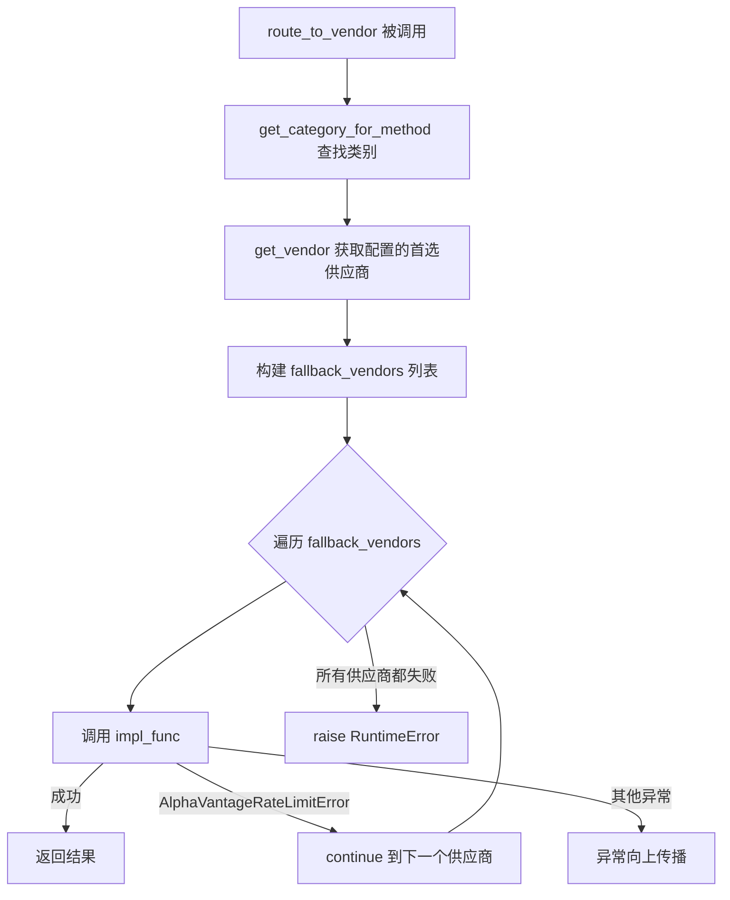
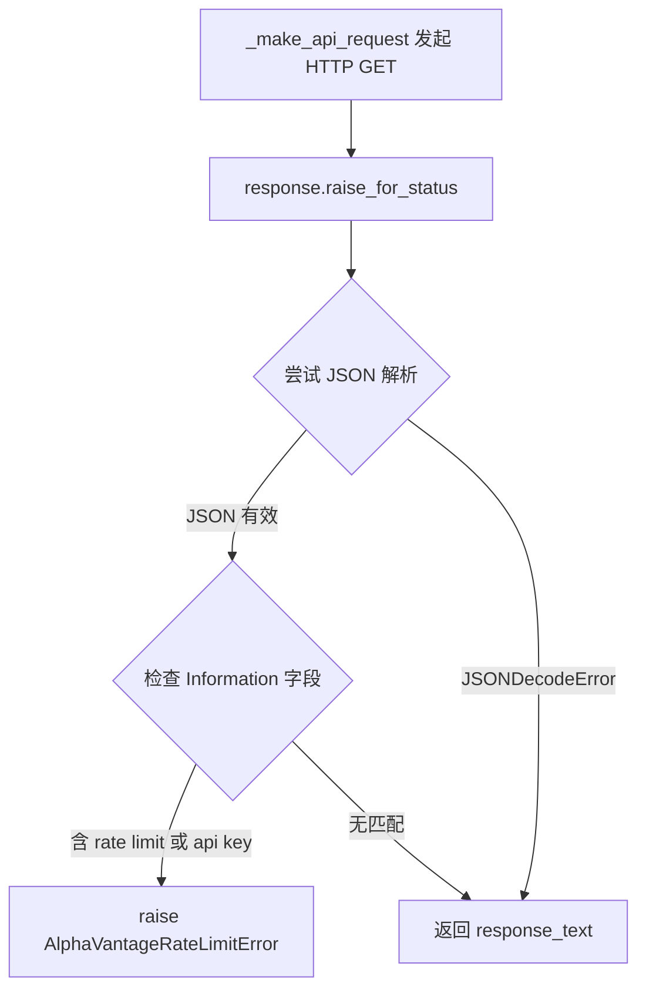
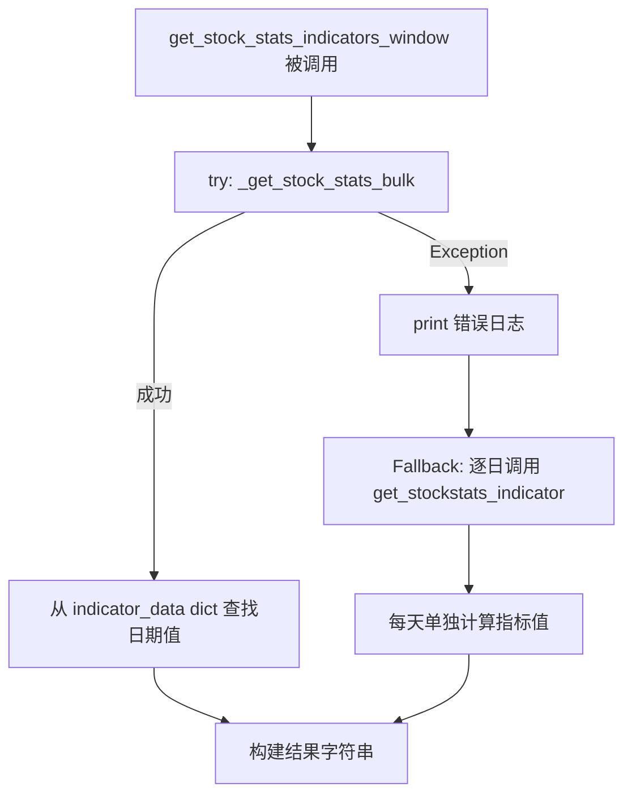

# PD-03.NN TradingAgents — 数据供应商降级链与批量计算容错

> 文档编号：PD-03.NN
> 来源：TradingAgents `tradingagents/dataflows/interface.py`, `tradingagents/dataflows/y_finance.py`
> GitHub：https://github.com/TauricResearch/TradingAgents.git
> 问题域：PD-03 容错与重试 Fault Tolerance & Retry
> 状态：可复用方案

---

## 第 1 章 问题与动机

### 1.1 核心问题

金融数据 Agent 系统高度依赖外部数据供应商（Alpha Vantage、Yahoo Finance 等），这些 API 存在三类典型故障：

1. **速率限制（Rate Limit）**：Alpha Vantage 免费 tier 限制 5 次/分钟、500 次/天，高频交易分析极易触发
2. **供应商不可用**：单一供应商宕机或返回错误数据，直接导致整个分析流水线中断
3. **计算模式失败**：批量技术指标计算（stockstats bulk 模式）可能因数据质量问题抛出异常

在多 Agent 交易系统中，4 类分析师（Market、Social、News、Fundamentals）并行调用数据工具，任何一个数据源失败都会导致该分析师无法产出报告，进而影响后续的 Bull/Bear 辩论和风险评估环节。

### 1.2 TradingAgents 的解法概述

TradingAgents 采用三层容错架构：

1. **供应商降级链（Vendor Fallback Chain）**：`route_to_vendor()` 在 `interface.py:134-162` 中实现，主供应商失败时自动切换到备选供应商，仅对 `AlphaVantageRateLimitError` 触发降级
2. **批量/逐日计算降级**：`get_stock_stats_indicators_window()` 在 `y_finance.py:141-175` 中实现 bulk 模式失败后回退到逐日单点计算
3. **API 层错误检测**：`_make_api_request()` 在 `alpha_vantage_common.py:42-83` 中解析 JSON 响应，检测 rate limit 关键词并抛出专用异常类
4. **函数级 try-except 兜底**：所有 yfinance 数据函数（fundamentals、balance_sheet、cashflow 等）在 `y_finance.py:296-464` 中统一用 try-except 包裹，返回错误字符串而非抛出异常
5. **配置驱动的供应商选择**：`config.py` + `default_config.py` 支持按类别和按工具粒度配置首选供应商，降级链基于此配置动态构建

### 1.3 设计思想

| 设计原则 | 具体实现 | 理由 | 替代方案 |
|----------|----------|------|----------|
| 错误类型精确匹配 | 仅 `AlphaVantageRateLimitError` 触发降级，其他异常直接抛出 | 避免掩盖真正的 bug（如参数错误），只对可恢复错误做降级 | 捕获所有 Exception 做降级（风险：掩盖编程错误） |
| 配置驱动降级顺序 | `get_vendor()` 支持逗号分隔的多供应商配置 | 不同部署环境可能有不同的 API key 和配额 | 硬编码降级顺序（不灵活） |
| 计算模式分级降级 | bulk 批量计算失败 → 逐日单点计算 | bulk 模式性能好但对数据质量要求高，逐日模式慢但更稳健 | 只用逐日模式（性能差）或只用 bulk（不稳健） |
| 错误字符串化而非异常 | yfinance 函数返回 `"Error retrieving..."` 字符串 | LangGraph ToolNode 需要字符串返回值，异常会中断 Agent 工具调用链 | 抛出异常让 LangGraph 处理（需要额外的错误处理中间件） |

---

## 第 2 章 源码实现分析

### 2.1 架构概览

TradingAgents 的容错体系分布在数据流层（dataflows），通过抽象工具层（agent_utils）暴露给 LangGraph Agent 图：

```
┌─────────────────────────────────────────────────────────┐
│                   LangGraph Agent 图                     │
│  Market Analyst → Social Analyst → News → Fundamentals  │
│         ↓              ↓            ↓          ↓        │
│      ToolNode       ToolNode    ToolNode    ToolNode    │
└────────┬───────────────┬──────────┬──────────┬──────────┘
         │               │          │          │
         ▼               ▼          ▼          ▼
┌─────────────────────────────────────────────────────────┐
│              agent_utils (抽象工具层)                     │
│  get_stock_data / get_indicators / get_news / ...       │
│         全部调用 route_to_vendor()                       │
└────────────────────────┬────────────────────────────────┘
                         │
                         ▼
┌─────────────────────────────────────────────────────────┐
│              interface.py (路由 + 降级链)                 │
│  route_to_vendor() → 构建 fallback_vendors 列表          │
│  遍历供应商 → try impl_func() → catch RateLimitError    │
│                    → continue 到下一个供应商              │
└────────┬───────────────────────────────┬────────────────┘
         │                               │
         ▼                               ▼
┌──────────────────┐          ┌──────────────────────┐
│   Alpha Vantage  │          │     Yahoo Finance    │
│  _make_api_req() │          │  yf.Ticker / Search  │
│  ↓ 检测 rate     │          │  ↓ try-except 兜底   │
│    limit 关键词   │          │    返回错误字符串     │
└──────────────────┘          └──────────────────────┘
```

### 2.2 核心实现

#### 2.2.1 供应商降级链



对应源码 `tradingagents/dataflows/interface.py:134-162`：

```python
def route_to_vendor(method: str, *args, **kwargs):
    """Route method calls to appropriate vendor implementation with fallback support."""
    category = get_category_for_method(method)
    vendor_config = get_vendor(category, method)
    primary_vendors = [v.strip() for v in vendor_config.split(',')]

    if method not in VENDOR_METHODS:
        raise ValueError(f"Method '{method}' not supported")

    # Build fallback chain: primary vendors first, then remaining available vendors
    all_available_vendors = list(VENDOR_METHODS[method].keys())
    fallback_vendors = primary_vendors.copy()
    for vendor in all_available_vendors:
        if vendor not in fallback_vendors:
            fallback_vendors.append(vendor)

    for vendor in fallback_vendors:
        if vendor not in VENDOR_METHODS[method]:
            continue

        vendor_impl = VENDOR_METHODS[method][vendor]
        impl_func = vendor_impl[0] if isinstance(vendor_impl, list) else vendor_impl

        try:
            return impl_func(*args, **kwargs)
        except AlphaVantageRateLimitError:
            continue  # Only rate limits trigger fallback

    raise RuntimeError(f"No available vendor for '{method}'")
```

关键设计点：
- `interface.py:138`：支持逗号分隔的多供应商配置（如 `"alpha_vantage,yfinance"`）
- `interface.py:144-148`：降级链 = 配置的首选供应商 + 剩余可用供应商，确保所有供应商都有机会被尝试
- `interface.py:159-160`：**仅** `AlphaVantageRateLimitError` 触发降级，其他异常直接传播

#### 2.2.2 API 层速率限制检测



对应源码 `tradingagents/dataflows/alpha_vantage_common.py:42-83`：

```python
def _make_api_request(function_name: str, params: dict) -> dict | str:
    """Helper function to make API requests and handle responses."""
    api_params = params.copy()
    api_params.update({
        "function": function_name,
        "apikey": get_api_key(),
        "source": "trading_agents",
    })

    response = requests.get(API_BASE_URL, params=api_params)
    response.raise_for_status()

    response_text = response.text

    # Check if response is JSON (error responses are typically JSON)
    try:
        response_json = json.loads(response_text)
        # Check for rate limit error
        if "Information" in response_json:
            info_message = response_json["Information"]
            if "rate limit" in info_message.lower() or "api key" in info_message.lower():
                raise AlphaVantageRateLimitError(
                    f"Alpha Vantage rate limit exceeded: {info_message}"
                )
    except json.JSONDecodeError:
        # Response is not JSON (likely CSV data), which is normal
        pass

    return response_text
```

关键设计点：
- `alpha_vantage_common.py:38-39`：专用异常类 `AlphaVantageRateLimitError` 继承自 `Exception`，语义清晰
- `alpha_vantage_common.py:75-78`：通过关键词匹配（`"rate limit"` / `"api key"`）检测速率限制，因为 Alpha Vantage 的 rate limit 响应是 HTTP 200 + JSON body 而非 HTTP 429

#### 2.2.3 批量计算降级



对应源码 `tradingagents/dataflows/y_finance.py:141-175`：

```python
    # Optimized: Get stock data once and calculate indicators for all dates
    try:
        indicator_data = _get_stock_stats_bulk(symbol, indicator, curr_date)

        # Generate the date range we need
        current_dt = curr_date_dt
        date_values = []

        while current_dt >= before:
            date_str = current_dt.strftime('%Y-%m-%d')
            if date_str in indicator_data:
                indicator_value = indicator_data[date_str]
            else:
                indicator_value = "N/A: Not a trading day (weekend or holiday)"
            date_values.append((date_str, indicator_value))
            current_dt = current_dt - relativedelta(days=1)

        ind_string = ""
        for date_str, value in date_values:
            ind_string += f"{date_str}: {value}\n"

    except Exception as e:
        print(f"Error getting bulk stockstats data: {e}")
        # Fallback to original implementation if bulk method fails
        ind_string = ""
        curr_date_dt = datetime.strptime(curr_date, "%Y-%m-%d")
        while curr_date_dt >= before:
            indicator_value = get_stockstats_indicator(
                symbol, indicator, curr_date_dt.strftime("%Y-%m-%d")
            )
            ind_string += f"{curr_date_dt.strftime('%Y-%m-%d')}: {indicator_value}\n"
            curr_date_dt = curr_date_dt - relativedelta(days=1)
```

关键设计点：
- `y_finance.py:141-142`：bulk 模式一次性获取所有日期的指标值（`_get_stock_stats_bulk` 返回 `dict[date_str, value]`）
- `y_finance.py:165-175`：fallback 逐日调用 `get_stockstats_indicator`，每次独立获取单个日期的值
- 性能差异：bulk 模式 1 次 yfinance API 调用 + 1 次 stockstats 计算；逐日模式 N 次独立计算（N = look_back_days）

### 2.3 实现细节

#### 供应商注册表与方法映射

`VENDOR_METHODS` 字典（`interface.py:69-110`）是整个降级系统的核心数据结构，它将每个抽象方法映射到各供应商的具体实现：

```python
VENDOR_METHODS = {
    "get_stock_data": {
        "alpha_vantage": get_alpha_vantage_stock,
        "yfinance": get_YFin_data_online,
    },
    "get_indicators": {
        "alpha_vantage": get_alpha_vantage_indicator,
        "yfinance": get_stock_stats_indicators_window,
    },
    # ... 9 个方法，每个有 2 个供应商实现
}
```

#### 两级配置优先级

`get_vendor()` 函数（`interface.py:119-132`）实现了工具级 > 类别级的配置优先级：

```python
def get_vendor(category: str, method: str = None) -> str:
    config = get_config()
    # Check tool-level configuration first (if method provided)
    if method:
        tool_vendors = config.get("tool_vendors", {})
        if method in tool_vendors:
            return tool_vendors[method]
    # Fall back to category-level configuration
    return config.get("data_vendors", {}).get(category, "default")
```

这允许用户在 `default_config.py:24-33` 中按类别设置默认供应商，同时可以在 `tool_vendors` 中为特定工具覆盖。

#### CSV 过滤容错

`_filter_csv_by_date_range()`（`alpha_vantage_common.py:87-122`）在 CSV 日期过滤失败时返回原始数据而非抛出异常：

```python
    except Exception as e:
        print(f"Warning: Failed to filter CSV data by date range: {e}")
        return csv_data  # 返回未过滤的原始数据
```


---

## 第 3 章 迁移指南

### 3.1 迁移清单

**阶段 1：定义供应商接口与注册表**
- [ ] 定义统一的数据方法签名（如 `get_stock_data(symbol, start_date, end_date) -> str`）
- [ ] 为每个供应商实现具体函数
- [ ] 创建 `VENDOR_METHODS` 映射字典
- [ ] 定义供应商专用异常类（如 `RateLimitError`）

**阶段 2：实现路由与降级逻辑**
- [ ] 实现 `route_to_vendor()` 函数，支持配置驱动的降级链
- [ ] 在 API 层实现错误检测（解析响应 body 中的 rate limit 信号）
- [ ] 确保仅对可恢复错误触发降级

**阶段 3：实现计算模式降级**
- [ ] 识别可以 bulk 优化的计算路径
- [ ] 实现 bulk 模式 + 逐项 fallback 的 try-except 结构
- [ ] 添加日志记录降级事件

**阶段 4：集成到 Agent 工具层**
- [ ] 创建 `@tool` 装饰的抽象工具函数，内部调用 `route_to_vendor()`
- [ ] 确保工具函数返回字符串（而非抛出异常），兼容 LangGraph ToolNode

### 3.2 适配代码模板

以下是一个可直接复用的供应商降级路由器：

```python
"""vendor_router.py — 可复用的供应商降级路由器"""

from typing import Any, Callable, Dict, List, Optional


class VendorRateLimitError(Exception):
    """供应商速率限制异常，触发降级。"""
    pass


class VendorRouter:
    """配置驱动的供应商降级路由器。"""

    def __init__(
        self,
        vendor_methods: Dict[str, Dict[str, Callable]],
        default_vendors: Dict[str, str],
        tool_vendors: Optional[Dict[str, str]] = None,
        recoverable_errors: tuple = (VendorRateLimitError,),
    ):
        """
        Args:
            vendor_methods: {"method_name": {"vendor_a": func_a, "vendor_b": func_b}}
            default_vendors: {"category": "vendor_a"} 类别级默认供应商
            tool_vendors: {"method_name": "vendor_b"} 工具级覆盖（优先级更高）
            recoverable_errors: 触发降级的异常类型元组
        """
        self.vendor_methods = vendor_methods
        self.default_vendors = default_vendors
        self.tool_vendors = tool_vendors or {}
        self.recoverable_errors = recoverable_errors
        self._categories: Dict[str, List[str]] = {}

    def register_category(self, category: str, methods: List[str]):
        """注册方法到类别的映射。"""
        for method in methods:
            self._categories[method] = category

    def route(self, method: str, *args, **kwargs) -> Any:
        """路由方法调用到供应商实现，支持降级。"""
        if method not in self.vendor_methods:
            raise ValueError(f"Method '{method}' not registered")

        # 构建降级链：配置的首选 → 剩余可用
        primary = self._get_primary_vendor(method)
        all_vendors = list(self.vendor_methods[method].keys())
        fallback_chain = [v.strip() for v in primary.split(',')]
        for v in all_vendors:
            if v not in fallback_chain:
                fallback_chain.append(v)

        last_error = None
        for vendor in fallback_chain:
            if vendor not in self.vendor_methods[method]:
                continue
            try:
                return self.vendor_methods[method][vendor](*args, **kwargs)
            except self.recoverable_errors as e:
                last_error = e
                continue  # 仅可恢复错误触发降级

        raise RuntimeError(
            f"All vendors failed for '{method}': {last_error}"
        )

    def _get_primary_vendor(self, method: str) -> str:
        """获取首选供应商（工具级 > 类别级）。"""
        if method in self.tool_vendors:
            return self.tool_vendors[method]
        category = self._categories.get(method, "default")
        return self.default_vendors.get(category, "default")
```

批量计算降级模板：

```python
"""bulk_fallback.py — 批量计算降级模板"""

from typing import Callable, Dict, List, Any


def bulk_with_fallback(
    bulk_fn: Callable[..., Dict[str, Any]],
    single_fn: Callable[..., Any],
    keys: List[str],
    *args,
    **kwargs,
) -> Dict[str, Any]:
    """
    尝试 bulk 批量计算，失败则逐项 fallback。

    Args:
        bulk_fn: 批量计算函数，返回 {key: value}
        single_fn: 单项计算函数，接受 key 作为第一个参数
        keys: 需要计算的 key 列表
        *args, **kwargs: 传递给两个函数的额外参数
    """
    try:
        return bulk_fn(*args, **kwargs)
    except Exception as e:
        print(f"Bulk computation failed: {e}, falling back to single-item mode")
        result = {}
        for key in keys:
            try:
                result[key] = single_fn(key, *args, **kwargs)
            except Exception as inner_e:
                result[key] = f"Error: {inner_e}"
        return result
```

### 3.3 适用场景

| 场景 | 适用度 | 说明 |
|------|--------|------|
| 多数据源金融系统 | ⭐⭐⭐ | 完美匹配：多供应商 + rate limit 是金融数据的常态 |
| 多 LLM Provider Agent | ⭐⭐⭐ | 降级链模式可直接复用于 OpenAI → Anthropic → 本地模型的降级 |
| 爬虫/数据采集系统 | ⭐⭐ | 适用于多源采集，但可能需要更复杂的重试策略（指数退避） |
| 单一 API 调用场景 | ⭐ | 过度设计：如果只有一个供应商，直接 try-except 即可 |
| 需要事务一致性的场景 | ⭐ | 不适用：降级链不保证跨供应商的数据一致性 |

---

## 第 4 章 测试用例

```python
"""test_vendor_fallback.py — 基于 TradingAgents 真实函数签名的测试"""

import pytest
from unittest.mock import patch, MagicMock


class FakeRateLimitError(Exception):
    """模拟 AlphaVantageRateLimitError"""
    pass


class TestRouteToVendor:
    """测试 route_to_vendor 降级链逻辑"""

    def setup_method(self):
        """构建测试用的供应商注册表"""
        self.call_log = []

        def make_vendor_fn(name, should_fail=False, error_cls=None):
            def fn(*args, **kwargs):
                self.call_log.append(name)
                if should_fail:
                    raise (error_cls or Exception)("fail")
                return f"{name}_result"
            return fn

        self.vendors = {
            "get_stock_data": {
                "alpha_vantage": make_vendor_fn("av", should_fail=True, error_cls=FakeRateLimitError),
                "yfinance": make_vendor_fn("yf"),
            }
        }

    def test_primary_vendor_success(self):
        """主供应商成功时直接返回"""
        self.vendors["get_stock_data"]["alpha_vantage"] = lambda *a, **k: "av_ok"
        result = self._route("get_stock_data", "AAPL", "2024-01-01", "2024-03-01")
        assert result == "av_ok"

    def test_fallback_on_rate_limit(self):
        """主供应商 rate limit 时降级到备选"""
        result = self._route("get_stock_data", "AAPL", "2024-01-01", "2024-03-01")
        assert result == "yf_result"
        assert self.call_log == ["av", "yf"]

    def test_non_recoverable_error_propagates(self):
        """非 rate limit 异常不触发降级，直接传播"""
        self.vendors["get_stock_data"]["alpha_vantage"] = lambda *a, **k: (_ for _ in ()).throw(
            ValueError("bad param")
        )
        with pytest.raises(ValueError, match="bad param"):
            self._route("get_stock_data", "AAPL", "2024-01-01", "2024-03-01")

    def test_all_vendors_fail(self):
        """所有供应商都失败时抛出 RuntimeError"""
        for v in self.vendors["get_stock_data"]:
            self.vendors["get_stock_data"][v] = lambda *a, **k: (_ for _ in ()).throw(
                FakeRateLimitError("limit")
            )
        with pytest.raises(RuntimeError, match="No available vendor"):
            self._route("get_stock_data", "AAPL", "2024-01-01", "2024-03-01")

    def _route(self, method, *args, **kwargs):
        """简化版 route_to_vendor 用于测试"""
        fallback_vendors = list(self.vendors[method].keys())
        for vendor in fallback_vendors:
            try:
                return self.vendors[method][vendor](*args, **kwargs)
            except FakeRateLimitError:
                continue
        raise RuntimeError(f"No available vendor for '{method}'")


class TestBulkFallback:
    """测试批量计算降级逻辑"""

    def test_bulk_success(self):
        """bulk 模式成功时直接返回"""
        bulk_fn = lambda sym, ind, dt: {"2024-01-01": "42.0", "2024-01-02": "43.0"}
        single_fn = MagicMock()
        result = bulk_fn("AAPL", "rsi", "2024-01-02")
        assert "2024-01-01" in result
        single_fn.assert_not_called()

    def test_bulk_failure_triggers_single(self):
        """bulk 失败时回退到逐日计算"""
        def failing_bulk(*args):
            raise Exception("stockstats error")

        single_results = {"2024-01-01": "42.0", "2024-01-02": "43.0"}
        def single_fn(sym, ind, date):
            return single_results.get(date, "N/A")

        # 模拟 y_finance.py:165-175 的 fallback 逻辑
        try:
            result = failing_bulk("AAPL", "rsi", "2024-01-02")
        except Exception:
            result = {}
            for date in ["2024-01-01", "2024-01-02"]:
                result[date] = single_fn("AAPL", "rsi", date)

        assert result == {"2024-01-01": "42.0", "2024-01-02": "43.0"}


class TestApiRateLimitDetection:
    """测试 Alpha Vantage API 速率限制检测"""

    def test_rate_limit_detected_in_json(self):
        """JSON 响应中包含 rate limit 关键词时抛出专用异常"""
        import json
        response_json = {"Information": "Thank you for using Alpha Vantage! Our standard API rate limit is 25 requests per day."}
        info_message = response_json["Information"]
        assert "rate limit" in info_message.lower()

    def test_csv_response_passes_through(self):
        """CSV 响应（非 JSON）正常通过，不触发异常"""
        csv_data = "timestamp,open,high,low,close\n2024-01-01,150.0,155.0,149.0,153.0"
        try:
            import json
            json.loads(csv_data)
            assert False, "Should have raised JSONDecodeError"
        except json.JSONDecodeError:
            pass  # 预期行为：CSV 不是 JSON，跳过检测
```


---

## 第 5 章 跨域关联

| 关联域 | 关系类型 | 说明 |
|--------|----------|------|
| PD-04 工具系统 | 依赖 | `route_to_vendor()` 是工具层的核心路由，所有 `@tool` 装饰的函数通过它访问数据。工具注册表 `VENDOR_METHODS` 同时服务于工具系统和容错系统 |
| PD-01 上下文管理 | 协同 | 降级到 yfinance 时返回的数据格式可能不同（CSV vs JSON），影响 Agent 上下文中的数据解析。`create_msg_delete()` 在分析师切换时清理消息，避免降级产生的格式差异污染后续 Agent |
| PD-02 多 Agent 编排 | 协同 | 4 类分析师并行运行，每个都可能触发独立的降级链。LangGraph 的 `recursion_limit=100`（`propagation.py:51`）为降级重试提供了足够的执行空间 |
| PD-06 记忆持久化 | 协同 | `FinancialSituationMemory` 使用 BM25 检索历史经验，降级事件产生的分析结果也会被存入记忆，影响未来决策的经验检索 |
| PD-11 可观测性 | 依赖 | 当前降级事件仅通过 `print()` 输出日志，缺乏结构化的可观测性。`TradingAgentsGraph` 支持 `callbacks` 参数（`trading_graph.py:51`），可用于追踪降级事件 |

---

## 第 6 章 来源文件索引

| 文件 | 行范围 | 关键实现 |
|------|--------|----------|
| `tradingagents/dataflows/interface.py` | L63-66 | `VENDOR_LIST` 供应商列表定义 |
| `tradingagents/dataflows/interface.py` | L69-110 | `VENDOR_METHODS` 供应商方法映射表 |
| `tradingagents/dataflows/interface.py` | L119-132 | `get_vendor()` 两级配置优先级 |
| `tradingagents/dataflows/interface.py` | L134-162 | `route_to_vendor()` 降级链核心逻辑 |
| `tradingagents/dataflows/alpha_vantage_common.py` | L38-39 | `AlphaVantageRateLimitError` 异常类定义 |
| `tradingagents/dataflows/alpha_vantage_common.py` | L42-83 | `_make_api_request()` API 请求 + rate limit 检测 |
| `tradingagents/dataflows/alpha_vantage_common.py` | L87-122 | `_filter_csv_by_date_range()` CSV 过滤容错 |
| `tradingagents/dataflows/y_finance.py` | L141-175 | `get_stock_stats_indicators_window()` bulk/逐日降级 |
| `tradingagents/dataflows/y_finance.py` | L187-267 | `_get_stock_stats_bulk()` 批量指标计算 |
| `tradingagents/dataflows/y_finance.py` | L270-293 | `get_stockstats_indicator()` 单日指标计算（fallback 目标） |
| `tradingagents/dataflows/y_finance.py` | L296-464 | yfinance 数据函数（fundamentals/balance_sheet/cashflow 等）try-except 兜底 |
| `tradingagents/dataflows/config.py` | L1-31 | 配置管理（get_config/set_config） |
| `tradingagents/default_config.py` | L23-33 | 默认供应商配置（data_vendors/tool_vendors） |
| `tradingagents/agents/utils/core_stock_tools.py` | L7-22 | `get_stock_data` @tool 抽象层 |
| `tradingagents/agents/utils/technical_indicators_tools.py` | L6-23 | `get_indicators` @tool 抽象层 |
| `tradingagents/graph/trading_graph.py` | L150-184 | `_create_tool_nodes()` ToolNode 创建 |

---

## 第 7 章 横向对比维度

```json comparison_data
{
  "project": "TradingAgents",
  "dimensions": {
    "截断/错误检测": "JSON 响应关键词匹配检测 rate limit，HTTP 200 伪成功识别",
    "重试/恢复策略": "无重试，直接降级到下一个供应商",
    "超时保护": "无显式超时，依赖 requests 默认和 LangGraph recursion_limit",
    "优雅降级": "三层降级：供应商链降级 + bulk→逐日计算降级 + 异常→错误字符串降级",
    "降级方案": "配置驱动的供应商优先级链，首选失败自动尝试剩余供应商",
    "错误分类": "专用 AlphaVantageRateLimitError 区分可恢复与不可恢复错误",
    "恢复机制": "无状态恢复，每次调用独立构建降级链",
    "配置预验证": "validate_model() 验证 LLM 模型名，但数据供应商配置无预验证",
    "数据供应商路由": "VENDOR_METHODS 注册表 + 两级配置优先级（工具级 > 类别级）",
    "计算模式降级": "bulk 批量计算失败自动回退到逐日单点计算"
  }
}
```

### 域元数据补充

```json domain_metadata
{
  "solution_summary": "TradingAgents 用 VENDOR_METHODS 注册表 + route_to_vendor 降级链实现多数据供应商自动切换，仅对 RateLimitError 触发降级，配合 bulk→逐日计算模式降级",
  "description": "数据供应商降级链：多源金融数据的配置驱动容错路由",
  "sub_problems": [
    "HTTP 200 伪成功：API 返回 200 状态码但 body 含错误信息，需解析 JSON 检测",
    "多供应商数据格式不一致：降级后返回的 CSV/JSON 格式差异影响下游解析",
    "批量计算与逐日计算的结果精度差异：stockstats bulk 模式与逐日模式可能因数据窗口不同产生微小数值差异"
  ],
  "best_practices": [
    "仅对可恢复错误触发降级：用专用异常类区分 rate limit 与编程错误，避免掩盖 bug",
    "降级链应包含所有可用供应商：配置的首选 + 自动补充剩余，确保最大可用性",
    "Agent 工具函数返回错误字符串而非抛异常：兼容 LangGraph ToolNode 的字符串返回值约定"
  ]
}
```

