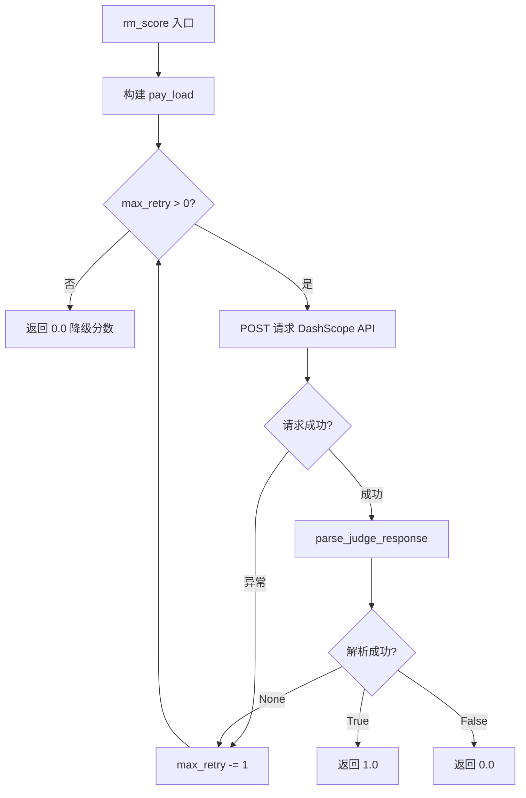
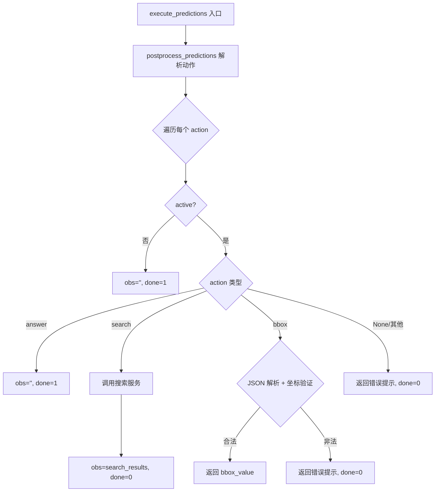
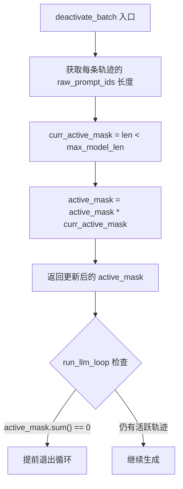
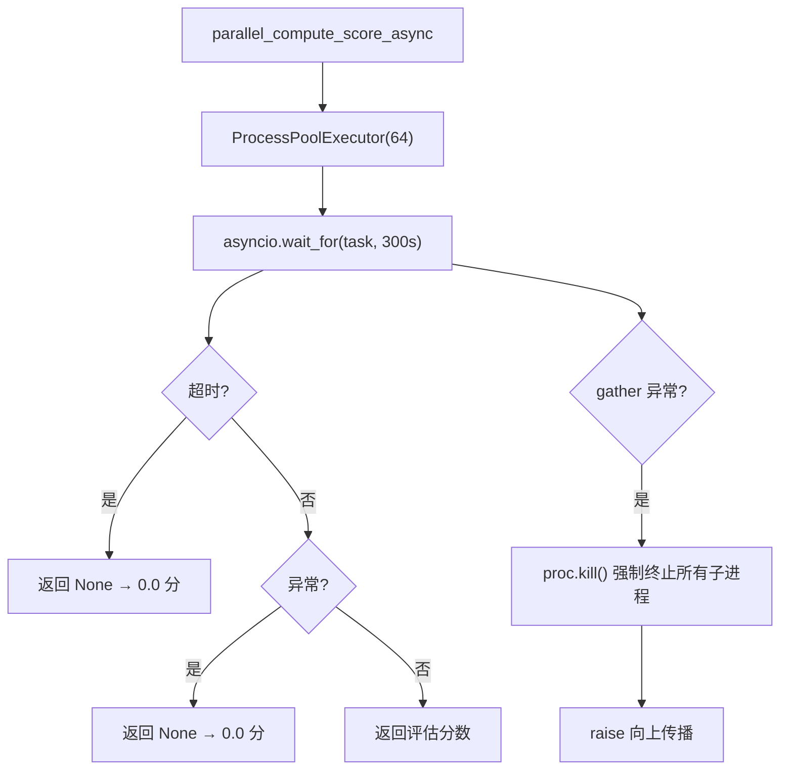

# PD-03.XX VRAG — RL 训练循环三层容错与 LLM 评估重试

> 文档编号：PD-03.XX
> 来源：VRAG `VRAG-RL/verl/workers/reward_manager/rm.py`, `VRAG-RL/vrag_agent/generation.py`, `VRAG-RL/verl/workers/reward_manager/prime.py`
> GitHub：https://github.com/Alibaba-NLP/VRAG.git
> 问题域：PD-03 容错与重试 Fault Tolerance & Retry
> 状态：可复用方案

---

## 第 1 章 问题与动机

### 1.1 核心问题

VRAG（Vision RAG）是一个基于强化学习训练的视觉检索增强生成系统。在 RL 训练循环中，Agent 需要多轮与外部环境交互（搜索引擎、LLM 评估服务），每一轮都可能因以下原因失败：

1. **LLM 评估 API 不稳定**：`rm_score` 调用 DashScope API 进行答案正确性评估，网络抖动、速率限制、服务端错误都会导致单次请求失败
2. **Agent 动作无效**：LLM 生成的 `<bbox>` 坐标可能不合法（负数、非 JSON、维度不足），`<search>` 可能返回空结果
3. **上下文超限**：多轮交互中 prompt 长度持续增长，超过 `max_model_len`（10240 tokens）后继续推理会导致 OOM 或推理质量崩溃
4. **并行评估中单项超时**：`PrimeRewardManager` 使用 `ProcessPoolExecutor` 并行评估 64 个样本，单个样本的评估函数可能陷入死循环或超时

这些问题在 RL 训练中尤为严重——一个 batch 通常包含数百条轨迹，任何一条的崩溃都不应中断整个训练循环。

### 1.2 VRAG 的解法概述

VRAG 实现了三层容错体系，从内到外分别是：

1. **API 级重试**（`rm.py:150-172`）：`rm_score` 方法对 DashScope API 调用实施最多 20 次的 while-loop 重试，任何异常都 catch 后 continue，耗尽重试返回 0.0 分
2. **Agent 动作级容错**（`generation.py:574-637`）：`execute_predictions` 对无效动作返回错误提示字符串而非抛异常，让 Agent 在下一轮自行修正
3. **轨迹级优雅降级**（`generation.py:365-370`）：`deactivate_batch` 在上下文超过 `max_model_len` 时将该轨迹标记为非活跃，不再参与后续推理，而非让整个 batch 崩溃

此外，`PrimeRewardManager`（`prime.py:25-43`）提供了第四层保护：基于 `asyncio.wait_for` 的 300 秒超时 + 进程级强制 kill，防止评估函数死循环拖垮训练。

### 1.3 设计思想

| 设计原则 | 具体实现 | 理由 | 替代方案 |
|----------|----------|------|----------|
| 静默降级优于崩溃 | `rm_score` 重试耗尽返回 0.0 而非抛异常 | RL 训练中单条轨迹的评估失败不应中断整个 batch | 抛异常 + 外层 catch（增加调用方复杂度） |
| 让 Agent 自我修正 | 无效动作返回错误提示而非终止轨迹 | Agent 可能在下一轮生成正确动作，保留了学习机会 | 直接标记 done=1 终止轨迹（丢失训练信号） |
| 资源感知的主动停用 | `deactivate_batch` 按 token 长度主动停用轨迹 | 防止 OOM，保护同 batch 其他轨迹的正常训练 | 截断 prompt（丢失上下文信息） |
| 进程隔离 + 超时保护 | `ProcessPoolExecutor` + `asyncio.wait_for(300s)` | 评估函数可能含无限循环，进程隔离防止主进程卡死 | 线程池（无法 kill 死循环线程） |
| 并发线程池评估 | `ThreadPoolExecutor(max_workers=10)` 并行调用 `rm_score` | 批量评估数百条轨迹时串行太慢 | 串行调用（训练吞吐量下降） |

---

## 第 2 章 源码实现分析

### 2.1 架构概览

VRAG 的容错体系贯穿 RL 训练的三个阶段：生成（Generation）、环境交互（Environment Step）、奖励评估（Reward Scoring）。

```
┌─────────────────────────────────────────────────────────────────┐
│                    RL Training Loop (ray_trainer.py)            │
│                                                                 │
│  ┌──────────────────────────────────────────────────────────┐   │
│  │  LLMGenerationManager.run_llm_loop()                     │   │
│  │                                                          │   │
│  │  for step in range(max_turns):                           │   │
│  │    ┌─────────────┐    ┌──────────────┐    ┌───────────┐  │   │
│  │    │ deactivate  │───→│  generate    │───→│ execute   │  │   │
│  │    │ _batch()    │    │ _with_gpu   │    │ _predict  │  │   │
│  │    │ [层3:降级]  │    │ _padding()  │    │ ions()    │  │   │
│  │    └─────────────┘    └──────────────┘    │ [层2:容错]│  │   │
│  │         ↑ active_mask                     └───────────┘  │   │
│  │         │ 超限→False                           │         │   │
│  └─────────│──────────────────────────────────────│─────────┘   │
│            │                                      ↓             │
│  ┌─────────│──────────────────────────────────────────────────┐ │
│  │  RMManager.__call__()                                      │ │
│  │    ThreadPoolExecutor(10) → rm_score() × N                 │ │
│  │    [层1: 20次重试 + 0.0降级]                                │ │
│  └────────────────────────────────────────────────────────────┘ │
│                                                                 │
│  ┌────────────────────────────────────────────────────────────┐ │
│  │  PrimeRewardManager (备选)                                  │ │
│  │    ProcessPoolExecutor(64) + asyncio.wait_for(300s)        │ │
│  │    [层4: 进程隔离 + 超时kill + 全局兜底]                     │ │
│  └────────────────────────────────────────────────────────────┘ │
└─────────────────────────────────────────────────────────────────┘
```

### 2.2 核心实现

#### 2.2.1 层1：LLM 评估 API 重试（rm_score）



对应源码 `VRAG-RL/verl/workers/reward_manager/rm.py:137-172`：

```python
def rm_score(self, data_eval_item):
    pay_load = {
        "model": self.rm_model_name,
        "messages": [
            {
                "role": "user", 
                "content": DEFAULT_SYSTEM_TEMPLATE \
                    .replace("{query}", data_eval_item["query"]) \
                    .replace("{reference_answer}", data_eval_item["reference_answer"]) \
                    .replace("{generated_answer}", data_eval_item["generated_answer"])
            }
        ]
    }
    max_retry = 20
    while True:
        if max_retry <= 0:
            return 0.0
        try:
            response = requests.post(
                self.rm_url,
                headers={
                    "Content-Type": "application/json",
                    "X-Auth-Key": self.rm_key,
                },
                json=pay_load
            )
            response.raise_for_status()
            result = response.json()
            judge_str = parse_judge_response(result['output']['content'])
            if judge_str is not None:
                if judge_str:
                    return 1.0
                else:
                    return 0.0
        except Exception as e:
            continue
```

关键设计点：
- **20 次重试上限**（`rm.py:150`）：远高于常见的 3-5 次，因为 RL 训练中每条轨迹的评估结果直接影响梯度更新，值得多次尝试
- **无退避策略**：`continue` 后立即重试，没有 sleep 或指数退避。这在内网 API 调用场景下可接受，但对公网 API 可能触发速率限制
- **解析失败也重试**（`rm.py:166`）：`parse_judge_response` 返回 `None` 时不直接返回 0.0，而是重试——因为 LLM 输出格式不稳定，下次可能生成正确格式
- **并行调用**（`rm.py:276-278`）：`ThreadPoolExecutor(max_workers=10)` 并行执行 `rm_score`，10 个线程各自独立重试

#### 2.2.2 层2：Agent 动作级容错（execute_predictions）



对应源码 `VRAG-RL/vrag_agent/generation.py:574-637`：

```python
def execute_predictions(self, predictions, pad_token, active_mask=None, do_search=True):
    cur_actions, contents = self.postprocess_predictions(predictions)
    next_obs, dones = [], []
    # ... 批量搜索逻辑 ...
    for i, (action, active) in enumerate(zip(cur_actions, active_mask)):
        if not active:
            next_obs.append('')
            dones.append(1)
        else:
            if action == 'answer':
                next_obs.append('')
                dones.append(1)
            elif action == 'search':
                next_obs.append(search_results.pop(0))
                dones.append(0)
            elif action == 'bbox':
                try:
                    bbox_value = json.loads(bbox_list.pop(0))
                    if len(bbox_value) == 4 and bbox_value[0] >= 0 and bbox_value[1] >= 0 \
                       and bbox_value[2] >= 0 and bbox_value[3] >= 0:
                        next_obs.append(bbox_value)
                    else:
                        raise ValueError("Invalid bbox value")
                except:
                    next_obs.append('\n<|im_start|>user\nYour previous action is invalid...')
                dones.append(0)
            else:
                next_obs.append('\n<|im_start|>user\nYour previous action is invalid...')
                dones.append(0)
    return next_obs, dones
```

关键设计点：
- **错误提示而非终止**（`generation.py:629, 632`）：无效动作返回 `done=0` + 错误提示字符串，Agent 在下一轮看到提示后可以修正
- **bbox 双重验证**（`generation.py:623-627`）：先 `json.loads` 解析，再检查长度和非负性，任一失败都走容错路径
- **批量搜索优化**（`generation.py:595-601`）：搜索请求按 batch_size=100 分批发送，减少单次请求失败的影响范围

#### 2.2.3 层3：轨迹级优雅降级（deactivate_batch）



对应源码 `VRAG-RL/vrag_agent/generation.py:365-370`：

```python
def deactivate_batch(self, active_mask, rollings):
    raw_prompt_ids = rollings.non_tensor_batch['raw_prompt_ids']
    max_model_len = self.config.max_model_len
    curr_active_mask = torch.tensor(
        [len(raw_prompt_ids_item) < max_model_len for raw_prompt_ids_item in raw_prompt_ids],
        dtype=torch.bool
    )
    active_mask = active_mask * curr_active_mask
    return active_mask
```

在 `run_llm_loop` 中的调用位置（`generation.py:390-401`）：

```python
for step in range(self.config.max_turns):
    if not active_mask.sum():
        break
    rollings.batch = self.tensor_fn.cut_to_effective_len(...)
    rollings = self._raw_prompt_ids(rollings)
    active_mask = self.deactivate_batch(active_mask, rollings)  # 每轮检查
    if not active_mask.sum():
        break
```

关键设计点：
- **每轮检查**：`deactivate_batch` 在每个 step 开始时调用，而非仅在异常时触发
- **乘法掩码**（`generation.py:369`）：`active_mask * curr_active_mask` 确保一旦停用就不会重新激活
- **最终轮也检查**（`generation.py:462`）：循环结束后的 final rollout 也调用 `deactivate_batch`，防止最后一轮超限

#### 2.2.4 层4：进程隔离超时保护（PrimeRewardManager）



对应源码 `VRAG-RL/verl/workers/reward_manager/prime.py:25-81`：

```python
async def single_compute_score(evaluation_func, completion, reference, task,
                                task_extra_info, executor, timeout=300.):
    loop = asyncio.get_running_loop()
    try:
        tasks = [
            asyncio.wait_for(
                loop.run_in_executor(executor,
                    partial(evaluation_func, task, completion, reference, task_extra_info)),
                timeout=timeout)
        ]
        return await asyncio.gather(*tasks)
    except asyncio.TimeoutError:
        print(f"Timeout occurred for completion: {completion}")
        return None
    except Exception as e:
        print(f"Error processing completion: {completion[:10]}, Error: {e}")
        return None

async def parallel_compute_score_async(...):
    with ProcessPoolExecutor(max_workers=num_processes) as executor:
        # ...
        try:
            results = await asyncio.gather(*tasks_async, return_exceptions=False)
        except:
            for pid, proc in executor._processes.items():
                try:
                    proc.kill()
                except Exception as kill_err:
                    print('shut down failed: ' + str(kill_err))
            raise
```

关键设计点：
- **进程而非线程**（`prime.py:53`）：`ProcessPoolExecutor` 确保评估函数的死循环可以被 kill，线程池做不到
- **300 秒超时**（`prime.py:25`）：单个评估的超时阈值，足够复杂评估完成，又不会无限等待
- **强制 kill**（`prime.py:65-69`）：`gather` 异常时遍历所有子进程执行 `proc.kill()`，防止僵尸进程
- **全局兜底**（`prime.py:114-119`）：`verify` 方法 catch `TimeoutError` 和 `Exception`，全部返回 0.0 分

### 2.3 实现细节

#### 2.3.1 LLM 输出解析容错

`parse_judge_response`（`rm.py:53-68`）对 LLM 评估输出做了多层容错：

```python
def parse_judge_response(response):
    pattern = r'<judge>(.*?)</judge>'
    match = re.search(pattern, response, re.DOTALL)
    if match:
        try:
            judge_str = match.group(0)
            if 'true' in judge_str or 'True' in judge_str:
                return True
            elif 'false' in judge_str or 'False' in judge_str:
                return False
            else:
                return None  # 无法识别的值 → 触发重试
        except Exception as e:
            return None
    else:
        return None  # 无标签 → 触发重试
```

- 大小写兼容：同时检查 `'true'` 和 `'True'`
- 无标签容错：正则匹配失败返回 `None`，由调用方决定重试
- 非布尔值容错：标签内容既非 true 也非 false 时返回 `None`

#### 2.3.2 Agent 动作解析容错

`postprocess_predictions`（`generation.py:639-668`）使用正则提取 Agent 动作：

```python
def postprocess_predictions(self, predictions):
    actions, contents = [], []
    for prediction in predictions:
        pattern = r'<(search|answer|bbox)>(.*?)</\1>'
        match = re.search(pattern, prediction, re.DOTALL)
        if match:
            content = match.group(2).strip()
            action = match.group(1)
        else:
            content = ''
            action = None  # 无法解析 → 走 else 分支返回错误提示
        actions.append(action)
        contents.append(content)
    return actions, contents
```

#### 2.3.3 GPU 填充容错

`_generate_with_gpu_padding`（`generation.py:267-342`）处理多 GPU 场景下 batch size 不整除的问题：

- 当 `batch_size % num_gpus != 0` 时，用 padding 序列填充到整除
- 生成完成后裁剪掉 padding 部分
- 这避免了 NCCL 通信中因 tensor shape 不一致导致的崩溃

#### 2.3.4 图像裁剪容错

`_process_next_obs`（`generation.py:113-189`）中对 bbox 裁剪操作做了 try-except 保护（`generation.py:133-156`）：

```python
try:
    latest_image = rollings.non_tensor_batch['multi_modal_data'][idx]['image'][-1]
    # ... 裁剪逻辑 ...
except Exception as e:
    next_obs_str.append('Your previous action is invalid...')
    multi_modal_data.append({'image': []})
    multi_modal_inputs.append(BatchFeature(dict()))
```

裁剪失败（如图像不存在、坐标越界）时返回错误提示，不中断其他轨迹。


---

## 第 3 章 迁移指南

### 3.1 迁移清单

**阶段 1：API 级重试（1-2 小时）**
- [ ] 为所有外部 LLM API 调用添加重试包装
- [ ] 确定重试次数上限（推荐 5-10 次，VRAG 的 20 次适用于 RL 训练场景）
- [ ] 添加指数退避（VRAG 未实现，建议补充）
- [ ] 定义降级返回值（如 0.0 分、空字符串）

**阶段 2：动作级容错（2-3 小时）**
- [ ] 识别所有 Agent 可能产生的动作类型
- [ ] 为每种动作定义验证规则（如 bbox 的 JSON 格式 + 坐标范围）
- [ ] 设计错误提示模板，引导 Agent 自我修正
- [ ] 确保无效动作不终止轨迹（`done=0`）

**阶段 3：轨迹级降级（1-2 小时）**
- [ ] 定义资源上限（token 长度、内存、时间）
- [ ] 实现 active_mask 机制，按条件停用轨迹
- [ ] 在主循环每轮开始时检查停用条件
- [ ] 确保停用的轨迹仍有有效的输出（如部分生成的结果）

### 3.2 适配代码模板

#### 模板 1：带重试的 LLM API 调用

```python
import time
import random
import requests
from typing import Optional, Any

class LLMApiCaller:
    """可复用的 LLM API 重试调用器。"""
    
    def __init__(self, url: str, api_key: str, model: str,
                 max_retry: int = 10, base_delay: float = 1.0):
        self.url = url
        self.api_key = api_key
        self.model = model
        self.max_retry = max_retry
        self.base_delay = base_delay
    
    def call(self, messages: list, default_value: Any = None) -> Optional[Any]:
        """调用 LLM API，失败时重试，耗尽返回 default_value。"""
        for attempt in range(self.max_retry):
            try:
                response = requests.post(
                    self.url,
                    headers={
                        "Content-Type": "application/json",
                        "Authorization": f"Bearer {self.api_key}",
                    },
                    json={"model": self.model, "messages": messages},
                    timeout=30,
                )
                response.raise_for_status()
                result = response.json()
                content = result["choices"][0]["message"]["content"]
                return content
            except Exception as e:
                # 指数退避 + 抖动（VRAG 未实现，此处补充）
                delay = self.base_delay * (2 ** attempt) + random.uniform(0, 1)
                delay = min(delay, 60)  # 最大 60 秒
                time.sleep(delay)
        return default_value
```

#### 模板 2：Agent 动作验证与容错

```python
import json
import re
from typing import Tuple, List, Optional
from dataclasses import dataclass

@dataclass
class ActionResult:
    action: Optional[str]
    content: str
    is_valid: bool
    error_prompt: str = ""

ERROR_PROMPT_TEMPLATE = (
    "Your previous action is invalid. "
    "Valid actions: {valid_actions}. "
    "Please try again."
)

def validate_and_execute(
    prediction: str,
    valid_actions: List[str],
    validators: dict,  # action_name → validator_fn
) -> ActionResult:
    """解析并验证 Agent 动作，无效时返回错误提示。"""
    pattern = r'<(' + '|'.join(valid_actions) + r')>(.*?)</\1>'
    match = re.search(pattern, prediction, re.DOTALL)
    
    if not match:
        return ActionResult(
            action=None, content="", is_valid=False,
            error_prompt=ERROR_PROMPT_TEMPLATE.format(
                valid_actions=", ".join(valid_actions)
            )
        )
    
    action = match.group(1)
    content = match.group(2).strip()
    
    # 自定义验证
    validator = validators.get(action)
    if validator:
        try:
            validator(content)
        except Exception as e:
            return ActionResult(
                action=action, content=content, is_valid=False,
                error_prompt=f"Invalid {action}: {str(e)}. Please try again."
            )
    
    return ActionResult(action=action, content=content, is_valid=True)

# 使用示例
def bbox_validator(content: str):
    bbox = json.loads(content)
    assert len(bbox) == 4, "bbox must have 4 values"
    assert all(v >= 0 for v in bbox), "all values must be non-negative"
```

#### 模板 3：轨迹级 active_mask 降级

```python
import torch
from typing import Callable, List

class TrajectoryManager:
    """管理批量轨迹的活跃状态。"""
    
    def __init__(self, batch_size: int, max_turns: int):
        self.active_mask = torch.ones(batch_size, dtype=torch.bool)
        self.max_turns = max_turns
        self.deactivation_reasons: List[str] = [""] * batch_size
    
    def deactivate(self, condition_fn: Callable, reason: str):
        """按条件停用轨迹。"""
        curr_mask = torch.tensor(
            [condition_fn(i) for i in range(len(self.active_mask))],
            dtype=torch.bool
        )
        newly_deactivated = self.active_mask & ~curr_mask
        for i in range(len(newly_deactivated)):
            if newly_deactivated[i]:
                self.deactivation_reasons[i] = reason
        self.active_mask = self.active_mask * curr_mask
    
    @property
    def any_active(self) -> bool:
        return self.active_mask.sum().item() > 0
    
    @property
    def active_count(self) -> int:
        return self.active_mask.sum().item()

# 使用示例
manager = TrajectoryManager(batch_size=64, max_turns=10)
for step in range(manager.max_turns):
    if not manager.any_active:
        break
    manager.deactivate(
        condition_fn=lambda i: len(prompts[i]) < max_model_len,
        reason="context_overflow"
    )
    # ... 生成和交互 ...
```

### 3.3 适用场景

| 场景 | 适用度 | 说明 |
|------|--------|------|
| RL 训练循环中的 LLM 评估 | ⭐⭐⭐ | 完美匹配：批量轨迹 + 外部 API + 容忍部分失败 |
| 多轮 Agent 对话系统 | ⭐⭐⭐ | 动作容错 + 上下文降级直接可用 |
| 批量数据处理管道 | ⭐⭐ | API 重试和降级适用，但 active_mask 需要适配 |
| 实时在线服务 | ⭐ | 20 次重试延迟太高，需要降低重试次数并加退避 |
| 单条请求的 API 网关 | ⭐ | 不需要批量轨迹管理，只需 API 重试部分 |

---

## 第 4 章 测试用例

```python
import pytest
import json
import torch
from unittest.mock import patch, MagicMock

# ============ 层1：rm_score 重试测试 ============

class TestRMScoreRetry:
    """测试 RMManager.rm_score 的重试行为。"""
    
    def _make_manager(self):
        """构造最小化的 RMManager。"""
        manager = MagicMock()
        manager.rm_url = "http://test/api"
        manager.rm_key = "test-key"
        manager.rm_model_name = "test-model"
        # 绑定真实方法
        from verl.workers.reward_manager.rm import RMManager
        manager.rm_score = RMManager.rm_score.__get__(manager)
        return manager
    
    @patch('verl.workers.reward_manager.rm.requests.post')
    def test_success_on_first_try(self, mock_post):
        """首次成功应返回正确分数。"""
        mock_post.return_value.status_code = 200
        mock_post.return_value.json.return_value = {
            'output': {'content': '<judge>True</judge>'}
        }
        mock_post.return_value.raise_for_status = MagicMock()
        
        manager = self._make_manager()
        score = manager.rm_score({
            "query": "test", "reference_answer": "yes", "generated_answer": "yes"
        })
        assert score == 1.0
        assert mock_post.call_count == 1
    
    @patch('verl.workers.reward_manager.rm.requests.post')
    def test_retry_on_exception(self, mock_post):
        """异常后应重试，最终成功。"""
        mock_post.side_effect = [
            Exception("network error"),
            Exception("timeout"),
            MagicMock(
                status_code=200,
                json=lambda: {'output': {'content': '<judge>False</judge>'}},
                raise_for_status=MagicMock()
            )
        ]
        manager = self._make_manager()
        score = manager.rm_score({
            "query": "test", "reference_answer": "yes", "generated_answer": "no"
        })
        assert score == 0.0
        assert mock_post.call_count == 3
    
    @patch('verl.workers.reward_manager.rm.requests.post')
    def test_exhaust_retries_returns_zero(self, mock_post):
        """20 次重试耗尽应返回 0.0。"""
        mock_post.side_effect = Exception("persistent failure")
        manager = self._make_manager()
        score = manager.rm_score({
            "query": "test", "reference_answer": "yes", "generated_answer": "yes"
        })
        assert score == 0.0
        assert mock_post.call_count == 20


# ============ 层2：动作容错测试 ============

class TestExecutePredictions:
    """测试 execute_predictions 的动作容错。"""
    
    def test_invalid_action_returns_error_prompt(self):
        """无法解析的动作应返回错误提示且 done=0。"""
        # 模拟无效输出（无标签）
        predictions = ["I don't know what to do"]
        active_mask = torch.tensor([True])
        
        # postprocess_predictions 应返回 action=None
        from vrag_agent.generation import LLMGenerationManager
        manager = MagicMock(spec=LLMGenerationManager)
        manager.postprocess_predictions = LLMGenerationManager.postprocess_predictions.__get__(manager)
        actions, contents = manager.postprocess_predictions(predictions)
        
        assert actions[0] is None
        assert contents[0] == ''
    
    def test_invalid_bbox_returns_error_prompt(self):
        """非法 bbox 应返回错误提示。"""
        # bbox 值为负数
        invalid_bbox = json.dumps([-1, -2, 100, 200])
        prediction = f"<bbox>{invalid_bbox}</bbox>"
        
        from vrag_agent.generation import LLMGenerationManager
        manager = MagicMock(spec=LLMGenerationManager)
        manager.postprocess_predictions = LLMGenerationManager.postprocess_predictions.__get__(manager)
        actions, contents = manager.postprocess_predictions([prediction])
        
        assert actions[0] == 'bbox'
        # 实际验证在 execute_predictions 中
        bbox_value = json.loads(contents[0])
        assert not all(v >= 0 for v in bbox_value)  # 验证会失败


# ============ 层3：deactivate_batch 测试 ============

class TestDeactivateBatch:
    """测试轨迹级降级。"""
    
    def test_deactivate_overlength(self):
        """超过 max_model_len 的轨迹应被停用。"""
        import numpy as np
        
        active_mask = torch.tensor([True, True, True])
        raw_prompt_ids = np.array([
            list(range(5000)),   # 短于 10240，保持活跃
            list(range(15000)),  # 超过 10240，应停用
            list(range(10240)),  # 等于 10240，保持活跃（< 不含等于）
        ], dtype=object)
        
        max_model_len = 10240
        curr_active_mask = torch.tensor(
            [len(ids) < max_model_len for ids in raw_prompt_ids],
            dtype=torch.bool
        )
        result = active_mask * curr_active_mask
        
        assert result[0] == True   # 5000 < 10240
        assert result[1] == False  # 15000 >= 10240
        assert result[2] == False  # 10240 不 < 10240
    
    def test_deactivation_is_permanent(self):
        """一旦停用不应重新激活。"""
        active_mask = torch.tensor([True, False, True])
        curr_active_mask = torch.tensor([True, True, True])
        result = active_mask * curr_active_mask
        
        assert result[1] == False  # 已停用的保持停用


# ============ 层4：PrimeRewardManager 超时测试 ============

class TestPrimeTimeout:
    """测试进程级超时保护。"""
    
    @pytest.mark.asyncio
    async def test_timeout_returns_none(self):
        """超时的评估应返回 None。"""
        import asyncio
        from concurrent.futures import ProcessPoolExecutor
        from functools import partial
        
        def slow_eval(task, completion, reference, extra):
            import time
            time.sleep(10)  # 模拟慢评估
            return 1.0
        
        loop = asyncio.get_running_loop()
        with ProcessPoolExecutor(max_workers=1) as executor:
            try:
                result = await asyncio.wait_for(
                    loop.run_in_executor(executor, partial(slow_eval, "t", "c", "r", None)),
                    timeout=0.1  # 极短超时
                )
            except asyncio.TimeoutError:
                result = None
        
        assert result is None
```


---

## 第 5 章 跨域关联

| 关联域 | 关系类型 | 说明 |
|--------|----------|------|
| PD-01 上下文管理 | 依赖 | `deactivate_batch` 的触发条件是上下文长度超限（`max_model_len`），本质上是上下文管理的容错兜底。PD-01 负责"如何压缩"，PD-03 负责"压缩不了怎么办" |
| PD-02 多 Agent 编排 | 协同 | `run_llm_loop` 中的 `active_mask` 机制本质是批量轨迹的编排——决定哪些轨迹继续、哪些停用。与 PD-02 的并行 Agent 调度共享"选择性执行"的设计模式 |
| PD-04 工具系统 | 依赖 | `execute_predictions` 是工具调用的执行层，其容错逻辑（bbox 验证、search 批量调用）直接依赖工具系统的接口定义 |
| PD-07 质量检查 | 协同 | `RMManager.rm_score` 本身就是质量评估，其重试机制确保评估结果的可靠性。`parse_judge_response` 的多层解析容错也是质量保障的一部分 |
| PD-08 搜索与检索 | 依赖 | `execute_predictions` 中的搜索调用（`requests.get(self.config.search_url)`）依赖外部搜索服务，搜索服务的可用性直接影响容错路径的选择 |
| PD-11 可观测性 | 互补 | VRAG 的容错实现缺少结构化日志——`rm_score` 的 `except` 块是空的 `continue`，`deactivate_batch` 没有记录停用原因。需要 PD-11 补充可观测性 |

---

## 第 6 章 来源文件索引

| 文件 | 行范围 | 关键实现 |
|------|--------|----------|
| `VRAG-RL/verl/workers/reward_manager/rm.py` | L137-L172 | `rm_score` 20 次重试 + 0.0 降级 |
| `VRAG-RL/verl/workers/reward_manager/rm.py` | L53-L68 | `parse_judge_response` LLM 输出解析容错 |
| `VRAG-RL/verl/workers/reward_manager/rm.py` | L123-L136 | `RMManager.__init__` 配置参数（rm_workers_num=10） |
| `VRAG-RL/verl/workers/reward_manager/rm.py` | L274-L280 | `ThreadPoolExecutor` 并行评估 |
| `VRAG-RL/vrag_agent/generation.py` | L365-L370 | `deactivate_batch` 上下文超限降级 |
| `VRAG-RL/vrag_agent/generation.py` | L390-L401 | `run_llm_loop` 主循环中的降级检查 |
| `VRAG-RL/vrag_agent/generation.py` | L574-L637 | `execute_predictions` 动作级容错 |
| `VRAG-RL/vrag_agent/generation.py` | L639-L668 | `postprocess_predictions` 动作解析 |
| `VRAG-RL/vrag_agent/generation.py` | L267-L342 | `_generate_with_gpu_padding` GPU 填充容错 |
| `VRAG-RL/vrag_agent/generation.py` | L113-L156 | `_process_next_obs` 图像裁剪容错 |
| `VRAG-RL/verl/workers/reward_manager/prime.py` | L25-L43 | `single_compute_score` 300s 超时保护 |
| `VRAG-RL/verl/workers/reward_manager/prime.py` | L46-L81 | `parallel_compute_score_async` 进程隔离 + 强制 kill |
| `VRAG-RL/verl/workers/reward_manager/prime.py` | L107-L119 | `PrimeRewardManager.verify` 全局兜底 |
| `VRAG-RL/verl/utils/reward_score/vrag.py` | L48-L59 | `compute_score` 格式验证 + ANLS 评分 |
| `demo/vrag_agent.py` | L67-L179 | `VRAG.run` 推理时的 max_steps 限制 |

---

## 第 7 章 横向对比维度

> **重要：** 本章用于自动填充 Butcher Wiki 的横向对比表。

```json comparison_data
{
  "project": "VRAG",
  "dimensions": {
    "截断/错误检测": "正则解析 <judge>/<answer>/<search>/<bbox> 标签，解析失败返回 None 触发重试",
    "重试/恢复策略": "while-loop 最多 20 次无退避重试，异常 catch-continue，耗尽返回 0.0",
    "超时保护": "PrimeRewardManager 用 asyncio.wait_for(300s) + ProcessPoolExecutor 进程级超时",
    "优雅降级": "deactivate_batch 按 token 长度主动停用轨迹，active_mask 乘法确保不可逆",
    "重试策略": "无退避的立即重试（内网 API 场景），ThreadPoolExecutor(10) 并行独立重试",
    "降级方案": "三级降级：API 返回 0.0 分 → Agent 返回错误提示 → 轨迹标记非活跃",
    "错误分类": "区分 API 异常（重试）、解析失败（重试）、动作无效（提示修正）、上下文超限（停用）",
    "并发容错": "ThreadPoolExecutor(10) 并行 rm_score + ProcessPoolExecutor(64) 并行评估，单项失败不影响其他",
    "输出验证": "bbox 双重验证（JSON 解析 + 坐标非负 + 长度=4），judge 大小写兼容",
    "资源管理模式": "active_mask 位掩码管理批量轨迹生命周期，每轮检查 + 乘法不可逆停用"
  }
}
```

### 域元数据补充

```json domain_metadata
{
  "solution_summary": "VRAG 用 20 次 while-loop 重试 + active_mask 轨迹停用 + ProcessPoolExecutor 进程隔离实现 RL 训练循环的三层容错",
  "description": "RL 训练批量轨迹场景下的容错需要兼顾单条轨迹的恢复和整体训练的稳定性",
  "sub_problems": [
    "RL 批量轨迹中单条评估失败不应中断整个 batch 的梯度更新",
    "Agent 生成的 bbox 坐标可能不合法（非 JSON、负数、维度不足），需要多层验证",
    "多轮交互中上下文持续增长超过模型最大长度，需要主动停用而非被动崩溃",
    "并行评估中单个评估函数可能陷入死循环，线程池无法 kill 需要进程池隔离",
    "LLM 评估输出格式不稳定（大小写、缺标签），解析失败应触发重试而非直接判负"
  ],
  "best_practices": [
    "RL 训练场景的重试次数可以远高于在线服务（20 次 vs 3 次），因为训练容忍延迟",
    "用 active_mask 乘法实现不可逆停用，避免已停用轨迹被意外重新激活",
    "评估函数用 ProcessPoolExecutor 而非 ThreadPoolExecutor，确保死循环可被 kill",
    "无效 Agent 动作返回错误提示而非终止轨迹，保留 Agent 自我修正的学习机会"
  ]
}
```

