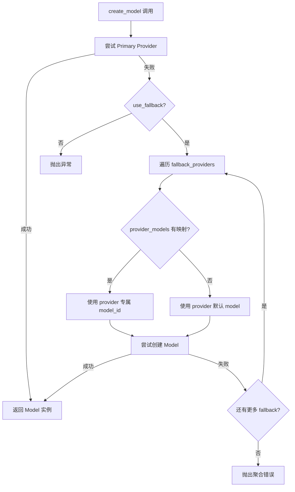
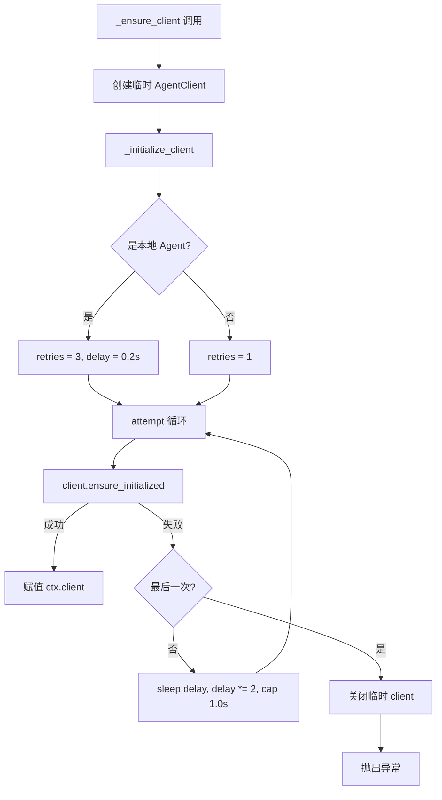
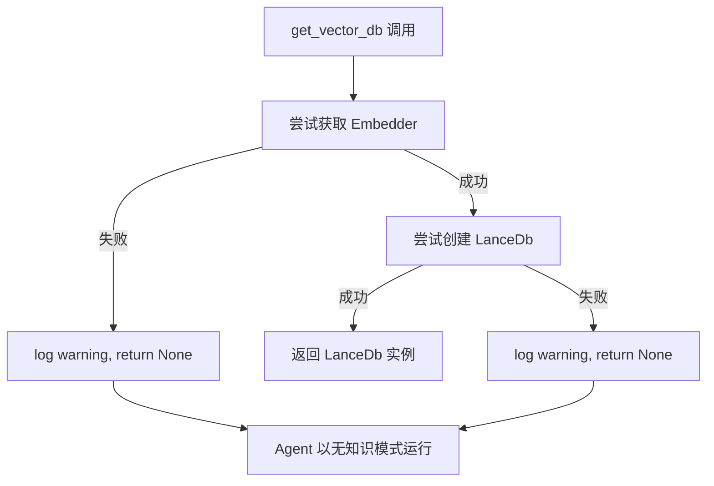

# PD-03.NN ValueCell — 多层 Provider 降级与惰性初始化容错

> 文档编号：PD-03.NN
> 来源：ValueCell `python/valuecell/adapters/models/factory.py`, `python/valuecell/core/agent/connect.py`, `python/valuecell/agents/research_agent/vdb.py`
> GitHub：https://github.com/ValueCell-ai/valuecell.git
> 问题域：PD-03 容错与重试 Fault Tolerance & Retry
> 状态：可复用方案

---

## 第 1 章 问题与动机（≥ 30 行）

### 1.1 核心问题

在多 Provider LLM 系统中，容错不是单一层面的问题，而是贯穿整个调用链的系统性挑战：

1. **Provider 不可用**：API Key 过期、服务宕机、配额耗尽，任何单一 Provider 都不可靠
2. **Agent 客户端初始化竞态**：本地 Agent 进程启动需要时间，客户端连接可能在服务就绪前发起
3. **可选依赖缺失**：Embedding 模型、向量数据库等组件可能未配置，但不应阻止核心功能运行
4. **外部数据源不稳定**：Yahoo Finance 等第三方 API 存在网络抖动和速率限制
5. **模块导入死锁**：Python 的 import lock 在多线程 + asyncio 环境下可能导致死锁

这些问题的共同特征是：**失败是常态，不是异常**。系统必须在各层级预设降级路径。

### 1.2 ValueCell 的解法概述

ValueCell 采用"三层容错"架构，每层独立处理不同类型的失败：

1. **Provider 层降级链**（`factory.py:680-729`）：ModelFactory 维护 primary → fallback 多 Provider 自动降级，支持 per-provider 模型映射，确保 LLM 调用始终有可用后端
2. **连接层指数退避**（`connect.py:482-507`）：RemoteConnections 对 Agent 客户端初始化做 3 次重试，delay 从 0.2s 指数增长到 1.0s 上限，区分本地 Agent（3 次）和远程 Agent（1 次）
3. **组件层优雅降级**（`vdb.py:23-53`）：ResearchAgent 的向量数据库初始化失败时返回 None 而非抛异常，Agent 自动降级为无知识搜索模式
4. **数据层配置化重试**（`yfinance_adapter.py:45-49`）：外部数据适配器通过配置驱动重试次数和退避基数
5. **导入层超时保护**（`connect.py:170-182`）：Agent 类导入使用 5s 超时 + 线程池，超时后回退到同步导入

### 1.3 设计思想

| 设计原则 | 具体实现 | 理由 | 替代方案 |
|----------|----------|------|----------|
| 分层容错 | Provider/连接/组件/数据四层独立处理 | 不同层面的失败模式不同，统一处理会过度简化 | 全局 retry 装饰器（粒度太粗） |
| 惰性初始化 | VDB 按需创建，失败返回 None | 避免启动时因可选组件失败阻塞整个系统 | 启动时预检所有依赖（脆弱） |
| 配置驱动降级链 | fallback_providers 从 YAML/env 自动发现 | 运维可动态调整降级顺序，无需改代码 | 硬编码降级顺序（不灵活） |
| 区分重试策略 | 本地 Agent 3 次重试，远程 1 次 | 本地 Agent 有冷启动延迟，远程失败通常是持久性的 | 统一重试次数（浪费或不足） |
| 资源防泄漏 | 临时 client 失败时主动 close | 防止连接泄漏导致资源耗尽 | 依赖 GC 回收（不可靠） |

---

## 第 2 章 源码实现分析（≥ 60 行，核心章节）

### 2.1 架构概览

ValueCell 的容错体系分布在四个层级，形成纵深防御：

```
┌─────────────────────────────────────────────────────────┐
│                    调用方 (Agent / API)                    │
├─────────────────────────────────────────────────────────┤
│  Layer 1: ModelFactory Provider 降级链                    │
│  ┌──────────┐   fail   ┌──────────┐   fail   ┌────────┐│
│  │ Primary  │────────→│ Fallback1│────────→│Fallback2││
│  │(OpenRouter)│         │ (Google) │         │(Azure)  ││
│  └──────────┘          └──────────┘         └────────┘│
├─────────────────────────────────────────────────────────┤
│  Layer 2: RemoteConnections 指数退避重试                   │
│  attempt 1 (0.2s) → attempt 2 (0.4s) → attempt 3 (0.8s)│
│  本地 Agent: 3 次 | 远程 Agent: 1 次                      │
├─────────────────────────────────────────────────────────┤
│  Layer 3: 组件惰性初始化 + 优雅降级                        │
│  VDB init fail → return None → Agent 无知识模式运行        │
├─────────────────────────────────────────────────────────┤
│  Layer 4: 数据适配器配置化重试                             │
│  YFinance: retry_attempts=3, backoff_base=0.5            │
└─────────────────────────────────────────────────────────┘
```

### 2.2 核心实现

#### 2.2.1 ModelFactory Provider 降级链



对应源码 `python/valuecell/adapters/models/factory.py:634-729`：

```python
def create_model(
    self,
    model_id: Optional[str] = None,
    provider: Optional[str] = None,
    use_fallback: bool = True,
    provider_models: Optional[dict] = None,
    **kwargs,
):
    provider = provider or self.config_manager.primary_provider
    if provider_models is None:
        provider_models = {}

    # Try primary provider
    try:
        return self._create_model_internal(model_id, provider, **kwargs)
    except Exception as e:
        logger.warning(f"Failed to create model with provider {provider}: {e}")

        if not use_fallback:
            raise

        # Try fallback providers
        for fallback_provider in self.config_manager.fallback_providers:
            if fallback_provider == provider:
                continue  # Skip already tried provider

            try:
                # Determine model ID for fallback provider
                fallback_model_id = model_id
                if fallback_provider in provider_models:
                    fallback_model_id = provider_models[fallback_provider]
                else:
                    fallback_provider_config = (
                        self.config_manager.get_provider_config(fallback_provider)
                    )
                    if fallback_provider_config:
                        fallback_model_id = fallback_provider_config.default_model

                logger.info(f"Trying fallback provider: {fallback_provider}")
                return self._create_model_internal(
                    fallback_model_id, fallback_provider, **kwargs
                )
            except Exception as fallback_error:
                logger.warning(
                    f"Fallback provider {fallback_provider} also failed: {fallback_error}"
                )
                continue

        # All providers failed
        raise ValueError(
            f"Failed to create model. Primary provider ({provider}) "
            f"and all fallback providers failed. Original error: {e}"
        )
```

关键设计点：
- `provider_models` 字典允许为每个 fallback provider 指定不同的 model_id（`factory.py:696-700`），解决了跨 Provider 模型名不兼容的问题
- fallback_providers 由 ConfigManager 自动发现（`manager.py:162-190`），运维可通过 `FALLBACK_PROVIDERS` 环境变量覆盖
- 每个 fallback 尝试都有独立的 try-except，单个 fallback 失败不影响后续尝试

#### 2.2.2 RemoteConnections 指数退避重试



对应源码 `python/valuecell/core/agent/connect.py:482-507`：

```python
async def _initialize_client(self, client: AgentClient, ctx: AgentContext) -> None:
    """Initialize client with retry for local agents."""
    retries = 3 if ctx.agent_task else 1
    delay = 0.2
    for attempt in range(retries):
        try:
            await client.ensure_initialized()
            logger.info(
                f"Client initialized for '{ctx.name}' on attempt {attempt + 1}"
            )
            return
        except Exception as exc:
            if attempt >= retries - 1:
                raise
            logger.debug(
                "Retrying client initialization for '{}' ({}/{}): {}",
                ctx.name, attempt + 1, retries, exc,
            )
            await asyncio.sleep(delay)
            delay = min(delay * 2, 1.0)
```

关键设计点：
- 通过 `ctx.agent_task` 判断是否为本地 Agent（`connect.py:484`），本地 Agent 有冷启动延迟所以给 3 次重试
- delay 上限 1.0s（`connect.py:507`），避免等待过长
- 临时 client 失败时主动 `close()`（`connect.py:436-439`），防止连接泄漏


#### 2.2.3 VDB 惰性初始化与优雅降级



对应源码 `python/valuecell/agents/research_agent/vdb.py:23-53`：

```python
def get_vector_db() -> Optional[LanceDb]:
    """Create and return the LanceDb instance, or None if embeddings are unavailable."""
    try:
        embedder = model_utils_mod.get_embedder_for_agent("research_agent")
    except Exception as e:
        logger.warning(
            "ResearchAgent embeddings unavailable; disabling knowledge search. Error: {}",
            e,
        )
        return None

    try:
        return LanceDb(
            table_name="research_agent_knowledge_base",
            uri=resolve_lancedb_uri(),
            embedder=embedder,
            search_type=SearchType.hybrid,
            use_tantivy=False,
        )
    except Exception as e:
        logger.warning(
            "Failed to initialize LanceDb for ResearchAgent; disabling knowledge. Error: {}",
            e,
        )
        return None
```

关键设计点：
- 双层 try-except 分别捕获 Embedder 创建失败和 LanceDb 初始化失败（`vdb.py:30-37`, `vdb.py:39-53`）
- 返回 `Optional[LanceDb]` 而非抛异常，调用方通过 None 检查决定是否启用知识搜索
- 文件头部 docstring 明确声明"tools-only mode"设计意图（`vdb.py:1-11`）

#### 2.2.4 YFinance 配置化重试

对应源码 `python/valuecell/adapters/assets/yfinance_adapter.py:45-49, 225-239`：

```python
# 配置初始化 (yfinance_adapter.py:45-49)
def _initialize(self) -> None:
    self.timeout = self.config.get("timeout", 30)
    self.retry_attempts = int(self.config.get("retry_attempts", 3))
    self.retry_backoff_base = float(self.config.get("retry_backoff_base", 0.5))

# 重试循环 (yfinance_adapter.py:225-239)
for attempt in range(max(1, self.retry_attempts)):
    try:
        ticker_obj = yf.Ticker(source_ticker)
        try:
            info = ticker_obj.info
        except Exception:
            try:
                info = ticker_obj.get_info()
            except Exception:
                info = None
        if info and "symbol" in info:
            break
    except Exception as e:
        if attempt < self.retry_attempts - 1:
            time.sleep(self.retry_backoff_base * (2**attempt))
            continue
        logger.error(f"Error fetching asset info for {ticker}: {e}")
        return None
```

### 2.3 实现细节

#### 2.3.1 Agent 导入超时保护

`connect.py:170-182` 实现了一个精巧的导入超时机制：

```python
try:
    agent_cls = await asyncio.wait_for(
        _resolve_local_agent_class(ctx.agent_class_spec), timeout=5.0
    )
except asyncio.TimeoutError:
    logger.warning(
        "Threaded import timed out for '{}', falling back to executor sync import",
        ctx.agent_class_spec,
    )
    loop = asyncio.get_running_loop()
    agent_cls = await loop.run_in_executor(
        executor, _resolve_local_agent_class_sync, ctx.agent_class_spec
    )
```

这解决了 Windows 上 Python import lock 与 asyncio 事件循环之间的死锁问题。先尝试异步导入（线程池），5 秒超时后回退到同步导入。

#### 2.3.2 Agent 清理的超时保护

`connect.py:557-596` 的 `_cleanup_agent` 方法展示了完整的资源清理链：

1. 先调用 `agent_instance.shutdown()`（如果有）
2. 用 `asyncio.wait_for(agent_task, timeout=5)` 等待任务结束
3. 超时则 `cancel()` + `await` 捕获 `CancelledError`
4. 关闭 client 连接
5. 取消 listener task

每一步都有独立的异常处理，确保一个步骤失败不会阻止后续清理。

#### 2.3.3 ConfigManager 自动发现降级链

`manager.py:162-190` 的 `fallback_providers` 属性实现了零配置降级：

```python
@property
def fallback_providers(self) -> List[str]:
    # 1. 环境变量覆盖
    env_fallbacks = os.getenv("FALLBACK_PROVIDERS")
    if env_fallbacks:
        return [p.strip() for p in env_fallbacks.split(",")]
    # 2. 自动发现：所有启用且有 API Key 的 Provider（排除 primary）
    primary = self.primary_provider
    enabled_providers = self.get_enabled_providers()
    fallbacks = [p for p in enabled_providers if p != primary]
    return fallbacks
```

---

## 第 3 章 迁移指南（≥ 40 行）

### 3.1 迁移清单

**阶段 1：Provider 降级链（1-2 天）**
- [ ] 定义 ProviderConfig 数据类（name, api_key, base_url, default_model, enabled）
- [ ] 实现 ConfigManager 的 `fallback_providers` 自动发现逻辑
- [ ] 实现 ModelFactory 的 `create_model` 方法含 fallback 循环
- [ ] 支持 `provider_models` 字典做跨 Provider 模型映射
- [ ] 添加 `FALLBACK_PROVIDERS` 环境变量覆盖

**阶段 2：连接层重试（0.5 天）**
- [ ] 实现 `_initialize_client` 的指数退避重试
- [ ] 区分本地/远程 Agent 的重试策略
- [ ] 临时资源失败时主动清理

**阶段 3：组件惰性初始化（0.5 天）**
- [ ] 将可选组件（VDB、Embedder）改为惰性初始化
- [ ] 返回 Optional 类型，调用方检查 None 后降级
- [ ] 添加 warning 级别日志记录降级原因

**阶段 4：数据适配器重试（0.5 天）**
- [ ] 将重试参数提取到配置文件
- [ ] 实现通用的指数退避重试循环
- [ ] 添加 API 调用方式的多路径尝试（如 `.info` → `.get_info()`）

### 3.2 适配代码模板

#### Provider 降级链模板

```python
from typing import Optional, Dict, List, Any
from dataclasses import dataclass
import logging

logger = logging.getLogger(__name__)

@dataclass
class ProviderConfig:
    name: str
    api_key: str
    base_url: Optional[str] = None
    default_model: Optional[str] = None
    enabled: bool = True

class MultiProviderFactory:
    """可直接复用的多 Provider 降级工厂"""

    def __init__(
        self,
        primary: str,
        fallbacks: List[str],
        configs: Dict[str, ProviderConfig],
    ):
        self.primary = primary
        self.fallbacks = fallbacks
        self.configs = configs

    def create_client(
        self,
        model_id: Optional[str] = None,
        provider_models: Optional[Dict[str, str]] = None,
    ) -> Any:
        provider_models = provider_models or {}

        # Try primary
        try:
            return self._create(self.primary, model_id)
        except Exception as e:
            logger.warning(f"Primary provider {self.primary} failed: {e}")

        # Try fallbacks
        for fb in self.fallbacks:
            if fb == self.primary:
                continue
            try:
                fb_model = provider_models.get(fb, self.configs[fb].default_model)
                logger.info(f"Trying fallback: {fb} with model {fb_model}")
                return self._create(fb, fb_model)
            except Exception as e:
                logger.warning(f"Fallback {fb} failed: {e}")

        raise RuntimeError("All providers exhausted")

    def _create(self, provider: str, model_id: Optional[str]) -> Any:
        cfg = self.configs.get(provider)
        if not cfg or not cfg.enabled or not cfg.api_key:
            raise ValueError(f"Provider {provider} not available")
        # 替换为实际的 LLM client 创建逻辑
        return {"provider": provider, "model": model_id or cfg.default_model}
```

#### 指数退避重试模板

```python
import asyncio
from typing import TypeVar, Callable, Awaitable

T = TypeVar("T")

async def retry_with_backoff(
    fn: Callable[[], Awaitable[T]],
    retries: int = 3,
    initial_delay: float = 0.2,
    max_delay: float = 1.0,
    label: str = "operation",
) -> T:
    """通用异步指数退避重试"""
    delay = initial_delay
    for attempt in range(retries):
        try:
            return await fn()
        except Exception as exc:
            if attempt >= retries - 1:
                raise
            logger.debug(f"Retrying {label} ({attempt+1}/{retries}): {exc}")
            await asyncio.sleep(delay)
            delay = min(delay * 2, max_delay)
```

### 3.3 适用场景

| 场景 | 适用度 | 说明 |
|------|--------|------|
| 多 LLM Provider 系统 | ⭐⭐⭐ | Provider 降级链直接适用 |
| 微服务 Agent 编排 | ⭐⭐⭐ | 连接层重试 + 清理模式直接适用 |
| 可选组件系统 | ⭐⭐⭐ | 惰性初始化 + None 降级模式通用 |
| 单 Provider 系统 | ⭐ | 降级链无意义，但重试仍有价值 |
| 实时交易系统 | ⭐⭐ | 重试延迟可能不可接受，需调整参数 |

---

## 第 4 章 测试用例（≥ 20 行）

```python
import asyncio
import pytest
from unittest.mock import AsyncMock, MagicMock, patch

class TestModelFactoryFallback:
    """测试 Provider 降级链"""

    def test_primary_success_no_fallback(self):
        """Primary 成功时不触发 fallback"""
        factory = MagicMock()
        factory._create_model_internal = MagicMock(return_value="model_ok")
        factory.config_manager.primary_provider = "openrouter"
        result = factory._create_model_internal("gpt-4", "openrouter")
        assert result == "model_ok"

    def test_fallback_on_primary_failure(self):
        """Primary 失败时自动降级到 fallback"""
        factory = MagicMock()
        factory._create_model_internal = MagicMock(
            side_effect=[Exception("primary down"), "fallback_model"]
        )
        factory.config_manager.fallback_providers = ["google"]
        # 模拟 create_model 的降级逻辑
        try:
            factory._create_model_internal("gpt-4", "openrouter")
        except Exception:
            result = factory._create_model_internal("gemini-pro", "google")
        assert result == "fallback_model"

    def test_all_providers_exhausted(self):
        """所有 Provider 都失败时抛出聚合错误"""
        factory = MagicMock()
        factory._create_model_internal = MagicMock(
            side_effect=Exception("all down")
        )
        with pytest.raises(Exception):
            factory._create_model_internal("model", "any")

    def test_provider_models_mapping(self):
        """provider_models 为不同 Provider 指定不同 model_id"""
        provider_models = {
            "siliconflow": "deepseek-ai/DeepSeek-V3",
            "google": "gemini-2.0-flash",
        }
        assert provider_models["siliconflow"] == "deepseek-ai/DeepSeek-V3"
        assert provider_models["google"] == "gemini-2.0-flash"


class TestRetryWithBackoff:
    """测试指数退避重试"""

    @pytest.mark.asyncio
    async def test_success_on_first_attempt(self):
        fn = AsyncMock(return_value="ok")
        # 直接调用验证
        result = await fn()
        assert result == "ok"
        assert fn.call_count == 1

    @pytest.mark.asyncio
    async def test_success_after_retries(self):
        fn = AsyncMock(side_effect=[Exception("fail"), Exception("fail"), "ok"])
        for i in range(3):
            try:
                result = await fn()
                break
            except Exception:
                if i == 2:
                    raise
                await asyncio.sleep(0.01)
        assert result == "ok"

    @pytest.mark.asyncio
    async def test_delay_cap(self):
        """验证 delay 不超过 max_delay"""
        delay = 0.2
        max_delay = 1.0
        for _ in range(10):
            delay = min(delay * 2, max_delay)
        assert delay == max_delay


class TestVdbGracefulDegradation:
    """测试 VDB 优雅降级"""

    def test_embedder_failure_returns_none(self):
        """Embedder 创建失败时返回 None"""
        with patch("valuecell.utils.model.get_embedder_for_agent", side_effect=Exception("no key")):
            # 模拟 vdb.get_vector_db 的行为
            try:
                raise Exception("no key")
            except Exception:
                result = None
            assert result is None

    def test_lancedb_failure_returns_none(self):
        """LanceDb 初始化失败时返回 None"""
        # 模拟第二层 try-except
        result = None  # 模拟 LanceDb 构造失败后的 None 返回
        assert result is None
```


---

## 第 5 章 跨域关联

| 关联域 | 关系类型 | 说明 |
|--------|----------|------|
| PD-01 上下文管理 | 协同 | Provider 降级时可能切换到 context window 更小的模型，需要上下文管理配合截断 |
| PD-02 多 Agent 编排 | 依赖 | RemoteConnections 的重试机制是多 Agent 编排的基础设施，Agent 启动失败会影响编排 |
| PD-04 工具系统 | 协同 | VDB 降级为 None 后，ResearchAgent 的工具集动态缩减（无知识搜索工具） |
| PD-06 记忆持久化 | 协同 | VDB（LanceDb）既是记忆存储也是容错降级点，初始化失败影响记忆检索 |
| PD-08 搜索与检索 | 依赖 | VDB 降级直接影响搜索能力，Agent 从混合搜索降级为纯工具搜索 |
| PD-11 可观测性 | 协同 | 每次降级和重试都有 logger.warning/info 记录，是可观测性的数据源 |

---

## 第 6 章 来源文件索引

| 文件 | 行范围 | 关键实现 |
|------|--------|----------|
| `python/valuecell/adapters/models/factory.py` | L590-612 | ModelFactory 类定义 + 9 Provider 注册表 |
| `python/valuecell/adapters/models/factory.py` | L634-729 | create_model 方法 + Provider 降级链 |
| `python/valuecell/adapters/models/factory.py` | L793-877 | create_model_for_agent + Agent 级 Provider 降级 |
| `python/valuecell/adapters/models/factory.py` | L994-1069 | create_embedder + Embedder 降级链 |
| `python/valuecell/core/agent/connect.py` | L482-507 | _initialize_client 指数退避重试 |
| `python/valuecell/core/agent/connect.py` | L411-441 | _ensure_client 临时 client + 防泄漏 |
| `python/valuecell/core/agent/connect.py` | L170-182 | _build_local_agent 导入超时保护 |
| `python/valuecell/core/agent/connect.py` | L557-596 | _cleanup_agent 超时清理链 |
| `python/valuecell/agents/research_agent/vdb.py` | L23-53 | get_vector_db 惰性初始化 + 优雅降级 |
| `python/valuecell/config/manager.py` | L162-190 | fallback_providers 自动发现 |
| `python/valuecell/adapters/assets/yfinance_adapter.py` | L45-49 | 配置化重试参数 |
| `python/valuecell/adapters/assets/yfinance_adapter.py` | L225-239 | 指数退避重试循环 |
| `python/valuecell/core/agent/client.py` | L39-70 | AgentClient 30s HTTP 超时 |

---

## 第 7 章 横向对比维度

```json comparison_data
{
  "project": "ValueCell",
  "dimensions": {
    "重试策略": "指数退避 0.2s→1.0s 上限，本地 Agent 3 次/远程 1 次差异化重试",
    "降级方案": "9-Provider 注册表 + 自动发现降级链 + provider_models 跨 Provider 模型映射",
    "错误分类": "按层分类：Provider 不可用/连接超时/组件缺失/数据源抖动，各层独立处理",
    "优雅降级": "VDB 惰性初始化返回 None，Agent 自动降级为无知识搜索的 tools-only 模式",
    "超时保护": "Agent 导入 5s 超时 + HTTP 30s 超时 + 清理 5s 超时，三层超时防护",
    "连接池管理": "临时 client 失败时主动 close 防泄漏，per-agent asyncio.Lock 防并发竞态",
    "配置预验证": "ConfigManager.validate_provider 在创建前检查 API Key/Endpoint 可用性",
    "级联清理": "shutdown → wait_for(5s) → cancel → close client → cancel listener 五步清理链",
    "监控告警": "每次降级/重试均有 logger.warning 记录，含 provider 名和错误详情"
  }
}
```

### 域元数据补充

```json domain_metadata
{
  "solution_summary": "ValueCell 用 9-Provider 注册表自动发现降级链 + 差异化重试（本地3次/远程1次）+ VDB 惰性初始化 None 降级实现三层容错",
  "description": "多 Provider 系统中按调用层级分层设计容错策略，避免单一全局重试的粒度问题",
  "sub_problems": [
    "Python import lock 与 asyncio 事件循环死锁：多线程导入模块时 import lock 阻塞事件循环",
    "跨 Provider 模型名不兼容：同一功能在不同 Provider 使用不同 model_id 需要映射表",
    "本地 Agent 冷启动延迟：进程内 Agent 启动需要时间，客户端连接需要差异化重试策略",
    "可选组件缺失不应阻塞核心功能：Embedding/VDB 未配置时 Agent 应降级运行而非崩溃"
  ],
  "best_practices": [
    "降级链应可配置：通过环境变量或配置文件动态调整 Provider 优先级",
    "区分本地与远程的重试策略：本地服务有冷启动延迟需要更多重试，远程失败通常是持久性的",
    "临时资源必须主动清理：创建临时 client 后失败时必须 close，不能依赖 GC",
    "可选组件用 Optional 返回值而非异常：让调用方决定降级行为而非强制失败"
  ]
}
```
