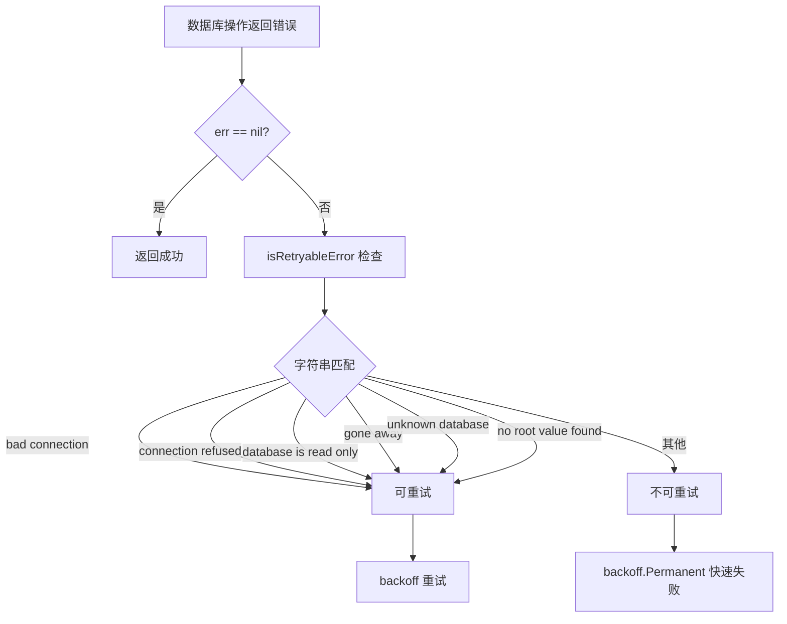
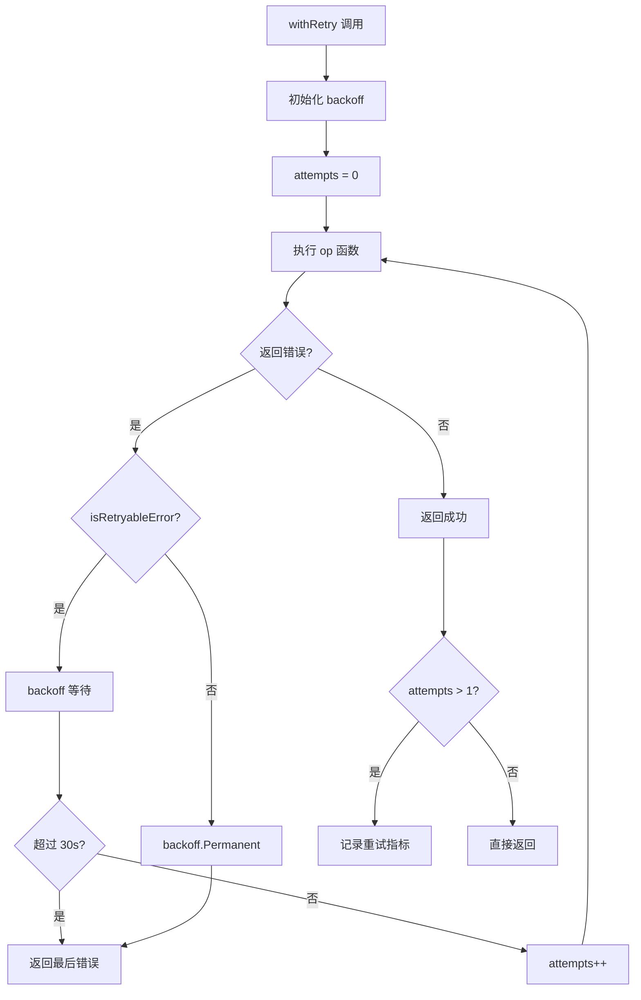
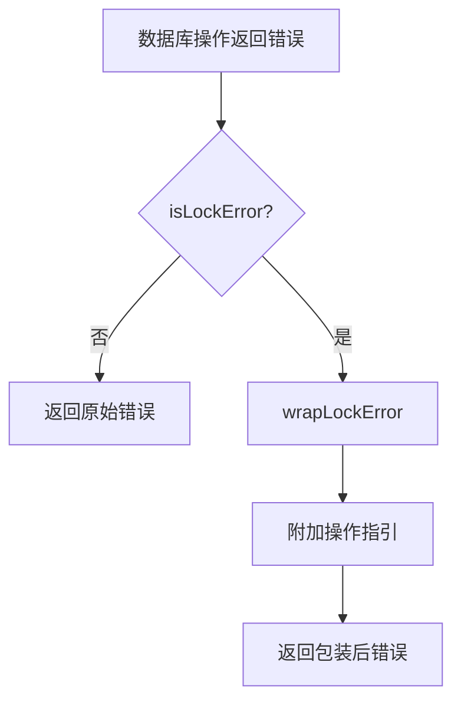

# PD-03.01 beads — Dolt 存储层指数退避重试机制

> 文档编号：PD-03.01
> 来源：beads `internal/storage/dolt/store.go`, `internal/storage/dolt/retry_test.go`
> GitHub：https://github.com/steveyegge/beads.git
> 问题域：PD-03 容错与重试 Fault Tolerance & Retry
> 状态：可复用方案

---

## 第 1 章 问题与动机（≥ 30 行）

### 1.1 核心问题

在 Agent 系统中，存储层是关键的基础设施。beads 使用 Dolt（一个支持版本控制的 MySQL 兼容数据库）作为存储后端，通过 MySQL 协议连接到 `dolt sql-server`。这种架构面临多种瞬态故障：

1. **网络瞬态错误**：连接池中的陈旧连接、短暂的网络抖动、服务器重启导致的连接中断
2. **数据库锁冲突**：多进程并发访问 Dolt 存储层时的锁竞争、崩溃后遗留的陈旧锁文件
3. **Dolt 内部竞态**：CREATE DATABASE 后服务器内存目录未及时更新（"Unknown database"）、信息模式查询时根值未初始化（"no root value found in session"）
4. **服务器状态异常**：高负载下 Dolt 进入只读模式（"database is read only"）、连接超时、连接被服务器主动断开

这些错误如果不重试，会导致 Agent 操作失败，但它们本质上是**可恢复的瞬态错误**，在短时间内（通常 1-30 秒）会自行解决。

### 1.2 beads 的解法概述

beads 在 Dolt 存储层实现了一套完整的重试机制，核心特点：

1. **模式识别驱动的重试决策**（`internal/storage/dolt/store.go:144-204`）：通过 `isRetryableError()` 函数识别 10+ 种可重试错误模式，包括 MySQL 驱动错误、网络错误、Dolt 特定错误
2. **指数退避 + 上下文感知**（`internal/storage/dolt/store.go:138-142`）：使用 `cenkalti/backoff` 库实现指数退避，最大重试时间 30 秒，支持上下文取消
3. **统一重试包装器**（`internal/storage/dolt/store.go:232-250`）：`withRetry()` 方法包装所有数据库操作，自动处理重试逻辑和指标记录
4. **锁错误特殊处理**（`internal/storage/dolt/store.go:206-229`）：识别锁错误并包装为带操作指引的友好错误消息
5. **事务级重试**（`internal/storage/dolt/transaction.go:40-44`）：事务操作也支持重试，确保原子性操作的容错性

### 1.3 设计思想

| 设计原则 | 具体实现 | 理由 | 替代方案 |
|----------|----------|------|----------|
| 错误模式识别优于错误码 | `isRetryableError()` 通过字符串匹配识别 10+ 种错误模式（`store.go:144-204`） | MySQL 驱动和 Dolt 的错误消息比错误码更稳定，且能捕获 Go net 包的错误 | 使用 MySQL 错误码（如 2006、2013）：无法覆盖 Go net 包错误和 Dolt 特定错误 |
| 指数退避 + 固定上限 | 使用 `backoff.NewExponentialBackOff()` 默认配置，`MaxElapsedTime=30s`（`store.go:136-142`） | 避免重试风暴，30 秒足以覆盖服务器重启、目录刷新等场景 | 固定间隔重试：可能在高负载时加剧拥塞；无上限重试：耗尽预算 |
| 永久错误快速失败 | 非可重试错误用 `backoff.Permanent()` 包装，立即停止重试（`store.go:242`） | 语法错误、表不存在等错误重试无意义，快速失败节省时间 | 所有错误都重试：浪费时间和资源 |
| 重试透明化 | `withRetry()` 包装所有 DB 操作（`execContext`、`queryContext`、`queryRowContext`），调用方无感知（`store.go:312-386`） | 简化调用代码，集中管理重试逻辑 | 每个调用点手动重试：代码重复，容易遗漏 |
| 锁错误友好化 | `wrapLockError()` 检测锁错误并附加操作指引（`store.go:220-229`） | 锁错误通常需要人工介入（重启服务器、清理锁文件），友好提示加速问题解决 | 直接抛出原始错误：用户不知道如何处理 |
| 指标驱动优化 | 记录重试次数到 OTel 指标 `bd.db.retry_count`（`store.go:247`） | 监控重试频率，识别存储层不稳定性 | 无监控：问题隐藏在日志中 |

---

## 第 2 章 源码实现分析（≥ 60 行，核心章节）

### 2.1 架构概览

beads 的重试机制分为三层：

```
┌─────────────────────────────────────────────────────────────┐
│                     调用层（业务逻辑）                        │
│  CreateIssue / UpdateIssue / QueryIssues / RunInTransaction │
└────────────────────┬────────────────────────────────────────┘
                     │ 透明调用
┌────────────────────▼────────────────────────────────────────┐
│                  重试包装层（withRetry）                      │
│  • 指数退避策略（backoff.ExponentialBackOff）                │
│  • 错误分类（isRetryableError / backoff.Permanent）          │
│  • 指标记录（doltMetrics.retryCount）                        │
└────────────────────┬────────────────────────────────────────┘
                     │ 重试循环
┌────────────────────▼────────────────────────────────────────┐
│              数据库操作层（execContext / queryContext）       │
│  • MySQL 协议调用（sql.DB.ExecContext / QueryContext）       │
│  • 连接池管理（MaxOpenConns / ConnMaxLifetime）              │
│  • OTel 追踪（doltTracer.Start）                            │
└────────────────────┬────────────────────────────────────────┘
                     │ MySQL 协议
┌────────────────────▼────────────────────────────────────────┐
│                  Dolt SQL Server                             │
│  • 版本控制数据库（commit / branch / merge）                 │
│  • MySQL 兼容协议（端口 3307）                               │
└─────────────────────────────────────────────────────────────┘
```

关键组件：
- **错误识别器**（`isRetryableError`）：模式匹配引擎，识别 10+ 种可重试错误
- **重试包装器**（`withRetry`）：统一重试逻辑，包装所有 DB 操作
- **退避策略**（`newServerRetryBackoff`）：指数退避配置，30 秒上限
- **锁错误处理器**（`wrapLockError`）：识别锁错误并附加操作指引

### 2.2 核心实现

#### 2.2.1 错误模式识别引擎



对应源码 `internal/storage/dolt/store.go:144-204`：

```go
// isRetryableError returns true if the error is a transient connection error
// that should be retried in server mode.
func isRetryableError(err error) bool {
	if err == nil {
		return false
	}
	errStr := strings.ToLower(err.Error())
	
	// MySQL driver transient errors
	if strings.Contains(errStr, "driver: bad connection") {
		return true
	}
	if strings.Contains(errStr, "invalid connection") {
		return true
	}
	
	// Network transient errors (brief blips, not persistent failures)
	if strings.Contains(errStr, "broken pipe") {
		return true
	}
	if strings.Contains(errStr, "connection reset") {
		return true
	}
	
	// Server restart: "connection refused" is transient — the server may
	// come back within the backoff window (30s). Retrying here prevents
	// a brief server outage from cascading into permanent failures.
	if strings.Contains(errStr, "connection refused") {
		return true
	}
	
	// Dolt read-only mode: under load, Dolt may enter read-only mode with
	// "cannot update manifest: database is read only". This clears after
	// a server restart, so it's worth retrying.
	if strings.Contains(errStr, "database is read only") {
		return true
	}
	
	// MySQL error 2013: mid-query disconnect
	if strings.Contains(errStr, "lost connection") {
		return true
	}
	
	// MySQL error 2006: idle connection timeout
	if strings.Contains(errStr, "gone away") {
		return true
	}
	
	// Go net package timeout on read/write
	if strings.Contains(errStr, "i/o timeout") {
		return true
	}
	
	// Dolt server catalog race: after CREATE DATABASE, the server's in-memory
	// catalog may not have registered the new database yet. The immediately
	// following USE (implicit via DSN) fails with "Unknown database". This is
	// transient and resolves once the catalog refreshes. (GH-1851)
	if strings.Contains(errStr, "unknown database") {
		return true
	}
	
	// Dolt internal race: after CREATE DATABASE, information_schema queries
	// on the new database may fail with "no root value found in session" if
	// the server hasn't finished initializing the database's root value.
	// This is transient and resolves on retry.
	if strings.Contains(errStr, "no root value found") {
		return true
	}
	
	return false
}
```

**设计亮点**：
1. **大小写不敏感**：`strings.ToLower(err.Error())` 确保匹配鲁棒性
2. **详细注释**：每种错误模式都有注释说明触发场景和重试理由
3. **覆盖三层错误**：MySQL 驱动错误、Go net 包错误、Dolt 特定错误

#### 2.2.2 统一重试包装器



对应源码 `internal/storage/dolt/store.go:232-250`：

```go
// withRetry executes an operation with retry for transient errors.
func (s *DoltStore) withRetry(ctx context.Context, op func() error) error {
	attempts := 0
	bo := newServerRetryBackoff()
	err := backoff.Retry(func() error {
		attempts++
		err := op()
		if err != nil && isRetryableError(err) {
			return err // Retryable - backoff will retry
		}
		if err != nil {
			return backoff.Permanent(err) // Non-retryable - stop immediately
		}
		return nil
	}, backoff.WithContext(bo, ctx))
	if attempts > 1 {
		doltMetrics.retryCount.Add(ctx, int64(attempts-1))
	}
	return err
}
```

**设计亮点**：
1. **上下文感知**：`backoff.WithContext(bo, ctx)` 支持取消和超时
2. **永久错误快速失败**：`backoff.Permanent(err)` 立即停止重试
3. **指标记录**：只记录实际发生的重试（`attempts > 1`）

#### 2.2.3 指数退避配置

对应源码 `internal/storage/dolt/store.go:136-142`：

```go
// Retry configuration for transient connection errors (stale pool connections,
// brief network issues, server restarts).
const serverRetryMaxElapsed = 30 * time.Second

func newServerRetryBackoff() backoff.BackOff {
	bo := backoff.NewExponentialBackOff()
	bo.MaxElapsedTime = serverRetryMaxElapsed
	return bo
}
```

`backoff.NewExponentialBackOff()` 的默认参数：
- `InitialInterval`: 500ms
- `Multiplier`: 1.5
- `MaxInterval`: 60s（但 `MaxElapsedTime=30s` 会先触发）
- `RandomizationFactor`: 0.5（加入 ±50% 抖动）

重试时间序列示例：
```
尝试 1: 0ms（立即）
尝试 2: 500ms ± 250ms（250-750ms）
尝试 3: 750ms ± 375ms（375-1125ms）
尝试 4: 1125ms ± 562ms（563-1687ms）
...
总时长上限: 30s
```

#### 2.2.4 锁错误友好化



对应源码 `internal/storage/dolt/store.go:206-229`：

```go
// isLockError returns true if the error indicates a Dolt lock contention problem.
// These can occur when the Dolt server's storage layer is locked by another
// process or a stale LOCK file was left behind by a crashed server.
func isLockError(err error) bool {
	if err == nil {
		return false
	}
	errStr := strings.ToLower(err.Error())
	return strings.Contains(errStr, "database is locked") ||
		strings.Contains(errStr, "lock file") ||
		strings.Contains(errStr, "noms lock") ||
		strings.Contains(errStr, "locked by another dolt process")
}

// wrapLockError wraps lock-related errors with actionable guidance.
// Non-lock errors and nil are returned unchanged.
func wrapLockError(err error) error {
	if !isLockError(err) {
		return err
	}
	return fmt.Errorf("%w\n\nThe Dolt database is locked. This usually means the Dolt server's "+
		"storage is held by another process or a stale lock file exists.\n"+
		"Try restarting the Dolt server, or run 'bd doctor --fix' to clean stale lock files.", err)
}
```

**设计亮点**：
1. **操作指引**：错误消息包含具体的修复步骤（重启服务器、运行 `bd doctor --fix`）
2. **原始错误保留**：使用 `%w` 保留原始错误链，便于调试

#### 2.2.5 事务级重试

对应源码 `internal/storage/dolt/transaction.go:40-44`：

```go
// RunInTransaction executes a function within a database transaction.
// The commitMsg is used for the DOLT_COMMIT that occurs inside the transaction,
// making the write atomically visible in Dolt's version history.
// Wisp routing is handled within individual transaction methods based on ID/Ephemeral flag.
func (s *DoltStore) RunInTransaction(ctx context.Context, commitMsg string, fn func(tx storage.Transaction) error) error {
	return s.withRetry(ctx, func() error {
		return s.runDoltTransaction(ctx, commitMsg, fn)
	})
}
```

**设计亮点**：
1. **整个事务重试**：如果事务中的任何操作失败且可重试，整个事务会重新执行
2. **幂等性要求**：`fn` 必须是幂等的，因为可能被多次执行

### 2.3 实现细节

#### 2.3.1 连接池配置

对应源码 `internal/storage/dolt/store.go:652-659`：

```go
// Server mode supports multi-writer, configure reasonable pool size
maxOpen := 10
if cfg.MaxOpenConns > 0 {
	maxOpen = cfg.MaxOpenConns
}
db.SetMaxOpenConns(maxOpen)
db.SetMaxIdleConns(min(5, maxOpen))
db.SetConnMaxLifetime(5 * time.Minute)
```

**设计考量**：
- `MaxOpenConns=10`：支持并发操作，但避免耗尽 Dolt 服务器连接
- `MaxIdleConns=5`：保持一定数量的空闲连接，减少连接建立开销
- `ConnMaxLifetime=5min`：定期刷新连接，避免陈旧连接累积

#### 2.3.2 DSN 超时配置

对应源码 `internal/storage/dolt/store.go:630-637`：

```go
// Timeouts prevent agents from blocking forever when Dolt server hangs.
// timeout=5s: TCP connect timeout
// readTimeout=10s: I/O read timeout (covers hung queries)
// writeTimeout=10s: I/O write timeout
params := "parseTime=true&timeout=5s&readTimeout=10s&writeTimeout=10s"
if cfg.ServerTLS {
	params += "&tls=true"
}
```

**设计考量**：
- `timeout=5s`：TCP 连接超时，快速检测服务器不可达
- `readTimeout=10s`：查询超时，防止慢查询阻塞
- `writeTimeout=10s`：写入超时，防止写入阻塞

这些超时与 `withRetry` 的 30 秒上限配合：单次操作最多 10 秒，重试窗口 30 秒，最多可重试 2-3 次。

#### 2.3.3 OTel 可观测性

对应源码 `internal/storage/dolt/store.go:256-274`：

```go
// doltMetrics holds OTel metric instruments for the dolt storage backend.
// Instruments are registered against the global delegating provider at init time,
// so they automatically forward to the real provider once telemetry.Init() runs.
var doltMetrics struct {
	retryCount metric.Int64Counter
	lockWaitMs metric.Float64Histogram
}

func init() {
	m := otel.Meter("github.com/steveyegge/beads/storage/dolt")
	doltMetrics.retryCount, _ = m.Int64Counter("bd.db.retry_count",
		metric.WithDescription("SQL operations retried due to server-mode transient errors"),
		metric.WithUnit("{retry}"),
	)
	doltMetrics.lockWaitMs, _ = m.Float64Histogram("bd.db.lock_wait_ms",
		metric.WithDescription("Time spent waiting to acquire the dolt access lock"),
		metric.WithUnit("ms"),
	)
}
```

**设计亮点**：
1. **延迟初始化**：指标在 `init()` 时注册到全局 provider，实际生效在 `telemetry.Init()` 后
2. **重试计数**：`bd.db.retry_count` 记录重试次数，用于监控存储层稳定性
3. **锁等待时间**：`bd.db.lock_wait_ms` 记录锁等待时间，识别锁竞争问题

---
## 第 3 章 迁移指南（≥ 40 行）

### 3.1 迁移清单

将 beads 的重试机制迁移到自己的项目，分为以下阶段：

#### 阶段 1：依赖准备
- [ ] 安装 `github.com/cenkalti/backoff/v4` 库
- [ ] 如果使用 OTel，安装 `go.opentelemetry.io/otel/metric`

#### 阶段 2：错误识别器
- [ ] 复制 `isRetryableError()` 函数到项目中
- [ ] 根据实际使用的数据库/服务，调整错误模式列表
- [ ] 添加项目特定的瞬态错误模式（如 Redis 连接错误、外部 API 超时等）

#### 阶段 3：重试包装器
- [ ] 实现 `withRetry()` 方法，包装需要重试的操作
- [ ] 配置退避策略（初始间隔、最大时长、抖动因子）
- [ ] 添加上下文支持（取消、超时）

#### 阶段 4：集成到现有代码
- [ ] 识别所有需要重试的操作（数据库查询、外部 API 调用、文件 I/O 等）
- [ ] 用 `withRetry()` 包装这些操作
- [ ] 确保被包装的操作是幂等的（或在非幂等操作前加检查）

#### 阶段 5：可观测性
- [ ] 添加重试计数指标（Prometheus / OTel）
- [ ] 添加日志记录（每次重试记录错误和重试次数）
- [ ] 配置告警（重试率过高时触发）

#### 阶段 6：测试
- [ ] 编写单元测试，覆盖可重试错误、不可重试错误、超时场景
- [ ] 编写集成测试，模拟真实的瞬态故障（网络抖动、服务重启）
- [ ] 压力测试，验证高并发下的重试行为

### 3.2 适配代码模板

#### 模板 1：通用重试包装器（Go）

```go
package retry

import (
	"context"
	"strings"
	"time"

	"github.com/cenkalti/backoff/v4"
)

// RetryConfig holds retry configuration
type RetryConfig struct {
	MaxElapsedTime time.Duration
	InitialInterval time.Duration
	Multiplier float64
	MaxInterval time.Duration
}

// DefaultRetryConfig returns sensible defaults
func DefaultRetryConfig() *RetryConfig {
	return &RetryConfig{
		MaxElapsedTime: 30 * time.Second,
		InitialInterval: 500 * time.Millisecond,
		Multiplier: 1.5,
		MaxInterval: 60 * time.Second,
	}
}

// IsRetryableError checks if an error should be retried
// Customize this function based on your error types
func IsRetryableError(err error) bool {
	if err == nil {
		return false
	}
	errStr := strings.ToLower(err.Error())
	
	// Network errors
	if strings.Contains(errStr, "connection refused") ||
		strings.Contains(errStr, "connection reset") ||
		strings.Contains(errStr, "broken pipe") ||
		strings.Contains(errStr, "i/o timeout") {
		return true
	}
	
	// Database errors (MySQL example)
	if strings.Contains(errStr, "bad connection") ||
		strings.Contains(errStr, "gone away") ||
		strings.Contains(errStr, "lost connection") {
		return true
	}
	
	// Add your custom retryable error patterns here
	
	return false
}

// WithRetry executes an operation with exponential backoff retry
func WithRetry(ctx context.Context, cfg *RetryConfig, op func() error) error {
	if cfg == nil {
		cfg = DefaultRetryConfig()
	}
	
	bo := backoff.NewExponentialBackOff()
	bo.InitialInterval = cfg.InitialInterval
	bo.Multiplier = cfg.Multiplier
	bo.MaxInterval = cfg.MaxInterval
	bo.MaxElapsedTime = cfg.MaxElapsedTime
	
	attempts := 0
	err := backoff.Retry(func() error {
		attempts++
		err := op()
		if err != nil && IsRetryableError(err) {
			// Log retry attempt (optional)
			// log.Printf("Retry attempt %d: %v", attempts, err)
			return err // Retryable
		}
		if err != nil {
			return backoff.Permanent(err) // Non-retryable
		}
		return nil
	}, backoff.WithContext(bo, ctx))
	
	// Record metrics (optional)
	if attempts > 1 {
		// metrics.RetryCount.Add(ctx, int64(attempts-1))
	}
	
	return err
}
```

#### 模板 2：数据库操作重试（Go）

```go
package database

import (
	"context"
	"database/sql"
	"fmt"
	
	"yourproject/retry"
)

type DB struct {
	db *sql.DB
}

// QueryWithRetry executes a query with retry
func (d *DB) QueryWithRetry(ctx context.Context, query string, args ...interface{}) (*sql.Rows, error) {
	var rows *sql.Rows
	err := retry.WithRetry(ctx, nil, func() error {
		// Close any rows from previous failed attempt
		if rows != nil {
			_ = rows.Close()
			rows = nil
		}
		var queryErr error
		rows, queryErr = d.db.QueryContext(ctx, query, args...)
		return queryErr
	})
	return rows, err
}

// ExecWithRetry executes a statement with retry
func (d *DB) ExecWithRetry(ctx context.Context, query string, args ...interface{}) (sql.Result, error) {
	var result sql.Result
	err := retry.WithRetry(ctx, nil, func() error {
		tx, txErr := d.db.BeginTx(ctx, nil)
		if txErr != nil {
			return txErr
		}
		var execErr error
		result, execErr = tx.ExecContext(ctx, query, args...)
		if execErr != nil {
			_ = tx.Rollback()
			return execErr
		}
		return tx.Commit()
	})
	return result, err
}
```

#### 模板 3：HTTP 客户端重试（Go）

```go
package httpclient

import (
	"context"
	"io"
	"net/http"
	"strings"
	
	"yourproject/retry"
)

// IsRetryableHTTPError checks if an HTTP error should be retried
func IsRetryableHTTPError(err error, resp *http.Response) bool {
	if err != nil {
		errStr := strings.ToLower(err.Error())
		// Network errors
		if strings.Contains(errStr, "timeout") ||
			strings.Contains(errStr, "connection refused") ||
			strings.Contains(errStr, "connection reset") {
			return true
		}
	}
	
	if resp != nil {
		// Retry on 5xx server errors and 429 rate limit
		if resp.StatusCode >= 500 || resp.StatusCode == 429 {
			return true
		}
	}
	
	return false
}

// DoWithRetry executes an HTTP request with retry
func DoWithRetry(ctx context.Context, client *http.Client, req *http.Request) (*http.Response, error) {
	var resp *http.Response
	err := retry.WithRetry(ctx, nil, func() error {
		// Clone request for retry (body may have been consumed)
		reqClone := req.Clone(ctx)
		
		var doErr error
		resp, doErr = client.Do(reqClone)
		
		if IsRetryableHTTPError(doErr, resp) {
			if resp != nil {
				_ = resp.Body.Close()
			}
			return doErr
		}
		
		if doErr != nil {
			return retry.backoff.Permanent(doErr)
		}
		
		return nil
	})
	
	return resp, err
}
```

### 3.3 适用场景

| 场景 | 适用度 | 说明 |
|------|--------|------|
| 数据库连接池操作 | ⭐⭐⭐⭐⭐ | 最适合场景，连接池中的陈旧连接、网络抖动都是瞬态错误 |
| 外部 API 调用 | ⭐⭐⭐⭐⭐ | HTTP 5xx 错误、网络超时、速率限制都适合重试 |
| 分布式锁获取 | ⭐⭐⭐⭐ | 锁竞争、锁服务短暂不可用适合重试，但需注意死锁风险 |
| 文件 I/O 操作 | ⭐⭐⭐ | 网络文件系统（NFS、S3）的瞬态错误适合重试，本地磁盘错误通常不可重试 |
| 消息队列操作 | ⭐⭐⭐⭐ | 连接断开、broker 重启适合重试，但需确保消息幂等性 |
| LLM API 调用 | ⭐⭐⭐⭐⭐ | 速率限制、服务过载、网络超时都适合重试，但需注意成本控制 |
| 事务性操作 | ⭐⭐⭐ | 整个事务可以重试，但必须确保幂等性（如使用唯一约束防止重复插入） |
| 非幂等写操作 | ⭐⭐ | 需要额外的幂等性保证（如幂等键、版本号），否则可能导致重复写入 |
| 实时性要求高的操作 | ⭐⭐ | 30 秒的重试窗口可能超过实时性要求，需缩短 `MaxElapsedTime` |

**不适用场景**：
- 用户输入验证错误（语法错误、类型错误）：重试无意义
- 权限错误（403 Forbidden）：重试不会改变权限
- 资源不存在错误（404 Not Found）：重试不会让资源出现
- 业务逻辑错误（余额不足、库存不足）：重试不会改变业务状态

---

## 第 4 章 测试用例（≥ 20 行）

基于 beads 的 `internal/storage/dolt/retry_test.go`，以下是可直接运行的测试用例：

```go
package retry_test

import (
	"context"
	"errors"
	"testing"
	"time"
	
	"yourproject/retry"
)

func TestIsRetryableError(t *testing.T) {
	tests := []struct {
		name     string
		err      error
		expected bool
	}{
		{
			name:     "nil error",
			err:      nil,
			expected: false,
		},
		{
			name:     "driver bad connection",
			err:      errors.New("driver: bad connection"),
			expected: true,
		},
		{
			name:     "connection refused - retryable",
			err:      errors.New("dial tcp: connection refused"),
			expected: true,
		},
		{
			name:     "database is read only - retryable",
			err:      errors.New("cannot update manifest: database is read only"),
			expected: true,
		},
		{
			name:     "server gone away - retryable",
			err:      errors.New("Error 2006: MySQL server has gone away"),
			expected: true,
		},
		{
			name:     "i/o timeout - retryable",
			err:      errors.New("read tcp 127.0.0.1:3307: i/o timeout"),
			expected: true,
		},
		{
			name:     "unknown database - retryable (catalog race)",
			err:      errors.New("Error 1049 (42000): Unknown database 'test_db'"),
			expected: true,
		},
		{
			name:     "syntax error - not retryable",
			err:      errors.New("Error 1064: You have an error in your SQL syntax"),
			expected: false,
		},
		{
			name:     "table not found - not retryable",
			err:      errors.New("Error 1146: Table 'db.foo' doesn't exist"),
			expected: false,
		},
	}
	
	for _, tt := range tests {
		t.Run(tt.name, func(t *testing.T) {
			got := retry.IsRetryableError(tt.err)
			if got != tt.expected {
				t.Errorf("IsRetryableError(%v) = %v, want %v", tt.err, got, tt.expected)
			}
		})
	}
}

func TestWithRetry_Success(t *testing.T) {
	callCount := 0
	err := retry.WithRetry(context.Background(), nil, func() error {
		callCount++
		return nil
	})
	
	if err != nil {
		t.Errorf("unexpected error: %v", err)
	}
	if callCount != 1 {
		t.Errorf("expected 1 call on success, got %d", callCount)
	}
}

func TestWithRetry_RetryOnTransientError(t *testing.T) {
	callCount := 0
	err := retry.WithRetry(context.Background(), nil, func() error {
		callCount++
		if callCount < 3 {
			return errors.New("driver: bad connection")
		}
		return nil // Success on 3rd attempt
	})
	
	if err != nil {
		t.Errorf("unexpected error: %v", err)
	}
	if callCount != 3 {
		t.Errorf("expected 3 calls (2 retries + success), got %d", callCount)
	}
}

func TestWithRetry_NonRetryableError(t *testing.T) {
	callCount := 0
	err := retry.WithRetry(context.Background(), nil, func() error {
		callCount++
		return errors.New("syntax error in SQL")
	})
	
	if err == nil {
		t.Error("expected error, got nil")
	}
	if callCount != 1 {
		t.Errorf("expected 1 call for non-retryable error, got %d", callCount)
	}
}

func TestWithRetry_ContextCancellation(t *testing.T) {
	ctx, cancel := context.WithCancel(context.Background())
	
	callCount := 0
	err := retry.WithRetry(ctx, nil, func() error {
		callCount++
		if callCount == 2 {
			cancel() // Cancel after 2nd attempt
		}
		return errors.New("driver: bad connection")
	})
	
	if err == nil {
		t.Error("expected error due to context cancellation")
	}
	if callCount < 2 {
		t.Errorf("expected at least 2 calls before cancellation, got %d", callCount)
	}
}

func TestWithRetry_Timeout(t *testing.T) {
	cfg := &retry.RetryConfig{
		MaxElapsedTime: 1 * time.Second,
		InitialInterval: 100 * time.Millisecond,
		Multiplier: 2.0,
		MaxInterval: 500 * time.Millisecond,
	}
	
	callCount := 0
	start := time.Now()
	err := retry.WithRetry(context.Background(), cfg, func() error {
		callCount++
		return errors.New("connection refused")
	})
	elapsed := time.Since(start)
	
	if err == nil {
		t.Error("expected error due to timeout")
	}
	if elapsed < 1*time.Second || elapsed > 2*time.Second {
		t.Errorf("expected timeout around 1s, got %v", elapsed)
	}
	if callCount < 3 {
		t.Errorf("expected multiple retry attempts, got %d", callCount)
	}
}
```

**测试覆盖**：
1. ✅ 错误识别：可重试错误、不可重试错误、nil 错误
2. ✅ 重试逻辑：成功场景、重试后成功、永久失败
3. ✅ 上下文控制：取消、超时
4. ✅ 退避策略：时间窗口、重试次数

---
## 第 5 章 跨域关联

| 关联域 | 关系类型 | 说明 |
|--------|----------|------|
| PD-11 可观测性 | 协同 | 重试机制通过 OTel 指标（`bd.db.retry_count`）暴露重试次数，配合 PD-11 的成本追踪和性能监控，可以识别存储层不稳定性对整体系统的影响 |
| PD-04 工具系统 | 依赖 | 如果工具调用涉及数据库操作（如持久化工具调用历史），需要依赖 PD-03 的重试机制确保工具调用的可靠性 |
| PD-02 多 Agent 编排 | 协同 | 多 Agent 并发访问存储层时，锁竞争和连接池耗尽的概率增加，PD-03 的重试机制可以缓解这些问题，但需要配合 PD-02 的并发限制避免重试风暴 |
| PD-05 沙箱隔离 | 协同 | 沙箱环境中的文件 I/O 操作（如读取配置文件、写入日志）可能遇到瞬态错误（NFS 延迟、磁盘满），可以复用 PD-03 的重试模式 |
| PD-08 搜索与检索 | 协同 | 搜索引擎（Elasticsearch、向量数据库）的查询操作可能遇到超时、连接断开等瞬态错误，可以应用 PD-03 的重试策略 |

---

## 第 6 章 来源文件索引

| 文件 | 行范围 | 关键实现 |
|------|--------|----------|
| `internal/storage/dolt/store.go` | L144-L204 | `isRetryableError()` 错误模式识别函数，识别 10+ 种可重试错误 |
| `internal/storage/dolt/store.go` | L136-L142 | `newServerRetryBackoff()` 退避策略配置，30 秒上限 |
| `internal/storage/dolt/store.go` | L232-L250 | `withRetry()` 统一重试包装器，包装所有 DB 操作 |
| `internal/storage/dolt/store.go` | L206-L229 | `isLockError()` 和 `wrapLockError()` 锁错误识别和友好化 |
| `internal/storage/dolt/store.go` | L312-L337 | `execContext()` 写操作重试包装，包含事务管理 |
| `internal/storage/dolt/store.go` | L346-L368 | `queryContext()` 查询操作重试包装，包含连接清理 |
| `internal/storage/dolt/store.go` | L372-L386 | `queryRowContext()` 单行查询重试包装 |
| `internal/storage/dolt/store.go` | L256-L274 | OTel 指标定义（`retryCount`、`lockWaitMs`） |
| `internal/storage/dolt/store.go` | L630-L641 | DSN 超时配置（`timeout=5s`、`readTimeout=10s`、`writeTimeout=10s`） |
| `internal/storage/dolt/store.go` | L652-L659 | 连接池配置（`MaxOpenConns=10`、`MaxIdleConns=5`、`ConnMaxLifetime=5min`） |
| `internal/storage/dolt/transaction.go` | L40-L44 | `RunInTransaction()` 事务级重试 |
| `internal/storage/dolt/retry_test.go` | L9-L110 | `TestIsRetryableError` 错误识别测试用例 |
| `internal/storage/dolt/retry_test.go` | L112-L186 | `TestWithRetry_*` 重试逻辑测试用例 |
| `internal/compact/haiku.go` | L26-L29 | LLM API 调用的重试配置（`maxRetries=3`、`initialBackoff=1s`） |
| `internal/doltserver/doltserver.go` | L827-L842 | `waitForReady()` 服务器启动后的连接就绪轮询（类似重试模式） |
| `internal/storage/dolt/bootstrap.go` | L110-L155 | `acquireBootstrapLock()` 锁获取的轮询重试（非阻塞 flock + 超时） |

---

## 第 7 章 横向对比维度

```json comparison_data
{
  "project": "beads",
  "dimensions": {
    "存储层重试": "Dolt 数据库连接层，指数退避 30s 上限，10+ 种错误模式识别",
    "错误分类": "字符串匹配识别可重试错误（MySQL 驱动、Go net、Dolt 特定错误）",
    "重试策略": "指数退避（初始 500ms，倍数 1.5，±50% 抖动），永久错误快速失败",
    "超时保护": "DSN 级超时（连接 5s、读写 10s）+ 重试窗口 30s，双层防护",
    "锁错误处理": "识别 4 种锁错误模式，包装为带操作指引的友好错误",
    "事务重试": "整个事务重试，要求操作幂等性",
    "监控告警": "OTel 指标记录重试次数（bd.db.retry_count）和锁等待时间",
    "连接池管理": "MaxOpenConns=10，MaxIdleConns=5，ConnMaxLifetime=5min，定期刷新连接",
    "服务器自动启动": "连接失败时自动启动 Dolt 服务器（auto-start），配合重试机制实现零配置启动",
    "陈旧锁清理": "检测 5 分钟以上的陈旧锁文件并自动清理，避免死锁"
  }
}
```

### 域元数据补充

```json domain_metadata
{
  "solution_summary": "beads 在 Dolt 存储层用指数退避（30s 上限）+ 字符串模式匹配识别 10+ 种瞬态错误（MySQL 驱动、网络、Dolt 竞态），配合连接池管理和 OTel 监控实现存储层容错",
  "description": "存储层重试需要识别数据库特定的瞬态错误（连接池陈旧连接、服务器重启、内部竞态），并配合连接池管理和超时保护",
  "sub_problems": [
    "数据库连接池陈旧连接：连接池中的连接可能因服务器重启、网络抖动而失效，需要识别 'bad connection'、'gone away' 等错误并重试",
    "数据库内部竞态：CREATE DATABASE 后服务器内存目录未及时更新（'Unknown database'）、信息模式查询时根值未初始化（'no root value found'），需要短时间重试等待初始化完成",
    "锁文件陈旧：进程崩溃后遗留的锁文件导致后续操作失败，需要检测陈旧锁（如 5 分钟以上）并自动清理",
    "连接池耗尽：高并发下连接池满导致操作阻塞，需要配合重试机制和连接池配置（MaxOpenConns、ConnMaxLifetime）缓解",
    "服务器冷启动：首次连接时服务器未启动，需要自动启动服务器并重试连接（auto-start 模式）"
  ],
  "best_practices": [
    "字符串匹配识别错误：数据库驱动的错误消息比错误码更稳定，且能覆盖 Go net 包和数据库特定错误",
    "连接池定期刷新：设置 ConnMaxLifetime（如 5 分钟）定期刷新连接，避免陈旧连接累积",
    "DSN 级超时 + 重试窗口：DSN 配置短超时（5-10 秒）快速检测故障，重试窗口（30 秒）覆盖服务器重启场景",
    "锁错误友好化：识别锁错误并附加操作指引（如 '运行 bd doctor --fix 清理陈旧锁'），加速问题解决",
    "重试前清理资源：重试前关闭上次失败的连接/Rows（如 `rows.Close()`），避免连接泄漏"
  ]
}
```

---

## 附录：beads 重试机制的工程哲学

beads 的重试机制体现了以下工程哲学：

### 1. 瞬态错误是常态，不是异常

在分布式系统中，网络抖动、服务重启、资源竞争都是**正常现象**，而不是需要人工介入的异常。重试机制将这些瞬态错误视为系统的一部分，通过自动重试实现自愈。

### 2. 错误分类比错误捕获更重要

不是所有错误都应该重试。beads 通过 `isRetryableError()` 明确区分可重试错误和永久错误，避免无意义的重试（如语法错误、权限错误）。这种分类思维比简单的 "捕获所有错误并重试" 更有价值。

### 3. 指数退避是对系统的尊重

固定间隔重试可能在系统高负载时加剧拥塞（重试风暴）。指数退避通过逐渐增加重试间隔，给系统恢复的时间，体现了对系统容量的尊重。

### 4. 上下文是重试的边界

重试不是无限的。通过 `context.Context` 传递取消信号和超时，确保重试在合理的时间窗口内完成，避免无限等待。

### 5. 可观测性是重试的眼睛

重试机制如果没有可观测性，就是一个黑盒。beads 通过 OTel 指标记录重试次数，让运维人员能够识别存储层的不稳定性，并采取措施（如增加连接池大小、优化查询）。

### 6. 友好的错误消息是对用户的尊重

锁错误、连接错误等问题对普通用户来说是晦涩的。beads 通过 `wrapLockError()` 将技术错误转化为带操作指引的友好消息，降低用户的认知负担。

### 7. 重试是最后一道防线，不是第一道

重试机制不应该掩盖系统的根本问题。如果重试率持续升高，说明系统存在更深层次的问题（如连接池配置不当、服务器资源不足），需要从根本上解决，而不是依赖重试。

---

**文档生成时间**：2026-02-27
**文档版本**：1.0
**维护者**：Butcher Wiki 自动生成
