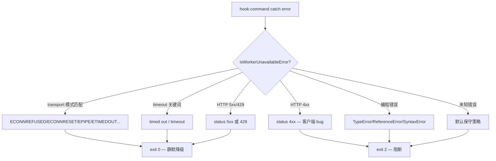
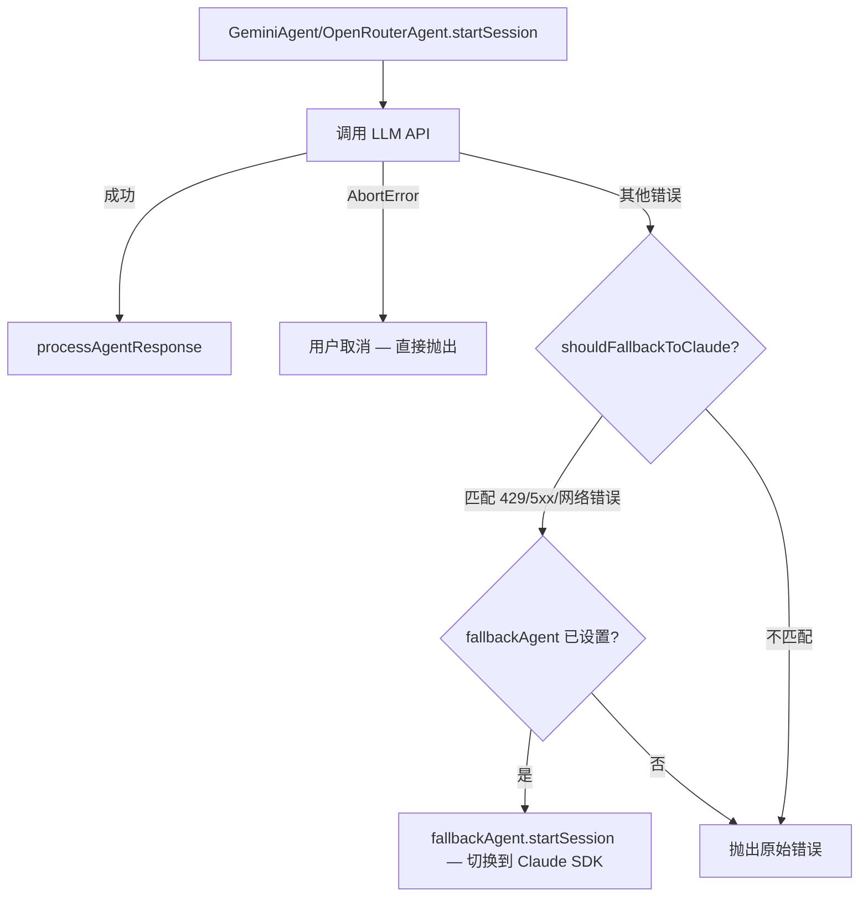
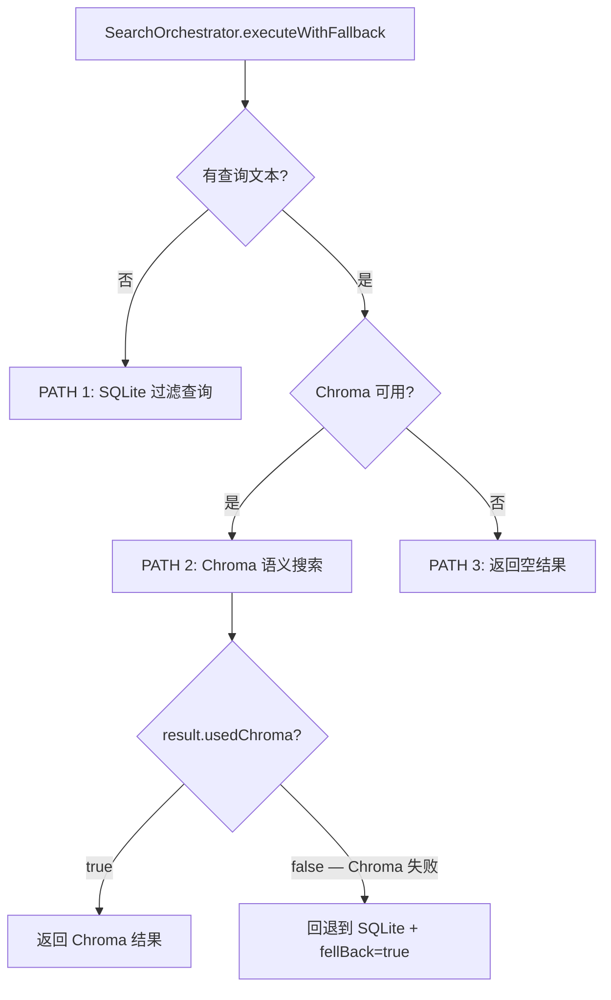

# PD-03.09 claude-mem — 多层容错：Hook 错误分类 × Provider 自动降级 × 存储层回退

> 文档编号：PD-03.09
> 来源：claude-mem `src/cli/hook-command.ts` `src/services/worker/agents/FallbackErrorHandler.ts` `src/services/worker/search/SearchOrchestrator.ts`
> GitHub：https://github.com/thedotmack/claude-mem.git
> 问题域：PD-03 容错与重试 Fault Tolerance & Retry
> 状态：可复用方案

---

## 第 1 章 问题与动机

### 1.1 核心问题

claude-mem 是一个 Claude Code 的记忆插件，以 hook 形式嵌入 Claude Code 的会话生命周期。它面临的容错挑战与普通 Agent 系统不同：

1. **Hook 不能阻塞用户**：claude-mem 作为 Claude Code 的 hook 运行，如果 hook 崩溃（exit 非 0），会阻断用户的正常编码流程。必须区分"worker 不可用"（应静默降级）和"代码 bug"（应暴露给开发者）
2. **多 Provider 切换**：支持 Claude SDK、Gemini、OpenRouter 三种 LLM Provider，任何一个 Provider 的 API 故障不应导致整个记忆系统瘫痪
3. **存储层双轨**：使用 ChromaDB（向量搜索）+ SQLite（结构化存储）双存储，Chroma 不可用时必须回退到 SQLite 保证基本功能
4. **消息队列持久化**：LLM 调用可能中途崩溃，已入队的消息不能丢失，需要自愈机制

### 1.2 claude-mem 的解法概述

claude-mem 实现了 **5 层容错体系**，从外到内依次为：

1. **Hook 层错误分类**（`hook-command.ts:26-66`）：基于错误模式匹配，将错误分为"worker 不可用"（exit 0 降级）和"代码 bug"（exit 2 阻断），确保 hook 永远不会无故阻塞用户
2. **Provider 层自动降级**（`FallbackErrorHandler.ts:25-29` + `GeminiAgent.ts:328` + `OpenRouterAgent.ts:268`）：Gemini/OpenRouter 遇到 429/5xx/网络错误时，自动回退到 Claude SDK 继续处理
3. **存储层策略回退**（`SearchOrchestrator.ts:81-121`）：Chroma 语义搜索失败时，自动降级到 SQLite 过滤查询
4. **队列层自愈**（`PendingMessageStore.ts:40-46`）：claim-confirm 模式 + 60 秒超时自愈，防止消息卡死
5. **基础设施层**（`HealthMonitor.ts` + `GracefulShutdown.ts`）：健康轮询、版本检测、7 步优雅关闭

### 1.3 设计思想

| 设计原则 | 具体实现 | 理由 | 替代方案 |
|----------|----------|------|----------|
| 错误分类优先于统一处理 | `isWorkerUnavailableError()` 区分 transport/5xx/4xx/编程错误 | 不同错误需要不同响应：降级 vs 暴露 | 统一 try-catch 全部吞掉（会隐藏 bug） |
| Provider 降级而非重试 | Gemini/OpenRouter 失败直接切换到 Claude SDK | 同一 Provider 重试可能持续失败（如 429），换 Provider 更有效 | 指数退避重试同一 Provider |
| 保守默认策略 | 未知错误默认 exit 2（阻断） | 宁可暴露未知错误，也不要静默吞掉 bug | 默认 exit 0（可能隐藏严重问题） |
| 存储层独立降级 | Chroma 失败不影响 SQLite 基本功能 | 向量搜索是增强功能，不是核心功能 | Chroma 失败则整个搜索不可用 |
| 消息持久化 + 自愈 | claim-confirm + 60s 超时重置 | 防止 LLM 调用中途崩溃导致消息永久卡死 | 内存队列（崩溃即丢失） |

---

## 第 2 章 源码实现分析

### 2.1 架构概览

claude-mem 的容错体系分为 5 层，每层独立处理不同级别的故障：

```
┌─────────────────────────────────────────────────────────────┐
│                    Layer 1: Hook 错误分类                      │
│  hook-command.ts — isWorkerUnavailableError()                │
│  exit 0 (降级) ← transport/5xx/429                           │
│  exit 2 (阻断) ← 4xx/编程错误/未知                            │
├─────────────────────────────────────────────────────────────┤
│                Layer 2: Provider 自动降级                      │
│  FallbackErrorHandler.ts — shouldFallbackToClaude()          │
│  Gemini/OpenRouter → Claude SDK (共享 conversationHistory)    │
├─────────────────────────────────────────────────────────────┤
│                Layer 3: 存储层策略回退                          │
│  SearchOrchestrator.ts — executeWithFallback()               │
│  Chroma 语义搜索 → SQLite 过滤查询                            │
├─────────────────────────────────────────────────────────────┤
│                Layer 4: 队列层自愈                             │
│  PendingMessageStore — claim-confirm + 60s 超时重置           │
│  SessionQueueProcessor — 3min 空闲超时 + 1s 错误退避          │
├─────────────────────────────────────────────────────────────┤
│                Layer 5: 基础设施层                             │
│  HealthMonitor — 轮询 + 版本检测                              │
│  GracefulShutdown — 7 步有序关闭                              │
└─────────────────────────────────────────────────────────────┘
```

### 2.2 核心实现

#### 2.2.1 Hook 层错误分类



对应源码 `src/cli/hook-command.ts:26-66`：

```typescript
export function isWorkerUnavailableError(error: unknown): boolean {
  const message = error instanceof Error ? error.message : String(error);
  const lower = message.toLowerCase();

  // Transport failures — worker unreachable
  const transportPatterns = [
    'econnrefused', 'econnreset', 'epipe', 'etimedout',
    'enotfound', 'econnaborted', 'enetunreach', 'ehostunreach',
    'fetch failed', 'unable to connect', 'socket hang up',
  ];
  if (transportPatterns.some(p => lower.includes(p))) return true;

  // Timeout errors — worker didn't respond in time
  if (lower.includes('timed out') || lower.includes('timeout')) return true;

  // HTTP 5xx server errors — worker has internal problems
  if (/failed:\s*5\d{2}/.test(message) || /status[:\s]+5\d{2}/.test(message)) return true;

  // HTTP 429 (rate limit) — treat as transient unavailability, not a bug
  if (/failed:\s*429/.test(message) || /status[:\s]+429/.test(message)) return true;

  // HTTP 4xx client errors — our bug, NOT worker unavailability
  if (/failed:\s*4\d{2}/.test(message) || /status[:\s]+4\d{2}/.test(message)) return false;

  // Programming errors — code bugs, not worker unavailability
  if (error instanceof TypeError || error instanceof ReferenceError
      || error instanceof SyntaxError) {
    return false;
  }

  // Default: treat unknown errors as blocking (conservative — surface bugs)
  return false;
}
```

Hook 主函数中的使用（`src/cli/hook-command.ts:91-107`）：

```typescript
} catch (error) {
    if (isWorkerUnavailableError(error)) {
      // Worker unavailable — degrade gracefully, don't block the user
      logger.warn('HOOK', `Worker unavailable, skipping hook: ${...}`);
      process.exit(HOOK_EXIT_CODES.SUCCESS);  // = 0 (graceful)
      return HOOK_EXIT_CODES.SUCCESS;
    }
    // Handler/client bug — surface to developer
    logger.error('HOOK', `Hook error: ${...}`);
    process.exit(HOOK_EXIT_CODES.BLOCKING_ERROR);  // = 2
    return HOOK_EXIT_CODES.BLOCKING_ERROR;
}
```

#### 2.2.2 Provider 层自动降级



对应源码 `src/services/worker/agents/FallbackErrorHandler.ts:25-29`：

```typescript
export function shouldFallbackToClaude(error: unknown): boolean {
  const message = getErrorMessage(error);
  return FALLBACK_ERROR_PATTERNS.some(pattern => message.includes(pattern));
}
```

FALLBACK_ERROR_PATTERNS 定义（`src/services/worker/agents/types.ts:125-133`）：

```typescript
export const FALLBACK_ERROR_PATTERNS = [
  '429',           // Rate limit
  '500',           // Internal server error
  '502',           // Bad gateway
  '503',           // Service unavailable
  'ECONNREFUSED',  // Connection refused
  'ETIMEDOUT',     // Timeout
  'fetch failed',  // Network failure
] as const;
```

GeminiAgent 中的降级调用（`src/services/worker/GeminiAgent.ts:321-342`）：

```typescript
} catch (error: unknown) {
  if (isAbortError(error)) {
    logger.warn('SDK', 'Gemini agent aborted', { sessionId: session.sessionDbId });
    throw error;  // 用户取消不降级
  }
  // Check if we should fall back to Claude
  if (shouldFallbackToClaude(error) && this.fallbackAgent) {
    logger.warn('SDK', 'Gemini API failed, falling back to Claude SDK', {
      sessionDbId: session.sessionDbId,
      error: error instanceof Error ? error.message : String(error),
    });
    // Fall back to Claude — 共享 conversationHistory 保持上下文
    return this.fallbackAgent.startSession(session, worker);
  }
  throw error;
}
```

#### 2.2.3 存储层策略回退



对应源码 `src/services/worker/search/SearchOrchestrator.ts:81-121`：

```typescript
private async executeWithFallback(options: NormalizedParams): Promise<StrategySearchResult> {
  // PATH 1: FILTER-ONLY (no query text) - Use SQLite
  if (!options.query) {
    return await this.sqliteStrategy.search(options);
  }
  // PATH 2: CHROMA SEMANTIC SEARCH (query text + Chroma available)
  if (this.chromaStrategy) {
    const result = await this.chromaStrategy.search(options);
    if (result.usedChroma) {
      return result;  // Chroma succeeded (even with 0 results)
    }
    // Chroma failed - fall back to SQLite
    const fallbackResult = await this.sqliteStrategy.search({
      ...options, query: undefined  // Remove query for SQLite fallback
    });
    return { ...fallbackResult, fellBack: true };
  }
  // PATH 3: No Chroma available
  return { results: { observations: [], sessions: [], prompts: [] },
           usedChroma: false, fellBack: false, strategy: 'sqlite' };
}
```

### 2.3 实现细节

#### 队列层自愈机制

PendingMessageStore 使用 claim-confirm 模式（`src/services/sqlite/PendingMessageStore.ts:30-46`）：

- **enqueue**：消息持久化到 SQLite，状态为 `pending`
- **claimNextMessage**：原子性地将下一条 `pending` 消息标记为 `processing`，同时自愈超过 60 秒的 `processing` 消息（重置为 `pending`）
- **confirmProcessed**：处理成功后删除消息

SessionQueueProcessor 增加了空闲超时保护（`src/services/queue/SessionQueueProcessor.ts:32-73`）：3 分钟无消息则触发 `onIdleTimeout` 回调终止子进程，防止 LLM 子进程僵死。错误时 1 秒退避防止紧密循环。

#### 基础设施层

HealthMonitor（`src/services/infrastructure/HealthMonitor.ts:35-54`）实现了通用的端点轮询函数 `pollEndpointUntilOk()`，500ms 间隔重试直到超时。版本检测（`HealthMonitor.ts:164-174`）在无法确定版本时采用"假设匹配"的优雅降级策略。

GracefulShutdown（`src/services/infrastructure/GracefulShutdown.ts:57-105`）执行 7 步有序关闭：枚举子进程 → 关闭 HTTP → 关闭会话 → 关闭 MCP → 关闭 Chroma → 关闭数据库 → 强杀残留子进程。Windows 平台额外增加端口释放延迟。

#### 上下文溢出检测

SDKAgent（`src/services/worker/SDKAgent.ts:199-205`）在 LLM 响应文本中检测 `prompt is too long` 和 `context window` 关键词，一旦发现立即 abort 会话，防止无限重试循环。OpenRouterAgent 还实现了滑动窗口截断（`OpenRouterAgent.ts:296-335`），按消息数和 token 估算双重限制防止上下文成本失控。

#### 速率限制

GeminiAgent（`src/services/worker/GeminiAgent.ts:64-83`）按模型 RPM 限制计算最小请求间隔（`60000/RPM + 100ms` 安全缓冲），可通过配置禁用（付费用户 1000+ RPM）。


---

## 第 3 章 迁移指南

### 3.1 迁移清单

**阶段 1：Hook 层错误分类（1 个文件）**
- [ ] 实现 `isWorkerUnavailableError()` 函数，定义 transport 模式列表
- [ ] 在 hook 入口的 catch 块中调用分类函数，分别处理降级和阻断
- [ ] 定义 exit code 常量（SUCCESS=0, BLOCKING_ERROR=2）

**阶段 2：Provider 降级（3 个文件）**
- [ ] 定义 `FALLBACK_ERROR_PATTERNS` 常量和 `shouldFallbackToClaude()` 函数
- [ ] 定义 `FallbackAgent` 接口（`startSession` 方法）
- [ ] 在每个非默认 Provider Agent 中添加 `setFallbackAgent()` 和 catch 块降级逻辑
- [ ] 确保 `isAbortError()` 排除用户取消操作

**阶段 3：存储层回退（2 个文件）**
- [ ] 实现 SearchOrchestrator 的 3 路径决策树
- [ ] 在 ChromaSearchStrategy 中 catch 所有错误并返回 `usedChroma: false`
- [ ] 在回退结果中标记 `fellBack: true` 供上层感知

**阶段 4：队列自愈（2 个文件）**
- [ ] 实现 claim-confirm 持久化队列（enqueue → claim → confirm）
- [ ] 在 claimNextMessage 中添加超时自愈逻辑（重置 stale processing 消息）
- [ ] 实现空闲超时检测（3 分钟无消息触发 abort）

### 3.2 适配代码模板

#### Hook 层错误分类器（TypeScript，可直接复用）

```typescript
// fault-classifier.ts — 通用 Hook 错误分类器
const TRANSPORT_PATTERNS = [
  'econnrefused', 'econnreset', 'epipe', 'etimedout',
  'enotfound', 'econnaborted', 'enetunreach', 'ehostunreach',
  'fetch failed', 'unable to connect', 'socket hang up',
];

export function isTransientError(error: unknown): boolean {
  const message = error instanceof Error ? error.message : String(error);
  const lower = message.toLowerCase();

  // Transport failures
  if (TRANSPORT_PATTERNS.some(p => lower.includes(p))) return true;
  // Timeout
  if (lower.includes('timed out') || lower.includes('timeout')) return true;
  // HTTP 5xx / 429
  if (/(?:failed|status)[:\s]+(?:5\d{2}|429)/.test(message)) return true;

  return false;
}

export function isProgrammingError(error: unknown): boolean {
  return error instanceof TypeError
    || error instanceof ReferenceError
    || error instanceof SyntaxError;
}

// 使用示例
export async function safeHookExecution(fn: () => Promise<void>): Promise<number> {
  try {
    await fn();
    return 0;
  } catch (error) {
    if (isTransientError(error)) {
      console.warn('Service unavailable, degrading gracefully');
      return 0;  // 不阻塞用户
    }
    console.error('Bug detected:', error);
    return 2;  // 阻断，暴露给开发者
  }
}
```

#### Provider 降级器（TypeScript，可直接复用）

```typescript
// provider-fallback.ts — 通用 Provider 降级器
const FALLBACK_PATTERNS = ['429', '500', '502', '503', 'ECONNREFUSED', 'ETIMEDOUT', 'fetch failed'];

export interface FallbackProvider<TSession, TWorker> {
  startSession(session: TSession, worker?: TWorker): Promise<void>;
}

export function shouldFallback(error: unknown): boolean {
  const msg = error instanceof Error ? error.message : String(error);
  return FALLBACK_PATTERNS.some(p => msg.includes(p));
}

export function isAbortError(error: unknown): boolean {
  return error instanceof Error && error.name === 'AbortError';
}

// 使用示例：在 Agent 的 catch 块中
export async function withProviderFallback<TSession, TWorker>(
  primaryFn: () => Promise<void>,
  fallback: FallbackProvider<TSession, TWorker> | null,
  session: TSession,
  worker?: TWorker
): Promise<void> {
  try {
    await primaryFn();
  } catch (error) {
    if (isAbortError(error)) throw error;
    if (shouldFallback(error) && fallback) {
      return fallback.startSession(session, worker);
    }
    throw error;
  }
}
```

### 3.3 适用场景

| 场景 | 适用度 | 说明 |
|------|--------|------|
| IDE 插件/Hook 系统 | ⭐⭐⭐ | 核心场景：hook 不能阻塞用户，错误分类是刚需 |
| 多 LLM Provider 系统 | ⭐⭐⭐ | Provider 降级模式可直接复用 |
| 双存储系统（向量+关系型） | ⭐⭐⭐ | 存储层回退策略完全适用 |
| 单 Provider 简单 Agent | ⭐⭐ | 错误分类有用，但 Provider 降级不适用 |
| 无 Hook 的独立 Agent | ⭐ | 错误分类的 exit code 语义不适用 |

---

## 第 4 章 测试用例

```typescript
import { describe, it, expect, vi } from 'vitest';

// ============================================================================
// Layer 1: Hook 错误分类测试
// ============================================================================

describe('isWorkerUnavailableError', () => {
  // 模拟 hook-command.ts:26-66 的分类逻辑
  function isWorkerUnavailableError(error: unknown): boolean {
    const message = error instanceof Error ? error.message : String(error);
    const lower = message.toLowerCase();
    const transportPatterns = [
      'econnrefused', 'econnreset', 'epipe', 'etimedout',
      'enotfound', 'econnaborted', 'enetunreach', 'ehostunreach',
      'fetch failed', 'unable to connect', 'socket hang up',
    ];
    if (transportPatterns.some(p => lower.includes(p))) return true;
    if (lower.includes('timed out') || lower.includes('timeout')) return true;
    if (/failed:\s*5\d{2}/.test(message) || /status[:\s]+5\d{2}/.test(message)) return true;
    if (/failed:\s*429/.test(message) || /status[:\s]+429/.test(message)) return true;
    if (/failed:\s*4\d{2}/.test(message) || /status[:\s]+4\d{2}/.test(message)) return false;
    if (error instanceof TypeError || error instanceof ReferenceError || error instanceof SyntaxError) return false;
    return false;
  }

  it('should classify ECONNREFUSED as worker unavailable', () => {
    expect(isWorkerUnavailableError(new Error('connect ECONNREFUSED 127.0.0.1:3000'))).toBe(true);
  });

  it('should classify HTTP 503 as worker unavailable', () => {
    expect(isWorkerUnavailableError(new Error('Request failed: 503'))).toBe(true);
  });

  it('should classify HTTP 429 as worker unavailable (transient)', () => {
    expect(isWorkerUnavailableError(new Error('Request failed: 429'))).toBe(true);
  });

  it('should classify HTTP 404 as NOT worker unavailable (client bug)', () => {
    expect(isWorkerUnavailableError(new Error('Request failed: 404'))).toBe(false);
  });

  it('should classify TypeError as NOT worker unavailable (code bug)', () => {
    expect(isWorkerUnavailableError(new TypeError('Cannot read property of undefined'))).toBe(false);
  });

  it('should classify unknown errors as NOT worker unavailable (conservative)', () => {
    expect(isWorkerUnavailableError(new Error('Something completely unexpected'))).toBe(false);
  });

  it('should classify fetch failed as worker unavailable', () => {
    expect(isWorkerUnavailableError(new TypeError('fetch failed'))).toBe(true);
  });

  it('should classify timeout as worker unavailable', () => {
    expect(isWorkerUnavailableError(new Error('Request timed out after 5000ms'))).toBe(true);
  });
});

// ============================================================================
// Layer 2: Provider 降级测试
// ============================================================================

describe('shouldFallbackToClaude', () => {
  const FALLBACK_ERROR_PATTERNS = ['429', '500', '502', '503', 'ECONNREFUSED', 'ETIMEDOUT', 'fetch failed'];

  function shouldFallbackToClaude(error: unknown): boolean {
    const message = error instanceof Error ? error.message : String(error);
    return FALLBACK_ERROR_PATTERNS.some(pattern => message.includes(pattern));
  }

  it('should trigger fallback on rate limit (429)', () => {
    expect(shouldFallbackToClaude(new Error('Gemini API error: 429 - Rate limit exceeded'))).toBe(true);
  });

  it('should trigger fallback on server error (502)', () => {
    expect(shouldFallbackToClaude(new Error('OpenRouter API error: 502 - Bad Gateway'))).toBe(true);
  });

  it('should trigger fallback on network failure', () => {
    expect(shouldFallbackToClaude(new Error('fetch failed'))).toBe(true);
  });

  it('should NOT trigger fallback on auth error (401)', () => {
    expect(shouldFallbackToClaude(new Error('Unauthorized: 401'))).toBe(false);
  });

  it('should NOT trigger fallback on validation error', () => {
    expect(shouldFallbackToClaude(new Error('Invalid model name'))).toBe(false);
  });
});

// ============================================================================
// Layer 3: 存储层回退测试
// ============================================================================

describe('SearchOrchestrator fallback', () => {
  it('should use SQLite for filter-only queries (no query text)', async () => {
    // PATH 1: 无查询文本直接走 SQLite
    const options = { query: undefined, limit: 10 };
    // 模拟：应调用 sqliteStrategy.search 而非 chromaStrategy
    expect(options.query).toBeUndefined();
  });

  it('should fall back to SQLite when Chroma fails', async () => {
    // PATH 2: Chroma 返回 usedChroma=false 时回退
    const chromaResult = { results: { observations: [], sessions: [], prompts: [] },
                           usedChroma: false, fellBack: false, strategy: 'chroma' as const };
    expect(chromaResult.usedChroma).toBe(false);
    // 应触发 SQLite 回退并标记 fellBack=true
  });

  it('should return empty when no Chroma and has query', async () => {
    // PATH 3: 无 Chroma 可用
    const result = { results: { observations: [], sessions: [], prompts: [] },
                     usedChroma: false, fellBack: false, strategy: 'sqlite' as const };
    expect(result.usedChroma).toBe(false);
    expect(result.fellBack).toBe(false);
  });
});
```


---

## 第 5 章 跨域关联

| 关联域 | 关系类型 | 说明 |
|--------|----------|------|
| PD-01 上下文管理 | 协同 | SDKAgent 检测 `prompt is too long` 触发 abort，OpenRouterAgent 的 `truncateHistory()` 滑动窗口截断防止上下文溢出，两者都是上下文管理的容错手段 |
| PD-02 多 Agent 编排 | 依赖 | Provider 降级依赖 `FallbackAgent` 接口实现 Agent 间切换，`setFallbackAgent()` 的延迟注入避免循环依赖 |
| PD-04 工具系统 | 协同 | SDKAgent 通过 `disallowedTools` 列表限制工具权限，防止记忆 Agent 执行危险操作（Bash/Write/Edit 等），这是工具层面的防御性设计 |
| PD-06 记忆持久化 | 依赖 | PendingMessageStore 的 claim-confirm 模式确保记忆消息不丢失，是记忆持久化的可靠性保障 |
| PD-08 搜索与检索 | 协同 | SearchOrchestrator 的 Chroma→SQLite 回退直接影响搜索质量，`fellBack` 标记让上层感知降级状态 |
| PD-11 可观测性 | 协同 | 每层容错都通过 `logger` 记录详细日志（warn/error/debug），HealthMonitor 的 `lastAiInteraction` 追踪 AI 交互状态供健康端点暴露 |

---

## 第 6 章 来源文件索引

| 文件 | 行范围 | 关键实现 |
|------|--------|----------|
| `src/cli/hook-command.ts` | L26-L66 | `isWorkerUnavailableError()` — Hook 层错误分类核心函数 |
| `src/cli/hook-command.ts` | L68-L112 | `hookCommand()` — Hook 主函数，catch 块中调用分类器 |
| `src/services/worker/agents/FallbackErrorHandler.ts` | L25-L29 | `shouldFallbackToClaude()` — Provider 降级判断 |
| `src/services/worker/agents/FallbackErrorHandler.ts` | L60-L74 | `isAbortError()` — 用户取消检测 |
| `src/services/worker/agents/types.ts` | L106-L108 | `FallbackAgent` 接口定义 |
| `src/services/worker/agents/types.ts` | L125-L133 | `FALLBACK_ERROR_PATTERNS` 常量 |
| `src/services/worker/GeminiAgent.ts` | L64-L83 | `enforceRateLimitForModel()` — 按模型 RPM 限速 |
| `src/services/worker/GeminiAgent.ts` | L321-L342 | GeminiAgent catch 块 — Provider 降级到 Claude |
| `src/services/worker/OpenRouterAgent.ts` | L261-L282 | OpenRouterAgent catch 块 — Provider 降级到 Claude |
| `src/services/worker/OpenRouterAgent.ts` | L296-L335 | `truncateHistory()` — 滑动窗口上下文截断 |
| `src/services/worker/search/SearchOrchestrator.ts` | L81-L121 | `executeWithFallback()` — 3 路径存储层回退 |
| `src/services/worker/search/strategies/ChromaSearchStrategy.ts` | L140-L149 | ChromaSearchStrategy catch 块 — 返回 usedChroma=false |
| `src/services/worker/SDKAgent.ts` | L199-L205 | 上下文溢出检测 — abort 会话 |
| `src/services/sqlite/PendingMessageStore.ts` | L30-L46 | claim-confirm 模式 + 60s 自愈 |
| `src/services/queue/SessionQueueProcessor.ts` | L32-L73 | 队列迭代器 — 3min 空闲超时 + 1s 错误退避 |
| `src/shared/hook-constants.ts` | L1-L34 | `HOOK_TIMEOUTS` + `HOOK_EXIT_CODES` 常量定义 |
| `src/services/infrastructure/HealthMonitor.ts` | L35-L54 | `pollEndpointUntilOk()` — 通用健康轮询 |
| `src/services/infrastructure/HealthMonitor.ts` | L164-L174 | `checkVersionMatch()` — 版本检测优雅降级 |
| `src/services/infrastructure/GracefulShutdown.ts` | L57-L105 | `performGracefulShutdown()` — 7 步有序关闭 |

---

## 第 7 章 横向对比维度

```json comparison_data
{
  "project": "claude-mem",
  "dimensions": {
    "错误分类": "Hook 层 isWorkerUnavailableError 区分 transport/5xx/4xx/编程错误，保守默认阻断",
    "重试策略": "不重试同一 Provider，直接切换到 Claude SDK 降级",
    "降级方案": "5 层独立降级：Hook exit 0 / Provider 切换 / Chroma→SQLite / 队列自愈 / 优雅关闭",
    "超时保护": "Hook 5min 默认超时 + 队列 3min 空闲超时 + 健康检查 3s 超时 + Windows 平台乘数",
    "截断/错误检测": "SDKAgent 检测 prompt is too long 文本 + OpenRouterAgent 滑动窗口截断",
    "恢复机制": "PendingMessageStore claim-confirm + 60s stale 自愈 + 启动时恢复未完成会话",
    "优雅降级": "Hook 层 exit 0 不阻塞用户 + 版本未知时假设匹配 + 初始化未完成时返回空上下文",
    "存储层重试": "Chroma 失败回退 SQLite，fellBack 标记供上层感知，无重试直接降级",
    "监控告警": "logger 分级记录 + HealthMonitor lastAiInteraction + OpenRouter 高 token 告警",
    "并发容错": "ProcessRegistry 僵尸进程清理 + waitForSlot 并发限制 + orphan reaper 定期回收"
  }
}
```

### 域元数据补充

```json domain_metadata
{
  "solution_summary": "claude-mem 用 5 层容错体系实现 Hook 不阻塞用户：isWorkerUnavailableError 错误分类 + Gemini/OpenRouter→Claude SDK Provider 自动降级 + Chroma→SQLite 存储回退 + claim-confirm 队列自愈",
  "description": "Hook/插件场景下的容错需要区分'服务不可用'和'代码 bug'，两者需要完全不同的处理策略",
  "sub_problems": [
    "Hook exit code 语义：exit 0 降级 vs exit 2 阻断 vs exit 1 静默，不同 exit code 对宿主程序行为的影响",
    "多 Provider 降级时的会话上下文保持：切换 Provider 后 conversationHistory 如何共享",
    "stderr 抑制：Hook 场景下 stderr 输出会被宿主程序捕获显示为错误 UI，需要重定向到日志文件"
  ],
  "best_practices": [
    "保守默认策略：未知错误默认阻断（暴露 bug），而非默认降级（隐藏问题）",
    "Provider 降级优于同 Provider 重试：429/5xx 时换 Provider 比指数退避更快恢复",
    "存储层回退要标记降级状态：fellBack 标记让上层感知搜索质量下降"
  ]
}
```

