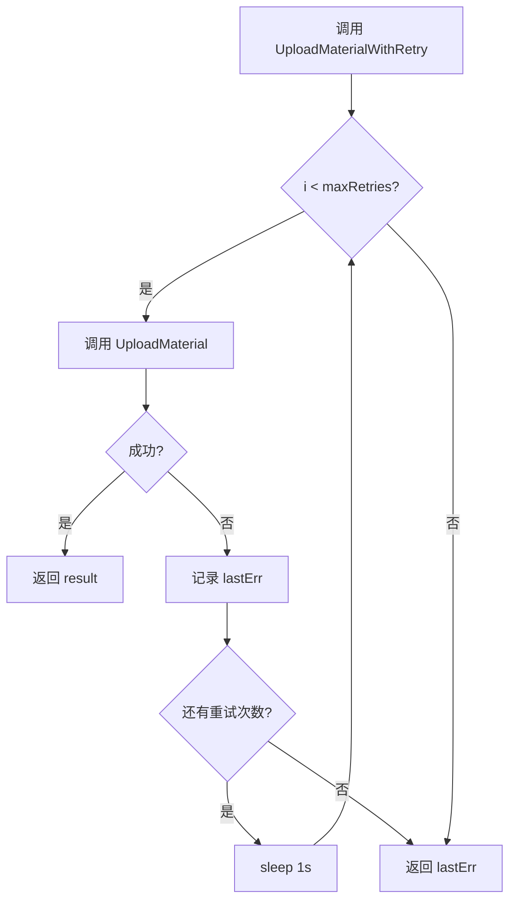
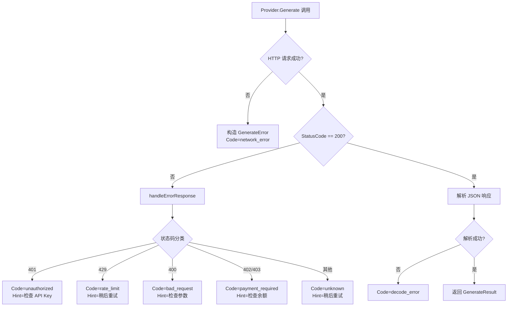
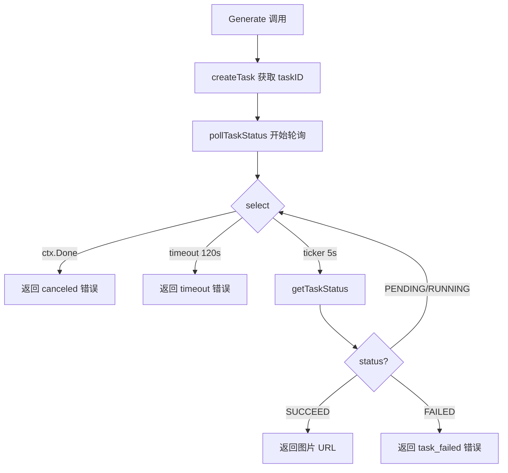

# PD-03.07 md2wechat-skill — 微信素材上传重试与多 Provider 结构化错误分类

> 文档编号：PD-03.07
> 来源：md2wechat-skill `internal/wechat/service.go`, `internal/image/provider.go`
> GitHub：https://github.com/geekjourneyx/md2wechat-skill.git
> 问题域：PD-03 容错与重试 Fault Tolerance & Retry
> 状态：可复用方案

---

## 第 1 章 问题与动机

### 1.1 核心问题

md2wechat-skill 是一个将 Markdown 转换为微信公众号文章并发布的 CLI 工具。其核心流程涉及多个外部 API 调用链：

1. **图片生成**：调用 OpenAI / ModelScope / OpenRouter / Gemini / TuZi 等多个 Provider 生成图片
2. **图片下载**：从 Provider 返回的 URL 下载生成的图片到本地
3. **图片压缩**：本地压缩处理（可选）
4. **素材上传**：将图片上传到微信公众号素材库，获取 media_id
5. **草稿创建**：用 media_id 组装文章并创建草稿

每一步都可能因网络抖动、API 限流、服务不可用等原因失败。特别是微信素材上传（步骤 4），作为整个流程的关键瓶颈，一旦失败会导致前面所有步骤的工作白费。

### 1.2 md2wechat-skill 的解法概述

1. **UploadMaterialWithRetry 重试包装器**：在 `internal/wechat/service.go:162-176` 实现固定间隔重试，所有上传调用点统一使用此方法
2. **GenerateError 结构化错误类型**：在 `internal/image/provider.go:30-48` 定义包含 Provider、Code、Message、Hint、Original 五字段的错误结构，支持 `errors.Unwrap` 链
3. **HTTP 状态码分类处理**：每个 Provider 的 `handleErrorResponse` 方法按 401/429/400/402/403 等状态码返回不同错误码和用户友好提示（如 `internal/image/openai.go:140-196`）
4. **多层超时保护**：HTTP Client 级别超时（30-120s）+ ModelScope 异步轮询超时（120s）+ 可配置全局 HTTPTimeout（1-300s）
5. **压缩降级**：图片压缩失败时静默降级使用原图（`internal/image/processor.go:68-74`），不阻断主流程

### 1.3 设计思想

| 设计原则 | 具体实现 | 理由 | 替代方案 |
|----------|----------|------|----------|
| 重试集中化 | 所有上传调用统一走 `UploadMaterialWithRetry` | 避免每个调用点重复实现重试逻辑 | 装饰器模式（Go 中不如直接包装函数自然） |
| 错误结构化 | `GenerateError` 含 Code + Hint + Original | CLI 工具需要给用户可操作的错误提示 | 纯字符串错误（丢失错误分类能力） |
| 降级不阻断 | 压缩失败用原图，Provider 创建失败记 Warn | CLI 工具应尽量完成任务而非中途退出 | 严格模式（任何失败都中止） |
| 超时分层 | HTTP Client 超时 + 业务轮询超时 | 不同操作有不同的合理超时时间 | 统一超时（图片生成 30s 太短，上传 120s 太长） |
| 配置前验证 | `validateXxxConfig` 在创建 Provider 前检查 | 尽早发现配置错误，避免运行时才暴露 | 延迟验证（用户等半天才报配置错误） |

---

## 第 2 章 源码实现分析

### 2.1 架构概览

md2wechat-skill 的容错架构分为三层：

```
┌─────────────────────────────────────────────────────────┐
│                    调用层 (Processor / DraftService)       │
│  processor.go:78  → UploadMaterialWithRetry(path, 3)    │
│  draft/service.go:275 → UploadMaterialWithRetry(path, 3)│
├─────────────────────────────────────────────────────────┤
│                    重试层 (Service)                        │
│  service.go:162-176  UploadMaterialWithRetry             │
│  固定间隔 1s × maxRetries 次                              │
├─────────────────────────────────────────────────────────┤
│                    错误分类层 (Provider)                    │
│  provider.go:30-48   GenerateError 结构化错误             │
│  openai.go:140-196   handleErrorResponse (HTTP 状态码)    │
│  modelscope.go:298-364  handleErrorResponse              │
│  openrouter.go:258-310  handleErrorResponse              │
├─────────────────────────────────────────────────────────┤
│                    超时层 (HTTP Client + 轮询)             │
│  openai.go:42     Timeout: 60s                           │
│  openrouter.go:52 Timeout: 120s                          │
│  modelscope.go:54 Timeout: 30s + pollTimeout: 120s       │
│  config.go:393    HTTPTimeout: 1-300s (可配置)            │
└─────────────────────────────────────────────────────────┘
```

### 2.2 核心实现

#### 2.2.1 UploadMaterialWithRetry — 固定间隔重试



对应源码 `internal/wechat/service.go:162-176`：

```go
// UploadMaterialWithRetry 带重试的上传
func (s *Service) UploadMaterialWithRetry(filePath string, maxRetries int) (*UploadMaterialResult, error) {
	var lastErr error
	for i := 0; i < maxRetries; i++ {
		result, err := s.UploadMaterial(filePath)
		if err == nil {
			return result, nil
		}
		lastErr = err
		if i < maxRetries-1 {
			time.Sleep(time.Second)
		}
	}
	return nil, lastErr
}
```

关键设计点：
- **固定间隔 1 秒**：微信 API 不像 LLM API 那样有严格的速率限制，固定间隔足够
- **最后一次失败不 sleep**：`if i < maxRetries-1` 避免无意义等待
- **maxRetries 由调用方传入**：所有调用点统一传 3（`processor.go:78`, `processor.go:119`, `processor.go:186`, `processor.go:245`, `draft/service.go:275`）

#### 2.2.2 GenerateError — 结构化错误类型



对应源码 `internal/image/provider.go:30-48`：

```go
// GenerateError 图片生成错误
type GenerateError struct {
	Provider string // 提供者名称
	Code     string // 错误码
	Message  string // 用户友好的错误信息
	Hint     string // 解决提示
	Original error  // 原始错误
}

func (e *GenerateError) Error() string {
	msg := fmt.Sprintf("[%s] %s", e.Provider, e.Message)
	if e.Hint != "" {
		msg += fmt.Sprintf("\n提示: %s", e.Hint)
	}
	return msg
}

func (e *GenerateError) Unwrap() error {
	return e.Original
}
```

五个 Provider（OpenAI、ModelScope、OpenRouter、Gemini、TuZi）都使用相同的 `GenerateError` 结构，但各自实现 `handleErrorResponse` 按 HTTP 状态码返回不同的 Code 和 Hint。例如 `internal/image/openai.go:140-196` 的实现覆盖了 401、429、400、402/403 和默认情况。

#### 2.2.3 ModelScope 异步轮询超时



对应源码 `internal/image/modelscope.go:193-234`：

```go
func (p *ModelScopeProvider) pollTaskStatus(ctx context.Context, taskID string) (string, error) {
	ticker := time.NewTicker(p.pollInterval)
	defer ticker.Stop()
	timeout := time.After(p.maxPollTime)

	for {
		select {
		case <-ctx.Done():
			return "", &GenerateError{
				Provider: p.Name(),
				Code:     "canceled",
				Message:  "操作已取消",
				Original: ctx.Err(),
			}
		case <-timeout:
			return "", &GenerateError{
				Provider: p.Name(),
				Code:     "timeout",
				Message:  fmt.Sprintf("图片生成超时（超过 %v）", p.maxPollTime),
				Hint:     "图片生成时间较长，请稍后在任务列表中查看结果，或尝试简化提示词",
			}
		case <-ticker.C:
			status, url, err := p.getTaskStatus(ctx, taskID)
			if err != nil {
				return "", err
			}
			if status == "SUCCEED" {
				return url, nil
			}
			if status == "FAILED" {
				return "", &GenerateError{
					Provider: p.Name(),
					Code:     "task_failed",
					Message:  "图片生成任务失败",
					Hint:     "提示词可能不符合内容政策，请尝试修改提示词",
				}
			}
		}
	}
}
```

### 2.3 实现细节

**压缩降级模式**（`internal/image/processor.go:66-75`）：

图片压缩失败时不中断流程，而是用 `zap.Warn` 记录后继续使用原图：

```go
if p.cfg.CompressImages {
    compressedPath, compressed, err := p.compressor.CompressImage(filePath)
    if err != nil {
        p.log.Warn("compress failed, using original", zap.Error(err))
    } else if compressed {
        processedPath = compressedPath
        defer os.Remove(compressedPath)
    }
}
```

这个模式在 `processor.go` 中出现了 4 次（L66-75, L107-116, L172-183），每个上传路径都有相同的降级逻辑。

**配置前验证**（`internal/image/provider.go:50-85`）：

`NewProvider` 工厂函数在创建 Provider 实例前先调用 `validateXxxConfig`，确保 API Key 等必要配置存在。这避免了用户等待图片生成完成后才发现配置缺失的糟糕体验。

**HTTP 超时分层**：

| 组件 | 超时值 | 来源 |
|------|--------|------|
| OpenAI Provider | 60s | `openai.go:42` |
| OpenRouter Provider | 120s | `openrouter.go:52` |
| ModelScope HTTP Client | 30s | `modelscope.go:54` |
| ModelScope 轮询超时 | 120s | `modelscope.go:52` |
| TuZi Provider | 60s | `tuzi.go:42` |
| 文件下载 | 60s | `service.go:195` |
| API 转换器 | 30s | `converter/api.go:44` |
| 全局可配置 | 1-300s | `config.go:393` |

---

## 第 3 章 迁移指南

### 3.1 迁移清单

**阶段 1：结构化错误类型（1 个文件）**

- [ ] 定义 `ServiceError` 结构体，包含 Provider、Code、Message、Hint、Original 字段
- [ ] 实现 `Error()` 和 `Unwrap()` 方法
- [ ] 为每个外部 API 调用点定义错误码常量（unauthorized、rate_limit、network_error 等）

**阶段 2：重试包装器（1 个文件）**

- [ ] 实现 `WithRetry` 泛型函数，支持可配置的重试次数和间隔
- [ ] 在所有外部 API 调用点统一使用重试包装器
- [ ] 添加重试日志记录

**阶段 3：超时分层（各 Provider 文件）**

- [ ] 为每个 HTTP Client 设置合理的超时值
- [ ] 对异步操作（如轮询）设置独立的业务超时
- [ ] 将超时值提取到配置中，支持运行时调整

**阶段 4：降级策略（调用层文件）**

- [ ] 识别非关键步骤（如压缩），实现失败降级
- [ ] 添加配置前验证，尽早暴露配置错误

### 3.2 适配代码模板

#### 通用重试包装器（Go 泛型版）

```go
package retry

import (
	"fmt"
	"time"

	"go.uber.org/zap"
)

// Config 重试配置
type Config struct {
	MaxRetries int           // 最大重试次数
	Interval   time.Duration // 重试间隔（固定间隔模式）
	Logger     *zap.Logger   // 日志记录器
}

// DefaultConfig 默认配置：3 次重试，1 秒间隔
func DefaultConfig(log *zap.Logger) Config {
	return Config{
		MaxRetries: 3,
		Interval:   time.Second,
		Logger:     log,
	}
}

// Do 执行带重试的操作
func Do[T any](cfg Config, operation string, fn func() (T, error)) (T, error) {
	var lastErr error
	var zero T

	for i := 0; i < cfg.MaxRetries; i++ {
		result, err := fn()
		if err == nil {
			if i > 0 && cfg.Logger != nil {
				cfg.Logger.Info("operation succeeded after retry",
					zap.String("operation", operation),
					zap.Int("attempt", i+1))
			}
			return result, nil
		}

		lastErr = err
		if cfg.Logger != nil {
			cfg.Logger.Warn("operation failed, will retry",
				zap.String("operation", operation),
				zap.Int("attempt", i+1),
				zap.Int("max_retries", cfg.MaxRetries),
				zap.Error(err))
		}

		if i < cfg.MaxRetries-1 {
			time.Sleep(cfg.Interval)
		}
	}

	return zero, fmt.Errorf("%s failed after %d attempts: %w", operation, cfg.MaxRetries, lastErr)
}
```

#### 结构化错误类型模板

```go
package apierr

import "fmt"

// ServiceError 外部服务错误
type ServiceError struct {
	Provider string // 服务提供者名称
	Code     string // 错误码（unauthorized, rate_limit, network_error, timeout 等）
	Message  string // 用户友好的错误信息
	Hint     string // 解决提示
	Original error  // 原始错误（支持 errors.Unwrap 链）
}

func (e *ServiceError) Error() string {
	msg := fmt.Sprintf("[%s] %s", e.Provider, e.Message)
	if e.Hint != "" {
		msg += fmt.Sprintf("\n提示: %s", e.Hint)
	}
	return msg
}

func (e *ServiceError) Unwrap() error {
	return e.Original
}

// IsRetryable 判断错误是否可重试
func (e *ServiceError) IsRetryable() bool {
	switch e.Code {
	case "network_error", "rate_limit", "timeout", "unknown":
		return true
	case "unauthorized", "payment_required", "bad_request":
		return false
	default:
		return false
	}
}
```

### 3.3 适用场景

| 场景 | 适用度 | 说明 |
|------|--------|------|
| CLI 工具调用外部 API | ⭐⭐⭐ | 完美匹配：固定重试 + 结构化错误提示 |
| 多 Provider 图片/AI 服务 | ⭐⭐⭐ | GenerateError 的 Provider 字段天然支持多源 |
| Web 后端 API 网关 | ⭐⭐ | 需要补充指数退避和熔断机制 |
| 高并发微服务 | ⭐ | 固定间隔重试不适合高并发，需要指数退避 + 抖动 |
| LLM Agent 编排 | ⭐⭐ | 错误分类思路可复用，但需要更复杂的降级链 |

---

## 第 4 章 测试用例

```go
package retry_test

import (
	"errors"
	"testing"
	"time"

	"go.uber.org/zap"
)

// 模拟 ServiceError
type ServiceError struct {
	Provider string
	Code     string
	Message  string
	Hint     string
	Original error
}

func (e *ServiceError) Error() string { return e.Message }
func (e *ServiceError) Unwrap() error { return e.Original }

// 模拟 UploadMaterialWithRetry
func UploadMaterialWithRetry(fn func() (string, error), maxRetries int) (string, error) {
	var lastErr error
	for i := 0; i < maxRetries; i++ {
		result, err := fn()
		if err == nil {
			return result, nil
		}
		lastErr = err
		if i < maxRetries-1 {
			time.Sleep(10 * time.Millisecond) // 测试中缩短间隔
		}
	}
	return "", lastErr
}

func TestRetry_SuccessOnFirstAttempt(t *testing.T) {
	calls := 0
	result, err := UploadMaterialWithRetry(func() (string, error) {
		calls++
		return "media_123", nil
	}, 3)

	if err != nil {
		t.Fatalf("expected no error, got %v", err)
	}
	if result != "media_123" {
		t.Fatalf("expected media_123, got %s", result)
	}
	if calls != 1 {
		t.Fatalf("expected 1 call, got %d", calls)
	}
}

func TestRetry_SuccessOnThirdAttempt(t *testing.T) {
	calls := 0
	result, err := UploadMaterialWithRetry(func() (string, error) {
		calls++
		if calls < 3 {
			return "", errors.New("network error")
		}
		return "media_456", nil
	}, 3)

	if err != nil {
		t.Fatalf("expected no error, got %v", err)
	}
	if result != "media_456" {
		t.Fatalf("expected media_456, got %s", result)
	}
	if calls != 3 {
		t.Fatalf("expected 3 calls, got %d", calls)
	}
}

func TestRetry_AllAttemptsFail(t *testing.T) {
	calls := 0
	_, err := UploadMaterialWithRetry(func() (string, error) {
		calls++
		return "", errors.New("persistent error")
	}, 3)

	if err == nil {
		t.Fatal("expected error, got nil")
	}
	if calls != 3 {
		t.Fatalf("expected 3 calls, got %d", calls)
	}
}

func TestRetry_NoSleepAfterLastFailure(t *testing.T) {
	start := time.Now()
	_, _ = UploadMaterialWithRetry(func() (string, error) {
		return "", errors.New("fail")
	}, 3)
	elapsed := time.Since(start)

	// 3 次重试，2 次 sleep（10ms 每次），总计应 < 50ms
	if elapsed > 50*time.Millisecond {
		t.Fatalf("expected < 50ms, got %v (no sleep after last failure)", elapsed)
	}
}

func TestGenerateError_ErrorFormat(t *testing.T) {
	err := &ServiceError{
		Provider: "OpenAI",
		Code:     "rate_limit",
		Message:  "请求过于频繁",
		Hint:     "请等待一段时间后再试",
		Original: errors.New("status 429"),
	}

	if err.Error() != "请求过于频繁" {
		t.Fatalf("unexpected error message: %s", err.Error())
	}

	var unwrapped error = err
	if !errors.Is(errors.Unwrap(unwrapped), err.Original) {
		t.Fatal("Unwrap should return Original error")
	}
}

func TestGenerateError_UnwrapChain(t *testing.T) {
	original := errors.New("connection refused")
	err := &ServiceError{
		Provider: "ModelScope",
		Code:     "network_error",
		Message:  "网络请求失败",
		Original: original,
	}

	if !errors.Is(err, original) {
		t.Fatal("errors.Is should find original error in chain")
	}
}

func TestCompressDegradation(t *testing.T) {
	// 模拟压缩降级：压缩失败时使用原图
	log, _ := zap.NewDevelopment()
	originalPath := "/tmp/test.jpg"

	compressFailed := true
	processedPath := originalPath

	if compressFailed {
		log.Warn("compress failed, using original")
		// processedPath 保持为 originalPath
	}

	if processedPath != originalPath {
		t.Fatal("should use original path when compress fails")
	}
}
```

---

## 第 5 章 跨域关联

| 关联域 | 关系类型 | 说明 |
|--------|----------|------|
| PD-04 工具系统 | 协同 | `Provider` 接口是工具系统的一种实现，`NewProvider` 工厂函数按配置选择具体 Provider，与工具注册/分发机制类似 |
| PD-01 上下文管理 | 依赖 | 图片生成 prompt 的长度受 Provider API 的 token 限制，过长的 prompt 需要截断处理 |
| PD-11 可观测性 | 协同 | `zap.Logger` 贯穿所有层级，每次上传记录 duration、media_id（脱敏）、错误详情，为事后分析提供数据 |
| PD-07 质量检查 | 协同 | 压缩后检查文件大小是否反而变大（`compress.go:131`），如果是则放弃压缩结果，属于输出质量校验 |

---

## 第 6 章 来源文件索引

| 文件 | 行范围 | 关键实现 |
|------|--------|----------|
| `internal/wechat/service.go` | L162-L176 | `UploadMaterialWithRetry` 重试包装器 |
| `internal/wechat/service.go` | L62-L86 | `UploadMaterial` 基础上传方法 |
| `internal/wechat/service.go` | L178-L232 | `DownloadFile` 文件下载（含 60s 超时） |
| `internal/image/provider.go` | L10-L48 | `Provider` 接口 + `GenerateError` 结构化错误 |
| `internal/image/provider.go` | L50-L85 | `NewProvider` 工厂 + 配置前验证 |
| `internal/image/openai.go` | L36-L44 | OpenAI Provider 构造（60s 超时） |
| `internal/image/openai.go` | L140-L196 | OpenAI `handleErrorResponse` HTTP 状态码分类 |
| `internal/image/modelscope.go` | L46-L57 | ModelScope Provider 构造（30s HTTP + 120s 轮询） |
| `internal/image/modelscope.go` | L193-L234 | `pollTaskStatus` 异步轮询超时机制 |
| `internal/image/modelscope.go` | L298-L364 | ModelScope `handleErrorResponse` |
| `internal/image/openrouter.go` | L258-L310 | OpenRouter `handleErrorResponse` |
| `internal/image/processor.go` | L66-L75 | 压缩降级模式（失败用原图） |
| `internal/image/processor.go` | L78 | 调用 `UploadMaterialWithRetry(path, 3)` |
| `internal/image/compress.go` | L130-L135 | 压缩后大小校验（压缩后更大则放弃） |
| `internal/config/config.go` | L393-L398 | HTTPTimeout 范围验证（1-300s） |
| `internal/draft/service.go` | L275 | 草稿服务中的重试上传调用 |
| `internal/converter/api.go` | L36-L44 | API 转换器超时配置（30s） |

---

## 第 7 章 横向对比维度

```json comparison_data
{
  "project": "md2wechat-skill",
  "dimensions": {
    "重试策略": "固定间隔 1s × 3 次，UploadMaterialWithRetry 集中封装",
    "错误分类": "GenerateError 五字段结构（Provider/Code/Message/Hint/Original），支持 Unwrap 链",
    "超时保护": "HTTP Client 30-120s 分层 + ModelScope 异步轮询 120s + 全局可配置 1-300s",
    "优雅降级": "压缩失败用原图（Warn 级别日志），Provider 创建失败不阻断非图片功能",
    "配置预验证": "NewProvider 工厂函数内 validateXxxConfig 前置检查 API Key 等必要配置",
    "输出验证": "压缩后文件大小校验，压缩后反而变大则放弃压缩结果"
  }
}
```

### 域元数据补充

```json domain_metadata
{
  "solution_summary": "md2wechat-skill 用 UploadMaterialWithRetry 固定间隔重试 + GenerateError 五字段结构化错误（含 Provider/Code/Hint）实现微信素材上传容错与多 Provider 错误分类",
  "description": "CLI 工具场景下外部 API 调用链的轻量级容错，强调用户友好的错误提示",
  "sub_problems": [
    "异步 API 轮询超时：Provider 返回 taskID 后需要轮询状态，轮询间隔和最大等待时间的平衡",
    "压缩反效果检测：图片压缩后文件反而变大（如 PNG 压缩为 JPEG），需要对比原始大小决定是否采用",
    "多 Provider 错误格式统一：不同 Provider 的 HTTP 错误响应 JSON 结构不同，需要统一映射到 GenerateError"
  ],
  "best_practices": [
    "配置前验证：在创建 Provider 实例前检查必要配置，避免运行时才暴露配置缺失",
    "错误携带解决提示：CLI 场景下 Error 消息应包含 Hint 字段，告诉用户如何修复",
    "最后一次重试不 sleep：避免用户在最终失败时多等一个无意义的间隔"
  ]
}
```
