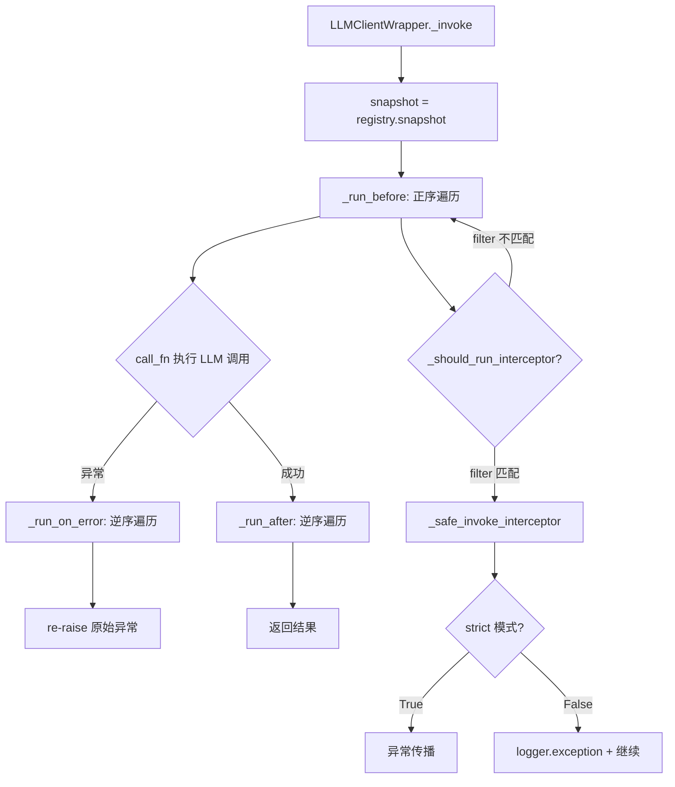
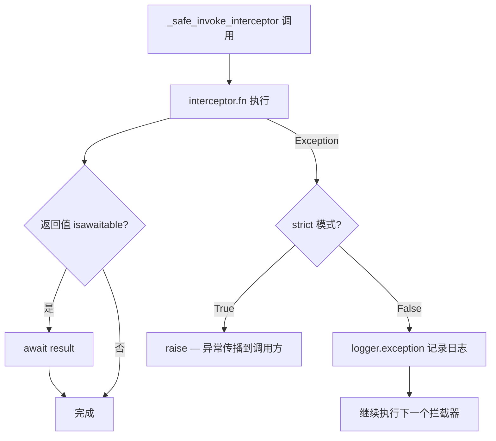
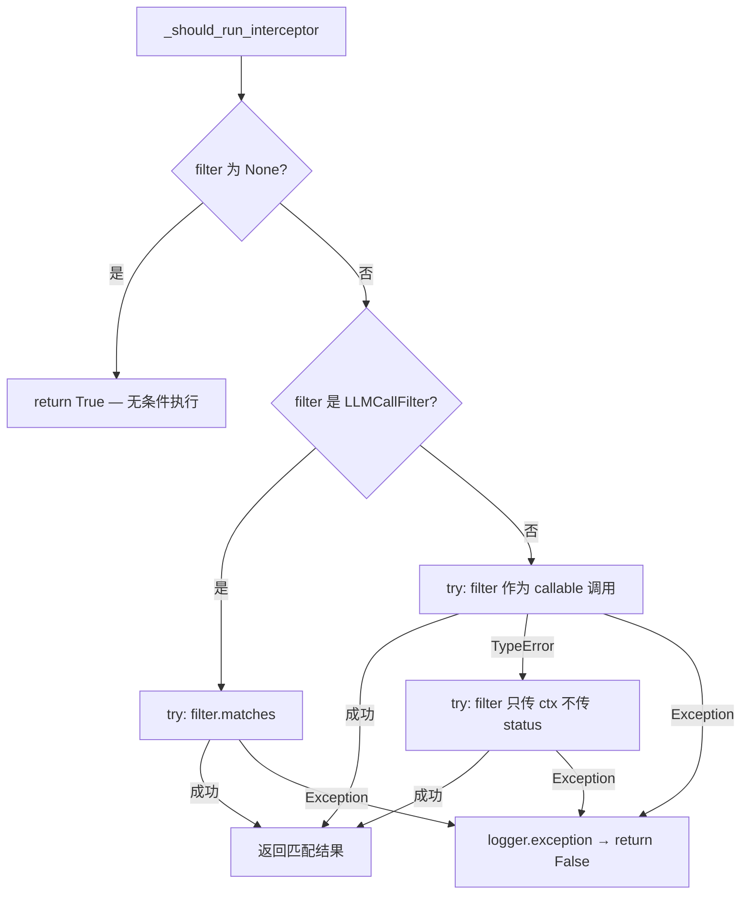

# PD-03.07 memU — 双层拦截器链容错与 strict 模式异常传播控制

> 文档编号：PD-03.07
> 来源：memU `src/memu/llm/wrapper.py` `src/memu/workflow/interceptor.py` `src/memu/client/openai_wrapper.py`
> GitHub：https://github.com/NevaMind-AI/memU.git
> 问题域：PD-03 容错与重试 Fault Tolerance & Retry
> 状态：可复用方案

---

## 第 1 章 问题与动机

### 1.1 核心问题

在 LLM 应用中，错误处理面临一个两难困境：**拦截器（interceptor）自身的异常不应中断主流程**，但在调试和测试场景下又需要让异常暴露出来。memU 面对的具体挑战包括：

1. **LLM 调用链的脆弱性**：LLM 调用前后挂载了多个拦截器（日志、计量、追踪等），任何一个拦截器的 bug 都可能导致整个 LLM 调用失败，即使 LLM 本身返回了正确结果
2. **工作流步骤的级联风险**：多步工作流中，某一步的错误拦截器崩溃会导致错误处理本身失败，形成"错误处理的错误"
3. **记忆检索的附属性**：OpenAI Wrapper 在 LLM 调用前自动注入记忆上下文，但记忆检索失败不应阻断核心的 LLM 对话能力
4. **开发 vs 生产的行为差异**：开发环境需要异常快速暴露（fail-fast），生产环境需要静默降级（fail-silently）

### 1.2 memU 的解法概述

memU 采用**双层拦截器注册表 + strict 模式开关**的架构：

1. **LLM 拦截器注册表**（`LLMInterceptorRegistry`）：管理 LLM 调用的 before/after/on_error 三阶段拦截器，支持优先级排序和条件过滤（`src/memu/llm/wrapper.py:128-223`）
2. **工作流拦截器注册表**（`WorkflowInterceptorRegistry`）：管理工作流步骤的 before/after/on_error 三阶段拦截器，按注册顺序执行（`src/memu/workflow/interceptor.py:56-166`）
3. **`_safe_invoke_interceptor` 安全调用**：统一的拦截器执行函数，根据 strict 标志决定异常是传播还是吞掉（`src/memu/llm/wrapper.py:760-772`，`src/memu/workflow/interceptor.py:205-218`）
4. **fail-silently 记忆检索**：OpenAI Wrapper 的 `_retrieve_memories` 用空列表兜底，确保记忆系统故障不影响 LLM 调用（`src/memu/client/openai_wrapper.py:73-83`）
5. **best-effort 用量提取**：`_extract_usage_from_raw_response` 对 token 用量解析失败静默降级，返回部分数据（`src/memu/llm/wrapper.py:653-703`）

### 1.3 设计思想

| 设计原则 | 具体实现 | 理由 | 替代方案 |
|----------|----------|------|----------|
| 拦截器不可信原则 | `_safe_invoke_interceptor` 包裹所有拦截器调用 | 拦截器由用户注册，质量不可控 | 信任拦截器，不做保护（危险） |
| strict 模式双轨制 | `strict=False` 生产静默，`strict=True` 测试暴露 | 同一套代码适配开发和生产 | 环境变量控制（不够细粒度） |
| 附属功能 fail-silently | 记忆检索失败返回空列表 | 记忆是增强而非核心功能 | 抛异常让调用方决定（增加耦合） |
| 不可变快照执行 | `snapshot()` 冻结拦截器列表后执行 | 避免执行期间注册/移除导致竞态 | 加锁执行（性能差） |
| 逆序错误处理 | after 和 on_error 拦截器逆序执行 | 类似栈展开，后注册的先清理 | 正序执行（语义不对称） |

---

## 第 2 章 源码实现分析

### 2.1 架构概览

memU 的容错架构分为两个独立但同构的拦截器系统，分别服务于 LLM 调用层和工作流步骤层：

```
┌─────────────────────────────────────────────────────────┐
│                    MemoryService                         │
│  ┌─────────────────────┐  ┌──────────────────────────┐  │
│  │ LLMInterceptorRegistry │  │ WorkflowInterceptorRegistry │  │
│  │  before[] → sorted   │  │  before[] → ordered      │  │
│  │  after[]  → sorted   │  │  after[]  → ordered      │  │
│  │  on_error[] → sorted │  │  on_error[] → ordered    │  │
│  │  strict: bool        │  │  strict: bool            │  │
│  └──────────┬──────────┘  └──────────┬───────────────┘  │
│             │                        │                   │
│  ┌──────────▼──────────┐  ┌──────────▼───────────────┐  │
│  │  LLMClientWrapper   │  │     run_steps()          │  │
│  │  ._invoke()         │  │  try: step.run()         │  │
│  │  snapshot → execute  │  │  except → on_error chain │  │
│  └──────────┬──────────┘  └──────────────────────────┘  │
│             │                                            │
│  ┌──────────▼──────────┐                                 │
│  │ _safe_invoke_        │  ← 统一安全调用层              │
│  │   interceptor()      │                                │
│  │ strict? raise : log  │                                │
│  └─────────────────────┘                                 │
└─────────────────────────────────────────────────────────┘
         │
┌────────▼────────────────────────────────────────────────┐
│              MemuOpenAIWrapper                           │
│  _retrieve_memories() → try/except → return []          │
│  create() → inject memories → original.create()         │
└─────────────────────────────────────────────────────────┘
```

### 2.2 核心实现

#### 2.2.1 LLM 拦截器的安全调用机制



对应源码 `src/memu/llm/wrapper.py:387-435`：

```python
async def _invoke(
    self,
    *,
    kind: str,
    call_fn: Callable[[], Any],
    request_view: LLMRequestView,
    model: str | None,
    response_builder: Callable[[Any], LLMResponseView],
) -> Any:
    call_ctx = self._build_call_context(model)
    snapshot = self._registry.snapshot()
    await self._run_before(snapshot.before, call_ctx, request_view)
    start_time = time.perf_counter()
    try:
        result = call_fn()
        if inspect.isawaitable(result):
            result = await result
    except Exception as exc:
        latency_ms = (time.perf_counter() - start_time) * 1000
        usage = LLMUsage(latency_ms=latency_ms, status="error")
        await self._run_on_error(snapshot.on_error, call_ctx, request_view, exc, usage)
        raise
    else:
        latency_ms = (time.perf_counter() - start_time) * 1000
        # ... 构建 response_view 和 usage ...
        await self._run_after(snapshot.after, call_ctx, request_view, response_view, usage)
        return pure_result
```

#### 2.2.2 `_safe_invoke_interceptor` — 容错核心



对应源码 `src/memu/llm/wrapper.py:760-772`：

```python
async def _safe_invoke_interceptor(
    interceptor: _LLMInterceptor,
    strict: bool,
    *args: Any,
) -> None:
    try:
        result = interceptor.fn(*args)
        if inspect.isawaitable(result):
            await result
    except Exception:
        if strict:
            raise
        logger.exception(
            "LLM interceptor failed: %s",
            interceptor.name or interceptor.interceptor_id
        )
```

工作流层的同名函数（`src/memu/workflow/interceptor.py:205-218`）结构完全一致，体现了同构设计。

#### 2.2.3 条件过滤器的防御性编程



对应源码 `src/memu/llm/wrapper.py:733-757`：

```python
def _should_run_interceptor(
    interceptor: _LLMInterceptor,
    ctx: LLMCallContext,
    status: str | None,
) -> bool:
    filt = interceptor.filter
    if filt is None:
        return True
    if isinstance(filt, LLMCallFilter):
        try:
            return filt.matches(ctx, status)
        except Exception:
            logger.exception("LLM interceptor filter failed: %s",
                           interceptor.name or interceptor.interceptor_id)
            return False
    try:
        return bool(filt(ctx, status))
    except TypeError:
        try:
            return bool(filt(ctx, None))
        except Exception:
            logger.exception("LLM interceptor filter failed: %s",
                           interceptor.name or interceptor.interceptor_id)
            return False
    except Exception:
        logger.exception("LLM interceptor filter failed: %s",
                       interceptor.name or interceptor.interceptor_id)
        return False
```

这段代码展示了三层防御：(1) 正常调用 `filt(ctx, status)`；(2) TypeError 时降级为 `filt(ctx, None)` 兼容旧签名；(3) 任何异常都返回 False 而非崩溃。

### 2.3 实现细节

#### 不可变快照机制

`snapshot()` 方法返回当前拦截器列表的不可变元组快照（`src/memu/llm/wrapper.py:222-223`）。由于 Python tuple 是不可变的，执行期间即使有新拦截器注册或旧拦截器移除，当前执行批次不受影响。这避免了在遍历拦截器列表时加锁。

#### 优先级排序 vs 注册顺序

LLM 拦截器支持 `priority` 参数，通过 `_sorted_interceptors` 按 `(priority, order)` 排序（`src/memu/llm/wrapper.py:513-520`）。工作流拦截器则简单地按注册顺序执行。这反映了两层的不同需求：LLM 层拦截器可能来自不同模块需要优先级控制，工作流层拦截器通常由同一模块注册顺序即可。

#### fail-silently 记忆检索

`MemuChatCompletions._retrieve_memories`（`src/memu/client/openai_wrapper.py:73-83`）是最简洁的容错模式：

```python
async def _retrieve_memories(self, query: str) -> list[dict]:
    try:
        result = await self._service.retrieve(
            queries=[{"role": "user", "content": query}],
            where=self._user_data,
        )
        return result.get("items", [])
    except Exception:
        return []  # Fail silently - don't break the LLM call
```

#### best-effort 用量提取

`_extract_usage_from_raw_response`（`src/memu/llm/wrapper.py:653-703`）对不同 Provider 的响应格式做 best-effort 解析，外层包裹 try/except 确保解析失败不影响 LLM 调用结果返回。

#### 同步/异步双模式兼容

`_safe_invoke_interceptor` 通过 `inspect.isawaitable(result)` 检测拦截器返回值，同时支持同步和异步拦截器（`src/memu/llm/wrapper.py:766-768`）。这让用户可以自由注册 sync 或 async 函数作为拦截器。


---

## 第 3 章 迁移指南

### 3.1 迁移清单

**阶段 1：基础拦截器注册表**
- [ ] 实现 `InterceptorRegistry` 类，支持 before/after/on_error 三阶段注册
- [ ] 实现 `_safe_invoke_interceptor` 函数，支持 strict 模式开关
- [ ] 实现 `snapshot()` 不可变快照机制
- [ ] 实现 `InterceptorHandle.dispose()` 反注册机制

**阶段 2：集成到 LLM 调用层**
- [ ] 在 LLM 客户端包装器中集成拦截器注册表
- [ ] 在 `_invoke` 方法中实现 before → call → after/on_error 流程
- [ ] 添加条件过滤器支持（按 operation/provider/model 过滤）

**阶段 3：集成到工作流层**
- [ ] 在工作流执行器中集成拦截器注册表
- [ ] 在 `run_steps` 中实现 before → step.run → after/on_error 流程

**阶段 4：附属功能容错**
- [ ] 对非核心功能（记忆检索、用量统计等）添加 fail-silently 保护

### 3.2 适配代码模板

以下是一个可直接复用的拦截器注册表实现：

```python
"""Portable interceptor registry with strict mode fault tolerance."""
from __future__ import annotations

import inspect
import logging
import threading
from dataclasses import dataclass
from typing import Any, Callable

logger = logging.getLogger(__name__)


@dataclass(frozen=True)
class _Interceptor:
    interceptor_id: int
    fn: Callable[..., Any]
    name: str | None


class InterceptorHandle:
    """Disposable handle for removing a registered interceptor."""

    def __init__(self, registry: InterceptorRegistry, interceptor_id: int) -> None:
        self._registry = registry
        self._id = interceptor_id
        self._disposed = False

    def dispose(self) -> bool:
        if self._disposed:
            return False
        self._disposed = True
        return self._registry.remove(self._id)


class InterceptorRegistry:
    """
    Three-phase interceptor registry with strict mode control.

    Usage:
        registry = InterceptorRegistry(strict=False)  # production
        registry = InterceptorRegistry(strict=True)    # testing

        handle = registry.register_on_error(my_error_handler, name="alert")
        # ... later ...
        handle.dispose()  # remove interceptor
    """

    def __init__(self, *, strict: bool = False) -> None:
        self._before: tuple[_Interceptor, ...] = ()
        self._after: tuple[_Interceptor, ...] = ()
        self._on_error: tuple[_Interceptor, ...] = ()
        self._lock = threading.Lock()
        self._seq = 0
        self._strict = strict

    @property
    def strict(self) -> bool:
        return self._strict

    def register_before(self, fn: Callable, *, name: str | None = None) -> InterceptorHandle:
        return self._register("before", fn, name=name)

    def register_after(self, fn: Callable, *, name: str | None = None) -> InterceptorHandle:
        return self._register("after", fn, name=name)

    def register_on_error(self, fn: Callable, *, name: str | None = None) -> InterceptorHandle:
        return self._register("on_error", fn, name=name)

    def _register(self, kind: str, fn: Callable, *, name: str | None) -> InterceptorHandle:
        with self._lock:
            self._seq += 1
            interceptor = _Interceptor(self._seq, fn, name)
            attr = f"_{kind}"
            setattr(self, attr, (*getattr(self, attr), interceptor))
        return InterceptorHandle(self, interceptor.interceptor_id)

    def remove(self, interceptor_id: int) -> bool:
        with self._lock:
            removed = False
            for attr in ("_before", "_after", "_on_error"):
                current = getattr(self, attr)
                filtered = tuple(i for i in current if i.interceptor_id != interceptor_id)
                if len(filtered) != len(current):
                    setattr(self, attr, filtered)
                    removed = True
            return removed

    def snapshot(self) -> tuple[tuple, tuple, tuple]:
        return (self._before, self._after, self._on_error)


async def safe_invoke(interceptor: _Interceptor, strict: bool, *args: Any) -> None:
    """Invoke interceptor with strict-mode-aware error handling."""
    try:
        result = interceptor.fn(*args)
        if inspect.isawaitable(result):
            await result
    except Exception:
        if strict:
            raise
        logger.exception("Interceptor failed: %s", interceptor.name or interceptor.interceptor_id)
```

### 3.3 适用场景

| 场景 | 适用度 | 说明 |
|------|--------|------|
| LLM 应用的可观测性拦截 | ⭐⭐⭐ | 日志/计量/追踪拦截器不应影响主流程 |
| 多步工作流的错误通知 | ⭐⭐⭐ | on_error 拦截器链适合发送告警/记录审计 |
| 插件系统的安全隔离 | ⭐⭐⭐ | 第三方插件代码通过 strict=False 隔离 |
| 需要精确错误传播的测试 | ⭐⭐ | strict=True 模式让测试能捕获拦截器 bug |
| 高性能低延迟场景 | ⭐⭐ | 拦截器链有额外开销，但 snapshot 避免了锁 |
| 需要重试/断路器的场景 | ⭐ | memU 不含重试逻辑，需自行在拦截器中实现 |

---

## 第 4 章 测试用例

```python
"""Tests for interceptor fault tolerance patterns (memU style)."""
import asyncio
import pytest


# --- Minimal interceptor registry for testing ---
class _FakeInterceptor:
    def __init__(self, fn, name=None):
        self.interceptor_id = id(fn)
        self.fn = fn
        self.name = name


async def _safe_invoke(interceptor, strict, *args):
    import inspect
    try:
        result = interceptor.fn(*args)
        if inspect.isawaitable(result):
            await result
    except Exception:
        if strict:
            raise


class TestSafeInvokeInterceptor:
    """Tests for _safe_invoke_interceptor behavior."""

    @pytest.mark.asyncio
    async def test_sync_interceptor_success(self):
        called = []
        interceptor = _FakeInterceptor(lambda *a: called.append(a), "ok")
        await _safe_invoke(interceptor, False, "arg1")
        assert len(called) == 1

    @pytest.mark.asyncio
    async def test_async_interceptor_success(self):
        called = []
        async def handler(*args):
            called.append(args)
        interceptor = _FakeInterceptor(handler, "async_ok")
        await _safe_invoke(interceptor, False, "arg1")
        assert len(called) == 1

    @pytest.mark.asyncio
    async def test_non_strict_swallows_exception(self):
        """In non-strict mode, interceptor exceptions are swallowed."""
        interceptor = _FakeInterceptor(lambda *a: 1/0, "bad")
        # Should NOT raise
        await _safe_invoke(interceptor, False, "arg1")

    @pytest.mark.asyncio
    async def test_strict_propagates_exception(self):
        """In strict mode, interceptor exceptions propagate."""
        interceptor = _FakeInterceptor(lambda *a: 1/0, "bad")
        with pytest.raises(ZeroDivisionError):
            await _safe_invoke(interceptor, True, "arg1")


class TestFailSilentlyPattern:
    """Tests for fail-silently memory retrieval pattern."""

    @pytest.mark.asyncio
    async def test_retrieve_memories_returns_empty_on_failure(self):
        """Memory retrieval failure should return empty list, not raise."""
        async def failing_retrieve(**kwargs):
            raise ConnectionError("service down")

        # Simulate the pattern from openai_wrapper.py:73-83
        try:
            result = await failing_retrieve(queries=[], where={})
        except Exception:
            result = []

        assert result == []

    @pytest.mark.asyncio
    async def test_retrieve_memories_returns_data_on_success(self):
        """Memory retrieval success should return items."""
        async def ok_retrieve(**kwargs):
            return {"items": [{"summary": "likes coffee"}]}

        try:
            raw = await ok_retrieve(queries=[], where={})
            result = raw.get("items", [])
        except Exception:
            result = []

        assert len(result) == 1
        assert result[0]["summary"] == "likes coffee"


class TestSnapshotIsolation:
    """Tests for snapshot-based execution isolation."""

    def test_snapshot_is_immutable_during_execution(self):
        """Modifications after snapshot should not affect execution."""
        interceptors = (_FakeInterceptor(lambda: None, "a"),)
        snapshot = tuple(interceptors)  # simulate snapshot()

        # Simulate adding new interceptor after snapshot
        interceptors = (*interceptors, _FakeInterceptor(lambda: None, "b"))

        # Snapshot should still have only 1 interceptor
        assert len(snapshot) == 1
        assert len(interceptors) == 2
```


---

## 第 5 章 跨域关联

| 关联域 | 关系类型 | 说明 |
|--------|----------|------|
| PD-04 工具系统 | 协同 | 拦截器注册表本身就是一种工具系统设计模式，`InterceptorHandle.dispose()` 提供了工具生命周期管理 |
| PD-10 中间件管道 | 依赖 | memU 的拦截器链本质上是中间件管道的一种实现，before/after/on_error 三阶段对应 PD-10 的钩子点设计 |
| PD-11 可观测性 | 协同 | LLM 拦截器的 `LLMUsage` 数据结构（token 计量、延迟追踪）直接服务于可观测性，on_error 拦截器是监控告警的挂载点 |
| PD-06 记忆持久化 | 依赖 | OpenAI Wrapper 的 fail-silently 记忆检索是 PD-06 记忆系统的容错保障，确保记忆子系统故障不影响核心 LLM 功能 |
| PD-01 上下文管理 | 协同 | `LLMRequestView` 和 `LLMResponseView` 记录了每次 LLM 调用的输入/输出字符数和 content_hash，可用于上下文窗口管理的决策依据 |

---

## 第 6 章 来源文件索引

| 文件 | 行范围 | 关键实现 |
|------|--------|----------|
| `src/memu/llm/wrapper.py` | L128-223 | `LLMInterceptorRegistry` — LLM 拦截器注册表，支持优先级和条件过滤 |
| `src/memu/llm/wrapper.py` | L226-504 | `LLMClientWrapper` — LLM 客户端包装器，`_invoke` 实现三阶段拦截 |
| `src/memu/llm/wrapper.py` | L653-703 | `_extract_usage_from_raw_response` — best-effort 用量提取 |
| `src/memu/llm/wrapper.py` | L733-757 | `_should_run_interceptor` — 三层防御的过滤器匹配 |
| `src/memu/llm/wrapper.py` | L760-772 | `_safe_invoke_interceptor` — LLM 层安全调用核心 |
| `src/memu/workflow/interceptor.py` | L56-166 | `WorkflowInterceptorRegistry` — 工作流拦截器注册表 |
| `src/memu/workflow/interceptor.py` | L168-218 | `run_before/after/on_error_interceptors` + `_safe_invoke_interceptor` |
| `src/memu/workflow/step.py` | L50-101 | `run_steps` — 工作流步骤执行器，集成拦截器三阶段调用 |
| `src/memu/client/openai_wrapper.py` | L73-83 | `_retrieve_memories` — fail-silently 记忆检索 |
| `src/memu/client/openai_wrapper.py` | L85-108 | `MemuChatCompletions.create` — 同步/异步事件循环兼容 |
| `src/memu/app/service.py` | L86-87 | `MemoryService.__init__` — 默认 strict=False 初始化两个注册表 |

---

## 第 7 章 横向对比维度

> **重要：** 本章用于自动填充 Butcher Wiki 的横向对比表。

```json comparison_data
{
  "project": "memU",
  "dimensions": {
    "截断/错误检测": "LLMCallFilter 多维条件过滤（operation/provider/model/status），三层 try/except 防御",
    "重试/恢复策略": "无内置重试机制，依赖拦截器链的 on_error 钩子由用户实现重试逻辑",
    "超时保护": "无显式超时，依赖底层 httpx 客户端的 timeout 配置（transcribe 场景 3x timeout）",
    "优雅降级": "strict=False 模式下拦截器异常静默降级 + 记忆检索 fail-silently 返回空列表",
    "错误分类": "LLMUsage.status 区分 success/error，LLMCallFilter.statuses 支持按状态过滤拦截器",
    "拦截器安全隔离": "_safe_invoke_interceptor 双模式：strict 传播 vs 非 strict 日志吞掉",
    "不可变快照执行": "snapshot() 冻结拦截器元组，执行期间注册/移除不影响当前批次",
    "过滤器容错": "_should_run_interceptor 三层防御：正常调用→TypeError 降级→兜底 return False",
    "best-effort 数据提取": "_extract_usage_from_raw_response 解析失败返回部分数据，不影响主流程"
  }
}
```

### 域元数据补充

```json domain_metadata
{
  "solution_summary": "memU 用双层拦截器注册表（LLM 层 + 工作流层）+ strict 模式开关实现容错：_safe_invoke_interceptor 根据 strict 标志决定异常传播或静默降级，snapshot() 不可变快照避免执行期竞态",
  "description": "拦截器链自身的异常隔离：错误处理代码的错误不应导致主流程崩溃",
  "sub_problems": [
    "拦截器自身异常导致错误处理失败：on_error 拦截器崩溃时主异常信息丢失",
    "自定义过滤器签名不兼容：用户传入的 callable filter 参数数量与预期不匹配需要 TypeError 降级",
    "同步/异步拦截器混用：注册表需要同时支持 sync 和 async 拦截器函数"
  ],
  "best_practices": [
    "拦截器执行用不可变快照隔离注册期并发修改",
    "after 和 on_error 拦截器逆序执行，模拟栈展开语义",
    "附属功能（记忆检索、用量统计）采用 fail-silently 模式，返回空值而非抛异常"
  ]
}
```
