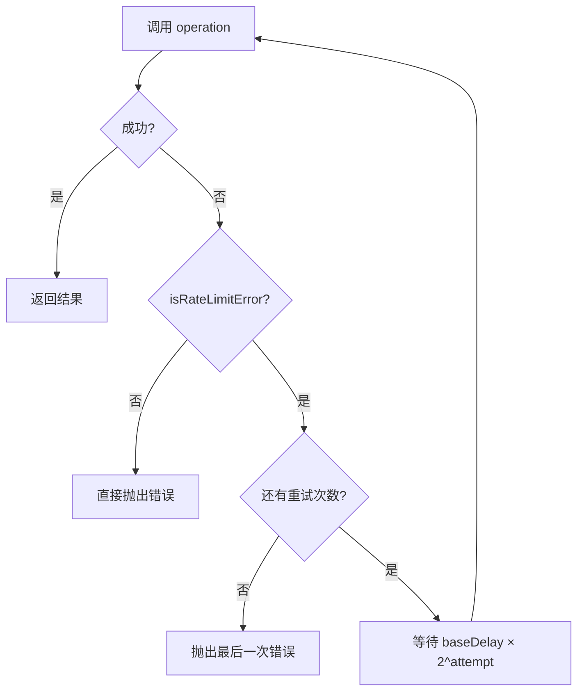
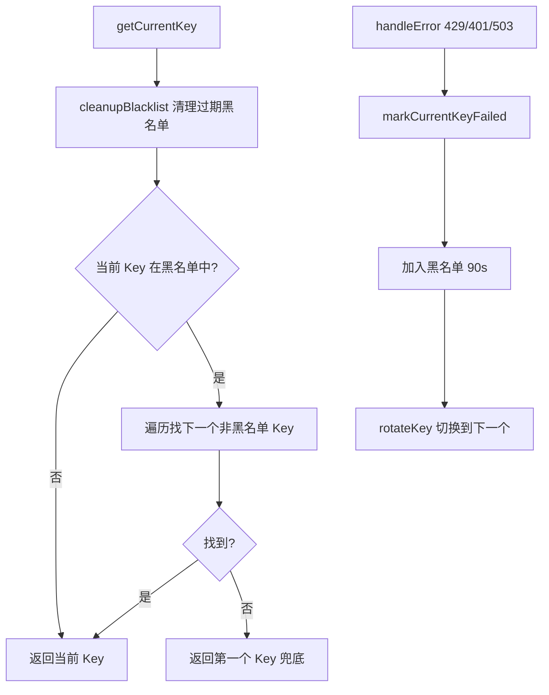
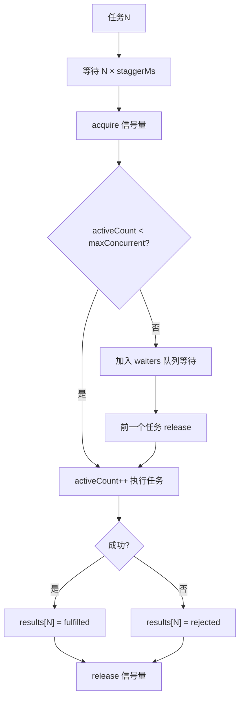

# PD-03.09 moyin-creator — 四层容错体系与 API 密钥自动轮转

> 文档编号：PD-03.09
> 来源：moyin-creator `src/lib/utils/retry.ts` `src/lib/utils/rate-limiter.ts` `src/lib/utils/concurrency.ts` `src/lib/ai/batch-processor.ts` `src/packages/ai-core/api/task-queue.ts` `src/packages/ai-core/api/task-poller.ts` `src/lib/api-key-manager.ts` `src/lib/ai/model-registry.ts`
> GitHub：https://github.com/MemeCalculate/moyin-creator.git
> 问题域：PD-03 容错与重试 Fault Tolerance & Retry
> 状态：可复用方案

---

## 第 1 章 问题与动机

### 1.1 核心问题

moyin-creator 是一个 AI 驱动的影视创作工具，核心流程涉及大量 AI API 调用：剧本分析、角色生成、分镜图片生成、视频生成。这些调用面临三大容错挑战：

1. **速率限制（429）**：多个 AI Provider（DeepSeek、Gemini、GLM、doubao 等）各有不同的速率限制策略，批量生成分镜时极易触发
2. **批量处理的部分失败**：一次生成 50 个分镜图片，其中 3 个因 API 错误失败不应导致全部重来
3. **异步任务的不确定性**：图片/视频生成 API 返回 taskId 后需要轮询，超时时间不可预知（服务端可能动态调整）

项目的解法不是单一的重试机制，而是一个**四层容错体系**：底层重试 → 速率限制 → 并发控制 → 批处理容错隔离，每层解决不同粒度的问题。

### 1.2 moyin-creator 的解法概述

1. **retryOperation 指数退避重试**（`src/lib/utils/retry.ts:49`）：仅对 429/quota 错误重试，非速率限制错误直接抛出，避免无意义重试
2. **ApiKeyManager 密钥轮转 + 黑名单**（`src/lib/api-key-manager.ts:259`）：多 API Key 随机起始 + 轮转，失败 Key 加入 90 秒黑名单，自动恢复
3. **runStaggered 错开并发控制**（`src/lib/utils/concurrency.ts:27`）：信号量 + 时间错开双重约束，避免并发请求同时触发速率限制
4. **processBatched 自适应批处理**（`src/lib/ai/batch-processor.ts:105`）：双重 token 约束分批 + 单批重试 + 容错隔离（部分成功返回部分结果）
5. **TaskPoller 动态超时轮询**（`src/packages/ai-core/api/task-poller.ts:33`）：根据服务端 estimatedTime 动态延长超时，网络错误静默重试

### 1.3 设计思想

| 设计原则 | 具体实现 | 理由 | 替代方案 |
|----------|----------|------|----------|
| 错误分类重试 | `isRateLimitError` 仅匹配 429/quota/rate | 非速率限制错误（如 401 认证失败）重试无意义 | 全部错误都重试（浪费时间和预算） |
| 密钥级容错 | ApiKeyManager 黑名单 90s + 自动恢复 | 单 Key 被限流不影响其他 Key 继续工作 | 全局暂停等待（降低吞吐） |
| 时间错开 > 纯并发限制 | runStaggered 的 staggerMs 间隔 | 即使并发数未满，也保持最小间隔避免突发请求 | 纯信号量（可能同时发出多个请求触发限流） |
| 容错隔离 | PromiseSettledResult 收集所有批次结果 | 单批失败不阻塞其他批次，返回部分成功结果 | Promise.all（一个失败全部失败） |
| 不可重试错误快速失败 | TOKEN_BUDGET_EXCEEDED 直接 throw | 输入超出模型上下文窗口，重试也不会成功 | 统一重试（浪费 3 次重试机会） |
| Error-driven Discovery | 从 API 400 错误中解析模型真实限制 | 模型限制文档可能过时，从错误中学习最准确 | 硬编码限制表（新模型需手动更新） |

---

## 第 2 章 源码实现分析

### 2.1 架构概览

moyin-creator 的容错体系分为四层，从底层到顶层依次叠加：

```
┌─────────────────────────────────────────────────────────┐
│  Layer 4: processBatched — 自适应批处理 + 容错隔离       │
│  ┌───────────────────────────────────────────────────┐  │
│  │  Layer 3: runStaggered — 错开并发控制（信号量+时间） │  │
│  │  ┌─────────────────────────────────────────────┐  │  │
│  │  │  Layer 2: ApiKeyManager — 密钥轮转+黑名单    │  │  │
│  │  │  ┌───────────────────────────────────────┐  │  │  │
│  │  │  │  Layer 1: retryOperation — 指数退避    │  │  │  │
│  │  │  │  (仅 429/quota 错误)                   │  │  │  │
│  │  │  └───────────────────────────────────────┘  │  │  │
│  │  └─────────────────────────────────────────────┘  │  │
│  └───────────────────────────────────────────────────┘  │
└─────────────────────────────────────────────────────────┘
         ↕                    ↕                    ↕
   retryOperation      rateLimitedBatch      TaskPoller
   (单次调用重试)      (顺序批量+延迟)      (异步轮询+动态超时)
```

### 2.2 核心实现

#### 2.2.1 Layer 1: retryOperation — 错误分类 + 指数退避



对应源码 `src/lib/utils/retry.ts:49-86`：

```typescript
export async function retryOperation<T>(
  operation: () => Promise<T>,
  options: RetryOptions = {}
): Promise<T> {
  const { maxRetries = 3, baseDelay = 2000, onRetry } = options;
  let lastError: Error | undefined;
  
  for (let attempt = 0; attempt < maxRetries; attempt++) {
    try {
      return await operation();
    } catch (error) {
      lastError = error as Error;
      // 关键：仅对速率限制错误重试
      if (!isRateLimitError(error)) {
        throw error;
      }
      if (attempt < maxRetries - 1) {
        const delay = baseDelay * Math.pow(2, attempt);
        if (onRetry) {
          onRetry(attempt + 1, delay, lastError);
        }
        await new Promise((resolve) => setTimeout(resolve, delay));
      }
    }
  }
  throw lastError;
}
```

`isRateLimitError`（`src/lib/utils/retry.ts:18-39`）通过状态码和消息文本双重检测：匹配 `status === 429`、`code === 429`，以及消息中的 `quota`、`rate`、`resource_exhausted`、`too many requests` 关键词。这种多模式匹配覆盖了 OpenAI、Google、DeepSeek 等不同 Provider 的错误格式差异。

#### 2.2.2 Layer 2: ApiKeyManager — 密钥轮转与黑名单



对应源码 `src/lib/api-key-manager.ts:259-387`：

```typescript
export class ApiKeyManager {
  private keys: string[];
  private currentIndex: number;
  private blacklist: Map<string, BlacklistedKey> = new Map();

  constructor(apiKeyString: string) {
    this.keys = parseApiKeys(apiKeyString);
    // 随机起始索引实现负载均衡
    this.currentIndex = this.keys.length > 0 
      ? Math.floor(Math.random() * this.keys.length) : 0;
  }

  markCurrentKeyFailed(): void {
    const key = this.keys[this.currentIndex];
    if (key) {
      this.blacklist.set(key, {
        key,
        blacklistedAt: Date.now(),
      });
    }
    this.rotateKey();
  }

  handleError(statusCode: number): boolean {
    // 429 速率限制、401 认证失败、503 服务不可用 → 轮转
    if (statusCode === 429 || statusCode === 401 || statusCode === 503) {
      this.markCurrentKeyFailed();
      return true;
    }
    return false;
  }

  private cleanupBlacklist(): void {
    const now = Date.now();
    for (const [key, entry] of this.blacklist.entries()) {
      if (now - entry.blacklistedAt >= BLACKLIST_DURATION_MS) { // 90s
        this.blacklist.delete(key);
      }
    }
  }
}
```

关键设计：随机起始索引（`Math.floor(Math.random() * this.keys.length)`）确保多个并发请求不会都从同一个 Key 开始，实现天然的负载均衡。黑名单 90 秒自动过期（`BLACKLIST_DURATION_MS = 90 * 1000`），无需手动恢复。

#### 2.2.3 Layer 3: runStaggered — 信号量 + 时间错开



对应源码 `src/lib/utils/concurrency.ts:27-83`：

```typescript
export async function runStaggered<T>(
  tasks: (() => Promise<T>)[],
  maxConcurrent: number,
  staggerMs: number = 5000
): Promise<PromiseSettledResult<T>[]> {
  let activeCount = 0;
  const waiters: (() => void)[] = [];

  const acquire = async (): Promise<void> => {
    if (activeCount < maxConcurrent) { activeCount++; return; }
    await new Promise<void>((resolve) => waiters.push(resolve));
  };

  const release = (): void => {
    activeCount--;
    if (waiters.length > 0) {
      activeCount++;
      const next = waiters.shift()!;
      next();
    }
  };

  const taskPromises = tasks.map(async (task, idx) => {
    // 错开启动：第N个任务至少在 N × staggerMs 后才启动
    if (idx > 0) {
      await new Promise<void>((r) => setTimeout(r, idx * staggerMs));
    }
    await acquire();
    try {
      const value = await task();
      results[idx] = { status: 'fulfilled', value };
    } catch (reason) {
      results[idx] = { status: 'rejected', reason };
    } finally {
      release();
    }
  });

  await Promise.all(taskPromises);
  return results;
}
```

双重约束的精妙之处：即使 `maxConcurrent=3`，三个任务也不会同时启动，而是间隔 `staggerMs`（默认 5 秒）依次启动。这比纯信号量更能避免突发请求触发 API 速率限制。

### 2.3 实现细节

#### 2.3.1 批处理的双重 Token 约束分批

`processBatched`（`src/lib/ai/batch-processor.ts:105-233`）在分批时同时考虑 input token 和 output token 两个维度：

- **Input 约束**：`min(contextWindow × 0.6, 60000)` — 60K 硬上限防止 TTFT 过高和 Lost-in-the-middle
- **Output 约束**：`maxOutput × 0.8` — 留 20% 给 JSON 格式开销

贪心分组算法（`createBatches`，`src/lib/ai/batch-processor.ts:246-285`）：依次添加 item，任一约束即将超出时开始新批次。单个 item 超出预算时仍独立成批（至少每批 1 个 item），保证不会丢弃任何输入。

#### 2.3.2 Error-driven Discovery

`model-registry.ts:178-229` 实现了从 API 错误消息中自动学习模型限制的机制。当 API 返回 400 错误时，`parseModelLimitsFromError` 用正则匹配多种 Provider 的错误格式：

- DeepSeek: `"valid range of max_tokens is [1, 8192]"`
- OpenAI: `"maximum context length is 128000 tokens"`
- 智谱: `"max_tokens must be less than or equal to 8192"`

学到的限制持久化到 localStorage，下次直接使用，避免重复触发错误。

#### 2.3.3 TaskPoller 动态超时

`TaskPoller`（`src/packages/ai-core/api/task-poller.ts:33-119`）的超时不是固定值，而是根据服务端返回的 `estimatedTime` 动态调整：`min(estimatedTime × 2 + 120s, 30min)`。网络错误（非业务错误）不中断轮询，只记录日志后继续。

#### 2.3.4 批量生成的容错跳过

`batchGenerateShotImages`（`src/lib/script/shot-generator.ts:347-374`）在批量生成分镜图片时，单个 shot 失败通过 `onShotError` 回调通知上层，但不中断循环，继续处理后续 shot。配合 `RATE_LIMITS.BATCH_ITEM_DELAY`（3 秒）的固定间隔避免连续请求触发限流。


---

## 第 3 章 迁移指南

### 3.1 迁移清单

**阶段 1：基础重试层**
- [ ] 复制 `retry.ts` 的 `retryOperation` + `isRateLimitError`
- [ ] 根据你的 Provider 扩展 `isRateLimitError` 的匹配模式（如 Anthropic 的 `overloaded` 错误）
- [ ] 在所有 AI API 调用处包裹 `retryOperation`

**阶段 2：密钥管理**
- [ ] 复制 `ApiKeyManager` 类
- [ ] 调整黑名单时长（默认 90s，高频场景可缩短到 30s）
- [ ] 在 API 调用失败时调用 `handleError(statusCode)` 触发轮转

**阶段 3：并发控制**
- [ ] 复制 `runStaggered` 函数
- [ ] 根据 Provider 的 RPM 限制设置 `staggerMs`（如 Gemini 免费版 15 RPM → staggerMs=4000）
- [ ] 批量任务改用 `runStaggered` 替代 `Promise.all`

**阶段 4：批处理容错**
- [ ] 如果有大量同类 AI 调用，引入 `processBatched` 的分批 + 容错隔离模式
- [ ] 使用 `PromiseSettledResult` 替代 `Promise.all` 收集结果

### 3.2 适配代码模板

#### 最小可用版本（TypeScript，可直接运行）

```typescript
// ===== retry.ts =====
export function isRateLimitError(error: unknown): boolean {
  const err = error as any;
  if (err.status === 429 || err.code === 429) return true;
  const msg = err.message?.toLowerCase() || "";
  return msg.includes("429") || msg.includes("quota") || 
         msg.includes("rate") || msg.includes("too many requests");
}

export async function retryOperation<T>(
  operation: () => Promise<T>,
  options: { maxRetries?: number; baseDelay?: number } = {}
): Promise<T> {
  const { maxRetries = 3, baseDelay = 2000 } = options;
  let lastError: Error | undefined;
  for (let attempt = 0; attempt < maxRetries; attempt++) {
    try { return await operation(); } 
    catch (error) {
      lastError = error as Error;
      if (!isRateLimitError(error)) throw error;
      if (attempt < maxRetries - 1) {
        await new Promise(r => setTimeout(r, baseDelay * Math.pow(2, attempt)));
      }
    }
  }
  throw lastError;
}

// ===== concurrency.ts =====
export async function runStaggered<T>(
  tasks: (() => Promise<T>)[],
  maxConcurrent: number,
  staggerMs: number = 5000
): Promise<PromiseSettledResult<T>[]> {
  const results: PromiseSettledResult<T>[] = new Array(tasks.length);
  let activeCount = 0;
  const waiters: (() => void)[] = [];

  const acquire = async () => {
    if (activeCount < maxConcurrent) { activeCount++; return; }
    await new Promise<void>(r => waiters.push(r));
  };
  const release = () => {
    activeCount--;
    if (waiters.length > 0) { activeCount++; waiters.shift()!(); }
  };

  await Promise.all(tasks.map(async (task, idx) => {
    if (idx > 0) await new Promise<void>(r => setTimeout(r, idx * staggerMs));
    await acquire();
    try {
      results[idx] = { status: 'fulfilled', value: await task() };
    } catch (reason) {
      results[idx] = { status: 'rejected', reason: reason as any };
    } finally { release(); }
  }));
  return results;
}

// ===== 使用示例 =====
const imageUrls = await runStaggered(
  shots.map(shot => () => retryOperation(
    () => generateImage(shot.prompt),
    { maxRetries: 3, baseDelay: 3000 }
  )),
  3,    // 最多 3 个并发
  5000  // 每个间隔 5 秒启动
);

// 容错收集结果
const succeeded = imageUrls
  .filter((r): r is PromiseFulfilledResult<string> => r.status === 'fulfilled')
  .map(r => r.value);
const failed = imageUrls.filter(r => r.status === 'rejected').length;
console.log(`成功 ${succeeded.length}，失败 ${failed}`);
```

### 3.3 适用场景

| 场景 | 适用度 | 说明 |
|------|--------|------|
| 批量 AI 图片/视频生成 | ⭐⭐⭐ | 完美匹配：多 Provider + 速率限制 + 部分失败容忍 |
| LLM 文本批量调用 | ⭐⭐⭐ | processBatched 的 token 约束分批直接可用 |
| 多 API Key 负载均衡 | ⭐⭐⭐ | ApiKeyManager 的轮转 + 黑名单机制通用性强 |
| 单次 LLM 调用 | ⭐⭐ | retryOperation 足够，不需要上层的并发/批处理 |
| 实时对话场景 | ⭐ | 重试延迟对用户体验影响大，需要更快的 fallback |

---

## 第 4 章 测试用例

```typescript
import { describe, it, expect, vi, beforeEach } from 'vitest';
import { retryOperation, isRateLimitError } from './retry';
import { runStaggered } from './concurrency';
import { ApiKeyManager } from './api-key-manager';

describe('isRateLimitError', () => {
  it('should detect 429 status code', () => {
    expect(isRateLimitError({ status: 429 })).toBe(true);
    expect(isRateLimitError({ code: 429 })).toBe(true);
  });

  it('should detect quota/rate keywords in message', () => {
    expect(isRateLimitError({ message: 'resource_exhausted' })).toBe(true);
    expect(isRateLimitError({ message: 'Too Many Requests' })).toBe(true);
    expect(isRateLimitError({ message: 'quota exceeded' })).toBe(true);
  });

  it('should not match non-rate-limit errors', () => {
    expect(isRateLimitError({ status: 401 })).toBe(false);
    expect(isRateLimitError({ message: 'Invalid API key' })).toBe(false);
    expect(isRateLimitError(null)).toBe(false);
  });
});

describe('retryOperation', () => {
  it('should return on first success', async () => {
    const op = vi.fn().mockResolvedValue('ok');
    const result = await retryOperation(op, { maxRetries: 3 });
    expect(result).toBe('ok');
    expect(op).toHaveBeenCalledTimes(1);
  });

  it('should retry on 429 and succeed', async () => {
    const op = vi.fn()
      .mockRejectedValueOnce({ status: 429, message: '429' })
      .mockResolvedValue('ok');
    const result = await retryOperation(op, { maxRetries: 3, baseDelay: 10 });
    expect(result).toBe('ok');
    expect(op).toHaveBeenCalledTimes(2);
  });

  it('should NOT retry on non-rate-limit errors', async () => {
    const op = vi.fn().mockRejectedValue(new Error('Invalid API key'));
    await expect(retryOperation(op, { maxRetries: 3 })).rejects.toThrow('Invalid API key');
    expect(op).toHaveBeenCalledTimes(1);
  });

  it('should throw after max retries exhausted', async () => {
    const op = vi.fn().mockRejectedValue({ status: 429, message: '429' });
    await expect(retryOperation(op, { maxRetries: 2, baseDelay: 10 })).rejects.toBeDefined();
    expect(op).toHaveBeenCalledTimes(2);
  });
});

describe('runStaggered', () => {
  it('should execute all tasks and return settled results', async () => {
    const tasks = [
      () => Promise.resolve('a'),
      () => Promise.resolve('b'),
      () => Promise.reject(new Error('fail')),
    ];
    const results = await runStaggered(tasks, 3, 10);
    expect(results[0]).toEqual({ status: 'fulfilled', value: 'a' });
    expect(results[1]).toEqual({ status: 'fulfilled', value: 'b' });
    expect(results[2].status).toBe('rejected');
  });

  it('should respect maxConcurrent limit', async () => {
    let maxActive = 0, active = 0;
    const tasks = Array.from({ length: 5 }, () => async () => {
      active++;
      maxActive = Math.max(maxActive, active);
      await new Promise(r => setTimeout(r, 50));
      active--;
      return 'done';
    });
    await runStaggered(tasks, 2, 10);
    expect(maxActive).toBeLessThanOrEqual(2);
  });
});

describe('ApiKeyManager', () => {
  it('should rotate keys on failure', () => {
    const mgr = new ApiKeyManager('key1,key2,key3');
    const first = mgr.getCurrentKey();
    mgr.markCurrentKeyFailed();
    const second = mgr.getCurrentKey();
    expect(second).not.toBe(first);
  });

  it('should blacklist failed keys for 90s', () => {
    const mgr = new ApiKeyManager('key1,key2');
    mgr.markCurrentKeyFailed(); // blacklist current
    const available = mgr.getAvailableKeyCount();
    expect(available).toBe(1);
  });

  it('should handle 429 by rotating', () => {
    const mgr = new ApiKeyManager('key1,key2');
    const rotated = mgr.handleError(429);
    expect(rotated).toBe(true);
  });

  it('should not rotate on 400 errors', () => {
    const mgr = new ApiKeyManager('key1,key2');
    const rotated = mgr.handleError(400);
    expect(rotated).toBe(false);
  });
});
```


---

## 第 5 章 跨域关联

| 关联域 | 关系类型 | 说明 |
|--------|----------|------|
| PD-01 上下文管理 | 协同 | `safeTruncate` 智能截断防止 token 溢出，`estimateTokens` 保守估算驱动分批策略，与容错的 TOKEN_BUDGET_EXCEEDED 快速失败配合 |
| PD-04 工具系统 | 协同 | `feature-router.ts` 的多模型轮询调度（round-robin）与 ApiKeyManager 的密钥轮转形成双层负载均衡 |
| PD-08 搜索与检索 | 依赖 | `model-registry.ts` 的 Error-driven Discovery 从 API 错误中学习模型限制，持久化到 localStorage 供后续调用使用 |
| PD-11 可观测性 | 协同 | 每层容错都有 `console.log/warn/error` 日志，`TaskPoller` 每 10 次轮询输出进度，`BatchProcessor` 输出分批详情和失败统计 |

---

## 第 6 章 来源文件索引

| 文件 | 行范围 | 关键实现 |
|------|--------|----------|
| `src/lib/utils/retry.ts` | L1-L97 | retryOperation 指数退避 + isRateLimitError 错误分类 + withRetry 装饰器 |
| `src/lib/utils/rate-limiter.ts` | L1-L178 | rateLimitedBatch 顺序限速 + batchProcess 分批处理 + createRateLimitedFn 函数包装 + RATE_LIMITS 常量 |
| `src/lib/utils/concurrency.ts` | L1-L84 | runStaggered 信号量+时间错开并发控制 |
| `src/lib/ai/batch-processor.ts` | L1-L327 | processBatched 自适应批处理 + createBatches 双重 token 约束分批 + executeBatchWithRetry 单批重试 |
| `src/packages/ai-core/api/task-queue.ts` | L1-L153 | TaskQueue 优先级队列 + 并发控制 + 任务重试 + 取消/恢复 |
| `src/packages/ai-core/api/task-poller.ts` | L1-L140 | TaskPoller 动态超时轮询 + 网络错误静默重试 + 取消支持 |
| `src/lib/api-key-manager.ts` | L246-L426 | ApiKeyManager 密钥轮转 + 90s 黑名单 + 随机起始负载均衡 |
| `src/lib/ai/model-registry.ts` | L1-L304 | 三层模型限制查找 + Error-driven Discovery + safeTruncate 智能截断 |
| `src/lib/ai/feature-router.ts` | L1-L336 | 多模型 round-robin 轮询 + callFeatureAPI 统一入口 |
| `src/lib/script/shot-generator.ts` | L134-L374 | generateShotImage/Video 使用 retryOperation + batchGenerateShotImages 容错跳过 |
| `src/lib/ai/image-generator.ts` | L96-L166 | generateImage 使用 retryOperation + AbortController 超时 + SSE 格式兼容 |

---

## 第 7 章 横向对比维度

```json comparison_data
{
  "project": "moyin-creator",
  "dimensions": {
    "重试策略": "retryOperation 指数退避（baseDelay×2^attempt），仅 429/quota 错误重试，非速率限制错误直接抛出",
    "降级方案": "ApiKeyManager 90s 黑名单自动恢复 + 多 Key 轮转，全部 Key 黑名单时兜底返回第一个 Key",
    "错误分类": "isRateLimitError 双重检测（status code + message 关键词），覆盖 OpenAI/Google/DeepSeek 等多 Provider 格式",
    "并发容错": "runStaggered 信号量+时间错开双重约束，PromiseSettledResult 收集部分成功结果",
    "可配置重试参数": "maxRetries/baseDelay/onRetry 回调均可配置，批处理层 MAX_BATCH_RETRIES=2 + RETRY_BASE_DELAY=3000",
    "截断/错误检测": "TOKEN_BUDGET_EXCEEDED 快速失败不重试 + Error-driven Discovery 从 400 错误自动学习模型限制",
    "超时保护": "TaskPoller 动态超时（estimatedTime×2+120s，上限 30min）+ AbortController 60s 请求超时",
    "密钥轮转": "ApiKeyManager 随机起始+轮转+90s 黑名单，handleError 对 429/401/503 自动触发轮转",
    "优雅降级": "processBatched 容错隔离：单批失败不阻塞其他批次，返回 failedBatches 计数 + 部分成功结果",
    "输出验证": "submitImageTask 多格式响应解析（标准 JSON / SSE data: / GPT choices / markdown 图片链接）"
  }
}
```

### 域元数据补充

```json domain_metadata
{
  "solution_summary": "moyin-creator 用四层容错体系（retryOperation 指数退避 → ApiKeyManager 密钥轮转黑名单 → runStaggered 信号量+时间错开并发 → processBatched 双 token 约束分批+容错隔离）实现批量 AI 生成的全链路容错",
  "description": "批量 AI 生成场景下多 API Key 轮转与并发错开的协同容错",
  "sub_problems": [
    "多 API Key 中单个 Key 被限流时需要自动轮转到其他 Key 并临时黑名单失败 Key",
    "并发请求即使未超过 RPM 限制也可能因突发触发限流，需要时间错开（stagger）而非纯并发控制",
    "批量 AI 调用需要同时满足 input token 和 output token 双重约束进行分批",
    "异步生成 API 的超时时间不可预知，服务端 estimatedTime 可能动态变化需要自适应延长",
    "API 响应格式碎片化：同一接口可能返回标准 JSON、SSE data: 格式、GPT choices 格式或 markdown 图片链接"
  ],
  "best_practices": [
    "密钥黑名单应有自动过期机制（如 90s），避免永久禁用可恢复的 Key",
    "并发控制应结合信号量和时间错开双重约束，纯信号量无法防止突发请求",
    "不可重试错误（如 TOKEN_BUDGET_EXCEEDED）应快速失败，避免浪费重试预算",
    "从 API 错误消息中自动学习模型限制（Error-driven Discovery），比硬编码限制表更准确"
  ]
}
```
