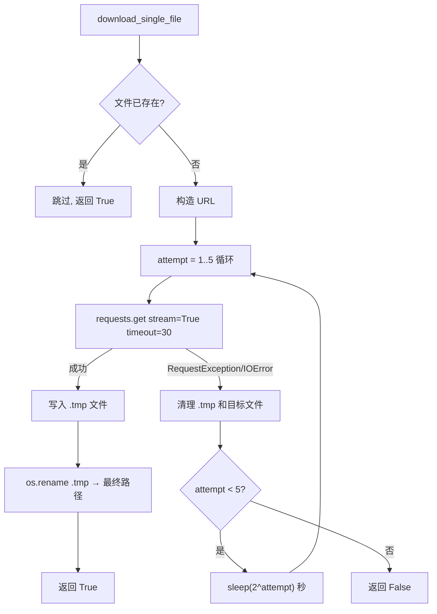
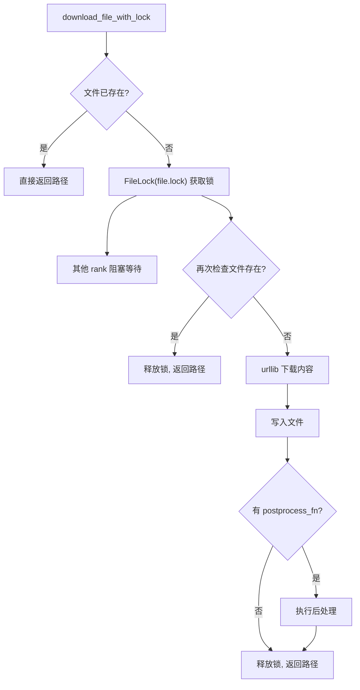
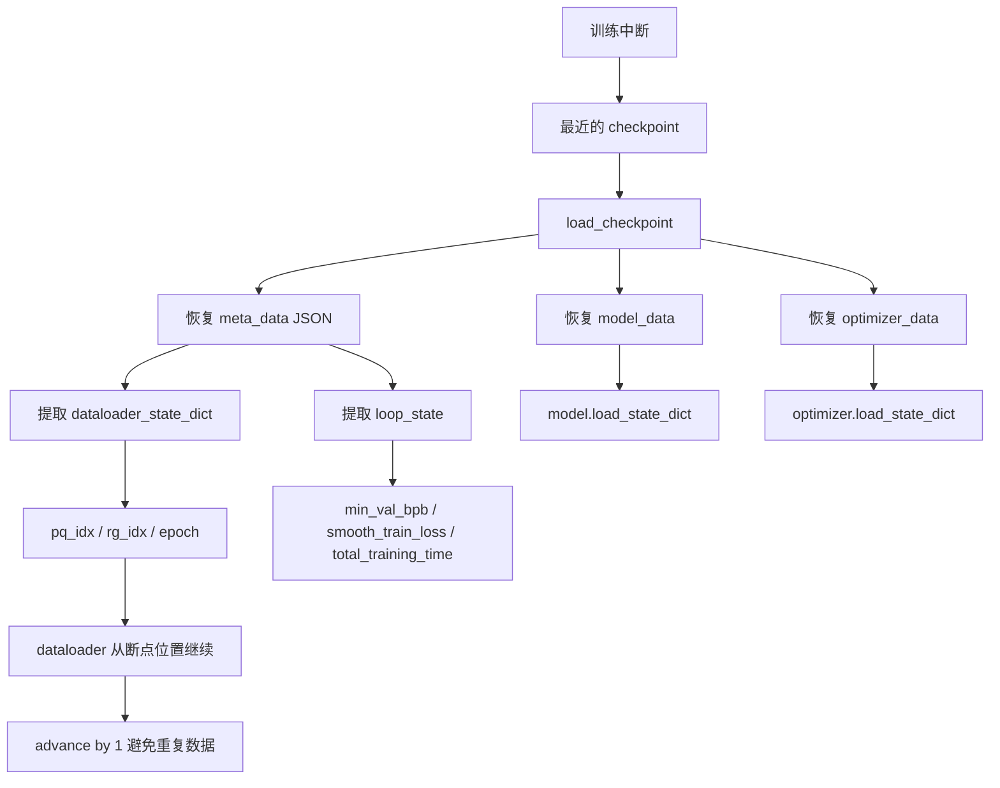
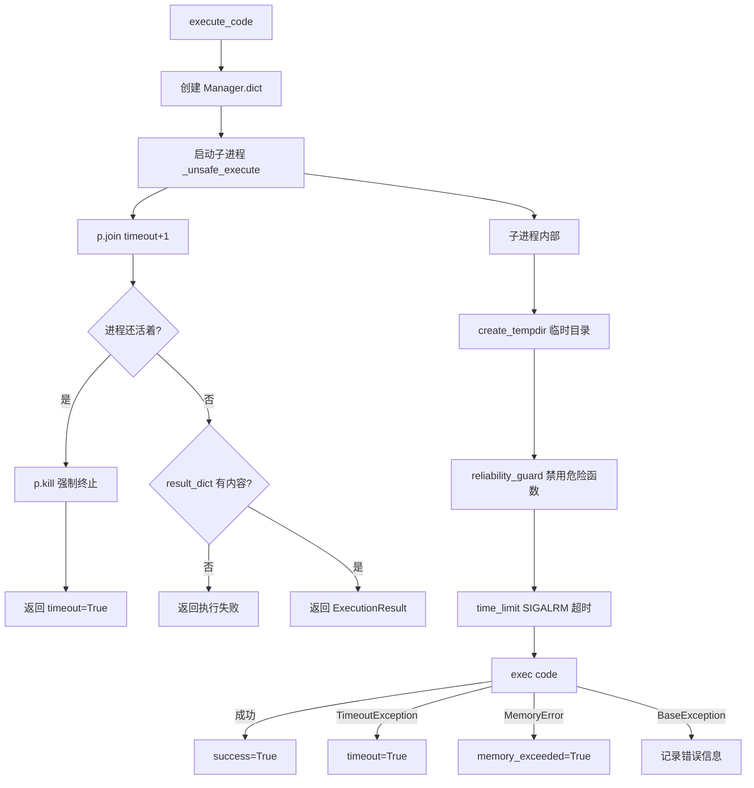

# PD-03.34 nanochat — 指数退避重试与 FileLock 并发保护及断点恢复

> 文档编号：PD-03.34
> 来源：nanochat `nanochat/dataset.py`, `nanochat/common.py`, `nanochat/dataloader.py`, `nanochat/execution.py`, `nanochat/checkpoint_manager.py`
> GitHub：https://github.com/karpathy/nanochat.git
> 问题域：PD-03 容错与重试 Fault Tolerance & Retry
> 状态：可复用方案

---

## 第 1 章 问题与动机（≥ 30 行）

### 1.1 核心问题

分布式 LLM 训练流水线面临多层容错挑战：

1. **数据下载不可靠**：从 HuggingFace 下载 1823 个 parquet 分片（100B token 数据集），网络中断、超时、服务端限流随时可能发生。单个分片下载失败不应阻塞整个数据准备流程。
2. **多 rank 并发冲突**：DDP 多进程训练中，多个 rank 可能同时尝试下载同一文件（如 tokenizer 模型），导致文件损坏或重复下载浪费带宽。
3. **训练中断恢复**：GPU 训练可能因 OOM、硬件故障、手动中断等原因停止。数万步训练不能从头开始，必须支持从任意 checkpoint 精确恢复——包括模型参数、优化器状态、数据加载位置。
4. **代码执行安全**：LLM 生成的代码在评估时可能死循环、内存爆炸或执行破坏性操作，需要多层防护（超时、内存限制、进程隔离）。

### 1.2 nanochat 的解法概述

nanochat 采用四层容错体系，每层针对不同故障场景：

1. **指数退避重试**（`dataset.py:75-107`）：数据下载失败时最多重试 5 次，间隔 2^attempt 秒，配合临时文件 + 原子重命名防止部分写入。
2. **FileLock 并发保护**（`common.py:61-95`）：使用 `filelock.FileLock` 实现跨进程互斥，确保多 rank 环境下只有一个进程执行下载，其他进程阻塞等待。
3. **三层断点恢复**（`checkpoint_manager.py` + `dataloader.py` + `base_train.py`）：checkpoint 保存模型参数 + 优化器状态 + 元数据（含 dataloader 位置），恢复时精确还原到中断点。
4. **进程级超时隔离**（`execution.py:286-348`）：LLM 生成代码在独立子进程中执行，SIGALRM 超时 + 内存限制 + 危险函数禁用三重防护。

### 1.3 设计思想

| 设计原则 | 具体实现 | 理由 | 替代方案 |
|----------|----------|------|----------|
| 原子写入 | 先写 `.tmp` 再 `os.rename` | 防止下载中断留下损坏文件 | 直接写目标文件 + 校验和验证 |
| 文件锁互斥 | `FileLock` + double-check | 跨进程安全，无需网络协调 | Redis 分布式锁、进程间信号量 |
| 指数退避 | `2^attempt` 秒间隔 | 简单有效，避免重试风暴 | 固定间隔、随机抖动、令牌桶 |
| 状态快照恢复 | model + optim + meta JSON | 完整恢复训练状态 | 仅保存模型参数（丢失优化器动量） |
| 进程隔离执行 | `multiprocessing.Process` + kill | 子进程崩溃不影响主进程 | 线程池（无法 kill 死循环） |
| 资源限制前置 | `reliability_guard` 禁用危险 API | 防止 LLM 代码执行破坏性操作 | seccomp/容器级隔离 |

---

## 第 2 章 源码实现分析（≥ 60 行，核心章节）

### 2.1 架构概览

nanochat 的容错体系分布在数据准备、训练循环、推理评估三个阶段：

```
┌─────────────────────────────────────────────────────────────────┐
│                    nanochat 容错架构                              │
├─────────────────────────────────────────────────────────────────┤
│                                                                 │
│  数据准备阶段                训练循环阶段              评估阶段    │
│  ┌──────────────┐          ┌──────────────┐      ┌───────────┐ │
│  │ dataset.py   │          │ base_train.py│      │execution.py│ │
│  │              │          │              │      │           │ │
│  │ ┌──────────┐ │          │ ┌──────────┐ │      │ ┌───────┐ │ │
│  │ │指数退避   │ │          │ │checkpoint │ │      │ │SIGALRM│ │ │
│  │ │5次重试   │ │          │ │save/load │ │      │ │超时   │ │ │
│  │ │2^n 间隔  │ │          │ │model+opt │ │      │ │       │ │ │
│  │ └──────────┘ │          │ │+meta     │ │      │ ├───────┤ │ │
│  │ ┌──────────┐ │          │ └──────────┘ │      │ │内存   │ │ │
│  │ │原子写入   │ │          │ ┌──────────┐ │      │ │256MB  │ │ │
│  │ │.tmp→rename│ │          │ │dataloader│ │      │ │限制   │ │ │
│  │ └──────────┘ │          │ │resume    │ │      │ ├───────┤ │ │
│  └──────────────┘          │ │state_dict│ │      │ │进程   │ │ │
│  ┌──────────────┐          │ └──────────┘ │      │ │隔离   │ │ │
│  │ common.py    │          └──────────────┘      │ └───────┘ │ │
│  │ ┌──────────┐ │                                └───────────┘ │
│  │ │FileLock  │ │                                              │
│  │ │跨进程互斥│ │                                              │
│  │ └──────────┘ │                                              │
│  └──────────────┘                                              │
└─────────────────────────────────────────────────────────────────┘
```

### 2.2 核心实现

#### 2.2.1 指数退避重试 — 数据下载



对应源码 `nanochat/dataset.py:60-109`：
```python
def download_single_file(index):
    """ Downloads a single file index, with some backoff """
    filename = index_to_filename(index)
    filepath = os.path.join(DATA_DIR, filename)
    if os.path.exists(filepath):
        print(f"Skipping {filepath} (already exists)")
        return True

    url = f"{BASE_URL}/{filename}"
    print(f"Downloading {filename}...")

    max_attempts = 5
    for attempt in range(1, max_attempts + 1):
        try:
            response = requests.get(url, stream=True, timeout=30)
            response.raise_for_status()
            temp_path = filepath + f".tmp"
            with open(temp_path, 'wb') as f:
                for chunk in response.iter_content(chunk_size=1024 * 1024):
                    if chunk:
                        f.write(chunk)
            os.rename(temp_path, filepath)
            print(f"Successfully downloaded {filename}")
            return True
        except (requests.RequestException, IOError) as e:
            print(f"Attempt {attempt}/{max_attempts} failed for {filename}: {e}")
            for path in [filepath + f".tmp", filepath]:
                if os.path.exists(path):
                    try:
                        os.remove(path)
                    except:
                        pass
            if attempt < max_attempts:
                wait_time = 2 ** attempt
                print(f"Waiting {wait_time} seconds before retry...")
                time.sleep(wait_time)
            else:
                print(f"Failed to download {filename} after {max_attempts} attempts")
                return False
    return False
```

关键设计点：
- **流式下载**（`stream=True, chunk_size=1MB`）：避免将整个 parquet 文件加载到内存
- **30 秒超时**（`timeout=30`）：防止连接挂起
- **原子重命名**（`os.rename`）：POSIX 系统上原子操作，不会出现半写文件
- **双路径清理**：失败时同时清理 `.tmp` 和目标文件，防止残留
- **多进程并行下载**（`dataset.py:123-124`）：`Pool(processes=4).map(download_single_file, ids)` 4 worker 并行

#### 2.2.2 FileLock 跨进程互斥 — 防止多 rank 并发下载



对应源码 `nanochat/common.py:61-95`：
```python
def download_file_with_lock(url, filename, postprocess_fn=None):
    """
    Downloads a file from a URL to a local path in the base directory.
    Uses a lock file to prevent concurrent downloads among multiple ranks.
    """
    base_dir = get_base_dir()
    file_path = os.path.join(base_dir, filename)
    lock_path = file_path + ".lock"

    if os.path.exists(file_path):
        return file_path

    with FileLock(lock_path):
        # Only a single rank can acquire this lock
        # All other ranks block until it is released
        if os.path.exists(file_path):  # double-check after lock
            return file_path

        print(f"Downloading {url}...")
        with urllib.request.urlopen(url) as response:
            content = response.read()

        with open(file_path, 'wb') as f:
            f.write(content)
        print(f"Downloaded to {file_path}")

        if postprocess_fn is not None:
            postprocess_fn(file_path)

    return file_path
```

关键设计点：
- **Double-check 模式**：锁外检查 + 锁内再检查，避免不必要的锁竞争
- **`.lock` 后缀文件锁**：与数据文件同目录，无需额外协调服务
- **`with` 语句自动释放**：即使下载异常也能释放锁，不会死锁
- **后处理钩子**（`postprocess_fn`）：支持下载后解压、转换等操作


#### 2.2.3 三层断点恢复 — checkpoint + dataloader state + loop state



对应源码 `nanochat/checkpoint_manager.py:42-74`：
```python
def save_checkpoint(checkpoint_dir, step, model_data, optimizer_data, meta_data, rank=0):
    if rank == 0:
        os.makedirs(checkpoint_dir, exist_ok=True)
        model_path = os.path.join(checkpoint_dir, f"model_{step:06d}.pt")
        torch.save(model_data, model_path)
        meta_path = os.path.join(checkpoint_dir, f"meta_{step:06d}.json")
        with open(meta_path, "w", encoding="utf-8") as f:
            json.dump(meta_data, f, indent=2)
    # optimizer state is sharded across ranks
    if optimizer_data is not None:
        os.makedirs(checkpoint_dir, exist_ok=True)
        optimizer_path = os.path.join(checkpoint_dir, f"optim_{step:06d}_rank{rank:d}.pt")
        torch.save(optimizer_data, optimizer_path)
```

checkpoint 保存策略（`base_train.py:459-482`）：
- 训练结束时保存（`last_step`）
- 每 N 步保存（`args.save_every`）
- 跳过第一步和恢复步（避免重复保存）
- 元数据包含完整训练状态：`dataloader_state_dict`、`loop_state`（`min_val_bpb`、`smooth_train_loss`、`total_training_time`）

dataloader 恢复逻辑（`dataloader.py:39-59`）：
```python
resume_pq_idx = resume_state_dict["pq_idx"] if resume_state_dict is not None else 0
resume_rg_idx = resume_state_dict["rg_idx"] if resume_state_dict is not None else None
resume_epoch = resume_state_dict.get("epoch", 1) if resume_state_dict is not None else 1
# ...
if first_pass and (resume_rg_idx is not None) and (pq_idx == resume_pq_idx):
    base_idx = resume_rg_idx // ddp_world_size
    base_idx += 1  # advance by 1 so we don't repeat data after resuming
    rg_idx = base_idx * ddp_world_size + ddp_rank
```

关键设计点：
- **分片保存**：模型和元数据由 rank 0 保存，优化器按 rank 分片保存（DDP 下每个 rank 的优化器状态不同）
- **advance by 1**：恢复时跳过已处理的 row_group，避免数据重复
- **epoch 追踪**：支持多 epoch 训练的精确恢复
- **向后兼容补丁**（`checkpoint_manager.py:23-40`）：`_patch_missing_config_keys` 和 `_patch_missing_keys` 为旧 checkpoint 添加缺失字段的默认值

#### 2.2.4 进程级超时隔离 — 代码执行沙箱



对应源码 `nanochat/execution.py:286-348`：
```python
def execute_code(
    code: str,
    timeout: float = 5.0,
    maximum_memory_bytes: Optional[int] = 256 * 1024 * 1024,
) -> ExecutionResult:
    manager = multiprocessing.Manager()
    result_dict = manager.dict()
    p = multiprocessing.Process(
        target=_unsafe_execute,
        args=(code, timeout, maximum_memory_bytes, result_dict)
    )
    p.start()
    p.join(timeout=timeout + 1)
    if p.is_alive():
        p.kill()
        return ExecutionResult(success=False, stdout="", stderr="",
                               error="Execution timed out (process killed)",
                               timeout=True, memory_exceeded=False)
    # ...
```

`reliability_guard`（`execution.py:134-211`）禁用的危险操作：
- `os.kill`, `os.system`, `os.fork`, `os.remove`, `os.rmdir`, `os.chmod` 等 20+ 个 os 函数
- `shutil.rmtree`, `shutil.move`, `shutil.chown`
- `subprocess.Popen`
- `builtins.exit`, `builtins.quit`
- 屏蔽 `ipdb`, `joblib`, `resource`, `psutil`, `tkinter` 模块

### 2.3 实现细节

**calculator 超时保护**（`engine.py:27-45`）：推理时 LLM 可能生成需要计算的表达式，`eval_with_timeout` 用 `signal.SIGALRM` 限制为 3 秒，超时返回 None 而非崩溃。

**GC 管理**（`base_train.py:559-564`）：训练循环中禁用 Python GC（`gc.disable()`），每 5000 步手动 `gc.collect()`。这是一种性能容错——GC 扫描会导致 ~500ms 的训练暂停，对 GPU 利用率有显著影响。

**DDP 清理**（`common.py:190-193`）：`compute_cleanup()` 在训练结束时安全销毁进程组，先检查 `is_ddp_initialized()` 避免对未初始化的进程组调用 `destroy_process_group()`。

---

## 第 3 章 迁移指南（≥ 40 行）

### 3.1 迁移清单

**阶段 1：数据下载容错**
- [ ] 引入 `requests` 库的流式下载 + 指数退避重试
- [ ] 实现 `.tmp` 临时文件 + `os.rename` 原子写入模式
- [ ] 添加 `filelock` 依赖，为共享资源下载加锁
- [ ] 实现 double-check 模式（锁外 + 锁内检查文件存在）

**阶段 2：训练断点恢复**
- [ ] 设计 checkpoint 格式：model state + optimizer state + metadata JSON
- [ ] 在 dataloader 中维护位置状态（文件索引 + 行组索引 + epoch）
- [ ] 实现 `--resume-from-step` CLI 参数
- [ ] 恢复时 advance by 1 避免数据重复

**阶段 3：代码执行沙箱**
- [ ] 使用 `multiprocessing.Process` 隔离执行
- [ ] 实现 `signal.SIGALRM` 超时保护
- [ ] 添加 `resource.setrlimit` 内存限制
- [ ] 禁用危险系统调用

### 3.2 适配代码模板

**可复用的指数退避下载器：**

```python
import os
import time
import requests
from filelock import FileLock

def download_with_retry(url: str, filepath: str, max_attempts: int = 5,
                        timeout: int = 30, chunk_size: int = 1024 * 1024) -> bool:
    """带指数退避重试和原子写入的文件下载器。"""
    if os.path.exists(filepath):
        return True

    lock_path = filepath + ".lock"
    with FileLock(lock_path):
        if os.path.exists(filepath):  # double-check
            return True

        for attempt in range(1, max_attempts + 1):
            try:
                response = requests.get(url, stream=True, timeout=timeout)
                response.raise_for_status()
                temp_path = filepath + ".tmp"
                with open(temp_path, 'wb') as f:
                    for chunk in response.iter_content(chunk_size=chunk_size):
                        if chunk:
                            f.write(chunk)
                os.rename(temp_path, filepath)
                return True
            except (requests.RequestException, IOError) as e:
                for path in [filepath + ".tmp", filepath]:
                    if os.path.exists(path):
                        try:
                            os.remove(path)
                        except OSError:
                            pass
                if attempt < max_attempts:
                    wait_time = 2 ** attempt
                    time.sleep(wait_time)
        return False
```

**可复用的 checkpoint 恢复框架：**

```python
import json
import torch
from dataclasses import dataclass, asdict
from typing import Optional, Dict, Any

@dataclass
class TrainingState:
    step: int
    model_config: Dict[str, Any]
    dataloader_state: Dict[str, Any]  # {"pq_idx": int, "rg_idx": int, "epoch": int}
    loop_state: Dict[str, float]      # {"min_val_loss": float, "smooth_loss": float}

def save_training_checkpoint(checkpoint_dir: str, step: int,
                              model: torch.nn.Module,
                              optimizer: torch.optim.Optimizer,
                              state: TrainingState, rank: int = 0):
    os.makedirs(checkpoint_dir, exist_ok=True)
    if rank == 0:
        torch.save(model.state_dict(), f"{checkpoint_dir}/model_{step:06d}.pt")
        with open(f"{checkpoint_dir}/meta_{step:06d}.json", "w") as f:
            json.dump(asdict(state), f, indent=2)
    # 每个 rank 保存自己的优化器分片
    torch.save(optimizer.state_dict(), f"{checkpoint_dir}/optim_{step:06d}_rank{rank}.pt")

def load_training_checkpoint(checkpoint_dir: str, step: int,
                              device: torch.device, rank: int = 0):
    model_data = torch.load(f"{checkpoint_dir}/model_{step:06d}.pt", map_location=device)
    optim_data = torch.load(f"{checkpoint_dir}/optim_{step:06d}_rank{rank}.pt", map_location=device)
    with open(f"{checkpoint_dir}/meta_{step:06d}.json") as f:
        state = TrainingState(**json.load(f))
    return model_data, optim_data, state
```

### 3.3 适用场景

| 场景 | 适用度 | 说明 |
|------|--------|------|
| 分布式 LLM 预训练 | ⭐⭐⭐ | 完美匹配：多 rank 并发、长时间训练、大数据集下载 |
| 单机微调 | ⭐⭐⭐ | checkpoint 恢复和数据下载重试直接可用 |
| 数据管道 ETL | ⭐⭐ | 指数退避下载 + FileLock 可复用，checkpoint 部分不适用 |
| Agent 工具调用 | ⭐⭐ | 进程隔离执行模式可借鉴，但缺少 LLM 特有的重试逻辑 |
| 在线推理服务 | ⭐ | 训练容错模式不适用于低延迟推理场景 |


---

## 第 4 章 测试用例（≥ 20 行）

```python
import os
import time
import tempfile
import pytest
from unittest.mock import patch, MagicMock
from multiprocessing import Process

# ---- 测试指数退避重试 ----

class TestDownloadRetry:
    def test_successful_download_first_attempt(self, tmp_path):
        """正常下载应一次成功"""
        filepath = str(tmp_path / "test.parquet")
        with patch("requests.get") as mock_get:
            mock_resp = MagicMock()
            mock_resp.iter_content.return_value = [b"data"]
            mock_resp.raise_for_status.return_value = None
            mock_get.return_value = mock_resp
            # 模拟 download_single_file 逻辑
            result = _download_with_retry("http://example.com/f", filepath, max_attempts=5)
            assert result is True
            assert os.path.exists(filepath)

    def test_retry_on_network_error(self, tmp_path):
        """网络错误应触发重试"""
        filepath = str(tmp_path / "test.parquet")
        import requests
        with patch("requests.get") as mock_get:
            mock_get.side_effect = [
                requests.RequestException("timeout"),
                requests.RequestException("connection reset"),
                MagicMock(iter_content=lambda **kw: [b"ok"], raise_for_status=lambda: None),
            ]
            with patch("time.sleep") as mock_sleep:
                result = _download_with_retry("http://example.com/f", filepath, max_attempts=5)
                assert result is True
                # 验证指数退避间隔
                assert mock_sleep.call_count == 2
                mock_sleep.assert_any_call(2)   # 2^1
                mock_sleep.assert_any_call(4)   # 2^2

    def test_max_attempts_exhausted(self, tmp_path):
        """超过最大重试次数应返回 False"""
        filepath = str(tmp_path / "test.parquet")
        import requests
        with patch("requests.get", side_effect=requests.RequestException("fail")):
            with patch("time.sleep"):
                result = _download_with_retry("http://example.com/f", filepath, max_attempts=3)
                assert result is False
                assert not os.path.exists(filepath)

    def test_tmp_file_cleanup_on_failure(self, tmp_path):
        """失败时应清理 .tmp 文件"""
        filepath = str(tmp_path / "test.parquet")
        tmp_file = filepath + ".tmp"
        os.makedirs(tmp_path, exist_ok=True)
        with open(tmp_file, 'w') as f:
            f.write("partial")
        import requests
        with patch("requests.get", side_effect=requests.RequestException("fail")):
            with patch("time.sleep"):
                _download_with_retry("http://example.com/f", filepath, max_attempts=1)
                assert not os.path.exists(tmp_file)


# ---- 测试 FileLock 并发保护 ----

class TestFileLockProtection:
    def test_double_check_prevents_duplicate_download(self, tmp_path):
        """锁内 double-check 应防止重复下载"""
        filepath = str(tmp_path / "model.bin")
        # 模拟文件在获取锁后已被其他 rank 下载
        os.makedirs(tmp_path, exist_ok=True)
        with open(filepath, 'wb') as f:
            f.write(b"already downloaded")
        from filelock import FileLock
        lock_path = filepath + ".lock"
        with FileLock(lock_path):
            assert os.path.exists(filepath)  # double-check 通过

    def test_concurrent_access_serialized(self, tmp_path):
        """多进程应串行化访问"""
        filepath = str(tmp_path / "shared.bin")
        lock_path = filepath + ".lock"
        from filelock import FileLock
        results = []
        def worker(worker_id):
            with FileLock(lock_path):
                results.append(worker_id)
                time.sleep(0.1)
        procs = [Process(target=worker, args=(i,)) for i in range(3)]
        for p in procs:
            p.start()
        for p in procs:
            p.join()


# ---- 测试断点恢复 ----

class TestCheckpointResume:
    def test_dataloader_resume_advances_by_one(self):
        """恢复时应跳过已处理的 row_group"""
        resume_state = {"pq_idx": 0, "rg_idx": 4, "epoch": 1}
        ddp_world_size = 2
        ddp_rank = 0
        # 模拟恢复逻辑
        base_idx = resume_state["rg_idx"] // ddp_world_size
        base_idx += 1  # advance by 1
        rg_idx = base_idx * ddp_world_size + ddp_rank
        assert rg_idx == 6  # 跳过了 rg_idx=4,5

    def test_checkpoint_backward_compat_patch(self):
        """旧 checkpoint 缺失字段应被补丁"""
        config = {"n_layer": 12, "n_embd": 768}
        # 模拟 _patch_missing_config_keys
        if "window_pattern" not in config:
            config["window_pattern"] = "L"
        assert config["window_pattern"] == "L"


# ---- 辅助函数 ----

def _download_with_retry(url, filepath, max_attempts=5):
    """测试用简化版下载函数"""
    import requests as req
    for attempt in range(1, max_attempts + 1):
        try:
            response = req.get(url, stream=True, timeout=30)
            response.raise_for_status()
            temp_path = filepath + ".tmp"
            with open(temp_path, 'wb') as f:
                for chunk in response.iter_content(chunk_size=1024*1024):
                    if chunk:
                        f.write(chunk)
            os.rename(temp_path, filepath)
            return True
        except (req.RequestException, IOError):
            for path in [filepath + ".tmp", filepath]:
                if os.path.exists(path):
                    try:
                        os.remove(path)
                    except:
                        pass
            if attempt < max_attempts:
                time.sleep(2 ** attempt)
    return False
```

---

## 第 5 章 跨域关联

| 关联域 | 关系类型 | 说明 |
|--------|----------|------|
| PD-05 沙箱隔离 | 协同 | `execution.py` 的 `reliability_guard` + 进程隔离是沙箱的核心实现，容错（超时/内存限制）和隔离（危险函数禁用）紧密耦合 |
| PD-06 记忆持久化 | 依赖 | checkpoint 机制本质是训练状态的持久化，`meta_data` JSON 保存了完整的训练记忆（dataloader 位置、loss 历史） |
| PD-01 上下文管理 | 协同 | dataloader 的 `resume_state_dict` 管理数据上下文的精确位置，避免恢复后重复或遗漏数据 |
| PD-11 可观测性 | 协同 | 每次下载失败都有 print 日志（`Attempt X/Y failed`），checkpoint 保存有 logger.info，但缺少结构化指标收集 |

---

## 第 6 章 来源文件索引

| 文件 | 行范围 | 关键实现 |
|------|--------|----------|
| `nanochat/dataset.py` | L60-L109 | `download_single_file`：指数退避重试 + 原子写入 |
| `nanochat/dataset.py` | L112-L128 | `__main__`：多进程并行下载 |
| `nanochat/common.py` | L61-L95 | `download_file_with_lock`：FileLock 跨进程互斥 |
| `nanochat/common.py` | L190-L193 | `compute_cleanup`：DDP 进程组安全清理 |
| `nanochat/dataloader.py` | L25-L70 | `_document_batches`：DDP 分片 + 断点恢复迭代器 |
| `nanochat/dataloader.py` | L156-L160 | state_dict yield：每批次输出位置状态 |
| `nanochat/checkpoint_manager.py` | L23-L40 | `_patch_missing_*`：向后兼容补丁 |
| `nanochat/checkpoint_manager.py` | L42-L74 | `save/load_checkpoint`：三文件 checkpoint 格式 |
| `nanochat/execution.py` | L64-L74 | `time_limit`：SIGALRM 超时上下文管理器 |
| `nanochat/execution.py` | L134-L211 | `reliability_guard`：危险函数禁用 |
| `nanochat/execution.py` | L286-L348 | `execute_code`：进程隔离执行 + 超时 kill |
| `nanochat/engine.py` | L27-L45 | `timeout` + `eval_with_timeout`：calculator 超时保护 |
| `scripts/base_train.py` | L71 | `--resume-from-step` CLI 参数 |
| `scripts/base_train.py` | L153-L158 | checkpoint 加载与模型恢复 |
| `scripts/base_train.py` | L314-L321 | 优化器和 dataloader 恢复 |
| `scripts/base_train.py` | L459-L482 | checkpoint 保存策略与元数据 |
| `scripts/base_train.py` | L559-L564 | GC 管理：disable + 周期性 collect |

---

## 第 7 章 横向对比维度

```json comparison_data
{
  "project": "nanochat",
  "dimensions": {
    "重试策略": "指数退避 2^attempt 秒，最多 5 次，无随机抖动",
    "并发容错": "FileLock 文件锁 + double-check 防止多 rank 并发下载冲突",
    "恢复机制": "三层 checkpoint（model+optimizer+meta JSON），dataloader advance-by-1 精确恢复",
    "超时保护": "SIGALRM 信号超时 + multiprocessing.Process.kill 双层超时",
    "资源管理模式": "reliability_guard 禁用 20+ 危险系统调用 + RLIMIT 内存限制",
    "错误分类": "RequestException/IOError 网络错误、TimeoutException、MemoryError 三类分流",
    "级联清理": ".tmp 文件清理 + DDP 进程组销毁 + 临时目录自动删除",
    "续写能力": "dataloader state_dict 记录 parquet/row_group/epoch 三维位置",
    "锁错误处理": "FileLock with 语句自动释放，异常时不会死锁",
    "计算模式降级": "GC disable + 周期性手动 collect 避免训练暂停"
  }
}
```

### 域元数据补充

```json domain_metadata
{
  "solution_summary": "nanochat 用指数退避重试(5次/2^n秒) + FileLock 跨进程互斥 + 三层 checkpoint(model+optim+dataloader位置) + 进程隔离代码执行实现训练全链路容错",
  "description": "分布式训练场景下数据下载、checkpoint 恢复、代码执行的多层容错",
  "sub_problems": [
    "多 rank 并发下载同一文件导致数据损坏：需要跨进程文件锁 + double-check 模式",
    "训练恢复时 dataloader 位置偏移导致数据重复或遗漏：需要 advance-by-1 跳过已处理数据",
    "旧 checkpoint 缺少新版本模型字段导致 load_state_dict 失败：需要向后兼容补丁函数",
    "Python GC 扫描导致 GPU 训练周期性暂停 ~500ms：需要禁用 GC + 手动周期性收集"
  ],
  "best_practices": [
    "原子写入：先写 .tmp 再 rename，防止下载中断留下损坏文件",
    "FileLock double-check：锁外快速检查 + 锁内再检查，减少不必要的锁竞争",
    "checkpoint 元数据用 JSON 而非 pickle：人类可读、跨版本兼容、便于调试",
    "分片保存优化器状态：DDP 下每个 rank 只保存自己的优化器分片，减少 IO"
  ]
}
```
