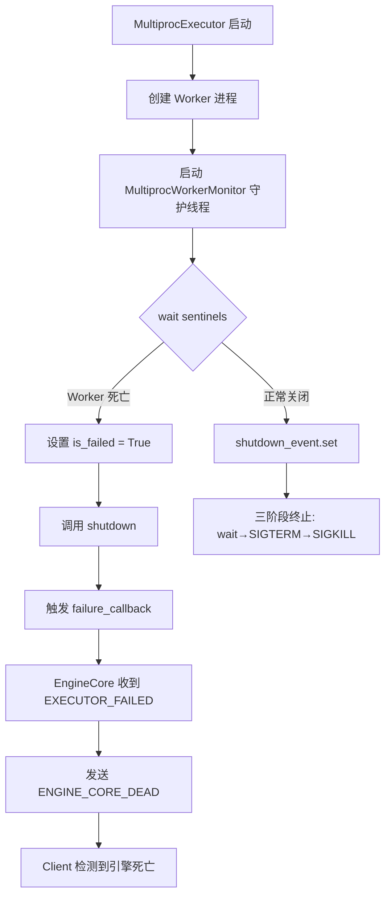
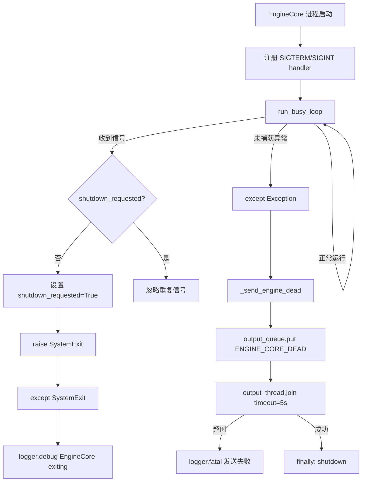
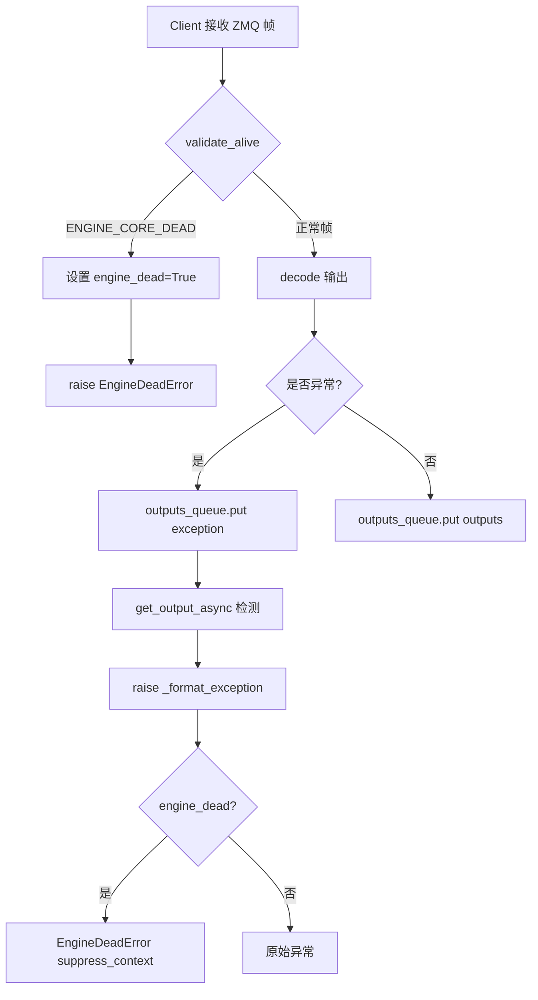

# PD-03.vLLM vLLM — 多进程 Watchdog 与 ZMQ 心跳级联容错

> 文档编号：PD-03.vLLM
> 来源：vLLM `vllm/v1/executor/multiproc_executor.py`, `vllm/v1/engine/core.py`, `vllm/v1/engine/core_client.py`
> GitHub：https://github.com/vllm-project/vllm.git
> 问题域：PD-03 容错与重试 Fault Tolerance & Retry
> 状态：可复用方案

---

## 第 1 章 问题与动机

### 1.1 核心问题

高性能 LLM 推理引擎运行在多进程 + 多 GPU 环境中，面临以下容错挑战：

1. **Worker 进程意外死亡**：GPU OOM、CUDA 错误、段错误等导致 Worker 进程崩溃，如果不及时检测，主进程会无限等待 RPC 响应
2. **EngineCore 进程崩溃**：引擎核心进程（负责调度和模型执行编排）死亡后，所有正在处理的请求都会丢失
3. **ZMQ 通信超时**：跨进程 ZMQ 消息传递可能因进程卡死、网络问题而无限阻塞
4. **级联清理**：一个进程死亡后，需要确保所有关联的子进程、ZMQ socket、共享内存都被正确清理，否则会导致资源泄漏
5. **信号处理冲突**：多进程环境中 SIGTERM/SIGINT 的处理需要协调，避免重复触发或遗漏

vLLM 作为生产级推理引擎，不能容忍任何"静默失败"——进程死了但上层不知道，请求永远挂起。

### 1.2 vLLM 的解法概述

vLLM 构建了一套**四层容错体系**，从进程级到消息级全覆盖：

1. **进程哨兵监控（Process Sentinel）**：后台守护线程通过 `multiprocessing.connection.wait(sentinels)` 监控所有子进程存活状态，任一进程死亡立即触发全局关闭（`multiproc_executor.py:253-268`）
2. **ZMQ 帧级死亡检测（ENGINE_CORE_DEAD）**：EngineCore 进程在崩溃前发送特殊哨兵消息 `ENGINE_CORE_DEAD`，客户端在每次接收 ZMQ 帧时校验（`core_client.py:444-447`）
3. **双层异常分级（Recoverable vs Unrecoverable）**：`EngineGenerateError`（可恢复）和 `EngineDeadError`（不可恢复）两级异常，驱动不同的上层处理策略（`exceptions.py:3-18`）
4. **信号驱动优雅关闭**：SIGTERM/SIGINT 触发 `SystemExit`，配合 `shutdown_requested` 标志确保只触发一次，避免 ZMQ 析构异常（`core.py:1030-1043`）

### 1.3 设计思想

| 设计原则 | 具体实现 | 理由 | 替代方案 |
|----------|----------|------|----------|
| OS 级进程监控 | `multiprocessing.connection.wait(sentinels)` 阻塞等待进程退出 | 比轮询更高效，由 OS 内核通知 | 定时轮询 `is_alive()`（浪费 CPU） |
| 哨兵消息协议 | `ENGINE_CORE_DEAD = b"ENGINE_CORE_DEAD"` 特殊帧 | 允许进程在崩溃前主动通知，比被动检测更快 | 心跳超时检测（延迟更高） |
| 异常分级 | 两级异常 + `suppress_context` 控制堆栈 | 上层可区分"请求失败"和"引擎死亡"，采取不同策略 | 统一异常类型（无法区分严重度） |
| 弱引用防循环 | `weakref.ref(self)` 在监控线程中引用 executor | 避免监控线程阻止 GC 回收 executor | 强引用（可能导致内存泄漏） |
| 单次信号处理 | `shutdown_requested` 布尔标志 + `SystemExit` | 防止重复信号导致 ZMQ `__del__` 异常 | 无保护（可能触发 zmq 错误） |
| Pipe 死亡检测 | `death_pipe` 父进程退出时子进程感知 | 父进程崩溃时子进程不会成为孤儿 | 定时检查父 PID（不可靠） |

---

## 第 2 章 源码实现分析

### 2.1 架构概览

vLLM 的容错体系覆盖三个层次：Executor（Worker 管理）、EngineCore（引擎核心）、Client（客户端接口）。

```
┌─────────────────────────────────────────────────────────────────┐
│                     AsyncLLM / API Server                       │
│  ┌──────────────────────────────────────────────────────────┐   │
│  │ EngineCoreClient (core_client.py)                        │   │
│  │  ├─ validate_alive(): 每帧检查 ENGINE_CORE_DEAD          │   │
│  │  ├─ MPClientEngineMonitor: 守护线程监控 EngineCore 进程   │   │
│  │  └─ BackgroundResources: 集中式资源清理                   │   │
│  └──────────────────────────────────────────────────────────┘   │
│                          │ ZMQ (DEALER/PUSH)                    │
│  ┌──────────────────────────────────────────────────────────┐   │
│  │ EngineCoreProc (core.py)                                 │   │
│  │  ├─ signal_handler: SIGTERM/SIGINT → SystemExit          │   │
│  │  ├─ _send_engine_dead(): 崩溃前发送哨兵消息              │   │
│  │  ├─ run_busy_loop(): 主循环 + 异常捕获                   │   │
│  │  └─ executor_fail_callback: Worker 死亡回调              │   │
│  └──────────────────────────────────────────────────────────┘   │
│                          │ SharedMemory MQ                      │
│  ┌──────────────────────────────────────────────────────────┐   │
│  │ MultiprocExecutor (multiproc_executor.py)                │   │
│  │  ├─ MultiprocWorkerMonitor: 守护线程监控 Worker 进程      │   │
│  │  ├─ _ensure_worker_termination(): 三阶段终止             │   │
│  │  ├─ death_pipe: 父进程退出检测                           │   │
│  │  └─ weakref.finalize(): GC 安全清理                      │   │
│  └──────────────────────────────────────────────────────────┘   │
│                          │ fork/spawn                           │
│  ┌──────────┐  ┌──────────┐  ┌──────────┐                      │
│  │ Worker 0 │  │ Worker 1 │  │ Worker N │  (GPU 进程)          │
│  │ signal_  │  │ signal_  │  │ signal_  │                      │
│  │ handler  │  │ handler  │  │ handler  │                      │
│  └──────────┘  └──────────┘  └──────────┘                      │
└─────────────────────────────────────────────────────────────────┘
```

### 2.2 核心实现

#### 2.2.1 Worker 进程监控与三阶段终止



对应源码 `vllm/v1/executor/multiproc_executor.py:246-276`：

```python
def start_worker_monitor(self, inline=False) -> None:
    workers = self.workers
    self_ref = weakref.ref(self)

    def monitor_workers():
        sentinels = [h.proc.sentinel for h in workers]
        # OS 级阻塞等待，任一进程退出即返回
        died = multiprocessing.connection.wait(sentinels)
        _self = self_ref()
        if not _self or getattr(_self, "shutting_down", False):
            return
        _self.is_failed = True
        proc_name = next(
            h.proc.name for h in workers if h.proc.sentinel == died[0]
        )
        logger.error(
            "Worker proc %s died unexpectedly, shutting down executor.",
            proc_name,
        )
        _self.shutdown()
        callback = _self.failure_callback
        if callback is not None:
            _self.failure_callback = None
            callback()

    Thread(target=monitor_workers, daemon=True,
           name="MultiprocWorkerMonitor").start()
```

三阶段终止确保进程一定被清理 (`multiproc_executor.py:392-420`)：

```python
@staticmethod
def _ensure_worker_termination(worker_procs: list[BaseProcess]):
    # 阶段 1: 等待 4 秒让进程自行退出
    if wait_for_termination(active_procs(), 4):
        return
    # 阶段 2: 发送 SIGTERM
    for p in active_procs():
        p.terminate()
    if not wait_for_termination(active_procs(), 4):
        # 阶段 3: 发送 SIGKILL（最后手段）
        for p in active_procs():
            p.kill()
```

#### 2.2.2 EngineCore 信号处理与死亡通知



对应源码 `vllm/v1/engine/core.py:1024-1107`：

```python
@staticmethod
def run_engine_core(*args, dp_rank: int = 0, local_dp_rank: int = 0, **kwargs):
    shutdown_requested = False

    def signal_handler(signum, frame):
        nonlocal shutdown_requested
        if not shutdown_requested:
            shutdown_requested = True
            raise SystemExit()

    signal.signal(signal.SIGTERM, signal_handler)
    signal.signal(signal.SIGINT, signal_handler)

    engine_core = None
    try:
        # ... 初始化 engine_core ...
        engine_core.run_busy_loop()
    except SystemExit:
        logger.debug("EngineCore exiting.")
        raise
    except Exception as e:
        if engine_core is None:
            logger.exception("EngineCore failed to start.")
        else:
            logger.exception("EngineCore encountered a fatal error.")
            engine_core._send_engine_dead()  # 关键：崩溃前通知客户端
        raise e
    finally:
        if engine_core is not None:
            engine_core.shutdown()
```

死亡消息发送 (`core.py:1250-1262`)：

```python
def _send_engine_dead(self):
    self.output_queue.put_nowait(EngineCoreProc.ENGINE_CORE_DEAD)
    # 等待输出线程发送完毕，最多 5 秒
    self.output_thread.join(timeout=5.0)
    if self.output_thread.is_alive():
        logger.fatal(
            "vLLM shutdown signal from EngineCore failed "
            "to send. Please report this issue."
        )
```

#### 2.2.3 客户端帧级死亡检测与异常传播



对应源码 `vllm/v1/engine/core_client.py:444-447`：

```python
def validate_alive(self, frames: Sequence[zmq.Frame]):
    if len(frames) == 1 and (frames[0].buffer == EngineCoreProc.ENGINE_CORE_DEAD):
        self.engine_dead = True
        raise EngineDeadError()
```

异常传播链 (`core_client.py:987-1004`)：

```python
# 后台任务捕获异常并放入队列
except Exception as e:
    outputs_queue.put_nowait(e)
except asyncio.CancelledError:
    outputs_queue.put_nowait(EngineDeadError())

# 前台任务从队列取出并重新抛出
async def get_output_async(self) -> EngineCoreOutputs:
    outputs = await self.outputs_queue.get()
    if isinstance(outputs, Exception):
        raise self._format_exception(outputs) from None
    return outputs
```

### 2.3 实现细节

**Death Pipe 机制**：Worker 进程通过 `death_pipe` 检测父进程退出。父进程持有 `death_writer`，子进程持有 `death_reader`。当父进程退出（正常或崩溃），`death_writer` 被关闭，子进程的 `death_reader.recv()` 收到 `EOFError`，触发 `shutdown_event.set()`（`multiproc_executor.py:741-758`）。

**Handshake 超时**：EngineCore 启动时通过 ZMQ 与前端握手，设置 5 分钟超时（`core.py:78, 1005-1010`）。超时直接抛出 `RuntimeError`，防止启动阶段无限等待。

**RPC 超时**：`collective_rpc` 支持 `timeout` 参数，通过 `deadline = time.monotonic() + timeout` 计算截止时间，传递给 `MessageQueue.dequeue(timeout=...)`。默认执行超时 300 秒（`VLLM_EXECUTE_MODEL_TIMEOUT_SECONDS`）。

**请求预处理错误隔离**：输入线程中的请求预处理异常不会导致整个引擎崩溃，而是返回 `FinishReason.ERROR` 给该请求（`core.py:1420-1442`）。

---

## 第 3 章 迁移指南

### 3.1 迁移清单

**阶段 1：进程监控基础设施**
- [ ] 实现 Process Sentinel 监控线程（使用 `multiprocessing.connection.wait`）
- [ ] 实现三阶段进程终止（wait → SIGTERM → SIGKILL）
- [ ] 添加 `weakref.finalize` 确保 GC 时清理子进程

**阶段 2：死亡通知协议**
- [ ] 定义哨兵消息常量（如 `PROCESS_DEAD = b"PROCESS_DEAD"`）
- [ ] 在进程崩溃的 `except` 块中发送哨兵消息
- [ ] 在消息接收端添加帧级校验

**阶段 3：异常分级与传播**
- [ ] 定义可恢复/不可恢复两级异常
- [ ] 实现后台任务异常通过队列传播到前台
- [ ] 添加 `suppress_context` 控制堆栈输出

**阶段 4：信号处理**
- [ ] 注册 SIGTERM/SIGINT 处理器
- [ ] 添加 `shutdown_requested` 防重复触发
- [ ] 实现 Death Pipe 检测父进程退出

### 3.2 适配代码模板

以下是一个可直接复用的多进程容错框架模板：

```python
import multiprocessing
import signal
import threading
import weakref
from concurrent.futures import Future
from multiprocessing.process import BaseProcess
from threading import Thread
from typing import Callable


# ---- 异常分级 ----
class WorkerRecoverableError(Exception):
    """单个请求失败，可恢复"""
    pass

class WorkerDeadError(Exception):
    """Worker 进程死亡，不可恢复"""
    def __init__(self, *args, suppress_context: bool = False, **kwargs):
        super().__init__("Worker process died unexpectedly.", *args, **kwargs)
        self.__suppress_context__ = suppress_context


# ---- 进程监控 ----
class ProcessMonitor:
    """监控子进程存活状态，任一死亡触发回调"""

    DEAD_SENTINEL = b"WORKER_DEAD"

    def __init__(self, processes: list[BaseProcess],
                 on_failure: Callable[[], None] | None = None):
        self.is_failed = False
        self._shutdown_event = threading.Event()
        self._failure_callback = on_failure
        self._finalizer = weakref.finalize(self, self._cleanup, processes)
        self._start_monitor(processes)

    def _start_monitor(self, processes: list[BaseProcess]):
        self_ref = weakref.ref(self)

        def monitor():
            sentinels = [p.sentinel for p in processes]
            died = multiprocessing.connection.wait(sentinels)
            _self = self_ref()
            if not _self or _self._shutdown_event.is_set():
                return
            _self.is_failed = True
            if _self._failure_callback:
                _self._failure_callback()

        Thread(target=monitor, daemon=True, name="ProcessMonitor").start()

    @staticmethod
    def _cleanup(processes: list[BaseProcess]):
        """三阶段终止"""
        import time
        alive = [p for p in processes if p.is_alive()]
        if not alive:
            return
        # 阶段 1: 等待自行退出
        deadline = time.time() + 4
        while time.time() < deadline and any(p.is_alive() for p in alive):
            time.sleep(0.1)
        # 阶段 2: SIGTERM
        for p in alive:
            if p.is_alive():
                p.terminate()
        deadline = time.time() + 4
        while time.time() < deadline and any(p.is_alive() for p in alive):
            time.sleep(0.1)
        # 阶段 3: SIGKILL
        for p in alive:
            if p.is_alive():
                p.kill()

    def shutdown(self):
        self._shutdown_event.set()
        self._finalizer()


# ---- Worker 进程信号处理 ----
def worker_main(task_fn, death_pipe=None):
    """Worker 进程入口，带信号处理和死亡检测"""
    shutdown_requested = False
    shutdown_event = threading.Event()

    def signal_handler(signum, frame):
        nonlocal shutdown_requested
        if not shutdown_requested:
            shutdown_requested = True
            raise SystemExit()

    signal.signal(signal.SIGTERM, signal_handler)
    signal.signal(signal.SIGINT, signal_handler)

    # Death Pipe: 检测父进程退出
    if death_pipe is not None:
        def monitor_parent():
            try:
                death_pipe.recv()
            except EOFError:
                shutdown_event.set()
        Thread(target=monitor_parent, daemon=True).start()

    try:
        task_fn(cancel=shutdown_event)
    except SystemExit:
        pass  # 正常信号退出
    except Exception:
        # 发送死亡通知（通过你的 IPC 机制）
        pass
    finally:
        if death_pipe:
            death_pipe.close()
```

### 3.3 适用场景

| 场景 | 适用度 | 说明 |
|------|--------|------|
| 多 GPU 推理服务 | ⭐⭐⭐ | 完全匹配：多 Worker 进程 + 长时间运行 |
| 分布式训练框架 | ⭐⭐⭐ | Worker 监控 + 三阶段终止直接可用 |
| 多进程数据处理管道 | ⭐⭐ | 进程监控可用，但死亡通知协议可能过重 |
| 单进程 Agent 系统 | ⭐ | 不需要进程级容错，线程级即可 |
| 微服务间通信 | ⭐⭐ | 哨兵消息思想可借鉴，但通常用 HTTP 健康检查 |

---

## 第 4 章 测试用例

```python
import multiprocessing
import os
import signal
import time
import threading
import pytest
from unittest.mock import MagicMock, patch


class TestProcessSentinelMonitor:
    """测试进程哨兵监控机制"""

    def test_detect_worker_death(self):
        """Worker 进程崩溃应触发 failure_callback"""
        callback_called = threading.Event()

        def on_failure():
            callback_called.set()

        ctx = multiprocessing.get_context("spawn")
        proc = ctx.Process(target=lambda: os._exit(1), daemon=True)
        proc.start()

        # 模拟 sentinel 监控
        sentinels = [proc.sentinel]
        died = multiprocessing.connection.wait(sentinels, timeout=5)
        assert len(died) > 0, "应检测到进程死亡"
        proc.join()

    def test_three_stage_termination(self):
        """三阶段终止：wait → SIGTERM → SIGKILL"""
        ctx = multiprocessing.get_context("spawn")
        proc = ctx.Process(
            target=lambda: time.sleep(100),  # 模拟卡死进程
            daemon=True,
        )
        proc.start()
        assert proc.is_alive()

        # 阶段 2: SIGTERM
        proc.terminate()
        proc.join(timeout=5)
        assert not proc.is_alive(), "SIGTERM 应终止进程"


class TestSignalHandler:
    """测试信号处理器的单次触发机制"""

    def test_shutdown_requested_flag(self):
        """shutdown_requested 应防止重复触发"""
        shutdown_requested = False
        call_count = 0

        def signal_handler(signum, frame):
            nonlocal shutdown_requested, call_count
            call_count += 1
            if not shutdown_requested:
                shutdown_requested = True

        # 模拟两次信号
        signal_handler(signal.SIGTERM, None)
        signal_handler(signal.SIGTERM, None)
        assert call_count == 2
        assert shutdown_requested is True  # 只设置一次


class TestDeathPipe:
    """测试 Death Pipe 父进程退出检测"""

    def test_parent_exit_detection(self):
        """父进程关闭 writer 时子进程应收到 EOFError"""
        ctx = multiprocessing.get_context("spawn")
        reader, writer = ctx.Pipe(duplex=False)

        detected = threading.Event()

        def monitor():
            try:
                reader.recv()
            except EOFError:
                detected.set()

        t = threading.Thread(target=monitor, daemon=True)
        t.start()

        # 关闭 writer 模拟父进程退出
        writer.close()
        assert detected.wait(timeout=2), "应检测到父进程退出"
        reader.close()


class TestExceptionHierarchy:
    """测试异常分级机制"""

    def test_engine_dead_error_suppress_context(self):
        """EngineDeadError 应支持 suppress_context"""
        # 模拟 vLLM 的异常类
        class EngineDeadError(Exception):
            def __init__(self, *args, suppress_context=False, **kwargs):
                super().__init__("Engine died", *args, **kwargs)
                self.__suppress_context__ = suppress_context

        err = EngineDeadError(suppress_context=True)
        assert err.__suppress_context__ is True
        assert "Engine died" in str(err)

    def test_format_exception_when_dead(self):
        """engine_dead 时应返回 EngineDeadError"""
        class EngineDeadError(Exception):
            pass

        engine_dead = True
        original_error = RuntimeError("some error")

        formatted = (
            EngineDeadError() if engine_dead else original_error
        )
        assert isinstance(formatted, EngineDeadError)


class TestHandshakeTimeout:
    """测试握手超时机制"""

    def test_handshake_timeout_value(self):
        """握手超时应为 5 分钟"""
        HANDSHAKE_TIMEOUT_MINS = 5
        assert HANDSHAKE_TIMEOUT_MINS * 60_000 == 300_000  # 300 秒 = 5 分钟
```

---

## 第 5 章 跨域关联

| 关联域 | 关系类型 | 说明 |
|--------|----------|------|
| PD-02 多 Agent 编排 | 协同 | vLLM 的多进程 Worker 编排（DP/TP/PP 并行）依赖容错体系保障进程间协调可靠性；`DPEngineCoreProc` 的 all-reduce 同步需要所有 DP rank 存活 |
| PD-04 工具系统 | 依赖 | `collective_rpc` 是 vLLM 的核心工具调用机制，其超时和错误处理直接依赖 PD-03 的 `TimeoutError` 和 `ResponseStatus.FAILURE` 机制 |
| PD-05 沙箱隔离 | 协同 | Worker 进程本身就是隔离单元，`death_pipe` 和 `shutdown_event` 确保隔离边界的清理；进程崩溃不会污染其他 Worker 的 GPU 状态 |
| PD-10 中间件管道 | 依赖 | `log_error_detail` 上下文管理器（`core.py:333-347`）在模型执行失败时 dump 调度器状态，是容错与可观测性的桥梁 |
| PD-11 可观测性 | 协同 | 每次失败都有结构化日志（`logger.exception`），进程死亡有明确的进程名标识；`dump_engine_exception` 在崩溃时保存完整的调度器快照 |

---

## 第 6 章 来源文件索引

| 文件 | 行范围 | 关键实现 |
|------|--------|----------|
| `vllm/v1/executor/multiproc_executor.py` | L98-108 | MultiprocExecutor 初始化：finalizer + is_failed + shutdown_event |
| `vllm/v1/executor/multiproc_executor.py` | L246-276 | Worker 进程监控线程 monitor_workers + failure_callback |
| `vllm/v1/executor/multiproc_executor.py` | L392-420 | 三阶段进程终止 _ensure_worker_termination |
| `vllm/v1/executor/multiproc_executor.py` | L422-439 | shutdown 方法：关闭 death_writer + 终止 Worker |
| `vllm/v1/executor/multiproc_executor.py` | L617-643 | make_worker_process：创建 death_pipe 用于父进程退出检测 |
| `vllm/v1/executor/multiproc_executor.py` | L712-825 | worker_main：信号处理 + death_pipe 监控 + 异常处理 |
| `vllm/v1/executor/multiproc_executor.py` | L862-888 | worker_busy_loop：RPC 异常捕获 + ResponseStatus.FAILURE |
| `vllm/v1/engine/core.py` | L78 | HANDSHAKE_TIMEOUT_MINS = 5 |
| `vllm/v1/engine/core.py` | L790-792 | executor_fail_callback：Worker 死亡 → 输入队列注入 EXECUTOR_FAILED |
| `vllm/v1/engine/core.py` | L1024-1107 | run_engine_core：信号处理 + 异常捕获 + _send_engine_dead |
| `vllm/v1/engine/core.py` | L1186-1212 | _handle_client_request：EXECUTOR_FAILED → raise RuntimeError |
| `vllm/v1/engine/core.py` | L1250-1262 | _send_engine_dead：发送 ENGINE_CORE_DEAD 哨兵消息 |
| `vllm/v1/engine/core.py` | L1420-1442 | _handle_request_preproc_error：请求级错误隔离 |
| `vllm/v1/engine/core_client.py` | L364-447 | BackgroundResources：集中式资源清理 + validate_alive |
| `vllm/v1/engine/core_client.py` | L608-614 | 引擎就绪超时检测 VLLM_ENGINE_READY_TIMEOUT_S |
| `vllm/v1/engine/core_client.py` | L638-646 | _format_exception + ensure_alive |
| `vllm/v1/engine/core_client.py` | L659-697 | start_engine_core_monitor：EngineCore 进程监控线程 |
| `vllm/v1/engine/core_client.py` | L987-1004 | 异步输出队列异常传播链 |
| `vllm/v1/engine/exceptions.py` | L3-18 | EngineGenerateError + EngineDeadError 异常分级 |
| `vllm/v1/engine/async_llm.py` | L306-308 | errored 检查：请求入口的前置校验 |
| `vllm/v1/engine/async_llm.py` | L594-635 | generate 异常处理：分类处理 CancelledError/EngineDeadError/ValueError/Exception |
| `vllm/v1/executor/abstract.py` | L33 | FailureCallback 类型定义 |
| `vllm/v1/executor/abstract.py` | L128-133 | register_failure_callback 抽象方法 |
| `vllm/v1/executor/abstract.py` | L263-267 | check_health 抽象方法 |

---

## 第 7 章 横向对比维度

```json comparison_data
{
  "project": "vLLM",
  "dimensions": {
    "截断/错误检测": "ZMQ 帧级 ENGINE_CORE_DEAD 哨兵 + OS 进程 sentinel 双重检测",
    "重试/恢复策略": "无自动重试，进程死亡即全局关闭；请求级错误返回 FinishReason.ERROR",
    "超时保护": "三层超时：握手 5min + 执行 300s + RPC deadline 传播",
    "优雅降级": "EngineGenerateError 可恢复 vs EngineDeadError 不可恢复两级异常分流",
    "级联清理": "三阶段终止 wait→SIGTERM→SIGKILL + weakref.finalize + death_pipe",
    "监控告警": "双守护线程：MultiprocWorkerMonitor + MPClientEngineMonitor",
    "恢复机制": "无热恢复，崩溃即关闭；依赖外部编排（K8s/Ray）重启",
    "资源管理模式": "BackgroundResources dataclass 集中管理 ZMQ socket/进程/任务生命周期",
    "信号处理链": "shutdown_requested 单次触发 + SystemExit 传播 + 防 ZMQ __del__ 异常",
    "进程死亡检测": "death_pipe 父进程退出感知 + sentinel 子进程退出感知"
  }
}
```

### 域元数据补充

```json domain_metadata
{
  "solution_summary": "vLLM 用 OS 进程 sentinel 双守护线程 + ZMQ 帧级 ENGINE_CORE_DEAD 哨兵 + 三阶段终止（wait→SIGTERM→SIGKILL）实现多进程推理引擎的级联容错",
  "description": "多进程 GPU 推理场景下的进程级容错与级联清理",
  "sub_problems": [
    "多进程环境中 SIGTERM 重复触发导致 ZMQ socket __del__ 异常",
    "父进程崩溃后子 Worker 进程成为孤儿进程无法自动退出",
    "进程崩溃前的死亡通知消息可能因输出线程阻塞而发送失败",
    "ZMQ LINGER 设置不当导致 shutdown 时 context.term() 无限阻塞",
    "多进程 RPC 超时与进程死亡检测的竞态：超时先于 sentinel 触发导致错误信息不准确"
  ],
  "best_practices": [
    "用 OS 进程 sentinel 而非轮询检测子进程死亡",
    "三阶段终止确保进程一定被清理：等待→SIGTERM→SIGKILL",
    "death_pipe 让子进程主动感知父进程退出，避免孤儿进程",
    "weakref.finalize 确保 GC 时自动清理子进程资源",
    "异常分级区分可恢复和不可恢复，驱动不同上层策略"
  ]
}
```
