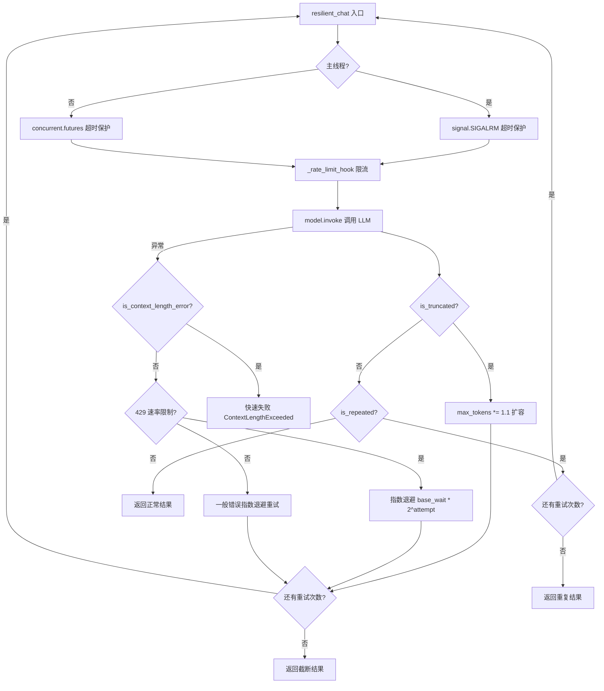
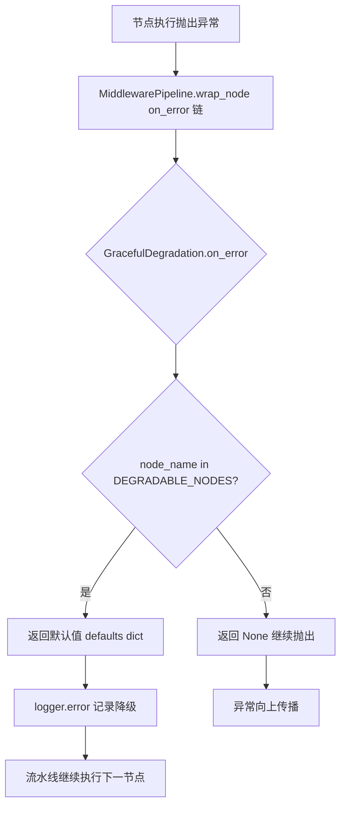

# PD-03.14 vibe-blog — 弹性 LLM 调用与四层防御降级

> 文档编号：PD-03.14
> 来源：vibe-blog `backend/utils/resilient_llm_caller.py`
> GitHub：https://github.com/datawhalechina/vibe-blog.git
> 问题域：PD-03 容错与重试 Fault Tolerance & Retry
> 状态：可复用方案

---

## 第 1 章 问题与动机

### 1.1 核心问题

博客生成流水线包含 7+ 个 LangGraph 节点（researcher → planner → writer → reviewer → revision → coder_and_artist → assembler），每个节点都依赖 LLM 调用。单次生成可能触发 10-20 次 LLM 请求，面临以下容错挑战：

1. **响应截断**：长文写作场景下 max_tokens 不足导致输出被截断，finish_reason="length"
2. **重复输出**：LLM 陷入循环生成相同内容（尾部 50 字符重复 >5 次）
3. **异构错误格式**：OpenAI/Anthropic/Qwen/DeepSeek 的上下文超限错误消息格式各不相同
4. **429 速率限制**：多节点并发调用触发 API 速率限制
5. **同步超时**：LLM 调用阻塞主线程，无法被 asyncio 取消
6. **级联失败**：可选增强节点（factcheck/humanizer）失败不应阻塞核心流水线

### 1.2 vibe-blog 的解法概述

vibe-blog 构建了四层防御体系，从内到外依次为：

1. **resilient_chat() 弹性调用层**（`backend/utils/resilient_llm_caller.py:147`）— 截断扩容 + 重复检测 + 智能错误分类 + 双模式超时保护
2. **GlobalRateLimiter 限流层**（`backend/utils/rate_limiter.py:41`）— 5 域隔离的单例限流器，同步/异步双模式
3. **GracefulDegradationMiddleware 降级层**（`backend/services/blog_generator/middleware.py:439`）— 白名单式节点降级，on_error 钩子链
4. **safe_run 装饰器层**（`backend/utils/safe_run.py:21`）— 函数级降级包装，支持可选重试
5. **CostTracker 预算熔断**（`backend/utils/cost_tracker.py:24`）— USD 成本估算 + 超预算自动中断

### 1.3 设计思想

| 设计原则 | 具体实现 | 理由 | 替代方案 |
|----------|----------|------|----------|
| 错误快速分类 | `is_context_length_error()` 6 种模式匹配，上下文超限直接抛出不重试 | 上下文超限重试无意义，浪费 token 和时间 | 统一重试所有错误（浪费资源） |
| 截断自愈 | `max_tokens *= expand_ratio(1.1)` 逐次扩容 | 比一次性设最大值更节省 token | 固定 max_tokens（要么浪费要么截断） |
| 双模式超时 | 主线程 signal.SIGALRM / 非主线程 concurrent.futures | signal 可中断阻塞 I/O，但仅限主线程 | 纯 threading.Timer（无法中断阻塞调用） |
| 白名单降级 | DEGRADABLE_NODES 字典定义可降级节点及默认返回值 | 声明式配置，新增可降级节点只需加一行 | 每个节点内部 try/except（散落难维护） |
| 多域限流 | 5 个独立域各自配置 min_interval | LLM 和搜索 API 速率限制不同 | 全局统一限流（搜索被 LLM 拖慢） |

---

## 第 2 章 源码实现分析

### 2.1 架构概览

```
┌─────────────────────────────────────────────────────────────────┐
│                    LangGraph DAG Pipeline                       │
│  researcher → planner → writer → reviewer → ... → assembler    │
└──────────┬──────────────────────────────────────────────────────┘
           │ wrap_node()
┌──────────▼──────────────────────────────────────────────────────┐
│              MiddlewarePipeline (middleware.py)                  │
│  ┌─────────────┐ ┌──────────────────┐ ┌─────────────────────┐  │
│  │FeatureToggle│ │ErrorTracking     │ │GracefulDegradation  │  │
│  │ _skip_node  │ │ error_history    │ │ DEGRADABLE_NODES    │  │
│  └─────────────┘ └──────────────────┘ └─────────────────────┘  │
└──────────┬──────────────────────────────────────────────────────┘
           │ 节点内部调用
┌──────────▼──────────────────────────────────────────────────────┐
│              resilient_chat() (resilient_llm_caller.py)          │
│  ┌──────────┐ ┌──────────┐ ┌──────────┐ ┌──────────────────┐  │
│  │截断扩容   │ │重复检测   │ │错误分类   │ │双模式超时保护     │  │
│  │expand 1.1x│ │tail 50ch │ │ctx/429/  │ │SIGALRM/futures  │  │
│  └──────────┘ └──────────┘ │general   │ └──────────────────┘  │
│                             └──────────┘                        │
└──────────┬──────────────────────────────────────────────────────┘
           │ _rate_limit_hook()
┌──────────▼──────────────────────────────────────────────────────┐
│         GlobalRateLimiter (rate_limiter.py)                      │
│  ┌─────┐ ┌──────────────┐ ┌──────────────┐ ┌────────────────┐ │
│  │ llm │ │search_serper │ │search_sogou  │ │search_arxiv    │ │
│  │ 1.0s│ │ 1.0s         │ │ 0.5s         │ │ 3.0s           │ │
│  └─────┘ └──────────────┘ └──────────────┘ └────────────────┘ │
└──────────┬──────────────────────────────────────────────────────┘
           │ record_call()
┌──────────▼──────────────────────────────────────────────────────┐
│         CostTracker (cost_tracker.py)                            │
│  budget_usd=$2.0 → warn | abort                                │
└─────────────────────────────────────────────────────────────────┘
```

### 2.2 核心实现

#### 2.2.1 resilient_chat() — 弹性 LLM 调用主循环



对应源码 `backend/utils/resilient_llm_caller.py:147-264`：

```python
def resilient_chat(
    model,
    messages: list,
    max_retries: int = DEFAULT_MAX_RETRIES,
    base_wait: float = DEFAULT_BASE_WAIT,
    max_wait: float = DEFAULT_MAX_WAIT,
    timeout: int = DEFAULT_LLM_TIMEOUT,
    expand_ratio: float = DEFAULT_EXPAND_RATIO,
    caller: str = "",
) -> Tuple[str, dict]:
    label = f"[{caller}] " if caller else ""
    current_model = model
    _in_main_thread = (
        hasattr(signal, 'SIGALRM')
        and threading.current_thread() is threading.main_thread()
    )
    for attempt in range(max_retries):
        try:
            if _in_main_thread:
                with timeout_guard(timeout):
                    _rate_limit_hook()
                    response = current_model.invoke(messages)
            else:
                _rate_limit_hook()
                pool = concurrent.futures.ThreadPoolExecutor(max_workers=1)
                future = pool.submit(current_model.invoke, messages)
                try:
                    response = future.result(timeout=timeout)
                except concurrent.futures.TimeoutError:
                    future.cancel()
                    pool.shutdown(wait=False, cancel_futures=True)
                    raise LLMCallTimeout(f"LLM 调用超时 ({timeout}s)")
                finally:
                    pool.shutdown(wait=False)
            # 截断检测 → 扩容重试
            if is_truncated(response):
                current_max = _get_max_tokens(current_model)
                new_max = int(current_max * expand_ratio)
                current_model = _set_max_tokens(model, new_max)
                continue
            # 重复检测 → 重试
            if is_repeated(content):
                continue
            return content, metadata
        except Exception as e:
            if is_context_length_error(e):
                raise ContextLengthExceeded(str(e)) from e
            if '429' in str(e):
                wait = min(base_wait * (2 ** attempt), max_wait)
                time.sleep(wait)
                continue
            # 一般错误重试
            wait = min(base_wait * (2 ** attempt), max_wait)
            time.sleep(wait)
```

#### 2.2.2 GracefulDegradationMiddleware — 白名单降级



对应源码 `backend/services/blog_generator/middleware.py:427-457`：

```python
DEGRADABLE_NODES: Dict[str, Dict[str, Any]] = {
    "factcheck": {},
    "humanizer": {},
    "text_cleanup": {},
    "consistency_check_thread": {"thread_issues": []},
    "consistency_check_voice": {"voice_issues": []},
    "summary_generator": {},
    "section_evaluate": {},
}

class GracefulDegradationMiddleware(ExtendedMiddleware):
    def on_error(self, state, node_name, error):
        if os.getenv("GRACEFUL_DEGRADATION_ENABLED", "true").lower() == "false":
            return None
        if node_name in DEGRADABLE_NODES:
            defaults = DEGRADABLE_NODES[node_name]
            logger.error("[GracefulDegradation] %s 异常，降级跳过: %s", node_name, error)
            return defaults
        return None  # 不处理，继续抛出
```

### 2.3 实现细节

**错误分类策略**（`resilient_llm_caller.py:78-89`）：通过 6 种字符串模式匹配检测上下文超限错误，覆盖 OpenAI（"maximum context length"）、Anthropic（"prompt is too long"）、通用格式（"too many tokens"）。这是一种务实的做法——不依赖特定 SDK 的异常类型，而是直接匹配错误消息文本。

**截断检测双格式兼容**（`resilient_llm_caller.py:49-62`）：同时检查 OpenAI 的 `finish_reason="length"` 和 Anthropic 的 `stop_reason="max_tokens"`，通过 `response_metadata` 统一访问。

**限流器指标暴露**（`rate_limiter.py:123-140`）：GlobalRateLimiter 暴露 `get_metrics()` 接口，CostTracker 在生成摘要时聚合限流等待统计，实现限流行为的可观测性。

**预算熔断双模式**（`cost_tracker.py:59-71`）：`COST_BUDGET_ACTION=warn` 仅记录告警，`abort` 则抛出 `BudgetExceededError` 中断生成。这让开发环境可以宽松运行，生产环境严格控制。

**Cron 任务退避调度**（`cron_executor.py:112-125`）：连续失败时取 `max(正常下次执行时间, 退避时间)` 作为下次执行时间，确保退避不会比正常间隔更短。退避阶梯为 30s → 1m → 5m → 15m → 60m。

---

## 第 3 章 迁移指南

### 3.1 迁移清单

**阶段 1：弹性调用层（1 个文件）**
- [ ] 复制 `resilient_llm_caller.py`，适配你的 LLM SDK（LangChain/OpenAI/自定义）
- [ ] 修改 `is_truncated()` 中的 `response_metadata` 访问路径
- [ ] 修改 `is_context_length_error()` 中的模式列表，添加你使用的 Provider 的错误格式
- [ ] 配置环境变量：`LLM_CALL_TIMEOUT`、`LLM_MAX_RETRIES`、`LLM_RETRY_BASE_WAIT`

**阶段 2：限流层（1 个文件）**
- [ ] 复制 `rate_limiter.py`，修改域列表为你的 API 域
- [ ] 在 LLM 调用前插入 `get_global_rate_limiter().wait_sync('llm')`

**阶段 3：降级层（按需）**
- [ ] 如果使用中间件管道：复制 `GracefulDegradationMiddleware`，定义你的 `DEGRADABLE_NODES`
- [ ] 如果使用装饰器：复制 `safe_run.py`，在可选节点上添加 `@safe_run(default_return={})`

**阶段 4：预算熔断（可选）**
- [ ] 复制 `cost_tracker.py`，配置 `COST_BUDGET_USD` 和 `COST_BUDGET_ACTION`

### 3.2 适配代码模板

**最小可用版本 — 弹性调用 + 限流（无中间件依赖）：**

```python
import time
import signal
import threading
import concurrent.futures
import logging
from typing import Tuple
from contextlib import contextmanager

logger = logging.getLogger(__name__)

# ---- 配置 ----
MAX_RETRIES = 3
BASE_WAIT = 5.0
MAX_WAIT = 60.0
TIMEOUT = 180
EXPAND_RATIO = 1.1

CONTEXT_ERROR_PATTERNS = [
    "maximum context length", "context_length_exceeded",
    "max_tokens", "longer than the model",
    "too many tokens", "prompt is too long",
]

class LLMCallTimeout(Exception): pass
class ContextLengthExceeded(Exception): pass

def is_truncated(response) -> bool:
    meta = getattr(response, "response_metadata", {}) or {}
    return meta.get("finish_reason") == "length" or meta.get("stop_reason") == "max_tokens"

def is_context_error(e: Exception) -> bool:
    msg = str(e).lower()
    return any(p in msg for p in CONTEXT_ERROR_PATTERNS)

@contextmanager
def timeout_guard(seconds: int):
    if not hasattr(signal, 'SIGALRM') or threading.current_thread() is not threading.main_thread():
        yield
        return
    def handler(signum, frame):
        raise LLMCallTimeout(f"Timeout ({seconds}s)")
    old = signal.signal(signal.SIGALRM, handler)
    signal.alarm(seconds)
    try:
        yield
    finally:
        signal.alarm(0)
        signal.signal(signal.SIGALRM, old)

def resilient_call(model, messages, caller="") -> Tuple[str, dict]:
    """可直接复用的弹性 LLM 调用函数"""
    current_model = model
    in_main = hasattr(signal, 'SIGALRM') and threading.current_thread() is threading.main_thread()

    for attempt in range(MAX_RETRIES):
        try:
            if in_main:
                with timeout_guard(TIMEOUT):
                    response = current_model.invoke(messages)
            else:
                with concurrent.futures.ThreadPoolExecutor(1) as pool:
                    future = pool.submit(current_model.invoke, messages)
                    try:
                        response = future.result(timeout=TIMEOUT)
                    except concurrent.futures.TimeoutError:
                        raise LLMCallTimeout(f"Timeout ({TIMEOUT}s)")

            content = (response.content or "").strip()
            if is_truncated(response) and attempt < MAX_RETRIES - 1:
                current_model = model.bind(max_tokens=int(_get_max(model) * EXPAND_RATIO))
                time.sleep(BASE_WAIT)
                continue
            return content, {"truncated": is_truncated(response), "attempts": attempt + 1}

        except LLMCallTimeout:
            if attempt < MAX_RETRIES - 1:
                time.sleep(min(BASE_WAIT * 2**attempt, MAX_WAIT))
                continue
            raise
        except Exception as e:
            if is_context_error(e):
                raise ContextLengthExceeded(str(e)) from e
            if attempt < MAX_RETRIES - 1:
                time.sleep(min(BASE_WAIT * 2**attempt, MAX_WAIT))
                continue
            raise

def _get_max(model) -> int:
    for attr in ("max_tokens", "max_output_tokens"):
        v = getattr(model, attr, None)
        if v: return v
    return 4096
```

**safe_run 装饰器模板：**

```python
import functools, logging, time
logger = logging.getLogger(__name__)

def safe_run(default_return=None, max_retries=0, retry_delay=1.0):
    if default_return is None:
        default_return = {}
    def decorator(func):
        @functools.wraps(func)
        def wrapper(self, state, *args, **kwargs):
            for attempt in range(max_retries + 1):
                try:
                    return func(self, state, *args, **kwargs)
                except Exception as e:
                    if attempt < max_retries:
                        time.sleep(retry_delay * 2**attempt)
                        continue
                    logger.error(f"[{func.__name__}] 降级跳过: {e}")
                    state.update(default_return)
                    return state
        return wrapper
    return decorator
```

### 3.3 适用场景

| 场景 | 适用度 | 说明 |
|------|--------|------|
| LLM 驱动的内容生成流水线 | ⭐⭐⭐ | 完美匹配：多节点 DAG + 长文输出 + 可选增强节点 |
| 单次 LLM 调用的 API 服务 | ⭐⭐⭐ | resilient_chat() 可独立使用，无需中间件 |
| 多 Agent 对话系统 | ⭐⭐ | 需要适配对话历史管理，截断扩容逻辑需调整 |
| 实时流式响应场景 | ⭐ | resilient_chat() 是同步调用，流式需要改造 |
| 批量离线处理 | ⭐⭐⭐ | CronExecutor + backoff 调度天然适合 |

---

## 第 4 章 测试用例

```python
import pytest
import time
from unittest.mock import MagicMock, patch, PropertyMock

# ---- resilient_llm_caller 测试 ----

class TestResilientChat:
    """基于 resilient_llm_caller.py 真实函数签名的测试"""

    def _make_response(self, content="ok", finish_reason="stop", stop_reason=None):
        resp = MagicMock()
        resp.content = content
        resp.response_metadata = {"finish_reason": finish_reason}
        if stop_reason:
            resp.response_metadata["stop_reason"] = stop_reason
        return resp

    def test_normal_completion(self):
        """正常完成返回 content + metadata"""
        from utils.resilient_llm_caller import resilient_chat
        model = MagicMock()
        model.invoke.return_value = self._make_response("Hello world")
        content, meta = resilient_chat(model, [{"role": "user", "content": "hi"}], timeout=10)
        assert content == "Hello world"
        assert meta["truncated"] is False
        assert meta["attempts"] == 1

    def test_truncation_triggers_expand(self):
        """截断触发 max_tokens 扩容"""
        from utils.resilient_llm_caller import resilient_chat
        model = MagicMock()
        model.max_tokens = 1000
        model.bind.return_value = model
        # 第一次截断，第二次正常
        model.invoke.side_effect = [
            self._make_response("partial", finish_reason="length"),
            self._make_response("full result"),
        ]
        content, meta = resilient_chat(model, [], max_retries=2, base_wait=0.01, timeout=10)
        assert content == "full result"
        assert meta["attempts"] == 2
        model.bind.assert_called_once_with(max_tokens=1100)  # 1000 * 1.1

    def test_context_length_error_fast_fail(self):
        """上下文超限直接抛出，不重试"""
        from utils.resilient_llm_caller import resilient_chat, ContextLengthExceeded
        model = MagicMock()
        model.invoke.side_effect = Exception("maximum context length exceeded")
        with pytest.raises(ContextLengthExceeded):
            resilient_chat(model, [], max_retries=3, base_wait=0.01, timeout=10)
        assert model.invoke.call_count == 1  # 只调用一次

    def test_429_exponential_backoff(self):
        """429 错误触发指数退避"""
        from utils.resilient_llm_caller import resilient_chat
        model = MagicMock()
        model.invoke.side_effect = [
            Exception("Rate limit 429"),
            Exception("Rate limit 429"),
            self._make_response("ok"),
        ]
        start = time.time()
        content, meta = resilient_chat(model, [], max_retries=3, base_wait=0.01, max_wait=1, timeout=10)
        assert content == "ok"
        assert meta["attempts"] == 3

    def test_repeat_detection(self):
        """重复输出检测"""
        from utils.resilient_llm_caller import is_repeated
        normal = "This is a normal response with varied content."
        assert is_repeated(normal) is False
        repeated = "abc" * 100  # 300 chars, tail "abcabc..." repeats many times
        assert is_repeated(repeated) is True


# ---- safe_run 测试 ----

class TestSafeRun:
    def test_normal_execution(self):
        from utils.safe_run import safe_run
        class Agent:
            @safe_run(default_return={"fallback": True})
            def process(self, state):
                return {"result": "ok"}
        agent = Agent()
        result = agent.process({})
        assert result == {"result": "ok"}

    def test_exception_returns_default(self):
        from utils.safe_run import safe_run
        class Agent:
            @safe_run(default_return={"degraded": True})
            def process(self, state):
                raise RuntimeError("boom")
        agent = Agent()
        state = {}
        result = agent.process(state)
        assert state.get("degraded") is True

    def test_retry_then_degrade(self):
        from utils.safe_run import safe_run
        call_count = 0
        class Agent:
            @safe_run(default_return={}, max_retries=2, retry_delay=0.01)
            def process(self, state):
                nonlocal call_count
                call_count += 1
                raise RuntimeError("fail")
        agent = Agent()
        agent.process({})
        assert call_count == 3  # 1 initial + 2 retries


# ---- GracefulDegradationMiddleware 测试 ----

class TestGracefulDegradation:
    def test_degradable_node_returns_defaults(self):
        from services.blog_generator.middleware import GracefulDegradationMiddleware
        mw = GracefulDegradationMiddleware()
        result = mw.on_error({}, "factcheck", RuntimeError("LLM failed"))
        assert result == {}  # factcheck 的默认返回值

    def test_non_degradable_node_returns_none(self):
        from services.blog_generator.middleware import GracefulDegradationMiddleware
        mw = GracefulDegradationMiddleware()
        result = mw.on_error({}, "writer", RuntimeError("LLM failed"))
        assert result is None  # writer 不在白名单，继续抛出

    def test_degradable_with_custom_defaults(self):
        from services.blog_generator.middleware import GracefulDegradationMiddleware
        mw = GracefulDegradationMiddleware()
        result = mw.on_error({}, "consistency_check_thread", RuntimeError("fail"))
        assert result == {"thread_issues": []}
```

---

## 第 5 章 跨域关联

| 关联域 | 关系类型 | 说明 |
|--------|----------|------|
| PD-01 上下文管理 | 强依赖 | `ContextGuard` 在 LLM 调用前估算 token 数，`is_context_length_error()` 在调用后检测超限。两者形成"预防 + 检测"闭环。`context_compressor.py` 的三级压缩策略是 PD-03 容错的上游防线 |
| PD-02 多 Agent 编排 | 协同 | `MiddlewarePipeline.wrap_node()` 将容错逻辑注入 LangGraph DAG 的每个节点，`GracefulDegradationMiddleware` 确保可选节点失败不阻塞编排流程 |
| PD-04 工具系统 | 协同 | `safe_run` 装饰器可用于工具调用的降级保护，`resilient_chat()` 的 `_rate_limit_hook()` 通过 GlobalRateLimiter 统一管理工具调用频率 |
| PD-10 中间件管道 | 强依赖 | `GracefulDegradationMiddleware` 和 `ErrorTrackingMiddleware` 都是 `MiddlewarePipeline` 的中间件实例，容错能力通过中间件管道注入 |
| PD-11 可观测性 | 协同 | `ErrorTrackingMiddleware` 收集 `_node_errors` 到 `error_history`，`CostTracker` 聚合限流指标，`TaskLogMiddleware` 记录节点耗时。三者共同构成容错行为的可观测性 |

---

## 第 6 章 来源文件索引

| 文件 | 行范围 | 关键实现 |
|------|--------|----------|
| `backend/utils/resilient_llm_caller.py` | L1-275 | 弹性 LLM 调用：截断扩容、重复检测、错误分类、双模式超时 |
| `backend/utils/resilient_llm_caller.py` | L49-62 | `is_truncated()` 双格式截断检测（OpenAI + Anthropic） |
| `backend/utils/resilient_llm_caller.py` | L65-75 | `is_repeated()` 尾部重复检测（50 字符 ×5 次阈值） |
| `backend/utils/resilient_llm_caller.py` | L78-89 | `is_context_length_error()` 6 模式上下文超限检测 |
| `backend/utils/resilient_llm_caller.py` | L92-116 | `timeout_guard()` SIGALRM 超时上下文管理器 |
| `backend/utils/resilient_llm_caller.py` | L147-264 | `resilient_chat()` 主循环：重试 + 退避 + 扩容 |
| `backend/services/blog_generator/middleware.py` | L74-174 | `MiddlewarePipeline` 中间件管道引擎 + `wrap_node()` |
| `backend/services/blog_generator/middleware.py` | L427-457 | `DEGRADABLE_NODES` 白名单 + `GracefulDegradationMiddleware` |
| `backend/services/blog_generator/middleware.py` | L206-223 | `ErrorTrackingMiddleware` 错误收集到 error_history |
| `backend/utils/safe_run.py` | L21-63 | `safe_run()` 装饰器：降级 + 可选重试 |
| `backend/utils/rate_limiter.py` | L41-170 | `GlobalRateLimiter` 单例：5 域隔离 + 同步/异步双模式 |
| `backend/utils/cost_tracker.py` | L24-109 | `CostTracker` 预算熔断：USD 估算 + warn/abort 双模式 |
| `backend/utils/context_guard.py` | L104-232 | `ContextGuard` 上下文守卫：token 估算 + 优先级裁剪 |
| `backend/services/task_queue/backoff.py` | L1-23 | `ERROR_BACKOFF_SCHEDULE` 5 级退避阶梯 |
| `backend/services/task_queue/cron_executor.py` | L22-133 | `CronExecutor` 异步任务执行 + 退避调度 |
| `backend/exceptions.py` | L1-79 | `ErrorSeverity`/`ErrorCategory` 枚举 + `StructuredError` |

---

## 第 7 章 横向对比维度

```json comparison_data
{
  "project": "vibe-blog",
  "dimensions": {
    "截断/错误检测": "双格式截断检测(OpenAI finish_reason + Anthropic stop_reason) + 尾部50字符重复检测 + 6模式上下文超限匹配",
    "重试/恢复策略": "截断→max_tokens×1.1扩容重试；429→指数退避(5s×2^n, 上限60s)；上下文超限→快速失败不重试",
    "超时保护": "主线程signal.SIGALRM可中断阻塞I/O + 非主线程concurrent.futures线程池超时(默认180s)",
    "优雅降级": "DEGRADABLE_NODES白名单7节点 + on_error钩子链 + safe_run装饰器双层降级",
    "错误分类": "三类分流：ContextLengthExceeded快速失败 / 429指数退避 / 一般错误重试",
    "重试策略": "指数退避base_wait×2^attempt + max_wait上限 + 环境变量全局可配",
    "降级方案": "中间件白名单(GracefulDegradation) + 装饰器(@safe_run) + 预算熔断(CostTracker warn/abort)",
    "监控告警": "CostTracker预算告警 + GlobalRateLimiter指标暴露 + ErrorTrackingMiddleware错误历史收集",
    "输出验证": "is_truncated双格式检测 + is_repeated尾部重复检测(50ch×5次阈值)",
    "连接池管理": "GlobalRateLimiter单例5域隔离 + 同步/异步双模式限流 + per-domain独立锁"
  }
}
```

### 域元数据补充

```json domain_metadata
{
  "solution_summary": "vibe-blog 通过 resilient_chat() 实现截断自动扩容(max_tokens×1.1)、6模式上下文超限快速失败、双模式超时保护(SIGALRM+futures)，配合 GracefulDegradationMiddleware 白名单降级和 CostTracker 预算熔断",
  "description": "LLM 调用的截断自愈与多层防御降级体系",
  "sub_problems": [
    "截断扩容方向选择：应增大 max_tokens 而非缩减 prompt，因为内容已生成到一半",
    "主线程与工作线程的超时机制不兼容：signal.SIGALRM 仅限主线程，需要 concurrent.futures 兜底",
    "预算熔断的 warn vs abort 模式选择：开发环境宽松告警，生产环境严格中断",
    "Cron 任务退避与正常调度间隔的取大值：退避时间不应比正常间隔更短"
  ],
  "best_practices": [
    "截断检测要兼容多 Provider 格式：OpenAI finish_reason 和 Anthropic stop_reason 同时检查",
    "上下文超限错误应快速失败不重试：重试只会重复浪费 token",
    "可降级节点用白名单声明式管理：新增降级节点只需加一行配置",
    "限流器按 API 域隔离：LLM 和搜索 API 的速率限制差异大，统一限流会互相拖累"
  ]
}
```
