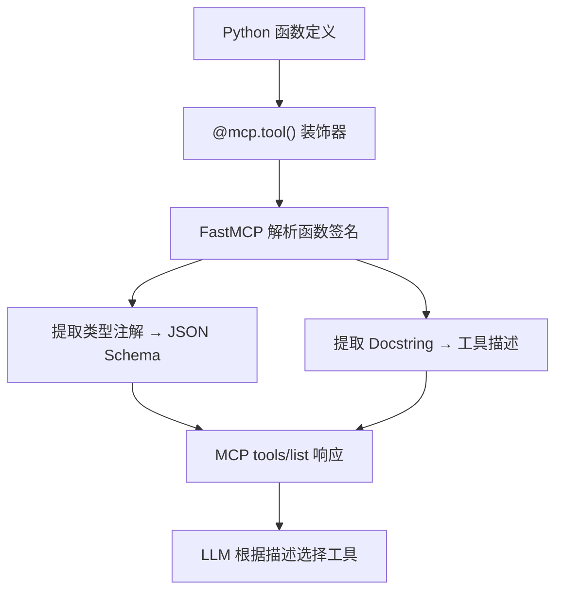
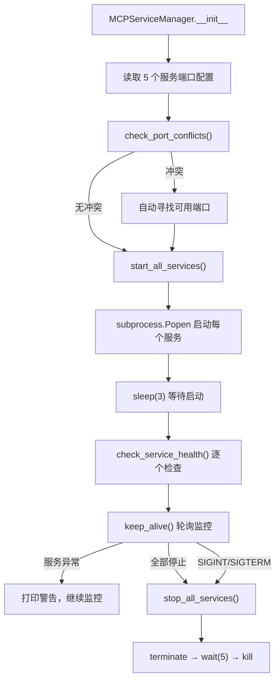
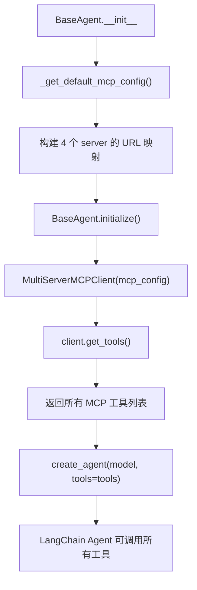

# PD-04.AI-Trader AI-Trader — FastMCP 多服务工具链与 MultiServerMCPClient 统一接入

> 文档编号：PD-04.AI-Trader
> 来源：AI-Trader `agent_tools/start_mcp_services.py`, `agent_tools/tool_trade.py`, `agent/base_agent/base_agent.py`
> GitHub：https://github.com/HKUDS/AI-Trader.git
> 问题域：PD-04 工具系统 Tool System Design
> 状态：可复用方案

---

## 第 1 章 问题与动机

### 1.1 核心问题

金融交易 Agent 需要调用多种异构工具——交易执行、价格查询、新闻搜索、数学计算——每种工具有不同的依赖、运行时要求和安全边界。传统做法是将所有工具函数打包进同一个进程，导致：

1. **进程耦合**：交易工具的文件锁（`fcntl.LOCK_EX`）与搜索工具的网络 I/O 共享同一事件循环，互相阻塞
2. **部署僵化**：新增一个工具需要重启整个 Agent 进程
3. **故障传播**：一个工具的 OOM 或死锁会拖垮所有工具
4. **多市场适配**：美股、A 股、加密货币三种市场的交易规则差异巨大（如 A 股 T+1、100 股整手限制），需要独立的工具服务

AI-Trader 的解法是：**每个工具类别作为独立的 FastMCP HTTP 服务运行，通过 LangChain `MultiServerMCPClient` 在 Agent 侧统一发现和调用**。

### 1.2 AI-Trader 的解法概述

1. **一工具一服务**：每个 `.py` 文件是一个独立的 FastMCP Server，绑定独立端口（`agent_tools/tool_math.py:43` → port 8000, `agent_tools/tool_trade.py:440` → port 8002）
2. **`@mcp.tool()` 装饰器注册**：工具通过 FastMCP 的装饰器声明 schema，Docstring 即 Schema（`agent_tools/tool_trade.py:57-86`）
3. **MCPServiceManager 统一启动**：`agent_tools/start_mcp_services.py:20-297` 实现了 5 个服务的生命周期管理，含端口冲突检测、健康检查、优雅停机
4. **MultiServerMCPClient 统一接入**：`agent/base_agent/base_agent.py:309-328` 通过 `streamable_http` 传输协议连接所有 MCP Server
5. **市场感知工具分组**：交易工具按市场类型分为 `TradeTools`（美股/A 股）和 `CryptoTradeTools`（加密货币），各自独立服务

### 1.3 设计思想

| 设计原则 | 具体实现 | 理由 | 替代方案 |
|----------|----------|------|----------|
| 一工具一进程 | 每个 tool_*.py 独立运行为 HTTP 服务 | 故障隔离 + 独立扩缩容 | 单进程多工具（耦合高） |
| Docstring 即 Schema | `@mcp.tool()` 从函数签名 + docstring 自动生成 JSON Schema | 零冗余，代码即文档 | 手写 JSON Schema（易过时） |
| 环境变量驱动端口 | `os.getenv("TRADE_HTTP_PORT", "8002")` | 多实例部署不冲突 | 硬编码端口（冲突风险） |
| 文件锁保护交易 | `fcntl.flock(LOCK_EX)` 序列化仓位更新 | 并发安全，无需数据库 | 数据库事务（重量级） |
| 运行时配置共享 | `tools/general_tools.py` 的 JSON 文件读写 | 跨进程状态同步 | 环境变量（不可变） |

---

## 第 2 章 源码实现分析

### 2.1 架构概览

AI-Trader 的工具系统分为三层：MCP Server 层（工具实现）、Service Manager 层（进程管理）、Client 层（Agent 接入）。

```
┌─────────────────────────────────────────────────────────────┐
│                    Agent (BaseAgent)                         │
│  ┌───────────────────────────────────────────────────────┐  │
│  │         MultiServerMCPClient (streamable_http)        │  │
│  └──────┬──────────┬──────────┬──────────┬──────────┬────┘  │
│         │          │          │          │          │        │
└─────────┼──────────┼──────────┼──────────┼──────────┼────────┘
          │          │          │          │          │
    :8000/mcp  :8001/mcp  :8002/mcp  :8003/mcp  :8005/mcp
          │          │          │          │          │
   ┌──────┴──┐ ┌────┴────┐ ┌──┴───┐ ┌────┴────┐ ┌──┴──────┐
   │  Math   │ │ Search  │ │Trade │ │  Price  │ │ Crypto  │
   │ add()   │ │get_info │ │buy() │ │get_price│ │buy_cry()│
   │multiply │ │get_news │ │sell()│ │_local() │ │sell_cry │
   └─────────┘ └─────────┘ └──────┘ └─────────┘ └─────────┘
   FastMCP      FastMCP     FastMCP   FastMCP     FastMCP
```

### 2.2 核心实现

#### 2.2.1 FastMCP 工具注册（Docstring 即 Schema）



对应源码 `agent_tools/tool_trade.py:56-86`：

```python
@mcp.tool()
def buy(symbol: str, amount: int) -> Dict[str, Any]:
    """
    Buy stock function

    This function simulates stock buying operations, including the following steps:
    1. Get current position and operation ID
    2. Get stock opening price for the day
    3. Validate buy conditions (sufficient cash, lot size for CN market)
    4. Update position (increase stock quantity, decrease cash)
    5. Record transaction to position.jsonl file

    Args:
        symbol: Stock symbol, such as "AAPL", "MSFT", etc.
        amount: Buy quantity, must be a positive integer, indicating how many shares to buy
                For Chinese A-shares (symbols ending with .SH or .SZ), must be multiples of 100

    Returns:
        Dict[str, Any]:
          - Success: Returns new position dictionary
          - Failure: Returns {"error": error message, ...} dictionary
    """
```

FastMCP 自动从 `symbol: str` 和 `amount: int` 生成 `inputSchema`，从 docstring 生成工具描述。LLM 看到的是标准 MCP `tools/list` 响应，无需手写 JSON Schema。

#### 2.2.2 MCPServiceManager 多服务生命周期管理



对应源码 `agent_tools/start_mcp_services.py:20-43`：

```python
class MCPServiceManager:
    def __init__(self):
        self.services = {}
        self.running = True
        self.ports = {
            "math": int(os.getenv("MATH_HTTP_PORT", "8000")),
            "search": int(os.getenv("SEARCH_HTTP_PORT", "8001")),
            "trade": int(os.getenv("TRADE_HTTP_PORT", "8002")),
            "price": int(os.getenv("GETPRICE_HTTP_PORT", "8003")),
            "crypto": int(os.getenv("CRYPTO_HTTP_PORT", "8005")),
        }
        self.service_configs = {
            "math": {"script": os.path.join(mcp_server_dir, "tool_math.py"),
                     "name": "Math", "port": self.ports["math"]},
            "search": {"script": os.path.join(mcp_server_dir, "tool_alphavantage_news.py"),
                       "name": "Search", "port": self.ports["search"]},
            "trade": {"script": os.path.join(mcp_server_dir, "tool_trade.py"),
                      "name": "TradeTools", "port": self.ports["trade"]},
            "price": {"script": os.path.join(mcp_server_dir, "tool_get_price_local.py"),
                      "name": "LocalPrices", "port": self.ports["price"]},
            "crypto": {"script": os.path.join(mcp_server_dir, "tool_crypto_trade.py"),
                       "name": "CryptoTradeTools", "port": self.ports["crypto"]},
        }
```

关键设计：端口冲突自动解决（`start_mcp_services.py:59-106`），从当前端口开始递增搜索，最多搜索 100 个端口。

#### 2.2.3 MultiServerMCPClient 统一接入



对应源码 `agent/base_agent/base_agent.py:309-328`：

```python
def _get_default_mcp_config(self) -> Dict[str, Dict[str, Any]]:
    """Get default MCP configuration"""
    return {
        "math": {
            "transport": "streamable_http",
            "url": f"http://localhost:{os.getenv('MATH_HTTP_PORT', '8000')}/mcp",
        },
        "stock_local": {
            "transport": "streamable_http",
            "url": f"http://localhost:{os.getenv('GETPRICE_HTTP_PORT', '8003')}/mcp",
        },
        "search": {
            "transport": "streamable_http",
            "url": f"http://localhost:{os.getenv('SEARCH_HTTP_PORT', '8004')}/mcp",
        },
        "trade": {
            "transport": "streamable_http",
            "url": f"http://localhost:{os.getenv('TRADE_HTTP_PORT', '8002')}/mcp",
        },
    }
```

`MultiServerMCPClient` 在 `initialize()` 中一次性连接所有 Server，调用 `get_tools()` 获取全部工具的 schema，然后传给 `create_agent()` 绑定到 LLM。

### 2.3 实现细节

**文件锁保护并发交易**（`agent_tools/tool_trade.py:23-52`）：

交易工具使用 `fcntl.flock(LOCK_EX)` 实现进程级互斥锁，确保同一 signature 的仓位更新是原子的。锁文件路径与仓位文件同目录，通过 context manager 自动释放。

**运行时配置跨进程共享**（`tools/general_tools.py:10-69`）：

所有 MCP Server 和 Agent 通过 `RUNTIME_ENV_PATH` 指向的 JSON 文件共享运行时状态（`TODAY_DATE`、`SIGNATURE`、`IF_TRADE` 等）。`get_config_value()` 每次调用都重新读取文件，确保跨进程一致性。

**市场规则内嵌工具逻辑**（`agent_tools/tool_trade.py:120-128`）：

A 股交易工具内嵌了中国市场特有的业务规则：100 股整手限制和 T+1 卖出限制（`tool_trade.py:377-392`），通过 `_get_today_buy_amount()` 辅助函数计算当日已买入量。

**DeepSeek 兼容层**（`agent/base_agent/base_agent.py:39-94`）：

`DeepSeekChatOpenAI` 子类重写了 `_generate` 和 `_agenerate`，自动修复 DeepSeek API 返回的 `tool_calls.arguments` 为 JSON 字符串而非 dict 的问题。


---

## 第 3 章 迁移指南

### 3.1 迁移清单

**阶段 1：基础 MCP 工具服务化（1 个工具）**

- [ ] 安装 `fastmcp`：`pip install fastmcp`
- [ ] 创建工具文件，用 `@mcp.tool()` 装饰器注册函数
- [ ] 在 `if __name__ == "__main__"` 中启动 HTTP 服务
- [ ] 验证：`curl http://localhost:8000/mcp` 返回 MCP 协议响应

**阶段 2：多服务管理（3+ 工具）**

- [ ] 创建 `ServiceManager` 类管理多个工具进程
- [ ] 实现端口冲突检测和自动分配
- [ ] 实现健康检查（进程存活 + 端口可达）
- [ ] 实现优雅停机（SIGTERM → wait → SIGKILL）

**阶段 3：Agent 集成**

- [ ] 安装 `langchain-mcp-adapters`
- [ ] 配置 `MultiServerMCPClient` 连接所有 MCP Server
- [ ] 调用 `client.get_tools()` 获取工具列表
- [ ] 传入 `create_agent(model, tools=tools)` 创建 Agent

### 3.2 适配代码模板

**最小可运行的 FastMCP 工具服务：**

```python
"""my_tool_server.py — 单文件 MCP 工具服务"""
import os
from typing import Dict, Any
from fastmcp import FastMCP

mcp = FastMCP("MyTools")

@mcp.tool()
def calculate_profit(buy_price: float, sell_price: float, quantity: int) -> Dict[str, Any]:
    """
    Calculate profit from a trade.

    Args:
        buy_price: Purchase price per unit
        sell_price: Selling price per unit
        quantity: Number of units traded

    Returns:
        Dictionary with profit, return_rate, and total_value
    """
    profit = (sell_price - buy_price) * quantity
    return_rate = (sell_price - buy_price) / buy_price * 100 if buy_price > 0 else 0
    return {
        "profit": round(profit, 2),
        "return_rate": f"{return_rate:.2f}%",
        "total_value": round(sell_price * quantity, 2),
    }

if __name__ == "__main__":
    port = int(os.getenv("MY_TOOL_PORT", "8000"))
    mcp.run(transport="streamable-http", port=port)
```

**Agent 侧接入模板：**

```python
"""agent_runner.py — 连接多个 MCP Server 的 Agent"""
import asyncio
from langchain_mcp_adapters.client import MultiServerMCPClient
from langchain.agents import create_agent
from langchain_openai import ChatOpenAI

async def main():
    mcp_config = {
        "tools_a": {
            "transport": "streamable_http",
            "url": "http://localhost:8000/mcp",
        },
        "tools_b": {
            "transport": "streamable_http",
            "url": "http://localhost:8001/mcp",
        },
    }

    client = MultiServerMCPClient(mcp_config)
    tools = await client.get_tools()
    print(f"Loaded {len(tools)} tools")

    model = ChatOpenAI(model="gpt-4o", api_key="...")
    agent = create_agent(model, tools=tools, system_prompt="You are a helpful assistant.")

    result = await agent.ainvoke({"messages": [{"role": "user", "content": "Calculate profit for buying at 100 and selling at 150, 10 units"}]})
    print(result)

asyncio.run(main())
```

### 3.3 适用场景

| 场景 | 适用度 | 说明 |
|------|--------|------|
| 金融交易 Agent | ⭐⭐⭐ | 天然适配：交易、行情、搜索工具需要故障隔离 |
| 多数据源聚合 Agent | ⭐⭐⭐ | 每个数据源一个 MCP Server，独立扩缩容 |
| 研究型 Agent（搜索+计算） | ⭐⭐ | 工具数量少时 overhead 偏高，但架构清晰 |
| 单工具简单 Agent | ⭐ | 过度设计，直接用 LangChain Tool 即可 |
| 需要工具热更新的场景 | ⭐⭐ | 可以重启单个 MCP Server 而不影响其他工具 |

---

## 第 4 章 测试用例

```python
"""test_ai_trader_tool_system.py — AI-Trader 工具系统核心测试"""
import json
import os
import socket
import tempfile
from pathlib import Path
from typing import Dict, Any
from unittest.mock import patch, MagicMock

import pytest


# ============================================================
# 1. FastMCP 工具注册测试
# ============================================================

class TestMCPToolRegistration:
    """测试 @mcp.tool() 装饰器注册行为"""

    def test_tool_schema_from_signature(self):
        """验证 FastMCP 从函数签名生成正确的 JSON Schema"""
        from fastmcp import FastMCP
        mcp = FastMCP("TestTools")

        @mcp.tool()
        def sample_tool(symbol: str, amount: int) -> Dict[str, Any]:
            """Buy stock. Args: symbol: Stock symbol. amount: Quantity."""
            return {"symbol": symbol, "amount": amount}

        # FastMCP 内部维护工具列表
        tools = mcp._tool_manager._tools
        assert "sample_tool" in tools
        tool_def = tools["sample_tool"]
        assert tool_def.fn is sample_tool

    def test_docstring_becomes_description(self):
        """验证 docstring 被提取为工具描述"""
        from fastmcp import FastMCP
        mcp = FastMCP("TestTools")

        @mcp.tool()
        def my_tool(x: float) -> float:
            """Multiply x by 2."""
            return x * 2

        tool_def = mcp._tool_manager._tools["my_tool"]
        assert "Multiply" in (tool_def.description or tool_def.fn.__doc__)


# ============================================================
# 2. 端口冲突检测测试
# ============================================================

class TestPortConflictDetection:
    """测试 MCPServiceManager 的端口冲突检测"""

    def test_available_port_detected(self):
        """未占用端口应返回 True"""
        # 使用一个极大端口号，几乎不会被占用
        sock = socket.socket(socket.AF_INET, socket.SOCK_STREAM)
        sock.bind(("localhost", 0))
        _, port = sock.getsockname()
        sock.close()
        # 端口已释放，应该可用
        test_sock = socket.socket(socket.AF_INET, socket.SOCK_STREAM)
        test_sock.settimeout(1)
        result = test_sock.connect_ex(("localhost", port))
        test_sock.close()
        assert result != 0  # 连接失败 = 端口可用

    def test_occupied_port_detected(self):
        """已占用端口应返回 False"""
        sock = socket.socket(socket.AF_INET, socket.SOCK_STREAM)
        sock.bind(("localhost", 0))
        sock.listen(1)
        _, port = sock.getsockname()
        try:
            test_sock = socket.socket(socket.AF_INET, socket.SOCK_STREAM)
            test_sock.settimeout(1)
            result = test_sock.connect_ex(("localhost", port))
            test_sock.close()
            assert result == 0  # 连接成功 = 端口被占用
        finally:
            sock.close()


# ============================================================
# 3. 运行时配置共享测试
# ============================================================

class TestRuntimeConfigSharing:
    """测试跨进程配置共享机制"""

    def test_write_and_read_config(self):
        """写入配置后应能读取"""
        with tempfile.NamedTemporaryFile(suffix=".json", delete=False) as f:
            tmp_path = f.name

        try:
            with patch.dict(os.environ, {"RUNTIME_ENV_PATH": tmp_path}):
                from tools.general_tools import write_config_value, get_config_value
                write_config_value("TEST_KEY", "test_value")
                assert get_config_value("TEST_KEY") == "test_value"
        finally:
            os.unlink(tmp_path)

    def test_config_isolation_per_file(self):
        """不同文件路径的配置应互相隔离"""
        with tempfile.NamedTemporaryFile(suffix=".json", delete=False) as f1:
            path1 = f1.name
        with tempfile.NamedTemporaryFile(suffix=".json", delete=False) as f2:
            path2 = f2.name

        try:
            with patch.dict(os.environ, {"RUNTIME_ENV_PATH": path1}):
                from tools.general_tools import write_config_value, get_config_value
                write_config_value("KEY", "value_1")

            with patch.dict(os.environ, {"RUNTIME_ENV_PATH": path2}):
                from tools.general_tools import write_config_value, get_config_value
                write_config_value("KEY", "value_2")

            with patch.dict(os.environ, {"RUNTIME_ENV_PATH": path1}):
                assert get_config_value("KEY") == "value_1"
        finally:
            os.unlink(path1)
            os.unlink(path2)


# ============================================================
# 4. 交易工具业务校验测试
# ============================================================

class TestTradeToolValidation:
    """测试交易工具的多层业务校验"""

    def test_negative_amount_rejected(self):
        """负数交易量应被拒绝"""
        # 模拟 buy 函数的参数校验逻辑
        amount = -10
        assert amount <= 0  # 应触发错误返回

    def test_cn_market_lot_size_validation(self):
        """A 股必须 100 股整手交易"""
        symbol = "600519.SH"
        amount = 150
        market = "cn" if symbol.endswith((".SH", ".SZ")) else "us"
        assert market == "cn"
        assert amount % 100 != 0  # 应触发整手限制错误

    def test_us_market_no_lot_restriction(self):
        """美股无整手限制"""
        symbol = "AAPL"
        amount = 7
        market = "cn" if symbol.endswith((".SH", ".SZ")) else "us"
        assert market == "us"
        # 美股任意正整数都合法
        assert amount > 0
```


---

## 第 5 章 跨域关联

| 关联域 | 关系类型 | 说明 |
|--------|----------|------|
| PD-01 上下文管理 | 协同 | 工具返回结果直接注入 LLM 上下文，搜索工具截断内容到 1000 字符（`tool_jina_search.py:254`）控制 token 消耗 |
| PD-02 多 Agent 编排 | 协同 | `main_parrallel.py` 通过子进程并行运行多个 Agent，每个 Agent 独立连接同一组 MCP Server，共享工具但隔离状态 |
| PD-03 容错与重试 | 依赖 | `BaseAgent._ainvoke_with_retry()` 实现指数退避重试（`base_agent.py:423-435`），MCP 连接失败时抛出 RuntimeError 提示启动服务 |
| PD-06 记忆持久化 | 协同 | 交易工具将每笔操作追加到 `position.jsonl`（`tool_trade.py:206-221`），形成完整的交易日志，可作为 Agent 记忆的一部分 |
| PD-09 Human-in-the-Loop | 潜在 | 当前交易工具无确认机制，LLM 可直接执行买卖操作。高风险场景应增加人工确认环节 |
| PD-11 可观测性 | 协同 | 每个交易操作记录到 JSONL 日志（`base_agent.py:413-421`），MCPServiceManager 的 `keep_alive()` 每 5 秒轮询服务状态 |

---

## 第 6 章 来源文件索引

| 文件 | 行范围 | 关键实现 |
|------|--------|----------|
| `agent_tools/start_mcp_services.py` | L20-297 | MCPServiceManager：5 服务生命周期管理、端口冲突检测、健康检查、优雅停机 |
| `agent_tools/tool_trade.py` | L21-441 | TradeTools MCP Server：buy/sell 函数、A 股整手限制、T+1 规则、文件锁 |
| `agent_tools/tool_crypto_trade.py` | L21-335 | CryptoTradeTools MCP Server：buy_crypto/sell_crypto、浮点数量支持 |
| `agent_tools/tool_get_price_local.py` | L16-289 | LocalPrices MCP Server：本地 JSONL 价格查询、日线/小时线自动检测 |
| `agent_tools/tool_jina_search.py` | L213-280 | Search MCP Server（Jina）：网页搜索 + 内容抓取、日期过滤 |
| `agent_tools/tool_alphavantage_news.py` | L219-316 | Search MCP Server（AlphaVantage）：新闻情感分析、ticker 过滤 |
| `agent_tools/tool_math.py` | L11-44 | Math MCP Server：add/multiply 基础计算 |
| `agent/base_agent/base_agent.py` | L106-697 | BaseAgent：MCP 客户端初始化、工具获取、交易循环、DeepSeek 兼容层 |
| `tools/general_tools.py` | L1-179 | 运行时配置共享：JSON 文件读写、对话提取、工具消息提取 |
| `main.py` | L16-37 | AGENT_REGISTRY：Agent 类型动态导入注册表 |

---

## 第 7 章 横向对比维度

> **重要：** 本章用于自动填充 Butcher Wiki 的横向对比表。

```json comparison_data
{
  "project": "AI-Trader",
  "dimensions": {
    "工具注册方式": "FastMCP @mcp.tool() 装饰器，Docstring 即 Schema",
    "工具分组/权限": "按市场类型分组（Trade/Crypto/Price/Search/Math），无权限控制",
    "MCP 协议支持": "原生 FastMCP + streamable-http 传输，MultiServerMCPClient 统一接入",
    "热更新/缓存": "重启单个 MCP Server 即可更新，无工具缓存",
    "超时保护": "LLM 调用 timeout=30s，MCP 服务无显式超时",
    "生命周期追踪": "MCPServiceManager 5 秒轮询进程存活 + 端口可达检查",
    "参数校验": "工具内多层校验：类型转换 → 正数检查 → 市场规则（整手/T+1）",
    "安全防护": "fcntl 文件锁序列化仓位更新，无 SSRF/注入防护",
    "Schema 生成方式": "FastMCP 从 Python 类型注解 + docstring 自动生成",
    "数据供应商路由": "搜索工具可切换 Jina/AlphaVantage，通过 service_configs 配置",
    "供应商降级策略": "无自动降级，搜索工具注释切换（Jina↔AlphaVantage）",
    "工具内业务校验": "A 股 100 股整手 + T+1 卖出限制 + 余额/持仓充足性检查",
    "工具上下文注入": "通过 RUNTIME_ENV_PATH JSON 文件跨进程共享 TODAY_DATE/SIGNATURE"
  }
}
```

### 域元数据补充

```json domain_metadata
{
  "solution_summary": "AI-Trader 用 FastMCP 将交易/行情/搜索/计算四类工具拆为独立 HTTP 服务，通过 LangChain MultiServerMCPClient 统一接入，MCPServiceManager 管理 5 服务生命周期",
  "description": "MCP 多服务架构下的工具进程隔离与统一发现机制",
  "sub_problems": [
    "多 MCP Server 端口冲突自动解决：如何在多服务启动时检测并自动分配可用端口",
    "跨进程运行时配置同步：多个独立 MCP Server 进程如何共享 Agent 运行时状态",
    "市场规则内嵌工具逻辑：交易工具如何内嵌不同市场的业务规则（整手限制、T+1）",
    "LLM 供应商兼容层：如何修复不同 LLM 供应商的 tool_calls 格式差异"
  ],
  "best_practices": [
    "一工具一进程实现故障隔离：单个工具崩溃不影响其他工具服务",
    "环境变量驱动端口配置：避免多实例部署时的端口冲突",
    "文件锁保护并发状态更新：无需数据库即可实现进程级互斥"
  ]
}
```

