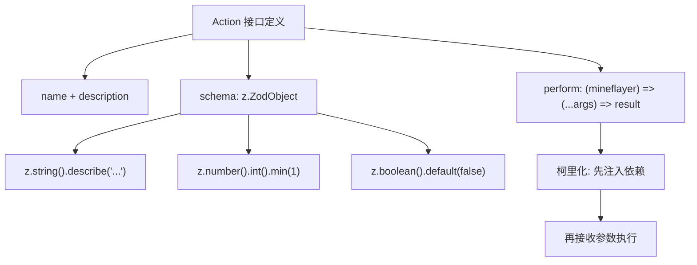
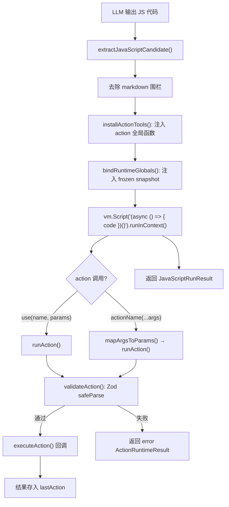
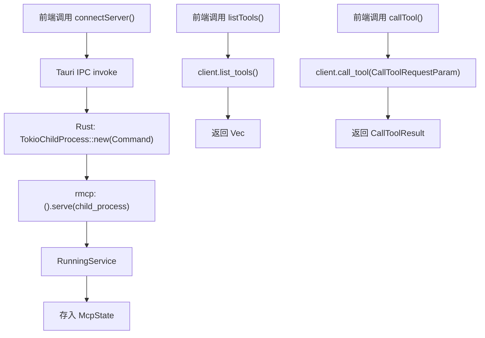

# PD-04.14 AIRI — JS REPL 工具执行层 + Rust 原生 MCP 客户端

> 文档编号：PD-04.14
> 来源：AIRI `services/minecraft/src/cognitive/conscious/js-planner.ts`, `crates/tauri-plugin-mcp/src/lib.rs`
> GitHub：https://github.com/moeru-ai/airi.git
> 问题域：PD-04 工具系统 Tool System Design
> 状态：可复用方案

---

## 第 1 章 问题与动机

### 1.1 核心问题

Agent 工具系统面临两个层面的挑战：

1. **工具执行安全性**：LLM 输出的工具调用指令需要在隔离环境中执行，防止恶意代码影响宿主进程。传统 Function Calling 方案将工具调用限制为 JSON 参数传递，表达力有限——无法在单次调用中组合多个工具、做条件判断或引用上一步结果。
2. **跨语言 MCP 集成**：桌面应用（Tauri/Rust）需要与外部 MCP Server 通信，但 MCP SDK 主要面向 Node.js/Python 生态，Rust 原生客户端方案稀缺。

AIRI 的解法是：用 JavaScript 代码本身作为工具调用的"协议"——LLM 直接输出 JS 代码，在 Node.js `vm` 沙箱中执行，通过预注入的 action 函数调用工具。同时，Tauri 桌面端通过 Rust `rmcp` crate 实现原生 MCP 客户端，经 Tauri IPC 暴露给前端。

### 1.2 AIRI 的解法概述

1. **JS REPL 作为工具执行层**：LLM 输出 JavaScript 代码片段，`JavaScriptPlanner` 在 `vm.Context` 沙箱中执行，每个 action 被注入为全局函数（`services/minecraft/src/cognitive/conscious/js-planner.ts:427-437`）
2. **Zod Schema 驱动的参数校验**：每个 action 用 Zod 定义参数 schema，执行前自动 `safeParse` 校验（`services/minecraft/src/cognitive/action/llm-actions.ts:31-33`）
3. **高阶函数依赖注入**：action 的 `perform` 是 `(mineflayer) => (...args) => result` 的柯里化函数，运行时注入 Mineflayer 实例（`services/minecraft/src/libs/mineflayer/action.ts:14`）
4. **事件驱动的生命周期**：TaskExecutor 在 action 执行前后发射 `action:started`/`action:completed`/`action:failed` 事件（`services/minecraft/src/cognitive/action/task-executor.ts:68-89`）
5. **Rust 原生 MCP 客户端**：`tauri-plugin-mcp` 用 `rmcp` crate 通过 stdio 传输连接 MCP Server，经 Tauri command 暴露 `connectServer`/`listTools`/`callTool` API（`crates/tauri-plugin-mcp/src/lib.rs:50-142`）

### 1.3 设计思想

| 设计原则 | 具体实现 | 理由 | 替代方案 |
|----------|----------|------|----------|
| 代码即协议 | LLM 输出 JS 代码而非 JSON tool_calls | JS 支持条件分支、循环、变量引用，单次调用可组合多个 action | 标准 Function Calling JSON |
| 沙箱隔离 | Node.js `vm.createContext()` + `deepFreeze` 冻结快照 | 防止 LLM 生成的代码修改宿主状态 | Docker 容器、WebAssembly |
| Schema 即文档 | Zod `.describe()` 同时服务校验和 LLM 提示 | 一处定义，校验和描述不会不一致 | 分离的 JSON Schema + 文档 |
| 柯里化注入 | `perform(mineflayer)` 返回执行函数 | 延迟绑定运行时依赖，action 定义保持纯声明式 | 构造函数注入、全局单例 |
| 原生 MCP | Rust `rmcp` crate + Tauri IPC | 桌面应用无需启动 Node.js 进程即可连接 MCP Server | Node.js MCP SDK 子进程 |

---

## 第 2 章 源码实现分析

### 2.1 架构概览

AIRI 的工具系统分为三层：声明层（Action 定义）、执行层（JS REPL 沙箱）、协议层（MCP 客户端）。

```
┌─────────────────────────────────────────────────────────┐
│                      LLM (Brain)                        │
│  输出 JavaScript 代码片段                                │
└──────────────────────┬──────────────────────────────────┘
                       │ JS code string
                       ▼
┌─────────────────────────────────────────────────────────┐
│              JavaScriptPlanner (VM 沙箱)                 │
│  ┌─────────┐  ┌──────────┐  ┌────────────────────┐     │
│  │ skip()  │  │ use()    │  │ goToPlayer(...)    │     │
│  │ log()   │  │ expect() │  │ craftRecipe(...)   │     │
│  │ (内置)   │  │ (内置)   │  │ (动态注入 actions) │     │
│  └─────────┘  └──────────┘  └────────┬───────────┘     │
│                                      │ runAction()      │
│  sandbox: frozen snapshot + mem      │                  │
└──────────────────────────────────────┼──────────────────┘
                                       ▼
┌─────────────────────────────────────────────────────────┐
│              TaskExecutor (事件发射)                      │
│  action:started → ActionRegistry.performAction()        │
│  → action:completed / action:failed                     │
└──────────────────────┬──────────────────────────────────┘
                       ▼
┌─────────────────────────────────────────────────────────┐
│              ActionRegistry (集中注册表)                  │
│  actionsList: 30+ Action { name, schema, perform }      │
│  Zod schema.parse() → perform(mineflayer)(...args)      │
└─────────────────────────────────────────────────────────┘

┌─────────────────────────────────────────────────────────┐
│         tauri-plugin-mcp (Rust MCP 客户端)               │
│  rmcp::RoleClient → stdio → 外部 MCP Server             │
│  Tauri IPC: connectServer / listTools / callTool        │
└─────────────────────────────────────────────────────────┘
```

### 2.2 核心实现

#### 2.2.1 Action 接口与 Zod Schema 定义



对应源码 `services/minecraft/src/libs/mineflayer/action.ts:1-15`：

```typescript
import type { z } from 'zod'
import type { Mineflayer } from './core'

type ActionResult = unknown | Promise<unknown>

export interface Action {
  readonly name: string
  readonly description: string
  readonly schema: z.ZodObject<any>
  readonly readonly?: boolean
  readonly followControl?: 'pause' | 'detach'
  readonly execution?: 'sync' | 'async'
  readonly perform: (mineflayer: Mineflayer) => (...args: any[]) => ActionResult
}
```

具体 action 定义示例 `services/minecraft/src/cognitive/action/llm-actions.ts:140-175`：

```typescript
{
  name: 'goToCoordinate',
  description: 'Go to the given x, y, z location. Uses full A* pathfinding...',
  execution: 'async',
  followControl: 'detach',
  schema: z.object({
    x: z.number().describe('The x coordinate.'),
    y: z.number().describe('The y coordinate.').min(-64).max(320),
    z: z.number().describe('The z coordinate.'),
    closeness: z.number().describe('0 If want to be exactly at the position...').min(0),
  }),
  perform: mineflayer => async (x: number, y: number, z: number, closeness: number) => {
    const selfStart = cloneVec3(mineflayer.bot.entity.position)
    const result = await skills.goToPosition(mineflayer, x, y, z, closeness)
    const selfEnd = cloneVec3(mineflayer.bot.entity.position)
    return {
      ok: result.ok,
      startPos: toCoord(selfStart),
      endPos: toCoord(selfEnd),
      movedDistance: selfStart.distanceTo(selfEnd),
      // ... 丰富的遥测数据
    }
  },
}
```

#### 2.2.2 JS REPL 沙箱执行流程



对应源码 `services/minecraft/src/cognitive/conscious/js-planner.ts:134-180`：

```typescript
public async evaluate(
  content: string,
  availableActions: Action[],
  globals: RuntimeGlobals,
  executeAction: (action: ActionInstruction) => Promise<unknown>,
): Promise<JavaScriptRunResult> {
  const script = extractJavaScriptCandidate(content)
  const run: ActivePlannerRun = {
    actionCount: 0,
    actionsByName: new Map(availableActions.map(action => [action.name, action])),
    executeAction,
    executed: [],
    logs: [],
    sawSkip: false,
  }

  this.activeRun = run
  this.installActionTools(availableActions)
  this.bindRuntimeGlobals(globals, run)

  try {
    const wrapped = `(async () => {\n${script}\n})()`
    const result = await new vm.Script(wrapped).runInContext(
      this.context, { timeout: this.timeoutMs }
    )
    return { actions: run.executed, logs: run.logs, returnValue: ... }
  } finally {
    this.activeRun = null
  }
}
```

#### 2.2.3 Rust MCP 客户端



对应源码 `crates/tauri-plugin-mcp/src/lib.rs:50-76`：

```rust
#[tauri::command]
async fn connect_server(
  state: State<'_, Mutex<McpState>>,
  command: String,
  args: Vec<String>,
) -> Result<(), String> {
  let mut state = state.lock().await;
  if state.client.is_some() {
    return Err("Client already connected".to_string());
  }

  let child_process = TokioChildProcess::new(
    Command::new(command)
      .args(args)
      .stderr(Stdio::inherit())
      .stdout(Stdio::inherit()),
  ).unwrap();

  let service: RunningService<RoleClient, ()> =
    ().serve(child_process).await.unwrap();
  state.client = Some(service);
  Ok(())
}
```

### 2.3 实现细节

**沙箱安全机制**：
- `deepFreeze()` 递归冻结所有注入的快照对象（`js-planner.ts:50-60`），LLM 代码无法修改世界状态
- `toStructuredClone()` 通过 JSON 序列化/反序列化切断原始对象引用（`js-planner.ts:62-64`）
- 内置工具用 `configurable: false` 定义，不可被覆盖；action 工具用 `configurable: true`，支持每次 evaluate 更新（`js-planner.ts:601-627`）
- 750ms 超时保护防止无限循环（`js-planner.ts:127`）
- 每轮最多 5 个 action 调用（`js-planner.ts:128, 522-524`）

**参数映射策略**（`js-planner.ts:487-511`）：
- 单参数 + 对象类型 → 直接作为 params
- 单参数 + 单 schema key → 映射到唯一 key
- 多参数 → 按 schema key 顺序位置映射

**Action 结果遥测**：action 返回丰富的结构化结果（起始位置、终止位置、移动距离、耗时等），供 `expectMoved()`/`expectNear()` 断言验证。


---

## 第 3 章 迁移指南

### 3.1 迁移清单

**阶段 1：Action 声明层**
- [ ] 定义 `Action` 接口（name, description, schema, perform）
- [ ] 用 Zod 为每个工具定义参数 schema，利用 `.describe()` 生成 LLM 提示
- [ ] 实现 `ActionRegistry` 集中管理工具注册和查找
- [ ] 用柯里化 `perform(deps)` 模式注入运行时依赖

**阶段 2：JS REPL 执行层**
- [ ] 创建 `vm.Context` 沙箱，注入 action 函数为全局变量
- [ ] 实现 `deepFreeze` + `toStructuredClone` 保护注入的只读数据
- [ ] 实现参数映射（位置参数 → schema key）
- [ ] 添加超时保护和 action 数量限制
- [ ] 实现内置工具（skip, use, log, expect 系列）

**阶段 3：MCP 集成（可选）**
- [ ] 引入 `rmcp` crate（Rust）或 `@modelcontextprotocol/sdk`（Node.js）
- [ ] 实现 stdio 传输的 MCP 客户端
- [ ] 通过 IPC/API 暴露 connectServer/listTools/callTool

### 3.2 适配代码模板

#### 最小可用的 Action 定义 + Registry

```typescript
import { z } from 'zod'

// 1. Action 接口
interface Action<TDeps = any> {
  readonly name: string
  readonly description: string
  readonly schema: z.ZodObject<any>
  readonly perform: (deps: TDeps) => (...args: any[]) => unknown | Promise<unknown>
}

// 2. 定义具体 action
const searchAction: Action<{ searchClient: SearchClient }> = {
  name: 'search',
  description: 'Search the web for information.',
  schema: z.object({
    query: z.string().describe('The search query.'),
    maxResults: z.number().int().min(1).max(10).default(5)
      .describe('Maximum number of results to return.'),
  }),
  perform: ({ searchClient }) => async (query: string, maxResults: number) => {
    const results = await searchClient.search(query, maxResults)
    return results.map(r => `[${r.title}](${r.url}): ${r.snippet}`).join('\n')
  },
}

// 3. Registry
class ActionRegistry<TDeps> {
  private actions = new Map<string, Action<TDeps>>()
  private deps: TDeps | null = null

  register(action: Action<TDeps>) { this.actions.set(action.name, action) }
  setDeps(deps: TDeps) { this.deps = deps }

  async execute(name: string, params: Record<string, unknown>) {
    const action = this.actions.get(name)
    if (!action) throw new Error(`Unknown action: ${name}`)
    if (!this.deps) throw new Error('Dependencies not set')

    const parsed = action.schema.parse(params)
    const keys = Object.keys((action.schema as any).shape || {})
    const args = keys.map(k => parsed[k])
    return action.perform(this.deps)(...args)
  }

  getAll() { return [...this.actions.values()] }
}
```

#### 最小可用的 JS REPL 沙箱

```typescript
import vm from 'node:vm'

class JsRepl<TDeps> {
  private sandbox: Record<string, unknown> = {}
  private context: vm.Context

  constructor(
    private registry: ActionRegistry<TDeps>,
    private timeoutMs = 750,
    private maxActions = 5,
  ) {
    this.context = vm.createContext(this.sandbox)
  }

  async evaluate(code: string, readonlyData: Record<string, unknown>) {
    let actionCount = 0
    const results: Array<{ tool: string; ok: boolean; result?: unknown; error?: string }> = []

    // 注入只读数据（深冻结）
    for (const [key, value] of Object.entries(readonlyData)) {
      this.sandbox[key] = Object.freeze(JSON.parse(JSON.stringify(value)))
    }

    // 注入 action 函数
    for (const action of this.registry.getAll()) {
      this.sandbox[action.name] = async (...args: unknown[]) => {
        if (++actionCount > this.maxActions)
          throw new Error(`Max ${this.maxActions} actions per turn`)
        try {
          const result = await this.registry.execute(action.name, this.mapArgs(action, args))
          const r = { tool: action.name, ok: true, result }
          results.push(r)
          return r
        } catch (e: any) {
          const r = { tool: action.name, ok: false, error: e.message }
          results.push(r)
          return r
        }
      }
    }

    const wrapped = `(async () => {\n${code}\n})()`
    await new vm.Script(wrapped).runInContext(this.context, { timeout: this.timeoutMs })
    return results
  }

  private mapArgs(action: Action<any>, args: unknown[]): Record<string, unknown> {
    const keys = Object.keys((action.schema as any).shape || {})
    if (args.length === 1 && typeof args[0] === 'object' && args[0] !== null) return args[0] as any
    const params: Record<string, unknown> = {}
    keys.forEach((k, i) => { if (i < args.length) params[k] = args[i] })
    return params
  }
}
```

### 3.3 适用场景

| 场景 | 适用度 | 说明 |
|------|--------|------|
| 游戏 NPC / 机器人 Agent | ⭐⭐⭐ | 最佳场景：action 集固定、需要组合调用、有丰富遥测 |
| 通用 Agent 工具调用 | ⭐⭐⭐ | JS REPL 比 JSON tool_calls 表达力强，适合需要条件逻辑的场景 |
| 桌面应用 MCP 集成 | ⭐⭐⭐ | Tauri + Rust MCP 客户端方案可直接复用 |
| 高安全要求场景 | ⭐⭐ | vm 沙箱有已知逃逸风险，生产环境建议加 Docker 层 |
| 浏览器端 Agent | ⭐ | Node.js vm 模块不可用，需替换为 iframe/Web Worker |

---

## 第 4 章 测试用例

```typescript
import { describe, expect, it, vi } from 'vitest'
import { z } from 'zod'

// 模拟 Action 接口
interface Action {
  name: string
  description: string
  schema: z.ZodObject<any>
  perform: (deps: any) => (...args: any[]) => unknown
}

describe('ActionRegistry', () => {
  const chatAction: Action = {
    name: 'chat',
    description: 'Send a message',
    schema: z.object({
      message: z.string().describe('The message'),
      feedback: z.boolean().default(false),
    }),
    perform: () => (message: string) => `Sent: ${message}`,
  }

  it('should register and execute action with Zod validation', async () => {
    const registry = new Map<string, Action>()
    registry.set('chat', chatAction)

    const action = registry.get('chat')!
    const parsed = action.schema.parse({ message: 'hello' })
    expect(parsed).toEqual({ message: 'hello', feedback: false })

    const result = action.perform(null)('hello')
    expect(result).toBe('Sent: hello')
  })

  it('should reject invalid params via Zod', () => {
    expect(() => chatAction.schema.parse({ message: 123 })).toThrow()
    expect(() => chatAction.schema.parse({})).toThrow()
  })

  it('should apply default values', () => {
    const parsed = chatAction.schema.parse({ message: 'hi' })
    expect(parsed.feedback).toBe(false)
  })
})

describe('JavaScriptPlanner sandbox', () => {
  it('should enforce action count limit', async () => {
    const maxActions = 2
    let count = 0
    const mockAction = async () => {
      if (++count > maxActions) throw new Error(`Max ${maxActions} actions`)
      return { ok: true }
    }

    await mockAction() // 1
    await mockAction() // 2
    await expect(mockAction()).rejects.toThrow('Max 2 actions')
  })

  it('should freeze injected snapshot data', () => {
    const snapshot = { self: { health: 20 } }
    const frozen = Object.freeze(JSON.parse(JSON.stringify(snapshot)))
    expect(() => { (frozen as any).self = {} }).toThrow()
  })

  it('should map positional args to schema keys', () => {
    const schema = z.object({ x: z.number(), y: z.number(), z: z.number() })
    const keys = Object.keys(schema.shape)
    const args = [10, 20, 30]
    const params: Record<string, unknown> = {}
    keys.forEach((k, i) => { params[k] = args[i] })
    expect(params).toEqual({ x: 10, y: 20, z: 30 })
  })
})

describe('MCP client integration', () => {
  it('should format tool list with inputSchema', () => {
    const tools = [{
      name: 'battery_level',
      description: 'Get battery level',
      inputSchema: { required: [], title: 'battery_level', type: 'object' as const, properties: {} },
    }]
    expect(tools[0].inputSchema.type).toBe('object')
    expect(tools[0].name).toBe('battery_level')
  })

  it('should handle callTool result format', () => {
    const result = {
      content: [{ type: 'text', text: '100' }],
      isError: false,
    }
    expect(result.isError).toBe(false)
    expect(result.content[0].text).toBe('100')
  })
})
```


---

## 第 5 章 跨域关联

| 关联域 | 关系类型 | 说明 |
|--------|----------|------|
| PD-01 上下文管理 | 协同 | JS REPL 注入的 `snapshot`/`llmInput` 是上下文窗口的一部分，`deepFreeze` 保证只读；`mem` 对象跨轮次持久化是轻量级上下文记忆 |
| PD-02 多 Agent 编排 | 协同 | Plugin Protocol 的 `spark:command` 事件支持跨 Agent 工具调用指令下发，`interrupt: force/soft` 控制抢占优先级 |
| PD-03 容错与重试 | 依赖 | `ActionRuntimeResult.ok/error` 结构化错误返回让 LLM 可以在下一轮 JS 代码中做条件重试；`ActionError` 区分 `INTERRUPTED`/`RESOURCE_MISSING`/`TARGET_NOT_FOUND` 等错误码 |
| PD-05 沙箱隔离 | 依赖 | `vm.createContext()` 是工具执行的安全边界，`deepFreeze` + `toStructuredClone` + 超时保护构成多层防御 |
| PD-09 Human-in-the-Loop | 协同 | Plugin Protocol 的 `module:configuration:*` 事件流支持配置审批；`spark:command` 的 `guidance.options` 提供多选项供人类决策 |
| PD-10 中间件管道 | 协同 | Plugin Protocol 的 `ModulePhase` 生命周期（announced→preparing→configured→ready）本质是中间件管道模式 |
| PD-11 可观测性 | 协同 | TaskExecutor 的 `action:started/completed/failed` 事件 + action 返回的遥测数据（movedDistance, elapsedMs）提供工具级可观测性 |

---

## 第 6 章 来源文件索引

| 文件 | 行范围 | 关键实现 |
|------|--------|----------|
| `services/minecraft/src/libs/mineflayer/action.ts` | L1-L15 | Action 接口定义（name, schema, perform 柯里化） |
| `services/minecraft/src/cognitive/action/llm-actions.ts` | L26-L411 | 30+ action 声明（Zod schema + perform 实现） |
| `services/minecraft/src/cognitive/action/action-registry.ts` | L10-L69 | ActionRegistry 集中注册表（register, perform, getAction） |
| `services/minecraft/src/cognitive/action/task-executor.ts` | L15-L97 | TaskExecutor 事件驱动执行（started/completed/failed） |
| `services/minecraft/src/cognitive/action/types/index.ts` | L5-L17 | ActionInstruction + PlanStep 类型定义 |
| `services/minecraft/src/cognitive/conscious/js-planner.ts` | L119-L640 | JavaScriptPlanner VM 沙箱（evaluate, installActionTools, runAction） |
| `crates/tauri-plugin-mcp/src/lib.rs` | L1-L169 | Rust MCP 客户端（rmcp + Tauri IPC 四命令） |
| `packages/tauri-plugin-mcp/src/index.ts` | L1-L42 | MCP JS 绑定（connectServer, listTools, callTool） |
| `packages/plugin-protocol/src/types/events.ts` | L1-L1043 | 模块生命周期协议（40+ 事件类型，capability 系统） |

---

## 第 7 章 横向对比维度

```json comparison_data
{
  "project": "AIRI",
  "dimensions": {
    "工具注册方式": "数组声明式 actionsList + ActionRegistry 集中管理，支持 registerAction 动态注册",
    "Schema 生成方式": "Zod z.object() + .describe()，校验与 LLM 提示一体化",
    "MCP 协议支持": "Rust rmcp crate 原生 MCP 客户端，stdio 传输，Tauri IPC 暴露",
    "安全防护": "vm.createContext 沙箱 + deepFreeze 冻结 + 750ms 超时 + 5 action/轮限制",
    "参数校验": "Zod safeParse 前置校验，详细 issue 路径错误信息",
    "生命周期追踪": "TaskExecutor EventEmitter 发射 action:started/completed/failed",
    "工具上下文注入": "柯里化 perform(mineflayer) 延迟绑定 + sandbox 全局变量注入",
    "依赖注入": "高阶函数柯里化 perform(deps) => (...args) => result",
    "工具集动态组合": "每次 evaluate 重新 installActionTools，action 用 configurable:true 可更新",
    "结果摘要": "action 返回结构化遥测（startPos/endPos/movedDistance/elapsedMs）",
    "JS-REPL 代码即协议": "LLM 输出 JS 代码在 vm 沙箱执行，支持条件分支和多 action 组合",
    "模块能力声明": "Plugin Protocol ModuleCapability + contribute:capability:offer 事件"
  }
}
```

```json domain_metadata
{
  "solution_summary": "AIRI 用 Node.js vm 沙箱作为工具执行层，LLM 输出 JS 代码直接调用预注入的 action 函数，Zod schema 驱动参数校验；Tauri 端通过 Rust rmcp crate 实现原生 MCP 客户端",
  "description": "代码即工具协议：用编程语言代替 JSON 作为工具调用的表达层",
  "sub_problems": [
    "JS REPL 沙箱逃逸防护：vm.Context 已知逃逸向量的缓解策略",
    "位置参数到命名参数映射：LLM 生成的函数调用如何自动对齐 schema key 顺序",
    "跨轮次沙箱状态：mem 对象如何在多次 evaluate 间持久化而不泄露",
    "action 遥测标准化：工具返回的结构化遥测数据如何统一格式供断言验证",
    "Rust 原生 MCP 客户端：非 Node.js 环境如何实现 MCP 协议客户端"
  ],
  "best_practices": [
    "用 Zod .describe() 同时服务参数校验和 LLM 工具描述，避免两处维护",
    "冻结注入数据：deepFreeze + structuredClone 双重保护防止沙箱内修改宿主状态",
    "action 返回结构化遥测而非纯文本，支持程序化断言验证（expectMoved/expectNear）",
    "内置工具 configurable:false 不可覆盖，动态 action configurable:true 可更新"
  ]
}
```

