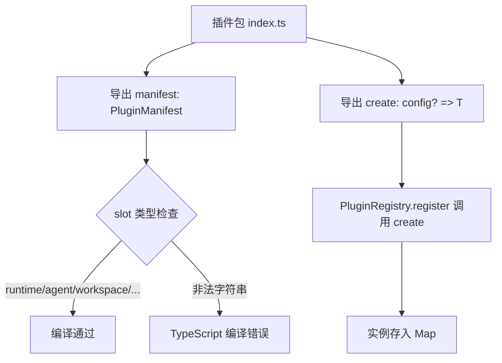
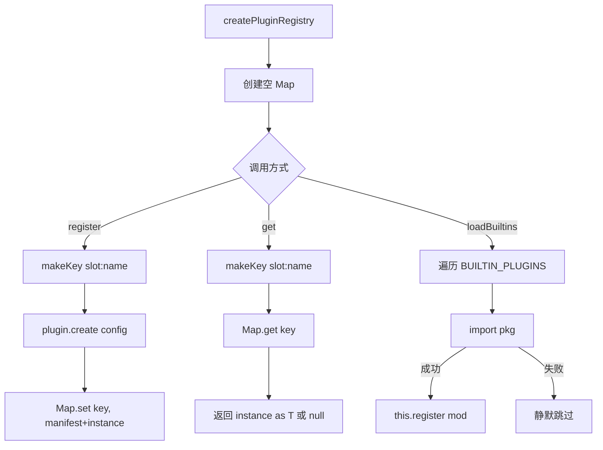

# PD-04.06 Agent-Orchestrator — 8 槽位插件注册表架构

> 文档编号：PD-04.06
> 来源：Agent-Orchestrator `packages/core/src/plugin-registry.ts`, `packages/core/src/types.ts`
> GitHub：https://github.com/ComposioHQ/agent-orchestrator.git
> 问题域：PD-04 工具系统 Tool System Design
> 状态：可复用方案

---

## 第 1 章 问题与动机

### 1.1 核心问题

Agent 编排系统需要同时管理多种异构组件——运行时环境（tmux/Docker/K8s）、AI 编码工具（Claude Code/Codex/Aider）、代码隔离（worktree/clone）、Issue 追踪（GitHub/Linear）、SCM 平台（GitHub/GitLab）、通知渠道（Desktop/Slack/Webhook）、终端 UI（iTerm2/Web）。这些组件的共同特征是：

1. **同一职责有多种实现**：例如 Runtime 可以是 tmux 也可以是 Docker
2. **需要按配置动态选择**：不同项目可能用不同的 Agent 或 Workspace 策略
3. **实现可能缺失**：用户未安装某个插件包时系统应优雅降级
4. **需要统一的发现和查找机制**：SessionManager、LifecycleManager 等核心服务需要按 slot+name 查找插件实例

传统做法是硬编码 if-else 或 switch-case，但这在 7 个维度 × 17+ 实现的组合下完全不可维护。

### 1.2 Agent-Orchestrator 的解法概述

Agent-Orchestrator 设计了一套 **8 槽位（Slot）插件架构**：

1. **PluginSlot 类型约束**：7 个可插拔槽位（runtime/agent/workspace/tracker/scm/notifier/terminal）+ 1 个核心不可插拔的 Lifecycle Manager（`packages/core/src/types.ts:917-924`）
2. **PluginManifest + PluginModule 接口**：每个插件导出 manifest（name/slot/description/version）和 create() 工厂函数（`types.ts:927-945`）
3. **PluginRegistry 注册表**：内部用 `Map<"slot:name", instance>` 存储，提供 register/get/list/loadBuiltins/loadFromConfig 五个方法（`plugin-registry.ts:62-119`）
4. **BUILTIN_PLUGINS 静态列表**：17 个内置插件的 slot/name/npm-package 映射，loadBuiltins 遍历并 try-catch 加载（`plugin-registry.ts:26-50`）
5. **CLI 注入 import 上下文**：核心包无法解析插件包（pnpm 严格依赖），CLI 将自己的 `import()` 传入 loadFromConfig，解决模块解析问题（`create-session-manager.ts:29-32`）

### 1.3 设计思想

| 设计原则 | 具体实现 | 理由 | 替代方案 |
|----------|----------|------|----------|
| 槽位约束 | 7 个 PluginSlot 联合类型 | 防止注册到不存在的槽位，编译期检查 | 自由字符串（无类型安全） |
| 工厂模式 | create(config?) 延迟实例化 | 注册时才创建实例，支持传入配置 | 直接导出单例（无法配置） |
| slot:name 复合键 | `${slot}:${name}` 作为 Map key | 同名插件可存在于不同槽位（如 github 同时是 tracker 和 scm） | 全局唯一名（命名冲突） |
| 优雅降级 | loadBuiltins 中 try-catch 跳过 | 未安装的插件不阻塞启动 | 启动时强制检查（脆弱） |
| 依赖倒置 | importFn 参数注入 | 解决 pnpm 严格模块解析 | 把所有插件放入 core 的 deps（耦合） |

---

## 第 2 章 源码实现分析

### 2.1 架构概览

Agent-Orchestrator 的插件系统分为三层：类型定义层、注册表层、消费层。

```
┌─────────────────────────────────────────────────────────────────┐
│                        消费层                                    │
│  SessionManager    LifecycleManager    CLI Commands             │
│  registry.get<Runtime>("runtime","tmux")                        │
│  registry.get<Agent>("agent","claude-code")                     │
└──────────────────────────┬──────────────────────────────────────┘
                           │ get<T>(slot, name)
┌──────────────────────────▼──────────────────────────────────────┐
│                    PluginRegistry                                │
│  Map<"slot:name", {manifest, instance}>                         │
│  register() | get() | list() | loadBuiltins() | loadFromConfig()│
└──────────────────────────┬──────────────────────────────────────┘
                           │ import(pkg) + create(config)
┌──────────────────────────▼──────────────────────────────────────┐
│                    17 个内置插件                                  │
│  ┌─────────┐ ┌──────────┐ ┌───────────┐ ┌─────────┐            │
│  │ Runtime  │ │  Agent   │ │ Workspace │ │ Tracker │ ...        │
│  │ tmux     │ │ claude   │ │ worktree  │ │ github  │            │
│  │ process  │ │ codex    │ │ clone     │ │ linear  │            │
│  │          │ │ aider    │ │           │ │         │            │
│  └─────────┘ └──────────┘ └───────────┘ └─────────┘            │
│  每个导出: { manifest, create } satisfies PluginModule<T>        │
└─────────────────────────────────────────────────────────────────┘
```

### 2.2 核心实现

#### 2.2.1 PluginModule 接口与 PluginSlot 类型



对应源码 `packages/core/src/types.ts:917-945`：

```typescript
/** Plugin slot types */
export type PluginSlot =
  | "runtime"
  | "agent"
  | "workspace"
  | "tracker"
  | "scm"
  | "notifier"
  | "terminal";

/** Plugin manifest — what every plugin exports */
export interface PluginManifest {
  name: string;
  slot: PluginSlot;
  description: string;
  version: string;
}

/** What a plugin module must export */
export interface PluginModule<T = unknown> {
  manifest: PluginManifest;
  create(config?: Record<string, unknown>): T;
}
```

每个插件包的默认导出必须满足 `PluginModule<T>` 约束。以 runtime-tmux 为例（`packages/plugins/runtime-tmux/src/index.ts:184`）：

```typescript
export default { manifest, create } satisfies PluginModule<Runtime>;
```

`satisfies` 关键字确保编译期类型检查，同时保留字面量类型推断。

#### 2.2.2 PluginRegistry 注册表实现



对应源码 `packages/core/src/plugin-registry.ts:18-119`：

```typescript
/** Map from "slot:name" → plugin instance */
type PluginMap = Map<string, { manifest: PluginManifest; instance: unknown }>;

function makeKey(slot: PluginSlot, name: string): string {
  return `${slot}:${name}`;
}

export function createPluginRegistry(): PluginRegistry {
  const plugins: PluginMap = new Map();

  return {
    register(plugin: PluginModule, config?: Record<string, unknown>): void {
      const { manifest } = plugin;
      const key = makeKey(manifest.slot, manifest.name);
      const instance = plugin.create(config);
      plugins.set(key, { manifest, instance });
    },

    get<T>(slot: PluginSlot, name: string): T | null {
      const entry = plugins.get(makeKey(slot, name));
      return entry ? (entry.instance as T) : null;
    },

    list(slot: PluginSlot): PluginManifest[] {
      const result: PluginManifest[] = [];
      for (const [key, entry] of plugins) {
        if (key.startsWith(`${slot}:`)) {
          result.push(entry.manifest);
        }
      }
      return result;
    },

    async loadBuiltins(
      orchestratorConfig?: OrchestratorConfig,
      importFn?: (pkg: string) => Promise<unknown>,
    ): Promise<void> {
      const doImport = importFn ?? ((pkg: string) => import(pkg));
      for (const builtin of BUILTIN_PLUGINS) {
        try {
          const mod = (await doImport(builtin.pkg)) as PluginModule;
          if (mod.manifest && typeof mod.create === "function") {
            const pluginConfig = orchestratorConfig
              ? extractPluginConfig(builtin.slot, builtin.name, orchestratorConfig)
              : undefined;
            this.register(mod, pluginConfig);
          }
        } catch {
          // Plugin not installed — that's fine, only load what's available
        }
      }
    },
  };
}
```

关键设计点：
- `makeKey()` 用 `slot:name` 复合键，允许 "github" 同时注册为 `tracker:github` 和 `scm:github`（`plugin-registry.ts:21-23`）
- `loadBuiltins()` 的 try-catch 确保单个插件加载失败不影响其他插件（`plugin-registry.ts:102-104`）
- `importFn` 参数允许调用方注入自己的模块解析上下文（`plugin-registry.ts:91-92`）

#### 2.2.3 BUILTIN_PLUGINS 静态注册表

`packages/core/src/plugin-registry.ts:26-50` 定义了 17 个内置插件的映射：

```typescript
const BUILTIN_PLUGINS: Array<{ slot: PluginSlot; name: string; pkg: string }> = [
  { slot: "runtime",   name: "tmux",       pkg: "@composio/ao-plugin-runtime-tmux" },
  { slot: "runtime",   name: "process",    pkg: "@composio/ao-plugin-runtime-process" },
  { slot: "agent",     name: "claude-code", pkg: "@composio/ao-plugin-agent-claude-code" },
  { slot: "agent",     name: "codex",      pkg: "@composio/ao-plugin-agent-codex" },
  { slot: "agent",     name: "aider",      pkg: "@composio/ao-plugin-agent-aider" },
  { slot: "workspace", name: "worktree",   pkg: "@composio/ao-plugin-workspace-worktree" },
  { slot: "workspace", name: "clone",      pkg: "@composio/ao-plugin-workspace-clone" },
  { slot: "tracker",   name: "github",     pkg: "@composio/ao-plugin-tracker-github" },
  { slot: "tracker",   name: "linear",     pkg: "@composio/ao-plugin-tracker-linear" },
  { slot: "scm",       name: "github",     pkg: "@composio/ao-plugin-scm-github" },
  { slot: "notifier",  name: "composio",   pkg: "@composio/ao-plugin-notifier-composio" },
  { slot: "notifier",  name: "desktop",    pkg: "@composio/ao-plugin-notifier-desktop" },
  { slot: "notifier",  name: "slack",      pkg: "@composio/ao-plugin-notifier-slack" },
  { slot: "notifier",  name: "webhook",    pkg: "@composio/ao-plugin-notifier-webhook" },
  { slot: "terminal",  name: "iterm2",     pkg: "@composio/ao-plugin-terminal-iterm2" },
  { slot: "terminal",  name: "web",        pkg: "@composio/ao-plugin-terminal-web" },
];
```

npm 包命名遵循 `@composio/ao-plugin-{slot}-{name}` 约定，使包名即可推断槽位和名称。

### 2.3 实现细节

#### 插件消费：resolvePlugins 模式

SessionManager 通过 `resolvePlugins()` 函数按项目配置解析所需插件（`packages/core/src/session-manager.ts:212-225`）：

```typescript
function resolvePlugins(project: ProjectConfig, agentOverride?: string) {
  const runtime = registry.get<Runtime>("runtime", project.runtime ?? config.defaults.runtime);
  const agent = registry.get<Agent>("agent", agentOverride ?? project.agent ?? config.defaults.agent);
  const workspace = registry.get<Workspace>("workspace", project.workspace ?? config.defaults.workspace);
  const tracker = project.tracker
    ? registry.get<Tracker>("tracker", project.tracker.plugin)
    : null;
  const scm = project.scm ? registry.get<SCM>("scm", project.scm.plugin) : null;
  return { runtime, agent, workspace, tracker, scm };
}
```

这里体现了三层优先级：`agentOverride > project.agent > config.defaults.agent`。

#### CLI 注入 import 上下文

`packages/cli/src/lib/create-session-manager.ts:25-37` 展示了 pnpm 严格模式下的解决方案：

```typescript
async function getRegistry(config: OrchestratorConfig): Promise<PluginRegistry> {
  if (!registryPromise) {
    registryPromise = (async () => {
      const registry = createPluginRegistry();
      // Pass CLI's import context so pnpm strict resolution can find plugin packages
      await registry.loadFromConfig(config, (pkg: string) => import(pkg));
      return registry;
    })();
  }
  return registryPromise;
}
```

核心包 `@composio/ao-core` 的 `package.json` 不依赖任何插件包，因此 core 内部的 `import("@composio/ao-plugin-*")` 会失败。CLI 包将所有插件列为 workspace 依赖，通过传入自己的 `import()` 函数解决了这个问题。同时用 Promise 缓存避免并发初始化竞争。

#### 插件标准导出模式

每个插件包遵循统一的导出结构（以 `packages/plugins/runtime-tmux/src/index.ts` 为例）：

```typescript
export const manifest = {
  name: "tmux",
  slot: "runtime" as const,
  description: "Runtime plugin: tmux sessions",
  version: "0.1.0",
};

export function create(): Runtime {
  return {
    name: "tmux",
    async create(config: RuntimeCreateConfig): Promise<RuntimeHandle> { /* ... */ },
    async destroy(handle: RuntimeHandle): Promise<void> { /* ... */ },
    async sendMessage(handle: RuntimeHandle, message: string): Promise<void> { /* ... */ },
    // ...
  };
}

export default { manifest, create } satisfies PluginModule<Runtime>;
```

`as const` 确保 slot 字面量类型，`satisfies` 确保整体结构符合 PluginModule 接口。

---

## 第 3 章 迁移指南

### 3.1 迁移清单

**阶段 1：定义插件接口（1 天）**
- [ ] 确定你的系统需要哪些"槽位"（如 LLM Provider / Tool / Storage / Notifier）
- [ ] 为每个槽位定义 TypeScript 接口（参考 Agent-Orchestrator 的 Runtime/Agent/Workspace 等）
- [ ] 定义 PluginSlot 联合类型和 PluginManifest 接口
- [ ] 定义 PluginModule<T> 泛型接口（manifest + create 工厂）

**阶段 2：实现注册表（0.5 天）**
- [ ] 实现 createPluginRegistry() 工厂函数
- [ ] 实现 register/get/list 三个核心方法
- [ ] 实现 loadBuiltins 批量加载（含 try-catch 优雅降级）
- [ ] 编写注册表单元测试

**阶段 3：迁移现有实现为插件（按需）**
- [ ] 将现有硬编码实现提取为独立包
- [ ] 每个包导出 `{ manifest, create } satisfies PluginModule<T>`
- [ ] 在 BUILTIN_PLUGINS 列表中注册
- [ ] 更新消费方代码使用 `registry.get<T>(slot, name)`

### 3.2 适配代码模板

以下是一个可直接复用的最小插件注册表实现：

```typescript
// ============================================================
// types.ts — 插件类型定义
// ============================================================

/** 定义你的系统需要的槽位 */
export type PluginSlot = "provider" | "tool" | "storage" | "notifier";

export interface PluginManifest {
  name: string;
  slot: PluginSlot;
  description: string;
  version: string;
}

export interface PluginModule<T = unknown> {
  manifest: PluginManifest;
  create(config?: Record<string, unknown>): T;
}

export interface PluginRegistry {
  register(plugin: PluginModule, config?: Record<string, unknown>): void;
  get<T>(slot: PluginSlot, name: string): T | null;
  list(slot: PluginSlot): PluginManifest[];
  loadBuiltins(importFn?: (pkg: string) => Promise<unknown>): Promise<void>;
}

// ============================================================
// plugin-registry.ts — 注册表实现
// ============================================================

type PluginEntry = { manifest: PluginManifest; instance: unknown };
type PluginMap = Map<string, PluginEntry>;

function makeKey(slot: PluginSlot, name: string): string {
  return `${slot}:${name}`;
}

/** 内置插件列表 — 按需修改 */
const BUILTIN_PLUGINS: Array<{ slot: PluginSlot; name: string; pkg: string }> = [
  { slot: "provider", name: "openai", pkg: "@myorg/plugin-provider-openai" },
  { slot: "provider", name: "anthropic", pkg: "@myorg/plugin-provider-anthropic" },
  { slot: "tool", name: "search", pkg: "@myorg/plugin-tool-search" },
  { slot: "storage", name: "sqlite", pkg: "@myorg/plugin-storage-sqlite" },
];

export function createPluginRegistry(): PluginRegistry {
  const plugins: PluginMap = new Map();

  return {
    register(plugin: PluginModule, config?: Record<string, unknown>): void {
      const key = makeKey(plugin.manifest.slot, plugin.manifest.name);
      plugins.set(key, { manifest: plugin.manifest, instance: plugin.create(config) });
    },

    get<T>(slot: PluginSlot, name: string): T | null {
      const entry = plugins.get(makeKey(slot, name));
      return entry ? (entry.instance as T) : null;
    },

    list(slot: PluginSlot): PluginManifest[] {
      return [...plugins.values()]
        .filter(e => e.manifest.slot === slot)
        .map(e => e.manifest);
    },

    async loadBuiltins(importFn?: (pkg: string) => Promise<unknown>): Promise<void> {
      const doImport = importFn ?? ((pkg: string) => import(pkg));
      for (const builtin of BUILTIN_PLUGINS) {
        try {
          const mod = (await doImport(builtin.pkg)) as PluginModule;
          if (mod.manifest && typeof mod.create === "function") {
            this.register(mod);
          }
        } catch {
          // 插件未安装，静默跳过
        }
      }
    },
  };
}
```

插件包模板：

```typescript
// @myorg/plugin-provider-openai/src/index.ts
import type { PluginModule } from "@myorg/core";
import type { Provider } from "@myorg/core";

export const manifest = {
  name: "openai",
  slot: "provider" as const,
  description: "LLM Provider: OpenAI",
  version: "0.1.0",
};

export function create(config?: Record<string, unknown>): Provider {
  const apiKey = config?.apiKey as string ?? process.env.OPENAI_API_KEY ?? "";
  return {
    name: "openai",
    async complete(prompt: string): Promise<string> {
      // 实际实现...
      return "";
    },
  };
}

export default { manifest, create } satisfies PluginModule<Provider>;
```

### 3.3 适用场景

| 场景 | 适用度 | 说明 |
|------|--------|------|
| 多 Agent 编排系统 | ⭐⭐⭐ | 需要支持多种 AI 工具（Claude/GPT/Codex）时完美适用 |
| 多运行时环境 | ⭐⭐⭐ | 需要在 tmux/Docker/K8s 间切换时 |
| 多通知渠道 | ⭐⭐⭐ | Desktop/Slack/Webhook 等多渠道推送 |
| 单一工具系统 | ⭐ | 只有一种实现时过度设计 |
| 需要热更新的系统 | ⭐⭐ | 当前方案不支持运行时热加载，需扩展 |
| 需要插件间通信的系统 | ⭐ | 当前方案插件间无直接通信机制 |

---

## 第 4 章 测试用例

基于 `packages/core/src/__tests__/plugin-registry.test.ts` 的真实测试模式：

```python
import pytest
from typing import Any, Optional, Protocol
from dataclasses import dataclass
from enum import Enum


class PluginSlot(str, Enum):
    RUNTIME = "runtime"
    AGENT = "agent"
    WORKSPACE = "workspace"
    TRACKER = "tracker"


@dataclass
class PluginManifest:
    name: str
    slot: PluginSlot
    description: str
    version: str


class PluginModule(Protocol):
    manifest: PluginManifest
    def create(self, config: Optional[dict] = None) -> Any: ...


class PluginRegistry:
    def __init__(self):
        self._plugins: dict[str, tuple[PluginManifest, Any]] = {}

    def _key(self, slot: PluginSlot, name: str) -> str:
        return f"{slot.value}:{name}"

    def register(self, plugin: PluginModule, config: Optional[dict] = None) -> None:
        key = self._key(plugin.manifest.slot, plugin.manifest.name)
        instance = plugin.create(config)
        self._plugins[key] = (plugin.manifest, instance)

    def get(self, slot: PluginSlot, name: str) -> Any:
        entry = self._plugins.get(self._key(slot, name))
        return entry[1] if entry else None

    def list(self, slot: PluginSlot) -> list[PluginManifest]:
        return [m for k, (m, _) in self._plugins.items() if k.startswith(f"{slot.value}:")]


class FakePlugin:
    def __init__(self, slot: PluginSlot, name: str):
        self.manifest = PluginManifest(name=name, slot=slot, description=f"Test {name}", version="0.1.0")
        self.last_config = None

    def create(self, config=None):
        self.last_config = config
        return {"name": self.manifest.name, "config": config}


class TestPluginRegistry:
    """核心注册表功能测试"""

    def test_register_and_get(self):
        registry = PluginRegistry()
        plugin = FakePlugin(PluginSlot.RUNTIME, "tmux")
        registry.register(plugin)
        instance = registry.get(PluginSlot.RUNTIME, "tmux")
        assert instance is not None
        assert instance["name"] == "tmux"

    def test_get_returns_none_for_unregistered(self):
        registry = PluginRegistry()
        assert registry.get(PluginSlot.RUNTIME, "nonexistent") is None

    def test_config_passed_to_create(self):
        registry = PluginRegistry()
        plugin = FakePlugin(PluginSlot.WORKSPACE, "worktree")
        registry.register(plugin, {"worktreeDir": "/custom/path"})
        assert plugin.last_config == {"worktreeDir": "/custom/path"}
        instance = registry.get(PluginSlot.WORKSPACE, "worktree")
        assert instance["config"] == {"worktreeDir": "/custom/path"}

    def test_same_name_different_slots(self):
        """github 可以同时是 tracker 和 scm（不同槽位）"""
        registry = PluginRegistry()
        tracker = FakePlugin(PluginSlot.TRACKER, "github")
        agent = FakePlugin(PluginSlot.AGENT, "github")
        registry.register(tracker)
        registry.register(agent)
        assert registry.get(PluginSlot.TRACKER, "github") is not None
        assert registry.get(PluginSlot.AGENT, "github") is not None
        assert registry.get(PluginSlot.RUNTIME, "github") is None

    def test_overwrite_same_slot_name(self):
        registry = PluginRegistry()
        plugin1 = FakePlugin(PluginSlot.RUNTIME, "tmux")
        plugin2 = FakePlugin(PluginSlot.RUNTIME, "tmux")
        registry.register(plugin1)
        registry.register(plugin2)
        # 后注册的覆盖前者
        instance = registry.get(PluginSlot.RUNTIME, "tmux")
        assert instance is not None

    def test_list_filters_by_slot(self):
        registry = PluginRegistry()
        registry.register(FakePlugin(PluginSlot.RUNTIME, "tmux"))
        registry.register(FakePlugin(PluginSlot.RUNTIME, "process"))
        registry.register(FakePlugin(PluginSlot.WORKSPACE, "worktree"))
        runtimes = registry.list(PluginSlot.RUNTIME)
        assert len(runtimes) == 2
        names = [m.name for m in runtimes]
        assert "tmux" in names
        assert "process" in names

    def test_list_empty_slot(self):
        registry = PluginRegistry()
        assert registry.list(PluginSlot.TRACKER) == []

    def test_graceful_degradation_on_missing_plugin(self):
        """消费方获取不存在的插件时返回 None，不抛异常"""
        registry = PluginRegistry()
        result = registry.get(PluginSlot.AGENT, "nonexistent-agent")
        assert result is None
```

---

## 第 5 章 跨域关联

| 关联域 | 关系类型 | 说明 |
|--------|----------|------|
| PD-02 多 Agent 编排 | 协同 | PluginRegistry 的 agent 槽位直接服务于多 Agent 编排——SessionManager 通过 `registry.get<Agent>()` 获取不同 AI 工具的适配器，实现 Claude Code/Codex/Aider 的统一调度 |
| PD-05 沙箱隔离 | 协同 | workspace 槽位（worktree/clone）提供代码隔离能力，runtime 槽位（tmux/process）提供执行环境隔离，两者共同构成沙箱隔离的基础设施 |
| PD-09 Human-in-the-Loop | 协同 | notifier 槽位和 terminal 槽位直接服务于人机交互——Notifier 推送事件通知，Terminal 提供人类查看/操作会话的界面 |
| PD-11 可观测性 | 依赖 | Agent 插件的 `getSessionInfo()` 方法提取 cost/summary 信息，LifecycleManager 通过 `registry.get<Agent>()` 获取这些数据用于可观测性追踪 |
| PD-10 中间件管道 | 互补 | Agent-Orchestrator 的插件系统是"槽位选择"模式（选择哪个实现），而非"管道串联"模式（多个中间件依次处理）。两种模式互补：槽位选择决定用谁，管道串联决定怎么处理 |

---

## 第 6 章 来源文件索引

| 文件 | 行范围 | 关键实现 |
|------|--------|----------|
| `packages/core/src/types.ts` | L917-L924 | PluginSlot 联合类型定义（7 个槽位） |
| `packages/core/src/types.ts` | L927-L945 | PluginManifest + PluginModule 接口 |
| `packages/core/src/types.ts` | L1015-L1036 | PluginRegistry 接口定义 |
| `packages/core/src/types.ts` | L1-L16 | 8 槽位架构注释文档 |
| `packages/core/src/types.ts` | L197-L220 | Runtime 接口（槽位 1） |
| `packages/core/src/types.ts` | L262-L316 | Agent 接口（槽位 2） |
| `packages/core/src/types.ts` | L379-L399 | Workspace 接口（槽位 3） |
| `packages/core/src/types.ts` | L422-L451 | Tracker 接口（槽位 4） |
| `packages/core/src/types.ts` | L494-L545 | SCM 接口（槽位 5） |
| `packages/core/src/types.ts` | L645-L656 | Notifier 接口（槽位 6） |
| `packages/core/src/types.ts` | L679-L690 | Terminal 接口（槽位 7） |
| `packages/core/src/plugin-registry.ts` | L1-L119 | PluginRegistry 完整实现 |
| `packages/core/src/plugin-registry.ts` | L18-L23 | PluginMap 类型 + makeKey 函数 |
| `packages/core/src/plugin-registry.ts` | L26-L50 | BUILTIN_PLUGINS 17 个内置插件列表 |
| `packages/core/src/plugin-registry.ts` | L62-L119 | createPluginRegistry 工厂函数 |
| `packages/core/src/session-manager.ts` | L212-L225 | resolvePlugins 插件解析函数 |
| `packages/core/src/session-manager.ts` | L326-L330 | Agent 插件运行时覆盖 |
| `packages/core/src/lifecycle-manager.ts` | L185-L192 | LifecycleManager 中的插件消费 |
| `packages/cli/src/lib/create-session-manager.ts` | L25-L37 | CLI 注入 import 上下文 |
| `packages/plugins/agent-claude-code/src/index.ts` | L173-L178 | Claude Code Agent 插件 manifest |
| `packages/plugins/agent-claude-code/src/index.ts` | L781-L785 | 标准 PluginModule 导出 |
| `packages/plugins/runtime-tmux/src/index.ts` | L19-L24 | tmux Runtime 插件 manifest |
| `packages/plugins/runtime-tmux/src/index.ts` | L41-L184 | tmux Runtime 完整实现 |
| `packages/core/src/__tests__/plugin-registry.test.ts` | L1-L199 | 注册表单元测试 |

---

## 第 7 章 横向对比维度

```json comparison_data
{
  "project": "Agent-Orchestrator",
  "dimensions": {
    "工具注册方式": "PluginModule 接口 + PluginRegistry slot:name 键值注册",
    "工具分组/权限": "7 个 PluginSlot 类型约束分组，配置级选择",
    "MCP 协议支持": "无 MCP，插件通过 npm 包 + TypeScript 接口集成",
    "热更新/缓存": "不支持热更新，启动时一次性加载并缓存 Promise",
    "超时保护": "无插件级超时，由各插件自行实现（如 tmux execFile timeout）",
    "生命周期追踪": "LifecycleManager 轮询 Agent.getActivityState 追踪 6 态",
    "参数校验": "TypeScript 编译期类型检查 + satisfies 约束",
    "安全防护": "tmux sessionId 正则校验，插件加载 try-catch 隔离",
    "Schema 生成方式": "TypeScript 接口即 Schema，无运行时生成",
    "工具推荐策略": "YAML 配置 defaults + 项目级覆盖，三层优先级",
    "双层API架构": "无双层，统一 PluginModule 接口",
    "结果摘要": "Agent 插件 getSessionInfo 从 JSONL 提取 summary",
    "槽位架构": "8 槽位（7 可插拔 + 1 核心），17 个内置实现",
    "依赖注入": "importFn 参数注入解决 pnpm 严格模块解析"
  }
}
```

### 域元数据补充

```json domain_metadata
{
  "solution_summary": "Agent-Orchestrator 用 7 个 PluginSlot 类型 + slot:name 复合键 Map 注册表管理 17 个内置插件，loadBuiltins try-catch 优雅降级，CLI 注入 import 上下文解决 pnpm 严格依赖",
  "description": "插件系统的槽位约束与模块解析策略",
  "sub_problems": [
    "槽位命名冲突：同名插件在不同槽位的共存策略",
    "模块解析注入：monorepo 严格依赖下如何让核心包加载插件包",
    "插件配置传递：注册时如何将全局配置映射为插件特定配置"
  ],
  "best_practices": [
    "用 satisfies 关键字约束插件导出，保留字面量类型推断",
    "插件加载用 try-catch 逐个包裹，单个失败不阻塞系统启动",
    "npm 包名编码槽位信息（@scope/plugin-{slot}-{name}），包名即可推断归属"
  ]
}
```
